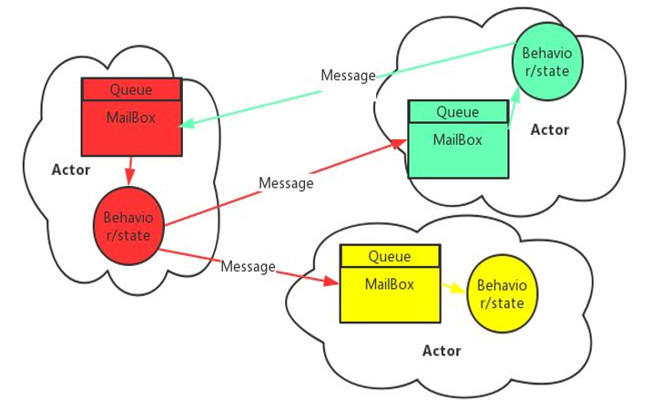
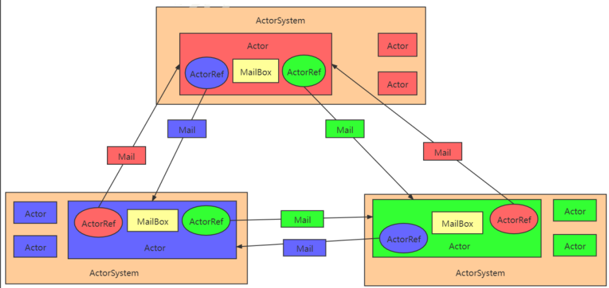
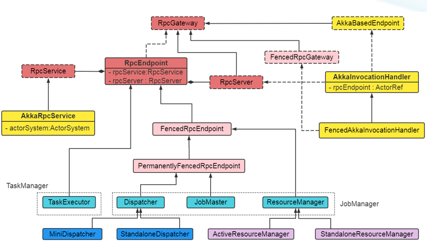
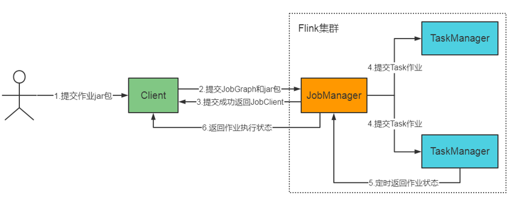
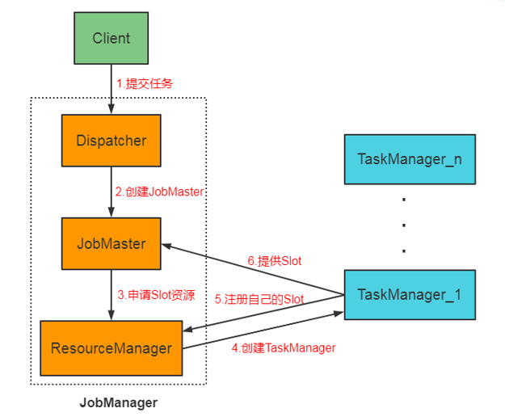
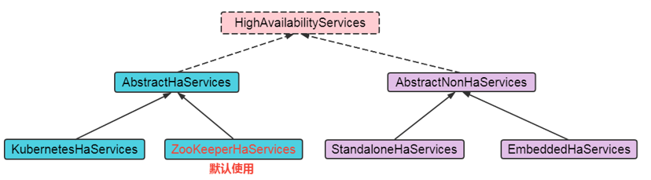
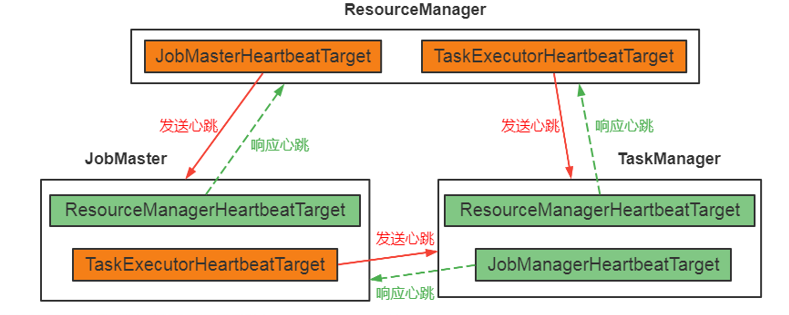
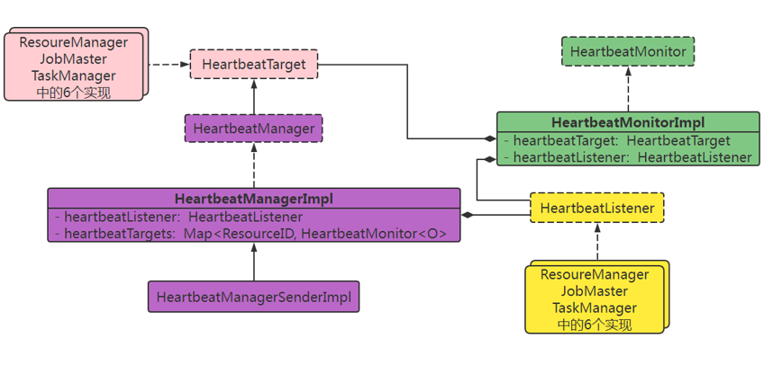
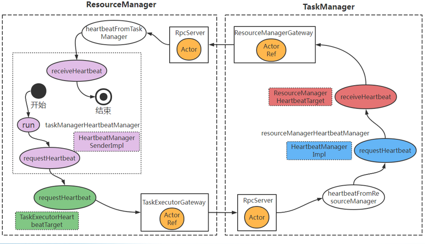

> 源码常见注解

在阅读Flink源码时，记住常用的有`@internal`、`@public`、`@publicevolving`这三个注释就够了。 参考文档
https://leonardbang.github.io/2019/07/10/Flink-%E8%AF%A6%E8%A7%A3%E6%BA%90%E7%A0%81%E4%B8%AD%E7%9A%84%E6%B3%A8%E8%A7%A3/

@Internal：该注解标识方法是稳定的，或公有的API是一个内部开发者级别的API。开发者级别的API是稳定的但只对Flink内部开放，但可能会通过版本发布改变。
@Public：该注解标识类是公有的，接口是稳定的。使用该注解的类、方法、属性在小版本中(1.0,1.1,1.2)是稳定的,但在大版本(1.0,2.0,3.0)中可能会破坏。
@PublicEvolving：该注解标识类和方法是公有的，但是有不断演变的接口。添加该注解的类和方法通常不会使用`Public` 注解 具有该注解的类和方法表明是公有和稳定的。但是，它们的接口和签名并不被认为是稳定的，可能会随着版本发布而变化。


#  RPC组件架构设计与实现


## Akka

Flink RPC基于Akka开发设计实现。Akka是用Scala语言写的、可以很容易的在JVM上构建高并发和分布式应用的工具包，同时支持使用Java和Scala两种语言进行开发。它是一个异步、非阻塞、高性能的事件驱动模型的网络编程框架。
Akka官方文档：

https://doc.akka.io/docs/akka/current/typed/guide/index.html

https://guobinhit.github.io/akka-guide/

可以把Akka看成Java中的Netty框架。

### Actor   

在开始介绍Akka之前，首先需要对其理论Actor Model进行了解。Actor Model是计算机领域并行计算的数学模型，由Hewitt, Bishop 和 Steiger在1973年提出，Gul Agha在1986年发表学术报告“Actors: A Model of Concurrent Computation in Distributed Systems”。
    Actor封装了状态（state）和行为（behavior），它们之间通过邮箱（mailbox）进行通信，这3部分是Actor的基本要素：
1）State：状态指Actor对象的变量信息，由Actor自己管理，避免了并发环境下的锁和内存原子性等问题；
2）Behavior：行为是Actor中的计算逻辑，通过接收到的消息来改变Actor的状态；
3）Mailbox：邮箱是Actor和Actor之间的通信桥梁，邮箱内部通过消息队列来存储发送方的Actor消息，接收方Actor从邮箱队列中获取消息。每个Actor有且仅有一个邮箱，所有的发来的消息都在邮箱里排队。



### Child Actor

 如果一个Actor的功能过于庞大和复杂，管理和维护起来会比较麻烦，因此希望将其任务分成更小、更易于管理的部分，这个时候就有了Child Actor的概念。
    Actor Model的精髓在于将任务分拆，直到一个任务小到可以被完整处理，然后将其委托给负责的Actor。这样做不仅任务本身结构清晰，更让每个Actor各司其职，对某一类消息都有对应的Actor负责处理及响应。
    这样Actor就形成了层级结构，每个Actor都由其父Actor创建，由其父Actor分配资源、任务、管理其生命周期。
    所有的Actor都有一个共同的父Actor，叫做Root guardian（根监护人），同时Akka还有两个内置的Actor：System guardian和User guardian。类似于Linux的层级目录结构。

### ActorRef

   Actor有自己的生命周期，当一个Actor不在被引用时，其不会自动销毁，而是由创建者负责管理它的整个生命周期。
    Actor对象需要与外界隔离才符合Actor model的设计思想。因此Actor是以ActorRef的形式展现给外界的，外界通过ActorRef可以透明的操作Actor。这种内外分离的好处是：Actor的内部实现和状态不会对外暴露、Actor重启不用更新ActorRef等。ActorRef可以看成Actor的代理对象。
    可以通过 ActorContext.getSelf() 获取ActorRef。ActorRef有多种实现，如：
1）Local ActorRef：仅能访问本地的Actor，不能发送网络消息；
2）Remote ActorRef：可以通过网络消息访问远程JVM的Actor。

### Actor System

Actor作为任务的执行者，总需要一个系统去统一的组织和管理它们，在Akka中即为ActorSystem。如果把Akka比作一个公司的话，Actor就是员工，ActorSystem就是公司的管理者。ActorSystem需要制定整个公司的发展计划，还需要将工作分配给相应的工作人员去完成，保障整个公司的正确运转，其实这里也体现了软件设计中的分而治之，Actor Model中的核心思想也是这样。ActorSystem主要有以下功能：
1）管理调度服务、分发服务；
2）配置相关参数；
3）日志功能；

【注】ActorSystem是一个重量级结构，它内部会分配多个线程，所以每个应用程序最好只有一个ActorSystem。




### Actor Path

  由于Actor是严格按照层级结构进行创建和组织的，因此可以用一个唯一的名字序列来定位每个Actor，在Akka中称为Path。
    一个Actor Path包含一个锚点(anchor)，用来标识Actor系统的，之后是各路径元素，从根监护人到指定的Actor，路径元素是路径经过的Actor的名字，以"/"分隔。例如：
	"akka://my-sys/user/service-a/worker1"        // 本地path
	"akka.tcp://my-sys@host:5678/user/service-b"  // 远程path
“my-sys”为Actor System的名称。
    通过Actor Path创建一个本地或远程Actor，就可以与其进行通信了。


### Akka Java demo

参考http://www.manongjc.com/article/43738.html

https://developer.lightbend.com/start/?group=akka&project=akka-quickstart-java  # 点击CREATE A PROJECT FOR ME!

```xml
<dependency>
    <groupId>com.typesafe.akka</groupId>
    <artifactId>akka-actor-typed_2.13</artifactId>
    <version>2.6.19</version>
</dependency>
```

```java
package akka;

import akka.actor.AbstractActor;
import akka.actor.ActorRef;
import akka.actor.ActorSystem;
import akka.actor.Props;

public class HelloWorldAkka {

    public static class PutinActor extends AbstractActor {
        @Override
        public Receive createReceive() {
            return receiveBuilder().match(String.class, message->{
                System.out.println("I'm Putin, I received message of: " + message);
            }).build();
        }
    }

    public static class TrumpActor extends AbstractActor {
        @Override
        public Receive createReceive() {
            return receiveBuilder().match(String.class, message-> {
                System.out.println("I'm Trump, I received message of: " + message);
            }).build();
        }
    }

    public static void main(String[] args) {
        // 1. create instance of "ActorSystem";
        ActorSystem actorSystem = ActorSystem.create("hello_world");

        // 2. create two actors;
        ActorRef putinActor = actorSystem.actorOf(Props.create(PutinActor.class), "putin");
        ActorRef trumpActor = actorSystem.actorOf(Props.create(TrumpActor.class), "trump");

        System.out.println(putinActor.path());
        System.out.println(trumpActor.path());

        // 3. send message to each other.
        putinActor.tell("Merry christmas! cocksucker!", trumpActor);
        putinActor.tell("Merry christmas too! Bitch!", putinActor);

        // 4. destroy the instance of "ActorSystem";
        actorSystem.terminate();
    }
}

```


### Akka总结

1、ActorSystem是管理Actor的组件，Actor是负责进行通信的组件；
2、每个 Actor 都有一个 MailBox，别的 Actor 发送给它的消息都首先储存在 MailBox 中，通过这种方式可以实现异步通信；
3、每个 Actor 是单线程的处理方式，不断的从 MailBox 拉取消息执行处理，所以对于 Actor 的消息处理，不适合调用会阻塞的处理方法；
4、Actor 可以改变他自身的状态，可以接收消息，也可以发送消息，还可以生成新的 Actor；
5、每一个 ActorSystem 和 Actor都在启动的时候会给定一个name，如果要从 ActorSystem 中，获取一个 Actor，则需要通过 Actor Path进行获取；
6、如果一个 Actor 要和另外一个 Actor 进行通信，则必须先获取对方 Actor 的 ActorRef 对象，然后通过该对象发送消息即可；
7、通过 tell 发送异步消息，不接收响应，通过 ask 发送异步消息，得到 Future 返回，通过异步回到返回处理结果。


## Flink RPC组件

Flink内部节点之间的通信是用Akka，比如JobManager和TaskManager之间的通信。而算子之间的数据传输则是利用Netty。

flink 8081 web页面=>TaskManagers页面,每个taskmanager都有一个actor path
例如：akka.tcp://flink@127.0.0.1:48619/user/rpc/taskmanager_0

### RPC组件

Flink 中的 RPC 实现主要在 flink-rpc 模块下的 org.apache.flink.runtime.rpc 包中，涉及到下面4个重要的类和接口：
1）RpcGateway：RPC网关。所有RPC通信相关的组件，都要实现该接口。该接口是远程调用的代理接口；
2）RpcEndpoint：RPC endpoints的基类，提供RPC调用的所有分布式组件都必须要继承该类。RpcEndpoint通过RpcService生成了一个RpcServer，其基本上代理了RpcServer，它对外暴露的方法，最终都是调用RpcServer的方法。
3）RpcService：RPC服务管理接口。用于启动、暂停、连接RpcServer等。RpcService是对 ActorSystem 的封装，其实现类 AkkaRpcService 持有 ActorSystem的引用；
4）RpcServer：继承了RpcGateway接口，代表一个RPC服务端。其实现类 AkkaInvocationHandler 持有ActorRef的引用，可以与远程的Actor进行通信（ask、tell）。

|           | **功能组件**                                                 | **引用/代理**         | **系统组件**   |
| --------- | ------------------------------------------------------------ | --------------------- | -------------- |
| Akka      | Actor                                                        | ActorRef              | ActorSystem    |
| Flink RPC | RpcEndpoint                                                  | RpcServer             | RpcService     |
| 实现类    | JobMaster<br />ResourceManager<br />Dispatcher<br />TaskExecutor | AkkaInvocationHandler | AkkaRpcService |

Flink中，最重要的三个 RpcEndpoint：
1）JobMaster：主控程序，类似于 Spark 中的 Driver；或者 MapReduce 中的 MRAppMaster；
2）ResourceManager：集群中的主节点。JobManager 中的负责资源管理的角色，和 TaskExecutor 一起构成资源管理的主从架构；
3）TaskExecutor：集群中从节点中最重要的角色，负责任务执行。


### RPC UML(很重要)




## Flink Runtime

参考： https://nightlies.apache.org/flink/flink-docs-release-1.15/docs/concepts/flink-architecture/

​	Flink runtime（运行时）的代码主要在 flink-runtime 模块下的 org.apache.flink.runtime 包中，是Flink集群运行的核心代码，里面包含了很多服务和组件的实现，是深入了解Flink内部运行机制的首选。
​    Flink runtime由两种类型的进程组成：一个JobManager(Master)和一个或者多个TaskManager(Worker)。JobManager和TaskManager可以通过多种方式启动：直接在机器上作为standalone集群启动、在容器中启动、或者通过YARN等资源框架管理并启动。TaskManager连接到JobManager上，宣布(announce)自己
可用，这样JobManager就可以为其分配工作了。
​    客户端Client不是Flink运行时和程序执行的一部分，而是用于准备数据流(dataflow)并将其发送给JobManager。之后，客户端可以断开连接(detached模式)或保持连接(attached模式)来接收进度报告。客户端可以以Java/Scala程序的方式运行，也可以通过命令行 ./bin/flink run .... 的方式运行



​	

### JobManager	

**JobManager**用于协调Flink应用程序的分布式执行，主要职责有：**资源管理、Task调度、对执行完成或失败的Task做出响应、协调checkpoints、协调故障恢复**等。集群中至少要有一个JobManager实例，如果是HA设置，则可以有多个实例，但是只能有一个是leader，其他实例都是standby。
    JobManager其实是一个统称，其内部根据功能拆分成了3个大的组件：JobMaster、 ResourceManager、 Dispatcher。

​	每个Job都有一个自己的JobMaster。

​	ResourceManager负责集群中资源的供给、分配和回收。Flink里面资源是以TaskManager提供的Slot形式存在的，所以其实就是管理Slot。TaskManager启动后会向ResourceManager报告自己的Slot情况，并且通过心跳和通知机制定期更新。
​    之所以把资源管理这个模块单独出来，是因为资源管理框架已经很多了（但功能、实现、使用又有差异），比如YARN、Mesos、Kubernetes。独立出来以后，方便分别实现支持不同框架的ResourceManager 。
​    ResourceManager有以下特性：
​		1）它是无状态的，因为它的数据都是别人主动报告给它的，所以重启后可以重新获取；
​		2）故障后不影响已经在运行的任务；
​		3）**ResourceManager一个集群只有一个。**

​	Dispatcher的主要任务是接收Client提交上来的Job，它提供了一个REST接口，用来提交Flink应用程序执行，并为每个提交的作业启动一个新的JobMaster，之后将Job交给JobMaster去调度管理。同时它还负责运行 Flink WebUI 用来提供作业执行信息。
​    Dispatcher组件负责接收Job提交、持久化Job、让JobManagers执行Job、在Master出现故障时恢复Job。
​    **Dispatcher一个集群只有一个。**


### TaskManager	

​	TaskManager也称为worker，用来执行数据流的task，并且缓存和交换数据流。它本身是一个 RPC 服务端，提供了**任务提交、任务取消等接口**，同时包含 JobLeaderService、TaskSlot 管理、资源管理、心跳检测、存储服务等。
​    必须至少要有一个TaskManager实例，TaskManager中资源调度的最小单位是task slot，task slot的数量表示并发处理task的数量。 
​	代码中TaskManager实现类是TaskExecutor

> task和subtask

1、Task：在Flink中，每个算子都可以作为一个Task来执行，这些Task可以分布在不同的机器上、被不同的线程执行。同一JVM中的Task共享TCP连接（多路复用）和心跳信息。它们还可以共享数据集和数据结构，从而减少了每个Task的开销。**每一个task由一个专用线程运行**

2、Subtask：如果某些算子要并行执行，则就有了subtask的概念了，subtask是task并行执行实例中的一个，subtask是可调度、可运行的执行单元。每个算子的subtask之间都是彼此独立的，并在不同的线程中执行，并且可能在不同的机器或容器上执行。subtask的数量就是算子的并行度，同一程序的不同算子也可能具有不同的并行度。所以说Task是一个阶段多个功能相同subtask的集合。

> Operator Chain

算子和算子之间如果数据流是一对一的，那么会把算子绑定在一起形成一个算子链

keyBy重新分区 或者 改变算子的并行度 等操作会打破算子链
调用 startNewChain() 方法，开启一个新的算子链；
调用 diableChaining() 方法，告诉当前算子操作不使用算子链操作

> slot

 	Slot是Flink中计算资源进行隔离的单元，每个Slot代表TaskManager中资源的固定子集。假如一个TaskManager有三个Slot，那么它会将其管理的内存平均分成三份给各个Slot。资源Slot化意味着一个subtask将不需要跟其他的subtask竞争被管理的内存，Slot目前仅用来隔离task的受管理的内存，没有做CPU隔离。
 	同一个Task的多个subtask不能运行在一个Slot中，否则就失去了并行的意义，它们会分配到不同的Slot中。一个Slot可以同时运行来自同一个Job不同Task阶段的subtask，这就是【Slot共享】，这样可以更高的利用资源，确保IO密集型和计算密集型的subtask可以在TaskManager之间公平分配。有了Slot共享，一个Slot就可以拥有这个Job的所有Task阶段，形成一个完整的pipeline。

​	比如，一个Job有source、window、sink三个阶段，对应三个不同的算子，也就有三个task(sourceTask, windowTask, sinkTask)，如果这三个算子的并行度分别为：3、2、1，就说明sourceTask有3个subtask、windowTask有2个subtask、sinkTask有1个subtask。
​    则sourceSubTask1、windowSubTask2、sinkSubTask1可以运行在同一个Slot中，但是sourceSubTask1、sourceSubTask2（相同的Task）或者windowSubTask1、windowSubTask2不能运行在同一个Slot中。


> Parallelism

Slot是静态的概念，表示TaskManager具有多少并发执行能力。Parallelism是动态的概念，表示程序运行时实际使用时的并发能力。设置的Parallelism不能高于Slot数量，不然将会出现计算资源不够用的情况，程序报错。
    Flink程序中设定并行度有4种级别，实际执行时优先级从高到低分别为：
1)算子级别
 dataStream.flatMap(new SomeFlatMapFunction()).setParallelism(4);
2)执行环境级别
 streamExecutionEnvironment.setParallelism(4);
3)客户端（命令行）级别
 bin/flink -run --parallelism 4 my-job-0.1.jar
4)配置文件级别
 flink-conf.yaml  --> parallelism.default: 4

【注】任何一个算子的并行度不能设置的超过集群总Slot的数量，否则集群不能正常的运行。flink-conf.yaml  --> taskmanager.numberOfTaskSlots: 4


> TaskManagerRunner

TaskManagerRunner是TaskManager启动执行的入口。它会创建一些相关的组件（网络、IO管理、内存管理、RPC服务、HA服务）并启动它们。无论通过什么方式，或是把Task运行在Kubernetes或Yarn上，最终都会通过该类启动TaskManager。

```java
org.apache.flink.runtime.taskexecutor.TaskManagerRunner#main
  runTaskManagerProcessSecurely(args);
	loadConfiguration(args); // 读flink-conf.yaml文件
	  runTaskManagerProcessSecurely(checkNotNull(configuration));
		runTaskManager(configuration, pluginManager);   # // 另外一个线程了
		  taskManagerRunner = new TaskManagerRunner(configuration, pluginManager, TaskManagerRunner::createTaskExecutorService); // 注意这里传入了createTaskExecutorService
			rpcSystem = RpcSystem.load(configuration);  // 通过SPI的方式载入AkkaRpcSystemLoader，然后AkkaRpcSystemLoader再通过SPI载入AkkaRpcSystem，目的是和Akka解耦，因为Akka算是第三方服务
			highAvailabilityServices = HighAvailabilityServicesUtils.createHighAvailabilityServices() // 高可用
			JMXService.startInstance() // 监控
			rpcService = createRpcService(configuration, highAvailabilityServices, rpcSystem);
			taskExecutorService = taskExecutorServiceFactory.createTaskExecutor() // 这里就是执行TaskManagerRunner::createTaskExecutorService  lambda匿名内部类实现TaskExecutorService接口
			  taskExecutor = startTaskManager() // startTaskManager是TaskManagerRunner的静态方法
				new TaskExecutor()  // TaskExecutor实现了RpcGateway
			taskManagerRunner.start();
			  taskExecutorService.start();
				taskExecutor.start();
				  RpcEndpoint.start();
					rpcServer.start();
					  rpcEndpoint.tell(ControlMessages.START, ActorRef.noSender());
// 建议复制到notepad++中查看
```


### 总结




# 基础服务组件设计与实现

## 高可用服务



重要的接口

```java
HighAvailabilityServices
LeaderContender
LeaderElectionService
LeaderElectionEventHandler
LeaderRetrievalService
LeaderRetrievalListener
```

重要的类

```java
HighAvailabilityServicesUtils
ZooKeeperHaServices
ZooKeeperUtils
```


## 心跳服务

心跳机制

  心跳机制是通过定期向对方发送请求的方式，用于检测客户端或者服务端是否存活的一种机制，常见的心跳检测有两种：
1）socket 套接字 SO_KEEPALIVE 本身带有的心跳机制，定期向对方发送心跳包，对方在收到心跳包后会自动回复；
2）应用自身实现心跳机制，同样也是使用定期发送请求的方式。
    Flink采用的是第二种方案。Flink内部 ResourceManager、JobMaster、TaskManager 三者之间都存在心跳：
1）ResourceManager会主动发送请求，探测JobMaster、TaskManager是否存活；
2）JobMaster主动发送请求探测TaskManager是否存活，以便进行任务重启或者失败处理。


相关类

```java
HeartbeatServices
```

配置心跳超时, vim /opt/flink/conf/flink-conf.yaml

```yaml
heartbeat.timeout: 180000
```


 ResourceManager、JobMaster、TaskManager三个组件中，每个组件各自有另外两个的 HeartbeatTarget 实现，有的Target只用来发送心跳，有的只用来接收心跳。



ResourceManager向JobMaster，TaskManager发送心跳
JobMaster只向TaskManager发送心跳
TaskManager不发送心跳

心跳服务的主要接口

1）HeartbeatTarget负责心跳的发送和接收；
2）HeartbeatMonitor负责心跳的超时监控；
3）HeartbeatListener负责心跳超时通知、上报和获取payload。
4）需要有一个角色，把上面的3个管理起来，这就是 HeartbeatManager。HeartbeatManager接口继承了HeartbeatTarget接口，用来开启或暂停对一个Target的心跳监控。	






## 大文件服务


