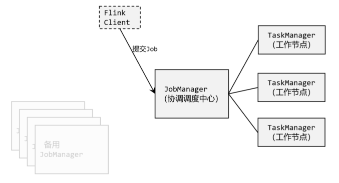
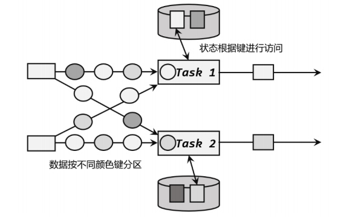
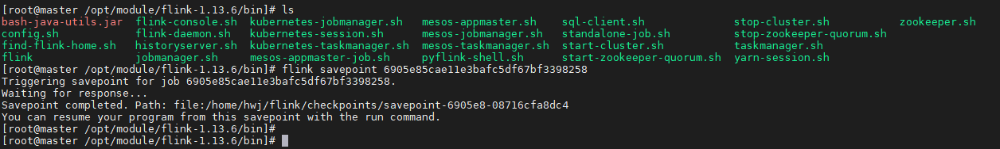
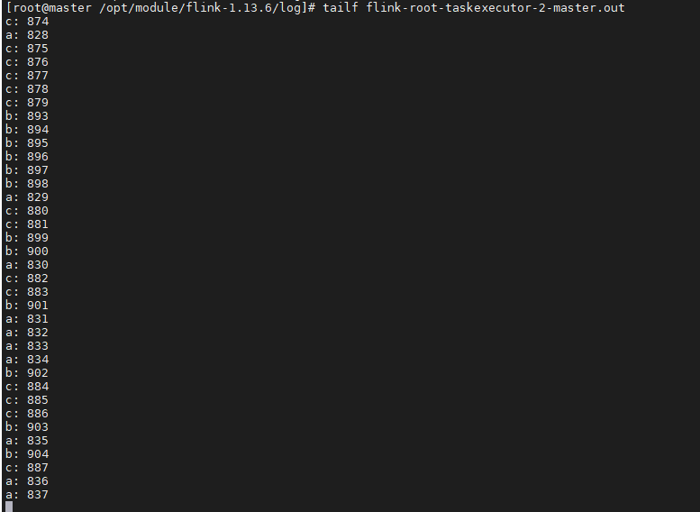
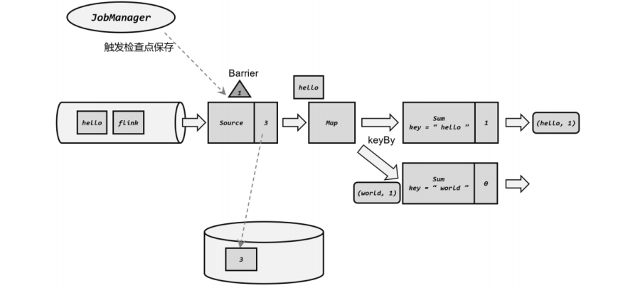

「尚硅谷大数据技术之flink(java) 含书签.pdf」https://www.aliyundrive.com/s/rLf7szByhuw 


# 第 1 章 初识Flink

> 特点： 实时流处理（低延迟）， 高吞吐量


>  四层API

1. SQL
2. Table API
3. DataStream/DataSet API

4. 有状态流处理


> Spark VS Flink

Spark工作中没用过，就是批处理框架，Spark Streaming也可以进行流处理，但实际上还是微型的批处理

Flink是真正的流处理


讲讲你对flink的理解

```
flink是一个高性能，分布式，可扩展， 有状态的流式处理框架，它可用于实时数据处理，批处理等场景，它提供了丰富的API和工具，支持基于事件时间和处理时间的窗口计算，基于状态的迭代计算等一系列复杂的数据处理操作。
···.
flink的核心思想是将数据处理看作一系列函数操作，然后把这一系列的函数操作根据方向，依赖关系组装成一个有向无环图（DAG）。 flink会对数据进行分区，调度和负载均衡，以保证高效的数据处理。

flink提供了精确一次语义（Exactly-one Semantics）的支持，即能够在保证数据处理的正确性的前提下，最大程度地保证数据只被处理一次。
```


flink怎么保证精确一次语义？(chatgpt)

```
在分布式计算系统中，精确一次语义（Exactly-Once Semantics）是指在进行数据处理时，保证每条数据只被处理一次，并且将结果准确地输出到外部存储系统中。Flink 通过以下两种机制来保证精确一次语义：

	1. Checkpointing：Checkpoint 是 Flink 中用于实现容错性的机制之一。Flink 会定期生成 Checkpoint，并将当前状态写入持久化存储中。在出现故障时，Flink 可以从上一个 Checkpoint 中恢复应用程序状态和数据处理进度。通过使用精确一次语义的 Checkpoint，可以确保所有进入应用程序的数据都被完整地处理且仅被处理一次。

	2. 事务性 Sink：Flink 提供了支持事务性输出的 Sink 算子，如 Flink JDBC Sink 和 Flink Elasticsearch Sink。这些 Sink 算子可以通过事务机制来确保数据在输出到外部存储时的一致性和可靠性。在这些 Sink 算子中，每个 Checkpoint 都对应着一个事务，所有在该 Checkpoint 前到达的数据都将被写入该事务。如果出现故障，则会回滚到最近一个成功的 Checkpoint，然后重新处理从该 Checkpoint 开始的数据。

需要注意的是，要想实现精确一次语义，还需要考虑数据源的幂等性问题。幂等性是指对于相同的输入数据，在不同时间和位置上处理的结果应该是相同的。在 Flink 应用程序中，需要保证数据源和算子都满足幂等性要求
```


# 第 2 章 Flink快速上手

wordcount案例


# 第 3 章 Flink 部署

## 集群启动

Flink集群




集群启动配置

vim flink-conf.yaml

```yaml
jobmanager.rpc.address: hadoop102
```

vim workers 

```
hadoop103
hadoop104
```


## 部署模式


### 1.会话模式


先启动集群再提交作业，这种方式其实就是会话模式。

会话模式比较适合于单个规模小、执行时间短的大量作业。


### 2.单作业模式

会话模式因为资源共享会导致很多问题，所以为了更好地隔离资源，我们可以考虑为每个

提交的作业启动一个集群，这就是所谓的单作业（Per-Job）模式


单作业模式也很好理解，就是严格的一对一，集群只为这个作业而生。同样由客户端运行应用程序，然后启动集群，作业被提交给 JobManager，进而分发给 TaskManager 执行。作业完成后，集群就会关闭，所有资源也会释放。这样一来，每个作业都有它自己的 JobManager管理，占用独享的资源，即使发生故障，它的 TaskManager 宕机也不会影响其他作业。

**注意： 单作业模式一般需要借助一些资源管理框架来启动集群，比如 YARN、Kubernetes。**


### 3.应用模式


应用模式与单作业模式，都是提交作业之后才创建集群；单作业模式是通过客户端来提交的，客户端解析出的每一个作业对应一个集群；而应用模式下，是直接由 JobManager 执行应用程序的，并且即使应用包含了多个作业，也只创建一个集群。


**注意： 这里对应用模式其实没有理解到位**


### 总结

总结一下，在会话模式下，集群的生命周期独立于集群上运行的任何作业的生命周期，并且提交的所有作业共享资源。而单作业模式为每个提交的作业创建一个集群，带来了更好的资源隔离，这时集群的生命周期与作业的生命周期绑定。最后，应用模式为每个应用程序创建一个会话集群，在 JobManager 上直接调用应用程序的 main()方法。


## 独立模式


## Yarn模式


## K8s模式


# 第 4 章 Flink 运行时架构


## flink图

说一下flink中数据流图，作业图，执行图的转换过程以及是谁负责作图的？(chatgpt)

```
在 Flink 中，作业的执行过程可以用三种图来描述：数据流图、作业图和执行图。

数据流图（Dataflow Graph）：表示 Flink 作业中数据流处理的逻辑结构，即数据如何从源头经过各个算子转换最终到达目标。数据流图是静态的，也就是说，它反映的是代码中定义的程序结构，而不考虑实际运行时的情况。在 Flink 中，数据流图通常是由开发者编写的代码自动生成的。

作业图（Job Graph）：表示 Flink 作业中逻辑上需要执行的任务和它们之间的依赖关系，包括数据源、算子、数据分区、数据交换等信息。与数据流图不同，作业图是动态生成的，它根据数据流图和当前集群状态进行优化和调度。作业图的生成是由 Flink 的 JobGraphGenerator 负责完成的。

执行图（Execution Graph）：表示 Flink 作业的实际执行过程，包括每个 Task 在哪个 TaskManager 上执行、Task 之间如何链式调用、数据交换如何进行等信息。执行图是动态生成的，它是根据作业图和当前集群状态生成的。执行图的生成是由 Flink 的 ExecutionGraphBuilder 负责完成的。

总体来说，Flink 的数据流图、作业图和执行图都是由 Flink 运行时系统自动生成的，并且在整个作业的执行过程中都扮演着重要的角色。其中，数据流图主要用于代码开发和调试阶段，作业图
```

逻辑流图（StreamGraph）→ 作业图（JobGraph）→ 执行图（ExecutionGraph）→ 物理图（Physical Graph）。

物理图就是包含数据存放位置的执行图


## flink作业提交流程

讲一讲flink作业提交的流程（chatgpt）

```
当我们要提交一个 Flink 作业时，一般的流程如下：

编写 Flink 应用程序代码：使用 Flink 提供的 API 编写具体的应用程序代码。

打包应用程序：将应用程序代码打包成 JAR 文件或者其他可执行文件，以便在 Flink 集群上运行。

启动 Flink 集群：启动 Flink 集群，可以通过脚本或命令行等方式启动。

提交应用程序：使用 Flink 提供的客户端工具 flink run 提交应用程序。flink run 命令将会向 JobManager 发送作业提交请求，同时将应用程序 JAR 包上传到指定的集群节点上。

JobManager 接收并处理请求：JobManager 接收到作业提交请求后，会对作业进行解析、生成 ExecutionGraph 并执行任务调度计算，同时将控制权交给 ResourceManager。

ResourceManager 分配资源：ResourceManager 接收到控制权后，根据作业的需求，为该作业分配所需的资源，如 TaskManager 资源、内存等。

TaskManager 运行任务：TaskManager 在接收到 ResourceManager 分配的任务资源后，开始运行相应的任务，并不断向 JobManager 汇报任务状态。

作业执行完毕：当所有任务都执行完毕后，Flink 会自动关闭作业并释放所有资源。

总之，Flink 作业提交的流程是先将应用程序打包成可执行文件，然后通过 flink run 工具提交给 JobManager，在整个过程中 Flink 集群会对作业进行调度、资源分配和任务执行等操作。
```


```
这里首先要说明一下“客户端”。其实客户端并不是处理系统的一部分，它只负责作业的提交。具体来说，就是调用程序的 main 方法，将代码转换成“数据流图”（Dataflow Graph），并最终生成作业图（JobGraph），一并发送给 JobManager。提交之后，任务的执行其实就跟客户端没有关系了

TaskManager 启动之后，JobManager 会与它建立连接，并将作业图（JobGraph）转换成可执行的“执行图”（ExecutionGraph）分发给可用的 TaskManager，然后就由 TaskManager 具体执行任务。
```


## JobManger 结构

JobManger 又包含 3 个不同的组件

**JobMaster，ResourceManager， Dispatcher**

```
jobMaster会将作业图转换成执行图， 还会负责检查点的协调
resourceManager负责资源的分配和管理， slot就是资源调度的基本单位
dispatcher 主要负责提供restapi， 用来提交应用， 并且负责为每一个新提交的作业启动一个新的jobMaster. dispatcher还会启动一个WebUI页面，方便展示监控信息
```


## flink程序结构

Flink是流式计算框架。它的程序结构，其实就是定义了一连串的处理操作，每一个数据输入之后都会依次调用每一步计算。在Flink代码中，我们定义的每一个处理转换操作都叫作“算子”（Operator），所以我们的程序可以看作是一串算子构成的管道，数据则像水流一样有序地流过。


所有的Flink程序都可以归纳为由三部分构成：Source、Transformation和Sink。

​	Source 表示“源算子”，负责读取数据源。

​	Transformation 表示“转换算子”，利用各种算子进行处理加工。

​	Sink 表示“下沉算子”，负责数据的输出。


## flink分区

讲一下flink的分区（chatgpt）

```
在 Flink 中，数据流可以被分成多个分区，每一个分区包含了数据流中的一部分数据。Flink 根据分区将数据流切分为多个子任务来并行执行计算。Flink 支持以下几种常见的分区方式：

    1. Round Robin 分区：将数据轮询地均匀地分配到下游算子的不同分区中。
    2. Hash 分区：根据指定的 Key 值进行哈希操作，将 Key 相同的数据分配到同一个分区中。
    3. Range 分区：根据 Key 的大小和范围将数据流分割成多个分区，比如按照时间戳或者价格分区等。
    4. Broadcast 分区：将数据流广播到所有下游算子中，每个下游算子都会接收到完整的数据流。
    5. Rebalance 分区：将数据流重新平衡，即将数据均匀地分配到不同的分区中，以便更好地实现负载均衡。
    6. Global 分区：将整个数据流看作是一个分区，将其发送到下游算子的一个并行任务中。

需要根据具体的业务场景和算子特性选择合适的分区方式，以提高应用程序的执行效率和可靠性。同时，在 Flink 应用程序中也可以自定义分区器，通过继承 Partitioner 接口来实现自定义分区逻辑。
```


讲一下flink的算子的并行度

```
在 Flink 中，算子并行度（Parallelism）是指一个算子运行时使用的并发任务数。Flink 通过将一个算子拆分为多个子任务来实现并行计算，每个子任务处理输入数据流中的部分数据。算子并行度通常可以通过 setParallelism() 方法进行设置。

在 Flink 应用程序中，可以在算子级别或者作业级别上设置并行度。如果没有显式设置算子的并行度，则会使用 Flink 的默认并行度。下面是一些常见的设置并行度的方法：
	1.setParallelism() 方法：该方法可以在算子级别上设置并行度，例如 source、map、filter 等算子。
	2.setMaxParallelism() 方法：该方法同样是在算子级别上设置，并行度的最大值，对于一些需要后续扩展性的算子比较有用。
	3.ExecutionConfig.setParallelismDefault() 方法：该方法可以在应用程序级别上设置默认并行度，对所有算子都生效。
	4.flink-conf.yaml 文件：也可以通过修改 flink-conf.yaml 配置文件来设置默认并行度。

需要注意的是，并行度的设置要基于资源可用性、数据倾斜等因素进行合理调整，以充分利用集群资源并提高应用程序的执行效率。
```

flink 并行度配置的优先级问题

```
在 Flink 中，算子的并行度可以在多个级别进行设置，因此存在不同级别配置的优先级。具体来说，Flink 算子的并行度配置的优先级从高到低依次是：
	1. Operator 实例级别：通过 setParallelism() 方法为算子实例单独设置的并行度，这种设置方式的优先级最高。
	2.TaskManager 内存的 slot 数量：每个 TaskManager 节点都有一定数量的 Task slot，在应用程序启动时可以通过 TaskManagerOptions.NUM_TASK_SLOTS 参数进行设置。如果算子的并行度大于 Task slot 的数量，则会出现资源不足的情况。
	3.JobManager 内存的 slot 数量：JobManager 也有一定数量的 Job slot，可以通过 SlotSharingGroup 和 Co-locationGroup 等机制向其中分配 Task slot。如果 JobManager 内存的 slot 数量小于 TaskManager 内存中可供使用的 slot 总数，则会出现无法分配 Task slot 的情况。
	4.ExecutionConfig 设置的默认并行度：可以通过 ExecutionConfig.setParallelismDefault() 方法设置默认的并行度值，在没有显式设置算子并行度时将使用该值作为默认并行度。
	5.flink-conf.yaml 配置文件中的默认并行度：在没有任何上述配置时，Flink 会使用 flink-conf.yaml 配置文件中的默认并行度来执行计算任务。

当存在多个级别的并行度设置时，Flink 会按照上述优先级顺序进行并行度配置。
```


## 算子链

算子之前传输数据的方式有哪些？

```
在 Flink 中，算子之间通常通过数据流进行数据传输。Flink 支持以下几种常见的数据传输方式：

	1. 点对点直接传输：每个算子将数据直接发送给下游算子。这种方式适用于数据量较小、计算复杂度较低的场景。

	2. Shuffle-based 数据传输：将数据根据 Key 值哈希分区，并将同一分区内的数据发送到同一个下游算子中。此种数据传输方式会涉及到网络传输和磁盘 I/O 操作，因此在大规模数据处理和高并发操作场景下需要考虑性能问题。

	3. 广播（Broadcast）传输：将数据广播到所有下游算子中，每个下游算子都可以使用该数据进行计算。这种方式适用于数据量较小且不易被修改的场景。

	4. Forwarding 数据传输：将数据简单地从上游算子直接转发到下游算子中，无需做任何额外的处理。这种方式适用于数据经过多次复杂变换后仍保持稳定的场景。 (1和4好像重合了？)

除了以上几种数据传输方式，Flink 还支持自定义数据传输方式，可以根据具体业务场景和计算特点来选择合适的数据传输方式，以提高应用程序的执行效率和可靠性。
```


算子之间的数据传输如果是一对一（one to one）的，那么两个算子可以合并成一个算子链


可以设置算子链

```
// 禁用算子链
.map(word -> Tuple2.of(word, 1L)).disableChaining();
// 从当前算子开始新链
.map(word -> Tuple2.of(word, 1L)).startNewChain()
```


## slot

slot 目前仅仅用来隔离内存，不会涉及 CPU 的隔离。在具体应用时，可以将 slot 数量配置为机器的 CPU 核心数，尽量避免不同任务之间对 CPU 的竞争。这也是开发环境默认并行度设为机器 CPU 数量的原因。


slot和并行度的关系

slot必须大于并行度，flink程序才能正常运行


# 第 5 章 DataStream API（基础篇）


## 执行环境

StreamExecutionEnvironment 类 创建执行环境， 有3个静态方法

```
getExecutionEnvironment()
createLocalEnvironment()
createRemoteEnvironment(JobManager主机名，JobManager进程端口号，提交给JobManager的JAR包路径)
```


## 物理分区

顾名思义，“分区”（partitioning）操作就是要将数据进行重新分布，传递到不同的流分区去进行下一步处理。

keyBy，它就是一种按照键的哈希值来进行重新分区的操作。只不过这种分区操作只能保证把数据按key“分开”，至于分得均不均匀、每个 key 的数据具体会分到哪一区去，这些是完全无从控制的——所以我们有时也说，keyBy 是一种逻辑分区（logical partitioning）操作。


有些时候，我们还需要手动控制数据分区分配策略。比如当发生数据倾斜的时候，系统无法自动调整，这时就需要我们重新进行负载均衡，将数据流较为平均地发送到下游任务操作分区中去。Flink 对于经过转换操作之后的 DataStream，提供了一系列的底层操作接口，能够帮我们实现数据流的手动重分区。


为了同 keyBy 相区别，我们把这些操作统称为“物理分区”操作。物理分区与 keyBy 另一大区别在于，keyBy 之后得到的是一个 KeyedStream，而物理分区之后结果仍是 DataStream，且流中元素数据类型保持不变。从这一点也可以看出，分区算子并不对数据进行转换处理，只是定义了数据的传输方式。


###  1. 随机分区（shuffle）

最简单的重分区方式就是直接“洗牌”。通过调用 DataStream 的.shuffle()方法，将数据随机地分配到下游算子的并行任务中去。

随机分区服从均匀分布（uniform distribution），所以可以把流中的数据随机打乱，均匀地传递到下游任务分区


### 2. 轮询分区（Round-Robin）

轮询也是一种常见的重分区方式。简单来说就是“发牌”，按照先后顺序将数据做依次分发，通过调用 DataStream 的.rebalance()方法，就可以实现轮询重分区。rebalance使用的是 Round-Robin 负载均衡算法，可以将输入流数据平均分配到下游的并行任务中去。


### 3. 重缩放分区（rescale）

重缩放分区和轮询分区非常相似。当调用 rescale()方法时，其实底层也是使用 Round-Robin算法进行轮询，但是只会将数据轮询发送到下游并行任务的一部分中

也就是说，“发牌人”如果有多个，那么 rebalance 的方式是每个发牌人都面向所有人发牌；而 rescale的做法是分成小团体，发牌人只给自己团体内的所有人轮流发牌。


当下游任务（数据接收方）的数量是上游任务（数据发送方）数量的整数倍时，rescale的效率明显会更高。比如当上游任务数量是 2，下游任务数量是 6 时，上游任务其中一个分区的数据就将会平均分配到下游任务的 3 个分区中。


由于 rebalance 是所有分区数据的“重新平衡”，当 TaskManager 数据量较多时，这种跨节点的网络传输必然影响效率；而如果我们配置的 task slot 数量合适，用 rescale 的方式进行“局部重缩放”，就可以让数据只在当前 TaskManager 的多个 slot 之间重新分配，从而避免了网络传输带来的损耗。

从底层实现上看，rebalance 和 rescale 的根本区别在于任务之间的连接机制不同。rebalance将会针对所有上游任务（发送数据方）和所有下游任务（接收数据方）之间建立通信通道，这是一个笛卡尔积的关系；而 rescale 仅仅针对每一个任务和下游对应的部分任务之间建立通信通道，节省了很多资源。


示例代码

```java
import org.apache.flink.streaming.api.environment.StreamExecutionEnvironment;
import org.apache.flink.streaming.api.functions.source.RichParallelSourceFunction;
import org.apache.logging.log4j.LogManager;
import org.apache.logging.log4j.Logger;


public class RescaleTest {

    private static final Logger LOG = LogManager.getLogger(RescaleTest.class);

    public static void main(String[] args) throws Exception {
        StreamExecutionEnvironment env = StreamExecutionEnvironment.getExecutionEnvironment();
        env.setParallelism(1);
        // 这里使用了并行数据源的富函数版本
        // 这样可以调用 getRuntimeContext 方法来获取运行时上下文的一些信息
        env.addSource(new RichParallelSourceFunction<Integer>() {
            @Override
            public void run(SourceContext<Integer> sourceContext) throws Exception {
                for (int i = 1; i <= 80; i++) {
                    // 将奇数发送到索引为 1 的并行子任务
                    // 将偶数发送到索引为 0 的并行子任务
                    if (i % 4 == getRuntimeContext().getIndexOfThisSubtask() % 4) {
                        LOG.warn("子任务索引：" + getRuntimeContext().getIndexOfThisSubtask() + "收集数据：" + i);
                        sourceContext.collect(i);
                    }
                }
            }

            @Override
            public void cancel() {
            }
        })
            .setParallelism(4)
            .rescale()
            .print().setParallelism(8); // 注意flink task manager slot要大于8
        env.execute();
    }
}
```


### 4. 广播（broadcast）

这种方式其实不应该叫做“重分区”，因为经过广播之后，数据会在不同的分区都保留一份，可能进行重复处理。可以通过调用 DataStream 的 broadcast()方法，将输入数据复制并发送到下游算子的所有并行任务中去。


### 5. 全局分区（global）

全局分区也是一种特殊的分区方式。这种做法非常极端，通过调用.global()方法，会将所有的输入流数据都发送到下游算子的第一个并行子任务中去。这就相当于强行让下游任务并行度变成了 1，所以使用这个操作需要非常谨慎，可能对程序造成很大的压力。


### 6. 自定义分区（Custom）

当 Flink 提 供 的 所 有 分 区 策 略 都 不 能 满 足 用 户 的 需 求 时 ， 我 们 可 以 通 过 使 用partitionCustom()方法来自定义分区策略。在调用时，方法需要传入两个参数，第一个是自定义分区器（Partitioner）对象，第二个是应用分区器的字段，它的指定方式与 keyBy 指定 key 基本一样：可以通过字段名称指定，也可以通过字段位置索引来指定，还可以实现一个 KeySelector。

例如，我们可以对一组自然数按照奇偶性进行重分区。代码如下：


## 源算子

### 一般的源算子

```
DataStream<String> stream = env.addSource(...);
```


### 从集合中读取数据

```
ArrayList<Event> clicks = new ArrayList<>();
DataStream<Event> stream = env.fromCollection(clicks);
```


### 从文件中读取数据

```
DataStream<String> stream = env.readTextFile("clicks.csv");
```

说明:

- 参数可以是目录，也可以是文件；

- 路径可以是相对路径，也可以是绝对路径；

- 相对路径是从系统属性 user.dir 获取路径: idea 下是 project 的根目录, standalone 模式下是集群节点根目录；

- 也可以从 hdfs 目录下读取, 使用路径 hdfs://..., 由于 Flink 没有提供 hadoop 相关依赖, 

    - 需要 pom 中添加相关依赖

        ```xml
        <dependency>
             <groupId>org.apache.hadoop</groupId>
             <artifactId>hadoop-client</artifactId>
             <version>2.7.5</version>
             <scope>provided</scope>
        </dependency>
        ```

        

### 从 Socket 读取数据

```
DataStream<String> stream = env.socketTextStream("localhost", 7777); // linux下命令： nv -l 7777 
```


### 从 Kafka 读取数据

引入依赖

```xml
<dependency>
     <groupId>org.apache.flink</groupId>
     <artifactId>flink-connector-kafka_${scala.binary.version}</artifactId>
     <version>${flink.version}</version>
</dependency>
```

示例代码

```java
import org.apache.flink.api.common.serialization.SimpleStringSchema;
import org.apache.flink.streaming.api.datastream.DataStreamSource;
import org.apache.flink.streaming.api.environment.StreamExecutionEnvironment;
import org.apache.flink.streaming.connectors.kafka.FlinkKafkaConsumer;

import java.util.Properties;


/*
第一个参数 topic，定义了从哪些主题中读取数据。可以是一个 topic，也可以是 topic列表，还可以是匹配所有想要读取的 topic 的正则表达式。当从多个 topic 中读取数据时，Kafka 连接器将会处理所有 topic 的分区，将这些分区的数据放到一条流中去。

第二个参数是一个 DeserializationSchema 或者 KeyedDeserializationSchema。Kafka 消息被存储为原始的字节数据，所以需要反序列化成 Java 或者 Scala 对象。上面代码中使用的 SimpleStringSchema，是一个内置的 DeserializationSchema，它只是将字节数组简单地反序列化成字符串。DeserializationSchema 和 KeyedDeserializationSchema 是公共接口，所以我们也可以自定义反序列化逻辑。

第三个参数是一个 Properties 对象，设置了 Kafka 客户端的一些属性。
*/
public class SourceKafkaTest {
    public static void main(String[] args) throws Exception {
        StreamExecutionEnvironment env = StreamExecutionEnvironment.getExecutionEnvironment();
        env.setParallelism(1);

        Properties properties = new Properties();
        properties.setProperty("bootstrap.servers", "hadoop102:9092");
        properties.setProperty("group.id", "consumer-group");
        properties.setProperty("key.deserializer",  "org.apache.kafka.common.serialization.StringDeserializer");
        properties.setProperty("value.deserializer",  "org.apache.kafka.common.serialization.StringDeserializer");
        properties.setProperty("auto.offset.reset", "latest");

        DataStreamSource<String> stream = env.addSource(
            new FlinkKafkaConsumer<String>(
                "clicks",
                new SimpleStringSchema(),
                properties
            ));
        
        stream.print("Kafka");
        env.execute();
    }
}


```


### 自定义Source

创建一个自定义的数据源，实现 SourceFunction 接口。主要重写两个关键方法：run()和 cancel()。

- run()方法：使用运行时上下文对象（SourceContext）向下游发送数据；
- cancel()方法：通过标识位控制退出循环，来达到中断数据源的效果。

```
import org.apache.flink.streaming.api.functions.source.SourceFunction;

import java.util.Calendar;  // todo这里不是线程安全的，使用时考虑一下用java.time包替换
import java.util.Random;

public class ClickSource implements SourceFunction<Event> {
    // 声明一个布尔变量，作为控制数据生成的标识位
    private Boolean running = true;

    @Override
    public void run(SourceContext<Event> ctx) throws Exception {
        Random random = new Random(); // 在指定的数据集中随机选取数据
        String[] users = {"Mary", "Alice", "Bob", "Cary"};
        String[] urls = {"./home", "./cart", "./fav", "./prod?id=1", "./prod?id=2"};
        while (running) {
            ctx.collect(new Event(
                users[random.nextInt(users.length)],
                urls[random.nextInt(urls.length)],
                Calendar.getInstance().getTimeInMillis()
            ));
            // 隔 1 秒生成一个点击事件，方便观测
            Thread.sleep(1000);
        }
    }

    @Override
    public void cancel() {
        running = false;
    }
}
```


要注意的是 SourceFunction 接口定义的数据源，并行度只能设置为 1，如果数据源设置为大于 1 的并行度，则会抛出异常。

想要自定义并行的数据源的话，需要使用 ParallelSourceFunction

示例程序：

```java
package hwj;

import org.apache.flink.streaming.api.environment.StreamExecutionEnvironment;
import org.apache.flink.streaming.api.functions.source.ParallelSourceFunction;

import java.util.Random;

public class ParallelSourceExample {
    public static void main(String[] args) throws Exception {
        StreamExecutionEnvironment env = StreamExecutionEnvironment.getExecutionEnvironment();
        env.addSource(new CustomSource()).setParallelism(2).print();
        env.execute();
    }

    public static class CustomSource implements ParallelSourceFunction<Integer> {
        private boolean running = true;
        private Random random = new Random();

        @Override
        public void run(SourceContext<Integer> sourceContext) throws Exception {
            while (running) {
                sourceContext.collect(random.nextInt());
            }
        }

        @Override
        public void cancel() {
            running = false;
        }
    }
}
```


###  Flink 支持的数据类型

Flink 在内部，Flink对支持不同的类型进行了划分，这些类型可以在 **Types 工具类**中找到

1）基本类型

- 所有 Java 基本类型及其包装类，再加上 Void、String、Date、BigDecimal 和 BigInteger。

2）数组类型

- 包括基本类型数组（PRIMITIVE_ARRAY）和对象数组(OBJECT_ARRAY)

3）复合数据类型

- Java 元组类型（TUPLE）：这是 Flink 内置的元组类型，是 Java API 的一部分。最多25 个字段，也就是从 Tuple0~Tuple25，不支持空字段

-  Scala 样例类及 Scala 元组：不支持空字段

- 行类型（ROW）：可以认为是具有任意个字段的元组,并支持空字段

-  POJO：Flink 自定义的类似于 Java bean 模式的类

4）辅助类型

- Option、Either、List、Map 等 

5）泛型类型（GENERIC）

Flink 对 POJO 类型的要求如下：

-  类是公共的（public）和独立的（standalone，也就是说没有非静态的内部类）；

- 类有一个公共的无参构造方法；

- 类中的所有字段是 public 且非 final 的；或者有一个公共的 getter 和 setter 方法，这些方法需要符合 Java bean 的命名规范。


> 类型提示

回忆一下之前的 word count 流处理程序，我们在将 String 类型的每个词转换成（word，count）二元组后，就明确地用 returns 指定了返回的类型。因为对于 map 里传入的 Lambda 表达式，系统只能推断出返回的是 Tuple2 类型，而无法得到 Tuple2<String, Long>。只有显式地告诉系统当前的返回类型，才能正确地解析出完整数据。

```java
.map(word -> Tuple2.of(word, 1L))
.returns(Types.TUPLE(Types.STRING, Types.LONG));  // 基本类型
```

这是一种比较简单的场景，二元组的两个元素都是基本数据类型。那如果元组中的一个元素又有泛型，该怎么处理呢？Flink 专门提供了 TypeHint 类，它可以捕获泛型的类型信息，并且一直记录下来，为运行时提供足够的信息。我们同样可以通过.returns()方法，明确地指定转换之后的 DataStream 里元素的类型。

```java
returns(new TypeHint<Tuple2<Integer, SomeType>>(){})  // SomeType是泛型
```


## 转换算子

### 基本算子

map： 消费一个元素，产生一个元素

filter： 根据情况过滤一个元素

flatmap ： 消费一个元素，可以产生0个或多个元素， 所以 flatMap 方法也可以实现 map 方法和 filter 方法的功能


### 聚合算子Aggregation

keyBy 和聚合是成对出现的，先分区、后聚合，得到的依然是一个 DataStream。而且经过简单聚合之后的数据流，元素的数据类型保持不变


一个聚合算子，会为每一个key保存一个聚合的值，在Flink中我们把它叫作“状态”（state）。所以每当有一个新的数据输入，算子就会更新保存的聚合结果，并发送一个带有更新后聚合值的事件到下游算子。


#### 按键分区（keyBy）

基于不同的 key，流中的数据将被分配到不同的分区中去

keyBy()方法需要传入一个参数，这个参数指定了一个或一组 key

有很多不同的方法来指定 key：

- 对于 Tuple 数据类型，可以指定字段的位置或者多个位置的组合；
- 对于 POJO 类型，可以指定字段的名称（String）；
- 可以传入 Lambda 表达式或者实现一个键选择器（KeySelector），用于说明从数据中提取 key 的逻辑。


keyBy 得到的结果将不再是 DataStream，而是会将 DataStream 转换为KeyedStream。KeyedStream 可以认为是“分区流”或者“键控流”，它是对 DataStream 按照key 的一个逻辑分区，所以泛型有两个类型：除去当前流中的元素类型外，还需要指定 key 的类型。


#### 简单聚合

sum()

min()

max()

minBy() 

- 在输入流上针对指定字段求最小值。不同的是，min()只计算指定字段的最小值，其他字段会保留最初第一个数据的值；而 minBy()则会返回包含字段最小值的整条数据。

maxBy()

- 两者区别与min()/minBy()完全一致


min和minBy的却别

```java
import org.apache.flink.api.java.tuple.Tuple3;
import org.apache.flink.streaming.api.datastream.DataStreamSource;
import org.apache.flink.streaming.api.environment.StreamExecutionEnvironment;

public class TransTupleAggregationTest {
    public static void main(String[] args) throws Exception {
        StreamExecutionEnvironment env =
            StreamExecutionEnvironment.getExecutionEnvironment();
        env.setParallelism(1);
        DataStreamSource<Tuple3<String, Integer, String>> stream = env.fromElements(
            Tuple3.of("a", 8, "A"),
            Tuple3.of("a", 3, "B"),
            Tuple3.of("b", 9, "C"),
            Tuple3.of("b", 4, "D")
        );
        stream.keyBy(r -> r.f0).min("f1").print();
//        stream.keyBy(r -> r.f0).minBy("f1").print();
        env.execute();
    }
}

/* min()的结果
(a,8,A)
(a,3,A)
(b,9,C)
(b,4,C)
*/

/* minBy()的结果(其他字段也会被替换)
(a,8,A)
(a,3,B)
(b,9,C)
(b,4,D)
*/
```


#### 归约聚合（reduce）

reduce 同简单聚合算子一样，也要针对每一个 key 保存状态。因为状态不会清空，所以我们需要将 reduce 算子作用在一个有限 key 的流上


举例

我们将数据流按照用户 id 进行分区，然后用一个 reduce 算子实现 sum 的功能，统计每个用户访问的频次；进而将所有统计结果分到一组，用另一个 reduce 算子实现 maxBy 的功能，记录所有用户中访问频次最高的那个，也就是当前访问量最大的用户是谁。

```java
import com.github.chapter05.ClickSource;
import com.github.chapter05.Event;
import org.apache.flink.api.common.functions.MapFunction;
import org.apache.flink.api.common.functions.ReduceFunction;
import org.apache.flink.api.java.tuple.Tuple2;
import org.apache.flink.streaming.api.environment.StreamExecutionEnvironment;

public class TransReduceTest {
    public static void main(String[] args) throws Exception {
        StreamExecutionEnvironment env =
            StreamExecutionEnvironment.getExecutionEnvironment();
        env.setParallelism(1);
        // 这里的 ClickSource()使用了之前自定义数据源小节中的 ClickSource()
        env.addSource(new ClickSource())
            // 将 Event 数据类型转换成元组类型
            .map(new MapFunction<Event, Tuple2<String, Long>>() {
                @Override
                public Tuple2<String, Long> map(Event e) throws Exception {
                    return Tuple2.of(e.user, 1L);
                }
            })
            .keyBy(r -> r.f0) // 使用用户名来进行分流
            .reduce(new ReduceFunction<Tuple2<String, Long>>() {
                @Override
                public Tuple2<String, Long> reduce(Tuple2<String, Long> value1,
                                                   Tuple2<String, Long> value2) throws Exception {
                    // 每到一条数据，用户 pv 的统计值加 1
                    return Tuple2.of(value1.f0, value1.f1 + value2.f1);
                }
            })
            .keyBy(r -> true) // 为每一条数据分配同一个 key，将聚合结果发送到一条流中 去
            .reduce(new ReduceFunction<Tuple2<String, Long>>() {
                @Override
                public Tuple2<String, Long> reduce(Tuple2<String, Long> value1,
                                                   Tuple2<String, Long> value2) throws Exception {
                    // 将累加器更新为当前最大的 pv 统计值，然后向下游发送累加器的值
                    return value1.f1 > value2.f1 ? value1 : value2;
                }
            })
            .print();
        env.execute();
    }

}
```


### 用户自定义函数（UDF）

前面讲到的Source 算子，其实也是需要自定义类实现一个 SourceFunction 接口。

接口有一个共同特点：全部都以算子操作名称 + Function 命名

- map算子需要实现MapFunction接口

- reduce算子需要实现ReduceFunction接口

这就是所谓的用户自定义函数（user-defined function，UDF）。


**Rich Function Classes**

所有的Flink函数类都有其Rich版本。富函数类一般是以抽象类的形式出现的。例如：RichMapFunction、RichFilterFunction、RichReduceFunction等。

富函数类可以获取**运行环境的上下文**，并拥有一些**生命周期方法**，所以可以实现更复杂的功能。

- 增加了生命周期方法 open()，  close()
    - open()方法，是 Rich Function 的初始化方法，也就是会开启一个算子的生命周期。当一个算子的实际工作方法例如 map()或者 filter()方法被调用之前，open()会首先被调用。所以像文件 IO 的创建，数据库连接的创建，配置文件的读取等等这样一次性的工作，都适合在 open()方法中完成。
    - close()方法，是生命周期中的最后一个调用的方法，类似于解构方法。一般用来做一些清理工作。
- 增加了运行环境的上下文


## 输出算子

​		在 Flink 中，如果我们希望将数据写入外部系统，其实并不是一件难事。我们知道所有算子都可以通过实现函数类来自定义处理逻辑，所以只要有读写客户端，与外部系统的交互在任何一个处理算子中都可以实现。例如在 MapFunction 中，我们完全可以构建一个到 Redis 的连接，然后将当前处理的结果保存到 Redis 中。如果考虑到只需建立一次连接，我们也可以利用RichMapFunction，在 open() 生命周期中做连接操作。

​		这样看起来很方便，却会带来很多问题。Flink 作为一个快速的分布式实时流处理系统，对稳定性和容错性要求极高。一旦出现故障，我们应该有能力恢复之前的状态，保障处理结果的正确性。这种性质一般被称作“状态一致性”。Flink 内部提供了一致性检查点（checkpoint）来保障我们可以回滚到正确的状态；但如果我们在处理过程中任意读写外部系统，发生故障后就很难回退到从前了


总结： 在map，filter算子中连接数据库，**“精确一次（exactly once）”的状态一致性不能得到保证**，状态一致性由flink的checkpoint来保证）


一般情况下 Sink 算子的创建是通过调用 DataStream 的.addSink()方法实现的。

```java
stream.addSink(new SinkFunction(…));
```

addSource 的参数需要实现一个 SourceFunction 接口；类似地，addSink 方法同样需要传入一个参数，实现的是 SinkFunction 接口。在这个接口中只需要重写一个方法 invoke(),用来将指定的值写入到外部系统中。这个方法在每条数据记录到来时都会调用：

```java
default void invoke(IN value, Context context) throws Exception
```


SinkFuntion 多数情况下同样并不需要我们自己实现。Flink 官方提供了一部分的框架的 Sink 连接器。


### 输出到文件

Flink 本来也有一些非常简单粗暴的输出到文件的预实现方法：如 writeAsText()、writeAsCsv()

但我们知道，这种方式是不支持同时写入一份文件的；所以我们往往会将最后的 Sink 操作并行度设为 1，这就大大拖慢了系统效率；而且对于故障恢复后的状态一致性，也没有任何保证。所以目前这些简单的方法已经要被弃用。


Flink 为此专门提供了一个流式文件系统的连接器：**StreamingFileSink**，它继承自抽象类RichSinkFunction，而且集成了 Flink 的检查点（checkpoint）机制，用来保证精确一次（exactly once）的一致性语义。


怎么理解 StreamingFileSink 的原理(chatgpt)

```
StreamingFileSink 是 Flink 中的一个 Sink，用于将数据流写入本地或远程文件系统中的文件。其原理是将接收到的数据流按照指定的格式和规则写入文件系统中。当存在多个并行的任务时，StreamingFileSink 会对这些任务进行均衡以保证数据的顺序性和完整性。此外，StreamingFileSink 还支持一些高级功能，如恰好一次语义（exactly-once semantics）和可靠性检查点（reliable checkpoints），以确保数据写入的准确性和容错性。
```


StreamingFileSink 支持行编码（Row-encoded）和批量编码（Bulk-encoded，比如 Parquet） 格式。这两种不同的方式都有各自的构建器（builder），调用方法也非常简单，可以直接调用StreamingFileSink 的静态方法

- 行编码：StreamingFileSink.forRowFormat（basePath，rowEncoder）。

- 批量编码：StreamingFileSink.forBulkFormat（basePath，bulkWriterFactory）。


以行编码为例： 将一些测试数据直接写入文件

```java
import org.apache.flink.api.common.serialization.SimpleStringEncoder;
import org.apache.flink.core.fs.Path;
import org.apache.flink.streaming.api.datastream.DataStreamSource;
import org.apache.flink.streaming.api.environment.StreamExecutionEnvironment;
import org.apache.flink.streaming.api.functions.sink.filesystem.StreamingFileSink;
import org.apache.flink.streaming.api.functions.sink.filesystem.rollingpolicies.DefaultRollingPolicy;

import java.util.concurrent.TimeUnit;

public class SinkToFileTest {
    public static void main(String[] args) throws Exception {
        StreamExecutionEnvironment env = StreamExecutionEnvironment.getExecutionEnvironment();
        env.setParallelism(4);

        DataStreamSource<Event> stream = env.fromElements(
            new Event("Mary", "./home", 1000L),
            new Event("Bob", "./cart", 2000L),
            new Event("Alice", "./prod?id=100", 3000L),
            new Event("Alice", "./prod?id=200", 3500L),
            new Event("Bob", "./prod?id=2", 2500L),
            new Event("Alice", "./prod?id=300", 3600L),
            new Event("Bob", "./home", 3000L),
            new Event("Bob", "./prod?id=1", 2300L),
            new Event("Bob", "./prod?id=3", 3300L)
        );


        StreamingFileSink<String> fileSink = StreamingFileSink
            .<String>forRowFormat(
                new Path("/output"),
                new SimpleStringEncoder<>("UTF-8")
            )
            .withRollingPolicy(
                DefaultRollingPolicy.builder()
                    .withRolloverInterval(TimeUnit.MINUTES.toMillis(15))
                    .withInactivityInterval(TimeUnit.MINUTES.toMillis(5))
                    .withMaxPartSize(1024 * 1024 * 1024)
                    .build())
            .build();

        // 将 Event 转换成 String 写入文件
        stream.map(Event::toString).addSink(fileSink);
        env.execute();
    }
}
```

这里我们创建了一个简单的文件 Sink，通过.withRollingPolicy()方法指定了一个“滚动策略”。“滚动”的概念在日志文件的写入中经常遇到：因为文件会有内容持续不断地写入，所以我们应该给一个标准，到什么时候就开启新的文件，将之前的内容归档保存。也就是说，上面的代码设置了在以下 3 种情况下，我们就会滚动分区文件：
- 至少包含 15 分钟的数据
- 最近 5 分钟没有收到新的数据
- 文件大小已达到 1 GB


### 输出到kafka

```java
package com.github.chapter05;

import org.apache.flink.api.common.serialization.SimpleStringSchema;
import org.apache.flink.streaming.api.datastream.DataStreamSource;
import org.apache.flink.streaming.api.environment.StreamExecutionEnvironment;
import org.apache.flink.streaming.connectors.kafka.FlinkKafkaProducer;

import java.util.Properties;

public class SinkToKafkaTest {
    public static void main(String[] args) throws Exception {
        StreamExecutionEnvironment env = StreamExecutionEnvironment.getExecutionEnvironment();
        env.setParallelism(1);
        Properties properties = new Properties();
        properties.put("bootstrap.servers", "hadoop102:9092");
        DataStreamSource<String> stream = env.readTextFile("input/clicks.csv");
        stream
            .addSink(new FlinkKafkaProducer<String>(
                "clicks",
                new SimpleStringSchema(),
                properties
            ));
        env.execute();
    }
}
```


这里我们可以看到，addSink 传入的参数是一个 FlinkKafkaProducer。这也很好理解，因为需要向 Kafka 写入数据，自然应该创建一个生产者。FlinkKafkaProducer 继承了抽象类TwoPhaseCommitSinkFunction，这是一个实现了“两阶段提交”的 RichSinkFunction。两阶段提交提供了 Flink 向 Kafka 写入数据的事务性保证，能够真正做到精确一次（exactly once）的状态一致性。


### 输出到redis


（1）导入的 Redis 连接器依赖

```xml
<dependency>
 <groupId>org.apache.bahir</groupId>
 <artifactId>flink-connector-redis_2.11</artifactId>
 <version>1.0</version>
</dependency>
```

（2）启动 Redis 集群

这里我们为方便测试，只启动了单节点 Redis。

（3）编写输出到 Redis 的示例代码

连接器为我们提供了一个 RedisSink，它继承了抽象类 RichSinkFunction，这就是已经实现好的向 Redis 写入数据的 SinkFunction。我们可以直接将 Event 数据输出到 Redis：

```java
package com.github.chapter05;

import org.apache.flink.streaming.api.environment.StreamExecutionEnvironment;
import org.apache.flink.streaming.connectors.redis.RedisSink;
import org.apache.flink.streaming.connectors.redis.common.config.FlinkJedisPoolConfig;
import org.apache.flink.streaming.connectors.redis.common.mapper.RedisCommand;
import org.apache.flink.streaming.connectors.redis.common.mapper.RedisCommandDescription;
import org.apache.flink.streaming.connectors.redis.common.mapper.RedisMapper;

/*
    这里 RedisSink 的构造方法需要传入两个参数：
    JFlinkJedisConfigBase：Jedis 的连接配置
    RedisMapper：Redis 映射类接口，说明怎样将数据转换成可以写入 Redis 的类型
    接下来主要就是定义一个 Redis 的映射类，实现 RedisMapper 接口。
*/
public class SinkToRedisTest {
    public static void main(String[] args) throws Exception {
        StreamExecutionEnvironment env =
            StreamExecutionEnvironment.getExecutionEnvironment();
        env.setParallelism(1);
        // 创建一个到 redis 连接的配置
        FlinkJedisPoolConfig conf = new FlinkJedisPoolConfig.Builder().setHost("hadoop102").build();
        env.addSource(new ClickSource())
            .addSink(new RedisSink<Event>(conf, new MyRedisMapper()));
        env.execute();
    }
	
    public static class MyRedisMapper implements RedisMapper<Event> {
        @Override
        public String getKeyFromData(Event e) {
            return e.user;
        }

        @Override
        public String getValueFromData(Event e) {
            return e.url;
        }

        @Override
        public RedisCommandDescription getCommandDescription() {
            return new RedisCommandDescription(RedisCommand.HSET, "clicks");
        }
    }
}
```


### 输出到Elasticsearch

（1）添加 Elasticsearch 连接器依赖

```xml
<dependency>
    <groupId>org.apache.flink</groupId>
    <artifactId>flink-connector-elasticsearch7_${scala.binary.version}</artifactId>
    <version>${flink.version}</version>
</dependency>
```

（2）启动 Elasticsearch 集群

（3）编写输出到 Elasticsearch 的示例代码

```java
package com.github.chapter05;

import org.apache.flink.api.common.functions.RuntimeContext;
import org.apache.flink.streaming.api.datastream.DataStreamSource;
import org.apache.flink.streaming.api.environment.StreamExecutionEnvironment;
import org.apache.flink.streaming.connectors.elasticsearch.ElasticsearchSinkFunction;
import org.apache.flink.streaming.connectors.elasticsearch.RequestIndexer;
import org.apache.flink.streaming.connectors.elasticsearch7.ElasticsearchSink;
import org.apache.http.HttpHost;
import org.elasticsearch.action.index.IndexRequest;
import org.elasticsearch.client.Requests;

import java.util.ArrayList;
import java.util.HashMap;


/*
与 RedisSink类似 ，连接器也为我们实现了写入到Elasticsearch 的SinkFunction——ElasticsearchSink。
区别在于，这个类的构造方法是私有（private）的，我们需要使用 ElasticsearchSink 的 Builder 内部静态类，
调用它的 build()方法才能创建出真正的SinkFunction。而 Builder 的构造方法中又有两个参数：
    - httpHosts：连接到的 Elasticsearch 集群主机列表
    - elasticsearchSinkFunction：这并不是我们所说的 SinkFunction，而是用来说明具体处理逻辑、
    准备数据向 Elasticsearch 发送请求的函数
具体的操作需要重写中 elasticsearchSinkFunction 中的 process 方法，我们可以将要发送的
数据放在一个 HashMap 中，包装成 IndexRequest 向外部发送 HTTP 请求
*/
public class SinkToEsTest {
    public static void main(String[] args) throws Exception {
        StreamExecutionEnvironment env = StreamExecutionEnvironment.getExecutionEnvironment();
        env.setParallelism(1);
        DataStreamSource<Event> stream = env.fromElements(
            new Event("Mary", "./home", 1000L),
            new Event("Bob", "./cart", 2000L),
            new Event("Alice", "./prod?id=100", 3000L),
            new Event("Alice", "./prod?id=200", 3500L),
            new Event("Bob", "./prod?id=2", 2500L),
            new Event("Alice", "./prod?id=300", 3600L),
            new Event("Bob", "./home", 3000L),
            new Event("Bob", "./prod?id=1", 2300L),
            new Event("Bob", "./prod?id=3", 3300L)
        );
        ArrayList<HttpHost> httpHosts = new ArrayList<>();
        httpHosts.add(new HttpHost("hadoop102", 9200, "http"));
        // 创建一个 ElasticsearchSinkFunction
        ElasticsearchSinkFunction<Event> elasticsearchSinkFunction = new ElasticsearchSinkFunction<Event>() {
            @Override
            public void process(Event element, RuntimeContext ctx, RequestIndexer indexer) {
                HashMap<String, String> data = new HashMap<>();
                data.put(element.user, element.url);
                IndexRequest request = Requests.indexRequest()
                    .index("clicks")
                    // .type("type") // Es 6 必须定义 type
                    .source(data);
                indexer.add(request);
            }
        };
        stream.addSink(new ElasticsearchSink.Builder<Event>(httpHosts, elasticsearchSinkFunction).build());
        env.execute();
    }
}
```


### 输出到MySQL(JDBC)

（1）添加依赖

```xml
<dependency>
    <groupId>org.apache.flink</groupId>
    <artifactId>flink-connector-jdbc_${scala.binary.version}</artifactId>
    <version>${flink.version}</version>
</dependency>
<dependency>
    <groupId>mysql</groupId>
    <artifactId>mysql-connector-java</artifactId>
    <version>5.1.47</version>
</dependency>
```

（2）启动 MySQL，在 database 库下建表 clicks

```
mysql> create table clicks(
 -> user varchar(20) not null,
 -> url varchar(100) not null);
```

（3）编写输出到 MySQL 的示例代码

```java
package com.github.chapter05;

import org.apache.flink.streaming.api.datastream.DataStreamSource;
import org.apache.flink.connector.jdbc.JdbcConnectionOptions;
import org.apache.flink.connector.jdbc.JdbcExecutionOptions;
import org.apache.flink.connector.jdbc.JdbcSink;
import org.apache.flink.streaming.api.environment.StreamExecutionEnvironment;

public class SinkToMySQL {
    public static void main(String[] args) throws Exception {
        StreamExecutionEnvironment env = StreamExecutionEnvironment.getExecutionEnvironment();
        env.setParallelism(1);

        DataStreamSource<Event> stream = env.fromElements(
            new Event("Mary", "./home", 1000L),
            new Event("Bob", "./cart", 2000L),
            new Event("Alice", "./prod?id=100", 3000L),
            new Event("Alice", "./prod?id=200", 3500L),
            new Event("Bob", "./prod?id=2", 2500L),
            new Event("Alice", "./prod?id=300", 3600L),
            new Event("Bob", "./home", 3000L),
            new Event("Bob", "./prod?id=1", 2300L),
            new Event("Bob", "./prod?id=3", 3300L)
        );

        stream.addSink(JdbcSink.sink(
            "INSERT INTO clicks (user, url) VALUES (?, ?)",
            (statement, r) -> {
                statement.setString(1, r.user);
                statement.setString(2, r.url);
            },
            JdbcExecutionOptions.builder()
                .withBatchSize(1000)
                .withBatchIntervalMs(200)
                .withMaxRetries(5)
                .build(),
            new JdbcConnectionOptions.JdbcConnectionOptionsBuilder()
                .withUrl("jdbc:mysql://localhost:3306/userbehavior")
                // 对于 MySQL 5.7，用"com.mysql.jdbc.Driver"
                .withDriverName("com.mysql.cj.jdbc.Driver")
                .withUsername("username")
                .withPassword("password")
                .build()
            )
        );
        env.execute();
    }
}
```


### 自定义sink

Flink 并没有提供 HBase 的连接器，所以需要我们自己写

创建 HBase 的连接以及关闭 HBase 的连接需要分别放在 open()方法和 close()方法中。


（1）导入依赖

```xml
<dependency>
    <groupId>org.apache.hbase</groupId>
    <artifactId>hbase-client</artifactId>
    <version>${hbase.version}</version>
</dependency>
```

（2）编写输出到 HBase 的示例代码

```java
package com.github.chapter05;

import org.apache.flink.configuration.Configuration;
import org.apache.flink.streaming.api.environment.StreamExecutionEnvironment;
import org.apache.flink.streaming.api.functions.sink.RichSinkFunction;
import org.apache.hadoop.hbase.HBaseConfiguration;
import org.apache.hadoop.hbase.TableName;
import org.apache.hadoop.hbase.client.Connection;
import org.apache.hadoop.hbase.client.ConnectionFactory;
import org.apache.hadoop.hbase.client.Put;
import org.apache.hadoop.hbase.client.Table;

import java.nio.charset.StandardCharsets;

public class SinkCustomToHBase {
    public static void main(String[] args) throws Exception {
        StreamExecutionEnvironment env =
            StreamExecutionEnvironment.getExecutionEnvironment();
        env.setParallelism(1);
        env.fromElements("hello", "world")
            .addSink(
                new RichSinkFunction<String>() {
                    // 管理 Hbase 的配置信息,这里因为 Configuration 的重名问题，将类以完整路径导入
                    public org.apache.hadoop.conf.Configuration configuration;
                    public Connection connection; // 管理 Hbase 连接

                    @Override
                    public void open(Configuration parameters) throws Exception {
                        super.open(parameters);
                        configuration = HBaseConfiguration.create();
                        configuration.set("hbase.zookeeper.quorum", "hadoop102:2181");
                        connection = ConnectionFactory.createConnection(configuration);
                    }

                    @Override
                    public void invoke(String value, Context context) throws Exception {
                        Table table = connection.getTable(TableName.valueOf("test")); // 表名为 test
                        Put put = new Put("rowkey".getBytes(StandardCharsets.UTF_8)); // 指定 row key
                        put.addColumn(
                            "info".getBytes(StandardCharsets.UTF_8), // 指定列名
                            value.getBytes(StandardCharsets.UTF_8), // 写入的数据
                            "1".getBytes(StandardCharsets.UTF_8) // 写入的数据
                        );
                        table.put(put); // 执行 put 操作
                        table.close(); // 将表关闭
                    }

                    @Override
                    public void close() throws Exception {
                        super.close();
                        connection.close(); // 关闭连接
                    }
                }
            );
        env.execute();
    }
}
```


（3）可以在 HBase 查看插入的数据。

# 第 6 章 Flink 中的时间和窗口

## 时间语义

flink1.12之前默认的是处理时间, flink1.12和flink1.12之后默认的是事件时间

处理时间

事件时间


## 水位线


### 怎么理解水位线watermark

watermark是当前事件的时钟，这个时钟还有一点延迟
watermark可以理解为把原本的窗口标准稍微放宽了一点。（比如原本5s，设置延迟时间=2s，那么实际等到7s的数据到达时，才认为是[0,5）的桶需要关闭了）

水位线的默认计算公式：水位线 = 观察到的最大事件时间 – 最大延迟时间 – 1 毫秒。


### 如何生成水位线watermark

每来一个数据记录最大的时间戳，然后周期性的生成watermark，watermark的值为（当前数据流中最大的时间戳 - 延迟时间）

或者每来一个数据记录最大的时间戳，然后遇到某个特定的时间戳后生成watermark


在 Flink的DataStream API中 ，有一个单独用于生成水位线的方法：.assignTimestampsAndWatermarks() 它主要用来为流中的数据分配时间戳，并生成水位线来指示事件时间

具体使用时，直接用 DataStream 调用该方法即可，与普通的 transform 方法完全一样。

```java
DataStream<Event> withTimestampsAndWatermarks = stream.assignTimestampsAndWatermarks(<watermark strategy>);
```


### 如何确定延迟时间

先假设延迟时间是0秒， 然后分析数据的乱序程度，数据5来了，同时周期性地生成了水位线w(5)
4 —> 3  —> 5 —> 1  —>2   
此时5之后来的最小的数是3， 5-3=2就是乱序程度
这个乱序程度就可以作为延迟时间


工作中的经验，如果乱序程度特别厉害，特别是数据是第三方的数据时，数据的乱序程度非常大。
比如数据的时间顺序是1->2->10->3->20->1000->4->5,  这种情况就使用处理时间比较合适了


### 水位线的特性

- 水位线是插入到数据流中的一个标记，可以认为是一个特殊的数据
- 水位线主要的内容是一个时间戳，用来表示当前事件时间的进展， 它是基于数据的时间戳生成的
- 水位线的时间戳必须单调递增，以确保任务的事件时间时钟一直向前推进
- 水位线可以通过设置延迟，来保证正确处理乱序数据
- **一个水位线 Watermark(t)，表示在当前流中事件时间已经达到了时间戳 t, 这代表 t 之前的所有数据都到齐了，之后流中不会出现时间戳 t’ ≤ t 的数据**


### 水位线周期

设置生成水位线的周期
env.getConfig.setAutoWatermarkInterval(100);


### 如何生成水位线

```java
stream.assignTimestampsAndWatermarks(<watermark strategy>); // 水位线生成策略（Watermark Strategies）
```

WatermarkStrategy中包含了

- 一个“时间戳分配器” TimestampAssigner 
- 一个“水位线生成器” WatermarkGenerator。

```java
public interface WatermarkStrategy<T> extends TimestampAssignerSupplier<T>, WatermarkGeneratorSupplier<T> {
	@Override
    TimestampAssigner<T> createTimestampAssigner(TimestampAssignerSupplier.Context context);
 
    @Override
    WatermarkGenerator<T> createWatermarkGenerator(WatermarkGeneratorSupplier.Context context);
    
}

// TimestampAssigner：主要负责从流中数据元素的某个字段中提取时间戳，并分配给元素。时间戳的分配是生成水位线的基础。
// WatermarkGenerator：主要负责按照既定的方式，基于时间戳生成水位线。在WatermarkGenerator 接口中，主要又有两个方法：onEvent()和 onPeriodicEmit()。

// onEvent：每个事件（数据）到来都会调用的方法，它的参数有当前事件、时间戳，以及允许发出水位线的一个 WatermarkOutput，可以基于事件做各种操作

// onPeriodicEmit：周期性调用的方法，可以由 WatermarkOutput 发出水位线。周期时间为处理时间，可以调用环境配置的.setAutoWatermarkInterval()方法来设置，默认为200ms。

// env.getConfig().setAutoWatermarkInterval(60 * 1000L);
```


###  Flink 内置水位线生成器

两个生成器可以通过调用 WatermarkStrategy 的静态辅助方法来创建。它们都是周期性生成水位线的，分别对应着处理有序流和乱序流的场景。

（1）有序流

```java
// 需要注意的是，时间戳和水位线的单位，必须都是毫秒。
stream.assignTimestampsAndWatermarks(WatermarkStrategy.<Event>forMonotonousTimestamps()
        .withTimestampAssigner(new SerializableTimestampAssigner<Event>() {
            @Override
            public long extractTimestamp(Event element, long recordTimestamp) {
                return element.timestamp;
            }
        })
);
```


（2）乱序流

由于乱序流中需要等待迟到数据到齐，所以必须设置一个固定量的延迟时间（Fixed Amount of Lateness）。**这时生成水位线的时间戳，就是当前数据流中最大的时间戳减去延迟的结果**，相当于把表调慢，当前时钟会滞后于数据的最大时间戳。调用 WatermarkStrategy. forBoundedOutOfOrderness()方法就可以实现。这个方法需要传入一个 maxOutOfOrderness 参数，表示“最大乱序程度”，它表示数据流中乱序数据时间戳的最大差值；如果我们能确定乱序程度，那么设置对应时间长度的延迟，就可以等到所有的乱序数据了。

```java
public class WatermarkTest {
    public static void main(String[] args) throws Exception {
        StreamExecutionEnvironment env = StreamExecutionEnvironment.getExecutionEnvironment();
        env.setParallelism(1);
        env.addSource(new ClickSource())
            // 插入水位线的逻辑
            .assignTimestampsAndWatermarks(
                // 针对乱序流插入水位线，延迟时间设置为 5s
                WatermarkStrategy.<Event>forBoundedOutOfOrderness(Duration.ofSeconds(5))
                    .withTimestampAssigner(new SerializableTimestampAssigner<Event>() {
                        // 抽取时间戳的逻辑
                        @Override
                        public long extractTimestamp(Event element, long recordTimestamp) {
                            return element.timestamp;
                        }
                    })
            )
            .print();
        env.execute();
    }
}
```


事实上，有序流的水位线生成器本质上和乱序流是一样的，相当于延迟设为 0 的乱序流水位线生成器，两者完全等同：

```java
WatermarkStrategy.forMonotonousTimestamps()
WatermarkStrategy.forBoundedOutOfOrderness(Duration.ofSeconds(0))
```


#### 需要注意的是

乱序流中生成的水位线真正的时间戳，其实是 当前最大时间戳 – 延迟时间 – 1，这里的单位是毫秒。为什么要减 1 毫秒呢？我们可以回想一下水位线的特点：时间戳为 t 的水位线，表示时间戳≤t 的数据全部到齐，不会再来了。如果考虑有序流，也就是延迟时间为 0 的情况，那么时间戳为 7 秒的数据到来时，之后其实是还有可能继续来 7 秒的数据的；所以生成的水位线不是 7 秒，而是 6 秒 999 毫秒，7 秒的数据还可以继续来。这一点可以在 BoundedOutOfOrdernessWatermarks 的源码中明显地看到：

```java
public void onPeriodicEmit(WatermarkOutput output) {
     output.emitWatermark(new Watermark(maxTimestamp - outOfOrdernessMillis - 1));
}
```


### 自定义水位线策略

在 WatermarkStrategy 中，时间戳分配器 TimestampAssigner 都是大同小异的，指定字段提取时间戳就可以了；而不同策略的关键就在于 WatermarkGenerator 的实现。整体说来，Flink有两种不同的生成水位线的方式：一种是周期性的（Periodic），另一种是断点式的（Punctuated）

还记得 WatermarkGenerator 接口中的两个方法吗？——onEvent()和 onPeriodicEmit()，前者是在每个事件到来时调用，而后者由框架周期性调用。周期性调用的方法中发出水位线，自然就是周期性生成水位线；而在事件触发的方法中发出水位线，自然就是断点式生成了。两种方式的不同就集中体现在这两个方法的实现上。


#### （1）周期性水位线生成器（Periodic Generator）


```java
package com.github.chapter06;

import com.github.chapter05.ClickSource;
import com.github.chapter05.Event;
import org.apache.flink.api.common.eventtime.*;
import org.apache.flink.streaming.api.environment.StreamExecutionEnvironment;

// 自定义水位线的产生
public class CustomWatermarkTest {

    public static void main(String[] args) throws Exception {
        StreamExecutionEnvironment env = StreamExecutionEnvironment.getExecutionEnvironment();
        env.setParallelism(1);
        env.addSource(new ClickSource())
            .assignTimestampsAndWatermarks(new CustomWatermarkStrategy())
            .print();
        env.execute();
    }

    public static class CustomWatermarkStrategy implements WatermarkStrategy<Event> {
        @Override
        public TimestampAssigner<Event> createTimestampAssigner(TimestampAssignerSupplier.Context context) {
            return new SerializableTimestampAssigner<Event>() {
                @Override
                public long extractTimestamp(Event element, long recordTimestamp) {
                    return element.timestamp; // 告诉程序数据源里的时间戳是哪一个字段
                }
            };
        }

        @Override
        public WatermarkGenerator<Event> createWatermarkGenerator(WatermarkGeneratorSupplier.Context context) {
            return new CustomPeriodicGenerator();
        }
    }

    public static class CustomPeriodicGenerator implements WatermarkGenerator<Event> {
        private Long delayTime = 5000L; // 延迟时间
        private Long maxTs = Long.MIN_VALUE + delayTime + 1L; // 观察到的最大时间戳

        @Override
        public void onEvent(Event event, long eventTimestamp, WatermarkOutput
            output) {
            // 每来一条数据就调用一次
            maxTs = Math.max(event.timestamp, maxTs); // 更新最大时间戳
        }

        @Override
        public void onPeriodicEmit(WatermarkOutput output) {
            // 发射水位线，默认 200ms 调用一次, 这个是系统框架周期性地调用
            output.emitWatermark(new Watermark(maxTs - delayTime - 1L));
        }
    }
}
```


#### （2）断点式水位线生成器（Punctuated Generator）


```java
package com.github.chapter06;

import com.github.chapter05.ClickSource;
import com.github.chapter05.Event;
import org.apache.flink.api.common.eventtime.*;
import org.apache.flink.streaming.api.environment.StreamExecutionEnvironment;

// 自定义水位线的产生
public class CustomWatermarkTest2 {

    public static void main(String[] args) throws Exception {
        StreamExecutionEnvironment env = StreamExecutionEnvironment.getExecutionEnvironment();
        env.setParallelism(1);
        env.addSource(new ClickSource())
            .assignTimestampsAndWatermarks(new CustomWatermarkStrategy())
            .print();
        env.execute();
    }

    public static class CustomWatermarkStrategy implements WatermarkStrategy<Event> {
        @Override
        public TimestampAssigner<Event> createTimestampAssigner(TimestampAssignerSupplier.Context context) {
            return new SerializableTimestampAssigner<Event>() {
                @Override
                public long extractTimestamp(Event element, long recordTimestamp) {
                    return element.timestamp; // 告诉程序数据源里的时间戳是哪一个字段
                }
            };
        }

        @Override
        public WatermarkGenerator<Event> createWatermarkGenerator(WatermarkGeneratorSupplier.Context context) {
            return new CustomPeriodicGenerator();
        }
    }

    public static class CustomPeriodicGenerator implements WatermarkGenerator<Event> {

        @Override
        public void onEvent(Event r, long eventTimestamp, WatermarkOutput output) {
            // 只有在遇到特定的 itemId 时，才发出水位线
            if (r.user.equals("Mary")) {
                output.emitWatermark(new Watermark(r.timestamp - 1));
            }
        }

        @Override
        public void onPeriodicEmit(WatermarkOutput output) {
            // 不需要做任何事情，因为我们在 onEvent 方法中发射了水位线
        }
    }
}
```


### 水位线传递


## 窗口

### 窗口概念


如果乱序流设置了水位线延迟时间 delay，也只需要等到时间戳为 end + delay 的数据，就可以关窗了。

这样就可以不再考虑时间边界问题。


### 窗口分类

> 按驱动类型分类

时间窗口，计数窗口

> 按具体实现分类

滚动窗口，滑动窗口，会话窗口，全局窗口（全局窗口需要自定义触发器，不然不会进行计算处理）


### 窗口API

```java
//其中.window()方法需要传入一个窗口分配器，它指明了窗口的类型；而后面的.aggregate()方法传入一个窗口函数作为参数，它用来定义窗口具体的处理逻辑。
stream.keyBy(<key selector>)
	.window(<window assigner>)
	.aggregate(<window function>)
```


###  窗口分配器


窗口分配器（Window Assigners）最通用的定义方式，就是调用.window()方法。这个方法需要传入一个WindowAssigner 作为参数，返回 WindowedStream。如果是非按键分区窗口，那么直接调用.windowAll()方法，同样传入一个 WindowAssigner，返回的是 AllWindowedStream。

```java
// 滚动处理时间窗口
stream.keyBy(...).window(TumblingProcessingTimeWindows.of(Time.seconds(5)))
// 加参数： 北京时间东八区（UTC+B）时间偏移量, 北京时间每天 0 点开启的滚动窗口
stream.keyBy(...).window(TumblingProcessingTimeWindows.of(Time.days(1), Time.hours(-8)))

// 滑动处理时间窗口
stream.keyBy(...).window(SlidingProcessingTimeWindows.of(Time.seconds(10), Time.seconds(5)))

// 处理时间会话窗口
stream.keyBy(...).window(ProcessingTimeSessionWindows.withGap(Time.seconds(10)))
// 处理时间会话窗口
stream.keyBy(...).window(
    ProcessingTimeSessionWindows.withDynamicGap(new SessionWindowTimeGapExtractor<Tuple2<String, Long>>() {
        @Override
        public long extract(Tuple2<String, Long> element) { 
            // 提取 session gap 值返回, 单位毫秒
            return element.f0.length() * 1000;
        }
    })
)
    
// 滚动事件时间窗口
stream.keyBy(...).window(TumblingEventTimeWindows.of(Time.seconds(5)))
// 滑动事件时间窗口
stream.keyBy(...).window(SlidingEventTimeWindows.of(Time.seconds(10), Time.seconds(5)))
// 事件时间会话窗口
stream.keyBy(...).window(EventTimeSessionWindows.withGap(Time.seconds(10)))

// 计数窗口
stream.keyBy(...).countWindow(10)
// 滑动计数窗口
stream.keyBy(...).countWindow(10，3)
    
    
// 全局窗口
stream.keyBy(...).window(GlobalWindows.create());
```


### 窗口函数

定义了窗口分配器，我们只是知道了数据属于哪个窗口，可以将数据收集起来了；至于收集起来到底要做什么，其实还完全没有头绪。所以在窗口分配器之后，必须再接上一个定义窗口如何进行计算的操作，这就是所谓的“窗口函数”（window functions）。


#### 增量聚合函数

增量聚合函数（incremental aggregation functions）

典型的增量聚合函数有两个：ReduceFunction 和 AggregateFunction。 


>  ReduceFunction

ReduceFunction 中需要重写一个 reduce 方法，它的两个参数代表输入的两个元素，而归约最终输出结果的数据类型，与输入的数据类型必须保持一致。也就是说，中间聚合的状态和输出的结果，都和输入的数据类型是一样的。


> AggregateFunction

AggregateFunction 可以看作是 ReduceFunction 的通用版本，这里有三种类型：输入类型（IN）、累加器类型（ACC）和输出类型（OUT）。输入类型 IN 就是输入流中元素的数据类型；累加器类型 ACC 则是我们进行聚合的中间状态类型；而输出类型当然就是最终计算结果的类型了

接口中有四个方法：

- createAccumulator()：创建一个累加器，这就是为聚合创建了一个初始状态，每个聚合任务只会调用一次。

-  add()：将输入的元素添加到累加器中。这就是基于聚合状态，对新来的数据进行进一步聚合的过程。方法传入两个参数：当前新到的数据 value，和当前的累加器accumulator；返回一个新的累加器值，也就是对聚合状态进行更新。每条数据到来之后都会调用这个方法。

- getResult()：从累加器中提取聚合的输出结果。也就是说，我们可以定义多个状态，然后再基于这些聚合的状态计算出一个结果进行输出。比如之前我们提到的计算平均值，就可以把 sum 和 count 作为状态放入累加器，而在调用这个方法时相除得到最终结果。这个方法只在窗口要输出结果时调用。

- merge()：合并两个累加器，并将合并后的状态作为一个累加器返回。这个方法只在需要合并窗口的场景下才会被调用；最常见的合并窗口（Merging Window）的场景就是会话窗口（Session Windows）。


#### 全窗口函数

全窗口函数（full window functions）

窗口操作中的另一大类就是全窗口函数。与增量聚合函数不同，全窗口函数需要先收集窗口中的数据，并在内部缓存起来，等到窗口要输出结果的时候再取出数据进行计算。

为什么还需要有全窗口函数呢？

这是因为有些场景下，我们要做的计算必须基于全部的数据才有效，这时做增量聚合就没什么意义了（**比如计算中位数**）

另外，输出的结果有可能要包含上下文中的一些信息（比如**窗口的起始时间**），这是增量聚合函数做不到的。所以，我们还需要有更丰富的窗口计算方式，这就可以用全窗口函数来实现。

在 Flink 中，全窗口函数也有两种：WindowFunction 和 ProcessWindowFunction。


>WindowFunction 

WindowFunction 是老版本的通用窗口函数接口， 它的作用可以被 ProcessWindowFunction 全覆盖，所以之后可能会逐渐弃用。


> ProcessWindowFunction

ProcessWindowFunction 是 Window API 中最底层的通用窗口函数接口。

ProcessWindowFunction 还可以获取到一个“上下文对象”（Context）。这个上下文对象非常强大，不仅能够获取窗口信息，还可以访问当前的时间和状态信息。这里的时间就包括了处理时间（processing time）和事件时间水位线（event time watermark）。这就使得 ProcessWindowFunction 更加灵活、功能更加丰富。


#### 增量聚合和全窗口函数的结合使用

在实际应用中，我们往往希望兼具这两者的优点，把它们结合在一起使用。Flink 的Window API 就给我们实现了这样的用法。

我们之前在调用 WindowedStream 的.reduce()和.aggregate()方法时，只是简单地直接传入了一个 ReduceFunction 或 AggregateFunction 进行增量聚合。除此之外，其实还可以传入第二个参数：一个全窗口函数，可以是 WindowFunction 或者ProcessWindowFunction。

这样调用的处理机制是：基于第一个参数（增量聚合函数）来处理窗口数据，每来一个数据就做一次聚合；等到窗口需要触发计算时，则调用第二个参数（全窗口函数）的处理逻辑输出结果。需要注意的是，这里的全窗口函数就不再缓存所有数据了，而是直接将增量聚合函数的结果拿来当作了 Iterable 类型的输入。一般情况下，这时的可迭代集合中就只有一个元素了。

**窗口处理的主体其实还是增量聚合**，而引入全窗口函数又可以获取到更多的信息包装输出，这样的结合兼具了两种窗口函数的优势，在保证处理性能和实时性的同时支持了更加丰富的应用场景


### 其他API

#### 触发器 Trigger

触发器主要是用来控制窗口什么时候触发计算。所谓的“触发计算”，本质上就是执行窗口函数，所以可以认为是计算得到结果并输出的过程。


Trigger 是窗口算子的内部属性，每个窗口分配器（WindowAssigner）都会对应一个默认的触发器；对于 Flink 内置的窗口类型，它们的触发器都已经做了实现。例如，所有事件时间窗口，默认的触发器都是 EventTimeTrigger；类似还有 ProcessingTimeTrigger 和 CountTrigger。


Trigger 是一个抽象类，自定义时必须实现下面四个抽象方法：

- onElement()：窗口中每到来一个元素，都会调用这个方法。

- onEventTime()：当注册的事件时间定时器触发时，将调用这个方法。 

- onProcessingTime ()：当注册的处理时间定时器触发时，将调用这个方法。

- clear()：当窗口关闭销毁时，调用这个方法。一般用来清除自定义的状态。


这几个方法的参数中

都有一个“触发器上下文”（TriggerContext）对象，可以用来注册定时器回调（callback）。这里提到的“定时器”（Timer），其实就是我们设定的一个“闹钟”，代表未来某个时间点会执行的事件；当时间进展到设定的值时，就会执行定义好的操作。


上面的前三个方法可以响应事件，那它们又是怎样跟窗口操作联系起来的呢？这就需要了解一下它们的返回值。这三个方法返回类型都是 TriggerResult，这是一个枚举类型（enum），其中定义了对窗口进行操作的四种类型。

- CONTINUE（继续）：什么都不做

- FIRE（触发）：触发计算，输出结果

- PURGE（清除）：清空窗口中的所有数据，销毁窗口

- FIRE_AND_PURGE（触发并清除）：触发计算输出结果，并清除窗口


在日常业务场景中，我们经常会开比较大的窗口来计算每个窗口的pv 或者 uv 等数据。但窗口开的太大，会使我们看到计算结果的时间间隔变长。所以我们可以使用触发器，来隔一段时间触发一次窗口计算。


```java
package com.github.chapter06.section04;

import com.github.chapter05.ClickSource;
import com.github.chapter05.Event;
import com.github.chapter06.pojo.UrlViewCount;
import org.apache.flink.api.common.eventtime.SerializableTimestampAssigner;
import org.apache.flink.api.common.eventtime.WatermarkStrategy;
import org.apache.flink.api.common.state.ValueState;
import org.apache.flink.api.common.state.ValueStateDescriptor;
import org.apache.flink.api.common.typeinfo.Types;
import org.apache.flink.streaming.api.environment.StreamExecutionEnvironment;
import org.apache.flink.streaming.api.functions.windowing.ProcessWindowFunction;
import org.apache.flink.streaming.api.windowing.assigners.TumblingEventTimeWindows;
import org.apache.flink.streaming.api.windowing.time.Time;
import org.apache.flink.streaming.api.windowing.triggers.Trigger;

import org.apache.flink.streaming.api.windowing.triggers.TriggerResult;
import org.apache.flink.streaming.api.windowing.windows.TimeWindow;
import org.apache.flink.util.Collector;

/*
* 在日常业务场景中，我们经常会开比较大的窗口来计算每个窗口的pv或者uv等数据。
* 但窗口开的太大，会使我们看到计算结果的时间间隔变长。所以我们可以使用触发器， 来隔一段时间触发一次窗口计算。
* 我们在代码中计算了每个url在10秒滚动窗口的pv指标，然后设置了触发器，每隔1秒钟触发一次窗口的计算。
* */
public class TriggerExample {
    public static void main(String[] args) throws Exception {
        StreamExecutionEnvironment env = StreamExecutionEnvironment.getExecutionEnvironment();
        env.setParallelism(1);
        env.addSource(new ClickSource())
            .assignTimestampsAndWatermarks(
                WatermarkStrategy.<Event>forMonotonousTimestamps()
                    .withTimestampAssigner(new SerializableTimestampAssigner<Event>() {
                        @Override
                        public long extractTimestamp(Event event, long l) {
                            return event.timestamp;
                        }
                    })
            )
            .keyBy(r -> r.url)
            .window(TumblingEventTimeWindows.of(Time.seconds(10)))
            .trigger(new MyTrigger())
            .process(new WindowResult())
            .print();
        env.execute();
    }

    public static class WindowResult extends ProcessWindowFunction<Event, UrlViewCount, String, TimeWindow> {
        @Override
        public void process(String s, Context context, Iterable<Event> iterable, Collector<UrlViewCount> collector) throws Exception {
            collector.collect(new UrlViewCount(
                    s,
                    // 获取迭代器中的元素个数
                    iterable.spliterator().getExactSizeIfKnown(),
                    context.window().getStart(),
                    context.window().getEnd()
                )
            );
        }
    }

    public static class MyTrigger extends Trigger<Event, TimeWindow> {
        @Override
        public TriggerResult onElement(Event event, long l, TimeWindow timeWindow, TriggerContext triggerContext) throws Exception {
            ValueState<Boolean> isFirstEvent = triggerContext.getPartitionedState(
                new ValueStateDescriptor<Boolean>("first-event", Types.BOOLEAN)
            );
            if (isFirstEvent.value() == null) {
                for (long i = timeWindow.getStart(); i < timeWindow.getEnd(); i = i + 1000L) {
                    triggerContext.registerEventTimeTimer(i);
                }
                isFirstEvent.update(true);
            }
            return TriggerResult.CONTINUE;
        }

        @Override
        public TriggerResult onEventTime(long l, TimeWindow timeWindow, TriggerContext triggerContext) throws Exception {
            return TriggerResult.FIRE;
        }

        @Override
        public TriggerResult onProcessingTime(long l, TimeWindow timeWindow, TriggerContext triggerContext) throws Exception {
            return TriggerResult.CONTINUE;
        }

        @Override
        public void clear(TimeWindow timeWindow, TriggerContext triggerContext) throws Exception {
            ValueState<Boolean> isFirstEvent = triggerContext.getPartitionedState(
                new ValueStateDescriptor<Boolean>("first-event", Types.BOOLEAN)
            );
            isFirstEvent.clear();
        }
    }
}
```


#### 移除器 Evictor

移除器主要用来定义移除某些数据的逻辑。基于 WindowedStream 调用.evictor()方法，就可以传入一个自定义的移除器（Evictor）。Evictor 是一个接口，不同的窗口类型都有各自预实现的移除器。

```java
stream.keyBy(...)
 .window(...)
 .evictor(new MyEvictor())
```


Evictor 接口定义了两个方法：

- evictBefore()：定义执行窗口函数之前的移除数据操作
- evictAfter()：定义执行窗口函数之后的移除数据操作


####  允许延迟 Allowed Lateness

**背景**： 在事件时间语义下，窗口中可能会出现数据迟到的情况。这是因为在乱序流中，水位线（watermark）并不一定能保证时间戳更早的所有数据不会再来。当水位线已经到达窗口结束时间时，窗口会触发计算并输出结果，这时一般也就要销毁窗口了；如果窗口关闭之后，又有本属于窗口内的数据姗姗来迟，默认情况下就会被丢弃。 这也很好理解：窗口触发计算就像发车，如果要赶的车已经开走了，又不能坐其他的车（保证分配窗口的正确性），那就只好放弃坐班车了。


Flink 提供了一个特殊的接口，可以为窗口算子设置一个“允许的最大延迟”（Allowed Lateness）。也就是说，我们可以设定允许延迟一段时间，在这段时间内，窗口不会销毁，继续到来的数据依然可以进入窗口中并触发计算。直到水位线推进到了 窗口结束时间 + 延迟时间，才真正将窗口的内容清空，正式关闭窗口。


基于 WindowedStream 调用.allowedLateness()方法，传入一个 Time 类型的延迟时间，就可以表示允许这段时间内的延迟数据。


```java
stream.keyBy(...)
 .window(TumblingEventTimeWindows.of(Time.hours(1)))
 .allowedLateness(Time.minutes(1))
```


我们定义了 1 小时的滚动窗口，并设置了允许 1 分钟的延迟数据。(不考虑水位线延迟的情况)


对于 8 点~9 点的窗口，本来应该是水位线到达 9 点整就触发计算并关闭窗口；现在允许延迟 1 分钟，那么 9 点整就只是触发一次计算并输出结果，并不会关窗。后续到达的数据，只要属于 8 点~9 点窗口，依然可以在之前统计的基础上继续叠加，并且再次输出一个更新后的结果。直到水位线到达了 9 点零 1 分，这时就真正清空状态、关闭窗口，之后再来的迟到数据就会被丢弃了。


#### 将迟到的数据放入侧输出流

即使可以设置窗口的延迟时间，终归还是有限的，后续的数据还是会被丢弃。如果不想丢弃任何一个数据，又该怎么做呢？


基于 WindowedStream 调用.sideOutputLateData() 方法，就可以实现这个功能。方法需要传入一个“输出标签”（OutputTag），用来标记分支的迟到数据流。因为保存的就是流中的原始数据，所以 OutputTag 的类型与流中数据类型相同。


```java
DataStream<Event> stream = env.addSource(...);

OutputTag<Event> outputTag = new OutputTag<Event>("late") {};

SingleOutputStreamOperator<AggResult> winAggStream = stream.keyBy(...)
 .window(TumblingEventTimeWindows.of(Time.hours(1)))
 .sideOutputLateData(outputTag)
 .aggregate(new MyAggregateFunction())

DataStream<Event> lateStream = winAggStream.getSideOutput(outputTag);
```


### 迟到数据的处理

我们将 **水位线的延迟** 和 **窗口的允许延迟** 数据结合起来，最后的效果就是先快速实时地输出一个近似的结果，而后再不断调整，最终得到正确的计算结果。


# 第 7 章 处理函数


## ProcessFunction 

这里 ProcessFunction 不是接口，而是一个抽象类，继承了 AbstractRichFunction；MyProcessFunction 是它的一个具体实现。所以所有的处理函数，都是富函数（RichFunction），富函数可以调用的东西这里同样都可以调用


它提供了获取运行时上下文的方法 getRuntimeContext()，可以拿到状态，还有并行度、任务名称之类的运行时信息。


抽象类 ProcessFunction 继承了 AbstractRichFunction, 内部单独定义了两个方法

- 一个是必须要实现的抽象方法.processElement()；
- 另一个是非抽象方法.onTimer()


Flink 对.onTimer()和.processElement()方法是同步调用的（synchronous），所以也不会出现状态的并发修改。


### processElement()

输入数据值 value，上下文 ctx，以及“收集器”（Collector）out。

其中ctx定义

```java
public abstract class Context {
     public abstract Long timestamp();
     public abstract TimerService timerService();  // 可分配定时任务
     public abstract <X> void output(OutputTag<X> outputTag, X value);
}
```


### onTimer()

用于定义定时触发的操作，这是一个非常强大、也非常有趣的功能。这个方法只有在注册好的定时器触发的时候才会调用，而定时器是通过“定时服务”TimerService 来注册的。打个比方，注册定时器（timer）就是设了一个闹钟，到了设定时间就会响；而.onTimer()中定义的，就是闹钟响的时候要做的事。所以它本质上是一个基于时间的“回调”（callback）方法，通过时间的进展来触发；在事件时间语义下就是由水位线（watermark）来触发了。

定时方法.onTimer()也有三个参数：时间戳（timestamp），上下文（ctx），以及收集器（out）。

有了ctx就可以进行定时任务的分配（不过只有keyStream才能分配定时任务）


## 处理函数分类

Flink 提供了 8 个不同的处理函数：


（1）ProcessFunction

最基本的处理函数，基于 DataStream 直接调用.process()时作为参数传入。


（2）KeyedProcessFunction

对流按键分区后的处理函数，基于 KeyedStream 调用.process()时作为参数传入。要想使用定时器，比如基于 KeyedStream。


（3）ProcessWindowFunction

开窗之后的处理函数，也是全窗口函数的代表。基于 WindowedStream 调用.process()时作为参数传入。


（4）ProcessAllWindowFunction

同样是开窗之后的处理函数，基于 AllWindowedStream 调用.process()时作为参数传入。


（5）CoProcessFunction

合并（connect）两条流之后的处理函数，基于 ConnectedStreams 调用.process()时作为参数传入。关于流的连接合并操作。


（6）ProcessJoinFunction

间隔连接（interval join）两条流之后的处理函数，基于 IntervalJoined 调用.process()时作为参数传入。


（7）BroadcastProcessFunction

广播连接流处理函数，基于 BroadcastConnectedStream 调用.process()时作为参数传入。这里的“广播连接流”BroadcastConnectedStream，是一个未 keyBy 的普通 DataStream 与一个广播流（BroadcastStream）做连接（conncet）之后的产物。关于广播流的相关操作。


（8）KeyedBroadcastProcessFunction

按键分区的广播连接流处理函数，同样是基于 BroadcastConnectedStream 调用.process()时作为参数传入。与 BroadcastProcessFunction 不同的是，这时的广播连接流，是一个 KeyedStream与广播流（BroadcastStream）做连接之后的产物


## KeyedProcessFunction

```
stream.keyBy( t -> t.f0 )
.process(new MyKeyedProcessFunction())
```


**注意： 只有在 KeyedStream 中才支持使用 TimerService 设置定时器的操作。**

因为定时器任务是针对key和时间戳设定的， 定时器可以理解为keyStream的一种状态。 如果定时器不在KeyStream,那么故障恢复的时候就不知道定时器是属于哪个分区的了。而如果是KeyStream，他就可以根据key找到具体的分区进行故障恢复。

（别人问而你不知道怎么回答时， 就说为了保证计算结果的正确性。。。）


代码中更加常见的处理函数是 KeyedProcessFunction，最基本的 ProcessFunction 反而出镜率没那么高。


### 定时器（Timer）和定时服务（TimerService）

ProcessFunction 的上下文（Context）中提供了.timerService()方法，可以直接返回一个 TimerService 对象：

```
public abstract TimerService timerService();
```

TimerService 是 Flink 关于时间和定时器的基础服务接口，包含以下六个方法：

```
// 获取当前的处理时间
long currentProcessingTime();
// 获取当前的水位线（事件时间）
long currentWatermark();
// 注册处理时间定时器，当处理时间超过 time 时触发
void registerProcessingTimeTimer(long time);
// 注册事件时间定时器，当水位线超过 time 时触发
void registerEventTimeTimer(long time);
// 删除触发时间为 time 的处理时间定时器
void deleteProcessingTimeTimer(long time);
// 删除触发时间为 time 的处理时间定时器
void deleteEventTimeTimer(long time);
```

六个方法可以分成两大类：基于处理时间和基于事件时间。而对应的操作主要有三个：获取当前时间，注册定时器，以及删除定时器。


TimerService 内部会用一个优先队列将它们的时间戳（timestamp）保存起来，排队等待执行。可以认为，**定时器其实是 KeyedStream上处理算子的一个状态**，它以时间戳作为区分。所以 TimerService 会以键（key）和时间戳为标准，对定时器进行去重；**也就是说对于每个 key 和时间戳，最多只有一个定时器**，如果注册了多次，onTimer()方法也将只被调用一次。这样一来，我们在代码中就方便了很多，可以肆无忌惮地对一个 key 注册定时器，而不用担心重复定义——因为一个时间戳上的定时器只会触发一次


Flink 的定时器同样具有容错性，它和状态一起都会被保存到一致性检查点（checkpoint）中。当发生故障时，Flink 会重启并读取检查点中的状态，恢复定时器。如果是处理时间的定时器，有可能会出现已经“过期”的情况，这时它们会在重启时被立刻触发。


```java
package com.github.chapter07;

import com.github.chapter05.Event;
import org.apache.flink.api.common.eventtime.SerializableTimestampAssigner;
import org.apache.flink.api.common.eventtime.WatermarkStrategy;
import org.apache.flink.streaming.api.datastream.SingleOutputStreamOperator;
import org.apache.flink.streaming.api.environment.StreamExecutionEnvironment;
import org.apache.flink.streaming.api.functions.KeyedProcessFunction;
import org.apache.flink.streaming.api.functions.source.SourceFunction;
import org.apache.flink.util.Collector;

public class EventTimeTimerTest {
    public static void main(String[] args) throws Exception {
        StreamExecutionEnvironment env = StreamExecutionEnvironment.getExecutionEnvironment();
        env.setParallelism(1);
        SingleOutputStreamOperator<Event> stream = env.addSource(new CustomSource())
            .assignTimestampsAndWatermarks(WatermarkStrategy.<Event>forMonotonousTimestamps()
                .withTimestampAssigner(new SerializableTimestampAssigner<Event>() {
                    @Override
                    public long extractTimestamp(Event element, long
                        recordTimestamp) {
                        return element.timestamp;
                    }
                }));


        // 基于 KeyedStream 定义事件时间定时器
        stream.keyBy(data -> true)
            .process(new KeyedProcessFunction<Boolean, Event, String>() {
                @Override
                public void processElement(Event value, Context ctx, Collector<String> out) throws Exception {
                    out.collect("数据到达，时间戳为：" + ctx.timestamp());
                    out.collect(" 数据到达，水位线为： " +
                        ctx.timerService().currentWatermark() + "\n -------分割线-------");
                    // 注册一个 10 秒后的定时器
                    ctx.timerService().registerEventTimeTimer(ctx.timestamp() + 10 * 1000L);
                }

                @Override
                public void onTimer(long timestamp, OnTimerContext ctx, Collector<String> out) throws Exception {
                    out.collect("定时器触发，触发时间：" + timestamp);
                    out.collect("定时器触发，水位线为： " + ctx.timerService().currentWatermark());
                }
            })
            .print();

        //  水位线的生成是周期性的（默认 200ms 一次）， 所以数据到达时，水位线并不会马上修改.
        //  窗口刚开始时，水位线是INT.MIN_VALUE. 窗口关闭后，水位线会变成INT.MAX_VALUE， 于是所有尚未触发的定时器这时就统一触发了

        /*打印结果：
            数据到达，时间戳为：1000
             数据到达，水位线为： -9223372036854775808
             -------分割线-------
            数据到达，时间戳为：11000
             数据到达，水位线为： 999
             -------分割线-------
            数据到达，时间戳为：11001
             数据到达，水位线为： 10999
             -------分割线-------
            定时器触发，触发时间：11000
            定时器触发，触发时间：21000
            定时器触发，触发时间：21001
        */
        
        env.execute();
    }

    // 自定义测试数据源
    public static class CustomSource implements SourceFunction<Event> {
        @Override
        public void run(SourceContext<Event> ctx) throws Exception {
            // 直接发出测试数据
            ctx.collect(new Event("Mary", "./home", 1000L));
            // 为了更加明显，中间停顿 5 秒钟
            Thread.sleep(5000L);
            // 发出 10 秒后的数据
            ctx.collect(new Event("Mary", "./home", 11000L));
            Thread.sleep(5000L);
            // 发出 10 秒+1ms 后的数据
            ctx.collect(new Event("Alice", "./cart", 11001L));
            Thread.sleep(5000L);

        }

        @Override
        public void cancel() {
        }
    }
}
```


### KeyedProcessFunction 的使用

KeyedProcessFunction 也是继承自 AbstractRichFunction 的一个抽象类


KeyedProcessFunction 可以说是处理函数中的“嫡系部队”，可以认为是 ProcessFunction 的一个扩展。我们只要基于 keyBy 之后的 KeyedStream，直接调用.process()方法，这时需要传入的参数就是 KeyedProcessFunction 的实现类。


## 窗口处理函数


存在问题：

​	1.窗口处理函数调用不了定时器了

​	2.我们没有进行按键分区，直接将所有数据放在一个分区上进行了开窗操作。这相当于将并行度强行设置为 1


### ProcessWindowFunction


```java
stream.keyBy( t -> t.f0 )
 .window( TumblingEventTimeWindows.of(Time.seconds(10)) )
 .process(new MyProcessWindowFunction())
```


ProcessWindowFunction 解析

```java
public abstract class ProcessWindowFunction<IN, OUT, KEY, W extends Window> extends AbstractRichFunction {
    ...
        
    public abstract void process(
        KEY key, Context context, Iterable<IN> elements, Collector<OUT> out) throws Exception;
    
    public void clear(Context context) throws Exception {}
    
    public abstract class Context implements java.io.Serializable {...}
}
```

context：当前窗口进行计算的上下文，它的类型就是 ProcessWindowFunction内部定义的抽象类 Context。

```java
public abstract class Context implements java.io.Serializable {
     public abstract W window();
     public abstract long currentProcessingTime();
     public abstract long currentWatermark();
     public abstract KeyedStateStore windowState();
     public abstract KeyedStateStore globalState();
     public abstract <X> void output(OutputTag<X> outputTag, X value);
}
```

除了可以通过.output()方法定义侧输出流不变外，其他部分都有所变化。这里不再持有TimerService 对象，只能通过 currentProcessingTime()和 currentWatermark()来获取当前时间，所以失去了设置定时器的功能；另外由于当前不是只处理一个数据，所以也不再提供.timestamp()方法。与此同时，也增加了一些获取其他信息的方法：比如可以通过.window()直接获取到当前的窗口对象，也可以通过.windowState()和.globalState()获取到当前自定义的窗口状态和全局状态。注意这里的“窗口状态”是自定义的，不包括窗口本身已经有的状态，针对当前 key当前窗口有效；而“全局状态”同样是自定义的状态，针对当前 key 的所有窗口有效。


所以我们会发现，ProcessWindowFunction 中除了.process()方法外，并没有.onTimer()方法，而是多出了一个.clear()方法。从名字就可以看出，这主要是方便我们进行窗口的清理工作。如果我们自定义了窗口状态，那么必须在.clear()方法中进行显式地清除，避免内存溢出。


这里有一个问题：没有了定时器，那窗口处理函数就失去了一个最给力的武器，如果我们希望有一些定时操作又该怎么做呢？其实仔细思考会发现，对于窗口而言，它本身的定义就包含了一个触发计算的时间点，其实一般情况下是没有必要再去做定时操作的。如果非要这么干，Flink也提供了另外的途径——使用窗口触发器（Trigger）。在触发器中也有一个TriggerContext，它可以起到类似 TimerService 的作用：获取当前时间、注册和删除定时器，另外还可以获取当前的状态。这样设计无疑会让处理流程更加清晰——定时操作也是一种“触发”，所以我们就让所有的触发操作归触发器管，而所有处理数据的操作则归窗口函数管。


### ProcessAllWindowFunction

相当于对没有 keyBy 的数据流直接开窗并调用.process()方法:

```java
stream.windowAll( TumblingEventTimeWindows.of(Time.seconds(10)))
.process(new MyProcessAllWindowFunction())
```


## 应用案例TopN (经典)

网站中一个非常经典的例子，就是实时统计一段时间内的热门 url。例如，需要统计最近10 秒钟内最热门的两个 url 链接，并且每 5 秒钟更新一次。（滑动窗口！ 窗口大小10，滑动大小5）

**存在两个问题：** 

1. 如果我们没有进行按键分区，直接将所有数据放在一个分区上进行了开窗操作。这相当于将并行度强行设置为 1

2. 另外，我们在全窗口函数中定义了 HashMap来统计 url 链接的浏览量，计算过程是要先收集齐所有数据、然后再逐一遍历更新 HashMap，这显然不够高效。如果我们可以利用增量聚合函数的特性，每来一条数据就更新一次对应 url的浏览量，那么到窗口触发计算时只需要做排序输出就可以了。


具体实现思路就是，先按照 url 对数据进行 keyBy 分区，然后开窗进行增量聚合。这里就会发现一个问题：我们进行按键分区之后，窗口的计算就会只针对当前 key 有效了；也就是说，每个窗口的统计结果中，只会有一个 url 的浏览量，这是无法直接用 ProcessWindowFunction进行排序的。所以我们只能分成两步：先对每个 url 链接统计出浏览量，然后再将统计结果收集起来，排序输出最终结果。因为最后的排序还是基于每个时间窗口的，所以为了让输出的统计结果中包含窗口信息，我们可以借用第六章中定义的 POJO 类 UrlViewCount 来表示，它包含了 url、浏览量（count）以及窗口的起始结束时间。之后对 UrlViewCount 的处理，可以先按窗口分区，然后用 KeyedProcessFunction 来实现。


总结处理流程如下：
（1）读取数据源；
（2）筛选浏览行为（pv）；
（3）提取时间戳并生成水位线；
（4）按照 url 进行 keyBy 分区操作；
（5）开长度为 1 小时、步长为 5 分钟的事件时间滑动窗口；
（6）使用增量聚合函数 AggregateFunction，并结合全窗口函数 WindowFunction 进行窗口
聚合，得到每个 url、在每个统计窗口内的浏览量，包装成 UrlViewCount；
（7）按照窗口进行 keyBy 分区操作；
（8）对同一窗口的统计结果数据，使用 KeyedProcessFunction 进行收集并排序输出。
糟糕的是，这里又会带来另一个问题。最后我们用 KeyedProcessFunction 来收集数据做排序，这时面对的就是窗口聚合之后的数据流，而窗口已经不存在了；那到底什么时候会收集齐所有数据呢？这问题听起来似乎有些没道理。

我们统计浏览量的窗口已经关闭，就说明了当前已经到了要输出结果的时候，直接输出不就行了吗？没有这么简单。因为数据流中的元素是逐个到来的，所以即使理论上我们应该“同时”收到很多 url 的浏览量统计结果，实际也是有先后的、只能一条一条处理。下游任务（就是我们定义的KeyedProcessFunction）看到一个 url 的统计结果，并不能保证这个时间段的统计数据不会再来了，所以也不能贸然进行排序输出。

解决的办法，自然就是要等所有数据到齐了——这很容易让我们联想起水位线设置延迟时间的方法。这里我们也可以“多等一会儿”，等到水位线真正超过了窗口结束时间，要统计的数据就肯定到齐了。

具体实现上，可以采用一个延迟触发的事件时间定时器。基于窗口的结束时间来设定延迟，其实并不需要等太久——因为我们是靠水位线的推进来触发定时器，而水位线的含义就是“之前的数据都到齐了”。所以我们只需要设置 1 毫秒的延迟，就一定可以保证这一点。而在等待过程中，之前已经到达的数据应该缓存起来，我们这里用一个自定义的“列表状态”（ListState）来进行存储。 如图所示， 这个状态需要使用富函数类的 getRuntimeContext()方法获取运行时上下文来定义，我们一般把它放在 open()生命周期方法中。之后每来一个UrlViewCount，就把它添加到当前的列表状态中，并注册一个触发时间为窗口结束时间加 1毫秒（windowEnd + 1）的定时器。

待到水位线到达这个时间，定时器触发，我们可以保证当前窗口所有 url 的统计结果 UrlViewCount 都到齐了；于是从状态中取出进行排序输出。


具体代码实现：


```java
package com.github.chapter07;

import com.github.chapter05.ClickSource;
import com.github.chapter05.Event;
import com.github.chapter06.pojo.UrlViewCount;
import org.apache.flink.api.common.eventtime.SerializableTimestampAssigner;
import org.apache.flink.api.common.eventtime.WatermarkStrategy;
import org.apache.flink.api.common.functions.AggregateFunction;
import org.apache.flink.api.common.state.ListState;
import org.apache.flink.api.common.state.ListStateDescriptor;
import org.apache.flink.api.common.typeinfo.Types;
import org.apache.flink.configuration.Configuration;
import org.apache.flink.streaming.api.datastream.SingleOutputStreamOperator;
import org.apache.flink.streaming.api.environment.StreamExecutionEnvironment;
import org.apache.flink.streaming.api.functions.KeyedProcessFunction;
import org.apache.flink.streaming.api.functions.windowing.ProcessWindowFunction;
import org.apache.flink.streaming.api.windowing.assigners.SlidingEventTimeWindows;
import org.apache.flink.streaming.api.windowing.time.Time;
import org.apache.flink.streaming.api.windowing.windows.TimeWindow;
import org.apache.flink.util.Collector;

import java.sql.Timestamp;
import java.util.ArrayList;
import java.util.Comparator;

public class KeyedProcessTopN {
    public static void main(String[] args) throws Exception {
        StreamExecutionEnvironment env = StreamExecutionEnvironment.getExecutionEnvironment();
        env.setParallelism(1);

        // 从自定义数据源读取数据
        SingleOutputStreamOperator<Event> eventStream = env.addSource(new ClickSource())
            .assignTimestampsAndWatermarks(WatermarkStrategy.<Event>forMonotonousTimestamps()
                .withTimestampAssigner(new SerializableTimestampAssigner<Event>() {
                    @Override
                    public long extractTimestamp(Event element, long
                        recordTimestamp) {
                        return element.timestamp;
                    }
                }));

        // 需要按照 url 分组，求出每个 url 的访问量
        SingleOutputStreamOperator<UrlViewCount> urlCountStream = eventStream
            .keyBy(data -> data.url)
            .window(SlidingEventTimeWindows.of(Time.seconds(10), Time.seconds(5)))
            .aggregate(new UrlViewCountAgg(), new UrlViewCountResult());

        // 对结果中同一个窗口的统计数据，进行排序处理
        SingleOutputStreamOperator<String> result = urlCountStream.keyBy(data -> data.windowEnd)
            .process(new TopN(2));

        result.print("result");
        env.execute();
    }

    // 自定义增量聚合
    public static class UrlViewCountAgg implements AggregateFunction<Event, Long, Long> {
        @Override
        public Long createAccumulator() {
            return 0L;
        }

        @Override
        public Long add(Event value, Long accumulator) {
            return accumulator + 1;
        }

        @Override
        public Long getResult(Long accumulator) {
            return accumulator;
        }

        @Override
        public Long merge(Long a, Long b) {
            return null;
        }
    }

    // 自定义全窗口函数，只需要包装窗口信息
    public static class UrlViewCountResult extends ProcessWindowFunction<Long, UrlViewCount, String, TimeWindow> {
        @Override
        public void process(String url, Context context, Iterable<Long> elements,
                            Collector<UrlViewCount> out) throws Exception {
            // 结合窗口信息，包装输出内容
            Long start = context.window().getStart();
            Long end = context.window().getEnd();
            out.collect(new UrlViewCount(url, elements.iterator().next(), start, end));
        }
    }

    // 自定义处理函数，排序取 top n
    public static class TopN extends KeyedProcessFunction<Long, UrlViewCount, String> {
        // 将 n 作为属性
        private Integer n;
        // 定义一个列表状态
        private ListState<UrlViewCount> urlViewCountListState;

        public TopN(Integer n) {
            this.n = n;
        }

        @Override
        public void open(Configuration parameters) throws Exception {
            // 从环境中获取列表状态句柄
            urlViewCountListState = getRuntimeContext().getListState(
                new ListStateDescriptor<UrlViewCount>("url-view-count-list", Types.POJO(UrlViewCount.class))
            );
        }

        @Override
        public void processElement(UrlViewCount value, Context ctx,
                                   Collector<String> out) throws Exception {
            // 将 count 数据添加到列表状态中，保存起来
            urlViewCountListState.add(value);
            // 注册 window end + 1ms 后的定时器，等待所有数据到齐开始排序
            ctx.timerService().registerEventTimeTimer(ctx.getCurrentKey() + 1);
        }

        @Override
        public void onTimer(long timestamp, OnTimerContext ctx, Collector<String>
            out) throws Exception {
            // 将数据从列表状态变量中取出，放入 ArrayList，方便排序
            ArrayList<UrlViewCount> urlViewCountArrayList = new ArrayList<>();
            for (UrlViewCount urlViewCount : urlViewCountListState.get()) {
                urlViewCountArrayList.add(urlViewCount);
            }
            // 清空状态，释放资源
            urlViewCountListState.clear();
            // 排序
            urlViewCountArrayList.sort(new Comparator<UrlViewCount>() {
                @Override
                public int compare(UrlViewCount o1, UrlViewCount o2) {
                    return o2.count.intValue() - o1.count.intValue();
                }
            });
            // 取前两名，构建输出结果
            StringBuilder result = new StringBuilder();
            result.append("========================================\n");
            result.append("窗口结束时间：" + new Timestamp(timestamp - 1) + "\n");
            for (int i = 0; i < this.n; i++) {
                UrlViewCount UrlViewCount = urlViewCountArrayList.get(i);
                String info = "No." + (i + 1) + " "
                    + "url：" + UrlViewCount.url + " "
                    + "浏览量：" + UrlViewCount.count + "\n";
                result.append(info);
            }
            result.append("========================================\n");
            out.collect(result.toString());
        }
    }
}
```


## 侧输出流（Side Output）

具体应用时，只要在处理函数的.processElement()或者.onTimer()方法中，调用上下文的context.output()方法就可以了。

```java
DataStream<Integer> stream = env.addSource(...);

OutputTag<String> outputTag = new OutputTag<String>("side-output") {};

SingleOutputStreamOperator<Long> longStream = stream.process(new ProcessFunction<Integer, Long>() {
    
     @Override
     public void processElement( Integer value, Context ctx, Collector<Integer> out) throws Exception {
         // 转换成 Long，输出到主流中
         out.collect(Long.valueOf(value));
         // 转换成 String，输出到侧输出流中
         ctx.output(outputTag, "side-output: " + String.valueOf(value));
     }
    
});

DataStream<String> stringStream = longStream.getSideOutput(outputTag);
```

这里 output()方法需要传入两个参数，第一个是一个“输出标签”OutputTag，用来标识侧输出流，一般会在外部统一声明；第二个就是要输出的数据。

如果想要获取这个侧输出流，可以基于处理之后的 DataStream 直接调用.getSideOutput()方法，传入对应的 OutputTag


# 第 8 章 多流转换

多流转换可以分为“分流”和“合流”两大类。目前分流的操作一般是通过侧输出流（side output）来实现，而合流的算子比较丰富，根据不同的需求可以调用 union、connect、join 以及 coGroup 等接口进行连接合并操作。

下面进行具体讲解

## 分流

所谓“分流”，就是将一条数据流拆分成完全独立的两条、甚至多条流。也就是基于一个DataStream，得到完全平等的多个子 DataStream

```java
package com.github.chapter08;

import com.github.chapter05.ClickSource;
import com.github.chapter05.Event;
import org.apache.flink.api.common.functions.FilterFunction;
import org.apache.flink.streaming.api.datastream.DataStream;
import org.apache.flink.streaming.api.datastream.SingleOutputStreamOperator;
import org.apache.flink.streaming.api.environment.StreamExecutionEnvironment;

public class SplitStreamByFilter {
    public static void main(String[] args) throws Exception {
        StreamExecutionEnvironment env = StreamExecutionEnvironment.getExecutionEnvironment();
        env.setParallelism(1);
        SingleOutputStreamOperator<Event> stream = env.addSource(new ClickSource());

        // 筛选 Mary 的浏览行为放入 MaryStream 流中
        DataStream<Event> MaryStream = stream.filter(new FilterFunction<Event>() {
            @Override
            public boolean filter(Event value) throws Exception {
                return value.user.equals("Mary");
            }
        });

        // 筛选 Bob 的购买行为放入 BobStream 流中
        DataStream<Event> BobStream = stream.filter(new FilterFunction<Event>() {
            @Override
            public boolean filter(Event value) throws Exception {
                return value.user.equals("Bob");
            }
        });

        // 筛选其他人的浏览行为放入 elseStream 流中
        DataStream<Event> elseStream = stream.filter(new FilterFunction<Event>() {
            @Override
            public boolean filter(Event value) throws Exception {
                return !value.user.equals("Mary") && !value.user.equals("Bob");
            }
        });

        MaryStream.print("Mary pv");
        BobStream.print("Bob pv");
        elseStream.print("else pv");
        env.execute();
    }

}
```


这种实现非常简单，但代码显得有些冗余——我们的处理逻辑对拆分出的三条流其实是一样的，却重复写了三次。而且这段代码背后的含义，是将原始数据流 stream 复制三份，然后对每一份分别做筛选；这明显是不够高效的。我们自然想到，能不能不用复制流，直接用一个算子就把它们都拆分开呢？


### 使用侧输出流

```java
package com.github.chapter08;

import com.github.chapter05.ClickSource;
import com.github.chapter05.Event;
import org.apache.flink.api.java.tuple.Tuple3;
import org.apache.flink.streaming.api.datastream.SingleOutputStreamOperator;
import org.apache.flink.streaming.api.environment.StreamExecutionEnvironment;
import org.apache.flink.streaming.api.functions.ProcessFunction;
import org.apache.flink.util.Collector;
import org.apache.flink.util.OutputTag;

public class SplitStreamByOutputTag {
    // 定义输出标签，侧输出流的数据类型为三元组(user, url, timestamp)
    private static OutputTag<Tuple3<String, String, Long>> MaryTag = new OutputTag<Tuple3<String, String, Long>>("Mary-pv") {
    };
    private static OutputTag<Tuple3<String, String, Long>> BobTag = new OutputTag<Tuple3<String, String, Long>>("Bob-pv") {
    };

    public static void main(String[] args) throws Exception {
        StreamExecutionEnvironment env = StreamExecutionEnvironment.getExecutionEnvironment();
        env.setParallelism(1);
        SingleOutputStreamOperator<Event> stream = env.addSource(new ClickSource());
        SingleOutputStreamOperator<Event> processedStream = stream.process(new ProcessFunction<Event, Event>() {
            @Override
            public void processElement(Event value, Context ctx, Collector<Event> out) throws Exception {
                if (value.user.equals("Mary")) {
                    ctx.output(MaryTag, new Tuple3<>(value.user, value.url,
                        value.timestamp));
                } else if (value.user.equals("Bob")) {
                    ctx.output(BobTag, new Tuple3<>(value.user, value.url,
                        value.timestamp));
                } else {
                    out.collect(value);
                }
            }
        });
        processedStream.getSideOutput(MaryTag).print("Mary pv");
        processedStream.getSideOutput(BobTag).print("Bob pv");
        processedStream.print("else");
        env.execute();
    }
}
```


## 合流


### union 

联合操作要求必须流中的数据类型必须相同，合并之后的新流会包括所有流中的元素，数据类型不变。

```java
stream1.union(stream2, stream3, ...)
```

union()的参数可以是多个 DataStream，所以联合操作可以实现多条流的合并。

还以要考虑水位线的本质含义, 合流之后的水位线，也是要以最小的那个为准，


### connect

Flink 还提供了另外一种方便的合流操作——连接（connect）。顾名思义，这种操作就是直接把两条流像接线一样对接起来。

为了处理更加灵活，连接操作允许流的数据类型不同。但我们知道一个 DataStream 中的数据只能有唯一的类型，所以连接得到的并不是 DataStream，而是一个“连接流”（ConnectedStreams）。连接流可以看成是两条流形式上的“统一”，被放在了一个同一个流中；事实上内部仍保持各自的数据形式不变，彼此之间是相互独立的。要想得到新的 DataStream，还需要进一步定义一个“同处理”（co-process）转换操作，用来说明对于不同来源、不同类型的数据，怎样分别进行处理转换、得到统一的输出类型。所以整体上来，两条流的连接就像是“一国两制”，两条流可以保持各自的数据类型、处理方式也可以不同，不过最终还是会统一到同一个 DataStream 中


```java
package com.github.chapter08;

import org.apache.flink.streaming.api.datastream.ConnectedStreams;
import org.apache.flink.streaming.api.datastream.DataStream;
import org.apache.flink.streaming.api.datastream.SingleOutputStreamOperator;
import org.apache.flink.streaming.api.environment.StreamExecutionEnvironment;
import org.apache.flink.streaming.api.functions.co.CoMapFunction;

public class CoMapExample {
    public static void main(String[] args) throws Exception {
        StreamExecutionEnvironment env = StreamExecutionEnvironment.getExecutionEnvironment();
        env.setParallelism(1);

        DataStream<Integer> stream1 = env.fromElements(1, 2, 3);
        DataStream<Long> stream2 = env.fromElements(1L, 2L, 3L);

        ConnectedStreams<Integer, Long> connectedStreams = stream1.connect(stream2);

        SingleOutputStreamOperator<String> result = connectedStreams.map(new CoMapFunction<Integer, Long, String>() {
            @Override
            public String map1(Integer value) {
                return "Integer: " + value;
            }

            @Override
            public String map2(Long value) {
                return "Long: " + value;
            }
        });
        result.print();
        env.execute();
    }
}

```


值得一提的是，ConnectedStreams 也可以直接调用.keyBy()进行按键分区的操作，得到的还是一个 ConnectedStreams：

```java
connectedStreams.keyBy(keySelector1, keySelector2);
```


CoProcessFunction也同理


下面是 CoProcessFunction 的一个具体示例：我们可以实现一个实时对账的需求，也就是app 的支付操作和第三方的支付操作的一个双流 Join。App 的支付事件和第三方的支付事件将会互相等待 5 秒钟，如果等不来对应的支付事件，那么就输出报警信息。程序如下：

```java
package com.github.chapter08;

import org.apache.flink.api.common.eventtime.SerializableTimestampAssigner;
import org.apache.flink.api.common.eventtime.WatermarkStrategy;
import org.apache.flink.api.common.state.ValueState;
import org.apache.flink.api.common.state.ValueStateDescriptor;
import org.apache.flink.api.common.typeinfo.Types;
import org.apache.flink.api.java.tuple.Tuple3;
import org.apache.flink.api.java.tuple.Tuple4;
import org.apache.flink.configuration.Configuration;
import org.apache.flink.streaming.api.datastream.SingleOutputStreamOperator;
import org.apache.flink.streaming.api.environment.StreamExecutionEnvironment;
import org.apache.flink.streaming.api.functions.co.CoProcessFunction;

import org.apache.flink.util.Collector;

// 实时对账
public class BillCheckExample {
    public static void main(String[] args) throws Exception {
        StreamExecutionEnvironment env = StreamExecutionEnvironment.getExecutionEnvironment();
        env.setParallelism(1);

        // 来自 app 的支付日志
        SingleOutputStreamOperator<Tuple3<String, String, Long>> appStream = env.fromElements(
            Tuple3.of("order-1", "app", 1000L),
            Tuple3.of("order-2", "app", 2000L)
        ).assignTimestampsAndWatermarks(WatermarkStrategy.<Tuple3<String, String, Long>>forMonotonousTimestamps()
            .withTimestampAssigner(new SerializableTimestampAssigner<Tuple3<String, String, Long>>() {
                @Override
                public long extractTimestamp(Tuple3<String, String, Long> element, long recordTimestamp) {
                    return element.f2;
                }
            })
        );

        // 来自第三方支付平台的支付日志
        SingleOutputStreamOperator<Tuple4<String, String, String, Long>> thirdPartStream = env.fromElements(
            Tuple4.of("order-1", "third-party", "success", 3000L),
            Tuple4.of("order-3", "third-party", "success", 4000L)
        ).assignTimestampsAndWatermarks(WatermarkStrategy.<Tuple4<String, String, String, Long>>forMonotonousTimestamps()
            .withTimestampAssigner(new SerializableTimestampAssigner<Tuple4<String, String, String, Long>>() {
                @Override
                public long extractTimestamp(Tuple4<String, String, String, Long> element, long recordTimestamp) {
                    return element.f3;
                }
            })
        );

        // 检测同一支付单在两条流中是否匹配，不匹配就报警
        appStream.connect(thirdPartStream)
            .keyBy(data -> data.f0, data -> data.f0)
            .process(new OrderMatchResult())
            .print();
        env.execute();
    }

    // 自定义实现 CoProcessFunction
    public static class OrderMatchResult extends CoProcessFunction<Tuple3<String, String, Long>,
        Tuple4<String, String, String, Long>, String> {
        // 定义状态变量，用来保存已经到达的事件
        private ValueState<Tuple3<String, String, Long>> appEventState;
        private ValueState<Tuple4<String, String, String, Long>> thirdPartyEventState;

        @Override
        public void open(Configuration parameters) throws Exception {
            appEventState = getRuntimeContext().getState(new ValueStateDescriptor<Tuple3<String, String,
                    Long>>("app-event", Types.TUPLE(Types.STRING, Types.STRING, Types.LONG))
            );

            thirdPartyEventState = getRuntimeContext().getState(new ValueStateDescriptor<Tuple4<String, String, String,
                    Long>>("thirdParty-event", Types.TUPLE(Types.STRING, Types.STRING,
                    Types.STRING, Types.LONG))
            );
        }

        @Override
        public void processElement1(Tuple3<String, String, Long> value, Context ctx,
                                    Collector<String> out) throws Exception {
            // 看另一条流中事件是否来过
            if (thirdPartyEventState.value() != null) {
                out.collect(" 对 账 成 功 ： " + value + " " + thirdPartyEventState.value());
                // 清空状态
                thirdPartyEventState.clear();
            } else {
                // 更新状态
                appEventState.update(value);
                // 注册一个 5 秒后的定时器，开始等待另一条流的事件
                ctx.timerService().registerEventTimeTimer(value.f2 + 5000L);
            }
        }

        @Override
        public void processElement2(Tuple4<String, String, String, Long> value,
                                    Context ctx, Collector<String> out) throws Exception {
            if (appEventState.value() != null) {
                out.collect("对账成功：" + appEventState.value() + " " + value);
                // 清空状态
                appEventState.clear();
            } else {
                // 更新状态
                thirdPartyEventState.update(value);
                // 注册一个 5 秒后的定时器，开始等待另一条流的事件
                ctx.timerService().registerEventTimeTimer(value.f3 + 5000L);
            }
        }

        @Override
        public void onTimer(long timestamp, OnTimerContext ctx, Collector<String>
            out) throws Exception {
            // 定时器触发，判断状态，如果某个状态不为空，说明另一条流中事件没来, 因为另一条流中的事件来了会进行配对后clear掉
            if (appEventState.value() != null) {
                out.collect("对账失败：" + appEventState.value() + " " + "第三方支付 平台信息未到");
            }
            if (thirdPartyEventState.value() != null) {
                out.collect("对账失败：" + thirdPartyEventState.value() + " " + "app 信息未到");
            }
            appEventState.clear();
            thirdPartyEventState.clear();
        }
    }
}
```

​		

​		在程序中，我们声明了两个状态变量分别用来保存 App 的支付信息和第三方的支付信息。App 的支付信息到达以后，会检查对应的第三方支付信息是否已经先到达（先到达会保存在对应的状态变量中），如果已经到达了，那么对账成功，直接输出对账成功的信息，并将保存第三方支付消息的状态变量清空。如果 App 对应的第三方支付信息没有到来，那么我们会注册一个 5 秒钟之后的定时器，也就是说等待第三方支付事件 5 秒钟。当定时器触发时，检查保存app 支付信息的状态变量是否还在，如果还在，说明对应的第三方支付信息没有到来，所以输出报警信息。


#### 广播连接流（BroadcastConnectedStream）

关于两条流的连接，还有一种比较特殊的用法：DataStream 调用.connect()方法时，传入的参数也可以不是一个 DataStream，而是一个“广播流”（BroadcastStream），这时合并两条流得到的就变成了一个“广播连接流”（BroadcastConnectedStream）


**这种连接方式往往用在需要动态定义某些规则或配置的场景。**因为规则是实时变动的，所以我们可以用一个单独的流来获取规则数据；而这些规则或配置是对整个应用全局有效的，所以不能只把这数据传递给一个下游并行子任务处理，而是要“广播”（broadcast）给所有的并行子任务。而下游子任务收到广播出来的规则，会把它保存成一个状态，这就是所谓的“广播状态”（broadcast state）。


广播状态底层是用一个“映射”（map）结构来保存的。在代码实现上，可以直接调用DataStream 的.broadcast()方法，传入一个“映射状态描述器”（MapStateDescriptor）说明状态的名称和类型，就可以得到规则数据的“广播流”（BroadcastStream）：

```java
MapStateDescriptor<String, Rule> ruleStateDescriptor = new MapStateDescriptor<>(...);
BroadcastStream<Rule> ruleBroadcastStream = ruleStream.broadcast(ruleStateDescriptor);
```

接下来我们就可以将要处理的数据流，与这条广播流进行连接（connect），得到的就是所谓的“广播连接流”（BroadcastConnectedStream）。基于 BroadcastConnectedStream 调用.process()方法，就可以同时获取规则和数据，进行动态处理了。


这里既然调用了.process()方法，当然传入的参数也应该是处理函数大家族中一员——如果对数据流调用过 keyBy 进行了按键分区，那么要传入的就是 KeyedBroadcastProcessFunction；如果没有按键分区，就传入 BroadcastProcessFunction。

```java
DataStream<String> output = stream
 .connect(ruleBroadcastStream)
 .process( new BroadcastProcessFunction<>() {...} );
```

BroadcastProcessFunction 与 CoProcessFunction 类似，同样是一个抽象类，需要实现两个方法，针对合并的两条流中元素分别定义处理操作。区别在于这里一条流是正常处理数据，而另一条流则是要用新规则来更新广播状态，所以对应的两个方法叫作.processElement()和.processBroadcastElement()。源码中定义如下：

```java
public abstract class BroadcastProcessFunction<IN1, IN2, OUT> extends BaseBroadcastProcessFunction {
    
    ...
     public abstract void processElement(IN1 value, ReadOnlyContext ctx, 
    Collector<OUT> out) throws Exception;
    
     public abstract void processBroadcastElement(IN2 value, Context ctx, 
    Collector<OUT> out) throws Exception;
    ...
        
}
```


广播状态和广播连接流 请看第9章


## 双流联结（Join）

**基于时间的合流——双流联结（Join）**

为了更方便地实现基于时间的合流操作，Flink 的 DataStrema API 提供了两种内置的 join 算子，以及coGroup 算子。

SQL 中 join 一般会翻译为“连接”；我们这里为了区分不同的算子，一般的合流操作connect 翻译为“连接”，而把 join 翻译为“联结”


### 窗口联结（Window Join）

Flink 提供了一个窗口联结（window join）算子，可以定义时间窗口，并将两条流中共享一个公共键（key）的数据放在窗口中进行配对处理。

首先需要调用 DataStream 的.join()方法来合并两条流，得到一个 JoinedStreams；接着通过.where()和.equalTo()方法指定两条流中联结的 key；然后通过.window()开窗口，并调用.apply()传入联结窗口函数进行处理计算。通用调用形式如下：

```java
stream1.join(stream2)
 .where(<KeySelector>)
 .equalTo(<KeySelector>)
 .window(<WindowAssigner>)
 .apply(<JoinFunction>)
```

上面代码中.where()的参数是键选择器（KeySelector），用来指定第一条流中的 key；而.equalTo()传入的 KeySelector 则指定了第二条流中的 key。两者相同的元素，如果在同一窗口中，就可以匹配起来，并通过一个“联结函数”（JoinFunction）进行处理了。


这里.window()传入的就是窗口分配器，之前讲到的三种时间窗口都可以用在这里：滚动窗口（tumbling window）、滑动窗口（sliding window）和会话窗口（session window）。


而后面调用.apply()可以看作实现了一个特殊的窗口函数。**注意这里只能调用.apply()**，没有其他替代的方法.


当然，既然是窗口计算，在.window()和.apply()之间也可以调用可选 API 去做一些自定义，比如用.trigger()定义触发器，用.allowedLateness()定义允许延迟时间，等等。


JoinFunction 中的两个参数，分别代表了两条流中的匹配的数据。这里就会有一个问题：什么时候就会匹配好数据，调用.join()方法呢？接下来我们就来介绍一下窗口 join 的具体处理流程。

两条流的数据到来之后，首先会按照 key 分组、进入对应的窗口中存储；当到达窗口结束时间时，算子会先统计出窗口内两条流的数据的所有组合，也就是对两条流中的数据做一个笛卡尔积（相当于表的交叉连接，cross join），然后进行遍历，把每一对匹配的数据，作为参数(first，second)传入 JoinFunction 的.join()方法进行计算处理，得到的结果直接输出如图所示。所以窗口中每有一对数据成功联结匹配，JoinFunction 的.join()方法就会被调用一次，并输出一个结果。


除了 JoinFunction，在.apply()方法中还可以传入 FlatJoinFunction，用法非常类似，只是内部需要实现的.join()方法没有返回值。结果的输出是通过收集器（Collector）来实现的，所以对于一对匹配数据可以输出任意条结果。

其实仔细观察可以发现，窗口 join 的调用语法和我们熟悉的 SQL 中表的 join 非常相似：

`SELECT * FROM table1 t1, table2 t2 WHERE t1.id = t2.id; `

这句 SQL 中 where 子句的表达，等价于 inner join ... on,所以本身表示的是两张表基于 id的“内连接”（inner join）。而 Flink 中的 window join，同样类似于 inner join。也就是说，最后处理输出的，只有两条流中数据按 key 配对成功的那些；如果某个窗口中一条流的数据没有任何另一条流的数据匹配，那么就不会调用 JoinFunction 的.join()方法，也就没有任何输出了。


代码示例： 在电商网站中，往往需要统计用户不同行为之间的转化，这就需要对不同的行为数据流，按照用户 ID 进行分组后再合并，以分析它们之间的关联。如果这些是以固定时间周期（比如1 小时）来统计的，那我们就可以使用窗口 join 来实现这样的需求。

```java
package com.github.chapter08;

import org.apache.flink.api.common.eventtime.SerializableTimestampAssigner;
import org.apache.flink.api.common.eventtime.WatermarkStrategy;
import org.apache.flink.api.common.functions.JoinFunction;
import org.apache.flink.api.java.tuple.Tuple2;
import org.apache.flink.streaming.api.datastream.DataStream;
import org.apache.flink.streaming.api.environment.StreamExecutionEnvironment;
import
    org.apache.flink.streaming.api.windowing.assigners.TumblingEventTimeWindows;
import org.apache.flink.streaming.api.windowing.time.Time;

// 基于窗口的 join
public class WindowJoinExample {
    public static void main(String[] args) throws Exception {
        StreamExecutionEnvironment env = StreamExecutionEnvironment.getExecutionEnvironment();
        env.setParallelism(1);

        DataStream<Tuple2<String, Long>> stream1 = env
            .fromElements(
                Tuple2.of("a", 1000L),
                Tuple2.of("b", 1000L),
                Tuple2.of("a", 2000L),
                Tuple2.of("b", 2000L)
            )
            .assignTimestampsAndWatermarks(WatermarkStrategy
                .<Tuple2<String, Long>>forMonotonousTimestamps()
                .withTimestampAssigner(
                    new SerializableTimestampAssigner<Tuple2<String, Long>>() {
                        @Override
                        public long extractTimestamp(Tuple2<String, Long> stringLongTuple2, long l) {
                            return stringLongTuple2.f1;
                        }
                    }
                )
            );
        DataStream<Tuple2<String, Long>> stream2 = env
            .fromElements(
                Tuple2.of("a", 3000L),
                Tuple2.of("b", 3000L),
                Tuple2.of("a", 4000L),
                Tuple2.of("b", 4000L)
            )
            .assignTimestampsAndWatermarks(
                WatermarkStrategy
                    .<Tuple2<String, Long>>forMonotonousTimestamps()
                    .withTimestampAssigner(
                        new SerializableTimestampAssigner<Tuple2<String, Long>>() {
                            @Override
                            public long extractTimestamp(Tuple2<String, Long> stringLongTuple2, long l) {
                                return stringLongTuple2.f1;
                            }
                        }
                    )
            );


        stream1.join(stream2)
            .where(r -> r.f0)
            .equalTo(r -> r.f0)
            .window(TumblingEventTimeWindows.of(Time.seconds(5)))
            .apply(new JoinFunction<Tuple2<String, Long>, Tuple2<String, Long>, String>() {
                @Override
                public String join(Tuple2<String, Long> left, Tuple2<String, Long> right) throws Exception {
                    return left + "=>" + right;
                }
            })
            .print();


        env.execute();
    }
}
```

输出结果：

```
(a,1000)=>(a,3000)
(a,1000)=>(a,4000)
(a,2000)=>(a,3000)
(a,2000)=>(a,4000)
(b,1000)=>(b,3000)
(b,1000)=>(b,4000)
(b,2000)=>(b,3000)
(b,2000)=>(b,4000)
```

可以看到，窗口的联结是笛卡尔积

什么是笛卡尔积? (chatgpt)

```
笛卡尔积指的是在数学中，两个集合A和B的笛卡尔积（Cartesian product），表示为A × B，是一个集合，其中的元素是由一个属于A的元素与一个属于B的元素有序组成的二元组。例如，假设A={a, b}，而B={0, 1, 2}，则A × B = {(a,0), (a,1), (a,2), (b,0), (b,1), (b,2)}。

在计算机科学中，笛卡尔积常被用于数据库查询、关系代数、编译器设计等领域。例如，在SQL语言中，通过使用JOIN操作将两个表进行联结时，就需要对它们的笛卡尔积进行计算，以获得所有可能的组合结果。在程序设计中，笛卡尔积也可以用于生成测试用例、遍历多维数组等方面。
```


### 间隔联结（Interval Join）

背景

在有些场景下，我们要处理的时间间隔可能并不是固定的。比如，在交易系统中，需要实时地对每一笔交易进行核验，保证两个账户转入转出数额相等，也就是所谓的“实时对账”。两次转账的数据可能写入了不同的日志流，它们的时间戳应该相差不大，所以我们可以考虑只统计一段时间内是否有出账入账的数据匹配。这时显然不应该用滚动窗口或滑动窗口来处理——因为匹配的两个数据有可能刚好“卡在”窗口边缘两侧，于是窗口内就都没有匹配了；会话窗口虽然时间不固定，但也明显不适合这个场景。 基于时间的窗口联结已经无能为力了。

为了应对这样的需求，Flink 提供了一种叫作“间隔联结”（interval join）的合流操作。顾名思义，间隔联结的思路就是针对一条流的每个数据，开辟出其时间戳前后的一段时间间隔，看这期间是否有来自另一条流的数据匹配。


####  间隔联结的原理

间隔联结具体的定义方式是，我们给定两个时间点，分别叫作间隔的“上界”（upperBound）和“下界”（lowerBound）；于是对于一条流（不妨叫作 A）中的任意一个数据元素 a，就可以开辟一段时间间隔：[a.timestamp + lowerBound, a.timestamp + upperBound],即以 a 的时间戳为中心，下至下界点、上至上界点的一个闭区间：我们就把这段时间作为可以匹配另一条流数据的“窗口”范围。所以对于另一条流（不妨叫 B）中的数据元素 b，如果它的时间戳落在了这个区间范围内，a 和 b 就可以成功配对，进而进行计算输出结果。所以匹配的条件为：a.timestamp + lowerBound <= b.timestamp <= a.timestamp + upperBound这里需要注意，做间隔联结的两条流 A 和 B，也 **必须基于相同的 key**；下界 lowerBound应该小于等于上界 upperBound，两者都可正可负；间隔联结目前只支持 **事件时间** 语义。


下方的流 A 去间隔联结上方的流 B，所以基于 A 的每个数据元素，都可以开辟一个间隔区间。我们这里设置下界为-2 毫秒，上界为 1 毫秒。于是对于时间戳为 2 的 A 中元素，它的可匹配区间就是[0, 3],流 B 中有时间戳为 0、1 的两个元素落在这个范围内，所以就可以得到匹配数据对(2, 0)和(2, 1)。同样地，A 中时间戳为 3 的元素，可匹配区间为[1, 4]，B 中只有时间戳为 1 的一个数据可以匹配，于是得到匹配数据对(3, 1)。

所以我们可以看到，间隔联结同样是一种内连接（inner join）。与窗口联结不同的是，interval join 做匹配的时间段是基于流中数据的，所以并不确定；而且流 B 中的数据可以不只在一个区间内被匹配。


#### 间隔联结的调用

间隔联结在代码中，是基于 KeyedStream 的联结（join）操作。DataStream 在 keyBy 得到KeyedStream 之后，可以调用.intervalJoin()来合并两条流，传入的参数同样是一个 KeyedStream，两者的 key 类型应该一致；得到的是一个 IntervalJoin 类型。后续的操作同样是完全固定的：先通过.between()方法指定间隔的上下界，再调用.process()方法，定义对匹配数据对的处理操作。调用.process()需要传入一个处理函数，这是处理函数家族的最后一员：“处理联结函数” ProcessJoinFunction。

通用调用形式如下:

```java
stream1
 .keyBy(<KeySelector>)
 .intervalJoin(stream2.keyBy(<KeySelector>))
 .between(Time.milliseconds(-2), Time.milliseconds(1))
 .process(new ProcessJoinFunction<Integer, Integer, String(){
     @Override
     public void processElement(Integer left, Integer right, Context ctx, Collector<String> out) {
     	out.collect(left + "," + right);
 	}
 });
```

可以看到，抽象类 ProcessJoinFunction 就像是 ProcessFunction 和 JoinFunction 的结合，内部同样有一个抽象方法.processElement()。与其他处理函数不同的是，它多了一个参数，这自然是因为有来自两条流的数据。参数中 left 指的就是第一条流中的数据，right 则是第二条流中与它匹配的数据。每当检测到一组匹配，就会调用这里的.processElement()方法，经处理转换之后输出结果。


#### 间隔联结实例

```java
package com.github.chapter08;

import com.github.chapter05.Event;
import org.apache.flink.api.common.eventtime.SerializableTimestampAssigner;
import org.apache.flink.api.common.eventtime.WatermarkStrategy;
import org.apache.flink.api.java.tuple.Tuple3;
import org.apache.flink.streaming.api.datastream.SingleOutputStreamOperator;
import org.apache.flink.streaming.api.environment.StreamExecutionEnvironment;
import org.apache.flink.streaming.api.functions.co.ProcessJoinFunction;
import org.apache.flink.streaming.api.windowing.time.Time;
import org.apache.flink.util.Collector;

// 基于间隔的 join
public class IntervalJoinExample {

    public static void main(String[] args) throws Exception {

        StreamExecutionEnvironment env = StreamExecutionEnvironment.getExecutionEnvironment();
        env.setParallelism(1);

        SingleOutputStreamOperator<Tuple3<String, String, Long>> orderStream =
            env.fromElements(
                Tuple3.of("Mary", "order-1", 5000L),
                Tuple3.of("Alice", "order-2", 5000L),
                Tuple3.of("Bob", "order-3", 20000L),
                Tuple3.of("Alice", "order-4", 20000L),
                Tuple3.of("Cary", "order-5", 51000L)
            ).assignTimestampsAndWatermarks(WatermarkStrategy.<Tuple3<String,
                String, Long>>forMonotonousTimestamps()
                .withTimestampAssigner(new SerializableTimestampAssigner<Tuple3<String, String, Long>>() {
                                               @Override
                                               public long extractTimestamp(Tuple3<String, String, Long>
                                                                                element, long recordTimestamp) {
                                                   return element.f2;
                                               }
                                           })
            );

        SingleOutputStreamOperator<Event> clickStream = env.fromElements(
            new Event("Bob", "./cart", 2000L),
            new Event("Alice", "./prod?id=100", 3000L),
            new Event("Alice", "./prod?id=200", 3500L),
            new Event("Bob", "./prod?id=2", 2500L),
            new Event("Alice", "./prod?id=300", 36000L),
            new Event("Bob", "./home", 30000L),
            new Event("Bob", "./prod?id=1", 23000L),
            new Event("Bob", "./prod?id=3", 33000L)
        ).assignTimestampsAndWatermarks(WatermarkStrategy.<Event>forMonotonousTimestamps()
                .withTimestampAssigner(new SerializableTimestampAssigner<Event>() {
                    @Override
                    public long extractTimestamp(Event element, long recordTimestamp) {
                        return element.timestamp;
                    }
                })
        );
        
        orderStream.keyBy(data -> data.f0)
            .intervalJoin(clickStream.keyBy(data -> data.user))
            .between(Time.seconds(-5), Time.seconds(10))
            .process(new ProcessJoinFunction<Tuple3<String, String, Long>, Event, String>() {
                @Override
                public void processElement(Tuple3<String, String, Long> left,
                                           Event right, Context ctx, Collector<String> out) throws Exception {
                    out.collect(right + " => " + left);
                }
            })
            .print();
        env.execute();
    }
}
```


### 窗口同组联结

除窗口联结和间隔联结之外，Flink 还提供了一个“窗口同组联结”（window coGroup）操作。它的用法跟 window join 非常类似，也是将两条流合并之后开窗处理匹配的元素，调用时只需要将.join()换为.coGroup()就可以了。


```
stream1.coGroup(stream2)
 .where(<KeySelector>)
 .equalTo(<KeySelector>)
 .window(TumblingEventTimeWindows.of(Time.hours(1)))
 .apply(<CoGroupFunction>)
```


与 window join 的区别在于，调用.apply()方法定义具体操作时，传入的是一个CoGroupFunction。这也是一个函数类接口，源码中定义如下

```
public interface CoGroupFunction<IN1, IN2, O> extends Function, Serializable {
 	void coGroup(Iterable<IN1> first, Iterable<IN2> second, Collector<O> out) throws Exception;
}
```


内部的.coGroup()方法，有些类似于 FlatJoinFunction 中.join()的形式，同样有三个参数，分别代表两条流中的数据以及用于输出的收集器（Collector）。不同的是，这里的前两个参数不再是单独的每一组“配对”数据了，而是传入了可遍历的数据集合。也就是说，现在不会再去计算窗口中两条流数据集的笛卡尔积，而是直接把收集到的所有数据一次性传入，至于要怎样配对完全是自定义的。这样.coGroup()方法只会被调用一次，而且即使一条流的数据没有任何另一条流的数据匹配，也可以出现在集合中、当然也可以定义输出结果了。

所以能够看出，coGroup 操作比窗口的 join 更加通用，不仅可以实现类似 SQL 中的“内连接”（inner join），也可以实现左外连接（left outer join）、右外连接（right outer join）和全外连接（full outer join）。事实上，窗口 join 的底层，也是通过 coGroup 来实现的。


示例代码

```java
package com.github.chapter08;

import org.apache.flink.api.common.eventtime.SerializableTimestampAssigner;
import org.apache.flink.api.common.eventtime.WatermarkStrategy;
import org.apache.flink.api.common.functions.CoGroupFunction;
import org.apache.flink.api.java.tuple.Tuple2;
import org.apache.flink.streaming.api.datastream.DataStream;
import org.apache.flink.streaming.api.environment.StreamExecutionEnvironment;
import org.apache.flink.streaming.api.windowing.assigners.TumblingEventTimeWindows;
import org.apache.flink.streaming.api.windowing.time.Time;
import org.apache.flink.util.Collector;

// 基于窗口的 join
public class CoGroupExample {
    public static void main(String[] args) throws Exception {
        StreamExecutionEnvironment env = StreamExecutionEnvironment.getExecutionEnvironment();
        env.setParallelism(1);
        DataStream<Tuple2<String, Long>> stream1 = env
            .fromElements(
                Tuple2.of("a", 1000L),
                Tuple2.of("b", 1000L),
                Tuple2.of("a", 2000L),
                Tuple2.of("b", 2000L)
            )
            .assignTimestampsAndWatermarks(
                WatermarkStrategy
                    .<Tuple2<String, Long>>forMonotonousTimestamps()
                    .withTimestampAssigner(
                        new SerializableTimestampAssigner<Tuple2<String, Long>>() {
                            @Override
                            public long extractTimestamp(Tuple2<String,
                                Long> stringLongTuple2, long l) {
                                return stringLongTuple2.f1;
                            }
                        }
                    )
            );
        DataStream<Tuple2<String, Long>> stream2 = env
            .fromElements(
                Tuple2.of("a", 3000L),
                Tuple2.of("b", 3000L),
                Tuple2.of("a", 4000L),
                Tuple2.of("b", 4000L)
            )
            .assignTimestampsAndWatermarks(
                WatermarkStrategy
                    .<Tuple2<String, Long>>forMonotonousTimestamps()
                    .withTimestampAssigner(
                        new SerializableTimestampAssigner<Tuple2<String, Long>>() {
                            @Override
                            public long extractTimestamp(Tuple2<String,
                                Long> stringLongTuple2, long l) {
                                return stringLongTuple2.f1;
                            }
                        }
                    )
            );

        stream1
            .coGroup(stream2)
            .where(r -> r.f0)
            .equalTo(r -> r.f0)
            .window(TumblingEventTimeWindows.of(Time.seconds(5)))
            .apply(new CoGroupFunction<Tuple2<String, Long>, Tuple2<String, Long>, String>() {
                @Override
                public void coGroup(Iterable<Tuple2<String, Long>> iter1, Iterable<Tuple2<String, Long>> iter2,
                                    Collector<String> collector) throws Exception {
                    collector.collect(iter1 + "=>" + iter2);
                }
            })
            .print();
        env.execute();
    }
}
```

输出结果

```
[(a,1000), (a,2000)]=>[(a,3000), (a,4000)]
[(b,1000), (b,2000)]=>[(b,3000), (b,4000)]
```


## 总结

分流操作可以通过处理函数的侧输出流（side output）实现。


最基本的合流方式是联合（union）和连接（connect），两者的主要区别在于 union 可以对多条流进行合并，数据类型必须一致；而 connect 只能连接两条流，数据类型可以不同。事实上 connect 提供了最底层的处理函数（process function）接口，可以通过状态和定时器实现任意自定义的合流操作，所以是最为通用的合流方式。


除此之外，Flink 还提供了内置的几个联结（join）操作，它们都是基于某个时间段的双流合并，是需求特化之后的高层级 API。

主要包括窗口联结（window join）、间隔联结（interval join）和窗口同组联结（window coGroup）。其中 window join 和 coGroup 都是基于时间窗口的操作，

注意，窗口联结和窗口同组联结的窗口函数只能通过apply()调用， 间隔联结则与窗口无关，而是基于每个数据元素截取对应的一个时间段来做联结。最终的处理操作则需要调用process()， 由处理函数 ProcessJoinFunction 实现


# 第 9 章 状态编程


## Flink中的状态

### 有状态算子

在 Flink 中，算子任务可以分为无状态和有状态两种情况。

无状态的算子： 如 map、filter、flatMap，计算时不依赖其他数据，就都属于无状态的算子


有状态的算子任务，则除当前数据之外，还需要一些其他数据来得到计算结果。这里的“其他数据”，就是所谓的状态（state），最常见的就是之前到达的数据，或者由之前数据计算出的某个结果。比如，做求和（sum）计算时，需要保存之前所有数据的和，这就是状态；窗口算子中会保存已经到达的所有数据，这些也都是它的状态。

聚合算子、窗口算子都属于有状态的算子


### 状态的管理

在传统的事务型处理架构中，这种额外的状态数据是保存在数据库中的。而对于实时流处理来说，这样做需要频繁读写外部数据库，如果数据规模非常大肯定就达不到性能要求了。所以 Flink 的解决方案是，将状态直接保存在内存中来保证性能，并通过分布式扩展来提高吞吐量。

在 Flink 中，每一个算子任务都可以设置并行度，从而可以在不同的 slot 上并行运行多个实例，我们把它们叫作“并行子任务”。而状态既然在内存中，那么就可以认为是子任务实例上的一个**本地变量**，能够被任务的业务逻辑访问和修改。

这样看来状态的管理似乎非常简单，我们直接把它作为一个对象交给 JVM 就可以了。然而大数据的场景下，我们必须使用分布式架构来做扩展，在低延迟、高吞吐的基础上还要保证容错性，一系列复杂的问题就会随之而来了。

- 状态的访问权限。 我们知道 Flink 上的聚合和窗口操作，一般都是基于 KeyedStream的，数据会按照 key 的哈希值进行分区，聚合处理的结果也应该是只对当前 key 有效。然而同一个分区（也就是 slot）上执行的任务实例，可能会包含多个 key 的数据，它们同时访问和更改本地变量，就会导致计算结果错误。所以这时状态并不是单纯的本地变量。
- 容错性。 也就是故障后的恢复。状态只保存在内存中显然是不够稳定的，我们需要将它持久化保存，做一个备份；在发生故障后可以从这个备份中恢复状态。
- 状态的重组调整。 我们还应该考虑到分布式应用的横向扩展性。比如处理的数据量增大时，我们应该相应地对计算资源扩容，调大并行度。这时就涉及到了状态的重组调整。


Flink 作为有状态的大数据流式处理框架已经帮我们搞定了这一切。Flink 有一套完整的状态管理机制，将底层一些核心功能全部封装起来，包括**状态的高效存储和访问**、**持久化保存**和**故障恢复**，以及**资源扩展**时的调整。


### 状态的分类

托管状态（Managed State）和原始状态（Raw State）

托管状态就是由 Flink 统一管理的，状态的存储访问、故障恢复和重组等一系列问题都由 Flink 实现，**我们只要调接口就可以**

原始状态则是自定义的，相当于就是开辟了一块内存，需要我们自己管理，实现状态的序列化和故障恢复。


具体来讲，托管状态是由Flink的运行时（Runtime）来托管的；在配置容错机制后，状态会自动持久化保存，并在发生故障时自动恢复。当应用发生横向扩展时，状态也会自动地重组分配到所有的子任务实例上。对于具体的状态内容，Flink也提供了值状态（ValueState）、列表状态（ListState）、映射状态（MapState）、聚合状态（AggregateState）等多种结构，内部支持各种数据类型。聚合、窗口等算子中内置的状态，就都是托管状态；我们也可以在富函数类（RichFunction）中通过上下文来自定义状态，这些也都是托管状态。

而对比之下，原始状态就全部需要自定义了。Flink不会对状态进行任何自动操作，也不知道状态的具体数据类型，只会把它当作最原始的字节（Byte）数组来存储。我们需要花费大量的精力来处理状态的管理和维护


我们知道在 Flink 中，一个算子任务会按照并行度分为多个并行子任务执行，而不同的子任务会占据不同的任务槽（task slot）。

**<u>由于不同的 slot 在计算资源上是物理隔离的，所以 Flink能管理的状态在并行任务间是无法共享的</u>**，每个状态只能针对当前子任务的实例有效。而很多有状态的操作（比如聚合、窗口）都是要先做 keyBy 进行按键分区的。按键分区之后，任务所进行的所有计算都应该只针对当前 key 有效，所以状态也应该按照 key 彼此隔离。在这种情况下，状态的访问方式又会有所不同。

所以我们又可以将托管状态分为两类：算子状态和按键分区状态。


#### 算子状态（Operator State）

状态作用范围限定为当前的算子任务实例，也就是只对当前并行子任务实例有效。这就意味着对于一个并行子任务，占据了一个“分区”，它所处理的所有数据都会访问到相同的状态，状态对于同一任务而言是共享的


算子状态可以用在所有算子上，使用的时候其实就跟一个本地变量没什么区别——因为本地变量的作用域也是当前任务实例。在使用时，我们还需进一步实现CheckpointedFunction接口。


#### 按键分区状态（Keyed State）

状态是根据输入流中定义的键（key）来维护和访问的，所以只能定义在按键分区流（KeyedStream）中，也就 keyBy 之后才可以使用



​		按键分区状态应用非常广泛。之前讲到的聚合算子必须在 keyBy 之后才能使用，就是因为聚合的结果是以 Keyed State 的形式保存的。另外，也可以通过富函数类（Rich Function）来自定义 Keyed State。 所以只要提供了富函数类接口的算子，也都可以使用 Keyed State。

​		所以即使是 map、filter 这样无状态的基本转换算子，我们也可以通过富函数类给它们“追加”Keyed State，或者实现 CheckpointedFunction 接口来定义 Operator State；从这个角度讲，Flink 中所有的算子都可以是有状态的，不愧是“有状态的流处理”。

​		无论是 Keyed State 还是 Operator State，它们都是在本地实例上维护的，也就是说每个并行子任务维护着对应的状态，**算子的子任务之间状态不共享**。关于状态的具体使用，我们会在下面继续展开讲解。


## 按键分区状态（Keyed State）

​		在实际应用中，我们一般都需要将数据按照某个key进行分区，然后再进行计算处理；所以最为常见的状态类型就是Keyed State。之前介绍到keyBy之后的聚合、窗口计算，算子所持有的状态，都是Keyed State。

​		另外，我们还可以通过富函数类（Rich Function）对转换算子进行扩展、实现自定义功能，比如RichMapFunction、RichFilterFunction。在富函数中，我们可以调用.getRuntimeContext()获取当前的运行时上下文（RuntimeContext），进而获取到访问状态的句柄；这种富函数中自定义的状态也是Keyed State。


### 基本特点

​		按键分区状态（Keyed State）顾名思义，是任务按照键（key）来访问和维护的状态。它的特点非常鲜明，就是以 key 为作用范围进行隔离。

​		我们知道，**在进行按键分区（keyBy）之后，具有相同键的所有数据，都会分配到同一个并行子任务中**；

​		所以如果当前任务定义了状态，Flink 就会在当前并行子任务实例中，为每个键值维护一个状态的实例。于是当前任务就会为分配来的所有数据，按照 key 维护和处理对应的状态。

​		因为一个并行子任务可能会处理多个 key 的数据，所以 Flink 需要对 Keyed State 进行一些特殊优化。在底层，Keyed State 类似于一个分布式的映射（map）数据结构，所有的状态会根据 key 保存成键值对（key-value）的形式。这样当一条数据到来时，任务就会自动将状态的访问范围限定为当前数据的 key，从 map 存储中读取出对应的状态值。所以具有相同 key 的所有数据都会到访问相同的状态，而不同 key 的状态之间是彼此隔离的。

​		这种将状态绑定到 key 上的方式，相当于使得**状态和流的逻辑分区一一对应了**：不会有别的 key 的数据来访问当前状态；而当前状态对应 key 的数据也只会访问这一个状态，不会分发到其他分区去。这就保证了对状态的操作都是本地进行的，**对数据流和状态的处理做到了分区一致性。**

​		另外，在应用的并行度改变时，状态也需要随之进行重组。不同 key 对应的 Keyed State可以进一步组成所谓的键组（key groups），每一组都对应着一个并行子任务。键组是 Flink 重新分配 Keyed State 的单元，键组的数量就等于定义的最大并行度。当算子并行度发生改变时，Keyed State 就会按照当前的并行度重新平均分配，保证运行时各个子任务的负载相同。（flink的负载均衡）

​		需要注意，**使用 Keyed State 必须基于 KeyedStream。没有进行 keyBy 分区的 DataStream，即使转换算子实现了对应的富函数类，也不能通过运行时上下文访问 Keyed State。**


### 支持的结构类型

#### 值状态（ValueState）

```java
public interface ValueState<T> extends State {
    T value() throws IOException; // 获取当前状态的值
    void update(T value) throws IOException; // 对状态进行更新
}
```

在具体使用时，为了让运行时上下文清楚到底是哪个状态，我们还需要创建一个“状态描述器”（StateDescriptor）来提供状态的基本信息。例如源码中，ValueState 的状态描述器构造  方法如下：

```java
public ValueStateDescriptor(String name, Class<T> typeClass) {
    super(name, typeClass, null);
}
```

这里需要传入状态的名称和类型——这跟我们声明一个变量时做的事情完全一样。

有了这个描述器，运行时环境就可以获取到状态的控制句柄（handler）了。


#### 列表状态（ListState）

将需要保存的数据，以列表（List）的形式组织起来。在 ListState<T>接口中同样有一个类型参数 T，表示列表中数据的类型。ListState 也提供了一系列的方法来操作状态，使用方式与一般的 List 非常相似。

- Iterable<T> get()：获取当前的列表状态，返回的是一个可迭代类型 Iterable<T>； 

- update(List<T> values)：传入一个列表 values，直接对状态进行覆盖；

- add(T value)：在状态列表中添加一个元素 value； 

- addAll(List<T> values)：向列表中添加多个元素，以列表 values 形式传入。

ListState 的状态描述器就叫作 ListStateDescriptor，用法跟 ValueStateDescriptor完全一致。


#### 映射状态（MapState）

把一些键值对（key-value）作为状态整体保存起来，可以认为就是一组 key-value 映射的列表。对应的 MapState<UK, UV>接口中，就会有 UK、UV 两个泛型，分别表示保存的 key 和 value 的类型。同样，MapState 提供了操作映射状态的方法，与 Map 的使用非常类似。

- UV get(UK key)：传入一个 key 作为参数，查询对应的 value 值；

- put(UK key, UV value)：传入一个键值对，更新 key 对应的 value 值；

- putAll(Map<UK, UV> map)：将传入的映射 map 中所有的键值对，全部添加到映射状态中；

- remove(UK key)：将指定 key 对应的键值对删除；

- boolean contains(UK key)：判断是否存在指定的 key，返回一个 boolean 值。

另外，MapState 也提供了获取整个映射相关信息的方法：

- Iterable<Map.Entry<UK, UV>> entries()：获取映射状态中所有的键值对；

- Iterable<UK> keys()：获取映射状态中所有的键（key），返回一个可迭代 Iterable 类型；

- Iterable<UV> values()：获取映射状态中所有的值（value），返回一个可迭代 Iterable类型；

- boolean isEmpty()：判断映射是否为空，返回一个 boolean 值。


#### 归约状态（ReducingState）

​		类似于值状态（Value），不过需要对添加进来的所有数据进行归约，将归约聚合之后的值作为状态保存下来。

​		ReducintState<T>这个接口调用的方法类似于 ListState，只不过它保存的只是一个聚合值，所以调用.add()方法时，不是在状态列表里添加元素，而是直接把新数据和之前的状态进行归约，并用得到的结果更新状态。

​		归约逻辑的定义，是在归约状态描述器（ReducingStateDescriptor）中，通过传入一个归约函数（ReduceFunction）来实现的。这里的归约函数，就是我们之前介绍 reduce 聚合算子时讲到的 ReduceFunction，所以**状态类型跟输入的数据类型是一样的。**

```java
// 这里的描述器有三个参数，其中第二个参数就是定义了归约聚合逻辑的 ReduceFunction，另外两个参数则是状态的名称和类型。
public ReducingStateDescriptor( String name, ReduceFunction<T> reduceFunction, Class<T> typeClass) {...}
```


#### 聚合状态（AggregatingState）

与归约状态非常类似，聚合状态也是一个值，用来保存添加进来的所有数据的聚合结果。与 ReducingState 不同的是，它的聚合逻辑是由在描述器中传入一个更加一般化的聚合函数（AggregateFunction）来定义的


### 代码实现

这个里只展示ValueState，其他状态类型参考本github仓库的flinik-demo的chapter09


在 Flink 中，状态始终是与特定算子相关联的；算子在使用状态前 **首先需要“注册”** ，其实就是告诉 Flink 当前上下文中定义状态的信息，这样运行时的 Flink 才能知道算子有哪些状态。

状态的注册，主要是通过“状态描述器”（StateDescriptor）来实现的。状态描述器中最重要的内容，就是状态的名称（name）和类型（type）。

以 ValueState 为例，我们可以定义值状态描述器如下：

```java
ValueStateDescriptor<Long> descriptor = new ValueStateDescriptor<>(
	"my state", // 状态名称
	Types.LONG // 状态类型
);
```

代码中完整的操作是:

- 首先定义出状态描述器；
- 然后调用.getRuntimeContext()方法获取运行时上下文；
- 继而调用 RuntimeContext 的获取状态的方法，将状态描述器传入，就可以得到对应的状态了。

因为状态的访问需要获取运行时上下文，这只能在富函数类（Rich Function）中获取到，所以自定义的 Keyed State 只能在富函数中使用。当然，底层的处理函数（Process Function）本身继承了 AbstractRichFunction 抽象类，所以也可以使用。

在富函数中，调用.getRuntimeContext()方法获取到运行时上下文之后，RuntimeContext 有以下几个获取状态的方法：

```java
ValueState<T> getState(ValueStateDescriptor<T>)
MapState<UK, UV> getMapState(MapStateDescriptor<UK, UV>)
ListState<T> getListState(ListStateDescriptor<T>)
ReducingState<T> getReducingState(ReducingStateDescriptor<T>)
AggregatingState<IN, OUT> getAggregatingState(AggregatingStateDescriptor<IN, ACC, OUT>)
```

对于不同结构类型的状态，只要传入对应的描述器、调用对应的方法就可以了。

获取到状态对象之后，就可以调用它们各自的方法进行读写操作了。另外，所有类型的状态都有一个方法.clear()，用于清除当前状态。


代码中使用状态的整体结构如下：

```java
package com.github.chapter09.section01;

import org.apache.flink.api.common.functions.RichFlatMapFunction;
import org.apache.flink.api.common.state.ValueState;
import org.apache.flink.api.common.state.ValueStateDescriptor;
import org.apache.flink.api.common.typeinfo.Types;
import org.apache.flink.configuration.Configuration;
import org.apache.flink.util.Collector;

public class MyFlatMapFunction extends RichFlatMapFunction<Long, String> {
    // 声明状态
    private transient ValueState<Long> state;

    @Override
    public void open(Configuration config) {
        // 在 open 生命周期方法中获取状态
        ValueStateDescriptor<Long> descriptor = new ValueStateDescriptor<>(
            "my state", // 状态名称
            Types.LONG // 状态类型
        );
        state = getRuntimeContext().getState(descriptor);
    }

    @Override
    public void flatMap(Long input, Collector<String> out) throws Exception {
        // 访问状态
        Long currentState = state.value();
        currentState += 1; // 状态数值加 1
        // 更新状态
        state.update(currentState);
        if (currentState >= 10) {
            out.collect("state: "+currentState);
            state.clear(); // 清空状态
        }
    }
}
```

因为 RichFlatmapFunction 中的.flatmap()是每来一条数据都会调用一次的，所以我们不应该在这里调用运行时上下文的.getState()方法，而是在生命周期方法.open()中获取状态对象。另外还有一个问题，我们获取到的状态对象也需要有一个变量名称 state（注意这里跟状态的名称 my state 不同），但这个变量不应该在 open 中声明——否则在.flatmap()里就访问不到了。所以我们还需要在外面直接把它定义为类的属性，这样就可以在不同的方法中通用了。而在外部又不能直接获取状态，因为编译时是无法拿到运行时上下文的。所以最终的解决方案就变成了：在外部声明状态对象，在 open 生命周期方法中通过运行时上下文获取状态。

这里需要注意，这种方式定义的都是 Keyed State，**它对于每个 key 都会保存一份状态实例。**所以对状态进行读写操作时，获取到的状态跟当前输入数据的 key 有关；只有相同 key的数据，才会操作同一个状态，不同 key 的数据访问到的状态值是不同的。而且上面提到的.clear()方法，也只会清除当前 key 对应的状态。

另外，状态不一定都存储在内存中，也可以放在磁盘或其他地方，具体的位置是由一个可配置的组件来管理的，这个组件叫作“状态后端”（State Backend）。


## 状态生存时间（TTL）

如果用一个进程不停地扫描所有状态看是否过期，显然会占用大量资源做无用功。状态的失效其实不需要立即删除，所以我们可以给状态附加一个属性，也就是状态的“失效时间”。状态创建的时候，设置 失效时间 = 当前时间 + TTL；之后如果有对状态的访问和修改，我们可以再对失效时间进行更新；当设置的清除条件被触发时（比如，状态被访问的时候，或者每隔一段时间扫描一次失效状态），就可以判断状态是否失效、从而进行清除了。

配置状态的 TTL 时，需要创建一个 StateTtlConfig 配置对象，然后调用状态描述器的.enableTimeToLive()方法启动 TTL 功能。

```java
StateTtlConfig ttlConfig = StateTtlConfig
 .newBuilder(Time.seconds(10))
 .setUpdateType(StateTtlConfig.UpdateType.OnCreateAndWrite)
 .setStateVisibility(StateTtlConfig.StateVisibility.NeverReturnExpired)
 .build();
ValueStateDescriptor<String> stateDescriptor = new ValueStateDescriptor<>("mystate", String.class);
stateDescriptor.enableTimeToLive(ttlConfig);
```

这里用到了几个配置项:

.newBuilder()

状态 TTL 配置的构造器方法，必须调用，返回一个 Builder 之后再调用.build()方法就可以得到 StateTtlConfig 了。方法需要传入一个 Time 作为参数，这就是设定的状态生存时间。

.setUpdateType()

设置更新类型。更新类型指定了什么时候更新状态失效时间，这里的 OnCreateAndWrite表示只有创建状态和更改状态（写操作）时更新失效时间。另一种类型 OnReadAndWrite 则表示无论读写操作都会更新失效时间，也就是只要对状态进行了访问，就表明它是活跃的，从而延长生存时间。这个配置默认为 OnCreateAndWrite。

.setStateVisibility()

设置状态的可见性。所谓的“状态可见性”，是指因为清除操作并不是实时的，所以当状态过期之后还有可能基于存在，这时如果对它进行访问，能否正常读取到就是一个问题了。**这里设置的 NeverReturnExpired 是默认行为，表示从不返回过期值，也就是只要过期就认为它已经被清除了，应用不能继续读取；**这在处理会话或者隐私数据时比较重要。对应的另一种配置是 ReturnExpireDefNotCleanedUp，就是如果过期状态还存在，就返回它的值。

除此之外，TTL 配置还可以设置在保存检查点（checkpoint）时触发清除操作，或者配置增量的清理（incremental cleanup），还可以针对 RocksDB 状态后端使用压缩过滤器（compaction filter）进行后台清理。

这里需要注意，**目前的 TTL 设置只支持处理时间。**另外，所有集合类型的状态（例如ListState、MapState）在设置 TTL 时，都是针对每一项（per-entry）元素的。也就是说，一个列表状态中的每一个元素，都会以自己的失效时间来进行清理，而不是整个列表一起清理。


注意：目前TTL设置只支持处理时间


## 算子状态（Operator State）

状态作用范围限定为当前的算子任务实例，也就是只对当前并行子任务实例有效。这就意味着对于一个并行子任务，占据了一个“分区”，它所处理的所有数据都会访问到相同的状态，状态对于同一任务而言是共享的。 如图所示


除按键分区状态（Keyed State）之外，另一大类受控状态就是算子状态（Operator State）。从某种意义上说，算子状态是更底层的状态类型，因为它只针对当前算子并行任务有效，不需要考虑不同 key 的隔离。算子状态功能不如按键分区状态丰富，应用场景较少，它的调用方法也会有一些区别。

比如 Flink 的 Kafka 连接器中，就用到了算子状态。在我们给 Source 算子设置并行度后，Kafka 消费者的每一个并行实例，都会为对应的主题（topic）分区维护一个偏移量， 作为算子状态保存起来。这在保证 Flink 应用“精确一次”（exactly-once）状态一致性时非常有用。关于状态一致性的内容，我们会在第十章详细展开。


当算子的并行度发生变化时，算子状态也支持在并行的算子任务实例之间做重组分配。根据状态的类型不同，重组分配的方案也会不同。

并行度改变导致的分区问题，也是导致算子状态只有以下三种结构类型的原因

算子状态也支持不同的结构类型，主要有三种：ListState、UnionListState 和 BroadcastState。 


### 列表状态（ListState） 

与 Keyed State 中的 ListState 一样，将状态表示为一组数据的列表。

与 Keyed State 中的列表状态的区别是：在算子状态的上下文中，不会按键（key）分别处理状态，所以每一个并行子任务上只会保留一个“列表”（list），也就是当前并行子任务上所有状态项的集合。**列表中的状态项就是可以重新分配的最细粒度，彼此之间完全独立。**


当算子并行度进行缩放调整时，算子的列表状态中的所有元素项会被统一收集起来，相当于把多个分区的列表合并成了一个“大列表”，然后再均匀地分配给所有并行任务。这种“均匀分配”的具体方法就是“轮询”（round-robin），与之前介绍的 rebanlance 数据传输方式类似，是通过逐一“发牌”的方式将状态项平均分配的。这种方式也叫作“平均分割重组”（even-split redistribution）。


算子状态中不会存在“键组”（key group）这样的结构，所以**为了方便重组分配**，就把它直接定义成了“列表”（list）。这也就解释了，为什么算子状态中没有最简单的值状态（ValueState）。

```java
ListStateDescriptor<String> descriptor = new ListStateDescriptor<>(
    "buffered-elements",
    Types.of(String));
ListState<String> checkpointedState = context.getOperatorStateStore().getListState(descriptor);
```


我们已经知道，**状态从本质上来说就是算子并行子任务实例上的一个特殊本地变量。**它的特殊之处就在于 Flink 会提供完整的管理机制，来保证它的持久化保存，以便发生故障时进行状态恢复；另外还可以针对不同的 key 保存独立的状态实例。按键分区状态（Keyed State）对这两个功能都要考虑；而算子状态（Operator State）并不考虑 key 的影响，所以主要任务就是要让 Flink 了解状态的信息、将状态数据持久化后保存到外部存储空间。


看起来算子状态的使用应该更加简单才对。不过仔细思考又会发现一个问题：我们对状态进行持久化保存的目的是为了故障恢复；在发生故障、重启应用后，数据还会被发往之前分配的分区吗？显然不是，因为并行度可能发生了调整，不论是按键（key）的哈希值分区，还是直接轮询（round-robin）分区，数据分配到的分区都会发生变化。这很好理解，当打牌的人数从 3 个增加到 4 个时，即使牌的次序不变，轮流发到每个人手里的牌也会不同。数据分区发生变化，带来的问题就是，怎么保证原先的状态跟故障恢复后数据的对应关系呢？


对于 Keyed State 这个问题很好解决：状态都是跟 key 相关的，而相同 key 的数据不管发往哪个分区，总是会全部进入一个分区的；于是**只要将状态也按照 key 的哈希值计算出对应的分区，进行重组分配就可以了。恢复状态后继续处理数据，就总能按照 key 找到对应之前的状态，就保证了结果的一致性。**所以 Flink 对 Keyed State 进行了非常完善的包装，我们不需实现任何接口就可以直接使用。


**而对于 Operator State 来说就会有所不同。**因为不存在 key，所有数据发往哪个分区是不可预测的；也就是说，当发生故障重启之后，我们不能保证某个数据跟之前一样，进入到同一个并行子任务、访问同一个状态。**所以 Flink 无法直接判断该怎样保存和恢复状态，而是提供了接口(CheckpointedFunction 接口)，让我们根据业务需求<u>自行设计状态</u>的快照保存（snapshot）和恢复（restore）逻辑。**

(换句话说就是 Keyed State 不要考虑状态恢复的问题，flink已经封装状态恢复的操作)


在 Flink 中，对状态进行持久化保存的快照机制叫作“检查点”（Checkpoint）。于是使用算子状态时，就需要对检查点的相关操作进行定义，实现一个 CheckpointedFunction 接口。

```java
public interface CheckpointedFunction {
	// 保存状态快照到检查点时，调用这个方法
	void snapshotState(FunctionSnapshotContext context) throws Exception
	// 初始化状态时调用这个方法，也会在恢复状态时调用
 	void initializeState(FunctionInitializationContext context) throws Exception;
}
```

每次应用保存检查点做快照时，都会调用.snapshotState()方法，将状态进行外部持久化。而在算子任务进行初始化时，会调用. initializeState()方法。这又有两种情况：一种是整个应用第一次运行，这时状态会被初始化为一个默认值（default value）；另一种是应用重启时，从检查点（checkpoint）或者保存点（savepoint）中读取之前状态的快照，并赋给本地状态。所以，接口的.snapshotState()方法定义了检查点的快照保存逻辑，而. initializeState()方法不仅定义了初始化逻辑，也定义了恢复逻辑。

这里需要注意，CheckpointedFunction 接口中的两个方法，分别传入了一个上下文（context）作为参数。不同的是，.snapshotState()方法拿到的是快照的上下文 FunctionSnapshotContext，它可以提供检查点的相关信息，不过无法获取状态句柄；而. initializeState()方法拿到的是FunctionInitializationContext，这是函数类进行初始化时的上下文，是真正的“运行时上下文”。

FunctionInitializationContext 中提供了“算子状态存储”（OperatorStateStore）和“按键分区状态存储（” KeyedStateStore），在这两个存储对象中可以非常方便地获取当前任务实例中的 OperatorState 和 Keyed State。

例如

```java
ListStateDescriptor<String> descriptor =
     new ListStateDescriptor<>(
     "buffered-elements",
     Types.of(String));

ListState<String> checkpointedState = context.getOperatorStateStore().getListState(descriptor);
```

算子状态的注册和Keyed State 非常类似， CheckpointedFunction 是 Flink 中非常底层的接口，它为有状态的流处理提供了灵活且丰富的应用。


例子：

```java
package com.github.chapter09.section05;

import com.github.chapter05.ClickSource;
import com.github.chapter05.Event;
import org.apache.flink.api.common.eventtime.SerializableTimestampAssigner;
import org.apache.flink.api.common.eventtime.WatermarkStrategy;
import org.apache.flink.api.common.state.ListState;
import org.apache.flink.api.common.state.ListStateDescriptor;
import org.apache.flink.api.common.typeinfo.Types;
import org.apache.flink.runtime.state.FunctionInitializationContext;
import org.apache.flink.runtime.state.FunctionSnapshotContext;
import org.apache.flink.streaming.api.checkpoint.CheckpointedFunction;
import org.apache.flink.streaming.api.datastream.SingleOutputStreamOperator;
import org.apache.flink.streaming.api.environment.StreamExecutionEnvironment;
import org.apache.flink.streaming.api.functions.sink.SinkFunction;

import java.util.ArrayList;
import java.util.List;

public class BufferingSinkExample {
    public static void main(String[] args) throws Exception {
        StreamExecutionEnvironment env = StreamExecutionEnvironment.getExecutionEnvironment();
        env.setParallelism(1);
        env.enableCheckpointing(1000);
        SingleOutputStreamOperator<Event> stream = env.addSource(new ClickSource())
            .assignTimestampsAndWatermarks(WatermarkStrategy.<Event>forMonotonousTimestamps()
                .withTimestampAssigner(new SerializableTimestampAssigner<Event>() {
                    @Override
                    public long extractTimestamp(Event element, long
                        recordTimestamp) {
                        return element.timestamp;
                    }
                })
            );
        stream.print("input");
        // 批量缓存输出
        stream.addSink(new BufferingSink(10));
        env.execute();
    }
	
    public static class BufferingSink implements SinkFunction<Event>, CheckpointedFunction {
        private final int threshold;
        private transient ListState<Event> checkPointedState;
        private List<Event> bufferedElements;

        public BufferingSink(int threshold) {
            this.threshold = threshold;
            this.bufferedElements = new ArrayList<>();
        }

        @Override
        public void invoke(Event value, Context context) throws Exception {
            bufferedElements.add(value);
            if (bufferedElements.size() == threshold) {
                for (Event element : bufferedElements) {
                    // 输出到外部系统，这里用控制台打印模拟
                    System.out.println(element);
                }
                System.out.println("==========输出完毕=========");
                bufferedElements.clear();
            }
        }

        @Override
        public void snapshotState(FunctionSnapshotContext context) throws Exception {
            checkPointedState.clear();
            // 把当前局部变量中的所有元素写入到检查点中
            for (Event element : bufferedElements) {
                checkPointedState.add(element);
            }
        }

        @Override
        public void initializeState(FunctionInitializationContext context) throws Exception {
            ListStateDescriptor<Event> descriptor = new ListStateDescriptor<>(
                "buffered-elements",
                Types.POJO(Event.class));

            checkPointedState = context.getOperatorStateStore().getListState(descriptor);

            // 如果是从故障中恢复，就将 ListState 中的所有元素添加到局部变量中
            if (context.isRestored()) {
                System.out.println("======从故障中恢复=======");
                for (Event element : checkPointedState.get()) {
                    bufferedElements.add(element);
                }
            }
        }
    }
}
```


我们可以通过调用. isRestored()方法判断是否是从故障中恢复。在代码中 BufferingSink 初始化时，恢复出的 ListState 的所有元素会添加到一个局部变量bufferedElements 中，以后进行检查点快照时就可以直接使用了。

在调用.snapshotState()时，直接清空 ListState，然后把当前局部变量中的所有元素写入到检查点中。


### 联合列表状态（UnionListState） 

与 ListState 类似，联合列表状态也会将状态表示为一个列表。它与常规列表状态的区别在于，算子并行度进行缩放调整时**对于状态的分配方式不同。**

UnionListState 的重点就在于“联合”（union）。在并行度调整时，常规列表状态是轮询分配状态项，而联合列表状态的算子则会**直接广播状态的完整列表。**这样，并行度缩放之后的并行子任务就获取到了联合后完整的“大列表”，可以自行选择要使用的状态项和要丢弃的状态项。

这种分配也叫作“联合重组”（union redistribution）。如果列表中状态项数量太多，为资源和效率考虑一般不建议使用联合重组的方式。


### 广播状态（BroadcastState）

有时我们希望算子并行子任务都保持同一份“全局”状态，用来做统一的配置和规则设定。这时所有分区的所有数据都会访问到同一个状态，状态就像被“广播”到所有分区一样，这种特殊的算子状态，就叫作广播状态（BroadcastState）


让所有并行子任务都持有同一份状态，也就意味着一旦状态有变化，所以子任务上的实例都要更新。什么时候会用到这样的广播状态呢？

一个最为普遍的应用，就是“动态配置”或者“动态规则”。我们在处理流数据时，有时会基于一些配置（configuration）或者规则（rule）。简单的配置当然可以直接读取配置文件，一次加载，永久有效；但数据流是连续不断的，如果这配置随着时间推移还会动态变化，那又该怎么办呢？

一个简单的想法是，定期扫描配置文件，发现改变就立即更新。但这样就需要另外启动一个扫描进程，如果扫描周期太长，配置更新不及时就会导致结果错误；如果扫描周期太短，又会耗费大量资源做无用功。

解决的办法，还是流处理的“事件驱动”思路——我们可以将这动态的配置数据看作一条流，将这条流和本身要处理的数据流进行连接（connect），就可以实时地更新配置进行计算了。


由于配置或者规则数据是全局有效的，我们需要把它广播给所有的并行子任务。而子任务需要把它作为一个算子状态保存起来，以保证故障恢复后处理结果是一致的。这时的状态，就是一个典型的广播状态。我们知道，广播状态与其他算子状态的列表（list）结构不同，底层是以键值对（key-value）形式描述的，所以其实就是一个映射状态（MapState）。


在代码上，可以直接调用 DataStream 的.broadcast()方法，传入一个“映射状态描述器”（MapStateDescriptor）说明状态的名称和类型，就可以得到一个“广播流”（BroadcastStream）；进而将要处理的数据流与这条广播流进行连接（connect），就会得到“广播连接流”（BroadcastConnectedStream）。**注意广播状态只能用在广播连接流中**


广播连接流

```java
MapStateDescriptor<String, Rule> ruleStateDescriptor = new MapStateDescriptor<>(...);
BroadcastStream<Rule> ruleBroadcastStream = ruleStream.broadcast(ruleStateDescriptor);
DataStream<String> output = stream
    .connect(ruleBroadcastStream)
	.process( new BroadcastProcessFunction<>() {...} );
```

​		这里我们定义了一个“规则流”ruleStream，里面的数据表示了数据流 stream 处理的规则，规则的数据类型定义为 Rule。于是需要先定义一个 MapStateDescriptor 来描述广播状态，然后传入 ruleStream.broadcast()得到广播流，接着用 stream 和广播流进行连接。这里状态描述器中的 key 类型为 String，就是为了区分不同的状态值而给定的 key 的名称

​		对于广播连接流调用.process()方法 ，可以传 “ 广播处理函数 ”KeyedBroadcastProcessFunction 或者 BroadcastProcessFunction 来进行处理计算。广播处理函数里面有两个方法.processElement()和.processBroadcastElement()，源码中定义如下：

```java
public abstract class BroadcastProcessFunction<IN1, IN2, OUT> extends BaseBroadcastProcessFunction {
	...
 	public abstract void processElement(IN1 value, ReadOnlyContext ctx, Collector<OUT> out) throws Exception;
 	public abstract void processBroadcastElement(IN2 value, Context ctx, Collector<OUT> out) throws Exception;
...
}
```

​		这里的.processElement()方法，处理的是正常数据流，第一个参数 value 就是当前到来的流数据；而.processBroadcastElement()方法就相当于是用来处理广播流的，它的第一个参数 value就是广播流中的规则或者配置数据。两个方法第二个参数都是一个上下文 ctx，都可以通过调用.getBroadcastState()方法获取到当前的广播状态；区别在于，.processElement()方法里的上下文 是 “ 只 读 ” 的 （ ReadOnly ）， 因 此 获 取 到 的 广 播 状 态 也 只 能 读 取 不 能 更 改 ；而.processBroadcastElement()方法里的 Context 则没有限制，可以根据当前广播流中的数据更新状态。

```java
Rule rule = ctx.getBroadcastState( new MapStateDescriptor<>("rules", Types.String, Types.POJO(Rule.class))).get("my rule");
```

通过调用 ctx.getBroadcastState()方法，传入一个 MapStateDescriptor，就可以得到当前的叫作“rules”的广播状态；调用它的.get()方法，就可以取出其中“my rule”对应的值进行计算处理。


代码示例：

```java
package com.github.chapter09.section06;

import org.apache.flink.api.common.state.BroadcastState;
import org.apache.flink.api.common.state.MapStateDescriptor;
import org.apache.flink.api.common.state.ValueState;
import org.apache.flink.api.common.state.ValueStateDescriptor;
import org.apache.flink.api.common.typeinfo.Types;
import org.apache.flink.api.java.tuple.Tuple2;
import org.apache.flink.configuration.Configuration;
import org.apache.flink.streaming.api.datastream.BroadcastStream;
import org.apache.flink.streaming.api.datastream.DataStream;
import org.apache.flink.streaming.api.datastream.DataStreamSource;
import org.apache.flink.streaming.api.environment.StreamExecutionEnvironment;
import org.apache.flink.streaming.api.functions.co.KeyedBroadcastProcessFunction;
import org.apache.flink.util.Collector;

public class BroadcastStateExample {
    public static void main(String[] args) throws Exception {
        StreamExecutionEnvironment env = StreamExecutionEnvironment.getExecutionEnvironment();
        env.setParallelism(1);
        // 读取用户行为事件流
        DataStreamSource<Action> actionStream = env.fromElements(
            new Action("Alice", "login"),
            new Action("Alice", "pay"),
            new Action("Bob", "login"),
            new Action("Bob", "buy")
        );
        // 定义行为模式流，代表了要检测的标准
        DataStreamSource<Pattern> patternStream = env.fromElements(
                new Pattern("login", "pay"),
                new Pattern("login", "buy")
            );
        // 定义广播状态的描述器，创建广播流,  key是void, value是pojo类
        MapStateDescriptor<Void, Pattern> bcStateDescriptor = new MapStateDescriptor<>(
            "patterns", Types.VOID, Types.POJO(Pattern.class));

        BroadcastStream<Pattern> bcPatterns = patternStream.broadcast(bcStateDescriptor);

        // 将事件流和广播流连接起来，进行处理
        DataStream<Tuple2<String, Pattern>> matches = actionStream
            .keyBy(data -> data.userId)
            .connect(bcPatterns)
            .process(new PatternEvaluator());
        matches.print();
        env.execute();
    }

    public static class PatternEvaluator extends KeyedBroadcastProcessFunction<String, Action, Pattern, Tuple2<String, Pattern>> {
        // 定义一个值状态，保存上一次用户行为
        ValueState<String> prevActionState;

        @Override
        public void open(Configuration conf) {
            prevActionState = getRuntimeContext().getState(new ValueStateDescriptor<>("lastAction", Types.STRING));
        }

        @Override
        public void processBroadcastElement(
            Pattern pattern,
            Context ctx,
            Collector<Tuple2<String, Pattern>> out) throws Exception {

            BroadcastState<Void, Pattern> bcState = ctx.getBroadcastState(
                new MapStateDescriptor<>("patterns", Types.VOID, Types.POJO(Pattern.class))
            );
            // 将广播状态更新为当前的 pattern
            bcState.put(null, pattern);

        }

        @Override
        public void processElement(Action action, ReadOnlyContext ctx, Collector<Tuple2<String, Pattern>> out) throws Exception {

            Pattern pattern = ctx.getBroadcastState(
                new MapStateDescriptor<>("patterns", Types.VOID, Types.POJO(Pattern.class))
            ).get(null);

            String prevAction = prevActionState.value();
            if (pattern != null && prevAction != null) {
                // 如果前后两次行为都符合模式定义，输出一组匹配
                if (pattern.action1.equals(prevAction) && pattern.action2.equals(action.action)) {
                    out.collect(new Tuple2<>(ctx.getCurrentKey(), pattern));
                }
            }
            // 更新状态
            prevActionState.update(action.action);

        }
    }

    // 定义用户行为事件 POJO 类
    public static class Action {
        public String userId;
        public String action;

        public Action() {
        }

        public Action(String userId, String action) {
            this.userId = userId;
            this.action = action;
        }

        @Override
        public String toString() {
            return "Action{" +
                "userId=" + userId +
                ", action='" + action + '\'' +
                '}';
        }
    }

    // 定义行为模式 POJO 类，包含先后发生的两个行为
    public static class Pattern {
        public String action1;
        public String action2;

        public Pattern() {
        }

        public Pattern(String action1, String action2) {
            this.action1 = action1;
            this.action2 = action2;
        }

        @Override
        public String toString() {
            return "Pattern{" +
                "action1='" + action1 + '\'' +
                ", action2='" + action2 + '\'' +
                '}';
        }
    }
}
```

​		这里我们将检测的行为模式定义为POJO类Pattern，里面包含了连续的两个行为。由于广播状态中只保存了一个Pattern，并不关心MapState中的key, 所以也可以将key的类型指定为Void，具体值就是null, 在具体的操作过程中，我们将广播流中的Pattern数据保存为广播变量，


## 状态持久化和状态后端

在 Flink 的状态管理机制中，很重要的一个功能就是对状态进行持久化（persistence）保存，这样就可以在发生故障后进行重启恢复。Flink 对状态进行持久化的方式，就是将当前所有分布式状态进行“快照”保存，写入一个“检查点”（checkpoint）或者保存（savepoint）保存到外部存储系统中。具体的存储介质，一般是分布式文件系统（distributed file system）。


### 检查点

​		有状态流应用中的检查点（checkpoint），其实就是所有任务的状态在某个时间点的一个快照（一份拷贝）。简单来讲，就是一次“存盘”，让我们之前处理数据的进度不要丢掉。在一个流应用程序运行时，Flink 会定期保存检查点，在检查点中会记录每个算子的 id 和状态；如果发生故障，Flink 就会用最近一次成功保存的检查点来恢复应用的状态，重新启动处理流程，就如同“读档”一样。


​		如果保存检查点之后又处理了一些数据，然后发生了故障，那么重启恢复状态之后这些数据带来的状态改变会丢失。为了让最终处理结果正确，我们还需要让源（Source）算子重新读取这些数据，再次处理一遍。这就需要流的数据源具有“数据重放”的能力，一个典型的例子就是 Kafka，我们可以通过保存消费数据的偏移量、故障重启后重新提交来实现数据的重放。这是对“至少一次”（at least once）状态一致性的保证，如果希望实现“精确一次”（exactly once）的一致性，还需要数据写入外部系统时的相关保证。关于这部分内容我们会在第 10 章继续讨论。


**默认情况下，检查点是被禁用的，需要在代码中手动开启。直接调用执行环境的.enableCheckpointing()方法就可以开启检查点。**

```java
StreamExecutionEnvironment env = StreamExecutionEnvironment.getEnvironment();
env.enableCheckpointing(1000);
```


​		除了检查点之外，Flink 还提供了“保存点”（savepoint）的功能。保存点在原理和形式上跟检查点完全一样，也是状态持久化保存的一个快照；区别在于，保存点是自定义的镜像保存，所以不会由 Flink 自动创建，而需要用户手动触发。这在有计划地停止、重启应用时非常有用。


### 状态后端

检查点的保存离不开 JobManager 和 TaskManager，以及外部存储系统的协调。在应用进行检查点保存时，

​	首先会由 JobManager 向所有 TaskManager 发出触发检查点的命令；

​	TaskManger 收到之后，将当前任务的所有状态进行快照保存，持久化到远程的存储介质中；

完成之后向 JobManager 返回确认信息。这个过程是分布式的，当 JobManger 收到所有TaskManager 的返回信息后，就会确认当前检查点成功保存


在 Flink 中，状态的存储、访问以及维护，都是由一个可插拔的组件决定的，这个组件就叫作状态后端（state backend）。状态后端主要负责两件事：一是本地的状态管理，二是将检查点（checkpoint）写入远程的持久化存储。


状态后端是一个“开箱即用”的组件，可以在不改变应用程序逻辑的情况下独立配置。Flink 中提供了两类不同的状态后端，一种是“哈希表状态后端”（HashMapStateBackend），另一种是“内嵌 RocksDB 状态后端”（EmbeddedRocksDBStateBackend）。**如果没有特别配置，系统默认的状态后端是 HashMapStateBackend。** 


（1）哈希表状态后端（HashMapStateBackend）

这种方式就是我们之前所说的，把状态存放在内存里。具体实现上，哈希表状态后端在内部会直接把状态当作对象（objects），保存在 Taskmanager 的 JVM 堆（heap）上。普通的状态，以及窗口中收集的数据和触发器（triggers），都会以键值对（key-value）的形式存储起来，所以底层是一个哈希表（HashMap），这种状态后端也因此得名。

对于检查点的保存，一般是放在持久化的分布式文件系统（file system）中，也可以通过配置“检查点存储”（CheckpointStorage）来另外指定。

HashMapStateBackend 是将本地状态全部放入内存的，这样可以获得最快的读写速度，使计算性能达到最佳；代价则是内存的占用。它适用于具有大状态、长窗口、大键值状态的作业，对所有高可用性设置也是有效的。


（2）内嵌 RocksDB 状态后端（**EmbeddedRocksDBStateBackend**）

RocksDB 是一种内嵌的 key-value 存储介质，可以把数据持久化到本地硬盘。配置EmbeddedRocksDBStateBackend 后，会将处理中的数据全部放入 RocksDB 数据库中，**RocksDB默认存储在 TaskManager 的本地数据目录里。**


在 Flink 中，RocksDB 状态后端通常是在 TaskManager 中运行的，而不是在 JobManager 中。当 Flink 应用程序启用了 RocksDB 状态后端时，每个 TaskMananger 都会创建一个 RocksDB 实例，用于保存该 TaskManager 所负责的所有 Operator 的状态数据。JobManager 不直接参与 RocksDB 状态的读写操作，它只是协调和管理整个作业的生命周期。


与 HashMapStateBackend 直接在堆内存中存储对象不同，**这种方式下状态主要是放在RocksDB 中的。数据被存储为序列化的字节数组（Byte Arrays），读写操作需要序列化/反序列化，因此状态的访问性能要差一些。**另外，因为做了序列化，key 的比较也会按照字节进行，而不是直接调用.hashCode()和.equals()方法


对于检查点，同样会写入到远程的持久化文件系统中。

​	EmbeddedRocksDBStateBackend 始终执行的是**异步快照**，也就是不会因为保存检查点而阻塞数据的处理；

​	而且它还提供了**增量式保存检查点**的机制，这在很多情况下可以大大提升保存效率。

由于它会把状态数据落盘，而且支持增量化的检查点，所以在状态非常大、窗口非常长、键/值状态很大的应用场景中是一个好选择，同样对所有高可用性设置有效。


> 如何选择正确的状态后端

HashMap 和 RocksDB 两种状态后端最大的区别，就在于本地状态存放在哪里：前者是内存，后者是 RocksDB。在实际应用中，选择那种状态后端，主要是需要根据业务需求在处理性能和应用的扩展性上做一个选择。

HashMapStateBackend 是内存计算，读写速度非常快；但是，状态的大小会受到集群可用内存的限制，如果应用的状态随着时间不停地增长，就会耗尽内存资源。

而 RocksDB 是硬盘存储，所以可以根据可用的磁盘空间进行扩展，而且是唯一支持增量检查点的状态后端，所以它非常适合于超级海量状态的存储。不过由于每个状态的读写都需要做序列化/反序列化，而且可能需要直接从磁盘读取数据，这就会导致性能的降低，平均读写性能要比 HashMapStateBackend 慢一个数量级。

我们可以发现，实际应用就是权衡利弊后的取舍。最理想的当然是处理速度快且内存不受限制可以处理海量状态，那就需要非常大的内存资源了，这会导致成本超出项目预算。比起花更多的钱，稍慢的处理速度或者稍小的处理规模，老板可能更容易接受一点


> 状态后端的配置

在不做配置的时候，应用程序使用的默认状态后端是由集群配置文件 flink-conf.yaml 中指定的，配置的键名称为 state.backend。

这个默认配置对集群上运行的所有作业都有效，我们可以通过更改配置值来改变默认的状态后端。另外，我们还可以在代码中为当前作业单独配置状态后端，这个配置会覆盖掉集群配置文件的默认值。

（1）在 flink-conf.yaml 中，可以使用 state.backend 来配置默认状态后端。

- 配置项的可能值为 hashmap，这样配置的就是 HashMapStateBackend；
- 也可以是 rocksdb，这样配置的就是EmbeddedRocksDBStateBackend。
- 另外，也可以是一个实现了状态后端工厂StateBackendFactory 的类的完全限定类名。

下面是一个配置 HashMapStateBackend 的例子：

```yaml
# 默认状态后端
state.backend: hashmap
# 存放检查点的文件路径
state.checkpoints.dir: hdfs://namenode:40010/flink/checkpoints
```

（2）为每个作业（Per-job）单独配置状态后端

每个作业独立的状态后端，可以在代码中，基于作业的执行环境直接设置。代码如下：

```java
StreamExecutionEnvironment env = StreamExecutionEnvironment.getExecutionEnvironment();
env.setStateBackend(new HashMapStateBackend());
```

如果想要设置 EmbeddedRocksDBStateBackend，可以用下面的配置方式

```java
StreamExecutionEnvironment env = StreamExecutionEnvironment.getExecutionEnvironment();
env.setStateBackend(new EmbeddedRocksDBStateBackend());
```

需要注意，如果想在 IDE 中使用 EmbeddedRocksDBStateBackend，需要为 Flink 项目添加依赖：

```xml
<dependency>
    <groupId>org.apache.flink</groupId> 
	<artifactId>flink-statebackend-rocksdb_${scala.binary.version}</artifactId>
 	<version>1.13.0</version>
</dependency>
```

而由于 Flink 发行版中默认就包含了 RocksDB，所以只要我们的代码中没有使用 RocksDB的相关内容，就不需要引入这个依赖。即使我们在 flink-conf.yaml 配置文件中设定了state.backend 为 rocksdb，也可以直接正常运行，并且使用 RocksDB 作为状态后端。


>  浅谈Flink基于RocksDB的增量检查点（incremental checkpoint）机制

为什么只有RocksDB状态后端支持增量检查点呢？这是由RocksDB本身的特性决定的。RocksDB是一个基于日志结构合并树（LSM树）的键值式存储引擎，它可以视为HBase等引擎的思想基础，故与HBase肯定有诸多相似之处。

作者：LittleMagic
链接：https://www.jianshu.com/p/246b25cddc73
来源：简书
著作权归作者所有。商业转载请联系作者获得授权，非商业转载请注明出处。


## 使用rockdb的案例

1. 写代码

```java
package com.github.chapter09.section07rockdb;

import org.apache.flink.api.common.functions.RichMapFunction;
import org.apache.flink.api.common.state.ValueState;
import org.apache.flink.api.common.state.ValueStateDescriptor;
import org.apache.flink.api.common.typeinfo.Types;
import org.apache.flink.configuration.Configuration;
import org.apache.flink.contrib.streaming.state.EmbeddedRocksDBStateBackend;
import org.apache.flink.streaming.api.datastream.DataStream;
import org.apache.flink.streaming.api.environment.StreamExecutionEnvironment;
import org.apache.flink.streaming.api.functions.source.SourceFunction;

import java.util.ArrayList;
import java.util.Arrays;
import java.util.Random;

/**
 * @author hewenji
 * @Date 2023/3/30 18:33
 * 输入： [a, b, c, a, a] 类似这样的随机序列
 * 输出： a: 1
 * 输出： b: 1
 * 输出： c: 1
 * 输出： a: 2
 * 输出： a: 3
 *
 * 状态存在RockDB里面，状态存每个字母的的数量
 */
public class RockDBDemo extends RichMapFunction<String, String> {

    private transient ValueState<Integer> count;

    @Override
    public void open(Configuration parameters) throws Exception {
        ValueStateDescriptor<Integer> descriptor = new ValueStateDescriptor<>("countState", Types.INT);
        this.count = getRuntimeContext().getState(descriptor);
    }

    @Override
    public String map(String value) throws Exception {
        Integer countState = this.count.value();
        if (countState == null) {
            countState = 0;
        }

        countState += 1;

        count.update(countState);

        return value + ": " + countState;

    }


    private static class MySourceFunction implements SourceFunction<String> {

        public boolean isRunning = true;

        @Override
        public void run(SourceContext<String> ctx) throws Exception {
            Random random = new Random();

            ArrayList<String> strings = new ArrayList<>(Arrays.asList("a", "b", "c"));

            while (this.isRunning) {
                ctx.collect(strings.get(random.nextInt(3)));
                Thread.sleep(2 * 1000);  // 每过两秒发送一个数据
            }
        }

        @Override
        public void cancel() {
            this.isRunning = false;
        }
    }

    public static void main(String[] args) throws Exception {
        StreamExecutionEnvironment env = StreamExecutionEnvironment.getExecutionEnvironment();
        env.setStateBackend(new EmbeddedRocksDBStateBackend());
        env.enableCheckpointing(10 * 1000);  // 每隔10秒 jobmanager触发checkpoint检查

        DataStream<String> stream = env.addSource(new MySourceFunction());
        stream.keyBy(str -> str)
            .map(new RockDBDemo())
            .print();

        env.execute();

    }

}

```


2. 配置 flink.conf.yaml 后重启

```yaml
state.backend: rocksdb
state.backend.incremental: true
state.backend.rocksdb.localdir: /home/hwj/flink/rockdb
state.backend.rocksdb.enableIncrementalCheckpointing: true
state.backend.rocksdb.checkpointCompressionType: lz4

state.checkpoints.dir: file:///home/hwj/flink/checkpoints
state.savepoints.dir: file:///home/hwj/flink/savepoints
```


3. 提交job

后台可以看到checkpoint和rockdb的数据


4. 强制关闭task manager， 制造异常情况

>  使用 jps 查看task manager进程，然后kill掉


> 前台web页面可以看到检查点正常保存快照，此时还没有超时 


> 过了一阵子，检查点检查失败


> 此时查看数据输出是


5. 恢复taskmanager 


检查点恢复正常


输出也恢复了正常


## savepoint使用案例

flink savepoint命令使用案例(chatgpt)

```shell
Flink Savepoint是一种用于保存Flink应用程序状态的机制，可以在重新启动Flink应用程序时使用该状态恢复应用程序。
以下是一些Flink Savepoint命令的使用案例：
    
	1. 创建Savepoint：使用bin/flink savepoint <jobID> <savepointDirectory>命令创建一个新的Savepoint。例如：bin/flink savepoint 12345 file:///home/user/savepoints/
	2. 恢复应用程序：使用bin/flink run -s <savepointPath> <jarFile>命令从指定的Savepoint路径恢复Flink应用程序。例如：bin/flink run -s file:///home/user/savepoints/savepoint-12345 ./target/my-flink-job.jar
	3. 更新Savepoint：使用bin/flink savepoint <jobID> <savepointDirectory>命令更新现有的Savepoint。例如：bin/flink savepoint 12345 file:///home/user/savepoints/version2/
	4. 删除Savepoint：使用bin/flink savepoint dispose <savepointPath>命令删除指定的Savepoint。例如：bin/flink savepoint dispose file:///home/user/savepoints/savepoint-12345

这些命令可以帮助您管理和维护Flink应用程序状态，并在需要时方便地恢复应用程序。
```


> 使用savepoint前：





> 暂停掉job后恢复savepoint：


查看结果看起来像是漏了一点东西


然后查看具体的日志， 实际上整体sink达到了 at least once 的状态一致性， a从836重新开始，b从904重新开始， c从887重新开始


# 第 10 章 容错机制


## 检查点

​		在分布式架构中，当某个节点出现故障，其他节点基本不受影响。这时只需要重启应用，恢复之前某个时间点的状态继续处理就可以了。这一切看似简单，可是在实时流处理中，我们不仅需要保证故障后能够重启继续运行，还要保证结果的正确性、故障恢复的速度、对处理性能的影响，这就需要在架构上做出更加精巧的设计

​		在 Flink 中，有一套完整的容错机制（fault tolerance）来保证故障后的恢复，其中最重要的就是检查点（checkpoint）。在第九章中，我们已经介绍过检查点的基本概念和用途，接下来我们就深入探讨一下检查点的原理和 Flink 的容错机制。


​		在流处理中，我们可以用存档读档的思路，把之前的计算结果做个保存，这样重启之后就可以继续处理新数据、而不需要重新计算了。进一步地，我们知道在有状态的流处理中，任务继续处理新数据，并不需要“之前的计算结果”，而是需要任务“之前的状态”。所以我们最终的选择，就是将之前某个时间点所有的状态保存下来，这份“存档”就是所谓的“检查点”（checkpoint）。


​		检查点是 Flink 容错机制的核心。这里所谓的“检查”，其实是针对故障恢复的结果而言的：故障恢复之后继续处理的结果，应该与发生故障前完全一致，我们需要“检查”结果的正确性。所以，有时又会把 checkpoint 叫作“一致性检查点”。


检查点的数据是存储在jobmanager的还是taskmanager？ 通过chatgpt了解到，checkpoint检查点的数据存储在JobManger中

```
在 Apache Flink 中，检查点数据是存储在 JobManager 的高可用文件系统（high-availability storage）中，而不是存储在 TaskManager 上。

具体来说，当 Flink 应用程序执行检查点操作时，JobManager 会协调所有的 TaskManager 将各自的算子状态数据进行快照，并将其存储到高可用文件系统中。因此，检查点数据实际上是由 JobManager 统一收集和管理的。这样做的好处在于，如果某个 TaskManager 发生故障或者任务需要重新分配，那么它可以从 JobManager 中获取最新的检查点数据，并恢复其状态。

需要注意的是，在某些情况下，Flink 可以使用本地文件系统（local filesystem）作为高可用文件系统来存储检查点数据。这种情况下，JobManager 和 TaskManager 都可以访问到检查点数据。但是，这种配置方式不够健壮，建议在生产环境中使用专门的分布式文件系统（如 HDFS 或 S3）来作为高可用文件系统。
```


### 检查点的保存

> 1、周期性的触发保存

​		“随时存档”确实恢复起来方便，可是需要我们不停地做存档操作。如果每处理一条数据就进行检查点的保存，当大量数据同时到来时，就会耗费很多资源来频繁做检查点，数据处理的速度就会受到影响。所以更好的方式是，每隔一段时间去做一次存档，这样既不会影响数据的正常处理，也不会有太大的延迟

​		

> 2、保存的时间点

​		这里有一个关键问题：当检查点的保存被触发时，任务有可能正在处理某个数据，这时该怎么办呢？

办法： **当所有任务都恰好处理完一个相同的输入数据的时候，将它们的状态保存下来。**首先，这样避免了除状态之外其他额外信息的存储，提高了检查点保存的效率。其次，一个数据要么就是被所有任务完整地处理完，状态得到了保存；要么就是没处理完，状态全部没保存：这就相当于构建了一个“事务”（transaction）。如果出现故障，我们恢复到之前保存的状态，故障时正在处理的所有数据都需要重新处理；所以我们只需要让源（source）任务向数据源重新提交偏移量、请求重放数据就可以了。**这需要源任务可以把偏移量作为算子状态保存下来，而且外部数据源能够重置偏移量；Kafka 就是满足这些要求的一个最好的例子**


> 3、保存的具体流程

检查点的保存，**最关键的就是要等所有任务将“同一个数据”处理完毕。**

下面我们通过一个具体的例子，来详细描述一下检查点具体的保存过程。

```java
SingleOutputStreamOperator<Tuple2<String, Long>> wordCountStream = 
env.addSource(...)
 .map(word -> Tuple2.of(word, 1L))
 .returns(Types.TUPLE(Types.STRING, Types.LONG));
 .keyBy(t -> t.f0);
 .sum(1);
```

源（Source）任务从外部数据源读取数据，并记录当前的偏移量，作为算子状态（Operator State）保存下来。然后将数据发给下游的 Map 任务，它会将一个单词转换成(word, count)二元组，初始 count 都是 1，也就是(“hello”, 1)、(“world”, 1)这样的形式；这是一个无状态的算子任务。进而以 word 作为键（key）进行分区，调用.sum()方法就可以对 count 值进行求和统计了；Sum 算子会把当前求和的结果作为按键分区状态（Keyed State）保存下来。最后得到的就是当前单词的频次统计(word, count)


​		当我们需要保存检查点（checkpoint）时，就是在所有任务处理完同一条数据后，对状态做个快照保存下来。例如上图中，已经处理了 3 条数据：“hello”“world”“hello”，所以我们会看到 Source 算子的偏移量为 3；后面的 Sum 算子处理完第三条数据“hello”之后，此时已经有 2 个“hello”和 1 个“world”，所以对应的状态为“hello”-> 2，“world”-> 1（这里 KeyedState底层会以 key-value 形式存储）。此时所有任务都已经处理完了前三个数据，所以我们可以把当前的状态保存成一个检查点，写入外部存储中。至于具体保存到哪里，这是由状态后端的配置项 “ 检 查 点 存 储 ”（ CheckpointStorage ）来决定的，可以有作业管理器的堆内存（JobManagerCheckpointStorage）和文件系统（FileSystemCheckpointStorage）两种选择。一般情况下，我们会将检查点写入持久化的分布式文件系统。


### 从检查点恢复状态

接着上面的过程继续说

假如处理第五个数据的时候没有保存检查点，此时又发生了故障


检查点来恢复状态了。具体的步骤为：

（1）重启应用

（2）读取检查点，重置状态

（3）重放数据

​			从检查点恢复状态后还有一个问题， 之前读的第4,5个数据相当于丢掉了。 为了不丢数据，我们应该从检查点开始重新读数据，这可以通过Source任务向外部数据源重新提交偏移量（offset）来实现

​	

（4）继续处理数据

​		当处理到第 5 个数据时，就已经追上了发生故障时的系统状态。之后继续处理，就好像没有发生过故障一样；我们既没有丢掉数据也没有重复计算数据，这就保证了计算结果的正确性。在分布式系统中，这叫作实现了“精确一次”（exactly-once）的状态一致性保证。

​		想要正确地从检查点中读取并恢复状态，必须知道每个算子任务状态的类型和它们的先后顺序（拓扑结构）；因此为了可以从之前的检查点中恢复状态，我们在改动程序、修复 bug 时要保证状态的拓扑顺序和类型不变。状态的拓扑结构在 JobManager 上可以由 JobGraph 分析得到，而检查点保存的定期触发也是由 JobManager 控制的；所以故障恢复的过程需要 JobManager 的参与。


### 检查点算法

​		我们已经知道，Flink 保存检查点的时间点，是所有任务都处理完同一个输入数据的时候。但是不同的任务处理数据的速度不同，当第一个 Source 任务处理到某个数据时，后面的 Sum任务可能还在处理之前的数据；而且数据经过任务处理之后类型和值都会发生变化，面对着“面目全非”的数据，不同的任务怎么知道处理的是“同一个”呢？

​		一个简单的想法是，当接到 JobManager 发出的保存检查点的指令后，Source 算子任务处理完当前数据就暂停等待，不再读取新的数据了。这样我们就可以保证在流中只有需要保存到检查点的数据，只要把它们全部处理完，就可以保证所有任务刚好处理完最后一个数据；**这时把所有状态保存起来，合并之后就是一个检查点了**。这就好比我们想要保存所有同学刚好毕业时的状态，那就在所有人答辩完成之后，集合起来拍一张毕业合照。这样做最大的问题，就是每个人的进度可能不同；先答辩完的人为了保证状态一致不能进行其他工作，只能等待。当先保存完状态的任务需要等待其他任务时，就导致了资源的闲置和性能的降低。

​		所以更好的做法是，在不暂停整体流处理的前提下，将状态备份保存到检查点。在 Flink中，采用了基于 Chandy-Lamport 算法的分布式快照，下面我们就来详细了解一下。

​	

> 1. 检查点分界线（Barrier）

​		我们现在的目标是，在不暂停流处理的前提下，让每个任务“认出”触发检查点保存的那个数据。

​		自然想到，如果给数据添加一个特殊标识，任务就可以准确识别并开始保存状态了。这需要在 Source 任务收到触发检查点保存的指令后，立即在当前处理的数据中插入一个标识字段，然后再向下游任务发出。但是假如 Source 任务此时并没有正在处理的数据，这个操作**就无法实现了**。

​		所以我们可以借鉴水位线（watermark）的设计，在数据流中插入一个特殊的数据结构，专门用来表示触发检查点保存的时间点。收到保存检查点的指令后，Source 任务可以在当前数据流中插入这个结构；之后的所有任务只要遇到它就开始对状态做持久化快照保存。由于数据流是保持顺序依次处理的，因此遇到这个标识就代表之前的数据都处理完了，可以保存一个检查点；而在它之后的数据，引起的状态改变就不会体现在这个检查点中，而需要保存到下一个检查点。


​		**这种特殊的数据形式，把一条流上的数据按照不同的检查点分隔开，所以就叫作检查点的“分界线”（Checkpoint Barrier）。**

与水位线很类似，检查点分界线也是一条特殊的数据，由 Source 算子注入到常规的数据流中，它的位置是限定好的，不能超过其他数据，也不能被后面的数据超过。检查点分界线中带有一个检查点 ID，这是当前要保存的检查点的唯一标识




​		分界线就将一条流逻辑上分成了两部分：分界线之前到来的数据导致的状态更改，都会被包含在当前分界线所表示的检查点中；而基于分界线之后的数据导致的状态更改，则会被包含在之后的检查点中。

​		在 JobManager 中有一个“检查点协调器”（checkpoint coordinator），专门用来协调处理检查点的相关工作。检查点协调器会定期向 TaskManager 发出指令，要求保存检查点（带着检查点 ID）；TaskManager 会让所有的 Source 任务把自己的偏移量（算子状态）保存起来，并将带有检查点 ID 的分界线（barrier）插入到当前的数据流中，然后像正常的数据一样像下游传递；之后 Source 任务就可以继续读入新的数据了。

​		每个算子任务只要处理到这个 barrier，就把当前的状态进行快照；在收到 barrier 之前，还是正常地处理之前的数据，完全不受影响。比如上图中，Source 任务收到 1 号检查点保存指令时，读取完了三个数据，所以将偏移量 3 保存到外部存储中；而后将 ID 为 1 的 barrier 注入数据流；与此同时，Map 任务刚刚收到上一条数据“hello”，而 Sum 任务则还在处理之前的第二条数据(world, 1)。下游任务不会在这时就立刻保存状态，而是等收到 barrier 时才去做快照，这时可以保证前三个数据都已经处理完了。同样地，下游任务做状态快照时，也不会影响上游任务的处理，每个任务的快照保存并行不悖，不会有暂停等待的时间。

​		如果还是拿拍毕业照来类比的话，现在就不需要大家答辩完之后聚在一起排队摆 pose 了——每个人完成答辩之后只要单独照张相，就可以继续做自己的事情去了；最后由班主任老师发挥 P 图技能合成合照，这样无疑就省去了大家集合等待的时间。


> 2.分布式快照算法

​		通过在流中插入分界线（barrier），我们可以明确地指示触发检查点保存的时间。在一条单一的流上，数据依次进行处理，顺序保持不变；不过对于**<u>分布式流处理</u>**来说，想要一直保持数据的顺序就不是那么容易了。

​		我们先回忆一下水位线（watermark）的处理：上游任务向多个并行下游任务传递时，需要广播出去；而多个上游任务向同一个下游任务传递时，则需要下游任务为每个上游并行任务维护一个“分区水位线”，取其中最小的那个作为当前任务的事件时钟。

​		那 barier 在并行数据流中的传递，是不是也有类似的规则呢？

​		watermark 指示的是“之前的数据全部到齐了”，而 barrier 指示的是“之前所有数据的状态更改保存入当前检查点”：它们都是一个“截止时间”的标志。所以在处理多个分区的传递时，也要以是否还会有数据到来作为一个判断标准。

​		具体实现上，Flink 使用了 Chandy-Lamport 算法的一种变体，被称为**“异步分界线快照”（asynchronous barrier snapshotting）算法。**算法的核心就是两个原则：

​		1. 当上游任务向多个并行下游任务发送 barrier 时，需要广播出去；

​		2. 而当多个上游任务向同一个下游任务传递 barrier 时，需要在下游任务执行“分界线对齐”（barrier alignment）操作，也就是需要等到所有并行分区的 barrier 都到齐，才可以开始状态的保存。


​		具体过程有点复杂，这里不在赘述， 另外加一个说明

​		由于分界线对齐要求先到达的分区做缓存等待，一定程度上会影响处理的速度；当出现背压（backpressure）时，下游任务会堆积大量的缓冲数据，检查点可能需要很久才可以保存完毕。为了应对这种场景，Flink 1.11 之后提供了不对齐的检查点保存方式，可以将未处理的缓冲数据（in-flight data）也保存进检查点。这样，当我们遇到一个分区 barrier 时就不需等待对齐，而是可以直接启动状态的保存了。


### 检查点配置

#### 启用检查点

默认情况下，Flink 程序是禁用检查点的。如果想要为 Flink 应用开启自动保存快照的功能

需要在代码中显式地调用执行环境的.enableCheckpointing()方法

```
StreamExecutionEnvironment env = StreamExecutionEnvironment.getExecutionEnvironment();
// 每隔 1 秒启动一次检查点保存
env.enableCheckpointing(1000);
```


#### 检查点存储

​		检查点具体的持久化存储位置，取决于“检查点存储”（CheckpointStorage）的设置。**<u>默认情况下</u>，检查点存储在 JobManager 的堆（heap）内存中。**而对于大状态的持久化保存，Flink也提供了在其他存储位置进行保存的接口，这就是 CheckpointStorage。

​		具体可以通过调用检查点配置的 .setCheckpointStorage() 来配置 ，需要传入一个CheckpointStorage 的实现类。Flink 主要提供了两种 CheckpointStorage：

- 作业管理器的堆内存（JobManagerCheckpointStorage）
- 文件系统（FileSystemCheckpointStorage）。

```java
// 配置存储检查点到 JobManager 堆内存
env.getCheckpointConfig().setCheckpointStorage(new JobManagerCheckpointStorage());

// 配置存储检查点到文件系统
env.getCheckpointConfig().setCheckpointStorage(new FileSystemCheckpointStorage("hdfs://namenode:40010/flink/checkpoints"));
```


 #### 其他高级配置

```java
StreamExecutionEnvironment env = StreamExecutionEnvironment.getExecutionEnvironment();
// 启用检查点，间隔时间 1 秒
env.enableCheckpointing(1000);
CheckpointConfig checkpointConfig = env.getCheckpointConfig();
// 设置精确一次模式
checkpointConfig.setCheckpointingMode(CheckpointingMode.EXACTLY_ONCE);
// 最小间隔时间 500 毫秒
checkpointConfig.setMinPauseBetweenCheckpoints(500);
// 超时时间 1 分钟
checkpointConfig.setCheckpointTimeout(60000);
// 同时只能有一个检查点
checkpointConfig.setMaxConcurrentCheckpoints(1);
// 开启检查点的外部持久化保存，作业取消后依然保留
checkpointConfig.enableExternalizedCheckpoints(ExternalizedCheckpointCleanup.RETAIN_ON_CANCELLATION);
// 启用不对齐的检查点保存方式
checkpointConfig.enableUnalignedCheckpoints();
// 设置检查点存储，可以直接传入一个 String，指定文件系统的路径
checkpointConfig.setCheckpointStorage("hdfs://my/checkpoint/dir")
```

（1）检查点模式（CheckpointingMode）
设置检查点一致性的保证级别，有“精确一次”（exactly-once）和“至少一次”（at-least-once）两个选项。默认级别为 exactly-once，而对于大多数低延迟的流处理程序，at-least-once 就够用了，而且处理效率会更高。

（2）超时时间（checkpointTimeout）
用于指定检查点保存的超时时间，超时没完成就会被丢弃掉。传入一个长整型毫秒数作为参数，表示超时时间

（3）最小间隔时间（minPauseBetweenCheckpoints）
用于指定在上一个检查点完成之后，检查点协调器（checkpoint coordinator）最快等多久可以出发保存下一个检查点的指令。这就意味着即使已经达到了周期触发的时间点，只要距离上一个检查点完成的间隔不够，就依然不能开启下一次检查点的保存。这就为正常处理数据留下了充足的间隙。当指定这个参数时，maxConcurrentCheckpoints 的值强制为 1。

（4）最大并发检查点数量（maxConcurrentCheckpoints）
用于指定运行中的检查点最多可以有多少个。由于每个任务的处理进度不同，完全可能出现后面的任务还没完成前一个检查点的保存、前面任务已经开始保存下一个检查点了。这个参数就是限制同时进行的最大数量。

（5）开启外部持久化存储（enableExternalizedCheckpoints）
用于开启检查点的外部持久化，而且默认在作业失败的时候不会自动清理，如果想释放空间需要自己手工清理。里面传入的参数 ExternalizedCheckpointCleanup 指定了当作业取消的时候外部的检查点该如何清理。

- DELETE_ON_CANCELLATION：在作业取消的时候会自动删除外部检查点，但是如
    果是作业失败退出，则会保留检查点。
-  RETAIN_ON_CANCELLATION：作业取消的时候也会保留外部检查点。

（6）检查点异常时是否让整个任务失败（failOnCheckpointingErrors）用于指定在检查点发生异常的时候，是否应该让任务直接失败退出。默认为 true，如果设置为 false，则任务会丢弃掉检查点然后继续运行。

（7）不对齐检查点（enableUnalignedCheckpoints）不再执行检查点的分界线对齐操作，启用之后可以大大减少产生背压时的检查点保存时间。这个设置要求检查点模式（CheckpointingMode）必须为 exctly-once，并且并发的检查点个数为 1。


### 保存点

​		除了检查点（checkpoint）外，Flink 还提供了另一个非常独特的镜像保存功能——保存点（Savepoint）。从名称就可以看出，这也是一个存盘的备份，它的原理和算法与检查点完全相同，只是多了一些额外的元数据。事实上，保存点就是通过检查点的机制来创建流式作业状态的一致性镜像（consistent image）的。保存点中的状态快照，是以算子 ID 和状态名称组织起来的，相当于一个键值对。从保存点启动应用程序时，Flink 会将保存点的状态数据重新分配给相应的算子任务。

> 保存点用途

​		保存点与检查点最大的区别，就是触发的时机。检查点是由 Flink 自动管理的，定期创建，发生故障之后自动读取进行恢复，这是一个“自动存盘”的功能；而保存点不会自动创建，必须由用户明确地手动触发保存操作，所以就是“手动存盘”。因此两者尽管原理一致，但用途就有所差别了：检查点主要用来做故障恢复，是容错机制的核心；保存点则更加灵活，可以用来做有计划的手动备份和恢复。保存点可以当作一个强大的运维工具来使用。我们可以在需要的时候创建一个保存点，然后停止应用，做一些处理调整之后再从保存点重启。它适用的具体场景有：

- 版本管理和归档存储

对重要的节点进行手动备份，设置为某一版本，归档（archive）存储应用程序的状态。

- 更新 Flink 版本

目前 Flink 的底层架构已经非常稳定，所以当 Flink 版本升级时，程序本身一般是兼容的。这时不需要重新执行所有的计算，只要创建一个保存点，停掉应用、升级 Flink 后，从保存点重启就可以继续处理了。

- 更新应用程序

我们不仅可以在应用程序不变的时候，更新 Flink 版本；还可以直接更新应用程序。前提是程序必须是兼容的，也就是说更改之后的程序，状态的拓扑结构和数据类型都是不变的，这样才能正常从之前的保存点去加载。这个功能非常有用。我们可以及时修复应用程序中的逻辑 bug，更新之后接着继续处理；也可以用于有不同业务逻辑的场景，比如 A/B 测试等等。

- 调整并行度

如果应用运行的过程中，发现需要的资源不足或已经有了大量剩余，也可以通过从保存点重启的方式，将应用程序的并行度增大或减小。

- 暂停应用程序

有时候我们不需要调整集群或者更新程序，只是单纯地希望把应用暂停、释放一些资源来处理更重要的应用程序。使用保存点就可以灵活实现应用的暂停和重启，可以对有限的集群资源做最好的优化配置。需要注意的是，保存点能够在程序更改的时候依然兼容，前提是状态的拓扑结构和数据类型不变。我们知道保存点中状态都是以算子 ID-状态名称这样的 key-value 组织起来的，算子ID 可以在代码中直接调用 SingleOutputStreamOperator 的.uid()方法来进行指定：

```Java
DataStream<String> stream = env
 .addSource(new StatefulSource())
 .uid("source-id")
 .map(new StatefulMapper())
 .uid("mapper-id")
 .print();
```

对于没有设置 ID 的算子，Flink 默认会自动进行设置，所以在重新启动应用后可能会导致ID 不同而无法兼容以前的状态。所以为了方便后续的维护，强烈建议在程序中为每一个算子手动指定 ID


> 使用保存点

保存点的使用非常简单，我们可以使用命令行工具来创建保存点，也可以从保存点恢复作业。

（1）创建保存点
要在命令行中为运行的作业创建一个保存点镜像，只需要执行：
`bin/flink savepoint :jobId [:targetDirectory]`

这里 jobId 需要填充要做镜像保存的作业 ID，目标路径 targetDirectory 可选，表示保存点存储的路径。
对于保存点的默认路径，可以通过配置文件 flink-conf.yaml 中的 state.savepoints.dir 项来设定：
`state.savepoints.dir: hdfs:///flink/savepoints`

当然对于单独的作业，我们也可以在程序代码中通过执行环境来设置：
`env.setDefaultSavepointDir("hdfs:///flink/savepoints");`

由于创建保存点一般都是希望更改环境之后重启，所以创建之后往往紧接着就是停掉作业的操作。除了对运行的作业创建保存点，我们也可以在停掉一个作业时直接创建保存点：
`bin/flink stop --savepointPath [:targetDirectory] :jobId`


（2）从保存点重启应用
我们已经知道，提交启动一个 Flink 作业，使用的命令是 flink run；现在要从保存点重启一个应用，其实本质是一样的：
`bin/flink run -s :savepointPath [:runArgs]`

这里只要增加一个-s 参数，指定保存点的路径就可以了，其他启动时的参数还是完全一样的。细心的读者可能还记得我们在第三章使用 web UI 进行作业提交时，可以填入的参数除了入口类、并行度和运行参数，还有一个“Savepoint Path”，这就是从保存点启动应用的配置。


## 状态一致性

状态一致性有三种级别

- 最多一次（AT-MOST-ONCE）

- 至少一次（AT-LEAST-ONCE）

- 精确一次（EXACTLY-ONCE）


### 最多一次（AT-MOST-ONCE）

当任务发生故障时，最简单的做法就是直接重启，别的什么都不干；既不恢复丢失的状态，也不重放丢失的数据。每个数据在正常情况下会被处理一次，遇到故障时就会丢掉，所以就是“最多处理一次”。我们发现，如果数据可以直接被丢掉，那其实就是没有任何操作来保证结果的准确性；所以这种类型的保证也叫“没有保证”。尽管看起来比较糟糕，不过如果我们的主要诉求是“快”，而对近似正确的结果也能接受，那这也不失为一种很好的解决方案。


### 至少一次（AT-LEAST-ONCE）

在实际应用中，我们一般会希望至少不要丢掉数据。这种一致性级别就叫作“至少一次”（at-least-once），就是说是所有数据都不会丢，肯定被处理了；不过不能保证只处理一次，有些数据会被重复处理。


### 精确一次（EXACTLY-ONCE）

最严格的一致性保证，就是所谓的“精确一次”（exactly-once，有时也译作“恰好一次”）。这也是最难实现的状态一致性语义。exactly-once 意味着所有数据不仅不会丢失，而且只被处理一次，不会重复处理。也就是说对于每一个数据，最终体现在状态和输出结果上，只能有一次统计

Flink 中使用的是一种轻量级快照机制——检查点（checkpoint）来保证 exactly-once 语义。


## 端到端的状态一致性

​		完整的流处理应用，应该包括了数据源、流处理器和外部存储系统三个部分。这个完整应用的一致性，就叫作“端到端（end-to-end）的状态一致性”， 上面说了的是flink内部状态的一致性（由checkpoint保证）

​		实际应用中，最难做到、也最希望做到的一致性语义，无疑就是端到端（end-to-end）的“精确一次”（exactly-once）。我们知道，对于 Flink 内部来说，检查点机制可以保证故障恢复后数据不丢（在能够重放的前提下），并且只处理一次，所以已经可以做到 exactly-once 的一致性语义了。

​		端到端一致性的关键点，就在于输入的数据源端和输出的外部存储端。


>  输入端保证

输入端主要指的就是 Flink 读取的外部数据源。对于一些数据源来说，并不提供数据的缓冲或是持久化保存，数据被消费之后就彻底不存在了。例如 socket 文本流就是这样， socket服务器是不负责存储数据的，发送一条数据之后，我们只能消费一次，是“一锤子买卖”。对于这样的数据源，故障后我们即使通过检查点恢复之前的状态，可保存检查点之后到发生故障期间的数据已经不能重发了，这就会导致数据丢失。所以就只能保证 at-most-once 的一致性语义，相当于没有保证。


> 输出端保证

数据有可能重复写入外部系统。

​		想要实现 exactly-once 却有更大的困难：数据有可能重复写入外部系统。因为检查点保存之后，继续到来的数据也会一一处理，任务的状态也会更新，最终通过Sink 任务将计算结果输出到外部系统；只是状态改变还没有存到下一个检查点中。这时如果出现故障，这些数据都会重新来一遍，就计算了两次。我们知道对 Flink 内部状态来说，重复计算的动作是没有影响的，因为状态已经回滚，最终改变只会发生一次；但对于外部系统来说，已经写入的结果就是泼出去的水，已经无法收回了，再次执行写入就会把同一个数据写入两次。

​		所以这时，我们只保证了端到端的 at-least-once 语义。

为了实现端到端 exactly-once，我们还需要对外部存储系统、以及 Sink 连接器有额外的要求。能够保证 exactly-once 一致性的写入方式有两种：

- 幂等写入

- 事务写入

我们需要外部存储系统对这两种写入方式的支持，而 Flink 也为提供了一些 Sink 连接器接口。接下来我们进行展开讲解。

1. 幂等（idempotent）写入

    1. 略

2. 事务（transactional）写入

    1. 我们都知道，事务（transaction）是应用程序中一系列严密的操作，所有操作必须成功完成，否则在每个操作中所做的所有更改都会被撤消。事务有四个基本特性：原子性(Atomicity)、一致性(Correspondence)、隔离性(Isolation)和持久性(Durability)，这就是著名的 ACID。

    2. 在 Flink 流处理的结果写入外部系统时，如果能够构建一个事务，让写入操作可以随着检查点来提交和回滚，那么自然就可以解决重复写入的问题了。所以事务写入的基本思想就是：用一个事务来进行数据向外部系统的写入，**这个事务是与检查点绑定在一起的。**当 Sink 任务遇到 barrier 时，开始保存状态的同时就开启一个事务，接下来所有数据的写入都在这个事务中；待到当前检查点保存完毕时，将事务提交，所有写入的数据就真正可用了。如果中间过程出现故障，状态会回退到上一个检查点，而当前事务没有正常关闭（因为当前检查点没有保存完），所以也会回滚，写入到外部的数据就被撤销了

    3. 具体来说，又有两种实现方式：预写日志（WAL）和两阶段提交（2PC）

        1. （1）预写日志（write-ahead-log，WAL）
        2. （2）两阶段提交（two-phase-commit，2PC）

        


## Flink 和 Kafka


 我们就来具体讨论一下 Flink 和 Kafka 连接时，怎样保证端到端的 exactly-once 状态一致性。


### 整体介绍

​	既然是端到端的 exactly-once，我们依然可以从三个组件的角度来进行分析：

（1）Flink 内部

​		Flink 内部可以通过检查点机制保证状态和处理结果的 exactly-once 语义。

（2）输入端

​		输入数据源端的 Kafka 可以对数据进行持久化保存，并可以重置偏移量（offset）。所以我们可以在 Source 任务（FlinkKafkaConsumer）中将当前读取的偏移量保存为算子状态，写入到检查点中；当发生故障时，从检查点中读取恢复状态，并由连接器 FlinkKafkaConsumer 向 Kafka重新提交偏移量，就可以重新消费数据、保证结果的一致性了。

（3）输出端

​		输出端保证 exactly-once 的最佳实现，当然就是**两阶段提交（2PC）**。作为与 Flink 天生一对的 Kafka，自然需要用最强有力的一致性保证来证明自己。Flink 官方实现的 Kafka 连接器中，提供了写入到 Kafka 的 FlinkKafkaProducer，它就实现了 TwoPhaseCommitSinkFunction 接口：

```java
public class FlinkKafkaProducer<IN> extends TwoPhaseCommitSinkFunction<IN, 
FlinkKafkaProducer.KafkaTransactionState, FlinkKafkaProducer.KafkaTransactionContext> {
	...
}
```

​		也就是说，我们写入 Kafka 的过程实际上是一个两段式的提交：处理完毕得到结果，写入Kafka 时是基于事务的“预提交”；等到检查点保存完毕，才会提交事务进行“正式提交”。如果中间出现故障，事务进行回滚，预提交就会被放弃；恢复状态之后，也只能恢复所有已经确认提交的操作。


实现端到端exactly-once的具体过程可以分解如下：

（1）启动检查点保存

检查点保存的启动，标志着我们进入了两阶段提交协议的“预提交”阶段。当然，现在还没有具体提交的数据。


（2）算子任务对状态做快照

分界线（barrier）会在算子间传递下去。每个算子收到 barrier 时，会将当前的状态做个快照，保存到状态后端。


​		如上图： Source 任务将 barrier 插入数据流后，也会将当前读取数据的偏移量作为状态写入检查点，存入状态后端；然后把 barrier 向下游传递，自己就可以继续读取数据了。接下来 barrier 传递到了内部的 Window 算子，它同样会对自己的状态进行快照保存，写入远程的持久化存储。

（3）Sink 任务开启事务，进行预提交


​		如上图： 分界线（barrier）终于传到了 Sink 任务，这时 Sink 任务会开启一个事务。接下来到来的所有数据，Sink 任务都会通过这个事务来写入 Kafka。这里 barrier 是检查点的分界线，也是事务的分界线。由于之前的检查点可能尚未完成，因此上一个事务也可能尚未提交；此时 barrier 的到来开启了新的事务，上一个事务尽管可能没有被提交，但也不再接收新的数据了。对于 Kafka 而言，提交的数据会被标记为“未确认”（uncommitted）。这个过程就是所谓的“预提交”（pre-commit）。


（4）检查点保存完成，提交事务

当所有算子的快照都完成，也就是这次的检查点保存最终完成时，JobManager 会向所有任务发确认通知，告诉大家当前检查点已成功保存


当 Sink 任务收到确认通知后，就会正式提交之前的事务，把之前“未确认”的数据标为“已确认”，接下来就可以正常消费了。在任务运行中的任何阶段失败，都会从上一次的状态恢复，所有没有正式提交的数据也会回滚。这样，Flink 和 Kafka 连接构成的流处理系统，就实现了端到端的 exactly-once 状态一致性


### 需要的配置

在具体应用中，实现真正的端到端 exactly-once，还需要有一些额外的配置：

（1）必须启用检查点；

（2）在 FlinkKafkaProducer 的构造函数中传入参数 Semantic.EXACTLY_ONCE；

（3）配置 Kafka 读取数据的消费者的隔离级别
		  这里所说的 Kafka，是写入的外部系统。预提交阶段数据已经写入，只是被标记为“未提
交”（uncommitted），而 Kafka 中默认的隔离级别 isolation.level 是 read_uncommitted，也就是可以读取未提交的数据。这样一来，外部应用就可以直接消费未提交的数据，对于事务性的保证就失效了。所以应该将隔离级别配置为 read_committed，表示消费者遇到未提交的消息时，会停止从分区中消费数据，直到消息被标记为已提交才会再次恢复消费。当然，这样做的话，外部应用消费数据就会有显著的延迟。

（4）事务超时配置
		  Flink 的 Kafka连接器中配置的事务超时时间 transaction.timeout.ms 默认是 1小时，而Kafka
集群配置的事务最大超时时间 transaction.max.timeout.ms 默认是 15 分钟。所以在检查点保存时间很长时，有可能出现 Kafka 已经认为事务超时了，丢弃了预提交的数据；而 Sink 任务认为还可以继续等待。如果接下来检查点保存成功，发生故障后回滚到这个检查点的状态，这部分数据就被真正丢掉了。所以这两个超时时间，前者应该小于等于后者。


# 第 11 章 Table API 和 SQL


# 第 12 章 Flink CEP


