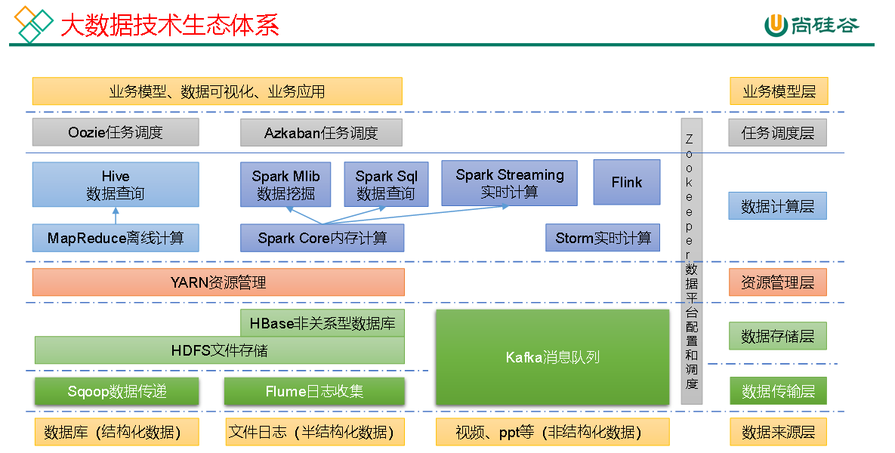
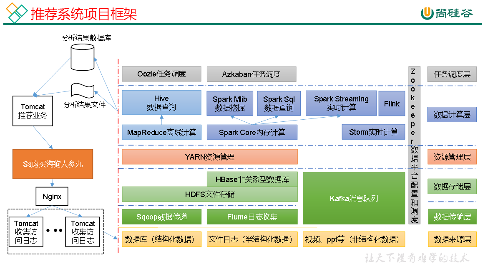
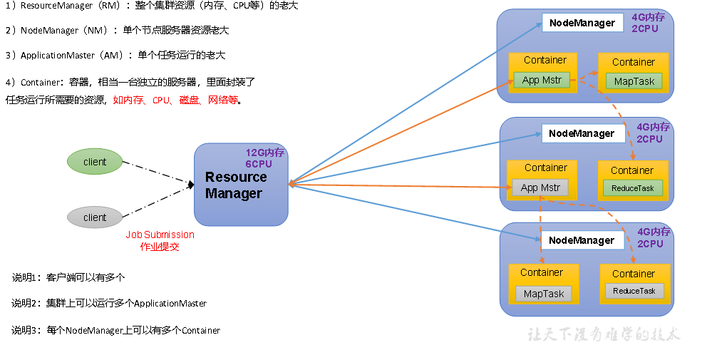
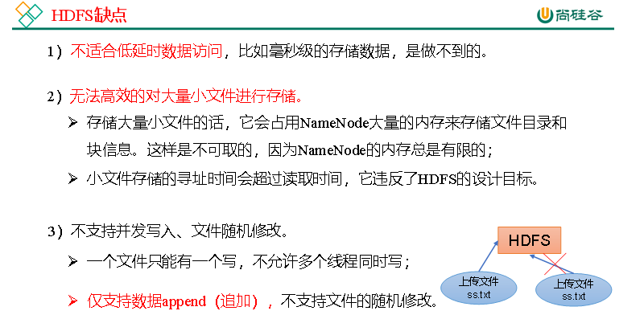

# 尚硅谷Hadoop

尚硅谷Hadoop3.x教程: https://www.bilibili.com/video/BV1Qp4y1n7EN?p=31&spm_id_from=pageDriver








# 1.Hadoop简介

官方文档: https://hadoop.apache.org/docs/r3.1.3/


> Hadoop作用

主要用于解决海量数据存储和分析计算的问题

> Hadoop4高

高可靠性，高扩展性，高效性，高容错性


>Hadoop的组成

Common(辅助工具)， HDFS(数据存储)，Yarn(资源调度)， MapReduce(计算)


## HDFS

Hadoop Distributed File System，简称HDFS，是一个分布式文件系统。

### NameNode(nn)

存文件的元信息(文件名，文件属性等)， 文件的块列表和块所在的DataNode


### DataNode(dn)

存文件的块数据，以及块数据的校验和


### Secondary NameNode(2nn)

NameNode的备份，每隔一段时间会进行备份


## Yarn

Yet Another Resource Negotiator简称YARN ，另一种资源协调者，是Hadoop的资源管理器。

### ResourceManager(RM)

RM是整个集群资源(CPU 内存等的)老大


### NodeManger(NM)

NM是单个节点服务器资源老大


### ApplicationMaster(AM)

AM是单个任务运行的老大


### Container（容器）

容器相当于一台独立的服务器，里面封装了任务运行所需要的资源，如内存,CPU,磁盘,网络等





## MapReduce

MapReduce将计算过程分为两个阶段：Map和Reduce
1）Map阶段并行处理输入数据
2）Reduce阶段对Map结果进行汇总


# 2.环境安装

> xsync同步脚本工具

xsync同步脚本工具 可以同步指定文件或者指定目录，具体代码  

```shell
#!/bin/bash

#1. 判断参数个数
if [ $# -lt 1 ]
then
    echo Not Enough Arguement!
    exit;
fi

#2. 遍历集群所有机器
for host in localhost111 localhost112 localhost113 localhost114
do
    echo ====================  $host  ====================
    #3. 遍历所有目录，挨个发送

    for file in $@
    do
        #4. 判断文件是否存在
        if [ -e $file ]
            then
                #5. 获取父目录
                pdir=$(cd -P $(dirname $file); pwd)

                #6. 获取当前文件的名称
                fname=$(basename $file)
                ssh $host "mkdir -p $pdir"
                rsync -av $pdir/$fname $host:$pdir
            else
                echo $file does not exists!
        fi
    done
done
```

给脚本增加执行权限，另外将其软连接到/usr/local/bin，或者将其所在的目录写入PATH环境变量中（写进/etc/profile文件），这样就可以执行运行xsync命令了

```shell
[root@localhost111 /home/hwj/bin]# ls
xsync

[root@localhost111 /home/hwj/bin]# tail -n 3 /etc/profile
# hwj home env variable
export ROOT_BIN=/home/hwj
export PATH=$PATH:$ROOT_BIN/bin
```


## 2.1 三台虚拟机的准备

1. 准备三台虚拟机，hostname分别设置为localhost111, localhost112, localhost113

```shell
# 比如设置hostname为localhost111
hostnamectl set-hostname localhost111
```

2. 每台虚拟机都有4G内存2C处理器

3. 每台虚拟机之间SSH互相免密登录

4. 每台虚拟机的/etc/hosts分别设置三台主机的ip：主机名的映射

5. 每台虚拟机都安装了hadoop（包括解压hadoop, 配置环境变量）
6. 每台虚拟机都关闭了防火墙


## 2.2 hadoop单机运行

1. cd /opt/module/hadoop-3.1; mkdir wcinput; 

2. cd wcinput

3. vim word.txt

    ```
    hadoop yarn
    hadoop mapreduce
    atguigu
    atguigu
    ```

4. cd /opt/module/hadoop-3.1.3

5. hadoop单机运行

    ```shell
    hadoop jar share/hadoop/mapreduce/hadoop-mapreduce-examples-3.1.3.jar wordcount wcinput wcoutput
    ```

6. 查看结果cat wcoutput/part-r-00000


## 2.3 集群配置


### 集群部署规划

NameNode和SecondaryNameNode不要安装在同一台服务器

ResourceManager也很消耗内存，不要和NameNode、SecondaryNameNode配置在同一台机器上。

|      | locahost111         | locahost112                  | locahost113                  |
| ---- | ------------------- | ---------------------------- | ---------------------------- |
| HDFS | NameNode , DataNode | DataNode                     | SecondaryNameNode,  DataNode |
| YARN | NodeManager         | ResourceManager ,NodeManager | NodeManager                  |


### 配置文件

> 默认配置文件

core-default.xml、hdfs-default.xml、yarn-default.xml、mapred-default.xml

例如`find $HADOOP_HOME -name core-default.xml` 可查看文件所在路径， 其他文件类似


> 自定义配置文件 ($HADOOP_HOME/etc/hadoop)

core-site.xml、hdfs-site.xml、yarn-site.xml、mapred-site.xml


配置core-site.xml、hdfs-site.xml、yarn-site.xml、mapred-site.xml文件

core-site.xml

```xml
<?xml version="1.0" encoding="UTF-8"?>
<?xml-stylesheet type="text/xsl" href="configuration.xsl"?>

<configuration>
    <!-- 指定NameNode的地址 -->
    <property>
        <name>fs.defaultFS</name>
        <value>hdfs://localhost111:8020</value>
    </property>

    <!-- 指定hadoop数据的存储目录 -->
    <property>
        <name>hadoop.tmp.dir</name>
        <value>/opt/module/hadoop-3.1.3/data</value>
    </property>

    <!-- 配置HDFS网页登录使用的静态用户为root -->
    <property>
        <name>hadoop.http.staticuser.user</name>
        <value>root</value>
    </property>
</configuration>
```


hdfs-site.xml

```xml
<?xml version="1.0" encoding="UTF-8"?>
<?xml-stylesheet type="text/xsl" href="configuration.xsl"?>

<configuration>
    <!-- nn web端访问地址-->
    <property>
        <name>dfs.namenode.http-address</name>
        <value>localhos111:9870</value>
    </property>
        <!-- 2nn web端访问地址-->
    <property>
        <name>dfs.namenode.secondary.http-address</name>
        <value>localhost113:9868</value>
    </property>
</configuration>
```


yarn-site.xml

```xml
<?xml version="1.0"?>
<configuration>
    <!-- 指定MR走shuffle -->
    <property>
        <name>yarn.nodemanager.aux-services</name>
        <value>mapreduce_shuffle</value>
    </property>

    <!-- 指定ResourceManager的地址-->
    <property>
        <name>yarn.resourcemanager.hostname</name>
        <value>localhost112</value>
    </property>

    <!-- 环境变量的继承 -->
    <property>
        <name>yarn.nodemanager.env-whitelist</name>
        <value>JAVA_HOME,HADOOP_COMMON_HOME,HADOOP_HDFS_HOME,HADOOP_CONF_DIR,CLASSPATH_PREPEND_DISTCACHE,HADOOP_YARN_HOME,HADOOP_MAPRED_HOME</value>
    </property>
</configuration>

```


mapred-site.xml

```xml
<?xml version="1.0"?>
<?xml-stylesheet type="text/xsl" href="configuration.xsl"?>

<configuration>
    <!-- 指定MapReduce程序运行在Yarn上 -->
    <property>
        <name>mapreduce.framework.name</name>
        <value>yarn</value>
    </property>
</configuration>

```


### 配置works

vim /opt/module/hadoop-3.1.3/etc/hadoop/workers

```
localhost111
localhost112
localhost113
```

xsync /opt/module/hadoop-3.1.3/etc/hadoop/workers


## 2.4 群起集群


### 启动hdfs

第一次启动hdfs, 需要在机器localhost111上进行格式化

```shell 
hdfs namenode -format
```

```shell
# 注意：格式化NameNode，会产生新的集群id，导致NameNode和DataNode的集群id不一致，集群找不到已往数据。如果集群在运行过程中报错，需要重新格式化NameNode的话，一定要先停止namenode和datanode进程，并且要删除所有机器的data和logs目录，然后再进行格式化。
```

启动hdfs

```shell
[root@localhost111 /opt/module/hadoop-3.1.3]# ./sbin/start-dfs.sh
```

停止hdfs

```shell
[root@localhost111 /opt/module/hadoop-3.1.3]# ./sbin/stop-dfs.sh
```

启动yarn.sh

```shell
[root@localhost111 /opt/module/hadoop-3.1.3]# ./sbin/start-yarn.sh
```

停止yarn.sh

```shell
[root@localhost111 /opt/module/hadoop-3.1.3]# ./sbin/stop-yarn.sh
```


各个服务组件逐一启动/停止

```shell
hdfs --daemon start/stop namenode/datanode/secondarynamenode
yarn --daemon start/stop  resourcemanager/nodemanager
```


> 启动，停止hdfs时遇到错误

```shell
# 错误1
[root@localhost111 /opt/module/hadoop-3.1.3/sbin]# ./start-dfs.sh
Starting namenodes on [localhost111]
ERROR: Attempting to operate on hdfs namenode as root
ERROR: but there is no HDFS_NAMENODE_USER defined. Aborting operation.
Starting datanodes
ERROR: Attempting to operate on hdfs datanode as root
ERROR: but there is no HDFS_DATANODE_USER defined. Aborting operation.
Starting secondary namenodes [localhost113]
ERROR: Attempting to operate on hdfs secondarynamenode as root
ERROR: but there is no HDFS_SECONDARYNAMENODE_USER defined. Aborting operation.

# 错误2
[root@localhost111 /opt/module/hadoop-3.1.3/sbin]# ./start-dfs.sh
WARNING: HADOOP_SECURE_DN_USER has been replaced by HDFS_DATANODE_SECURE_USER. Using value of HADOOP_SECURE_DN_USER.
Starting namenodes on [localhost111]
上一次登录：日 4月 24 21:01:42 CST 2022pts/0 上
localhost111: ERROR: JAVA_HOME is not set and could not be found.
Starting datanodes
上一次登录：日 4月 24 21:07:41 CST 2022pts/0 上
localhost111: ERROR: JAVA_HOME is not set and could not be found.
localhost113: ERROR: JAVA_HOME is not set and could not be found.
localhost112: ERROR: JAVA_HOME is not set and could not be found.
Starting secondary namenodes [localhost113]
上一次登录：日 4月 24 21:07:41 CST 2022pts/0 上
localhost113: ERROR: JAVA_HOME is not set and could not be found.

# 错误3
[root@localhost111 /opt/module/hadoop-3.1.3/sbin]# ./start-dfs.sh
WARNING: HADOOP_SECURE_DN_USER has been replaced by HDFS_DATANODE_SECURE_USER. Using value of HADOOP_SECURE_DN_USER.
Starting namenodes on [localhost111]
上一次登录：四 4月 21 08:20:54 CST 2022从 localhost113pts/1 上
localhost111: Permission denied (publickey,gssapi-keyex,gssapi-with-mic,password).
# 这个是因为自己本机的authorized_keys没有自己本地的id_rsa.pub
# cd ~/.ssh
# cat id_rsa.pub >> authorized_keys
# 搞定！
```

> 解决办法

参考： https://blog.csdn.net/qq_32635069/article/details/80859790

参考： https://blog.csdn.net/u013247765/article/details/68487214

```shell
# 错误1和错误2的解决步骤如下
# 1. 脚本start-dfs.sh， stop-dfs.sh增加这几行
HDFS_DATANODE_USER=root
HADOOP_SECURE_DN_USER=hdfs
HDFS_NAMENODE_USER=root
HDFS_SECONDARYNAMENODE_USER=root 

# 2. 脚本start-yarn.sh, stop-yarn.sh增加这几行
YARN_RESOURCEMANAGER_USER=root
HADOOP_SECURE_DN_USER=yarn
YARN_NODEMANAGER_USER=root

# 3. vim $HADOOP_HOME/etc/hadoop/hadoop-env.sh， 找到指定的位置
export JAVA_HOME 改成 export JAVA_HOME=/usr/lib/jdk1.8.0_321

# 4. xsync同步这些改动
xsync start-dfs.sh
xsync stop-dfs.sh
xsync start-yarn.sh
xsync stop-yarn.sh
xsync /opt/module/hadoop-3.1.3/etc/hadoop/hadoop-env.sh

# 5. 重新启动
./stop-dfs.sh
./start-dfs.sh
./stop-yarn.sh  # 注意yarn在ResourceManager的主机上运行
./start-yarn.sh  # 注意yarn在ResourceManager的主机上运行
```


### hdfs, yarn web页面

http://localhost111:9870/explorer.html#/

http://localhost112:8088/cluster


## 2.5 配置历史服务器

为了查看程序的历史运行情况，需要配置一下历史服务器。具体配置步骤如下：

1. 配置mapred-site.xml

```shell
[root@localhost111 /opt/module/hadoop-3.1.3/etc/hadoop]# vim mapred-site.xml
# 在该文件里面增加如下配置。
<!-- 历史服务器端地址 -->
<property>
    <name>mapreduce.jobhistory.address</name>
    <value>localhost111:10020</value>
</property>

<!-- 历史服务器web端地址 -->
<property>
    <name>mapreduce.jobhistory.webapp.address</name>
    <value>localhost111:19888</value>
</property>

```

然后xsync分发配置

```shell
xsync mapred-site.xml
```

2. 启动历史服务器

```
mapred --daemon start historyserver
```

3. jps查看是否启动

4. 访问 http://localhost111:19888/jobhistory/


## 2.6 配置日志聚集

**注意**：开启日志聚集功能，需要重新启动NodeManager 、ResourceManager和HistoryServer

1. 配置yarn-site.xml

```shell
[root@localhost111 /opt/module/hadoop-3.1.3/etc/hadoop]# vim yarn-site.xml
在该文件里面增加如下配置。
    <!-- 开启日志聚集功能 -->
    <property>
        <name>yarn.log-aggregation-enable</name>
        <value>true</value>
    </property>
    <!-- 设置日志聚集服务器地址 -->
    <property>  
        <name>yarn.log.server.url</name>  
        <value>http://localhost111:19888/jobhistory/logs</value>
    </property>
    <!-- 设置日志保留时间为7天 -->
    <property>
        <name>yarn.log-aggregation.retain-seconds</name>
        <value>604800</value>
    </property>
```

2. 分发配置

```shell
xsync $HADOOP_HOME/etc/hadoop/yarn-site.xml
```

3. 重启NodeManager 、ResourceManager和HistoryServer

```shell
$HADOOP_HOME/sbin/stop-yarn.sh
mapred --daemon stop historyserver

$HADOOP_HOME/sbin/start-yarn.sh
mapred --daemon start historyserver
```

4. 执行WordCount程序

```shell
# 删除HDFS上已经存在的输出文件
hadoop fs -rm -r /output
# 执行wordcount
cd /opt/module/hadoop-3.1.3
hadoop jar share/hadoop/mapreduce/hadoop-mapreduce-examples-3.1.3.jar wordcount /input /output
```

5. 查看历史服务器 http://localhost111:19888/jobhistory/


## 2.7 编写Hadoop集群常用脚本

### 1.Hadoop集群启停脚本

```shell
[root@localhost111 /home/hwj/bin]# vim myhadoop.sh
# 添加如下内容
```

```
#!/bin/bash

if [ $# -lt 1 ]
then
    echo "No Args Input..."
    exit ;
fi

case $1 in
"start")
        echo " =================== 启动 hadoop集群 ==================="

        echo " --------------- 启动 hdfs ---------------"
        ssh localhost111 "/opt/module/hadoop-3.1.3/sbin/start-dfs.sh"
        echo " --------------- 启动 yarn ---------------"
        ssh localhost112 "/opt/module/hadoop-3.1.3/sbin/start-yarn.sh"
        echo " --------------- 启动 historyserver ---------------"
        ssh localhost111 "/opt/module/hadoop-3.1.3/bin/mapred --daemon start historyserver"
;;
"stop")
        echo " =================== 关闭 hadoop集群 ==================="

        echo " --------------- 关闭 historyserver ---------------"
        ssh localhost111 "/opt/module/hadoop-3.1.3/bin/mapred --daemon stop historyserver"
        echo " --------------- 关闭 yarn ---------------"
        ssh localhost112 "/opt/module/hadoop-3.1.3/sbin/stop-yarn.sh"
        echo " --------------- 关闭 hdfs ---------------"
        ssh localhost111 "/opt/module/hadoop-3.1.3/sbin/stop-dfs.sh"
;;
*)
    echo "Input Args Error..."
;;
esac
```

```
xsync myhadoop.sh
```


### 2.看三台服务器Java进程脚本：jpsall

```shell
#!/bin/bash

for host in localhost111 localhost112 localhost113
do
    echo =============== $host ===============
    ssh $host $JAVA_HOME/bin/jps
done
```


##  2.8 常用端口号说明

| 端口名称                  | Hadoop2.x   | Hadoop3.x             |
| ------------------------- | ----------- | --------------------- |
| NameNode内部通信端口      | 8020 / 9000 | **8020 / 9000/ 9820** |
| NameNode HTTP UI          | 50070       | **9870**              |
| MapReduce查看执行任务端口 | 8088        | **8088**              |
| 历史服务器通信端口        | 19888       | **19888**             |


# 3.HDFS


## HDFS优缺点

优点


缺点




## HDFS架构

1. NameNode(NN): 就是Master, 它是一个主管，管理者
    1. 管理HDFS的名词空间
    2. 配置副本策略
    3. 管理数据库（Block）映射信息
    4. 处理客户端读写请求

2. DataNode: 就是Slave，NameNode下达命令， DataNode执行实际的操作
    1. 存储实际的数据块
    2. 执行数据块的读写操作


## HDFS命令

```shell
# 查看帮助命令
hadoop fs -help rm
# 创建目录
hadoop fs -mkdir /input
# 上传
hadoop fs -put $HADOOP_HOME/wcinput/word.txt /input
hadoop fs -put /opt/software/jdk-8u212-linux-x64.tar.gz  /
hadoop fs -copyFromLocal weiguo.txt /sanguo   # 等同于-put
hadoop fs -moveFromLocal ./shuguo.txt /sanguo
# 追加一个文件到已经存在的文件末尾
hadoop fs -appendToFile liubei.txt /sanguo/shuguo.txt
# 下载
hadoop fs -get /jdk-8u212-linux-x64.tar.gz ./
hadoop fs -copyToLocal /sanguo/shuguo.txt ./   # 等同于-get
# 运行jar包
hadoop jar share/hadoop/mapreduce/hadoop-mapreduce-examples-3.1.3.jar wordcount /input /output
```

```shell
# 其他命令
1）-ls: 显示目录信息
[atguigu@hadoop102 hadoop-3.1.3]$ hadoop fs -ls /sanguo

2）-cat：显示文件内容
[atguigu@hadoop102 hadoop-3.1.3]$ hadoop fs -cat /sanguo/shuguo.txt

3）-chgrp、-chmod、-chown：Linux文件系统中的用法一样，修改文件所属权限
[atguigu@hadoop102 hadoop-3.1.3]$ hadoop fs  -chmod 666  /sanguo/shuguo.txt
[atguigu@hadoop102 hadoop-3.1.3]$ hadoop fs  -chown  atguigu:atguigu   /sanguo/shuguo.txt

4）-mkdir：创建路径
[atguigu@hadoop102 hadoop-3.1.3]$ hadoop fs -mkdir /jinguo

5）-cp：从HDFS的一个路径拷贝到HDFS的另一个路径
[atguigu@hadoop102 hadoop-3.1.3]$ hadoop fs -cp /sanguo/shuguo.txt /jinguo

6）-mv：在HDFS目录中移动文件
[atguigu@hadoop102 hadoop-3.1.3]$ hadoop fs -mv /sanguo/wuguo.txt /jinguo
[atguigu@hadoop102 hadoop-3.1.3]$ hadoop fs -mv /sanguo/weiguo.txt /jinguo

7）-tail：显示一个文件的末尾1kb的数据
[atguigu@hadoop102 hadoop-3.1.3]$ hadoop fs -tail /jinguo/shuguo.txt

8）-rm：删除文件或文件夹
[atguigu@hadoop102 hadoop-3.1.3]$ hadoop fs -rm /sanguo/shuguo.txt

9）-rm -r：递归删除目录及目录里面内容
[atguigu@hadoop102 hadoop-3.1.3]$ hadoop fs -rm -r /sanguo

10）-du统计文件夹的大小信息
[atguigu@hadoop102 hadoop-3.1.3]$ hadoop fs -du -s -h /jinguo
27  81  /jinguo
# 说明：27表示文件大小；81表示27*3个副本；/jinguo表示查看的目录
[atguigu@hadoop102 hadoop-3.1.3]$ hadoop fs -du  -h /jinguo
14  42  /jinguo/shuguo.txt
7   21   /jinguo/weiguo.txt
6   18   /jinguo/wuguo.tx

11）-setrep：设置HDFS中文件的副本数量
[atguigu@hadoop102 hadoop-3.1.3]$ hadoop fs -setrep 10 /jinguo/shuguo.txt
```


## HDFS API

> 配置Hadoop的Windows依赖

1. winutils下载

https://github.com/kontext-tech/winutils
https://github.com/cdarlint/winutils

这里选择3.1.0版本https://github.com/cdarlint/winutils/tree/master/hadoop-3.1.0/bin

2. 配置HADOOP_HOME环境变量 

    ```shell
    # 1. 增加环境变量HADOOP_HOME， 值如下
    D:\Project\hadoop-3.1.0
    # 2. PATH添加hadoop的bin， 值如下
    %HADOOP_HOME%\bin
    ```

3. 打开winutils.exe


4. 解决报错


