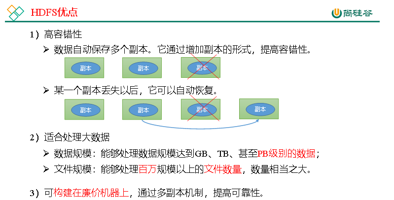
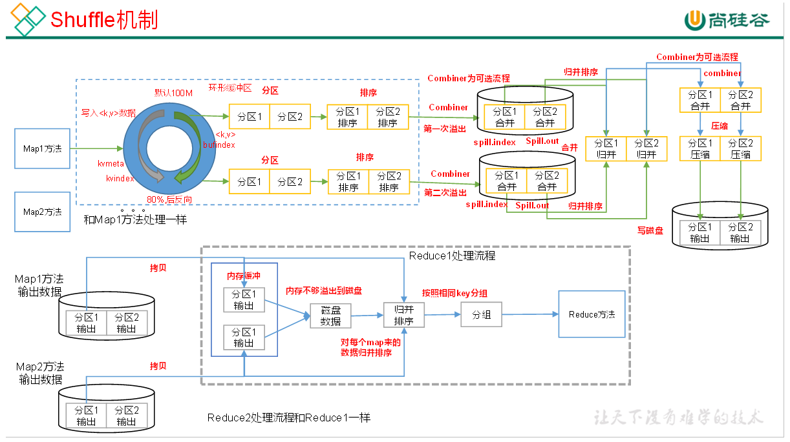

# 尚硅谷Hadoop

尚硅谷Hadoop3.x教程: https://www.bilibili.com/video/BV1Qp4y1n7EN?p=31&spm_id_from=pageDriver


# 1.Hadoop简介

官方文档: https://hadoop.apache.org/docs/r3.1.3/


> Hadoop作用

主要用于解决海量数据存储和分析计算的问题

> Hadoop4高

高可靠性，高扩展性，高效性，高容错性


>Hadoop的组成

Common(辅助工具)， HDFS(数据存储)，Yarn(资源调度)， MapReduce(计算)


## HDFS

Hadoop Distributed File System，简称HDFS，是一个分布式文件系统。

### NameNode(nn)

存文件的元信息(文件名，文件属性等)， 文件的块列表和块所在的DataNode


### DataNode(dn)

存文件的块数据，以及块数据的校验和


### Secondary NameNode(2nn)

NameNode的备份，每隔一段时间会进行备份


## Yarn

Yet Another Resource Negotiator简称YARN ，另一种资源协调者，是Hadoop的资源管理器。

### ResourceManager(RM)

RM是整个集群资源(CPU 内存等的)老大


### NodeManger(NM)

NM是单个节点服务器资源老大


### ApplicationMaster(AM)

AM是单个任务运行的老大


### Container（容器）

容器相当于一台独立的服务器，里面封装了任务运行所需要的资源，如内存,CPU,磁盘,网络等


## MapReduce

MapReduce将计算过程分为两个阶段：Map和Reduce
1）Map阶段并行处理输入数据
2）Reduce阶段对Map结果进行汇总


# 2.环境安装

> xsync同步脚本工具

xsync同步脚本工具 可以同步指定文件或者指定目录，具体代码  

```shell
#!/bin/bash

#1. 判断参数个数
if [ $# -lt 1 ]
then
    echo Not Enough Arguement!
    exit;
fi

#2. 遍历集群所有机器
for host in localhost111 localhost112 localhost113 localhost114
do
    echo ====================  $host  ====================
    #3. 遍历所有目录，挨个发送

    for file in $@
    do
        #4. 判断文件是否存在
        if [ -e $file ]
            then
                #5. 获取父目录
                pdir=$(cd -P $(dirname $file); pwd)

                #6. 获取当前文件的名称
                fname=$(basename $file)
                ssh $host "mkdir -p $pdir"
                rsync -av $pdir/$fname $host:$pdir
            else
                echo $file does not exists!
        fi
    done
done
```

给脚本增加执行权限，另外将其软连接到/usr/local/bin，或者将其所在的目录写入PATH环境变量中（写进/etc/profile文件），这样就可以执行运行xsync命令了

```shell
[root@localhost111 /home/hwj/bin]# ls
xsync

[root@localhost111 /home/hwj/bin]# tail -n 3 /etc/profile
# hwj home env variable
export ROOT_BIN=/home/hwj
export PATH=$PATH:$ROOT_BIN/bin
```


## 2.1 三台虚拟机的准备

1. 准备三台虚拟机，hostname分别设置为localhost111, localhost112, localhost113

```shell
# 比如设置hostname为localhost111
hostnamectl set-hostname localhost111
```

2. 每台虚拟机都有4G内存2C处理器

3. 每台虚拟机之间SSH互相免密登录

4. 每台虚拟机的/etc/hosts分别设置三台主机的ip：主机名的映射

5. 每台虚拟机都安装了hadoop（包括解压hadoop, 配置环境变量）
6. 每台虚拟机都关闭了防火墙


## 2.2 hadoop单机运行

1. cd /opt/module/hadoop-3.1; mkdir wcinput; 

2. cd wcinput

3. vim word.txt

    ```
    hadoop yarn
    hadoop mapreduce
    atguigu
    atguigu
    ```

4. cd /opt/module/hadoop-3.1.3

5. hadoop单机运行

    ```shell
    hadoop jar share/hadoop/mapreduce/hadoop-mapreduce-examples-3.1.3.jar wordcount wcinput wcoutput
    ```

6. 查看结果cat wcoutput/part-r-00000


## 2.3 集群配置


### 集群部署规划

NameNode和SecondaryNameNode不要安装在同一台服务器

ResourceManager也很消耗内存，不要和NameNode、SecondaryNameNode配置在同一台机器上。

|      | locahost111         | locahost112                  | locahost113                  |
| ---- | ------------------- | ---------------------------- | ---------------------------- |
| HDFS | NameNode , DataNode | DataNode                     | SecondaryNameNode,  DataNode |
| YARN | NodeManager         | ResourceManager ,NodeManager | NodeManager                  |


### 配置文件

> 默认配置文件

core-default.xml、hdfs-default.xml、yarn-default.xml、mapred-default.xml

例如`find $HADOOP_HOME -name core-default.xml` 可查看文件所在路径， 其他文件类似


> 自定义配置文件 ($HADOOP_HOME/etc/hadoop)

core-site.xml、hdfs-site.xml、yarn-site.xml、mapred-site.xml


配置core-site.xml、hdfs-site.xml、yarn-site.xml、mapred-site.xml文件

core-site.xml

```xml
<?xml version="1.0" encoding="UTF-8"?>
<?xml-stylesheet type="text/xsl" href="configuration.xsl"?>

<configuration>
    <!-- 指定NameNode的地址 -->
    <property>
        <name>fs.defaultFS</name>
        <value>hdfs://localhost111:8020</value>
    </property>

    <!-- 指定hadoop数据的存储目录 -->
    <property>
        <name>hadoop.tmp.dir</name>
        <value>/opt/module/hadoop-3.1.3/data</value>
    </property>

    <!-- 配置HDFS网页登录使用的静态用户为root -->
    <property>
        <name>hadoop.http.staticuser.user</name>
        <value>root</value>
    </property>
</configuration>
```


hdfs-site.xml

```xml
<?xml version="1.0" encoding="UTF-8"?>
<?xml-stylesheet type="text/xsl" href="configuration.xsl"?>

<configuration>
    <!-- nn web端访问地址-->
    <property>
        <name>dfs.namenode.http-address</name>
        <value>localhos111:9870</value>
    </property>
        <!-- 2nn web端访问地址-->
    <property>
        <name>dfs.namenode.secondary.http-address</name>
        <value>localhost113:9868</value>
    </property>
</configuration>
```


yarn-site.xml

```xml
<?xml version="1.0"?>
<configuration>
    <!-- 指定MR走shuffle -->
    <property>
        <name>yarn.nodemanager.aux-services</name>
        <value>mapreduce_shuffle</value>
    </property>

    <!-- 指定ResourceManager的地址-->
    <property>
        <name>yarn.resourcemanager.hostname</name>
        <value>localhost112</value>
    </property>

    <!-- 环境变量的继承 -->
    <property>
        <name>yarn.nodemanager.env-whitelist</name>
        <value>JAVA_HOME,HADOOP_COMMON_HOME,HADOOP_HDFS_HOME,HADOOP_CONF_DIR,CLASSPATH_PREPEND_DISTCACHE,HADOOP_YARN_HOME,HADOOP_MAPRED_HOME</value>
    </property>
</configuration>

```


mapred-site.xml

```xml
<?xml version="1.0"?>
<?xml-stylesheet type="text/xsl" href="configuration.xsl"?>

<configuration>
    <!-- 指定MapReduce程序运行在Yarn上 -->
    <property>
        <name>mapreduce.framework.name</name>
        <value>yarn</value>
    </property>
</configuration>

```


### 配置works

vim /opt/module/hadoop-3.1.3/etc/hadoop/workers

```
localhost111
localhost112
localhost113
```

xsync /opt/module/hadoop-3.1.3/etc/hadoop/workers


## 2.4 群起集群（开发重点）


### 启动hdfs命令

第一次启动hdfs, 需要在机器localhost111上进行格式化

```shell 
hdfs namenode -format
```

```shell
# 注意：格式化NameNode，会产生新的集群id，导致NameNode和DataNode的集群id不一致，集群找不到已往数据。如果集群在运行过程中报错，需要重新格式化NameNode的话，一定要先停止namenode和datanode进程，并且要删除所有机器的data和logs目录，然后再进行格式化。
```

启动hdfs

```shell
[root@localhost111 /opt/module/hadoop-3.1.3]# ./sbin/start-dfs.sh
```

停止hdfs

```shell
[root@localhost111 /opt/module/hadoop-3.1.3]# ./sbin/stop-dfs.sh
```

启动yarn.sh

```shell
[root@localhost111 /opt/module/hadoop-3.1.3]# ./sbin/start-yarn.sh
```

停止yarn.sh

```shell
[root@localhost111 /opt/module/hadoop-3.1.3]# ./sbin/stop-yarn.sh
```


各个服务组件逐一启动/停止

```shell
hdfs --daemon start/stop namenode/datanode/secondarynamenode
yarn --daemon start/stop  resourcemanager/nodemanager
```


> 启动，停止hdfs时遇到错误

```shell
# 错误1
[root@localhost111 /opt/module/hadoop-3.1.3/sbin]# ./start-dfs.sh
Starting namenodes on [localhost111]
ERROR: Attempting to operate on hdfs namenode as root
ERROR: but there is no HDFS_NAMENODE_USER defined. Aborting operation.
Starting datanodes
ERROR: Attempting to operate on hdfs datanode as root
ERROR: but there is no HDFS_DATANODE_USER defined. Aborting operation.
Starting secondary namenodes [localhost113]
ERROR: Attempting to operate on hdfs secondarynamenode as root
ERROR: but there is no HDFS_SECONDARYNAMENODE_USER defined. Aborting operation.

# 错误2
[root@localhost111 /opt/module/hadoop-3.1.3/sbin]# ./start-dfs.sh
WARNING: HADOOP_SECURE_DN_USER has been replaced by HDFS_DATANODE_SECURE_USER. Using value of HADOOP_SECURE_DN_USER.
Starting namenodes on [localhost111]
上一次登录：日 4月 24 21:01:42 CST 2022pts/0 上
localhost111: ERROR: JAVA_HOME is not set and could not be found.
Starting datanodes
上一次登录：日 4月 24 21:07:41 CST 2022pts/0 上
localhost111: ERROR: JAVA_HOME is not set and could not be found.
localhost113: ERROR: JAVA_HOME is not set and could not be found.
localhost112: ERROR: JAVA_HOME is not set and could not be found.
Starting secondary namenodes [localhost113]
上一次登录：日 4月 24 21:07:41 CST 2022pts/0 上
localhost113: ERROR: JAVA_HOME is not set and could not be found.

# 错误3
[root@localhost111 /opt/module/hadoop-3.1.3/sbin]# ./start-dfs.sh
WARNING: HADOOP_SECURE_DN_USER has been replaced by HDFS_DATANODE_SECURE_USER. Using value of HADOOP_SECURE_DN_USER.
Starting namenodes on [localhost111]
上一次登录：四 4月 21 08:20:54 CST 2022从 localhost113pts/1 上
localhost111: Permission denied (publickey,gssapi-keyex,gssapi-with-mic,password).
# 这个是因为自己本机的authorized_keys没有自己本地的id_rsa.pub
# cd ~/.ssh
# cat id_rsa.pub >> authorized_keys
# 搞定！
```

> 解决办法

参考： https://blog.csdn.net/qq_32635069/article/details/80859790

参考： https://blog.csdn.net/u013247765/article/details/68487214

```shell
# 错误1和错误2的解决步骤如下
# 1. 脚本start-dfs.sh， stop-dfs.sh增加这几行
HDFS_DATANODE_USER=root
HADOOP_SECURE_DN_USER=hdfs
HDFS_NAMENODE_USER=root
HDFS_SECONDARYNAMENODE_USER=root 

# 2. 脚本start-yarn.sh, stop-yarn.sh增加这几行
YARN_RESOURCEMANAGER_USER=root
HADOOP_SECURE_DN_USER=yarn
YARN_NODEMANAGER_USER=root

# 3. vim $HADOOP_HOME/etc/hadoop/hadoop-env.sh， 找到指定的位置
export JAVA_HOME 改成 export JAVA_HOME=/usr/lib/jdk1.8.0_321

# 4. xsync同步这些改动
xsync start-dfs.sh
xsync stop-dfs.sh
xsync start-yarn.sh
xsync stop-yarn.sh
xsync /opt/module/hadoop-3.1.3/etc/hadoop/hadoop-env.sh

# 5. 重新启动
./stop-dfs.sh
./start-dfs.sh
./stop-yarn.sh  # 注意yarn在ResourceManager的主机上运行
./start-yarn.sh  # 注意yarn在ResourceManager的主机上运行
```


### hdfs, yarn web页面

http://localhost111:9870/explorer.html#/

http://localhost112:8088/cluster


## 2.5 配置历史服务器

为了查看程序的历史运行情况，需要配置一下历史服务器。具体配置步骤如下：

1. 配置mapred-site.xml

```shell
[root@localhost111 /opt/module/hadoop-3.1.3/etc/hadoop]# vim mapred-site.xml
# 在该文件里面增加如下配置。
<!-- 历史服务器端地址 -->
<property>
    <name>mapreduce.jobhistory.address</name>
    <value>localhost111:10020</value>
</property>

<!-- 历史服务器web端地址 -->
<property>
    <name>mapreduce.jobhistory.webapp.address</name>
    <value>localhost111:19888</value>
</property>

```

然后xsync分发配置

```shell
xsync mapred-site.xml
```

2. 启动历史服务器

```
mapred --daemon start historyserver
```

3. jps查看是否启动

4. 访问 http://localhost111:19888/jobhistory/


## 2.6 配置日志聚集

**注意**：开启日志聚集功能，需要重新启动NodeManager 、ResourceManager和HistoryServer

1. 配置yarn-site.xml

```shell
[root@localhost111 /opt/module/hadoop-3.1.3/etc/hadoop]# vim yarn-site.xml
在该文件里面增加如下配置。
    <!-- 开启日志聚集功能 -->
    <property>
        <name>yarn.log-aggregation-enable</name>
        <value>true</value>
    </property>
    <!-- 设置日志聚集服务器地址 -->
    <property>  
        <name>yarn.log.server.url</name>  
        <value>http://localhost111:19888/jobhistory/logs</value>
    </property>
    <!-- 设置日志保留时间为7天 -->
    <property>
        <name>yarn.log-aggregation.retain-seconds</name>
        <value>604800</value>
    </property>
```

2. 分发配置

```shell
xsync $HADOOP_HOME/etc/hadoop/yarn-site.xml
```

3. 重启NodeManager 、ResourceManager和HistoryServer

```shell
$HADOOP_HOME/sbin/stop-yarn.sh
mapred --daemon stop historyserver

$HADOOP_HOME/sbin/start-yarn.sh
mapred --daemon start historyserver
```

4. 执行WordCount程序

```shell
# 删除HDFS上已经存在的输出文件
hadoop fs -rm -r /output
# 执行wordcount
cd /opt/module/hadoop-3.1.3
hadoop jar share/hadoop/mapreduce/hadoop-mapreduce-examples-3.1.3.jar wordcount /input /output
```

5. 查看历史服务器 http://localhost111:19888/jobhistory/


## 2.7 编写Hadoop集群常用脚本

### 1.Hadoop集群启停脚本

```shell
[root@localhost111 /home/hwj/bin]# vim myhadoop.sh
# 添加如下内容
```

```
#!/bin/bash

if [ $# -lt 1 ]
then
    echo "No Args Input..."
    exit ;
fi

case $1 in
"start")
        echo " =================== 启动 hadoop集群 ==================="

        echo " --------------- 启动 hdfs ---------------"
        ssh localhost111 "/opt/module/hadoop-3.1.3/sbin/start-dfs.sh"
        echo " --------------- 启动 yarn ---------------"
        ssh localhost112 "/opt/module/hadoop-3.1.3/sbin/start-yarn.sh"
        echo " --------------- 启动 historyserver ---------------"
        ssh localhost111 "/opt/module/hadoop-3.1.3/bin/mapred --daemon start historyserver"
;;
"stop")
        echo " =================== 关闭 hadoop集群 ==================="

        echo " --------------- 关闭 historyserver ---------------"
        ssh localhost111 "/opt/module/hadoop-3.1.3/bin/mapred --daemon stop historyserver"
        echo " --------------- 关闭 yarn ---------------"
        ssh localhost112 "/opt/module/hadoop-3.1.3/sbin/stop-yarn.sh"
        echo " --------------- 关闭 hdfs ---------------"
        ssh localhost111 "/opt/module/hadoop-3.1.3/sbin/stop-dfs.sh"
;;
*)
    echo "Input Args Error..."
;;
esac
```

```
xsync myhadoop.sh
```


### 2.看三台服务器Java进程脚本：jpsall

```shell
#!/bin/bash

for host in localhost111 localhost112 localhost113
do
    echo =============== $host ===============
    ssh $host $JAVA_HOME/bin/jps
done
```


##  2.8 常用端口号说明

| 端口名称                  | Hadoop2.x   | Hadoop3.x             |
| ------------------------- | ----------- | --------------------- |
| NameNode内部通信端口      | 8020 / 9000 | **8020 / 9000/ 9820** |
| NameNode HTTP UI          | 50070       | **9870**              |
| MapReduce查看执行任务端口 | 8088        | **8088**              |
| 历史服务器通信端口        | 19888       | **19888**             |


# 3.HDFS


## HDFS优缺点

优点



缺点


## HDFS架构

1. NameNode(NN): 就是Master, 它是一个主管，管理者
    1. 管理HDFS的名词空间
    2. 配置副本策略
    3. 管理数据库（Block）映射信息
    4. 处理客户端读写请求

2. DataNode: 就是Slave，NameNode下达命令， DataNode执行实际的操作
    1. 存储实际的数据块
    2. 执行数据块的读写操作


## HDFS命令

```shell
# 查看帮助命令
hadoop fs -help rm
# 创建目录
hadoop fs -mkdir /input
# 上传
hadoop fs -put $HADOOP_HOME/wcinput/word.txt /input
hadoop fs -put /opt/software/jdk-8u212-linux-x64.tar.gz  /
hadoop fs -copyFromLocal weiguo.txt /sanguo   # 等同于-put
hadoop fs -moveFromLocal ./shuguo.txt /sanguo
# 追加一个文件到已经存在的文件末尾
hadoop fs -appendToFile liubei.txt /sanguo/shuguo.txt
# 下载
hadoop fs -get /jdk-8u212-linux-x64.tar.gz ./
hadoop fs -copyToLocal /sanguo/shuguo.txt ./   # 等同于-get
# 运行jar包
hadoop jar share/hadoop/mapreduce/hadoop-mapreduce-examples-3.1.3.jar wordcount /input /output
```

```shell
# 其他命令
1）-ls: 显示目录信息
[atguigu@hadoop102 hadoop-3.1.3]$ hadoop fs -ls /sanguo

2）-cat：显示文件内容
[atguigu@hadoop102 hadoop-3.1.3]$ hadoop fs -cat /sanguo/shuguo.txt

3）-chgrp、-chmod、-chown：Linux文件系统中的用法一样，修改文件所属权限
[atguigu@hadoop102 hadoop-3.1.3]$ hadoop fs  -chmod 666  /sanguo/shuguo.txt
[atguigu@hadoop102 hadoop-3.1.3]$ hadoop fs  -chown  atguigu:atguigu   /sanguo/shuguo.txt

4）-mkdir：创建路径
[atguigu@hadoop102 hadoop-3.1.3]$ hadoop fs -mkdir /jinguo

5）-cp：从HDFS的一个路径拷贝到HDFS的另一个路径
[atguigu@hadoop102 hadoop-3.1.3]$ hadoop fs -cp /sanguo/shuguo.txt /jinguo

6）-mv：在HDFS目录中移动文件
[atguigu@hadoop102 hadoop-3.1.3]$ hadoop fs -mv /sanguo/wuguo.txt /jinguo
[atguigu@hadoop102 hadoop-3.1.3]$ hadoop fs -mv /sanguo/weiguo.txt /jinguo

7）-tail：显示一个文件的末尾1kb的数据
[atguigu@hadoop102 hadoop-3.1.3]$ hadoop fs -tail /jinguo/shuguo.txt

8）-rm：删除文件或文件夹
[atguigu@hadoop102 hadoop-3.1.3]$ hadoop fs -rm /sanguo/shuguo.txt

9）-rm -r：递归删除目录及目录里面内容
[atguigu@hadoop102 hadoop-3.1.3]$ hadoop fs -rm -r /sanguo

10）-du统计文件夹的大小信息
[atguigu@hadoop102 hadoop-3.1.3]$ hadoop fs -du -s -h /jinguo
27  81  /jinguo
# 说明：27表示文件大小；81表示27*3个副本；/jinguo表示查看的目录
[atguigu@hadoop102 hadoop-3.1.3]$ hadoop fs -du  -h /jinguo
14  42  /jinguo/shuguo.txt
7   21   /jinguo/weiguo.txt
6   18   /jinguo/wuguo.tx

11）-setrep：设置HDFS中文件的副本数量
[atguigu@hadoop102 hadoop-3.1.3]$ hadoop fs -setrep 10 /jinguo/shuguo.txt
```


## HDFS API

> 配置Hadoop的Windows依赖

1. winutils下载

https://github.com/kontext-tech/winutils
https://github.com/cdarlint/winutils

这里选择3.1.0版本https://github.com/cdarlint/winutils/tree/master/hadoop-3.1.0/bin

2. 配置HADOOP_HOME环境变量 

    ```shell
    # 1. 增加环境变量HADOOP_HOME， 值如下
    D:\Project\hadoop-3.1.0
    # 2. PATH添加hadoop的bin， 值如下
    %HADOOP_HOME%\bin
    ```

3. 打开winutils.exe


4. 解决报错

这个时候需要安装微软常用运行库合集

资源连接https://www.52pojie.cn/thread-1239861-1-1.html


> API代码

https://github.com/Master-He/HdfsClientDemo/blob/main/src/test/java/HdfsClientTest.java


## HDFS读写流程


### 写数据流程

个人理解： 客户端先问NameNode能不能上传文件（查看权限和目录结构），如果能就再问上传到哪些DataNode节点,  然后访问某个DataNode节点上传数据


### 读数据流程

个人理解: 客户端先问NameNode能不能下载文件（查看文件，文件是否存在）得到文件的元数据， 然后串行请求DataNode获取数据


### 网络拓扑-节点距离计算

在HDFS写数据的过程中，NameNode会选择距离待上传数据最近距离的DataNode接收数据。那么这个最近距离怎么计算呢？


## NN和2NN工作机制

### NameNode和SecondaryNameNode的工作机制

思考：NameNode中的元数据是存储在哪里的？

首先，我们做个假设，如果存储在NameNode节点的磁盘中，因为经常需要进行随机访问，还有响应客户请求，必然是效率过低。因此，元数据需要存放在内存中。但如果只存在内存中，一旦断电，元数据丢失，整个集群就无法工作了。因此产生在磁盘中备份元数据的FsImage。

这样又会带来新的问题，当在内存中的元数据更新时，如果同时更新FsImage，就会导致效率过低，但如果不更新，就会发生一致性问题，一旦NameNode节点断电，就会产生数据丢失。因此，引入Edits文件（只进行追加操作，效率很高）。每当元数据有更新或者添加元数据时，修改内存中的元数据并追加到Edits中。这样，一旦NameNode节点断电，可以通过FsImage和Edits的合并，合成元数据。

但是，如果长时间添加数据到Edits中，会导致该文件数据过大，效率降低，而且一旦断电，恢复元数据需要的时间过长。因此，需要定期进行FsImage和Edits的合并，如果这个操作由NameNode节点完成，又会效率过低。因此，引入一个新的节点SecondaryNamenode，专门用于FsImage和Edits的合并。


写Eidts文件效率很高是因为， 顺序写磁盘的效率和随机内存访问的持平，甚至顺序写磁盘比随机内存访问更快


https://houbb.github.io/2018/09/19/kafka-fast-reason


### Fsimage和Edits解析


oiv和oev命令 查看Fsimage文件和Edits文件

```shell
[root@localhost111 ~]# hdfs oiv --help
Usage: bin/hdfs oiv [OPTIONS] -i INPUTFILE -o OUTPUTFILE
Offline Image Viewer
View a Hadoop fsimage INPUTFILE using the specified PROCESSOR,
saving the results in OUTPUTFILE.
# 查看Fsimage
# hdfs oiv -p XML -i fsimage_0000000000000000025 -o /opt/module/hadoop-3.1.3/fsimage.xml
# 思考：可以看出，Fsimage中没有记录块所对应DataNode，为什么？
# 在集群启动后，要求DataNode上报数据块信息，并间隔一段时间后再次上报。

[root@localhost111 ~]# hdfs oev --help
Usage: bin/hdfs oev [OPTIONS] -i INPUT_FILE -o OUTPUT_FILE
Offline edits viewer
Parse a Hadoop edits log file INPUT_FILE and save results in OUTPUT_FILE.

# 查看Edits
# hdfs oev -p XML -i edits_0000000000000000012-0000000000000000013 -o /opt/module/hadoop-3.1.3/edits.xml
# 思考：NameNode如何确定下次开机启动的时候合并哪些Edits？
# fsimages文件后缀是个序号，这个需要之前的都已经进行合并了，只需要合并这个序号之后的Edits
```


5.3 CheckPoint时间设置
1）通常情况下，SecondaryNameNode每隔一小时执行一次。
	[hdfs-default.xml]

```xml
<property>
  <name>dfs.namenode.checkpoint.period</name>
  <value>3600s</value>
</property>
```

2）一分钟检查一次操作次数，当操作次数达到1百万时，SecondaryNameNode执行一次。

```xml
<property>
  	<name>dfs.namenode.checkpoint.check.period</name>
  	<value>60s</value>
	<description> 1分钟检查一次操作次数</description>
</property>

<property>
  	<name>dfs.namenode.checkpoint.check.period</name>
  	<value>60s</value>
	<description> 1分钟检查一次操作次数</description>
</property>
```


## DataNode工作机制

### DataNode工作机制


（1）一个数据块在DataNode上以文件形式存储在磁盘上，包括两个文件，一个是数据本身，一个是元数据包括数据块的长度，块数据的校验和，以及时间戳。（2）DataNode启动后向NameNode注册，通过后，周期性（6小时）的向NameNode上报所有的块信息。

DN向NN汇报当前解读信息的时间间隔，默认6小时；

```xml
<property>
	<name>dfs.blockreport.intervalMsec</name>
	<value>21600000</value>
	<description>Determines block reporting interval in milliseconds.</description>
</property>
```

DN扫描自己节点块信息列表的时间，默认6小时

```xml
<property>
	<name>dfs.datanode.directoryscan.interval</name>
	<value>21600s</value>
	<description>Interval in seconds for Datanode to scan data directories and reconcile the difference between blocks in memory and on the disk. Support multiple time unit suffix(case insensitive), as described in dfs.heartbeat.interval.</description>
</property>
```

（3）心跳是每3秒一次，心跳返回结果带有NameNode给该DataNode的命令如复制块数据到另一台机器，或删除某个数据块。如果超过10分钟没有收到某个DataNode的心跳，则认为该节点不可用。


### 数据完整性

如下是DataNode节点保证数据完整性的方法。
（1）当DataNode读取Block的时候，它会计算CheckSum。
（2）如果计算后的CheckSum，与Block创建时值不一样，说明Block已经损坏。
（3）Client读取其他DataNode上的Block。
（4）常见的校验算法crc（32），md5（128），sha1（160）
（5）DataNode在其文件创建后周期验证CheckSum。


### 掉线时限参数设置


需要注意的是hdfs-site.xml 配置文件中的heartbeat.recheck.interval的单位为毫秒，dfs.heartbeat.interval的单位为秒。

```xml
<property>
    <name>dfs.namenode.heartbeat.recheck-interval</name>
    <value>300000</value>
</property>

<property>
    <name>dfs.heartbeat.interval</name>
    <value>3</value>
</property>
```


## 总结

1.  HDFS文件块大小（面试重点）
    1. 看硬盘读写速度， 在企业中 一般128m（小公司），256m（大公司）
2. HDFS的shell操作（开发重点）
3. HDFS的读写流程（面试重点）


# 4.MapReduce

说明： 因为工作中没有用MapReduce， 用的是Flink， 所以这里不做深入的探究。

项目代码demo ：https://github.com/Master-He/MapReduceDemo


## MapReduce定义、优缺点

> 定义

MapReduce 是一个分布式运算程序的编程框架，是用户开发“基于 Hadoop 的数据分析
应用”的核心框架。
MapReduce 核心功能是将用户编写的业务逻辑代码和自带默认组件整合成一个完整的
分布式运算程序，并发运行在一个 Hadoop 集群上。

> 优点

1）MapReduce 易于编程， 它简单的实现一些接口，就可以完成一个分布式程序

2）良好的扩展性， 简单的增加机器来扩展它的计算能力。

3）高容错性，其中一台机器挂了，它可以把上面的计算任务转移到另外一个节点上运行， 不至于这个任务运行失败，这些由 Hadoop 内部完成

4）适合 PB 级以上海量数据的离线处理

> 缺点

1）不擅长实时计算

2）不擅长流式计算

3）不擅长 DAG（有向无环图）计算, MapReduce 并不是不能做，而是使用后，每个 MapReduce 作业的输出结果都会写入到磁盘，
会造成大量的磁盘 IO，导致性能非常的低下。


MapReduce核心思想


个人理解：map阶段主要做计算， reduce阶段主要做结果统计（可以没有reduce阶段）


## MapReduce进程

（1）MrAppMaster：负责整个程序的过程调度及状态协调。
（2）MapTask：负责 Map 阶段的整个数据处理流程。
（3）ReduceTask：负责 Reduce 阶段的整个数据处理流程。


## MapReduce编写

> 常用数据序列化类型

| Java类型   | HadoopWritable类型 |
| ---------- | ------------------ |
| Boolean    | BooleanWritable    |
| Byte       | ByteWritable       |
| Int        | IntWritable        |
| Float      | FloatWritable      |
| Long       | LongWritable       |
| Double     | DoubleWritable     |
| **String** | **Text**           |
| Map        | MapWritable        |
| Array      | ArrayWritable      |
| Null       | NullWritable       |


> 编程规范

1．Mapper阶段
（1）用户自定义的Mapper要继承自己的父类
（2）Mapper的输入数据是KV对的形式（KV的类型可自定义） 
（3）Mapper中的业务逻辑写在map()方法中
（4）Mapper的输出数据是KV对的形式（KV的类型可自定义） 
（5）map()方法（MapTask进程）对每一个<K,V>调用一次

2.Reduce阶段
（1）用户自定义的Reducer要继承自己的父类 
（2）Reducer的输入数据类型对应Mapper的输出数据类型，也是KV 
（3）Reducer的业务逻辑写在reduce()方法中 
（4）ReduceTask进程对每一组相同k的<k,v>组调用一次reduce()方法 Reducer阶段

3.Driiver阶段
相当于YARN集群的客户端，用于提交我们整个程序到YARN集群，提交的是封装了MapReduce程序相关运行参数的job对象


项目代码demo ：https://github.com/Master-He/MapReduceDemo

打包maven项目， 然后放到服务器中运行

```shell
hadoop jar /opt/MapReduceDemo-1.0-SNAPSHOT-jar-with-dependencies.jar org.example.mapreduce.wordcount2.WordCountDriver /input/inputword /output/output888

# 在hdfs系统中（http://localhost111:9870/explorer.html#/）上传/input/inputword文件，内容为
atguigu atguigu
ss ss
cls cls
jiao
banzhang
xue
hadoop
```


## Hadoop序列化

自定义bean对象实现序列化接口（Writable）

查看案例代码： https://github.com/Master-He/MapReduceDemo/tree/main/src/main/java/org/example/mapreduce/writable


## MapReduce框架


### 切片与MapTask并行度决定机制

**数据切片**：数据切片只是在逻辑上对输入进行分片，并不会在磁盘上将其切分成片进行存储。数据切片是MapReduce程序计算输入数据的单位，一个切片会对应启动一个MapTask。

**数据块**：Block是HDFS物理上把数据分成一块一块。数据块是HDFS存储数据单位。


### 切片机制


### TextInputFormat

TextInputFormat是默认的FileInputFormat实现类。


### CombineTextInputFormat

框架默认的TextInputFormat切片机制是对任务按文件规划切片，不管文件多小，都会是一个单独的切片，都会交给一个MapTask，这样如果有大量小文件，就会产生大量的MapTask，处理效率极其低下。这个时候可以用CombineTextInputFormat解决这个问题

CombineTextInputFormat 用于小文件过多的场景，它可以将多个小文件从逻辑上规划到一个切片中，这样，多个小文件就可以交给一个MapTask处理。
CombineTextInputFormat 生成切片过程包括：虚拟存储过程和切片过程二部分。
CombineTextInputFormat案例： https://github.com/Master-He/MapReduceDemo/tree/main/src/main/java/org/example/mapreduce/combineTextInputforamt


### MapReduce工作流程


Map方法之后，Reduce方法之前的数据处理过程称之为Shuffle。

具体Shuffle过程详解，如下：
（1）MapTask收集我们的map()方法输出的kv对，放到内存缓冲区中
（2）从内存缓冲区不断溢出本地磁盘文件，可能会溢出多个文件
（3）多个溢出文件会被合并成大的溢出文件
（4）在溢出过程及合并的过程中，都要调用Partitioner进行分区和针对key进行排序
（5）ReduceTask根据自己的分区号，去各个MapTask机器上取相应的结果分区数据
（6）ReduceTask会抓取到同一个分区的来自不同MapTask的结果文件，ReduceTask会将这些文件再进行合并（归并排序）
（7）合并成大文件后，Shuffle的过程也就结束了，后面进入ReduceTask的逻辑运算过程（从文件中取出一个一个的键值对Group，调用用户自定义的reduce()方法）
注意：
（1）Shuffle中的缓冲区大小会影响到MapReduce程序的执行效率，原则上说，缓冲区越大，磁盘io的次数越少，执行速度就越快。
（2）缓冲区的大小可以通过参数调整，参数：mapreduce.task.io.sort.mb默认100M。




### Partition分区

分区案例代码： https://github.com/Master-He/MapReduceDemo/tree/main/src/main/java/org/example/mapreduce/partitioner

分区总结：


### Conbiner

Conbiner 本质就是Map阶段的特殊的Reduce, 它继承与Reduce。 在Map阶段Conbiner有助于减少网络传输
**注意！** **注意!** Conbiner的应用必须不能影响最后的业务逻辑，如果有印象则不能使用！

案例代码 https://github.com/Master-He/MapReduceDemo/tree/main/src/main/java/org/example/mapreduce/combiner


### TextOutputFormat

TextOutputFormat是默认的FileOutputFormat实现类。


### 自定义OutputFormat

案例： https://github.com/Master-He/MapReduceDemo/tree/main/src/main/java/org/example/mapreduce/outputformat


## Join应用

例子： 如何实现将表1和表2 join 生成表3？

表1

```
# order表
1001	01	1
1002	02	2
1003	03	3
1004	01	4
1005	02	5
1006	03	6
```

表2

```
# product表
01	小米
02	华为
03	格力
```

表3

```
# 展示表
1001	小米	1
1002	华为	2
1003	格力	3
1004	小米	4
1005	华为	5
1006	格力	6
```


代码：

https://github.com/Master-He/MapReduceDemo/tree/main/src/main/java/org/example/mapreduce/reduceJoin

https://github.com/Master-He/MapReduceDemo/tree/main/src/main/java/org/example/mapreduce/mapjoin


# 5.Yarn


# 其他

> 学习hadoop期间自己煲的鸡汤

别人再强也是别人，不是你的。你要做的事就是快速成长！

现在的工作如果不能让你变强， 那就尽量不要做！

远离是非，专注自己的成长，不要把注意力移到无关紧要的事情上了

