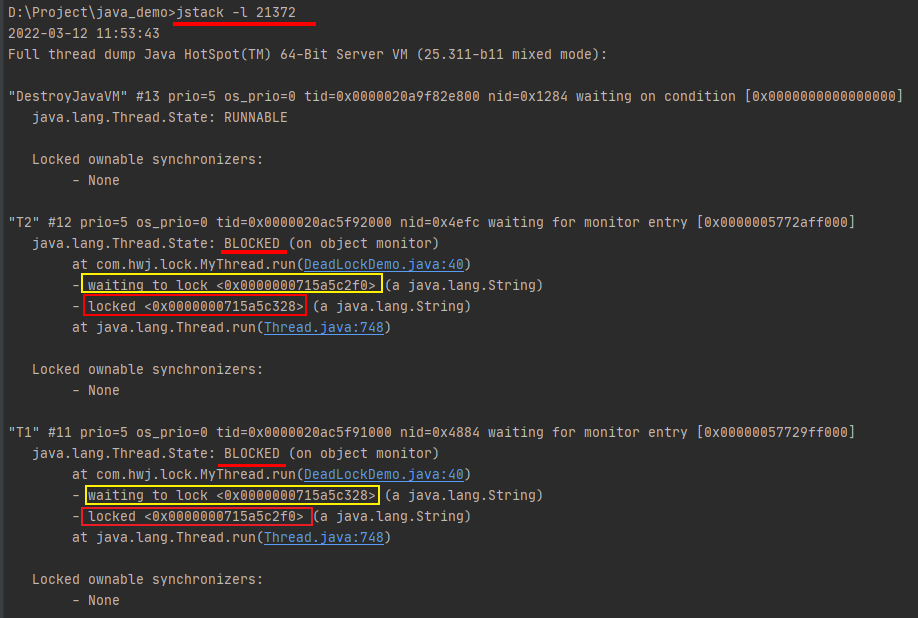
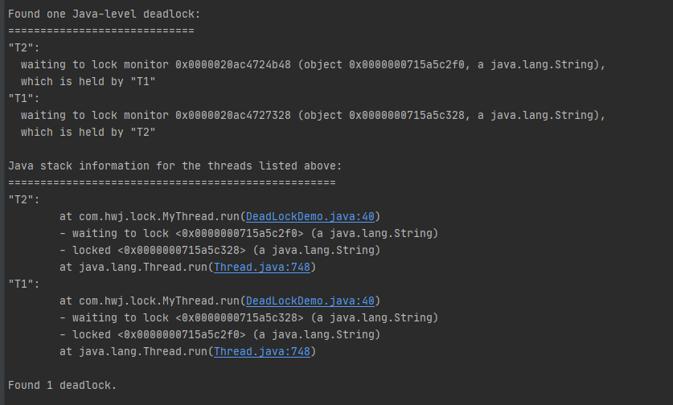

# 1. 什么是JUC


# 2. 进程和线程


```java
// 本地方法，底层的C++，java无法直接操作硬件
private native void start0();
```

- 查看CPU核数的方法
  - 任务管理器 - 性能 - CPU
  - 我的电脑-右键管理-设备管理器-处理器


获取CPU核数

```
System.out.println(Runtime.getRuntime().availableProcessors());
```


- 线程有几个状态

```java
public enum State {
       	// 新生
        NEW,
		// 运行
        RUNNABLE,
		// 阻塞
        BLOCKED,
		// 等待
        WAITING,
		// 超时等待
        TIMED_WAITING,
		// 终止
        TERMINATED;
}
```


wait/sleep区别

1. 来自不同的类， wait是Object类的， sleep是Thread类的
2. wait会释放锁，sleep是抱着锁睡的
3. wait必须在同步代码块中

wait/sleep相同点

4. wait和sleep都要捕获**中断异常**


# 3. Lock锁（重点）

- idea 快捷键 `Ctrl + Alt +T`


公平锁：先来的先执行

**非公平锁：十分不公平，可以插队（默认）**

- Synchronized 

```java
package com.xiaofan;

public class SaleTicketDemo01 {
    public static void main(String[] args) {
        // 并发： 多线程操作同一个资源类， 把资源类丢入线程
        final Ticket ticket = new Ticket();

        // @FunctionalInterface 函数式接口, jdk1.8 lambda 表达式(参数)->{代码}
        new Thread(()->{ for (int i = 0; i < 31; i++) ticket.sale(); }, "A").start();
        new Thread(()->{ for (int i = 0; i < 31; i++) ticket.sale(); }, "B").start();
        new Thread(()->{ for (int i = 0; i < 31; i++) ticket.sale(); }, "C").start();
    }
}

// 资源类 OOP
class Ticket {
    // 属性，方法
    private int number = 30;

    // 卖票的方式
    public synchronized void sale() {
        if (number > 0) {
            System.out.println(Thread.currentThread().getName() + "卖出了第" + (number--) + "张票, 剩余票数：" + number);
        }
    }
}

```

- Lock

```java
package com.xiaofan;

import java.util.concurrent.locks.Lock;
import java.util.concurrent.locks.ReentrantLock;

public class SaleTicketDemo02 {
    public static void main(String[] args) {
        // 并发： 多线程操作同一个资源类， 把资源类丢入线程
        final Ticket2 ticket2 = new Ticket2();

        // @FunctionalInterface 函数式接口, jdk1.8 lambda 表达式(参数)->{代码}
        new Thread(()->{ for (int i = 0; i < 31; i++) ticket2.sale(); }, "A").start();
        new Thread(()->{ for (int i = 0; i < 31; i++) ticket2.sale(); }, "B").start();
        new Thread(()->{ for (int i = 0; i < 31; i++) ticket2.sale(); }, "C").start();

    }
}

// Lock三部曲
// 1. new ReentrantLock();
// 2. lock.lock();
// 3. lock.unlock(); 解锁
class Ticket2 {
    // 属性，方法
    private int number = 30;

    private Lock lock = new ReentrantLock();

    // 卖票的方式
    public void sale() {

        lock.lock();

        try {
            if (number > 0) {
                System.out.println(Thread.currentThread().getName() + "卖出了第" + (number--) + "张票, 剩余票数：" + number);
            }
        }catch (Exception e) {
            e.printStackTrace();
        } finally {
            lock.unlock();
        }
    }
}
```

> Synchronized 和 Lock的区别

1. Synchronized 内置的Java关键字， Lock是一个Java类
2. Synchronized 无法判断获取锁的状态， Lock可以判断是否获取到了锁
3. Synchronized 会自动释放锁， Lock必须要手动释放锁，如果不释放锁，死锁！
4. Synchronized 线程1（获得锁，阻塞）、线程2（等待，傻傻的等）；Lock锁就不一定会等待下去(更灵活自由)
5. Synchronized 可重入锁，不可以中断的，非公平锁；Lock，可重入锁，可以判断锁，非公平锁（可自己设置）
6. Synchronized 适合锁少量的代码同步问题， Lock适合锁大量的同步代码！


可重入锁指的是在一个线程中可以多次获取同一把锁，比如：

一个线程在执行一个带锁的方法，该方法中又调用了另一个需要相同锁的方法，则该线程可以直接执行调用的方法，而无需重新获得锁；

参考https://www.zhihu.com/question/23284564/answer/29633571


# 4. 生产者和消费者


## 4.1. 生产者和消费者问题Synchronized版

***面试手写的： 单例模式、排序算法、生产者和消费者、死锁***

```java
package com.xiaofan.pc;


/**
 * 线程之间的通信问题： 生产者和消费者问题！ 等待环形， 通知唤醒
 * 线程交替执行   A B 操作同一个变量 num = 0
 * A num + 1
 * B num - 1
 */
public class A {
    public static void main(String[] args) {
        Data data = new Data();

        new Thread(()->{
            try {
                for (int i = 0; i < 10; i++) data.increment();
            } catch (InterruptedException e) {
                e.printStackTrace();
            }
        }, "A").start();

        new Thread(()->{
            try {
                for (int i = 0; i < 10; i++) data.decrement();
            } catch (InterruptedException e) {
                e.printStackTrace();
            }
        }, "B").start();
    }
}

// 判断等待， 业务， 通知
class Data {

    private int number = 0;

    //+1
    public synchronized void increment() throws InterruptedException {
        if (number != 0) {
            this.wait();
        }
        number ++;
        System.out.println(Thread.currentThread().getName() + " => " + number);
        // 通知其他线程， 我+1完毕了
        this.notifyAll();
    }

    //-1
    public synchronized void decrement() throws InterruptedException {
        if (number == 0) {
            this.wait();
        }
        number --;
        System.out.println(Thread.currentThread().getName() + " => " + number);
        // 通知其他线程， 我+1完毕了
        this.notifyAll();
    }
}
```


使用`notifyAll()`将唤醒所有当前正在`this`锁等待的线程，而`notify()`只会唤醒其中一个（具体哪个依赖操作系统，有一定的随机性）。

注意： 用`notify()`会导致只唤醒了一个线程，而其他线程可能永远等待下去醒不过来了。

注意到`wait()`方法返回时需要*重新*获得`this`锁。假设当前有3个线程被唤醒，这3个线程中只能有一个获取到`this`锁，剩下两个将继续等待。


**什么是假唤醒？**

> 当一个条件满足时，很多线程都被唤醒了，但是只有其中部分是有用的唤醒，其它的唤醒都是无用功
> 1.比如说买货，如果商品本来没有货物，突然进了一件商品，这是所有的线程都被唤醒了，但是只能一个人买，所以其他人都是假唤醒，获取不到对象的锁


**小结**

`wait`和`notify`用于多线程协调运行：

- 必须在`synchronized`内部可以调用`wait()`使线程进入等待状态； 否则报异常： IllegalMonitorStateException
- 必须在已获得的锁对象上调用`wait()`方法；
- 必须在`synchronized`内部可以调用`notify()`或`notifyAll()`唤醒其他等待线程； 否则报异常： IllegalMonitorStateException
- 必须在已获得的锁对象上调用`notify()`或`notifyAll()`方法；
- 已唤醒的线程还需要重新获得锁后才能继续执行。


- 问题存在，A,B,C,D 四个线程！


在wait和notify一块使用时，**如果使用if作为条件时，会有虚假唤醒的情况发生，所以必须使用while作为循环条件**。

```java
package com.xiaofan.pc;


/**
 * 线程之间的通信问题： 生产者和消费者问题！ 等待环形， 通知唤醒
 * 线程交替执行   A B 操作同一个变量 num = 0
 * A num + 1
 * B num - 1
 */
public class A {
    public static void main(String[] args) {
        Data data = new Data();

        new Thread(()->{
            try {
                for (int i = 0; i < 10; i++) data.increment();
            } catch (InterruptedException e) {
                e.printStackTrace();
            }
        }, "A").start();

        new Thread(()->{
            try {
                for (int i = 0; i < 10; i++) data.decrement();
            } catch (InterruptedException e) {
                e.printStackTrace();
            }
        }, "B").start();

        new Thread(()->{
            try {
                for (int i = 0; i < 10; i++) data.decrement();
            } catch (InterruptedException e) {
                e.printStackTrace();
            }
        }, "C").start();

        new Thread(()->{
            try {
                for (int i = 0; i < 10; i++) data.increment();
            } catch (InterruptedException e) {
                e.printStackTrace();
            }
        }, "D").start();
    }
}

// 判断等待， 业务， 通知
class Data {

    private int number = 0;

    //+1
    public synchronized void increment() throws InterruptedException {
        while (number != 0) {   // 这里修改成了while，原来是if
            this.wait();
        }
        number ++;
        System.out.println(Thread.currentThread().getName() + " => " + number);
        // 通知其他线程， 我+1完毕了
        this.notifyAll();
    }

    //-1
    public synchronized void decrement() throws InterruptedException {
        while (number == 0) {   // 这里修改成了while，原来是if
            this.wait();
        }
        number --;
        System.out.println(Thread.currentThread().getName() + " => " + number);
        // 通知其他线程， 我+1完毕了
        this.notifyAll();
    }
}
```


## 4.2. JUC版本的生产者和消费者

```java
package com.xiaofan.pc;


import java.util.concurrent.locks.Condition;
import java.util.concurrent.locks.Lock;
import java.util.concurrent.locks.ReentrantLock;

/**
 * 线程之间的通信问题： 生产者和消费者问题！ 等待环形， 通知唤醒
 * 线程交替执行   A B 操作同一个变量 num = 0
 * A num + 1
 * B num - 1
 */
public class B {
    public static void main(String[] args) {
        Data1 data1 = new Data1();
        new Thread(()->{ for (int i = 0; i < 10; i++) data1.increment(); }, "A").start();
        new Thread(()->{ for (int i = 0; i < 10; i++) data1.decrement(); }, "B").start();
        new Thread(()->{ for (int i = 0; i < 10; i++) data1.increment(); }, "C").start();
        new Thread(()->{ for (int i = 0; i < 10; i++) data1.decrement(); }, "D").start();

    }
}

// 判断等待， 业务， 通知
class Data1 {

    private int number = 0;
    private Lock lock = new ReentrantLock();
    private Condition condition = lock.newCondition();

    //+1
    public void increment() {
        lock.lock();

        try{
            while (number != 0) {
                condition.await();
            }
            number ++;
            System.out.println(Thread.currentThread().getName() + " => " + number);
            // 通知其他线程， 我+1完毕了
            condition.signalAll();
        } catch (Exception e) {
            e.printStackTrace();
        } finally {
            lock.unlock();
        }
    }

    //-1
    public void decrement() {
        lock.lock();

        try {
            while (number == 0) {
                condition.await();
            }
            number --;
            System.out.println(Thread.currentThread().getName() + " => " + number);
            // 通知其他线程， 我+1完毕了
            condition.signalAll();
        } catch (Exception e) {
            e.printStackTrace();
        } finally {
            lock.unlock();
        }
    }
}

```


**对比**

| synchronized       | ReentrantLock                                  |
| ------------------ | ---------------------------------------------- |
| synchronized关键字 | new ReentrantLock().lock()                     |
| wait()             | new ReentrantLock().newCondition().await()     |
| notify()           | new ReentrantLock().newCondition().signal()    |
| notifyAll()        | new ReentrantLock().newCondition().signalAll() |

 **注意，lock是await() 和 signal()**


## 4.3.  Condition实现精准通知唤醒

```java
package com.xiaofan.pc;

import java.util.concurrent.locks.Condition;
import java.util.concurrent.locks.Lock;
import java.util.concurrent.locks.ReentrantLock;

/**
 * 多线程轮流打印 A-B-C
 */
public class C {
    public static void main(String[] args) {
        Data3 data3 = new Data3();

        new Thread(()->{ for (int i = 0; i < 10; i++) data3.printA();}, "线程1").start();
        new Thread(()->{ for (int i = 0; i < 10; i++) data3.printB();}, "线程2").start();
        new Thread(()->{ for (int i = 0; i < 10; i++) data3.printC();}, "线程3").start();
    }
}


class Data3 {

    private Lock lock = new ReentrantLock();
    private Condition condition1 = lock.newCondition();
    private Condition condition2 = lock.newCondition();
    private Condition condition3 = lock.newCondition();
    private int number = 1;  // 1A 2B 3C

    public void printA() {
        lock.lock();

        try {
            // 业务-判断-执行-通知
            while(number != 1) {
                condition1.await();
            }
            number = 2;
            System.out.println(Thread.currentThread().getName() + "=> A...");
            // 唤醒指定的人
            condition2.signal();

        } catch (Exception e) {
            e.printStackTrace();
        } finally {
            lock.unlock();
        }

    }

    public void printB() {
        lock.lock();

        try {
            // 业务-判断-执行-通知
            while(number != 2) {
                condition2.await();
            }
            number = 3;
            System.out.println(Thread.currentThread().getName() + "=> B...");
            condition3.signal();

        } catch (Exception e) {
            e.printStackTrace();
        } finally {
            lock.unlock();
        }
    }

    public void printC() {
        lock.lock();

        try {
            // 业务-判断-执行-通知
            while(number != 3) {
                condition3.await();
            }
            number = 1;
            System.out.println(Thread.currentThread().getName() + "=> C...");
            condition1.signal();
        } catch (Exception e) {
            e.printStackTrace();
        } finally {
            lock.unlock();
        }
    }


}
```


# 5. 8锁的现象

如何判断锁的是谁！对象 Class

- 总结
  - new this 具体的一个对象
  - static Class 唯一的一个模板


# 6. 集合类不安全

不安全的集合类，并发修改时会出现**并发修改异常**ConcurrentModificationException

## 6.1. List不安全

```java
package com.xiaofan.unsafe;

import java.util.*;
import java.util.concurrent.CopyOnWriteArrayList;

// java.util.ConcurrentModificationException    并发修改异常！
public class ListTest {
    public static void main(String[] args) {
        // 单线程安全
        /*List<String> list = Arrays.asList("1", "2", "3");
        list.forEach(System.out::println);*/

        // 并发下ArrayList不安全的吗？synchronized：
        /**
         * 解决方案：
         * 1. List<String> list = new Vector<>();   Vector是1.0出来的，List是1.2出来的
         * 2. List<String> list = Collections.synchronizedList(new ArrayList<>());
         * 3. List<String> list = new CopyOnWriteArrayList<>();
         */
        // CopyOnWrite 写入时复制 COW 计算机程序设计的一种优化策略
        // 多个线程调用的时候，list读取的时候，固定的，写入（覆盖）， 在写入的时候避免覆盖，造成数据问题！读写分离
        // CopyOnWriteArrayList 比 Vector牛逼的地方是底层应用了Lock锁，而Vector应用了synchronized
        List<String> list = new CopyOnWriteArrayList<>();

        for (int i = 1; i <= 20; i++) {
            new Thread(()->{
                list.add(UUID.randomUUID().toString().substring(0, 5));
                System.out.println(list);
            }, String.valueOf(i)).start();
        }
    }
}
```


> CopyOnWriteArrayList和Collections.synchronizedList是实现线程安全的列表的两种方式。
> 两种实现方式分别针对不同情况有不同的性能表现，其中CopyOnWriteArrayList的写操作性能较差，而多线程的读操作性能较好。而Collections.synchronizedList的写操作性能比CopyOnWriteArrayList在多线程操作的情况下要好很多，而读操作因为是采用了synchronized关键字的方式，其读操作性能并不如CopyOnWriteArrayList。
> 因此在不同的应用场景下，应该选择不同的多线程安全实现类。
>
> CopyOnWriteArrayList，发生修改时候做copy，新老版本分离，保证读的高性能，适用于以读为主，读操作远远大于写操作的场景中使用，比如缓存。而Collections.synchronizedList则可以用在CopyOnWriteArrayList不适用，但是有需要同步列表的地方， 读写操作都比较均匀的地方。
>
> ————————————————
> 版权声明：本文为CSDN博主「Snowball」的原创文章，遵循CC 4.0 BY-SA版权协议，转载请附上原文出处链接及本声明。
> 原文链接：https://blog.csdn.net/yangzl2008/article/details/39456817


## 6.2. Set不安全

```java
package com.xiaofan.unsafe;

import java.util.Collections;
import java.util.HashSet;
import java.util.Set;
import java.util.UUID;
import java.util.concurrent.CopyOnWriteArraySet;

// 同理：java.util.ConcurrentModificationException    并发修改异常！
public class SetTest {
    public static void main(String[] args) {

        /**
         * 解决方案：
         * 1. Set<String>set = Collections.synchronizedSet(new HashSet<>());
         * 2. Set<String>set = new CopyOnWriteArraySet<>();
         */
        Set<String>set = new CopyOnWriteArraySet<>();
        for (int i = 1; i <= 20; i++) {
            new Thread(()->{
                set.add(UUID.randomUUID().toString().substring(0, 5));
                System.out.println(set);
            }, String.valueOf(i)).start();
        }
    }
}
```

- HashSet底层是什么？

```java
public HashSet() {
    map = new HashMap<>();
}

// add set 本质就是map， key是无法重复的！
public boolean add(E e) {
    return map.put(e, PRESENT)==null;
}
// 不变的值
private static final Object PRESENT = new Object();
```

## 6.3. Map不安全

map的加载因子，初始化容量

参考文档： https://www.cnblogs.com/xumBlog/p/12104274.html


ConcurrentHashMap的写入与读取的性能都更优

SynchronizedMap 一次锁住整张表来保证线程安全，所以每次只能有一个线程来访为 map。

ConcurrentHashMap 使用分段锁来保证在多线程下的性能。

ConcurrentHashMap 中则是一次锁住一个桶。ConcurrentHashMap 默认将hash 表分为 16 个桶，诸如 get,put,remove 等常用操作只锁当前需要用到的桶。这样，原来只能一个线程进入，现在却能同时有 16 个写线程执行，并发性能的提升是显而易见的。


```java
package com.xiaofan.unsafe;

import java.util.Collections;
import java.util.HashMap;
import java.util.Map;
import java.util.UUID;
import java.util.concurrent.ConcurrentHashMap;


// java.util.ConcurrentModificationException 并发修改异常
public class MapTest {
    public static void main(String[] args) {

        /**
         * 解决方案：
         * 1. Map<String, String> map = Collections.synchronizedMap(new HashMap<>());
         * 2. Map<String, String> map = new ConcurrentHashMap<>();
         */
        Map<String, String> map = Collections.synchronizedMap(new HashMap<>());

        for (int i = 1; i <= 10; i++) {
            new Thread(()->{
                map.put(Thread.currentThread().getName(), UUID.randomUUID().toString().substring(0, 5));
                System.out.println(map);
            }).start();
        }
    }
}
```

## 6.4. HashMap数据结构及2的整数次幂探究


## 6.5. HashMap加载因子及转红黑树探究


## 6.6. ConcurrentHashMap的原理

ConcurrentHashMap 中则是一次锁住一个桶。ConcurrentHashMap 默认将hash 表分为 16 个桶，诸如 get,put,remove 等常用操作只锁当前需要用到的桶。这样，原来只能一个线程进入，现在却能同时有 16 个写线程执行，并发性能的提升是显而易见的。

# 7. Callable（简单）


- 可以有返回值
- 可以抛出异常
- 方法不同，run() / call()

```java
package com.xiaofan.callable;

import java.util.concurrent.Callable;
import java.util.concurrent.ExecutionException;
import java.util.concurrent.FutureTask;

public class CallableTest {
    public static void main(String[] args) throws ExecutionException, InterruptedException {
  		// 注意：同一个FutureTask下有复用情况
        FutureTask<String> futureTask1 = new FutureTask<>(new MyThread());
        FutureTask<String> futureTask2 = new FutureTask<>(new MyThread());
        new Thread(futureTask1, "A").start();
        new Thread(futureTask2, "B").start();    // 结果会被缓存，效率高

        String result1 = futureTask1.get();       // 这个方法可能会产生阻塞，把他放到最后，或者使用异步通信来处理
        System.out.println(result1);

        String result2 = futureTask1.get();
        System.out.println(result2);
    }
}


class MyThread implements Callable<String> {

    @Override
    public String call() {
        System.out.println(Thread.currentThread().getName() + " call...");
        return "1024";
    }
}
```

# 8. 常用辅助类（必会）

- [循环屏障CyclicBarrier以及和CountDownLatch的区别](https://www.cnblogs.com/twoheads/p/9555867.html)

- 从javadoc的描述可以得出：
  - CountDownLatch：一个或者多个线程，等待其他多个线程完成某件事情之后才能执行；
  - CyclicBarrier：多个线程互相等待，直到到达同一个同步点，再继续**一起执行**。

对于CountDownLatch来说，重点是“一个线程（多个线程）等待”，而其他的N个线程在完成“某件事情”之后，可以终止，也可以等待。而对于CyclicBarrier，重点是多个线程，在任意一个线程没有完成，所有的线程都必须互相等待，然后继续一起执行。

CountDownLatch是计数器，线程完成一个记录一个，只不过计数不是递增而是递减，而CyclicBarrier更像是一个阀门，需要所有线程都到达，阀门才能打开，然后继续执行。

## 8.1 CountDownLatch

**减法计数器**

```java
package com.xiaofan;

import java.util.concurrent.CountDownLatch;

// 计数器
public class CountDownLatchDemo {
    public static void main(String[] args) throws InterruptedException {
        // 总数是6，必须要执行任务的时候，再使用！
        CountDownLatch countDownLatch = new CountDownLatch(6);

        for (int i = 1; i <= 6; i++) {
            new Thread(()->{
                System.out.println(Thread.currentThread().getName() + " go out...");
                countDownLatch.countDown();     // 数量减1
            }, String.valueOf(i)).start();
        }

        countDownLatch.await();     // 等待计数归零，再继续向下执行
        System.out.println("close door...");
    }
}
```


countDownLatch.countDown();  // 数量-1

countDownLatch.await();   // 阻塞等待，等待计数器归零


## 8.2 CyclicBarrier


**加法计数器**

```java
package com.xiaofan;

import java.util.concurrent.BrokenBarrierException;
import java.util.concurrent.CyclicBarrier;

public class CyclicBarrierDemo {
    public static void main(String[] args) {
        /**
         * 集齐7颗龙珠召唤神龙
         */
        CyclicBarrier cyclicBarrier = new CyclicBarrier(7, () -> {
            System.out.println("召唤神龙成功！");
        });

        for (int i = 1; i <= 7; i++) {
            int temp = i;
            // Lambda 操作不到i
            new Thread(()->{
                System.out.println(Thread.currentThread().getName() + "收集" + temp + " 个龙珠");

                try {
                    cyclicBarrier.await();
                } catch (InterruptedException e) {
                    e.printStackTrace();
                } catch (BrokenBarrierException e) {
                    e.printStackTrace();
                } catch (Exception e) {

                }

                System.out.println(Thread.currentThread().getName() + "continue...");
            }).start();
        }
    }
}
```


## 8.3 Semaphore

**信号量**

抢车位  6辆车同时抢三个车位

```java
package com.xiaofan.util;

import java.util.concurrent.Semaphore;
import java.util.concurrent.TimeUnit;

public class SemaphoreDemo {
    public static void main(String[] args) {
        // 线程数量， 停车位， 限流！
        Semaphore semaphore = new Semaphore(3);

        for (int i = 1; i <= 6; i++) {
            new Thread(()->{
                // acquire() 得到信号量
                try {
                    semaphore.acquire();
                    System.out.println(Thread.currentThread().getName() + "抢到车位");
                    TimeUnit.SECONDS.sleep(2);
                    System.out.println(Thread.currentThread().getName() + "离开车位");
                } catch (InterruptedException e) {
                    e.printStackTrace();
                } finally {
                    semaphore.release();    // 释放信号量
                }
            }, String.valueOf(i)).start();
        }
    }
}
```

**原理：**

`semaphore.acquire();`获得信号量，假如满了，等待被释放为止

`semaphore.release();` 释放信号量， 唤醒等待的线程

作用：多个共享资源互斥的使用！


## 8.4 Phaser

功能和CountDownLatch，CyclicBarrier类似，但phaser支持的场景更加灵活

phaser灵活性主要体现在构造函数不强制指定有多少参与协作的线程。 参与协作的线程个数可以在运行时动态改变。

参考： https://cloud.tencent.com/developer/article/1350849

https://blog.csdn.net/liuyu973971883/article/details/107917079

```java
register()//添加一个新的注册者
bulkRegister(int parties)//添加指定数量的多个注册者
arrive()// 到达栅栏点直接执行，无须等待其他的线程
arriveAndAwaitAdvance()//到达栅栏点，必须等待其他所有注册者到达
arriveAndDeregister()//到达栅栏点，注销自己无须等待其他的注册者到达
onAdvance(int phase, int registeredParties)//多个线程达到注册点之后，会调用该方法。

int awaitAdvance(int phase) // 等待前行，可阻塞也可不阻塞，判断条件为传入的phase是否为当前phaser的phase。如果相等则阻塞，反之不进行阻塞
int getRegisteredParties()  // 获取当前的parties数
int getArrivedParties()  // 获取当前到达的parties数
int getUnarrivedParties()    // 获取当前未到达的parties数
int getPhase() // 获取当前属于第几阶段，默认从0开始，最大为integer的最大值
boolean isTerminated()  //判断当前phaser是否关闭
void forceTermination()    // 强制关闭当前phaser
```


### 8.4.1 动态注册

使用Phaser动态注册parties

```java
package org.github.demo.juc;

import java.util.Random;
import java.util.concurrent.Phaser;
import java.util.concurrent.TimeUnit;

public class PhaserExample {
    private static Random random = new Random(System.currentTimeMillis());
    public static void main(String[] args) {
        Phaser phaser = new Phaser();
        //创建5个任务
        for (int i=0;i<5;i++){
            new Task(phaser).start();
        }
        //动态注册
        phaser.register();
        //等待其他线程完成工作
        phaser.arriveAndAwaitAdvance();
        System.out.println("All of worker finished the task");
    }

    private static class Task extends Thread{
        private Phaser phaser;

        public Task(Phaser phaser) {
            this.phaser = phaser;
            //动态注册任务
            this.phaser.register();
        }

        @Override
        public void run() {
            try {
                System.out.println("The thread ["+getName()+"] is working");
                TimeUnit.SECONDS.sleep(random.nextInt(5));
            } catch (InterruptedException e) {
                e.printStackTrace();
            }
            System.out.println("The thread ["+getName()+"] work finished");
            //等待其他线程完成工作
            phaser.arriveAndAwaitAdvance();
        }
    }
}

```

运行结果

```
The thread [Thread-0] is working
The thread [Thread-1] is working
The thread [Thread-2] is working
The thread [Thread-3] is working
The thread [Thread-4] is working
The thread [Thread-2] work finished
The thread [Thread-4] work finished
The thread [Thread-0] work finished
The thread [Thread-1] work finished
The thread [Thread-3] work finished
All of worker finished the task

Process finished with exit code 0
```


### 8.4.2 设置阶段

使用Phaser设置多个阶段,  这边使用的案例是运动员，模拟多个运动员参加多个项目。每个项目结束才能开始下一个项目

```java
package org.github.demo.juc;

import java.util.Random;
import java.util.concurrent.Phaser;
import java.util.concurrent.TimeUnit;

public class PhaserExample2 {
    private static Random random = new Random(System.currentTimeMillis());

    public static void main(String[] args) {
        //初始化5个parties
        Phaser phaser = new Phaser(5);
        for (int i = 1; i < 6; i++) {
            new Athlete(phaser, i).start();
        }
    }

    //创建运动员类
    private static class Athlete extends Thread {
        private Phaser phaser;
        private int no;//运动员编号

        public Athlete(Phaser phaser, int no) {
            this.phaser = phaser;
            this.no = no;
        }

        @Override
        public void run() {
            try {
                System.out.println(no + ": 当前处于第：" + phaser.getPhase() + "阶段");
                System.out.println(no + ": start running");
                TimeUnit.SECONDS.sleep(random.nextInt(5));
                System.out.println(no + ": end running");
                //等待其他运动员完成跑步
                phaser.arriveAndAwaitAdvance();

                System.out.println(no + ": 当前处于第：" + phaser.getPhase() + "阶段");
                phaser.arriveAndAwaitAdvance();
                System.out.println(no + ": 当前处于第：" + phaser.getPhase() + "阶段");
                phaser.arriveAndAwaitAdvance();

                System.out.println(no + ": 当前处于第：" + phaser.getPhase() + "阶段");
                System.out.println(no + ": start bicycle");
                TimeUnit.SECONDS.sleep(random.nextInt(5));
                System.out.println(no + ": end bicycle");
                //等待其他运动员完成骑行
                phaser.arriveAndAwaitAdvance();

                System.out.println(no + ": 当前处于第：" + phaser.getPhase() + "阶段");
                System.out.println(no + ": start long jump");
                TimeUnit.SECONDS.sleep(random.nextInt(5));
                System.out.println(no + ": end long jump");
                //等待其他运动员完成跳远
                phaser.arriveAndAwaitAdvance();
            } catch (InterruptedException e) {
                e.printStackTrace();
            }
        }
    }
}

```

### 8.4.3 常用方法演示

```java
package org.github.demo.juc;

import java.util.Random;
import java.util.concurrent.Phaser;
import java.util.concurrent.TimeUnit;

public class PhaserExample3 {
    private static Random random = new Random(System.currentTimeMillis());
    public static void main(String[] args) throws InterruptedException {
        //初始化5个parties
        Phaser phaser = new Phaser(5);

        //只有当全部线程通过时才会进入下一阶段，从0开始
        System.out.println("当前阶段数："+phaser.getPhase());

        //添加一个parties
        phaser.register();
        System.out.println("当前Parties数："+phaser.getRegisteredParties());
        //添加多个parties
        phaser.bulkRegister(4);
        System.out.println("当前Parties数："+phaser.getRegisteredParties());

        new Thread(new Runnable() {
            @Override
            public void run() {
                //到达并等待其他线程到达
                phaser.arriveAndAwaitAdvance();
            }
        }).start();
        new Thread(new Runnable() {
            @Override
            public void run() {
                //到达后注销该parties，不等待其他线程
                phaser.arriveAndDeregister();
                System.out.println("go on");
            }
        }).start();
        TimeUnit.MILLISECONDS.sleep(100);
        System.out.println("当前Parties数："+phaser.getRegisteredParties());
        System.out.println("当前到达数："+phaser.getArrivedParties());
        System.out.println("当前未达数："+phaser.getUnarrivedParties());

        //何时会停止，只有当parties中的数量为0时或者调用forceTermination方法就会停止了，我们也可以重写phaser中的onAdvance，给他返回true就会使这个phaser停止了
        System.out.println("phaser是否结束："+phaser.isTerminated());
        phaser.forceTermination();
        System.out.println("phaser是否结束："+phaser.isTerminated());
    }

}
```

### 8.4.4 利用arrive

利用arrive只监听线程完成第一部分任务

```java
import java.util.Random;
import java.util.concurrent.Phaser;
import java.util.concurrent.TimeUnit;
import java.util.stream.IntStream;

public class PhaserExample4 {
    private static Random random = new Random(System.currentTimeMillis());
    public static void main(String[] args) throws InterruptedException {
        //初始化6个parties
        Phaser phaser = new Phaser(6);
        //创建5个任务
        IntStream.rangeClosed(1,5).forEach(i->new ArrayTask(i,phaser).start());
        //等待5个任务的第一部分完成
        phaser.arriveAndAwaitAdvance();
        System.out.println("all work finished");
    }

    private static class ArrayTask extends Thread{
        private Phaser phaser;

        public ArrayTask(int name,Phaser phaser) {
            super(String.valueOf(name));
            this.phaser = phaser;
        }

        @Override
        public void run() {
            try {
                //模拟第一部分工作
                System.out.println(getName()+" start working");
                TimeUnit.SECONDS.sleep(random.nextInt(3));
                System.out.println(getName()+" end working");
                //该方法表示到达但不会使线程阻塞
                phaser.arrive();
                //模拟第二部分工作
                TimeUnit.SECONDS.sleep(random.nextInt(3));
                System.out.println(getName()+" do other thing");
            } catch (InterruptedException e) {
                e.printStackTrace();
            }
        }
    }
}
```


### 8.4.5 awaitAdvance演示

```java
import java.util.Random;
import java.util.concurrent.Phaser;
import java.util.concurrent.TimeUnit;
import java.util.stream.IntStream;

public class PhaserExample5 {
    private static Random random = new Random(System.currentTimeMillis());

    public static void main(String[] args) {
        //初始化6个parties
        Phaser phaser = new Phaser(5);
        //创建5个任务
        IntStream.rangeClosed(1, 5).forEach(i -> new ArrayTask(i, phaser).start());
        //当phaser中的当前阶段等于传入的阶段则该方法会阻塞，反之不会
        phaser.awaitAdvance(phaser.getPhase());   // 传入的phase和当前的phase相同，则阻塞，直到不相等为止
        System.out.println("all work finished");
    }

    private static class ArrayTask extends Thread {
        private Phaser phaser;

        public ArrayTask(int name, Phaser phaser) {
            super(String.valueOf(name));
            this.phaser = phaser;
        }

        @Override
        public void run() {
            try {
                System.out.println(getName() + " start working");
                TimeUnit.SECONDS.sleep(random.nextInt(3));
                System.out.println(getName() + " end working");
                phaser.arriveAndAwaitAdvance();
            } catch (InterruptedException e) {
                e.printStackTrace();
            }
        }
    }
}

```


# 9. 读写锁


```java
package com.xiaofan.rw;

import java.util.HashMap;
import java.util.Map;
import java.util.concurrent.locks.ReadWriteLock;
import java.util.concurrent.locks.ReentrantReadWriteLock;

/**
 * 独占锁（写锁） 一次只能被一个线程占有
 * 共享锁（读锁） 多个线程可以同时占有
 * ReadWriteLock
 * 读-读  可以共存！
 * 读-写  不能共存！
 * 写-写  不能共存！
 */
public class ReadWriteLockDemo {
    public static void main(String[] args) {
//        MyCache myCache = new MyCache();
        MyCacheLock myCacheLock = new MyCacheLock();

        for (int i = 1; i <= 5; i++) {
            int temp = i;
            new Thread(()->{
                myCacheLock.put(String.valueOf(temp), String.valueOf(temp));
            }, String.valueOf(i)).start();
        }

        for (int i = 1; i <= 5; i++) {
            int temp = i;
            new Thread(()->{
                myCacheLock.get(String.valueOf(temp));
            }, String.valueOf(i)).start();
        }
    }
}

/**
 * 自定义缓存
 */
class MyCache {

    private volatile Map<String, Object> map = new HashMap<>();

    // 存， 写
    public void put(String key, Object value) {
        System.out.println(Thread.currentThread().getName() +" 写入 " + key);
        map.put(key, value);
        System.out.println(Thread.currentThread().getName() +" 写入完毕！");
    }

    // 取，读
    public void get(String key) {
        System.out.println(Thread.currentThread().getName() + " 读取 " + key);
        Object o = map.get(key);
        System.out.println(Thread.currentThread().getName() + " 读取完毕！");
    }
}

/**
 * 加锁的自定义缓存
 */
class MyCacheLock {

    private volatile Map<String, Object> map = new HashMap<>();
    // 读写锁，更加细粒度的控制
    private ReadWriteLock readWriteLock = new ReentrantReadWriteLock();

    // 存， 写入的时候
    public void put(String key, Object value) {
        readWriteLock.writeLock().lock();
        try {
            System.out.println(Thread.currentThread().getName() +" 写入 " + key);
            map.put(key, value);
            System.out.println(Thread.currentThread().getName() +" 写入完毕！");
        } catch (Exception e) {
            e.printStackTrace();
        } finally {
            readWriteLock.writeLock().unlock();
        }
    }

    // 取，读
    public void get(String key) {
        readWriteLock.readLock().lock();
        try {
            System.out.println(Thread.currentThread().getName() + " 读取 " + key);
            Object o = map.get(key);
            System.out.println(Thread.currentThread().getName() + " 读取完毕！");
        } catch (Exception e) {
            e.printStackTrace();
        } finally {
            readWriteLock.readLock().unlock();
        }
    }
}
```


# 10. 阻塞队列

## 10.1 ArrayBlockingQueue


什么情况下我们会使用阻塞队列： 多线程并发处理，线程池！

**四组API**（一列一列地看）


1. 抛出异常（添加成功返回true,  失败抛 queue full异常， 移除成功返回元素值，失败抛 not such element异常）

2. 不会抛出异常（添加成功返回true,  失败返回false， 移除成功返回元素值，失败返回null值）

3. 阻塞等待

4. 超时等待

```java
package com.xiaofan.bq;

import java.util.concurrent.ArrayBlockingQueue;
import java.util.concurrent.TimeUnit;

public class Test {
    public static void main(String[] args) throws InterruptedException {
        test4();
    }

    /**
     * 抛出异常
     */
    public static void test1() {
        ArrayBlockingQueue arrayBlockingQueue = new ArrayBlockingQueue<>(3);
        System.out.println(arrayBlockingQueue.add(1));
        System.out.println(arrayBlockingQueue.add(2));
        System.out.println(arrayBlockingQueue.add(3));

        // java.lang.IllegalStateException: Queue full
        // System.out.println(arrayBlockingQueue.add(4));
        // 判断队首元素
        System.out.println(arrayBlockingQueue.element());

        System.out.println(arrayBlockingQueue.remove());
        System.out.println(arrayBlockingQueue.remove());
        System.out.println(arrayBlockingQueue.remove());
        // java.util.NoSuchElementException
        // System.out.println(arrayBlockingQueue.remove());

    }

    /**
     * 不抛出异常
     */
    public static void test2() {
        ArrayBlockingQueue arrayBlockingQueue = new ArrayBlockingQueue<>(3);
        System.out.println(arrayBlockingQueue.offer(1));
        System.out.println(arrayBlockingQueue.offer(2));
        System.out.println(arrayBlockingQueue.offer(3));

         System.out.println(arrayBlockingQueue.offer(4));

        // 判断队首元素
        System.out.println(arrayBlockingQueue.peek());

        System.out.println(arrayBlockingQueue.poll());
        System.out.println(arrayBlockingQueue.poll());
        System.out.println(arrayBlockingQueue.poll());
        System.out.println(arrayBlockingQueue.poll());
        // java.util.NoSuchElementException
        // System.out.println(arrayBlockingQueue.remove());

    }

    /**
     * 等待阻塞(一直阻塞)
     */
    public static void test3() throws InterruptedException {
        ArrayBlockingQueue arrayBlockingQueue = new ArrayBlockingQueue<>(3);
        arrayBlockingQueue.put(1);
        arrayBlockingQueue.put(2);
        arrayBlockingQueue.put(3);
        // 等待阻塞，一直阻塞，直到放进去位置
        // arrayBlockingQueue.put(4);

        System.out.println(arrayBlockingQueue.take());
        System.out.println(arrayBlockingQueue.take());
        System.out.println(arrayBlockingQueue.take());
        // 等待阻塞，一直阻塞，直到取到元素为止
        System.out.println(arrayBlockingQueue.take());

    }

    /**
     * 等待阻塞(超时等待)
     */
    public static void test4() throws InterruptedException {
        ArrayBlockingQueue arrayBlockingQueue = new ArrayBlockingQueue<>(3);
        System.out.println(arrayBlockingQueue.offer(1));
        System.out.println(arrayBlockingQueue.offer(2));
        System.out.println(arrayBlockingQueue.offer(3));
        // 超过3秒钟后则产生结果
        System.out.println(arrayBlockingQueue.offer(4, 3, TimeUnit.SECONDS));

        // 判断队首元素
        System.out.println(arrayBlockingQueue.peek());

        System.out.println(arrayBlockingQueue.poll());
        System.out.println(arrayBlockingQueue.poll());
        System.out.println(arrayBlockingQueue.poll());
        System.out.println(arrayBlockingQueue.poll(3, TimeUnit.SECONDS));


    }
}

```

## 10.2 SynchronousQueue 同步队列

没有容量，放进去一个元素，必须等待取出来之后，才能再往里面放一个元素！

put、take

```java
import java.util.concurrent.SynchronousQueue;
import java.util.concurrent.TimeUnit;

/**
 * 同步队列
 * 和其他的BlockingQueue不一样， SynchronousQueue不存储元素
 * put进去了一个元素，必须等待take出来后才能再取！
 */
public class SynchronousQueueDemo {
    public static void main(String[] args) {
        SynchronousQueue<String>synchronousQueue = new SynchronousQueue();

        new Thread(()->{
            try {
                System.out.println(Thread.currentThread().getName() + " put 1");
                synchronousQueue.put("1");
                System.out.println(Thread.currentThread().getName() + " put 2");
                synchronousQueue.put("2");
                System.out.println(Thread.currentThread().getName() + " put 3");
                synchronousQueue.put("3");
            } catch (InterruptedException e) {
                e.printStackTrace();
            }
        }).start();

        new Thread(()->{
            try {
                TimeUnit.SECONDS.sleep(3);
                System.out.println(Thread.currentThread().getName() + " " + synchronousQueue.take());
                TimeUnit.SECONDS.sleep(3);
                System.out.println(Thread.currentThread().getName() + " " + synchronousQueue.take());
                TimeUnit.SECONDS.sleep(3);
                System.out.println(Thread.currentThread().getName() + " " + synchronousQueue.take());
            } catch (InterruptedException e) {
                e.printStackTrace();
            }
        }).start();
    }
}
```


# 11. 线程池


## 线程池3大方法

```java
package com.xiaofan.pool;

import java.util.concurrent.ExecutorService;
import java.util.concurrent.Executors;

// Executors 工具类、 3大方法
public class Demo01 {
    public static void main(String[] args) {
//        ExecutorService threadPool = Executors.newSingleThreadExecutor();
//         ExecutorService threadPool= Executors.newCachedThreadPool();
         ExecutorService threadPool = Executors.newFixedThreadPool(5);

        try {
            for (int i = 0; i < 10; i++) {
                // 使用了线程池之后，使用线程池来创建线程
                threadPool.execute(()->{
                    System.out.println(Thread.currentThread().getName() + " ok");
                });
            }
        } catch (Exception e) {
            e.printStackTrace();
        } finally {
            // 线程池用完，程序结束，关闭线程池
            threadPool.shutdown();
        }
    }
}
```

参考：java开发手册（嵩山版）

【强制】线程池不允许使用 Executors 去创建，而是通过 ThreadPoolExecutor 的方式，这
样的处理方式让写的同学更加明确线程池的运行规则，规避资源耗尽的风险。
说明：Executors 返回的线程池对象的弊端如下：
1） FixedThreadPool 和 SingleThreadPool：
允许的请求队列长度为 Integer.MAX_VALUE，可能会堆积大量的请求，从而导致 OOM。
2） CachedThreadPool：
允许的创建线程数量为 Integer.MAX_VALUE，可能会创建大量的线程，从而导致 OOM。


## 7大参数

keepAliveTime的概念：
keepAliveTime的单位是纳秒，即1s=1000000000ns，1秒等于10亿纳秒。
keepAliveTime是线程池中空闲线程等待工作的超时时间。
当线程池中线程数量大于corePoolSize（核心线程数量）或设置了allowCoreThreadTimeOut（是否允许空闲核心线程超时）时，线程会根据keepAliveTime的值进行活性检查，一旦超时便销毁线程。
否则，线程会永远等待新的工作。
————————————————
版权声明：本文为CSDN博主「Helloworld先生」的原创文章，遵循CC 4.0 BY-SA版权协议，转载请附上原文出处链接及本声明。
原文链接：https://blog.csdn.net/u010841296/article/details/89419115

```java
public static ExecutorService newSingleThreadExecutor() {
    return new FinalizableDelegatedExecutorService
        (new ThreadPoolExecutor(1, 1,
                                0L, TimeUnit.MILLISECONDS,
                                new LinkedBlockingQueue<Runnable>()));
}

public static ExecutorService newFixedThreadPool(int nThreads) {
    return new ThreadPoolExecutor(nThreads, nThreads,
                                  0L, TimeUnit.MILLISECONDS,
                                  new LinkedBlockingQueue<Runnable>());
}

public static ExecutorService newCachedThreadPool() {
    return new ThreadPoolExecutor(0, Integer.MAX_VALUE,
                                  60L, TimeUnit.SECONDS,
                                  new SynchronousQueue<Runnable>());
}

// 本质调用了ThreadPool
public ThreadPoolExecutor(int corePoolSize,		// 核心线程池大小
                          int maximumPoolSize,	// 最大线程的数量
                          long keepAliveTime,	// 超时了没有人调用就会释放（线程池中空闲线程等待了keepAliveTime后还是空闲的话，就销毁线程）
                          TimeUnit unit,		// 超时单位
                          BlockingQueue<Runnable> workQueue,	// 阻塞队列
                          ThreadFactory threadFactory,		// 线程工厂，创建线程的，一般不用动
                          RejectedExecutionHandler handler) {	// 拒绝策略
    if (corePoolSize < 0 ||
        maximumPoolSize <= 0 ||
        maximumPoolSize < corePoolSize ||
        keepAliveTime < 0)
        throw new IllegalArgumentException();
    if (workQueue == null || threadFactory == null || handler == null)
        throw new NullPointerException();
    this.acc = System.getSecurityManager() == null ?
        null :
    AccessController.getContext();
    this.corePoolSize = corePoolSize;
    this.maximumPoolSize = maximumPoolSize;
    this.workQueue = workQueue;
    this.keepAliveTime = unit.toNanos(keepAliveTime);
    this.threadFactory = threadFactory;
    this.handler = handler;
}

```


- 手动创建一个线程池

```java
package com.xiaofan.pool;

import java.util.concurrent.*;

/**
 * 自定义线程池
 * 没有线程可用的时候（阻塞队列也没有了，就启动拒绝策略）
 * 1.new ThreadPoolExecutor.AbortPolicy()   线程池不够用了，还有任务，就抛出异常
 * 2.new ThreadPoolExecutor.CallerRunsPolicy()  哪来的哪去，比如main线程交给线程池运行，线程池满了，就交回给main线程执行
 * 3.new ThreadPoolExecutor.DiscardPolicy()   队列满了，丢掉任务，不会抛出异常
 * 4.new ThreadPoolExecutor.DiscardOldestPolicy()   队列满了，尝试和最早的竞争，也不会抛出异常
 */
public class Demo02 {
    public static void main(String[] args) {
        ExecutorService threadPool = new ThreadPoolExecutor(
                2,
                5,
                3,
                TimeUnit.SECONDS,
                new LinkedBlockingDeque<>(3),
                Executors.defaultThreadFactory(),
                new ThreadPoolExecutor.DiscardOldestPolicy()
        );

        try {
            for (int i = 0; i < 10; i++) {
                // 使用了线程池之后，使用线程池来创建线程
//                threadPool.execute(()->{
//                    System.out.println(Thread.currentThread().getName() + " ok");
//                });

                threadPool.execute(new MyTask(i, String.valueOf(i)));
            }
        } catch (Exception e) {
            e.printStackTrace();
        } finally {
            // 线程池用完，程序结束，关闭线程池
            threadPool.shutdown();
        }
    }
}

class MyTask implements Runnable {

    private int taskId;
    private String taskName;

    public MyTask(int taskId, String taskName){
        this.taskId = taskId;
        this.taskName = taskName;
    }

    public int getTaskId() {
        return taskId;
    }

    public void setTaskId(int taskId) {
        this.taskId = taskId;
    }

    public String getTaskName() {
        return taskName;
    }

    public void setTaskName(String taskName) {
        this.taskName = taskName;
    }

    @Override
    public void run() {
        System.out.println("ID: " + this.taskId + " NAME: "+Thread.currentThread().getName() + " ok");
    }

    public String toString(){
        return Integer.toString(this.taskId);
    }

}
```


### 4种拒绝策略


参考： https://cloud.tencent.com/developer/article/1520860    参考文章里面还提及第三方的拒绝策略

```java
CallerRunsPolicy（调用者运行策略）
功能：当触发拒绝策略时，只要线程池没有关闭，就由提交任务的当前线程处理。
使用场景：一般在不允许失败的、对性能要求不高、并发量较小的场景下使用，因为线程池一般情况下不会关闭，也就是提交的任务一定会被运行，但是由于是调用者线程自己执行的，当多次提交任务时，就会阻塞后续任务执行，性能和效率自然就慢了。
    
AbortPolicy（中止策略）
功能：当触发拒绝策略时，直接抛出拒绝执行的异常，中止策略的意思也就是打断当前执行流程
使用场景：这个就没有特殊的场景了，但是一点要正确处理抛出的异常。
ThreadPoolExecutor中默认的策略就是AbortPolicy，ExecutorService接口的系列ThreadPoolExecutor因为都没有显示的设置拒绝策略，所以默认的都是这个。但是请注意，ExecutorService中的线程池实例队列都是无界的，也就是说把内存撑爆了都不会触发拒绝策略。当自己自定义线程池实例时，使用这个策略一定要处理好触发策略时抛的异常，因为他会打断当前的执行流程。
    
DiscardPolicy（丢弃策略）
功能：直接静悄悄的丢弃这个任务，不触发任何动作
使用场景：如果你提交的任务无关紧要，你就可以使用它 。因为它就是个空实现，会悄无声息的吞噬你的的任务。所以这个策略基本上不用了
    
DiscardOldestPolicy（弃老策略）
功能：如果线程池未关闭，就弹出队列头部的元素，然后尝试执行
使用场景：这个策略还是会丢弃任务，丢弃时也是毫无声息，但是特点是丢弃的是老的未执行的任务，而且是待执行优先级较高的任务。基于这个特性，我能想到的场景就是，发布消息，和修改消息，当消息发布出去后，还未执行，此时更新的消息又来了，这个时候未执行的消息的版本比现在提交的消息版本要低就可以被丢弃了。因为队列中还有可能存在消息版本更低的消息会排队执行，所以在真正处理消息的时候一定要做好消息的版本比较。
```


### 线程池的大小如何去设置！

```java
package com.xiaofan.pool;

import java.util.concurrent.*;

/**
 * 线程池的最大数设置
 * 1. CPU密集型，几核，就是几，可以保持CPU的效率最高！
 * 2. IO密集型，大于判断程序中十分耗IO的线程数，一半2倍即可
 */
public class Demo03 {
    public static void main(String[] args) {
        ExecutorService threadPool = new ThreadPoolExecutor(2,
                Runtime.getRuntime().availableProcessors(),
                3,
                TimeUnit.SECONDS,
                new LinkedBlockingDeque<>(3),
                Executors.defaultThreadFactory(),
                new ThreadPoolExecutor.DiscardOldestPolicy()
        );

        try {
            for (int i = 0; i < 10; i++) {
                // 使用了线程池之后，使用线程池来创建线程
                threadPool.execute(()->{
                    System.out.println(Thread.currentThread().getName() + " ok");
                });

            }
        } catch (Exception e) {
            e.printStackTrace();
        } finally {
            // 线程池用完，程序结束，关闭线程池
            threadPool.shutdown();
        }
    }
}
```


补充相关知识： SynchronousQueueDemo

```java
package com.concurrent;

import java.util.concurrent.SynchronousQueue;

public class SynchronousQueueDemo {
    public static void main(String[] args) throws InterruptedException {
        final SynchronousQueue<Integer> queue = new SynchronousQueue<Integer>();

        Thread putThread = new Thread(new Runnable() {
            @Override
            public void run() {
                System.out.println("put thread start");
                try {
                    queue.put(1);
                } catch (InterruptedException e) {
                }
                System.out.println("put thread end");
            }
        });

        Thread takeThread = new Thread(new Runnable() {
            @Override
            public void run() {
                System.out.println("take thread start");
                try {
                    System.out.println("take from putThread: " + queue.take());
                } catch (InterruptedException e) {
                }
                System.out.println("take thread end");
            }
        });

        putThread.start();
        Thread.sleep(1000);
        takeThread.start();
    }
}
```


# 12. 四大函数式接口（必须掌握）

新时代的攻城狮：`lambda表达式`,`链式编程`,`函数式接口`,`Stream流式计算`， `泛型`，`枚举`，`反射`

函数式接口：只有一个方法的接口

```java
@FunctionalInterface
public interface Runnable {
    public abstract void run();
}
```


## 12.1 函数式接口 Function

```java
package com.xiaofan.function;

import java.util.function.Function;

/**
 * Function 函数型接口，有一个输入参数，一个输出参数
 * 函数型接口，可以用 lambda表达式简化
 */
public class Demo01 {
    public static void main(String[] args) {
        Function<String, String> function = new Function<String, String>() {

            @Override
            public String apply(String str) {
                return str;
            }
        };

        System.out.println(function.apply("fanfan"));

        // lambda表达式
        function = str -> str;
        System.out.println(function.apply("xiaofan"));


    }
}
```

## 12.2 断定型接口 Predicate

```java
package com.xiaofan.function;

import java.util.function.Predicate;

/**
 * 断定型接口：一个输入参数，返回值只能是boolean
 */
public class Demo02 {
    public static void main(String[] args) {
        Predicate<String> predicate = new Predicate<String>() {

            @Override
            public boolean test(String s) {
                return s.isEmpty();
            }
        };

        System.out.println(predicate.test(""));

        // lambda表达式
        predicate = str -> str.isEmpty();
        System.out.println(predicate.test("fanfan"));


    }
}
```

## 12.3 供给型接口 Supplier

```java
package com.xiaofan.function;

import java.util.function.Supplier;

/**
 * 供给型接口：没有参数，只有返回值
 */
public class Demo03 {
    public static void main(String[] args) {
        Supplier<String> supplier = new Supplier<String>() {

            @Override
            public String get() {
                return "1024";
            }
        };
        System.out.println(supplier.get());

        //lambda
        supplier = ()-> "1024";
        System.out.println(supplier.get());
    }
}
```

## 12.4 消费型接口 Consumer

```java
package com.xiaofan.function;

import java.util.function.Consumer;

/**
 * 消费型接口，没有返回值，只有参数
 */
public class Demo04 {
    public static void main(String[] args) {
        Consumer<String> consumer = new Consumer<String>() {

            @Override
            public void accept(String s) {
                System.out.println(s);
            }
        };

        consumer.accept("xiaofan");
        //lambda表达式
        consumer = s -> System.out.println(s);
        consumer.accept("xiaofan");
    }
}
```


# 13. Stream流式计算


```java
package com.xiaofan.stream;

import java.util.Arrays;
import java.util.Comparator;
import java.util.List;

/**
 * 题目要求： 一分钟内完成此题：只能用一行代码实现！
 * 现有5个用户！筛选：
 * 1. ID必须是偶数
 * 2. 年龄必须大于23岁
 * 3. 用户名转为大写字母
 * 4. 用户名字母倒着排序
 * 5. 只输出一个用户！
 */
public class Test {
    public static void main(String[] args) {
        User u1 = new User(1, "a", 21);
        User u2 = new User(2, "b", 22);
        User u3 = new User(3, "c", 23);
        User u4 = new User(4, "d", 24);
        User u5 = new User(6, "e", 25);
        // 集合就是存储
        List<User> users = Arrays.asList(u1, u2, u3, u4, u5);
        users.stream()
                .filter(u -> u.getId() % 2 == 0)
                .filter(u -> u.getAge() > 23)
                .map(u -> u.getName().toUpperCase())
                .sorted(Comparator.reverseOrder())
                .limit(1)
                .forEach(System.out::println);
    }
}
```

# 14. 分支合并ForkJoin

fork join 思想


> ForkJoin特点： 工作窃取


```java
package com.xiaofan.forkjoin;

import java.util.concurrent.RecursiveTask;

/**
 * 求和计算的任务！
 * 3000 6000(ForkJoin) 9000(Stream并行流)
 * 如何使用forkjoin
 * 1. ForkjoinPool 通过它来执行
 * 2. 计算任务forkjoinPool.execute(ForkJoinTask task)
 * 3. 计算类要继承ForkJoinTask
 */
public class ForkJoinDemo extends RecursiveTask<Long> {

    private Long start;
    private Long end;
    private Long temp = 10000L;

    public ForkJoinDemo(Long start, Long end) {
        this.start = start;
        this.end = end;
    }


    @Override
    protected Long compute() {
        if ((end - start) < temp) {
            Long sum = 0L;
            for (Long i = start; i <= end; i++) {
                sum += i;
            }
            return sum;
        } else {
            // forkjoin递归
            Long middle = (start + end) /2;
            // 拆分任务，把任务亚茹线程队列
            ForkJoinDemo task1 = new ForkJoinDemo(start, middle);
            task1.fork();
            // 拆分任务，把任务亚茹线程队列
            ForkJoinDemo task2 = new ForkJoinDemo(middle+1, end);
            task2.fork();

            return task1.join() + task2.join();
        }
    }
}


```

- 测试

```java
package com.xiaofan.forkjoin;

import java.util.concurrent.ExecutionException;
import java.util.concurrent.ForkJoinPool;
import java.util.concurrent.ForkJoinTask;
import java.util.stream.LongStream;

public class Test {
    public static void main(String[] args) throws ExecutionException, InterruptedException {
        test1();    // 7119
        test2();      // 5038
        test3();    // 180
    }

    public static void test1() {
        Long sum = 0L;
        long start = System.currentTimeMillis();
        for (Long i = 0L; i <= 10_1000_0000; i++) {
            sum += i;
        }
        long end = System.currentTimeMillis();
        System.out.println("sum= " + sum + " 时间：" + (end -start));
    }

    public static void test2() throws ExecutionException, InterruptedException {
        long start = System.currentTimeMillis();
        ForkJoinPool forkJoinPool = new ForkJoinPool();
        ForkJoinDemo forkJoinDemo = new ForkJoinDemo(0L, 10_0000_0000L);
        ForkJoinTask<Long> submit = forkJoinPool.submit(forkJoinDemo);// 提交任务
        Long sum = submit.get();

        long end = System.currentTimeMillis();
        System.out.println("sum= " + sum + " 时间：" + (end - start));
    }

    public static void test3() throws ExecutionException, InterruptedException {
        long start = System.currentTimeMillis();
        long sum = LongStream.rangeClosed(0L, 10_0000_0000L).parallel().reduce(0, Long::sum);
        long end = System.currentTimeMillis();
        System.out.println("sum= " + sum + " 时间：" + (end -start));
    }

}
```


# 15. 异步回调

## runAsync

- 没有返回值的runAsync

```java
package com.xiaofan.feature;


import java.util.concurrent.CompletableFuture;
import java.util.concurrent.ExecutionException;
import java.util.concurrent.Future;
import java.util.concurrent.TimeUnit;

/**
 * 异步调用 CompletableFuture
 * 异步执行
 * 成功回调
 * 失败回调
 */
public class Demo01 {
    public static void main(String[] args) throws ExecutionException, InterruptedException {
        // 没有返回值的runAsync 异步回调
        Future<Void> future = CompletableFuture.runAsync(() -> {
            try {
                TimeUnit.SECONDS.sleep(2);
            } catch (InterruptedException e) {
                e.printStackTrace();
            }

            System.out.println(Thread.currentThread().getName() + " runAsync => Void");
        });

        System.out.println("111");
        // System.out.println("如果主线程也sleep 5秒，获取结果就不会阻塞，因为子线程已经sleep 5秒了， 这就是异步调用");
        future.get();   // 获取阻塞执行结果
    }
}
```

## supplyAsync

- 有返回值的 supplyAsync

```java
package com.xiaofan.feature;


import java.util.concurrent.CompletableFuture;
import java.util.concurrent.ExecutionException;
import java.util.concurrent.Future;
import java.util.concurrent.TimeUnit;

/**
 * 异步调用 CompletableFuture
 * 异步执行
 * 成功回调
 * 失败回调
 */
public class Demo02 {
    public static void main(String[] args) throws ExecutionException, InterruptedException {
        // 有返回值的SupplyAsync 异步回调
        CompletableFuture<String> future = CompletableFuture.supplyAsync(() -> {
            System.out.println(Thread.currentThread().getName() + " supplyAsync => String");
//            int i = 1/0;
            return "1024";
        });

        System.out.println(future.whenComplete((t, u) -> {
            System.out.println("t=> " + t);     // t 正常的返回结果
            System.out.println("u=> " + u);     // u 错误信息
        }).exceptionally((e) -> {
            System.out.println(e.getMessage());
            return "500";
        }).get());

    }
}
```


# 16. JMM

- 什么是JMM

  **JMM： java内存模型，不存在的东西，概念，约定！**

- 关于JMM的一些同步约定：

  1. 线程解锁前，必须把共享变量**立刻**刷回主存
  2. 线程加锁前，必须读取主存中的最新值到工作内存中！
  3. 加锁和解锁必须是同一把锁

- 线程 **工作内存**、**主内存**

  - **8种操作**


- [Java内存模型](https://www.cnblogs.com/null-qige/p/9481900.html)

内存交互操作有8种，虚拟机实现必须保证每一个操作都是原子的，不可在分的（对于double和long类型的变量来说，load、store、read和write操作在某些平台上允许例外）
- - lock   （锁定）：作用于主内存的变量，把一个变量标识为线程独占状态
	- unlock （解锁）：作用于主内存的变量，它把一个处于锁定状态的变量释放出来，释放后的变量才可以被其他线程锁定
	- read  （读取）：作用于主内存变量，它把一个变量的值从主内存传输到线程的工作内存中，以便随后的load动作使用
	- load   （载入）：作用于**工作内存**的变量，它把read操作从主存中变量放入工作内存中
	- use   （使用）：作用于**工作内存**中的变量，它把工作内存中的变量传输给执行引擎，每当虚拟机遇到一个需要使用到变量的值，就会使用到这个指令
	- assign （赋值）：作用于**工作内存**中的变量，它把一个从执行引擎中接受到的值放入工作内存的变量副本中
	- store  （存储）：作用于主内存中的变量，它把一个从工作内存中一个变量的值传送到主内存中，以便后续的write使用
	- write 　（写入）：作用于主内存中的变量，它把store操作从工作内存中得到的变量的值放入主内存的变量中

　　JMM对这八种指令的使用，制定了如下规则：
- - 不允许read和load、store和write操作之一单独出现。即使用了read必须load，使用了store必须write
	- 不允许线程丢弃他最近的assign操作，即工作变量的数据改变了之后，必须告知主存
	- 不允许一个线程将没有assign的数据从工作内存同步回主内存
	- 一个新的变量必须在主内存中诞生，不允许工作内存直接使用一个未被初始化的变量。就是怼变量实施use、store操作之前，必须经过assign和load操作
	- 一个变量同一时间只有一个线程能对其进行lock。多次lock后，必须执行相同次数的unlock才能解锁
	- 如果对一个变量进行lock操作，会清空所有工作内存中此变量的值，在执行引擎使用这个变量前，必须重新load或assign操作初始化变量的值
	- 如果一个变量没有被lock，就不能对其进行unlock操作。也不能unlock一个被其他线程锁住的变量
	- 对一个变量进行unlock操作之前，必须把此变量同步回主内存


# 17. volatile

- 谈谈你对volatile的理解

  volatile是Java虚拟机提供**轻量级的同步机制**

  1. 保证可见性
  2. **不保证原子性**
  3. 禁止指令重排  小灰图解: https://blog.51cto.com/u_15127650/2834299

- 保证可见性

```java
package com.xiaofan.tvolitale;

import java.util.concurrent.TimeUnit;

public class JMMDemo {

    // 不加volatile程序就会死循环
    // 加了volatile可以保证可见性
    private volatile static int num = 0;

    public static void main(String[] args) {
        new Thread(()->{ // 线程1 对主内存的变化不知道
            while (num == 0) {

            }
        }).start();

        try {
            TimeUnit.SECONDS.sleep(1);
        } catch (InterruptedException e) {
            e.printStackTrace();
        }

        num = 1;
        System.out.println(num);
    }
}
```

- 不保证原子性`javap -c *.class`

原子性：不可分割

线程A在执行任务的时候，不能被打扰，也不能被分割，要么同时成功，要么同时失败

```java
package com.xiaofan.tvolitale;

public class VDemo {
    // volatile 不保证原子性
    private static int num = 0;

    public static void add() {
        num ++;
    }

    public static void main(String[] args) {
        for (int i = 1; i <= 20; i++) {
            new Thread(()->{
                for (int j = 0; j < 1000; j++) {
                    add();
                }
            }).start();
        }

        while(Thread.activeCount() > 2) {   // main gc
            Thread.yield();
        }

        System.out.println(Thread.currentThread().getName() + " " + num);
    }
}

```

**如果不加Lock 和synchronized，怎么保证原子性**

- 使用原子类


```java
package com.xiaofan.tvolitale;

import java.util.concurrent.atomic.AtomicInteger;

public class VDemo {
    // volatile 不保证原子性
    // 原子类的Integer
    private static AtomicInteger num = new AtomicInteger();

    public static void add() {
        // num ++; //不是一个原子操作
        num.getAndIncrement();  // +1 , CAS
    }

    public static void main(String[] args) {
        for (int i = 1; i <= 20; i++) {
            new Thread(()->{
                for (int j = 0; j < 1000; j++) {
                    add();
                }
            }).start();
        }

        while(Thread.activeCount() > 2) {   // main gc  //IDEA环境下运行可能会多一个Monitor Ctrl-Break线程
            Thread.yield();
        }

        System.out.println(Thread.currentThread().getName() + " " + num);
    }
}
```

- 指令重排


**volatile指令可以避免指令编排**

内存屏障 CPU指令，作用：

1. 保证特定的操作的执行顺序
2. 可以保证某些变量的内存可见性（volatile）


# 18. 深入单例模式

单例要将构造器私有化

jad.exe软件是一款专业的反编译软件, https://blog.51cto.com/u_2324584/2933417

## 18.1 饿汉式 

```java
package com.xiaofan.single;

/**
 * 饿汉式单例
 */
public class HungryMan {
    // 如果这个类不用的话，会浪费空间
    private byte[] data1 = new byte[1024*1024];
    private byte[] data2 = new byte[1024*1024];
    private byte[] data3 = new byte[1024*1024];
    private byte[] data4 = new byte[1024*1024];

    private HungryMan() {} // 私有化构造器

    private final static HungryMan HUNGRY = new HungryMan();  // 初始化对象，并私有化

    public static HungryMan getInstance() {  // 获取实例的静态方法
        return HUNGRY;
    }
}
```

## 18.2 懒汉式

**双重检测**，避免不了反射破坏

```java
package com.xiaofan.single;

import java.lang.reflect.Constructor;
import java.lang.reflect.InvocationTargetException;

/**
 * 懒汉式
 */
public class LazyMan {


    private LazyMan() {
        System.out.println(Thread.currentThread().getName() + "ok");
        synchronized (LazyMan.class) {
            if (lazyMan != null) {  // 尽管这样还是会有问题，只要lazyMan不被初始化，反射还是可以破坏单例
                throw new RuntimeException("不要视图通过反射破坏单 例！");
            }
        }

    }
    // 禁止指令重排
    private volatile static LazyMan lazyMan;

    // 双重检测锁模式 懒汉式单例 DCL 懒汉式
    public static LazyMan getInstance() {
        if (lazyMan == null) {
            synchronized (LazyMan.class) {
                if (lazyMan == null) {
                    lazyMan = new LazyMan();    // 不是一个原子性操作
                    /**
                     * 1. 分配内存空间
                     * 2. 执行构造方法，初始化对象
                     * 3. 把这个对象指向这个空间
                     *
                     * 123
                     * 132  A线程运行是指令顺序可能是132,导致他可能还没有构造对象
                     *      B // 此时A只运行了指令1和3， lazyMan还没有完成构造，但是B认为已经构造完成了导致返回lazyMan=null
                     */
                }
            }
        }
        return lazyMan;
    }

    public static void main(String[] args) throws NoSuchMethodException, IllegalAccessException, InvocationTargetException, InstantiationException, NoSuchFieldException {
//        LazyMan lazyMan1 = LazyMan.getInstance();
        // 通过反射破坏单例
        Constructor<LazyMan> constructor = LazyMan.class.getDeclaredConstructor();
        constructor.setAccessible(true);
        LazyMan lazyMan1 = constructor.newInstance();
        LazyMan lazyMan2 = constructor.newInstance();

        System.out.println(lazyMan1);
        System.out.println(lazyMan2);
    }
}

```

## 18.3 枚举实现单例

- 枚举本身就是一种类

- 杜绝了反射破坏，抛出异常
- 序列化之后，仍是同一个对象

```java
package single;

import java.lang.reflect.Constructor;

public enum EnumSingleton {
    INSTANCE;

    public int add(int a, int b) {
        return a+b;
    }

    public EnumSingleton getInstance() {
        return INSTANCE;
    }
}

class test {
    public static void main(String[] args) throws Exception {
        EnumSingleton instance = EnumSingleton.INSTANCE;
        System.out.println(instance.add(1, 2));
        EnumSingleton instance1 = instance.getInstance();

        System.out.println(instance.hashCode());
        System.out.println(instance1.hashCode());

        Constructor<EnumSingleton> declaredConstructor = EnumSingleton.class.getDeclaredConstructor(String.class, int.class);
        declaredConstructor.setAccessible(true);
        EnumSingleton instance2 = declaredConstructor.newInstance();
        System.out.println(instance2.hashCode());

    }
}
```

# 19. 深入理解CAS

cas就是compare and swap 比较并交换

cas就是如果期望值符合，则更新，否则不更新，cas是CPU的并发原语

- [CAS原理](https://www.jianshu.com/p/ab2c8fce878b)

```java
import java.util.concurrent.atomic.AtomicInteger;

public class CasDemo {
    public static void main(String[] args) {
        AtomicInteger atomicInteger = new AtomicInteger(2020);

        // 期望、更新
        // public final boolean compareAndSet(int expect, int update)
        System.out.println(atomicInteger.compareAndSet(2020, 2021)); // false
        System.out.println(atomicInteger.get());  // 2021

        System.out.println(atomicInteger.compareAndSet(2020, 2021)); // false
        System.out.println(atomicInteger.get());  // 2021 
    }
}
```


- Unsafe 


自旋锁


cas缺点：

- 循环会耗时
- 一次只能保证一个变量的原子性

- 存在ABA问题（狸猫换太子）


```java
package cas;

import java.util.concurrent.atomic.AtomicInteger;

// 这个例子不是很合理，因为没有用多线程
public class CAS {
    public static void main(String[] args) {
        AtomicInteger atomicInteger = new AtomicInteger(2020);

        // ===捣乱的线程===
        System.out.println(atomicInteger.compareAndSet(2020, 2021));
        System.out.println(atomicInteger.get());

        System.out.println(atomicInteger.compareAndSet(2021, 2020));
        System.out.println(atomicInteger.get());

        // ===期望的线程===
        System.out.println(atomicInteger.compareAndSet(2020, 6666));
        System.out.println(atomicInteger.get());
    }
}
```


# 20. 原子引用

> 解决ABA问题，引入原子引用，对应的思想： 乐观锁！

带版本号的原子操作！


```java
import java.util.concurrent.TimeUnit;
import java.util.concurrent.atomic.AtomicInteger;
import java.util.concurrent.atomic.AtomicStampedReference;

public class CasSolveABADemo {

    static AtomicStampedReference<Integer> atomicStampedReference = new AtomicStampedReference(1, 1);

    public static void main(String[] args) {
        // AtomicStampedReference 注意：如果泛型是一个包装类，注意对象的引用问题
        // 正常业务操作，这里面比较的都是一个个对象

        new Thread(()->{
            int stamp = atomicStampedReference.getStamp(); // 获取版本号
            System.out.println("a1=> " + stamp);

            try {
                TimeUnit.SECONDS.sleep(2);
            } catch (InterruptedException e) {
                e.printStackTrace();
            }

            System.out.println("a2 => " + atomicStampedReference.compareAndSet(1, 2, atomicStampedReference.getStamp(), atomicStampedReference.getStamp() + 1));
            System.out.println("a2 => " + atomicStampedReference.getStamp());

            System.out.println("a3 => " + atomicStampedReference.compareAndSet(2, 1, atomicStampedReference.getStamp(), atomicStampedReference.getStamp() + 1));
            System.out.println("a3 => " + atomicStampedReference.getStamp());

        }, "a").start();


        new Thread(()->{
            int stamp = atomicStampedReference.getStamp(); // 获取版本号
            System.out.println("b1=> " + stamp);

            try {
                TimeUnit.SECONDS.sleep(2);
            } catch (InterruptedException e) {
                e.printStackTrace();
            }

            System.out.println("b2 => " + atomicStampedReference.compareAndSet(1, 6, stamp, stamp + 1));
            System.out.println("b2 => " + atomicStampedReference.getStamp());
        }, "b").start();

    }
}
```


# 21. 可重入锁、公平锁、非公平锁、自旋锁、死锁

- 可重入锁（递归锁）
  - 锁套锁 对于Lock而言，加锁和解锁必须配对
- 公平、非公平锁


- 自旋锁

自旋锁（spinlock）：是指当一个线程在获取锁的时候，如果锁已经被其它线程获取，那么该线程将循环等待，然后不断的判断锁是否能够被成功获取，直到获取到锁才会退出循环。 

```java
package lock;

import java.util.concurrent.atomic.AtomicReference;

public class SpinLockDemo {
    AtomicReference<Thread> atomicReference = new AtomicReference<>();

    public void myLock() {
        Thread thread = Thread.currentThread();
        System.out.println(thread.getName() + "==> my lock");

        while (!atomicReference.compareAndSet(null, thread)) {

        }
    }

    public void myUnLock() {
        Thread thread = Thread.currentThread();
        System.out.println(thread.getName() + "==> my unlock");
        atomicReference.compareAndSet(thread, null);
    }
}

```

```java
package lock;

import java.util.concurrent.TimeUnit;
import java.util.concurrent.locks.ReentrantLock;

public class SpinLockTest {
    public static void main(String[] args) throws InterruptedException {
        // 类似于
//        ReentrantLock reentrantLock = new ReentrantLock();
//        reentrantLock.lock();
//        reentrantLock.unlock();

        // 底层使用的是自旋锁CAS
        SpinLockDemo lock = new SpinLockDemo();

        new Thread(()->{
            lock.myLock();  // 线程T1获取锁， 需要等T1释放锁，其他线程才能获取锁
            try {
                TimeUnit.SECONDS.sleep(5);
            } catch (InterruptedException e) {
                e.printStackTrace();
            } finally {
                lock.myUnLock();
            }
        }, "T1").start();

        TimeUnit.SECONDS.sleep(1);

        new Thread(()->{
            lock.myLock();  // 线程T2获取锁， 需要等T1释放锁，T2才能获取锁
            try {
                System.out.println("获取锁后等2秒");
                TimeUnit.SECONDS.sleep(2);
            } catch (InterruptedException e) {
                e.printStackTrace();
            } finally {
                lock.myUnLock();
            }
        }, "T2").start();
    }
}

```


- 死锁

```java
package com.hwj.lock;

import java.util.concurrent.TimeUnit;

public class DeadLockDemo {

    public static void main(String[] args) {
        String lock1 = "lock1";
        String lock2 = "lock2";

        new Thread(new MyThread(lock1, lock2), "T1").start();
        new Thread(new MyThread(lock2, lock1), "T2").start();

    }


}

class MyThread implements Runnable {
    private final String lockA;
    private final String lockB;

    public MyThread(String lockA, String lockB) {
        this.lockA = lockA;
        this.lockB = lockB;
    }

    @Override
    public void run() {
        synchronized (lockA) {
            System.out.println(Thread.currentThread().getName() + " got " + lockA + " and ready to get " + lockB);

            try {
                TimeUnit.SECONDS.sleep(1);
            } catch (InterruptedException e) {
                e.printStackTrace();
            }

            synchronized (lockB) {
                // 死锁，两个线程都不到这里
                System.out.println(Thread.currentThread().getName() + "lock:" + lockB);
            }
        }
    }
}
```

打印输出

```
T1 got lock1 and ready to get lock2
T2 got lock2 and ready to get lock1
```


- 查看进程号：`jps -l`
- 查看堆栈信息：`jstack 进程号`






> 扩展： 我发现了jmap工具

jmap是JDK自带的堆信息查看和调试工具，可以将堆信息导出到文件分析，可以查看堆空间分配等信息，是java性能调优常用工具之一。

参考文档

https://support.huaweicloud.com/tuningtip-kunpenggrf/kunpengtuning_12_0060.html
https://lihuimintu.github.io/2019/10/24/jmap/


```shell
jmap [pid]  #不知道看的啥
jmap -heap [pid] # 查看整个JVM内存状态
jmap -histo  [pid]  # 查看JVM堆中对象详细占用情况 jmap -histo:live 这个命令执行，JVM会先触发gc，然后再统计信息。
jmap -dump:live,format=b,file=/lihm.hprof 129665 # dump堆到文件，format指定输出格式，live指明是活着的对象，file指定文件名
jhat # 查看dump的文件  jhat -J-Xmx1024M lihm.hprof
```


# 面试题


下列哪些操作会使线程释放锁资源？

```java
wait和join  // join()底层就是调用wait()方法的，wait()释放锁资源，故join也释放锁资源
```


**1.sleep()方法**

在指定时间内让当前正在执行的线程暂停执行，但不会释放“锁标志”。不推荐使用。

sleep()使当前线程进入阻塞状态，在指定时间内不会执行。

**2.wait()方法**

在其他线程调用对象的notify或notifyAll方法前，导致当前线程等待。线程会释放掉它所占有的“锁标志”，从而使别的线程有机会抢占该锁。

当前线程必须拥有当前对象锁。如果当前线程不是此锁的拥有者，会抛出IllegalMonitorStateException异常。

唤醒当前对象锁的等待线程使用notify或notifyAll方法，也必须拥有相同的对象锁，否则也会抛出IllegalMonitorStateException异常。

waite()和notify()必须在synchronized函数或synchronized　block中进行调用。如果在non-synchronized函数或non-synchronized　block中进行调用，虽然能编译通过，但在运行时会发生IllegalMonitorStateException的异常。

**3.yield方法** 

暂停当前正在执行的线程对象。

yield()只是使当前线程重新回到可执行状态，所以执行yield()的线程有可能在进入到可执行状态后马上又被执行。

yield()只能使同优先级或更高优先级的线程有执行的机会。 

**4.join方法**

等待该线程终止。

等待调用join方法的线程结束，再继续执行。如：t.join();//主要用于等待t线程运行结束，若无此句，main则会执行完毕，导致结果不可预测。


基本的Java多线程

```java
import java.util.concurrent.Callable;
import java.util.concurrent.ExecutionException;
import java.util.concurrent.FutureTask;
import java.util.concurrent.TimeUnit;

public class ThreadHello{

    public static void main(String[] args) {
        // Runnable
        R r = new R();
        new Thread(r).start();
        try {
            TimeUnit.SECONDS.sleep(3);
        } catch (InterruptedException e) {
            e.printStackTrace();
        }
        r.stop();

        // Callable
        FutureTask<String> target = new FutureTask<>(new C());
        new Thread(target).start();
        try {
            System.out.println(target.get());
        } catch (InterruptedException | ExecutionException e) {
            e.printStackTrace();
        }
    }
}

class R implements Runnable {
    private boolean isStop = false;


    @Override
    public void run() {
        while (!isStop) {
            try {
                TimeUnit.SECONDS.sleep(1);
                System.out.println("hello");
            } catch (InterruptedException e) {
                e.printStackTrace();
            }
        }
    }

    public void stop() {
        isStop = true;
    }
}

class C implements Callable<String> {
    @Override
    public String call() throws Exception {
        System.out.println("callable hello");
        return "success";
    }
}
```

