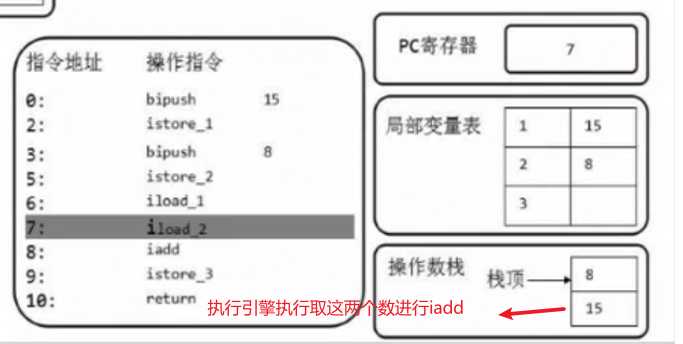
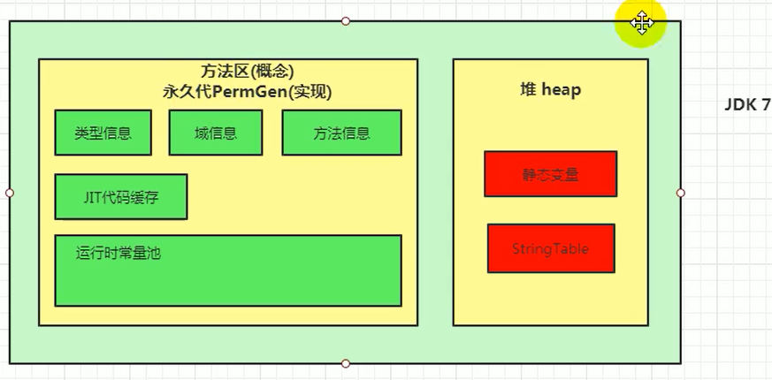
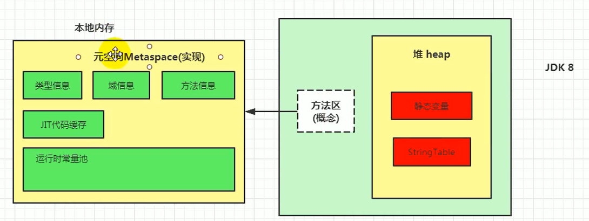

# 言

参考代码
https://gitee.com/moxi159753/LearningNotes/tree/master/JVM/Code


java虚拟机参数

https://docs.oracle.com/javase/8/docs/technotes/tools/unix/java.html


# 1. JVM和Java体系结构


方法区的具体实现有永久代和元空间

JDK1-7（永久代）， JDK8 （元空间） 

反编译

javap -v Main.class


# 2. 类加载子系统

## 1. 加载

加载class文件的方式

1. 从本地系统中直接加载
2. 通过网络获取， 典型场景： Web Applet
3. 从zip压缩包中读取， 成为日后jar, war格式的基础
4. 运行时计算生成， 使用最多的是： 动态代理技术
5. 由其他文件生成， 典型场景：JSP应用
6. 从专有数据库中提取.class文件，比较少见
7. 从加密文件中获取， 典型的防class文件被反编译的保护措施


看.class文件的软件 Binary Viewer（IDEA也有插件： jclasslib Bytecode viewer）


## 2. 链接

1. 验证
    1. 包含文件格式验证，元数据验证，字节码验证，符号引用验证
2. 准备
    1. 赋值默认初始值， 基本类型，int赋值为0， bollean赋值为false
    2. 这里不包含final修饰的static, 因为final在编译的时候就会分配，准备阶段会显式初始化
3. 解析
    1. 将常量池内的符号引用转换为直接引用
    2. 事实上，解析操作往往会伴随JVM在执行初始化后再执行
    3. 符号引用就是一组符号，用来描述所引用的目标。符号引用的字面量形式明确定义在《java虚拟机规范》的Class文件格式中。 直接引用就是直接执行目标的指针，相对偏移量或一个间接定位到目标的句柄。
    4. 解析动作主要针对类或接口，字段，类方法，接口方法，方法类型等。对应常量池中的CONSTANT_Class_info、CONSTANT_Methodref_info、CONSTANT_Fieldref_info.


## 3. 初始化

1. 初始化阶段就是执行类构造器方法\<clinit\>()的过程。
2. 此方法不需定义，是javac编译器自动收集类中的所有<u>**类变量的赋值动作**</u>和<u>**静态代码块**</u>中的语句合并起来的。
3. 构造器方法中指令按语句在源文件中出现的顺序执行。
4. **\<clinit\>()<u>不同于类的构造器</u>。**（关联：构造器是虚拟机视角下的\<init\>()）。
5. 若该类具有父类,JVM会保证子类\<clinit\>()执行前，父类的\<clinit\>()已经执行完毕。
6. 虚拟机必须保证一个类的\<clinit\>()方法在多线程下被同步加锁。（工作中遇到过！！！）
    1. 实际案例： https://www.cnblogs.com/myseries/p/12899428.html
    2. classloader在初始化一个类的时候，会对当前类加锁，加锁后，再执行类的静态初始化块。
        1. 线程1：类A对class A加锁，加锁后，执行类的静态初始化块（在堆栈里体现为\<clinit\>函数），发现用到了class B，于是去加载B；
        2. 线程2：类B对class B加锁，加锁后，执行类的静态初始化块（在堆栈里体现为\<clinit\>函数），发现用到了class A，于是去加载A；
        3. 死锁发生。因为 jvm 内部加了锁，所以jstack -l 不会显示死锁的发生
    3. **如何解决类加载出现的死锁问题？**
        1. 可以显式在主线程最开始用forName加载这些类的，这样类加载就变成在main线程中串行加载，问题得到解决
            1. Class.forName("com.**.**.A");
            2. Class.forName("com.**.**.B");

 

## 类加载器分类

启动类加载器、扩展类加载器、应用类加载器

https://zhuanlan.zhihu.com/p/73359363

类的加载路径

```java
URL[] urls = sun.misc.Launcher.getBootstrapClassPath().getURLs();
for (URL url : urls) {
    System.out.println(url);
}

URL[] urls = ((URLClassLoader) ClassLoader.getSystemClassLoader().getParent()).getURLs();
for (URL url : urls) {
    System.out.println(url);
}

```


启动类加载器：

1. 这个类是C/C++实现的，嵌套在JVM内部
2. 加载核心类库
3. 并不是继承java.lang.ClassLoader， 没有父类加载器
4. 加载扩展类和应用类加载器，并指定为他们的父类加载器
5. 处于安全考虑，Bootstrap启动类加载器只加载包名为java, javax, sun等开头的类


扩展类加载器

​	1. 在jre/lib/ext下加载类库， 如果用户创建的jar放在扩展类加载器的加载路劲下， 也会自动由扩展类加载器加载


应用程序类加载器

	1. 它负责加载环境变量classpath或者系统属性java.class.path指定路径下的类库
	2. 该类加载器是程序中默认的类加载器


自定义类加载器

除了启动类加载器，其他都是自定义类加载器。 


为什么要自定义类加载器

1. 隔离加载类
    1. tomcat部署多个web应用时，就需要隔离。热部署卸载各自的类
2. 修改类加载的方式
3. 扩展加载源
4. 防止源码泄露


## 双亲委派机制

按个人理解: 就是类加载器收到加载请求的时候，它不是自己先去加载，而是向上委托给父级类加载器，这个过程直到启动类加载器。然后如果父级类加载器加载失败，则由子类加载器加载。如果所有的子类加载器都加载不成功，则抛出异常。


优点

1. 避免类的重复加载
2. 保证核心类库的安全（沙箱安全机制）

缺点

​	1. 顶层的 ClassLoader无法访问底层的ClassLoader所加载的类


## 其他

类加载器的引用（不太理解）

​	JVM必须知道一个类型是由启动类加载器加载的还是由用户类加载器加载的。如果一个类型是由用户类加载器加载的。那么JVM会**将这个类加载器的一个引用作为类型信息的一部分保存在方法区中**。当解析一个类型到另一个类型的引用的时候，JVM需要保证这两个类型的类加载器是相同的


Java程序对类的使用方式分为： **主动使用和被动使用**

1. 主动使用，又分为七种情况：
    1. 创建类的实例
    2. 访问某个类或接口的静态变量，或者对该静态变量赋值
    3. 调用类的静态方法
    4. 反射（比如Class.forName("org.example.Test)）
    5. 初始化一个类的子类
    6. Java虚拟机启动时被标明为启动类的类
    7. JDK7开始提供的动态语言支持： java.lang.invoke.MethodHandle实例的解析结果REF_getStatic, REF_putStatic, REF_invokeStatic句柄对应的类没有初始化，则初始化
2. 除了以上七种情况，其他使用Java类的方式都被看作是对类的被动使用，都不会导致类的初始化（调用\<clinit\>()方法）


# 3. 运行时数据区


线程独有：程序计数器，java虚拟机栈， 本地方法栈

线程共享：堆，堆外内存（方法区，代码缓存（JIT产生的））

 

一个JVM对应一个Runtime类


线程

在hotspot jvm里面， 每个线程都与操作系统的本地线程直接映射。

操作系统负责所有线程的安排调度到任何一个可用的cpu上，一旦本地线程初始化成功，它就会调用java线程中的run()方法


# 4. PC寄存器(程序计数器)

pc寄存器是逻辑意义上的寄存器，而不是物理意义上的，它是一块很小的内存空间。

pc寄存器用来存储指向下一条指令的地址，即将要执行的指令代码，由执行引擎读取下一条指令。

每个线程都有它自己的程序计数器，是线程私有的

任何时间一个线程都只有一个方法在执行，也就是所谓的当前方法。程序计数器会存储当前线程正在执行的Java方法的JVM指令地址；或者，如果实在执行native方法，则是未指定值（undefined）


# 5. 虚拟机栈

Java 的指令是根据栈来设计的，不同的平台CPU架构不同， 所以不能设计为基于寄存器的

**优点： 跨平台，指令集小，编译器容易实现**

**缺点： 性能下降，实现同样的功能需要更多的指令**


栈是运行时的单位，堆是存储时的单位 


Java虚拟机栈管理Java程序的运行，它保存方法的局部变量（8种基本数据类型，对象的引用地址），部分结果，并参与方法的调用和返回


## 常见异常

开发中遇到常见的异常？

StackOverflowError(递归没有处理好终止条件，就会出现的异常)

OutofMemoryError


我们可以使用参数-Xss选项来设置线程的最大栈空间，栈的大小直接决定函数调用的最大可达深度。

 默认线程的栈大小是1024kb,  设置栈内存大小` -Xss2048k`


## 栈中存储的是什么

栈中的数据都是以栈帧（Stack Frame）的格式存在

一个方法对应这一个栈帧，栈顶的方法就是当前方法。栈帧和方法是一一对应的关系 Debug调试的时候展示的就是Java虚拟机栈

栈帧是一个内存区块，是一个数据集，维系着方法执行过程中的各种数据信息

执行引擎运行的所有字节码指令只指针当前栈帧进行操作

如果在一个方法中调用了其他方法，对应的新的栈帧就会被创建出来，放在栈的顶端，成为新的当前帧。

当前方法结束后（return结束或者抛异常结束），栈顶的栈帧被丢弃。


## 栈帧的内部结构

1. **局部变量表**（8种基本数据类型，对象的引用地址）
2. **操作数栈（表达式栈）**
3. 动态链接 （指向**运行时常量池**的方法引用）（运行时常量池是方法区的东西）
4. 方法返回地址（方法正常退出或异常退出的定义）
5. 一些附加信息


### 局部变量表

局部变量表，又叫本地变量表，局部变量数组

定义一个数字数组，主要用于存储方法参数和定义在方法体内的局部变量。这些数据类型包含8中基本数据类型，对象引用，retrunAddress类型  

**局部变量表存储的基本单元是Slot(变量槽)**，32位以内的类型只占用一个slot(包括returnAddress类型，byte，short, char在存储前被转换为int) ，64位的类型（long和double）占用两个slot。

由于局部变量是线程独有的，故不存在数据安全问题

局部变量表所需的容量大小都是在编译期就确定下来的。并保存在方法的Code属性的maximum local variables数据项中（借助IDEA插件jclasslib bytecode viewer查看）。在方法运行期间是不会改变局部变量表的大小的。


### 操作数栈

操作数栈，<u>**主要用于保存计算过程的中间结果，同时作为计算过程中变量的临时存储空间**</u>

操作数栈就是**<u>JVM执行引擎的一个工作区</u>**，当一个方法刚开始执行的时候，一个新的栈帧也就会被创建出来。

每个操作数栈都会拥有一个明确的栈深度用于存储数值，其所需的最大深度在编译期就定义好了，保存在方法的Code属性中， 为max_stack的值。

栈中的任何一个元素都可以是任意的Java数据类型

- 32bit的类型占用一个栈单位深度
- 64bit的类型占用两个栈单位深度

操作数栈并非才用访问索引的方式来进行数据访问的，而是通过标准的入栈和出栈操作来完成一次数据访问




由于操作数是存储在内存中的，因此频发地执行内存读/写操作，必然会影响执行速度，为了解决这个问题，hotspot jvm的设计者们提出了栈顶缓存技术（Tos Top-of-Stack Cashing）技术，将栈顶元素全部缓存在物理CPU的寄存器中，以此降低对内存的读写次数，提升执行引擎的执行效率


### 动态链接

指向运行时常量池的方法引用

作用： 描述一个方法调用了另外的其他方法时，就是通过常量池中指向方法的符号引用来表示的。 动态链接的作用就是为了将这些符号引用转换为调用方法的直接引用


为什么需要常量池？

常量池的作用就是为了提供一些符号和常量，便于指令的识别


### 方法调用

**方法调用**

在jvm中，将符号引用转换为调用方法的直接引用与方法的绑定机制相关


**静态链接**

在一个字节码文件被装载JVM内部时，如果被调用的目标方法在编译期可知，且运行期保持不变时，这种情况下将调用方法的符号引用转换为直接引用的过程称之为静态链接。（早期绑定）


**动态链接**

如果被调用的方法在编译期无法被确定下来，也就是说，只能够在程序运行期将调用方法的符号引用转换为直接引用，由于这种引用的转换过程具备动态性，因为也就被称之为动态链接。（晚期绑定）


**非虚方法**

如果方法在编译期就确定了具体的调用版本，这个版本在运行时是不可变的。这样的方法称为非虚方法。

静态方法、私有方法、final方法、实例构造器、父类方法都是非虚方法（不涉及多态，即方法不能重写）

其他方法称为**虚方法**


**方法调用指令**

invokespecial（非虚方法）

invokestatic（非虚方法）

invokevirtual（虚方法）

invokeingerface（接口）

invokedynamic （lambda表达式）


**虚方法表**

在面向对象的编程中，会很频繁的使用到动态分派，如果在每次动态分派的过程中都要重写在类的方法元数据中搜索合适的目标的话就可能影响到执行效率，因此，为了调高性能，JVM采用在类的方法区建立一个虚方法表来实现。

每个类中都有一个虚方法表，表中存放这各个方法的实际入口

那么虚方法表什么时候被创建？

需方发表在类加载的链接阶段被创建并开始初始化，类的变量初始值准备完成后，JVM会把该类的方法表也初始化完毕。


### 方法返回地址

存放调用该方法的pc寄存器的值  

无论通过哪种方式退出，在方法退出后都返回到该方法被调用的位置。

方法正常退出时，调用者的pc计数器的值作为返回地址，即调用该方法的指令的下一条指令的地址。

而通过异常退出的，返回地址是要通过异常表来确定，栈帧中一般不会保存这部分信息

  

### 一些附加信息

栈帧中还允许携带与Java虚拟机实现相关的一些附加信息。例如，**对程序调试提供支持的信息**


## 虚拟机栈的5道面试题

1. 举例栈溢出的情况？（Stack Overflow Error）
    1. 通过-Xss设置栈的大小； OOM
2. 调整栈大小，就能保证不出现溢出吗？
    1. 不能， 比如递归方法没有设置好结束条件
3. 分配的栈内存越大越好？
    1. 不是，会占用其他内存空间
4. 垃圾回收是否会涉及到虚拟机栈？
    1. 不会
5. 方法中定义的局部变量是否线程安全？
    1. 是的，因为是线程独有


# 6. 本地方法接口

就是Java调用非java代码的接口

其他语言也有类似的东西， 比如在C++中，你可以用extern "C" 告诉C++编译期去调用一个C的函数


# 7. 本地方法栈

Java虚拟机栈用于管理Java方法的调用，而本地方法栈用于管理本地方法的调用

native关键字 用来 登记本地方法

在hotspot jvm中，直接将本地方法栈和虚拟机合二为一。


# 8. 堆

## 1. 堆的核心概述

一个JVM实例进程只存在一个堆内存，堆也是Java内存管理的核心区域

Java堆区在JVM启动的时候即被床架，其空间大小也就确定了。是JVM管理的最大一块内存空间

堆内存的大小是可以调节的

堆可以处于物理上不连续的内存空间中，但在逻辑上它应该被视为连续的。

所有线程共享Java堆，在这里还可以划分线程私有的缓冲区（Thread Local Allocation Buffer, TLAB）


了解： C:\Program Files\Java\jdk1.8.0_311\bin有一个exe叫jvisualvm.exe

 

堆空间细分

1. 新生区
    1. Eden区
    2. Survivor区（大小只算其中一个区，因为同一时间只有一个区有数据）
        1. 0区
        2. 1区
2. 养老区
3. 元空间（永久区，Java8之后不属于堆空间，而是属于方法区）


## 2.  设置堆内存大小和OOM

设置最小和最大值范围

-Xms10M (等价于-XX:InitalHeapSize， 单位不区分大小写  )

-Xmx10M (等价于-XX:MaxHeapSize)


通常会将-Xms和-Xmx两个参数配置相同的值，其目的是为了能够在Java垃圾回收机制清理完**堆区后不需要重新分隔计算堆区的大小**，从而提供性能（换句话说初始内存和最大内存一样，就减少了从初始内存到最大内存的扩容操作）

默认情况下,初始内存大小：物理内存大小/64, 最大内存大小：物理内存大小/4 


**查看内存使用情况**

jstat -gc [pid]

**打印垃圾回收细节**

-XX:+PrintGCDetails


 


## 3. 年轻代和老年代

1. 年轻代
    1. Eden区
    2. Survivor区（大小只算其中一个区，因为同一时间只有一个区有数据）
        1. 0区， 也叫from区
        2. 1区， 也叫to区
2. 老年代


配置新生代与老年代在堆结构的占比

默认-XX:NewRatio=2, 表示 新生代占1，老年代占2，新生代占整个堆的1/3

可以修改-XX:NewRatio=4, 表示新生代占1，老年代占4， 新生代占整个堆的1/5


配置Eden空间和另外两个Survivor的空间占比

	默认比值是8:1:1

设置方法 -XX:SurvivorRatio=8

几乎所有的java对象都是在Eden区被new出来的， 绝大部分的Java对象的销毁都在新生代进行了


查看运行进程NewRatio比例

```shell
jnifo -flag NewRatio [pid]
jinfo -flag MaxHeapSize [pid]
```


查看运行进程gc

```shel
jstat -gc [pid]
```


关闭自适应的内存分配策略

```shell
-XX:-UseAdaptiveSizePolicy   # “-”号表示关闭， “+”号表示开启
```


java jvm参数设置大全

https://docs.oracle.com/javase/8/docs/technotes/tools/unix/java.html

http://www.51gjie.com/java/551.html


## 4. 图解对象分配过程

啥时候能进养老区？ 可设置次数，默认是15次

-XX:MaxTenuringThreshold=threshold


为什么有两个幸存者区？ 

**因为需要整理碎片化内存**


总结：

1. 针对幸存者s0,s1区的总结： 复制之后有交换，谁空谁是to
2. 关于垃圾回收： 频繁在新生区收集，很少在养老区收集，几乎不在永久区/元空间收集

伊甸园区满了， MinorGC会执行，会同时清理Eden和Survivor区
幸存者去满了，并不会触发MinorGC


常见的调优工具
1.  jdk命令行
	1. jmap
	2. jinfo
	3. jstat
	4. javap
2. Eclipse： Memory Analyzer Tool  (MAT)
3. jconsole
4. jprofiler
5. java filght recorder
6. gcviewer
7. gc easy


## 5. Minor GC、 Major GC 、Full GC

伊甸园区满了， MinorGC（完全等同于YoungGC）会执行，会同时清理Eden和Survivor区
养老区满了，MajorGC 会执行。
FullGC 收集整个方法区和java堆的垃圾回收

针对HotSpot VM的实现，它里面的GC按照回收区域又分为两大种类型： 一种是部分收集（Partial GC）, 一种是整堆收集（Full GC）
1. 部分收集
	1. Minor GC/ Young GC 只是新生代（Eden,s0,s1）的垃圾收集
	2. Major GC/ Old GC 只是老年代的垃圾收集， 速度比MinorGC慢10倍以上
		1. 目前只有CMS GC会单独收集老年代的行为
		2. 注意很多时候MajorGC和FullGC混淆使用，需要具体分辨是老年代回收还是整堆回收。
	3. 混合收集（Mixed GC）收集整个新生代以及部分老年代的垃圾收集。
		1. 目前，只有G1 GC会有这种行为
2. 整堆收集（Full GC）收集整个Java堆和方法区的垃圾。

GC线程运行的时候，用户线程会受到干预从而停止运行，需要等GC线程收集回收完才进行重新开始运行，整个过程称之为STW(stop the work)

**触发FullGC的五种情况**
1. 调用System.gc(),系统建议执行FullGC,但不是必然执行
2. 老年代空间不足
3. 方法区空间不足
4. 通过MinorGC进入老年代的平均大小大于老年代的可用内存
5. 由Eden区，survivor (from区)向（to区）复制时，对象大小大于to区可用内存，则把该对象转到老年代，且老年代的可用内存小于该对象大小

**说明**
full gc是开发或调优中尽量要避免的，这样暂停时间会短一些


## 6. 堆空间分代思想

为什么要把java堆分代？不分代就不能正常工作吗？
其实不分代完全可以，分代的唯一理由就是**优化GC性能**。如果没有分代，那所有对象都在一起。分析无用对象的时候就会进行全区域扫描，全区域扫描占用的时间会更长。如果是分代回收，就能减少不必要的扫描。从而达到优化GC性能的目的

​	


## 7. 内存分配策略


内存分配策略又叫对象提升（Promotion）规则


晋升老年代的年龄阈值 可以用过选项 -XX:MaxTenuringThreshold=threshold 来设置】


针对不同年龄段的对象分配原则如下所示：
1. 优先分配到Eden
2. 大对象直接分配到老年代
	1. 尽量避免程序中出现过多的大对象（最好大对象的存活时间长!）
3. 长期存活的对象分配到老年代
4. 动态对象年龄判断
	1. 如果Survivor区中相同年龄的所有对象大小的总和大于Survivor空间的一半，年龄大于或等于该年龄的对象可以直接进入老年代，无须等到MaxTenuringThreshold中要求的年龄
5. 空间分配担保(survivor区无法容纳的对象放在老年代)
	1. -XX:handlePromotionFailure


## 8. 为对象分配内存 TLAB

ThreadLocalAllocationBuffer
TLAB是为了解决多线程分配内存时可能存在冲突的问题


为什么有TLAB？ 
因为堆区是线程共享的，并发情况下线程不安全，如果要达到线程安全的目的就需要加锁，加锁就会影响程序执行效率


从内存模型而不是垃圾收集的角度，对Eden区域继续进行划分，JVM为每个线程分配了一个私有缓存区域，它包含在Eden空间内。
多线程同时分配内存时，使用TLAB可以避免一系列的非线程安全问题
同时还能够提升内存分配的吞吐量，因此我们可以将这种内存分配方法称为快速分配策略。

默认情况下，TLAB空间的内存非常小，仅占有整个Eden空间的1%，
通过选项“-XX: TLABWasteTargetPercent”设置TLAB空间所占用Eden空间的百分比大小。

可以jinfo -flag UseTLAB [PID] 查看是否开启TLAB

在程序中，开发人员可以通过选项“-Xx:UseTLAB”设置是否开启TLAB空间。


> TLAB分配过程
对象首先是通过TLAB开辟空间，如果不能放入，那么需要通过Eden来进行分配

## 9. 小结堆空间的参数配置

-   -XX：+PrintFlagsInitial：查看所有的参数的默认初始值
-   -XX：+PrintFlagsFinal：查看所有的参数的最终值（可能会存在修改，不再是初始值）
-   -Xms：初始堆空间内存（默认为物理内存的1/64）
-   -Xmx：最大堆空间内存（默认为物理内存的1/4）
-   -Xmn：设置新生代的大小。（初始值及最大值）（NewRatio会失效）
-   -XX:NewRatio：配置新生代与老年代在堆结构的占比
-   -XX:SurvivorRatio：设置新生代中Eden和S0/S1空间的比例
-   -XX:MaxTenuringThreshold：设置新生代垃圾的最大年龄
-   -XX：+PrintGCDetails：输出详细的GC处理日志
    -   打印gc简要信息：①-XX：+PrintGC ② - verbose:gc
-   -XX:HandlePromotionFalilure：是否设置空间分配担保

在发生Minor GC之前，虚拟机会检查老年代最大可用的连续空间是否大于新生代所有对象的总空间。

-   如果大于，则此次Minor GC是安全的
-   如果小于，则虚拟机会查看-xx:HandlePromotionFailure设置值是否允担保失败。
    -   如果HandlePromotionFailure=true，那么会继续检查老年代最大可用连续空间是否大于历次晋升到老年代的对象的平均大小。
    -   如果大于，则尝试进行一次Minor GC，但这次Minor GC依然是有风险的；
    -   如果小于，则改为进行一次FullGC。
    -   如果HandlePromotionFailure=false，则改为进行一次Ful1 Gc。

在JDK6 Update24之后，HandlePromotionFailure参数不会再影响到虚拟机的空间分配担保策略，观察openJDK中的源码变化，虽然源码中还定义了HandlePromotionFailure参数，但是在代码中已经不会再使用它。**JDK6 Update 24之后的规则变为只要老年代的连续空间大于新生代对象总大小或者历次晋升的平均大小就会进行Minor GC，否则将进行FullGC。**


## 10. 堆是分配对象的唯一选择吗？
随着JIT的发展，逃逸分析技术逐渐成熟。 带来了栈上分配，标量替换等优化技术
经过逃逸分析后发现，一个对象并没有逃逸出方法的话，那么就会被优化升栈上分配。这样就无须在堆上分配内存，也无须进行垃圾回收。这也是最常见的对外存储技术

TaoBaoVM 创新了GCIH技术实现了off-heap，将生命周期较长的Java对象从heap中移至heap外，从而达到降低GC的回收频率。


### 逃逸分析？（Escape Analysis）
逃逸分析是为了优化 JVM 内存和提升程序性能的设计。

如果快速判断是否发生了逃逸分析，就看new的对象是否有可能在方法外被调用


### 什么是逃逸分析？

关于 Java 逃逸分析的定义：

逃逸分析（Escape Analysis）简单来讲就是，Java Hotspot 虚拟机可以分析新创建对象的使用范围，并决定是否在 Java 堆上分配内存的一项技术。

逃逸分析的 JVM 参数如下：

-   开启逃逸分析：-XX:+DoEscapeAnalysis
-   关闭逃逸分析：-XX:-DoEscapeAnalysis
-   显示分析结果：-XX:+PrintEscapeAnalysis

逃逸分析技术在 Java SE 6u23+ 开始支持，并默认设置为启用状态，可以不用额外加这个参数。


### 对象逃逸状态

1、全局逃逸（GlobalEscape）

即一个对象的作用范围逃出了当前方法或者当前线程，有以下几种场景：

-   对象是一个静态变量
-   对象是一个已经发生逃逸的对象
-   对象作为当前方法的返回值

2、参数逃逸（ArgEscape）

即一个对象被作为方法参数传递或者被参数引用，但在调用过程中不会发生全局逃逸，这个状态是通过被调方法的字节码确定的。

3、没有逃逸

即方法中的对象没有发生逃逸。


### 逃逸分析优化

针对上面第三点，当一个对象没有逃逸时，可以得到以下几个虚拟机的优化。

#### 1) （同步省略）锁消除
我们知道线程同步锁是非常牺牲性能的，当编译器确定当前对象只有当前线程使用，那么就会移除该对象的同步锁。（如果一个对象被发现只能从一个线程被访问到，那么对于这个对象的操作可以不考虑同步）
例如，StringBuffer 和 Vector 都是用 synchronized 修饰线程安全的，但大部分情况下，它们都只是在当前线程中用到，这样编译器就会优化移除掉这些锁操作。

换句话理解：
线程同步的代价是相当高的，同步的后果是降低并发性和性能。
在动态编译同步块的时候，JIT编译器可以借助逃逸分析来判断同步块所使用的锁对象是否只能够被一个线程访问而没有被发布到其他线程。如果没有，那么JIT编译器在编译这个同步块的时候就会取消对这部分代码的同步。这样就能大大提高并发性和性能。这个取消同步的过程就叫同步省略，也叫锁消除。

锁消除的 JVM 参数如下：
-   开启锁消除：-XX:+EliminateLocks
-   关闭锁消除：-XX:-EliminateLocks
锁消除在 JDK8 中都是默认开启的，并且锁消除都要建立在逃逸分析的基础上。


#### 2) 标量替换(分离对象)
首先要明白标量和聚合量，基础类型和对象的引用可以理解为标量，它们不能被进一步分解。而能被进一步分解的量就是聚合量，比如：对象。
对象是聚合量，它又可以被进一步分解成标量，将其成员变量分解为分散的变量，这就叫做标量替换。
这样，如果一个对象没有发生逃逸，那压根就不用创建它，只会在栈或者寄存器上创建它用到的成员标量，节省了内存空间，也提升了应用程序性能。

标量替换的 JVM 参数如下
-   开启标量替换：-XX:+EliminateAllocations
-   关闭标量替换：-XX:-EliminateAllocations
-   显示标量替换详情：-XX:+PrintEliminateAllocations
标量替换同样在 JDK8 中都是默认开启的，并且都要建立在逃逸分析的基础上。

总结就是： 把对象肢解成多个基本类型

深入理解JVM中P418页，标量替换可以视为栈上分配的一种特例


#### 3) 栈上分配
当对象没有发生逃逸时，该对象就可以通过标量替换分解成成员标量分配在栈内存中，和方法的生命周期一致，随着栈帧出栈时销毁，减少了 GC 压力，提高了应用程序性能。


我们知道这点后，在平时开发过程中就要可尽可能的控制变量的作用范围了，变量范围越小越好，让虚拟机尽可能有优化的空间。


#### 结论

开发中能使用局部变量的，就不要使用在方法外定义。
使用逃逸分析，编译器可以对代码做如下优化：

-   栈上分配：将堆分配转化为栈分配。如果一个对象在子程序中被分配，要使指向该对象的指针永远不会发生逃逸，对象可能是栈上分配的候选，而不是堆上分配
-   同步省略：如果一个对象被发现只有一个线程被访问到，那么对于这个对象的操作可以不考虑同步。
-   分离对象或标量替换：有的对象可能不需要作为一个连续的内存结构存在也可以被访问到，那么对象的部分（或全部）可以不存储在内存，而是存储在CPU寄存器中。


### 逃逸分析的不足

关于逃逸分析的论文在1999年就已经发表了，但直到JDK1.6才有实现，而且这项技术到如今也并不是十分成熟。

其根本原因就是无法保证逃逸分析的性能消耗一定能高于他的消耗。虽然经过逃逸分析可以做标量替换、栈上分配、和锁消除。但是逃逸分析自身也是需要进行一系列复杂的分析的，这其实也是一个相对耗时的过程。 一个极端的例子，就是经过逃逸分析之后，发现没有一个对象是不逃逸的。那这个逃逸分析的过程就白白浪费掉了。

虽然这项技术并不十分成熟，但是它也是即时编译器优化技术中一个十分重要的手段。注意到有一些观点，认为通过逃逸分析，JVM会在栈上分配那些不会逃逸的对象，这在理论上是可行的，但是取决于JvM设计者的选择。据我所知，oracle Hotspot JVM中并未这么做，这一点在逃逸分析相关的文档里已经说明，所以可以明确所有的对象实例都是创建在堆上。

目前很多书籍还是基于JDK7以前的版本，JDK已经发生了很大变化，intern字符串的缓存和静态变量曾经都被分配在永久代上，而永久代已经被元数据区取代。但是，intern字符串缓存和静态变量并不是被转移到元数据区，而是直接在堆上分配，所以这一点同样符合前面一点的结论：对象实例都是分配在堆上。


# 9. 方法区

## 1. 栈，堆， 方法区的交互关系

Person person = new Person();

Person.class在方法区

new Person()在堆区

person 引用在栈区


## 2. 方法区的理解

《Java虚拟机规范》中明确说明：“尽管所有的方法区在逻辑上是属于堆的一部分，但一些简单的实现可能不会选择去进行垃圾收集或者进行压缩。”但对于HotSpotJVM而言，方法区还有一个别名叫做Non-Heap（非堆），目的就是要和堆分开。

所以，方法区看作是一块独立于Java堆的内存空间。


方法区主要存放的是 Class，而堆中主要存放的是 实例化的对象

- 方法区（Method Area）与Java堆一样，是各个线程共享的内存区域。
- 方法区在JVM启动的时候被创建，并且它的实际的物理内存空间中和Java堆区一样都可以是不连续的。
- 方法区的大小，跟堆空间一样，可以选择固定大小或者可扩展。
- 方法区的大小决定了系统可以保存多少个类，如果系统定义了太多的类，导致方法区溢出，虚拟机同样会抛出内存溢出错误：ava.lang.OutofMemoryError：PermGen space 或者java.lang.OutOfMemoryError:Metaspace
    - 加载大量的第三方的jar包
    - Tomcat部署的工程过多（30~50个）
    - 大量动态的生成反射类
- 关闭JVM就会释放这个区域的内存。


运行时常量池一直在方法区中

jdk8之后字符串常量池在堆里面， jdk8之前方法区里面


**Hotspot中方法区的演进**

到了JDK8，终于完全废弃了永久代的概念，改用与JRockit、J9一样在本地内存中实现的元空间（Metaspace）来代替

元空间的本质和永久代类似，都是对JVM规范中方法区的实现。不过元空间与永久代最大的区别在于：元空间不在虚拟机设置的内存中，而是使用本地内存

永久代、元空间二者并不只是名字变了，内部结构也调整了

根据《Java虚拟机规范》的规定，如果方法区无法满足新的内存分配需求时，将抛出OOM异常


## 3. 设置方法区大小和OOM

方法区的大小不必是固定的，JVM可以根据应用的需要动态调整。

### jdk7及以前

- 通过-xx:Permsize来设置永久代初始分配空间。默认值是20.75M
- -XX:MaxPermsize来设定永久代最大可分配空间。32位机器默认是64M，64位机器模式是82M
- 当JVM加载的类信息容量超过了这个值，会报异常OutofMemoryError:PermGen space。

```shell
jinfo -flag PermSize [pid]
jinfo -flag MaxPermSize [pid]
jps
jinfo -flag MetaspaceSize [pid]
```


### JDK8以后

元数据区大小可以使用参数 -XX:MetaspaceSize 和 -XX:MaxMetaspaceSize指定
默认值依赖于平台。windows下，-XX:MetaspaceSize是21M，-XX:MaxMetaspaceSize的值是-1，即没有限制。
与永久代不同，如果不指定大小，默认情况下，虚拟机会耗尽所有的可用系统内存。如果元数据区发生溢出，虚拟机一样会抛出异常OutOfMemoryError:Metaspace
-XX:MetaspaceSize：设置初始的元空间大小。对于一个64位的服务器端JVM来说，其默认的-xx:MetaspaceSize值为21MB。这就是初始的高水位线，一旦触及这个水位线，Ful1GC将会被触发并卸载没用的类（即这些类对应的类加载器不再存活）然后这个高水位线将会重置。新的高水位线的值取决于GC后释放了多少元空间。**如果释放的空间不足，那么在不超过MaxMetaspaceSize时，适当提高该值。如果释放空间过多，则适当降低该值。**


###  如何解决这些OOM

- 要解决OOM异常或heap space的异常，一般的手段是首先通过内存映像分析工具（如Ec1ipse Memory Analyzer）对dump出来的堆转储快照进行分析，重点是确认内存中的对象是否是必要的，也就是要先分清楚到底是出现了内存泄漏（Memory Leak）还是内存溢出（Memory Overflow）
    - 内存泄漏就是 有大量的引用指向某些对象，但是这些对象以后不会使用了，但是因为它们还和GC ROOT有关联，所以导致以后这些对象也不会被回收，这就是内存泄漏的问题
        - IO没有close
        - ThreadLocal没处理好也容易出现
- 如果是内存泄漏，可进一步通过工具查看泄漏对象到GC Roots的引用链。于是就能找到泄漏对象是通过怎样的路径与GCRoots相关联并导致垃圾收集器无法自动回收它们的。掌握了泄漏对象的类型信息，以及GCRoots引用链的信息，就可以比较准确地定位出泄漏代码的位置。
- 如果不存在内存泄漏，换句话说就是内存中的对象确实都还必须存活着，那就应当检查虚拟机的堆参数（-Xmx与-Xms），与机器物理内存对比看是否还可以调大，从代码上检查是否存在某些对象生命周期过长、持有状态时间过长的情况，尝试减少程序运行期的内存消耗。


## 4. 方法区的内部结构

《深入理解Java虚拟机》书中对方法区（Method Area）存储内容描述如下：它用于存储已被虚拟机加载的<u>类型信息、常量（运行时常量池）、静态变量、即时编译器编译后的代码缓存（JIT代码缓存）、域信息、方法信息</u>等。域信息、方法信息算是类型信息


###  类型信息

对每个加载的类型（类class、接口interface、枚举enum、注解annotation），JVm必须在方法区中存储以下类型信息：

- 这个类型的完整有效名称（全名=包名.类名）
- 这个类型直接父类的完整有效名（对于interface或是java.lang.object，都没有父类）
- 这个类型的修饰符（public，abstract，final的某个子集）
- 这个类型直接接口的一个有序列表
- 

###  域（Field）信息

JVM必须在方法区中保存类型的所有域的相关信息以及域的声明顺序。

域的相关信息包括：域名称、域类型、域修饰符（public，private，protected，static，final，volatile，transient的某个子集）


###  方法（Method）信息

JVM必须保存所有方法的以下信息，同域信息一样包括声明顺序：

- 方法名称
- 方法的返回类型（或void）
- 方法参数的数量和类型（按顺序）
- 方法的修饰符（public，private，protected，static，final，synchronized，native，abstract的一个子集）
- 方法的字节码（bytecodes）、操作数栈、局部变量表及大小（abstract和native方法除外）
- 异常表（abstract和native方法除外）

> 每个异常处理的开始位置、结束位置、代码处理在程序计数器中的偏移地址、被捕获的异常类的常量池索引


###  non-final的类变量

静态变量和类关联在一起，随着类的加载而加载，他们成为类数据在逻辑上的一部分

类变量被类的所有实例共享，即使没有类实例时，你也可以访问它

​     

###  全局常量

全局常量就是使用 static final 进行修饰

被声明为final的类变量的处理方法则不同，每个全局常量在编译的时候就会被分配了。


### 常量池

一个有效的字节码文件中除了包含类的版本信息、字段、方法以及接口等描述符信息外，还包含一项信息就是常量池表（Constant Pool Table），包括各种 <u>**字面量**</u> 和对类型、域和方法的 <u>**符号引用**</u> 

常量池存储的数据类型包括

1. 数量值
2. 字符串值
3. 类引用
4. 字段引用
5. 方法引用 

**小结**

常量池、可以看做是一张表，虚拟机指令根据这张常量表找到要执行的类名、方法名、参数类型、字面量等类型


### 运行时常量池

运行时常量池是方法区的一部分

常量池表（Constant Pool Table）是Class文件的一部分，用于存放编译期生成的各种字面量与符号引用，这部分内容将在类加载后存放到方法区的运行时常量池中。

运行时常量池，在加载类和接口到虚拟机后，就会创建对应的运行时常量池。

JVM为每个已加载的类型（类或接口）都维护一个常量池。池中的数据项像数组项一样，**<u>是通过索引访问的。</u>**

运行时常量池中包含多种不同的常量，包括编译期就已经明确的数值字面量，也包括到运行期解析后才能够获得的方法或者字段引用。此时不再是常量池中的符号地址了，这里换为真实地址。

运行时常量池，相对于Class文件常量池的另一重要特征是：**<u>具备动态性。</u>**

运行时常量池类似于传统编程语言中的符号表（symboltable），但是它所包含的数据却比符号表要更加丰富一些。

当创建类或接口的运行时常量池时，如果构造运行时常量池所需的内存空间超 过了方法区所能提供的最大值，则JVM会抛outofMemoryError异常。


## 5. 方法区使用举例

```java
public class MethodAreaDemo {
    public static void main(String args[]) {
        int x = 500;
        int y = 100;
        int a = x / y;
        int b = 50;
        System.out.println(a+b);
    }
}
```

字节码执行过程展示


首先现将操作数500放入到操作数栈中


然后存储到局部变量表中


然后重复一次，把100放入局部变量表中，最后再将变量表中的500 和 100 取出，进行操作


将500 和 100 进行一个除法运算，在把结果入栈


在最后就是输出流，需要调用运行时常量池的常量


最后调用invokevirtual（虚方法调用），然后返回


返回时


程序计数器始终计算的都是当前代码运行的位置，目的是为了方便记录 方法调用后能够正常返回，或者是进行了CPU切换后，也能回来到原来的代码进行执行。


## 6. 方法区的演进细节

jdk6-7-8

首先明确：只有Hotspot才有永久代。BEA JRockit、IBMJ9等来说，是不存在永久代的概念的。原则上如何实现方法区属于虚拟机实现细节，不受《Java虚拟机规范》管束，并不要求统一

Hotspot中方法区的变化：

| JDK1.6及以前 | 有永久代，静态变量存储在永久代上                             |
| ------------ | ------------------------------------------------------------ |
| JDK1.7       | 有永久代，但已经逐步 “去永久代”，字符串常量池，静态变量移除，保存在堆中 |
| JDK1.8       | 无永久代，类型信息，字段，方法，常量保存在本地内存的元空间，但**字符串常量池、静态变量**仍然在**堆**中。 |


JDK6的时候


JDK7的时候



JDK8的时候，元空间大小只受物理内存影响



 

###  为什么永久代要被元空间替代？

JRockit是和HotSpot融合后的结果，因为JRockit没有永久代，所以他们不需要配置永久代

随着Java8的到来，HotSpot VM中再也见不到永久代了。但是这并不意味着类的元数据信息也消失了。这些数据被移到了一个与堆不相连的本地内存区域，这个区域叫做元空间（Metaspace）。

由于类的元数据分配在本地内存中，元空间的最大可分配空间就是系统可用内存空间，这项改动是很有必要的，原因有：

- 为永久代设置空间大小是很难确定的。

在某些场景下，如果动态加载类过多，容易产生Perm区的oom。比如某个实际Web工 程中，因为功能点比较多，在运行过程中，要不断动态加载很多类，经常出现致命错误。

“Exception in thread‘dubbo client x.x connector'java.lang.OutOfMemoryError:PermGen space”

而元空间和永久代之间最大的区别在于：元空间并不在虚拟机中，而是使用本地内存。 因此，默认情况下，元空间的大小仅受本地内存限制。

- 对永久代进行调优是很困难的。
    - 主要是为了降低Full GC

有些人认为方法区（如HotSpot虚拟机中的元空间或者永久代）是没有垃圾收集行为的，其实不然。《Java虚拟机规范》对方法区的约束是非常宽松的，提到过可以不要求虚拟机在方法区中实现垃圾收集。事实上也确实有未实现或未能完整实现方法区类型卸载的收集器存在（如JDK11时期的ZGC收集器就不支持类卸载）。 一般来说这个区域的回收效果比较难令人满意，尤其是类型的卸载，条件相当苛刻。但是这部分区域的回收有时又确实是必要的。以前sun公司的Bug列表中，曾出现过的若干个严重的Bug就是由于低版本的HotSpot虚拟机对此区域未完全回收而导致内存泄漏

方法区的垃圾收集主要回收两部分内容：常量池中废弃的常量和不在使用的类型

###  StringTable为什么要调整位置

jdk7中将StringTable放到了堆空间中。**因为永久代的回收效率很低，在full gc的时候才会触发。**而fullgc是老年代的空间不足、永久代不足时才会触发。

这就导致stringTable回收效率不高。而我们开发中会有大量的字符串被创建，回收效率低，导致永久代内存不足。放到堆里，能及时回收内存。

###  静态变量存放在那里？

静态引用对应的对象实体始终都存在堆空间

可以使用 jhsdb.ext，需要在jdk9的时候才引入的

staticobj随着Test的类型信息存放在方法区，instanceobj随着Test的对象实例存放在Java堆，localobject则是存放在foo（）方法栈帧的局部变量表中。


## 7. 方法区的垃圾回收

有些人认为方法区（如Hotspot虚拟机中的元空间或者永久代）是没有垃圾收集行为的，其实不然。《Java虚拟机规范》对方法区的约束是非常宽松的，提到过可以不要求虚拟机在方法区中实现垃圾收集。事实上也确实有未实现或未能完整实现方法区类型卸载的收集器存在（如JDK11时期的zGC收集器就不支持类卸载）。

一般来说这个区域的回收效果比较难令人满意，尤其是类型的卸载，条件相当苛刻。但是这部分区域的回收有时又确实是必要的。以前sun公司的Bug列表中，曾出现过的若干个严重的Bug就是由于低版本的HotSpot虚拟机对此区域未完全回收而导致内存泄漏。

**方法区的垃圾收集主要回收两部分内容：常量池中废弃的常量和不再使用的类型。**

先来说说方法区内常量池之中主要存放的两大类常量：**字面量和符号引用**。字面量比较接近Java语言层次的常量概念，如文本字符串、被声明为final的常量值等。而符号引用则属于编译原理方面的概念，包括下面三类常量：

- 类和接口的全限定名
- 字段的名称和描述符
- 方法的名称和描述符

HotSpot虚拟机对常量池的回收策略是很明确的，只要常量池中的常量没有被任何地方引用，就可以被回收。

回收废弃常量与回收Java堆中的对象非常类似。（关于常量的回收比较简单，重点是类的回收）


判定一个常量是否“废弃”还是相对简单，而要判定一个类型是否属于“不再被使用的类”的条件就比较苛刻了。需要同时满足下面三个条件：

- 该类所有的实例都已经被回收，也就是Java堆中不存在该类及其任何派生子类的实例。 
- 加载该类的类加载器已经被回收，这个条件除非是经过精心设计的可替换类加载器的场景，如OSGi、JSP的重加载等，否则通常是很难达成的。
- 该类对应的java.lang.Class对象没有在任何地方被引用，无法在任何地方通过反射访问该类的方法。


Java虚拟机被允许对满足上述三个条件的无用类进行回收，这里说的仅仅是“被允许”，而并不是和对象一样，没有引用了就必然会回收。关于是否要对类型进行回收，HotSpot虚拟机提供了-Xnoclassgc参数进行控制，还可以使用-verbose:class 以及 -XX：+TraceClass-Loading、-XX：+TraceClassUnLoading查看类加载和卸载信息

在大量使用反射、动态代理、CGLib等字节码框架，动态生成JSP以及oSGi这类频繁自定义类加载器的场景中，通常都需要Java虚拟机具备类型卸载的能力，以保证不会对方法区造成过大的内存压力。


## 8. 总结


###  常见面试题

#### 百度 

说一下JVM内存模型吧，有哪些区？分别干什么的？

```
5个区，堆区，栈区，方法区，程序计数器，本地方法栈

堆区，存new出来的对象
方法区，存类信息，静态变量，运行时常量池
堆区和方法区是多线程共享的

栈区,存放线程运行时局部变量表，操作数栈，方法返回地址，动态链接，一些附加信息 （管理java方法的调用）
程序计数器，记录线程指令执行的地址
本地方法栈，和java虚拟机栈类似，管理本地方法的调用
```


#### 蚂蚁金服 

Java8的内存分代改进 JVM内存分哪几个区，每个区的作用是什么？ 

```
同百度
```

JVM内存分布/内存结构？栈和堆的区别？堆的结构？为什么两个survivor区？ 

```
同百度， 两个survivor是因为需要整理碎片化内存， 从from区到to区的过程就是对内存的整理
```

Eden和survior的比例分配

```
默认比值是8:1:1  # 可通过-XX:SurvivorRatio=8设置
```


#### 小米

jvm内存分区，为什么要有新生代和老年代

```
为了提高GC的效率，如果不分新生代和老年代，那么就要全盘扫描堆内存空间，有些长期存在的对象没必要每次都参与扫描。
```


#### 字节跳动 

Java的内存分区 

```
同百度
```

讲讲vm运行时数据库区 ?

```
同百度
```

什么时候对象会进入老年代？

```
# 四种情况对象会进入老年代
1.大对象直接进入到老年代
2.经过多次youngGC后，年龄到了阈值后会进入老年代
3.幸存者空间无法容纳的对象会进入老年代
4.动态年龄判断，简单的打个比方，比如幸存者区有一大半的对象都是5岁，那么超过5岁的对象可以直接进入老年代
```


#### 京东

JVM的内存结构，Eden和Survivor比例。 

```
同百度
```

新生代中为什么要分为Eden和survivor。

```
一是防止新生代数据直接被送到老年代， 二是为了防止内存碎片化
```

参考：https://www.cxyxiaowu.com/18563.html#:~:text=%E5%A6%82%E6%9E%9C%E6%B2%A1%E6%9C%89Survivor%EF%BC%8CEden%E5%8C%BA,%E5%88%86%E4%B8%BAEden%E5%92%8CSurvivor%E3%80%82

Survivor的存在意义，就是减少被送到老年代的对象，进而减少Full GC的发生，Survivor的 预筛选保证，只有经历16次Minor GC还能在新生代中存活的对象，才会被送到老年代。 设置两个Survivor区最大的好处就是解决了碎片化，刚刚新建的对象在Eden中，经历一次 Minor GC，Eden中的存活对象就会被移动到第一块survivor space S0，Eden被清空；等 Eden区再满了，就再触发一次Minor GC，Eden和S0中的存活对象又会被复制送入第二块 survivor space S1（这个过程非常重要，因为这种复制算法保证了S1中来自S0和Eden两部分 的存活对象占用连续的内存空间，避免了碎片化的发生）


#### 天猫

Jvm内存模型以及分区，需要详细到每个区放什么。

```
同百度
```

JVM的内存模型，Java8做了什么改

```
java7之前，方法区的实现是永久代
java8之后，方法区的实现是元空间
```


#### 拼多多

 JVM内存分哪几个区，每个区的作用是什么？

```
同百度
```


#### 美团

java内存分配

```
同百度
```

jvm的永久代中会发生垃圾回收吗？

```
会，对一些无用的类信息，常量进行回收
```

jvm内存分区，为什么要有新生代和老年代？

```
同小米
为了提高GC的效率，如果不分新生代和老年代，那么就要全盘扫描堆内存空间，有些长期存在的对象没必要每次都参与扫描。
```

 


# 10. 对象的实例化内存布局与访问定位

## 1. 对象的实例化


###  对象创建方式

- new：最常见的方式、单例类中调用getInstance的静态类方法，XXXBuilder/XXXFactory的静态方法
- Class的newInstance方法：在JDK9里面被标记为过时的方法，因为只能调用空参构造器
- Constructor的newInstance(XXX)：反射的方式，可以调用空参的，或者带参的构造器
- 使用clone()：不调用任何的构造器，要求当前的类需要实现Cloneable接口中的clone接口
- 使用序列化：从文件中，或者网络中获取一个对象的二进制流。
- 第三方库 Objenesis

 

###  创建对象的步骤

**判断对象对应的类是否加载、链接、初始化**

虚拟机遇到一条new指令，首先去检查这个指令的参数能否在Metaspace的常量池中定位到一个类的符号引用，并且检查这个符号引用代表的类是否已经被加载，解析和初始化。（即判断类元信息是否存在）。如果没有，那么在双亲委派模式下，使用当前类加载器以ClassLoader + 包名 + 类名为key进行查找对应的 .class文件，如果没有找到文件，则抛出ClassNotFoundException异常，如果找到，则进行类加载，并生成对应的Class对象。


**为对象分配内存**

首先计算对象占用空间的大小，接着在堆中划分一块内存给新对象。如果实例成员变量是引用变量，仅分配引用变量空间即可，即4个字节大小

- 如果内存规整：指针碰撞
- 如果内存不规整
    - 虚拟表需要维护一个列表
    - 空闲列表分配

如果内存是规整的，那么虚拟机将采用的是指针碰撞法（Bump The Point）来为对象分配内存。

意思是所有用过的内存在一边，空闲的内存放另外一边，中间放着一个指针作为分界点的指示器，分配内存就仅仅是把指针指向空闲那边挪动一段与对象大小相等的距离罢了。如果垃圾收集器选择的是Serial ，ParNew这种基于压缩算法的，虚拟机采用这种分配方式。一般使用带Compact（整理）过程的收集器时，使用指针碰撞。

如果内存不是规整的，已使用的内存和未使用的内存相互交错，那么虚拟机将采用的是空闲列表来为对象分配内存。意思是虚拟机维护了一个列表，记录上那些内存块是可用的，再分配的时候从列表中找到一块足够大的空间划分给对象实例，并更新列表上的内容。这种分配方式成为了 “空闲列表（Free List）”

选择哪种分配方式由Java堆是否规整所决定，而Java堆是否规整又由所采用的垃圾收集器是否带有压缩整理功能决定。


**处理并发问题**

- 采用CAS配上失败重试保证更新的原子性
- 每个线程预先分配TLAB - 通过设置 -XX:+UseTLAB参数来设置（区域加锁机制）
    - 在Eden区给每个线程分配一块区域

初始化分配到的内存

给对象属性赋值的操作

- 属性的默认初始化 (链接的准备阶段)
- 显示初始化（变量定义的时候）
- 代码块中的初始化（静态代码块）
- 构造器初始化
- 所有属性设置默认值，保证对象实例字段在不赋值可以直接使用


**设置对象的对象头**

将对象的所属类（即类的元数据信息）、对象的HashCode和对象的GC信息、锁信息等数据存储在对象的对象头中。这个过程的具体设置方式取决于JVM实现。


**执行init方法进行初始化**

在Java程序的视角看来，初始化才正式开始。初始化成员变量，执行实例化代码块，调用类的构造方法，并把堆内对象的首地址赋值给引用变量

因此一般来说（由字节码中跟随invokespecial指令所决定），new指令之后会接着就是执行方法，把对象按照程序员的意愿进行初始化，这样一个真正可用的对象才算完成创建出来。


###  对象实例化的过程

- 加载类元信息
- 为对象分配内存
- 处理并发问题
- 属性的默认初始化（零值初始化）
- 设置对象头信息
- 属性的显示初始化、代码块中初始化、构造器中初始化


## 2. 对象的内存布局

   

###  对象头

对象头包含了两部分，分别是 运行时元数据（Mark Word）和 类型指针

> 如果是数组（数组也是一种对象），还需要记录数组的长度

####  运行时元数据

- 哈希值（HashCode）
- GC分代年龄
- 锁状态标志
- 线程持有的锁
- 偏向线程ID
- 偏向时间戳

####  类型指针

指向类元数据InstanceKlass，确定该对象所属的类型。指向的其实是方法区中存放的类元信息


**小结**


## 3. 对象的访问定位

JVM是如何通过栈帧中的对象引用访问到其内部的对象实例呢？


###  对象访问的两种方式

句柄访问 和 直接指针（hospot采用）

####  句柄访问

句柄访问就是说栈的局部变量表中，记录的对象的引用，然后在堆空间中开辟了一块空间，也就是句柄池


优点： reference中存储稳定句柄地址，对象被移动（垃圾收集时移动对象很普遍）时只会改变句柄中实例数据指针即可，reference本身不需要被修改


####  直接指针（HotSpot采用）


直接指针是局部变量表中的引用，直接指向堆中的实例，在对象实例中有类型指针，指向的是方法区中的对象类型数据

优点：节省内存，速度也快


## 大厂面试题

美团

- 对象在JVM中是怎么存储的？
- 对象头信息里面有哪些东西？
    - 答：运行时元数据（对象哈希值，GC分代年龄，锁等等信息）， 类型指针

蚂蚁金服

- Java对象头有什么？
    - 答：运行时元数据（对象哈希值，GC分代年龄，锁等等信息）， 类型指针


# 11. 直接内存

不是虚拟机运行时数据区的一部分，也不是《Java虚拟机规范》中定义的内存区域。

**直接内存是在Java堆外的、直接向系统申请的内存区间。**

来源于NIO，通过存在堆中的DirectByteBuffer操作Native内存

通常，访问直接内存的速度会优于Java堆。即读写性能高。

- 因此出于性能考虑，读写频繁的场合可能会考虑使用直接内存。
- Java的NIO库允许Java程序使用直接内存，用于数据缓冲区

使用下列代码，直接分配本地内存空间

```shell
int BUFFER = 1024*1024*1024; // 1GB
ByteBuffer byteBuffer = ByteBuffer.allocateDirect(BUFFER);
```


##  非直接缓存区和缓存区


原来采用BIO的架构，我们需要从用户态切换成内核态

NIO的方式使用了缓存区的概念

##  存在的问题

也可能导致outofMemoryError异常

由于直接内存在Java堆外，因此它的大小不会直接受限于-xmx指定的最大堆大小，但是系统内存是有限的，Java堆和直接内存的总和依然受限于操作系统能给出的最大内存。 缺点

- 分配回收成本较高
- 不受JVM内存回收管理

直接内存大小可以通过MaxDirectMemorySize设置

如果不指定，默认值应该是-xmx的大小减去一个Survivor的大小，也就是堆内存的最大可用内存


# 12. 执行引擎

##  执行引擎概述

执行引擎属于JVM的下层，里面包括 解释器、及时编译器、垃圾回收器


执行引擎是Java虚拟机核心的组成部分之一。“虚拟机”是一个相对于“物理机”的概念，这两种机器都有代码执行能力，其区别是物理机的执行引擎是直接建立在处理器、缓存、指令集和操作系统层面上的，而虚拟机的执行引擎则是由软件自行实现的，因此可以不受物理条件制约地定制指令集与执行引擎的结构体系，能够执行那些不被硬件直接支持的指令集格式。

JVM的主要任务是负责装载字节码到其内部，但字节码并不能够直接运行在操作系统之上，因为字节码指令并非等价于本地机器指令，它内部包含的仅仅只是一些能够被JVM所识别的字节码指令、符号表，以及其他辅助信息。

那么，如果想要让一个Java程序运行起来，执行引擎（Execution Engine）的任务就是将字节码指令解释/编译为对应平台上的本地机器指令才可以。简单来说，JVM中的执行引擎充当了将高级语言翻译为机器语言的译者。


###  执行引擎的工作流程

- 执行引擎在执行的过程中究竟需要执行什么样的字节码指令完全依赖于PC寄存器。
- 每当执行完一项指令操作后，PC寄存器就会更新下一条需要被执行的指令地址。
- 当然方法在执行的过程中，执行引擎有可能会通过存储在局部变量表中的对象引用准确定位到存储在Java堆区中的对象实例信息，以及通过对象头中的元数据指针定位到目标对象的类型信息。


从外观上来看，所有的Java虚拟机的执行引擎输入，输出都是一致的：输入的是字节码二进制流，处理过程是字节码解析执行的等效过程，输出的是执行过程。


##  什么是解释器（Interpreter）

当Java虚拟机启动时会根据预定义的规范对字节码采用逐行解释的方式执行，将每条字节码文件中的内容“翻译”为对应平台的本地机器指令执行。

JVM设计者们的初衷仅仅只是单纯地为了满足Java程序实现跨平台特性，因此避免采用静态编译的方式直接生成本地机器指令，从而诞生了实现解释器在运行时采用逐行解释字节码执行程序的想法。

###  解释器分类

在Java的发展历史里，一共有两套解释执行器，即古老的字节码解释器、现在普遍使用的模板解释器。

字节码解释器在执行时通过纯软件代码模拟字节码的执行，效率非常低下。

而模板解释器将每一条字节码和一个模板函数相关联，模板函数中直接产生这条字节码执行时的机器码，从而很大程度上提高了解释器的性能。

在HotSpot VM中，解释器主要由Interpreter模块和Code模块构成。

- Interpreter模块：实现了解释器的核心功能
- Code模块：用于管理HotSpot VM在运行时生成的本地机器指令


##  什么是JIT编译器

JIT（Just In Time Compiler）编译器：就是虚拟机将源代码直接编译成和本地机器平台相关的机器语言。


###  问题来了

有些开发人员会感觉到诧异，既然HotSpot VM中已经内置JIT编译器了，那么为什么还需要再使用解释器来“拖累”程序的执行性能呢？比如JRockit VM内部就不包含解释器，字节码全部都依靠即时编译器编译后执行。

- JRockit虚拟机是砍掉了解释器，也就是只采及时编译器。那是因为呢JRockit只部署在服务器上，一般已经有时间让他进行指令编译的过程了，对于响应来说要求不高，等及时编译器的编译完成后，就会提供更好的性能

首先明确： 当程序启动后，解释器可以马上发挥作用，省去编译的时间，立即执行。 编译器要想发挥作用，把代码编译成本地代码，需要一定的执行时间。但编译为本地代码后，执行效率高。

所以： 尽管JRockit VM中程序的执行性能会非常高效，但程序在启动时必然需要花费更长的时间来进行编译。对于服务端应用来说，启动时间并非是关注重点，但对于那些看中启动时间的应用场景而言，或许就需要采用解释器与即时编译器并存的架构来换取一个平衡点。

在此模式下，当Java虚拟器启动时，解释器可以首先发挥作用，而不必等待即时编译器全部编译完成后再执行，这样可以省去许多不必要的编译时间。随着时间的推移，编译器发挥作用，把越来越多的代码编译成本地代码，获得更高的执行效率。

同时，解释执行在编译器进行激进优化不成立的时候，作为编译器的“逃生门”。


### HotSpot JVM执行方式

当虚拟机启动的时候，解释器可以首先发挥作用，而不必等待即时编译器全部编译完成再执行，这样可以省去许多不必要的编译时间。并且随着程序运行时间的推移，即时编译器逐渐发挥作用，根据热点探测功能，将有价值的字节码编译为本地机器指令，以换取更高的程序执行效率。


###  案例

注意解释执行与编译执行在线上环境微妙的辩证关系。机器在热机状态可以承受的负载要大于冷机状态。如果以热机状态时的流量进行切流，可能使处于冷机状态的服务器因无法承载流量而假死。

在生产环境发布过程中，以分批的方式进行发布，根据机器数量划分成多个批次，每个批次的机器数至多占到整个集群的1/8。曾经有这样的故障案例：某程序员在发布平台进行分批发布，在输入发布总批数时，误填写成分为两批发布。如果是热机状态，在正常情况下一半的机器可以勉强承载流量，但由于刚启动的JVM均是解释执行，还没有进行热点代码统计和JIT动态编译，导致机器启动之后，当前1/2发布成功的服务器马上全部宕机，此故障说明了JIT的存在。—阿里团队


###  热点探测技术

一个被多次调用的方法，或者是一个方法体内部循环次数较多的循环体都可以被称之为“热点代码”，因此都可以通过JIT编译器编译为本地机器指令。由于这种编译方式发生在方法的执行过程中，因此被称之为栈上替换，或简称为OSR（On Stack Replacement）编译。

一个方法究竟要被调用多少次，或者一个循环体究竟需要执行多少次循环才可以达到这个标准？必然需要一个明确的阈值，JIT编译器才会将这些“热点代码”编译为本地机器指令执行。这里主要依靠热点探测功能。

目前HotSpot VM所采用的热点探测方式是基于计数器的热点探测。

采用基于计数器的热点探测，HotSpot V将会为每一个方法都建立2个不同类型的计数器，分别为方法调用计数器（Invocation Counter）和回边计数器（Back Edge Counter）。

- 方法调用计数器用于统计方法的调用次数
- 回边计数器则用于统计循环体执行的循环次数


###  方法调用计数器

这个计数器就用于统计方法被调用的次数，它的默认阀值在Client模式下是1500次，在Server模式下是10000次。超过这个阈值，就会触发JIT编译。

这个阀值可以通过虚拟机参数 -XX:CompileThreshold 来人为设定。

当一个方法被调用时，会先检查该方法是否存在被JIT编译过的版本，如果存在，则优先使用编译后的本地代码来执行。如果不存在已被编译过的版本，则将此方法的调用计数器值加1，然后判断方法调用计数器与回边计数器值之和是否超过方法调用计数器的阀值。如果已超过阈值，那么将会向即时编译器提交一个该方法的代码编译请求。


###  热点衰减

如果不做任何设置，方法调用计数器统计的并不是方法被调用的绝对次数，而是一个相对的执行频率，即一段时间之内方法被调用的次数。当超过一定的时间限度，如果方法的调用次数仍然不足以让它提交给即时编译器编译，那这个方法的调用计数器就会被减少一半，这个过程称为方法调用计数器热度的衰减（Counter Decay），而这段时间就称为此方法统计的半衰周期（Counter Half Life Time）

- 半衰周期是化学中的概念，比如出土的文物通过查看C60来获得文物的年龄

进行热度衰减的动作是在虚拟机进行垃圾收集时顺便进行的，可以使用虚拟机参数 -XX:-UseCounterDecay 来关闭热度衰减，让方法计数器统计方法调用的绝对次数，这样，只要系统运行时间足够长，绝大部分方法都会被编译成本地代码。

另外，可以使用-XX:CounterHalfLifeTime参数设置半衰周期的时间，单位是秒。


###  回边计数器

它的作用是统计一个方法中循环体代码执行的次数，在字节码中遇到控制流向后跳转的指令称为“回边”（Back Edge）。显然，建立回边计数器统计的目的就是为了触发OSR编译。


###  HotSpotVM中 JIT 分类

JIT的编译器还分为了两种，分别是C1和C2，在HotSpot VM中内嵌有两个JIT编译器，分别为Client Compiler和Server Compiler，但大多数情况下我们简称为C1编译器 和 C2编译器。开发人员可以通过如下命令显式指定Java虚拟机在运行时到底使用哪一种即时编译器，如下所示：

- -client：指定Java虚拟机运行在Client模式下，并使用C1编译器；

    - C1编译器会对字节码进行简单和可靠的优化，耗时短。以达到更快的编译速度。

- -server：指定Java虚拟机运行在server模式下，并使用C2编译器。（64位操作系统上默认C2编译器）

    - C2进行耗时较长的优化，以及激进优化。但优化的代码执行效率更高。（使用C++）

    

### C1 和 C2编译器不同的优化策略

在不同的编译器上有不同的优化策略，C1编译器上主要有方法内联，去虚拟化、元余消除。

- 方法内联：将引用的函数代码编译到引用点处，这样可以减少栈帧的生成，减少参数传递以及跳转过程
- 去虚拟化：对唯一的实现类进行内联
- 冗余消除：在运行期间把一些不会执行的代码折叠掉

C2的优化主要是在全局层面，**逃逸分析是优化的基础。**基于逃逸分析在C2上有如下几种优化：

- 标量替换：用标量值代替聚合对象的属性值
- 栈上分配：对于未逃逸的对象分配对象在栈而不是堆
- 同步消除：清除同步操作，通常指synchronized


###  分层编译策略

分层编译（Tiered Compilation）策略：程序解释执行（不开启性能监控）可以触发C1编译，将字节码编译成机器码，可以进行简单优化，也可以加上性能监控，C2编译会根据性能监控信息进行激进优化。

不过在Java7版本之后，一旦开发人员在程序中显式指定命令“-server"时，默认将会开启分层编译策略，由C1编译器和C2编译器相互协作共同来执行编译任务。


###  总结

- 一般来讲，JIT编译出来的机器码性能比解释器高
- C2编译器启动时长比C1慢，系统稳定执行以后，C2编译器执行速度远快于C1编译器


###  AOT编译器

jdk9引入了AoT编译器（静态提前编译器，Ahead of Time Compiler）

Java 9引入了实验性AOT编译工具aotc。它借助了Graal编译器，将所输入的Java类文件转换为机器码，并存放至生成的动态共享库之中。

所谓AOT编译，是与即时编译相对立的一个概念。我们知道，即时编译指的是在程序的运行过程中，将字节码转换为可在硬件上直接运行的机器码，并部署至托管环境中的过程。而AOT编译指的则是，在程序运行之前，便将字节码转换为机器码的过程。

```
.java -> .class -> (使用jaotc) -> .so
```

最大的好处：Java虚拟机加载已经预编译成二进制库，可以直接执行。不必等待及时编译器的预热，减少Java应用给人带来“第一次运行慢” 的不良体验

缺点：

- 破坏了 java “ 一次编译，到处运行”，必须为每个不同的硬件，OS编译对应的发行包
- 降低了Java链接过程的动态性，加载的代码在编译器就必须全部已知。
- 还需要继续优化中，最初只支持Linux X64 java base


### 写到最后

- 自JDK10起，HotSpot又加入了一个全新的及时编译器：Graal编译器
- 编译效果短短几年时间就追平了C2编译器，未来可期
- 目前，带着实验状态标签，需要使用开关参数去激活才能使用

```
-XX:+UnlockExperimentalvMOptions 
-XX:+UseJVMCICompiler
```


## HotSpotVM 可以设置程序执行方法

缺省情况下HotSpot VM是采用解释器与即时编译器并存的架构，当然开发人员可以根据具体的应用场景，通过命令显式地为Java虚拟机指定在运行时到底是完全采用解释器执行，还是完全采用即时编译器执行。如下所示：

- -Xint：完全采用解释器模式执行程序；
- -Xcomp：完全采用即时编译器模式执行程序。如果即时编译出现问题，解释器会介入执行
- -Xmixed：采用解释器+即时编译器的混合模式共同执行程序。  (默认)


# 13. StringTable


## String的基本特性

- String：字符串，使用一对 ”” 引起来表示
    - String s1 = "mogublog" ; // 字面量的定义方式
    - String s2 = new String("moxi");
- string声明为final的，不可被继承
- String实现了Serializable接口：表示字符串是支持序列化的。实现了Comparable接口：表示string可以比较大小
- string在jdk8及以前内部定义了final char[] value用于存储字符串数据。JDK9时改为byte[]


###  为什么JDK9改变了结构

String类的当前实现将字符存储在char数组中，每个字符使用两个字节(16位)。从许多不同的应用程序收集的数据表明，字符串是堆使用的主要组成部分，而且，大多数字符串对象只包含拉丁字符。这些字符只需要一个字节的存储空间，因此这些字符串对象的内部char数组中有一半的空间将不会使用。

我们建议改变字符串的内部表示clasš从utf - 16字符数组到字节数组+一个encoding-flag字段。新的String类将根据字符串的内容存储编码为ISO-8859-1/Latin-1(每个字符一个字节)或UTF-16(每个字符两个字节)的字符。编码标志将指示使用哪种编码。

结论：String再也不用char[] 来存储了，改成了byte [] 加上编码标记，节约了一些空间

```
// 之前
private final char value[];
// 之后
private final byte[] value
```

同时基于String的数据结构，例如StringBuffer和StringBuilder也同样做了修改


###  String的不可变性

String：代表不可变的字符序列。简称：不可变性。

> 当对字符串重新赋值时，**需要重写指定内存区域赋值**，不能使用原有的value进行赋值。
>
> 当对现有的字符串进行连接操作时，**也需要重新指定内存区域赋值**，不能使用原有的value进行赋值。 
>
> 当调用string的replace（）方法修改指定字符或字符串时，也需要重新指定内存区域赋值，不能使用原有的value进行赋值。

通过字面量的方式（区别于new）给一个字符串赋值，此时的字符串值声明在字符串常量池中。

代码

```java
package org.github.chapter13;

public class StringTest1 {

    public static void test1() {
        // 字面量定义的方式，“abc”存储在字符串常量池中
        String s1 = "abc";
        String s2 = "abc";
        System.out.println(s1 == s2);  // true
        s1 = "hello";
        System.out.println(s1 == s2);  // false
        System.out.println(s1);  // hello
        System.out.println(s2);  // abc
        System.out.println("----------------");
    }

    public static void test2() {
        String s1 = "abc";
        String s2 = "abc";
        // 只要进行了修改，就会重新创建一个对象，这就是不可变性
        s2 += "def";
        System.out.println(s1); // abc
        System.out.println(s2); // abcdef
        System.out.println("----------------");
    }

    public static void test3() {
        String s1 = "abc";
        String s2 = s1.replace('a', 'm');
        System.out.println(s1);  // abc
        System.out.println(s2);  // mbc
    }

    public static void main(String[] args) {
        test1();
        test2();
        test3();
    }
}

```

面试题

```java
package org.github.chapter13;

public class StringExer {
    String str = new String("good");
    char [] ch = {'t','e','s','t'};

    public void change(String str, char ch []) {
        str = "test ok";  // 因为传递到方法里面的参数是一个引用，string的不可变性，change方法会重新申请新的内存空间和引用, 所以改不了实例变量
        ch[0] = 'b';
    }

    public static void main(String[] args) {
        StringExer ex = new StringExer();
        ex.change(ex.str, ex.ch);
        System.out.println(ex.str);  // good
        System.out.println(ex.ch);  // best
    }
}
```


###  注意

**字符串常量池是不会存储相同内容的字符串的**

String的string Pool是一个固定大小的Hashtable(数据+链表，或者数组+红黑树)，默认值大小长度是1009。如果放进string Pool的string非常多，就会造成Hash冲突严重，从而导致链表会很长，而链表长了后直接会造成的影响就是当调用string.intern时性能会大幅下降。

使用-XX:StringTablesize可设置stringTab1e的长度

在jdk6中stringTable是固定的，就是1009的长度，所以如果常量池中的字符串过多就会导致效率下降很快。stringTablesize设置没有要求

在jdk7中，stringTable的长度默认值是60013，

在JDK8中，StringTable可以设置的最小值为1009


