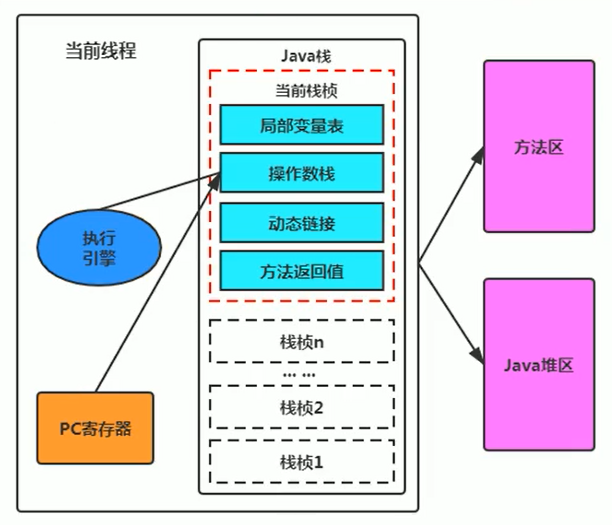
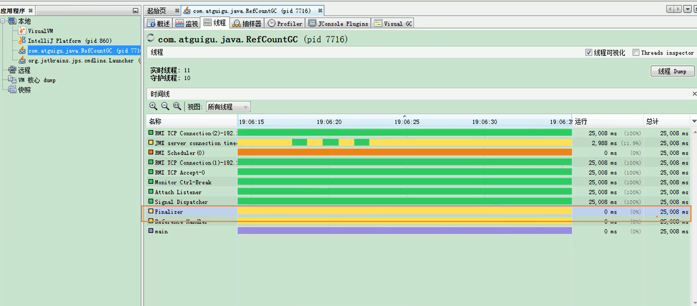
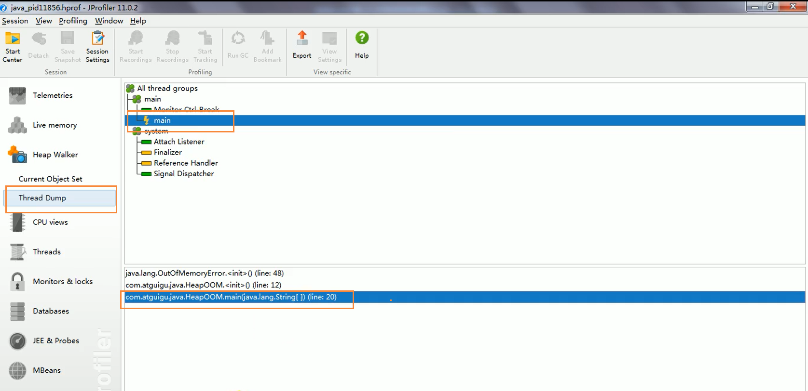
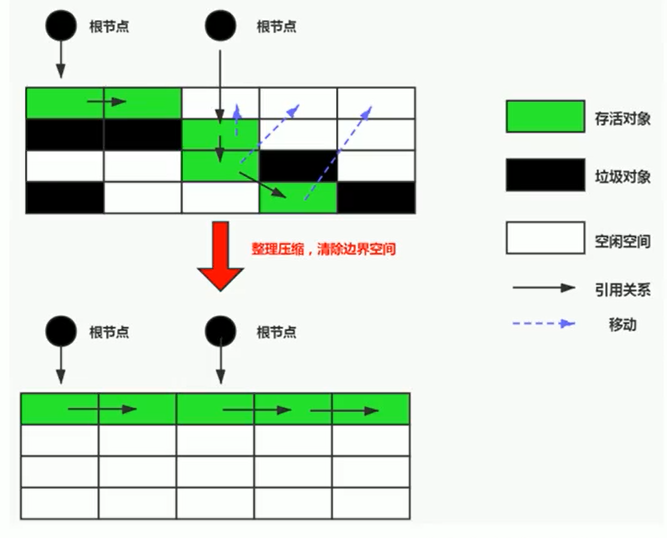
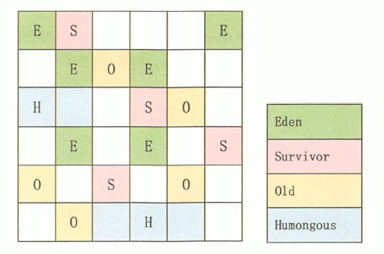
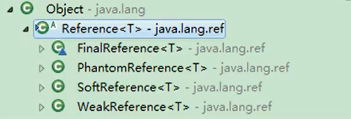
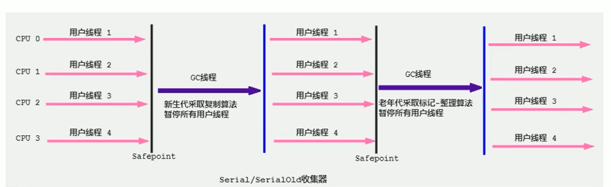
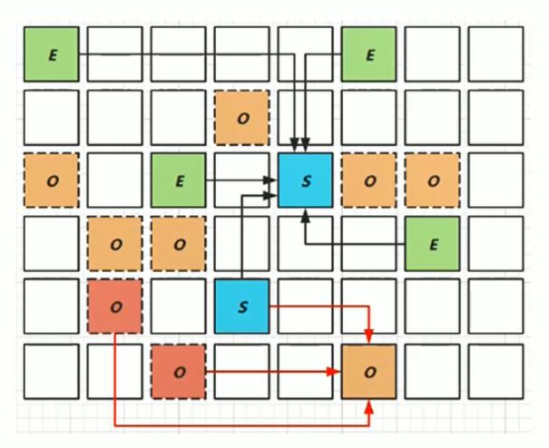
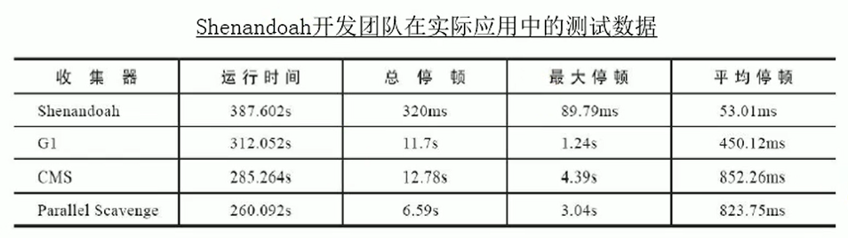
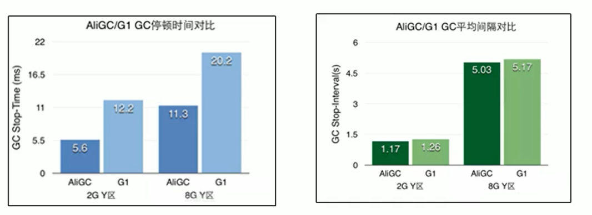

# 前言

参考代码
https://gitee.com/moxi159753/LearningNotes/tree/master/JVM/Code


java虚拟机参数

https://docs.oracle.com/javase/8/docs/technotes/tools/unix/java.html


# 1. JVM和Java体系结构


方法区的具体实现有永久代和元空间

JDK1-7（永久代）， JDK8 （元空间） 

反编译

javap -v Main.class


# 2. 类加载子系统

## 1. 加载

加载class文件的方式

1. 从本地系统中直接加载
2. 通过网络获取， 典型场景： Web Applet
3. 从zip压缩包中读取， 成为日后jar, war格式的基础
4. 运行时计算生成， 使用最多的是： 动态代理技术
5. 由其他文件生成， 典型场景：JSP应用
6. 从专有数据库中提取.class文件，比较少见
7. 从加密文件中获取， 典型的防class文件被反编译的保护措施


看.class文件的软件 Binary Viewer（IDEA也有插件： jclasslib Bytecode viewer）


## 2. 链接

1. 验证
    1. 包含文件格式验证，元数据验证，字节码验证，符号引用验证
2. 准备
    1. 赋值默认初始值， 基本类型，int赋值为0， bollean赋值为false
    2. 这里不包含final修饰的static, 因为final在编译的时候就会分配，准备阶段会显式初始化
3. 解析
    1. 将常量池内的符号引用转换为直接引用
    2. 事实上，解析操作往往会伴随JVM在执行初始化后再执行
    3. 符号引用就是一组符号，用来描述所引用的目标。符号引用的字面量形式明确定义在《java虚拟机规范》的Class文件格式中。 直接引用就是直接执行目标的指针，相对偏移量或一个间接定位到目标的句柄。
    4. 解析动作主要针对类或接口，字段，类方法，接口方法，方法类型等。对应常量池中的CONSTANT_Class_info、CONSTANT_Methodref_info、CONSTANT_Fieldref_info.


问题： 什么是符号引用，什么是直接引用？

```
符号引用和直接引用是Java虚拟机（JVM）在不同阶段使用的两种不同类型的引用。

符号引用是一种用来描述所引用的目标的符号名称，它与实际内存地址无关。例如，在Java程序中使用类名、方法名或字段名进行引用时，实际上是使用了符号引用。

而直接引用则是一个直接指向目标的内存地址或偏移量的引用，可以被直接使用。当Java程序运行时，JVM会将符号引用转换为直接引用。这个过程称为“解析”。

通过使用符号引用和直接引用，JVM可以使Java程序更加灵活和可移植。符号引用可以在编译时就确定，并且因为与实际内存地址无关，也可以在不同平台之间进行传输和共享。直接引用则可以在程序运行时快速地进行访问，提高程序的执行效率。s
```


## 3. 初始化

1. 初始化阶段就是执行类构造器方法\<clinit\>()的过程。
2. 此方法不需定义，是javac编译器自动收集类中的所有<u>**类变量的赋值动作**</u>和<u>**静态代码块**</u>中的语句合并起来的。
3. 构造器方法中指令按语句在源文件中出现的顺序执行。
4. **\<clinit\>()<u>不同于类的构造器</u>。**（关联：构造器是虚拟机视角下的\<init\>()）。
5. 若该类具有父类,JVM会保证子类\<clinit\>()执行前，父类的\<clinit\>()已经执行完毕。
6. 虚拟机必须保证一个类的\<clinit\>()方法在多线程下被同步加锁。（工作中遇到过！！！）
    1. 实际案例： https://www.cnblogs.com/myseries/p/12899428.html
    2. classloader在初始化一个类的时候，会对当前类加锁，加锁后，再执行类的静态初始化块。
        1. 线程1：类A对class A加锁，加锁后，执行类的静态初始化块（在堆栈里体现为\<clinit\>函数），发现用到了class B，于是去加载B；
        2. 线程2：类B对class B加锁，加锁后，执行类的静态初始化块（在堆栈里体现为\<clinit\>函数），发现用到了class A，于是去加载A；
        3. 死锁发生。因为 jvm 内部加了锁，所以jstack -l 不会显示死锁的发生
    3. **如何解决类加载出现的死锁问题？**
        1. 可以显式在主线程最开始用forName加载这些类的，这样类加载就变成在main线程中串行加载，问题得到解决
            1. Class.forName("com.**.**.A");
            2. Class.forName("com.**.**.B");

 

## 类加载器分类

启动类加载器、扩展类加载器、应用类加载器 

https://zhuanlan.zhihu.com/p/73359363

类的加载路径

```java
URL[] urls = sun.misc.Launcher.getBootstrapClassPath().getURLs();
for (URL url : urls) {
    System.out.println(url);
}

URL[] urls = ((URLClassLoader) ClassLoader.getSystemClassLoader().getParent()).getURLs();
for (URL url : urls) {
    System.out.println(url);
}

```


启动类加载器：

1. 这个类是C/C++实现的，嵌套在JVM内部
2. 加载核心类库
3. 并不是继承java.lang.ClassLoader， 没有父类加载器
4. 加载扩展类和应用类加载器，并指定为他们的父类加载器
5. 处于安全考虑，Bootstrap启动类加载器只加载包名为java, javax, sun等开头的类


扩展类加载器

​	1. 在jre/lib/ext下加载类库， 如果用户创建的jar放在扩展类加载器的加载路劲下， 也会自动由扩展类加载器加载


应用程序类加载器

	1. 它负责加载环境变量classpath或者系统属性java.class.path指定路径下的类库
	2. 该类加载器是程序中默认的类加载器


自定义类加载器

除了启动类加载器，其他都是自定义类加载器。 


为什么要自定义类加载器

1. 隔离加载类
    1. tomcat部署多个web应用时，就需要隔离。热部署卸载各自的类
2. 修改类加载的方式
3. 扩展加载源
4. 防止源码泄露


## 双亲委派机制

按个人理解: 就是类加载器收到加载请求的时候，它不是自己先去加载，而是向上委托给父级类加载器，这个过程直到启动类加载器。然后如果父级类加载器加载失败，则由子类加载器加载。如果所有的子类加载器都加载不成功，则抛出异常。


优点

1. 避免类的重复加载
2. 保证核心类库的安全（沙箱安全机制）

缺点

​	1. 顶层的 ClassLoader无法访问底层的ClassLoader所加载的类


## 其他

类加载器的引用（不太理解）

​	JVM必须知道一个类型是由启动类加载器加载的还是由用户类加载器加载的。如果一个类型是由用户类加载器加载的。那么JVM会**将这个类加载器的一个引用作为类型信息的一部分保存在方法区中**。当解析一个类型到另一个类型的引用的时候，JVM需要保证这两个类型的类加载器是相同的


Java程序对类的使用方式分为： **主动使用和被动使用**

1. 主动使用，又分为七种情况：
    1. 创建类的实例
    2. 访问某个类或接口的静态变量，或者对该静态变量赋值
    3. 调用类的静态方法
    4. 反射（比如Class.forName("org.example.Test)）
    5. 初始化一个类的子类
    6. Java虚拟机启动时被标明为启动类的类
    7. JDK7开始提供的动态语言支持： java.lang.invoke.MethodHandle实例的解析结果REF_getStatic, REF_putStatic, REF_invokeStatic句柄对应的类没有初始化，则初始化
2. 除了以上七种情况，其他使用Java类的方式都被看作是对类的被动使用，都不会导致类的初始化（调用\<clinit\>()方法）


# 3. 运行时数据区


线程独有：程序计数器，java虚拟机栈， 本地方法栈

线程共享：堆，堆外内存（方法区，代码缓存（JIT产生的））

 

一个JVM对应一个Runtime类


线程

在hotspot jvm里面， 每个线程都与操作系统的本地线程直接映射。

操作系统负责所有线程的安排调度到任何一个可用的cpu上，一旦本地线程初始化成功，它就会调用java线程中的run()方法


# 4. PC寄存器(程序计数器)

pc寄存器是逻辑意义上的寄存器，而不是物理意义上的，它是一块很小的内存空间。

pc寄存器用来存储指向下一条指令的地址，即将要执行的指令代码，由执行引擎读取下一条指令。

每个线程都有它自己的程序计数器，是线程私有的

任何时间一个线程都只有一个方法在执行，也就是所谓的当前方法。程序计数器会存储当前线程正在执行的Java方法的JVM指令地址；或者，如果实在执行native方法，则是未指定值（undefined）


# 5. 虚拟机栈

Java 的指令是根据栈来设计的，不同的平台CPU架构不同， 所以不能设计为基于寄存器的

**优点： 跨平台，指令集小，编译器容易实现**

**缺点： 性能下降，实现同样的功能需要更多的指令**


栈是运行时的单位，堆是存储时的单位 


Java虚拟机栈管理Java程序的运行，它保存方法的局部变量（8种基本数据类型，对象的引用地址），部分结果，并参与方法的调用和返回


## 常见异常

开发中遇到常见的异常？

StackOverflowError(递归没有处理好终止条件，就会出现的异常)

OutofMemoryError


我们可以使用参数-Xss选项来设置线程的最大栈空间，栈的大小直接决定函数调用的最大可达深度。

 默认线程的栈大小是1024kb,  设置栈内存大小` -Xss2048k`


## 栈中存储的是什么

栈中的数据都是以栈帧（Stack Frame）的格式存在

一个方法对应这一个栈帧，栈顶的方法就是当前方法。栈帧和方法是一一对应的关系 Debug调试的时候展示的就是Java虚拟机栈

栈帧是一个内存区块，是一个数据集，维系着方法执行过程中的各种数据信息

执行引擎运行的所有字节码指令只指针当前栈帧进行操作

如果在一个方法中调用了其他方法，对应的新的栈帧就会被创建出来，放在栈的顶端，成为新的当前帧。

当前方法结束后（return结束或者抛异常结束），栈顶的栈帧被丢弃。


## 栈帧的内部结构

1. **局部变量表**（8种基本数据类型，对象的引用地址）
2. **操作数栈（表达式栈）**
3. 动态链接 （指向**运行时常量池**的方法引用）（运行时常量池是方法区的东西）
4. 方法返回地址（方法正常退出或异常退出的定义）
5. 一些附加信息


### 局部变量表

局部变量表，又叫本地变量表，局部变量数组

定义一个数字数组，主要用于存储方法参数和定义在方法体内的局部变量。这些数据类型包含8中基本数据类型，对象引用，retrunAddress类型  

**局部变量表存储的基本单元是Slot(变量槽)**，32位以内的类型只占用一个slot(包括returnAddress类型，byte，short, char在存储前被转换为int) ，64位的类型（long和double）占用两个slot。

由于局部变量是线程独有的，故不存在数据安全问题

局部变量表所需的容量大小都是在编译期就确定下来的。并保存在方法的Code属性的maximum local variables数据项中（借助IDEA插件jclasslib bytecode viewer查看）。在方法运行期间是不会改变局部变量表的大小的。


### 操作数栈

操作数栈，<u>**主要用于保存计算过程的中间结果，同时作为计算过程中变量的临时存储空间**</u>

操作数栈就是**<u>JVM执行引擎的一个工作区</u>**，当一个方法刚开始执行的时候，一个新的栈帧也就会被创建出来。

每个操作数栈都会拥有一个明确的栈深度用于存储数值，其所需的最大深度在编译期就定义好了，保存在方法的Code属性中， 为max_stack的值。

栈中的任何一个元素都可以是任意的Java数据类型

- 32bit的类型占用一个栈单位深度
- 64bit的类型占用两个栈单位深度

操作数栈并非才用访问索引的方式来进行数据访问的，而是通过标准的入栈和出栈操作来完成一次数据访问


由于操作数是存储在内存中的，因此频发地执行内存读/写操作，必然会影响执行速度，为了解决这个问题，hotspot jvm的设计者们提出了栈顶缓存技术（Tos Top-of-Stack Cashing）技术，将栈顶元素全部缓存在物理CPU的寄存器中，以此降低对内存的读写次数，提升执行引擎的执行效率


### 动态链接

指向运行时常量池的方法引用

作用： 描述一个方法调用了另外的其他方法时，就是通过常量池中指向方法的符号引用来表示的。 动态链接的作用就是为了将这些符号引用转换为调用方法的直接引用


为什么需要常量池？

常量池的作用就是为了提供一些符号和常量，便于指令的识别


### 方法调用

**方法调用**

在jvm中，将符号引用转换为调用方法的直接引用与方法的绑定机制相关


**静态链接**

在一个字节码文件被装载JVM内部时，如果被调用的目标方法在编译期可知，且运行期保持不变时，这种情况下将调用方法的符号引用转换为直接引用的过程称之为静态链接。（早期绑定）


**动态链接**

如果被调用的方法在编译期无法被确定下来，也就是说，只能够在程序运行期将调用方法的符号引用转换为直接引用，由于这种引用的转换过程具备动态性，因为也就被称之为动态链接。（晚期绑定）


**非虚方法**

如果方法在编译期就确定了具体的调用版本，这个版本在运行时是不可变的。这样的方法称为非虚方法。

静态方法、私有方法、final方法、实例构造器、父类方法都是非虚方法（不涉及多态，即方法不能重写）

其他方法称为**虚方法**


**方法调用指令**

invokespecial（非虚方法）

invokestatic（非虚方法）

invokevirtual（虚方法）

invokeingerface（接口）

invokedynamic （lambda表达式）


Java中方法调用的底层实现原理是什么？（chatgpt）

```
Java中方法调用的底层实现原理涉及到Java虚拟机、字节码和Stack（栈）等多个方面。下面简单介绍一下具体的实现过程：

在Java程序中，方法调用会被编译成字节码指令，称为invokevirtual指令。

当虚拟机执行invokevirtual指令时，首先需要将当前方法的信息压入栈中，然后查找方法的符号引用，并把该方法的直接引用替换成一个可以直接执行的指针。

接着，虚拟机使用这个指针直接调用方法，并将方法返回值压入操作数栈中。

在方法调用时，若方法的实参有引用类型，则需要先创建对象并在堆上分配空间，在栈中保存对象的引用地址。如果是基本类型，则直接将值压入栈中。

当方法返回时，返回值被从栈中弹出并存储到指定位置。

总之，Java中方法调用的底层实现涉及到很多细节，包括字节码解析、符号引用查找、对象创建和内存管理等方面。Java虚拟机通过栈来维护方法调用的状态，并通过特定的指令序列来实现方法调用和返回。
```

我的理解就是jvm会调用invokevirtual指令


**虚方法表**

在面向对象的编程中，会很频繁的使用到动态分派，如果在每次动态分派的过程中都要重写在类的方法元数据中搜索合适的目标的话就可能影响到执行效率，因此，为了调高性能，JVM采用在类的方法区建立一个虚方法表来实现。

每个类中都有一个虚方法表，表中存放这各个方法的实际入口

那么虚方法表什么时候被创建？

需方发表在类加载的链接阶段被创建并开始初始化，类的变量初始值准备完成后，JVM会把该类的方法表也初始化完毕。


### 方法返回地址

存放调用该方法的pc寄存器的值  

无论通过哪种方式退出，在方法退出后都返回到该方法被调用的位置。

方法正常退出时，调用者的pc计数器的值作为返回地址，即调用该方法的指令的下一条指令的地址。

而通过异常退出的，返回地址是要通过异常表来确定，栈帧中一般不会保存这部分信息

  

### 一些附加信息

栈帧中还允许携带与Java虚拟机实现相关的一些附加信息。例如，**对程序调试提供支持的信息**


## 虚拟机栈的5道面试题

1. 举例栈溢出的情况？（Stack Overflow Error）
    1. 通过-Xss设置栈的大小； OOM
2. 调整栈大小，就能保证不出现溢出吗？
    1. 不能， 比如递归方法没有设置好结束条件
3. 分配的栈内存越大越好？
    1. 不是，会占用其他内存空间
4. 垃圾回收是否会涉及到虚拟机栈？
    1. 不会
5. 方法中定义的局部变量是否线程安全？
    1. 是的，因为是线程独有


# 6. 本地方法接口

就是Java调用非java代码的接口

其他语言也有类似的东西， 比如在C++中，你可以用extern "C" 告诉C++编译期去调用一个C的函数


# 7. 本地方法栈

Java虚拟机栈用于管理Java方法的调用，而本地方法栈用于管理本地方法的调用

native关键字 用来 登记本地方法

在hotspot jvm中，直接将本地方法栈和虚拟机合二为一。


# 8. 堆

## 1. 堆的核心概述

一个JVM实例进程只存在一个堆内存，堆也是Java内存管理的核心区域

Java堆区在JVM启动的时候即被床架，其空间大小也就确定了。是JVM管理的最大一块内存空间

堆内存的大小是可以调节的

堆可以处于物理上不连续的内存空间中，但在逻辑上它应该被视为连续的。

所有线程共享Java堆，在这里还可以划分线程私有的缓冲区（Thread Local Allocation Buffer, TLAB）


了解： C:\Program Files\Java\jdk1.8.0_311\bin有一个exe叫jvisualvm.exe

 

堆空间细分

1. 新生区
    1. Eden区
    2. Survivor区（大小只算其中一个区，因为同一时间只有一个区有数据）
        1. 0区
        2. 1区
2. 养老区
3. 元空间（永久区，Java8之后不属于堆空间，而是属于方法区）


## 2.  设置堆内存大小和OOM

设置最小和最大值范围

-Xms10M (等价于-XX:InitalHeapSize， 单位不区分大小写  )

-Xmx10M (等价于-XX:MaxHeapSize)


通常会将-Xms和-Xmx两个参数配置相同的值，其目的是为了能够在Java垃圾回收机制清理完**堆区后不需要重新分隔计算堆区的大小**，从而提搞性能（换句话说初始内存和最大内存一样，就减少了从初始内存到最大内存的扩容操作）

默认情况下,初始内存大小：物理内存大小/64, 最大内存大小：物理内存大小/4 


**查看内存使用情况**

jstat -gc [pid]

**打印垃圾回收细节**

-XX:+PrintGCDetails


 面试时会问到的JVM的常见参数有哪些？（chatgpt)

```
在Java虚拟机（JVM）中，有许多参数可用于优化性能和调试应用程序。以下是一些常见的JVM参数：
    -Xmx：设置最大堆内存大小。
    -Xms：设置初始堆内存大小。
    -Xss：设置线程的栈大小。
    -XX:MaxPermSize：设置最大永久代（Permanent Generation）大小。
    -XX:+UseConcMarkSweepGC：启用并发标记清除垃圾回收器。
    -XX:+UseParallelGC：启用并行垃圾回收器。
    -XX:+HeapDumpOnOutOfMemoryError：在内存溢出时生成堆转储文件。
    -XX:HeapDumpPath：指定堆转储文件的输出路径。
    -XX:+PrintGCDetails：打印详细的垃圾回收信息。
    -XX:+PrintGCDateStamps：打印垃圾回收时间戳。
    -verbose:gc：打印简要的垃圾回收信息。
这仅仅是其中的一些常见的JVM参数，实际上还有很多其他参数可以使用，具体取决于您的应用程序的需求和运行环境。
```


## 3. 年轻代和老年代

1. 年轻代
    1. Eden区
    2. Survivor区（大小只算其中一个区，因为同一时间只有一个区有数据）
        1. 0区， 也叫from区
        2. 1区， 也叫to区
2. 老年代


配置新生代与老年代在堆结构的占比

默认-XX:NewRatio=2, 表示 新生代占1，老年代占2，新生代占整个堆的1/3

可以修改-XX:NewRatio=4, 表示新生代占1，老年代占4， 新生代占整个堆的1/5


配置Eden空间和另外两个Survivor的空间占比

	默认比值是8:1:1

设置方法 -XX:SurvivorRatio=8

几乎所有的java对象都是在Eden区被new出来的， 绝大部分的Java对象的销毁都在新生代进行了


查看运行进程NewRatio比例

```shell
jnifo -flag NewRatio [pid]
jinfo -flag MaxHeapSize [pid]
```


查看运行进程gc

```shel
jstat -gc [pid]
```


具体实例（chatgpt）

```
假设我们要查看进程ID为1234的JVM的垃圾回收情况

打开终端或命令提示符窗口

输入以下命令：

jstat -gc 1234

其中，-gc表示要监视JVM的垃圾回收状况，而1234是要监视的进程ID。

按Enter键执行命令，即可查看JVM的垃圾回收统计信息，例如：

S0C       S1C      S0U    S1U     EC       EU        OC         OU       PC     PU YGC     YGCT    FGC    FGCT     GCT
98304.0 98304.0 22016.8  0.0 314880.0 238328.9 1048576.0   293225.1 262144.0 64399.3   83    3.400  14     1.505    4.905

上面的输出包括了多个各自代表特定含义的字段，其中：

S0C和S1C：表示两个Survivor区域大小（字节） (S1C是Survivor 1 Capacity的缩写)
S0U和S1U：表示两个Survivor区域已使用空间大小（字节）
EC和EU：表示Eden区域大小和已使用空间大小（字节）
OC和OU：表示老年代区域大小和已使用空间大小（字节）
PC和PU：表示持久代区域大小和已使用空间大小（字节）
YGC：表示Young GC的数量
YGCT：表示Young GC累计时间（秒）
FGC：表示Full GC的数量
FGCT：表示Full GC累计时间（秒）
GCT：表示垃圾回收累计时间（秒）
```


具体什么情况需要自定义jvm参数中NewRatio， SurvivorRatio的值？(chatgpt)

```
需要自定义JVM参数中NewRatio和SurvivorRatio的值的情况如下：

应用程序需要更大的堆内存：默认情况下，JVM会将堆内存划分为年轻代和老年代。如果应用程序需要更大的堆内存来处理大量数据或高并发请求，则可以通过增加NewRatio和SurvivorRatio参数的值来扩大年轻代和Survivor区域的大小，从而提高性能。

应用程序需要更短的停顿时间：新生代的回收通常是并行执行的，会在一定程度上影响应用程序的吞吐量。如果应用程序要求更短的停顿时间，并且有足够的可用内存，则可以通过减小NewRatio和SurvivorRatio参数的值来缩小年轻代和Survivor区域的大小，以便更快地完成垃圾回收。

应用程序具有不同的对象生命周期：某些应用程序对象的生命周期可能比其他对象更长或更短，这可能会导致堆内存使用不均衡。例如，如果应用程序中有很多短暂对象，则可以通过增加SurvivorRatio的值来放大Survivor区域的大小，并将这些对象保存在Survivor区域中。如果应用程序中有很多长寿命对象，则可以通过减小SurvivorRatio的值来缩小Survivor区域的大小，并将这些对象保存在老年代中。

需要注意的是，自定义NewRatio和SurvivorRatio的值会影响JVM的内存使用、垃圾回收行为以及吞吐量等方面。因此，在设置参数时，需要结合应用程序的实际情况进行调整，以达到最佳的性能和稳定性。
```


关闭自适应的内存分配策略

```shell
-XX:-UseAdaptiveSizePolicy   # “-”号表示关闭， “+”号表示开启
# 在使用时需要注意的是，并非所有的JVM参数都支持+和-前缀，具体需要根据参数的文档或手册来确定。
```


java jvm参数设置大全

https://docs.oracle.com/javase/8/docs/technotes/tools/unix/java.html

http://www.51gjie.com/java/551.html


## 4. 图解对象分配过程

啥时候能进养老区？ 可设置次数，默认是15次

-XX:MaxTenuringThreshold=threshold


为什么有两个幸存者区？ 

**因为需要整理碎片化内存**


chatgpt的回答

```
JVM有两个Survivor区的设计是为了提高垃圾回收效率。

在JVM中，年轻代分为Eden区和Survivor区。当对象被创建时，它们会被分配到Eden区进行初始化。如果这些对象还活着，会被移动到Survivor区域中。由于Survivor区域只能容纳一部分存活对象，因此需要将Survivor区域分成两个：Survivor 1和Survivor 2。当一个Survivor区域已满时，JVM会将其中的存活对象复制到另一个Survivor区域中。这个过程称为Minor GC。在复制过程中，Survivor区域空闲的空间可以用来保存新创建的对象，减少了额外的内存分配和垃圾回收开销。

总之，使用两个Survivor区域可以使JVM更高效地执行垃圾回收操作，并大大减少应用程序的停顿时间。
```


总结：

1. 针对幸存者s0,s1区的总结： 复制之后有交换，谁空谁是to
2. 关于垃圾回收： 频繁在新生区收集，很少在养老区收集，几乎不在永久区/元空间收集

伊甸园区满了， MinorGC会执行，会同时清理Eden和Survivor区
幸存者去满了，并不会触发MinorGC


常见的调优工具
1.  jdk命令行
	1. jmap
	2. jinfo
	3. jstat
	4. javap
2. Eclipse： Memory Analyzer Tool  (MAT)
3. jconsole
4. jprofiler
5. java filght recorder
6. gcviewer
7. gc easy


## 5. Minor GC、 Major GC 、Full GC

伊甸园区满了， MinorGC（完全等同于YoungGC）会执行，会同时清理Eden和Survivor区
养老区满了，MajorGC 会执行。
FullGC 收集整个方法区和java堆的垃圾回收

针对HotSpot VM的实现，它里面的GC按照回收区域又分为两大种类型： 一种是部分收集（Partial GC）, 一种是整堆收集（Full GC）
1. 部分收集
	1. Minor GC/ Young GC 只是新生代（Eden,s0,s1）的垃圾收集
	2. Major GC/ Old GC 只是老年代的垃圾收集， 速度比MinorGC慢10倍以上
		1. 目前只有CMS GC会单独收集老年代的行为
		2. 注意很多时候MajorGC和FullGC混淆使用，需要具体分辨是老年代回收还是整堆回收。
	3. 混合收集（Mixed GC）收集整个新生代以及部分老年代的垃圾收集。
		1. 目前，只有G1 GC会有这种行为
2. 整堆收集（Full GC）收集整个Java堆和方法区的垃圾。

GC线程运行的时候，用户线程会受到干预从而停止运行，需要等GC线程收集回收完才进行重新开始运行，整个过程称之为STW(stop the work)

**触发FullGC的五种情况**

1. 调用System.gc(),系统建议执行FullGC,但不是必然执行
2. 老年代空间不足
3. 方法区空间不足
4. 通过MinorGC进入老年代的平均大小大于老年代的可用内存
5. 由Eden区，survivor (from区)向（to区）复制时，对象大小大于to区可用内存，则把该对象转到老年代，且老年代的可用内存小于该对象大小

**说明**
full gc是开发或调优中尽量要避免的，这样暂停时间会短一些


## 6. 堆空间分代思想

为什么要把java堆分代？不分代就不能正常工作吗？
其实不分代完全可以，分代的唯一理由就是**优化GC性能**。如果没有分代，那所有对象都在一起。分析无用对象的时候就会进行全区域扫描，全区域扫描占用的时间会更长。如果是分代回收，就能减少不必要的扫描。从而达到优化GC性能的目的

（优化扫描时间，减少大对象，老对象的扫描）


## 7. 内存分配策略


内存分配策略又叫对象提升（Promotion）规则


晋升老年代的年龄阈值 可以用过选项 -XX:MaxTenuringThreshold=threshold 来设置】


针对不同年龄段的对象分配原则如下所示：
1. 优先分配到Eden
2. 大对象直接分配到老年代
	1. 尽量避免程序中出现过多的大对象（最好大对象的存活时间长!）
3. 长期存活的对象分配到老年代
4. 动态对象年龄判断
	1. 如果Survivor区中相同年龄的所有对象大小的总和大于Survivor空间的一半，年龄大于或等于该年龄的对象可以直接进入老年代，无须等到MaxTenuringThreshold中要求的年龄
5. 空间分配担保(survivor区无法容纳的对象放在老年代)
	1. -XX:handlePromotionFailure


如何优化GC （参考https://blog.csdn.net/dl674756321/article/details/108130050）

```
1.尽量不要创建过大的对象或数组。
2.通过虚拟机的 -Xmn 参数适当调大新生代的大小，让对象尽量在新生代中被回收掉。
3.通过 -XX:MaxTenuringThreshold 参数调大对象进入老年代的年龄，让对象尽量在新生代中被回收掉。
```


## 8. 为对象分配内存 TLAB

TLAB是 JVM 为每个线程分配了一个私有缓存区域，它包含在 Eden 空间内

ThreadLocalAllocationBuffer
TLAB是为了解决多线程分配内存时可能存在冲突的问题


为什么有TLAB？ 
因为堆区是线程共享的，并发情况下线程不安全，如果要达到线程安全的目的就需要加锁，加锁就会影响程序执行效率


从内存模型而不是垃圾收集的角度，对Eden区域继续进行划分，JVM为每个线程分配了一个私有缓存区域，它包含在Eden空间内。
多线程同时分配内存时，使用TLAB可以避免一系列的非线程安全问题
同时还能够提升内存分配的吞吐量，因此我们可以将这种内存分配方法称为快速分配策略。

默认情况下，TLAB空间的内存非常小，仅占有整个Eden空间的1%，
通过选项“-XX: TLABWasteTargetPercent”设置TLAB空间所占用Eden空间的百分比大小。

可以jinfo -flag UseTLAB [PID] 查看是否开启TLAB 

（也可通过命令查看java -XX:+PrintFlagsInitial -version | grep UseTLAB， 默认是开启的，）

在程序中，开发人员可以通过选项“-Xx:UseTLAB”设置是否开启TLAB空间。


> TLAB分配过程
对象首先是通过TLAB开辟空间，如果不能放入，那么需要通过加锁的方式直接在Eden区进行分配

## 9. 小结堆空间的参数配置

-   -XX：+PrintFlagsInitial：查看所有的参数的默认初始值
    -   例如执行java -XX:+PrintFlagsInitial -version 命令
-   -XX：+PrintFlagsFinal：查看所有的参数的最终值（可能会存在修改，不再是初始值）
-   -Xms：初始堆空间内存（默认为物理内存的1/64）
-   -Xmx：最大堆空间内存（默认为物理内存的1/4）
-   -Xmn：设置新生代的大小。（初始值及最大值）（NewRatio会失效）
-   -XX:NewRatio：配置新生代与老年代在堆结构的占比
-   -XX:SurvivorRatio：设置新生代中Eden和S0/S1空间的比例
-   -XX:MaxTenuringThreshold：设置新生代垃圾的最大年龄
-   -XX：+PrintGCDetails：输出详细的GC处理日志
    -   打印gc简要信息：①-XX：+PrintGC ② - verbose:gc
-   -XX:HandlePromotionFalilure：是否设置空间分配担保

在发生Minor GC之前，虚拟机会检查老年代最大可用的连续空间是否大于新生代所有对象的总空间。

-   如果大于，则此次Minor GC是安全的
-   如果小于，则虚拟机会查看-xx:HandlePromotionFailure设置值是否允担保失败。
    -   如果HandlePromotionFailure=true，那么会继续检查老年代最大可用连续空间是否大于历次晋升到老年代的对象的平均大小。
    -   如果大于，则尝试进行一次Minor GC，但这次Minor GC依然是有风险的；
    -   如果小于，则改为进行一次FullGC。
    -   如果HandlePromotionFailure=false，则改为进行一次Ful1 Gc。

在JDK6 Update24之后，HandlePromotionFailure参数不会再影响到虚拟机的空间分配担保策略，观察openJDK中的源码变化，虽然源码中还定义了HandlePromotionFailure参数，但是在代码中已经不会再使用它。**JDK6 Update 24之后的规则变为只要老年代的连续空间大于新生代对象总大小或者历次晋升的平均大小就会进行Minor GC，否则将进行FullGC。**


## 10. 堆是分配对象的唯一选择吗？
随着JIT的发展，逃逸分析技术逐渐成熟。 带来了栈上分配，标量替换等优化技术
经过逃逸分析后发现，一个对象并没有逃逸出方法的话，那么就会被优化升栈上分配。这样就无须在堆上分配内存，也无须进行垃圾回收。这也是最常见的对外存储技术

TaoBaoVM 创新了GCIH技术实现了off-heap，将生命周期较长的Java对象从heap中移至heap外，从而达到降低GC的回收频率。


### 逃逸分析？（Escape Analysis）
逃逸分析是为了优化 JVM 内存和提升程序性能的设计。

如果快速判断是否发生了逃逸分析，就看new的对象是否有可能在方法外被调用


### 什么是逃逸分析？

关于 Java 逃逸分析的定义：

逃逸分析（Escape Analysis）简单来讲就是，Java Hotspot 虚拟机可以分析新创建对象的使用范围，并决定是否在 Java 堆上分配内存的一项技术。

逃逸分析的 JVM 参数如下：

-   开启逃逸分析：-XX:+DoEscapeAnalysis
-   关闭逃逸分析：-XX:-DoEscapeAnalysis
-   显示分析结果：-XX:+PrintEscapeAnalysis

逃逸分析技术在 Java SE 6u23+ 开始支持，并默认设置为**启用状态**，可以不用额外加这个参数。


### 对象逃逸状态

1、全局逃逸（GlobalEscape）

即一个对象的作用范围逃出了当前方法或者当前线程，有以下几种场景：

-   对象是一个静态变量
-   对象是一个已经发生逃逸的对象
-   对象作为当前方法的返回值

2、参数逃逸（ArgEscape）

即一个对象被作为方法参数传递或者被参数引用，但在调用过程中不会发生全局逃逸，这个状态是通过被调方法的字节码确定的。

3、没有逃逸

即方法中的对象没有发生逃逸。


### 逃逸分析优化

针对上面第三点，当一个对象没有逃逸时，可以得到以下几个虚拟机的优化。

#### 1) （同步省略）锁消除
我们知道线程同步锁是非常牺牲性能的，当编译器确定当前对象只有当前线程使用，那么就会移除该对象的同步锁。（如果一个对象被发现只能从一个线程被访问到，那么对于这个对象的操作可以不考虑同步）
例如，StringBuffer 和 Vector 都是用 synchronized 修饰线程安全的，但大部分情况下，它们都只是在当前线程中用到，这样编译器就会优化移除掉这些锁操作。

换句话理解：
线程同步的代价是相当高的，同步的后果是降低并发性和性能。
在动态编译同步块的时候，JIT编译器可以借助逃逸分析来判断同步块所使用的锁对象是否只能够被一个线程访问而没有被发布到其他线程。如果没有，那么JIT编译器在编译这个同步块的时候就会取消对这部分代码的同步。这样就能大大提高并发性和性能。这个取消同步的过程就叫同步省略，也叫锁消除。

锁消除的 JVM 参数如下：
-   开启锁消除：-XX:+EliminateLocks
-   关闭锁消除：-XX:-EliminateLocks
锁消除在 JDK8 中都是默认开启的，并且锁消除都要建立在逃逸分析的基础上。


#### 2) 标量替换(分离对象)
首先要明白标量和聚合量，基础类型和对象的引用可以理解为标量，它们不能被进一步分解。而能被进一步分解的量就是聚合量，比如：对象。
对象是聚合量，它又可以被进一步分解成标量，将其成员变量分解为分散的变量，这就叫做标量替换。
这样，如果一个对象没有发生逃逸，那压根就不用创建它，只会在栈或者寄存器上创建它用到的成员标量，节省了内存空间，也提升了应用程序性能。

标量替换的 JVM 参数如下
-   开启标量替换：-XX:+EliminateAllocations
-   关闭标量替换：-XX:-EliminateAllocations
-   显示标量替换详情：-XX:+PrintEliminateAllocations
标量替换同样在 JDK8 中都是默认开启的，并且都要建立在逃逸分析的基础上。

总结就是： 把对象肢解成多个基本类型

深入理解JVM中P418页，标量替换可以视为栈上分配的一种特例


#### 3) 栈上分配
当对象没有发生逃逸时，该对象就可以通过标量替换分解成成员标量分配在栈内存中，和方法的生命周期一致，随着栈帧出栈时销毁，减少了 GC 压力，提高了应用程序性能。


我们知道这点后，在平时开发过程中就要可尽可能的控制变量的作用范围了，变量范围越小越好，让虚拟机尽可能有优化的空间。


#### 结论

开发中能使用局部变量的，就不要使用在方法外定义。
使用逃逸分析，编译器可以对代码做如下优化：

-   栈上分配：将堆分配转化为栈分配。如果一个对象在子程序中被分配，要使指向该对象的指针永远不会发生逃逸，对象可能是栈上分配的候选，而不是堆上分配
-   同步省略：如果一个对象被发现只有一个线程被访问到，那么对于这个对象的操作可以不考虑同步。
-   分离对象或标量替换：有的对象可能不需要作为一个连续的内存结构存在也可以被访问到，那么对象的部分（或全部）可以不存储在内存，而是存储在CPU寄存器中。


chatgpt说的栈上分配和标量替换

```
栈上分配和标量替换是一些JVM的编译器优化技术，可提高程序的性能和减少内存分配和垃圾回收的开销。

1. 栈上分配
栈上分配指的是将对象分配在线程调用栈中，而不是在堆中。由于栈上分配的对象生命周期与方法调用的生命周期相同，因此它们不需要进行垃圾回收，从而减少了内存分配和释放的时间开销。栈上分配通常在以下情况下适用：

	- 对象很小，生命周期短暂；
	- 对象被频繁创建和销毁；
	- 临时对象无需跨越线程访问。

2. 标量替换
标量替换指的是将一个对象拆分成多个独立的成员变量，并将这些成员变量分别分配在栈或寄存器中，以提高访问效率。例如，一个对象包含两个整型成员变量x和y，可以将其分解为两个独立的整型变量分别分配在栈或寄存器中。标量替换通常在以下情况下适用：
	- 对象的成员变量都是基本类型或枚举类型；
	- 对象的成员变量不会被其他方法修改；
	- 对象的成员变量不会被其他线程访问。
	
需要注意的是，栈上分配和标量替换都是一些JVM编译器优化技术，并不是所有JVM都支持这两种技术。此外，在进行优化时需要权衡其优劣，以确定是否进行优化，并避免过度优化导致程序出现问题。
```


### 逃逸分析的不足

关于逃逸分析的论文在1999年就已经发表了，但直到JDK1.6才有实现，而且这项技术到如今也并不是十分成熟。

其根本原因就是无法保证逃逸分析的性能消耗一定能高于他的消耗。虽然经过逃逸分析可以做标量替换、栈上分配、和锁消除。但是逃逸分析自身也是需要进行一系列复杂的分析的，这其实也是一个相对耗时的过程。 一个极端的例子，就是经过逃逸分析之后，发现没有一个对象是不逃逸的。那这个逃逸分析的过程就白白浪费掉了。

虽然这项技术并不十分成熟，但是它也是即时编译器优化技术中一个十分重要的手段。注意到有一些观点，认为通过逃逸分析，JVM会在栈上分配那些不会逃逸的对象，这在理论上是可行的，但是取决于JvM设计者的选择。据我所知，oracle Hotspot JVM中并未这么做，这一点在逃逸分析相关的文档里已经说明，所以可以明确所有的对象实例都是创建在堆上。

目前很多书籍还是基于JDK7以前的版本，JDK已经发生了很大变化，intern字符串的缓存和静态变量曾经都被分配在永久代上，而永久代已经被元数据区取代。但是，intern字符串缓存和静态变量并不是被转移到元数据区，而是直接在堆上分配，所以这一点同样符合前面一点的结论：对象实例都是分配在堆上。


# 9. 方法区

## 1. 栈，堆， 方法区的交互关系

Person person = new Person();

Person.class在方法区

new Person()在堆区

person 引用在栈区


## 2. 方法区的理解

《Java虚拟机规范》中明确说明：“尽管所有的方法区在逻辑上是属于堆的一部分，但一些简单的实现可能不会选择去进行垃圾收集或者进行压缩。”但对于HotSpotJVM而言，方法区还有一个别名叫做Non-Heap（非堆），目的就是要和堆分开。

所以，方法区看作是一块独立于Java堆的内存空间。


方法区主要存放的是 Class，而堆中主要存放的是 实例化的对象

- 方法区（Method Area）与Java堆一样，是各个线程共享的内存区域。
- 方法区在JVM启动的时候被创建，并且它的实际的物理内存空间中和Java堆区一样都可以是不连续的。
- 方法区的大小，跟堆空间一样，可以选择固定大小或者可扩展。
- 方法区的大小决定了系统可以保存多少个类，如果系统定义了太多的类，导致方法区溢出，虚拟机同样会抛出内存溢出错误：ava.lang.OutofMemoryError：PermGen space 或者java.lang.OutOfMemoryError:Metaspace
    - 加载大量的第三方的jar包
    - Tomcat部署的工程过多（30~50个）
    - 大量动态的生成反射类
- 关闭JVM就会释放这个区域的内存。


运行时常量池一直在方法区中

jdk8之后字符串常量池在堆里面， jdk8之前方法区里面


**Hotspot中方法区的演进**

到了JDK8，终于完全废弃了永久代的概念，改用与JRockit、J9一样在本地内存中实现的元空间（Metaspace）来代替

元空间的本质和永久代类似，都是对JVM规范中方法区的实现。不过元空间与永久代最大的区别在于：元空间不在虚拟机设置的内存中，而是使用本地内存

永久代、元空间二者并不只是名字变了，内部结构也调整了

根据《Java虚拟机规范》的规定，如果方法区无法满足新的内存分配需求时，将抛出OOM异常


## 3. 设置方法区大小和OOM

方法区的大小不必是固定的，JVM可以根据应用的需要动态调整。

### jdk7及以前

- 通过-xx:Permsize来设置永久代初始分配空间。默认值是20.75M
- -XX:MaxPermsize来设定永久代最大可分配空间。32位机器默认是64M，64位机器模式是82M
- 当JVM加载的类信息容量超过了这个值，会报异常OutofMemoryError:PermGen space。

```shell
jinfo -flag PermSize [pid]
jinfo -flag MaxPermSize [pid]
jps
jinfo -flag MetaspaceSize [pid]
```


### JDK8以后

元数据区大小可以使用参数 -XX:MetaspaceSize 和 -XX:MaxMetaspaceSize指定
默认值依赖于平台。windows下，-XX:MetaspaceSize是21M，-XX:MaxMetaspaceSize的值是-1，即没有限制。
与永久代不同，如果不指定大小，默认情况下，虚拟机会耗尽所有的可用系统内存。如果元数据区发生溢出，虚拟机一样会抛出异常OutOfMemoryError:Metaspace
-XX:MetaspaceSize：设置初始的元空间大小。对于一个64位的服务器端JVM来说，其默认的-xx:MetaspaceSize值为21MB。这就是初始的高水位线，一旦触及这个水位线，Ful1GC将会被触发并卸载没用的类（即这些类对应的类加载器不再存活）然后这个高水位线将会重置。新的高水位线的值取决于GC后释放了多少元空间。**如果释放的空间不足，那么在不超过MaxMetaspaceSize时，适当提高该值。如果释放空间过多，则适当降低该值。**


###  如何解决这些OOM

- 要解决OOM异常或heap space的异常，一般的手段是首先通过内存映像分析工具（如Ec1ipse Memory Analyzer）对dump出来的堆转储快照进行分析，重点是确认内存中的对象是否是必要的，也就是要先分清楚到底是出现了内存泄漏（Memory Leak）还是内存溢出（Memory Overflow）
    - 内存泄漏就是 有大量的引用指向某些对象，但是这些对象以后不会使用了，但是因为它们还和GC ROOT有关联，所以导致以后这些对象也不会被回收，这就是内存泄漏的问题
        - IO没有close
        - ThreadLocal没处理好也容易出现
- 如果是内存泄漏，可进一步通过工具查看泄漏对象到GC Roots的引用链。于是就能找到泄漏对象是通过怎样的路径与GCRoots相关联并导致垃圾收集器无法自动回收它们的。掌握了泄漏对象的类型信息，以及GCRoots引用链的信息，就可以比较准确地定位出泄漏代码的位置。
- 如果不存在内存泄漏，换句话说就是内存中的对象确实都还必须存活着，那就应当检查虚拟机的堆参数（-Xmx与-Xms），与机器物理内存对比看是否还可以调大，从代码上检查是否存在某些对象生命周期过长、持有状态时间过长的情况，尝试减少程序运行期的内存消耗。


## 4. 方法区的内部结构

《深入理解Java虚拟机》书中对方法区（Method Area）存储内容描述如下：它用于存储已被虚拟机加载的<u>类型信息、常量（运行时常量池）、静态变量、即时编译器编译后的代码缓存（JIT代码缓存）、域信息、方法信息</u>等。域信息、方法信息算是类型信息


###  类型信息

对每个加载的类型（类class、接口interface、枚举enum、注解annotation），JVm必须在方法区中存储以下类型信息：

- 这个类型的完整有效名称（全名=包名.类名）
- 这个类型直接父类的完整有效名（对于interface或是java.lang.object，都没有父类）
- 这个类型的修饰符（public，abstract，final的某个子集）
- 这个类型直接接口的一个有序列表
- 

###  域（Field）信息

JVM必须在方法区中保存类型的所有域的相关信息以及域的声明顺序。

域的相关信息包括：域名称、域类型、域修饰符（public，private，protected，static，final，volatile，transient的某个子集）


###  方法（Method）信息

JVM必须保存所有方法的以下信息，同域信息一样包括声明顺序：

- 方法名称
- 方法的返回类型（或void）
- 方法参数的数量和类型（按顺序）
- 方法的修饰符（public，private，protected，static，final，synchronized，native，abstract的一个子集）
- 方法的字节码（bytecodes）、操作数栈、局部变量表及大小（abstract和native方法除外）
- 异常表（abstract和native方法除外）

> 每个异常处理的开始位置、结束位置、代码处理在程序计数器中的偏移地址、被捕获的异常类的常量池索引


###  non-final的类变量

静态变量和类关联在一起，随着类的加载而加载，他们成为类数据在逻辑上的一部分

类变量被类的所有实例共享，即使没有类实例时，你也可以访问它

​     

###  全局常量

全局常量就是使用 static final 进行修饰

被声明为final的类变量的处理方法则不同，每个全局常量在编译的时候就会被分配了。


### 常量池

一个有效的字节码文件中除了包含类的版本信息、字段、方法以及接口等描述符信息外，还包含一项信息就是常量池表（Constant Pool Table），包括各种 <u>**字面量**</u> 和对类型、域和方法的 <u>**符号引用**</u> 

常量池存储的数据类型包括

1. 数量值
2. 字符串值
3. 类引用
4. 字段引用
5. 方法引用 

**小结**

常量池、可以看做是一张表，虚拟机指令根据这张常量表找到要执行的类名、方法名、参数类型、字面量等类型


### 运行时常量池

运行时常量池是方法区的一部分

常量池表（Constant Pool Table）是Class文件的一部分，用于存放编译期生成的各种字面量与符号引用，这部分内容将在类加载后存放到方法区的运行时常量池中。

运行时常量池，在加载类和接口到虚拟机后，就会创建对应的运行时常量池。

JVM为每个已加载的类型（类或接口）都维护一个常量池。池中的数据项像数组项一样，**<u>是通过索引访问的。</u>**

运行时常量池中包含多种不同的常量，包括编译期就已经明确的数值字面量，也包括到运行期解析后才能够获得的方法或者字段引用。此时不再是常量池中的符号地址了，这里换为真实地址。

运行时常量池，相对于Class文件常量池的另一重要特征是：**<u>具备动态性。</u>**

运行时常量池类似于传统编程语言中的符号表（symboltable），但是它所包含的数据却比符号表要更加丰富一些。

当创建类或接口的运行时常量池时，如果构造运行时常量池所需的内存空间超 过了方法区所能提供的最大值，则JVM会抛outofMemoryError异常。


问：运行时常量池 存放的是什么？

```
运行时常量池是一种特殊的数据结构，用于存储类或接口中被编译器编译后生成的字面量和符号引用。简单来说，运行时常量池存储了Java程序在运行期间需要使用的各种常量值和符号引用。

具体来说，运行时常量池中存放的内容包括：

字面量（即文本字符串、整型数值、浮点数值、字符等）。
符号引用（即类和接口的全限定名、字段名称和描述符、方法名称和描述符等）。
常量表达式的值（即可以在编译时确定的数值和字符串）。
类和接口的方法和字段等信息。
需要注意的是，虽然运行时常量池和 Java 堆都是 JVM 运行时数据区域的组成部分，但是它们的作用和存储内容是不同的。Java 堆主要用于存储对象实例和数组，而运行时常量池则主要用于存储常量值和符号引用等信息。
```


## 5. 方法区使用举例

```java
public class MethodAreaDemo {
    public static void main(String args[]) {
        int x = 500;
        int y = 100;
        int a = x / y;
        int b = 50;
        System.out.println(a+b);
    }
}
```

字节码执行过程展示


首先现将操作数500放入到操作数栈中


然后存储到局部变量表中


然后重复一次，把100放入局部变量表中，最后再将变量表中的500 和 100 取出，进行操作


将500 和 100 进行一个除法运算，在把结果入栈


在最后就是输出流，需要调用运行时常量池的常量


最后调用invokevirtual（虚方法调用），然后返回


返回时


程序计数器始终计算的都是当前代码运行的位置，目的是为了方便记录 方法调用后能够正常返回，或者是进行了CPU切换后，也能回来到原来的代码进行执行。


## 6. 方法区的演进细节

jdk6-7-8

首先明确：只有Hotspot才有永久代。BEA JRockit、IBMJ9等来说，是不存在永久代的概念的。原则上如何实现方法区属于虚拟机实现细节，不受《Java虚拟机规范》管束，并不要求统一

Hotspot中方法区的变化：

| JDK1.6及以前 | 有永久代，静态变量存储在永久代上                             |
| ------------ | ------------------------------------------------------------ |
| JDK1.7       | 有永久代，但已经逐步 “去永久代”，字符串常量池，静态变量移除，保存在堆中 |
| JDK1.8       | 无永久代，类型信息，字段，方法，常量保存在本地内存的元空间，但**字符串常量池、静态变量**仍然在**堆**中。 |


JDK6的时候


JDK7的时候


JDK8的时候，元空间大小只受物理内存影响


 

###  为什么永久代要被元空间替代？

JRockit是和HotSpot融合后的结果，因为JRockit没有永久代，所以他们不需要配置永久代

随着Java8的到来，HotSpot VM中再也见不到永久代了。但是这并不意味着类的元数据信息也消失了。这些数据被移到了一个与堆不相连的本地内存区域，这个区域叫做元空间（Metaspace）。

由于类的元数据分配在本地内存中，元空间的最大可分配空间就是系统可用内存空间，这项改动是很有必要的，原因有：

- 为永久代设置空间大小是很难确定的。

在某些场景下，如果动态加载类过多，容易产生Perm区的oom。比如某个实际Web工 程中，因为功能点比较多，在运行过程中，要不断动态加载很多类，经常出现致命错误。

“Exception in thread‘dubbo client x.x connector'java.lang.OutOfMemoryError:PermGen space”

而元空间和永久代之间最大的区别在于：元空间并不在虚拟机中，而是使用本地内存。 因此，默认情况下，元空间的大小仅受本地内存限制。

- 对永久代进行调优是很困难的。
    - 主要是为了降低Full GC

有些人认为方法区（如HotSpot虚拟机中的元空间或者永久代）是没有垃圾收集行为的，其实不然。《Java虚拟机规范》对方法区的约束是非常宽松的，提到过可以不要求虚拟机在方法区中实现垃圾收集。事实上也确实有未实现或未能完整实现方法区类型卸载的收集器存在（如JDK11时期的ZGC收集器就不支持类卸载）。 一般来说这个区域的回收效果比较难令人满意，尤其是类型的卸载，条件相当苛刻。但是这部分区域的回收有时又确实是必要的。以前sun公司的Bug列表中，曾出现过的若干个严重的Bug就是由于低版本的HotSpot虚拟机对此区域未完全回收而导致内存泄漏

方法区的垃圾收集主要回收两部分内容：常量池中废弃的常量和不在使用的类型

###  StringTable为什么要调整位置

jdk7中将StringTable放到了堆空间中。**因为永久代的回收效率很低，在full gc的时候才会触发。**而fullgc是老年代的空间不足、永久代不足时才会触发。

这就导致stringTable回收效率不高。而我们开发中会有大量的字符串被创建，回收效率低，导致永久代内存不足。放到堆里，能及时回收内存。

###  静态变量存放在那里？

静态引用对应的对象实体始终都存在堆空间

可以使用 jhsdb.ext，需要在jdk9的时候才引入的

staticobj随着Test的类型信息存放在方法区，instanceobj随着Test的对象实例存放在Java堆，localobject则是存放在foo（）方法栈帧的局部变量表中。


## 7. 方法区的垃圾回收

有些人认为方法区（如Hotspot虚拟机中的元空间或者永久代）是没有垃圾收集行为的，其实不然。《Java虚拟机规范》对方法区的约束是非常宽松的，提到过可以不要求虚拟机在方法区中实现垃圾收集。事实上也确实有未实现或未能完整实现方法区类型卸载的收集器存在（如JDK11时期的zGC收集器就不支持类卸载）。

一般来说这个区域的回收效果比较难令人满意，尤其是类型的卸载，条件相当苛刻。但是这部分区域的回收有时又确实是必要的。以前sun公司的Bug列表中，曾出现过的若干个严重的Bug就是由于低版本的HotSpot虚拟机对此区域未完全回收而导致内存泄漏。

**方法区的垃圾收集主要回收两部分内容：常量池中废弃的常量和不再使用的类型。**

先来说说方法区内常量池之中主要存放的两大类常量：**字面量和符号引用**。字面量比较接近Java语言层次的常量概念，如文本字符串、被声明为final的常量值等。而符号引用则属于编译原理方面的概念，包括下面三类常量：

- 类和接口的全限定名
- 字段的名称和描述符
- 方法的名称和描述符

HotSpot虚拟机对常量池的回收策略是很明确的，只要常量池中的常量没有被任何地方引用，就可以被回收。

回收废弃常量与回收Java堆中的对象非常类似。（关于常量的回收比较简单，重点是类的回收）


判定一个常量是否“废弃”还是相对简单，而要判定一个类型是否属于“不再被使用的类”的条件就比较苛刻了。需要同时满足下面三个条件：

- 该类所有的实例都已经被回收，也就是Java堆中不存在该类及其任何派生子类的实例。 
- 加载该类的类加载器已经被回收，这个条件除非是经过精心设计的可替换类加载器的场景，如OSGi、JSP的重加载等，否则通常是很难达成的。
- 该类对应的java.lang.Class对象没有在任何地方被引用，无法在任何地方通过反射访问该类的方法。


Java虚拟机被允许对满足上述三个条件的无用类进行回收，这里说的仅仅是“被允许”，而并不是和对象一样，没有引用了就必然会回收。关于是否要对类型进行回收，HotSpot虚拟机提供了-Xnoclassgc参数进行控制，还可以使用-verbose:class 以及 -XX：+TraceClass-Loading、-XX：+TraceClassUnLoading查看类加载和卸载信息

在大量使用反射、动态代理、CGLib等字节码框架，动态生成JSP以及oSGi这类频繁自定义类加载器的场景中，通常都需要Java虚拟机具备类型卸载的能力，以保证不会对方法区造成过大的内存压力。


## 8. 总结


## 9.元空间和方法区却别

问： 元空间是存储类的元数据， 方法区也是存储类的元数据？所以元空间就是方法区？

```
元空间和方法区是存储类的元数据的两个不同的概念，虽然它们起到的作用相似，但是它们在实现机制和物理位置上存在差异。

在Java 8及之后的版本中，JVM将类的元数据从方法区（或称为永久代）移到了元空间。元空间是直接在本机内存中分配的，而方法区是堆内存的一部分。虽然它们都存储了类的元数据信息，但元空间和方法区在物理内存位置、内存管理方式和特点上都是不同的。

因此，元空间和方法区是不同的概念，不应该混淆使用。
```


问：那java8之后方法区存的是什么东西？

```
在Java 8之后，方法区仍然存储类的元数据信息，包括类的类型信息、字段和方法信息、运行时常量池和静态变量等。但是，与以前的版本不同的是，Java 8中将类的元数据从方法区移动到了元空间。

因此，在Java 8及之后的版本中，方法区仍然存在，并且仍然用于存储类的元数据信息，但它的作用有所不同。现在，方法区主要用于存储少量的、动态生成的类元数据（例如反射生成的类），以及一些低级别的JVM实现细节等信息。同时，由于元空间的出现，方法区的大小也相应减小，可以避免以前版本中由于方法区内存溢出而导致的问题。
```


问： 元空间内存不足怎么办？（chatgpt）

```
如果元空间内存不足，可能会导致OutOfMemoryError异常。以下是一些处理元空间内存不足的方法：

增加元空间大小：可以通过调整JVM参数（如-XX:MaxMetaspaceSize）来增加元空间的大小，以避免OutOfMemoryError异常。

优化类加载：可以优化应用程序的类加载机制，减少类的加载和卸载次数，从而降低元空间的内存占用。

检查元空间泄漏：如果元空间的内存占用一直在增长，可能存在元空间泄漏。可以使用工具（如jstat、jmap等）监控元空间的内存使用情况，并分析哪些类或对象占用了较多的内存。检查并修复泄漏问题可以有效地释放元空间的内存空间。

重新启动JVM：如果以上方法都无法解决元空间内存不足的问题，可以尝试重新启动JVM。重新启动JVM可以释放所有内存空间并重新加载应用程序，从而消除内存碎片和其他潜在的内存问题。

需要注意的是，调整元空间大小可能会影响应用程序的性能和稳定性。建议在进行调整时进行测试和评估，以确保调整后的元空间大小符合应用程序的需求和硬件配置。
```


###  常见面试题

#### 百度 

说一下JVM内存模型吧，有哪些区？分别干什么的？

```
5个区，堆区，栈区，方法区，程序计数器，本地方法栈

堆区，存new出来的对象
方法区，存类信息，静态变量，运行时常量池
堆区和方法区是多线程共享的

栈区,存放线程运行时局部变量表，操作数栈，方法返回地址，动态链接，一些附加信息 （管理java方法的调用）
程序计数器，记录线程指令执行的地址
本地方法栈，和java虚拟机栈类似，管理本地方法的调用
```


#### 蚂蚁金服 

Java8的内存分代改进 JVM内存分哪几个区，每个区的作用是什么？ 

```
同百度
```

JVM内存分布/内存结构？栈和堆的区别？堆的结构？为什么两个survivor区？ 

```
同百度， 两个survivor是因为需要整理碎片化内存， 从from区到to区的过程就是对内存的整理
```

Eden和survior的比例分配

```
默认比值是8:1:1  # 可通过-XX:SurvivorRatio=8设置
```


#### 小米

jvm内存分区，为什么要有新生代和老年代

```
为了提高GC的效率，如果不分新生代和老年代，那么就要全盘扫描堆内存空间，有些长期存在的对象没必要每次都参与扫描。
```


#### 字节跳动 

Java的内存分区 

```
同百度
```

讲讲vm运行时数据库区 ?

```
同百度
```

什么时候对象会进入老年代？

```
# 四种情况对象会进入老年代
1.大对象直接进入到老年代
2.经过多次youngGC后，年龄到了阈值后会进入老年代
3.幸存者空间无法容纳的对象会进入老年代
4.动态年龄判断，简单的打个比方，比如幸存者区有一大半的对象都是5岁，那么超过5岁的对象可以直接进入老年代
```


#### 京东

JVM的内存结构，Eden和Survivor比例。 

```
同百度
```

新生代中为什么要分为Eden和survivor。

```
一是防止新生代数据直接被送到老年代， 二是为了防止内存碎片化
```

参考：https://www.cxyxiaowu.com/18563.html#:~:text=%E5%A6%82%E6%9E%9C%E6%B2%A1%E6%9C%89Survivor%EF%BC%8CEden%E5%8C%BA,%E5%88%86%E4%B8%BAEden%E5%92%8CSurvivor%E3%80%82

Survivor的存在意义，就是减少被送到老年代的对象，进而减少Full GC的发生，Survivor的 预筛选保证，只有经历16次Minor GC还能在新生代中存活的对象，才会被送到老年代。 设置两个Survivor区最大的好处就是解决了碎片化，刚刚新建的对象在Eden中，经历一次 Minor GC，Eden中的存活对象就会被移动到第一块survivor space S0，Eden被清空；等 Eden区再满了，就再触发一次Minor GC，Eden和S0中的存活对象又会被复制送入第二块 survivor space S1（这个过程非常重要，因为这种复制算法保证了S1中来自S0和Eden两部分 的存活对象占用连续的内存空间，避免了碎片化的发生）


#### 天猫

Jvm内存模型以及分区，需要详细到每个区放什么。

```
同百度
```

JVM的内存模型，Java8做了什么改

```
java7之前，方法区的实现是永久代
java8之后，方法区的实现是元空间
```


#### 拼多多

 JVM内存分哪几个区，每个区的作用是什么？

```
同百度
```


#### 美团

java内存分配

```
同百度
```

jvm的永久代中会发生垃圾回收吗？

```
会，对一些无用的类信息，常量进行回收
```

jvm内存分区，为什么要有新生代和老年代？

```
同小米
为了提高GC的效率，如果不分新生代和老年代，那么就要全盘扫描堆内存空间，有些长期存在的对象没必要每次都参与扫描。
```

 


# 10. 对象的实例化内存布局与访问定位

## 1. 对象的实例化


###  对象创建方式

- new：最常见的方式、单例类中调用getInstance的静态类方法，XXXBuilder/XXXFactory的静态方法
- Class的newInstance方法：在JDK9里面被标记为过时的方法，因为只能调用空参构造器
- Constructor的newInstance(XXX)：反射的方式，可以调用空参的，或者带参的构造器
- 使用clone()：不调用任何的构造器，要求当前的类需要实现Cloneable接口中的clone接口
- 使用序列化：从文件中，或者网络中获取一个对象的二进制流。
- 第三方库 Objenesis

 

###  创建对象的步骤

**判断对象对应的类是否加载、链接、初始化**

虚拟机遇到一条new指令，首先去检查这个指令的参数能否在Metaspace的常量池中定位到一个类的符号引用，并且检查这个符号引用代表的类是否已经被加载，解析和初始化。（即判断类元信息是否存在）。如果没有，那么在双亲委派模式下，使用当前类加载器以ClassLoader + 包名 + 类名为key进行查找对应的 .class文件，如果没有找到文件，则抛出ClassNotFoundException异常，如果找到，则进行类加载，并生成对应的Class对象。


**为对象分配内存**

首先计算对象占用空间的大小，接着在堆中划分一块内存给新对象。如果实例成员变量是引用变量，仅分配引用变量空间即可，即4个字节大小

- 如果内存规整：指针碰撞
- 如果内存不规整
    - 虚拟表需要维护一个列表
    - 空闲列表分配

如果内存是规整的，那么虚拟机将采用的是指针碰撞法（Bump The Point）来为对象分配内存。

意思是所有用过的内存在一边，空闲的内存放另外一边，中间放着一个指针作为分界点的指示器，分配内存就仅仅是把指针指向空闲那边挪动一段与对象大小相等的距离罢了。如果垃圾收集器选择的是Serial ，ParNew这种基于压缩算法的，虚拟机采用这种分配方式。一般使用带Compact（整理）过程的收集器时，使用指针碰撞。

如果内存不是规整的，已使用的内存和未使用的内存相互交错，那么虚拟机将采用的是空闲列表来为对象分配内存。意思是虚拟机维护了一个列表，记录上那些内存块是可用的，再分配的时候从列表中找到一块足够大的空间划分给对象实例，并更新列表上的内容。这种分配方式成为了 “空闲列表（Free List）”

选择哪种分配方式由Java堆是否规整所决定，而Java堆是否规整又由所采用的垃圾收集器是否带有压缩整理功能决定。


**处理并发问题**

- 采用CAS配上失败重试保证更新的原子性
- 每个线程预先分配TLAB - 通过设置 -XX:+UseTLAB参数来设置（区域加锁机制）
    - 在Eden区给每个线程分配一块区域

初始化分配到的内存

给对象属性赋值的操作

- 属性的默认初始化 (链接的准备阶段)
- 显示初始化（变量定义的时候）
- 代码块中的初始化（静态代码块）
- 构造器初始化
- 所有属性设置默认值，保证对象实例字段在不赋值可以直接使用


**设置对象的对象头**

将对象的所属类（即类的元数据信息）、对象的HashCode和对象的GC信息、锁信息等数据存储在对象的对象头中。这个过程的具体设置方式取决于JVM实现。


**执行init方法进行初始化**

在Java程序的视角看来，初始化才正式开始。初始化成员变量，执行实例化代码块，调用类的构造方法，并把堆内对象的首地址赋值给引用变量

因此一般来说（由字节码中跟随invokespecial指令所决定），new指令之后会接着就是执行方法，把对象按照程序员的意愿进行初始化，这样一个真正可用的对象才算完成创建出来。


###  对象实例化的过程

- 加载类元信息
- 为对象分配内存
- 处理并发问题
- 属性的默认初始化（零值初始化）
- 设置对象头信息
- 属性的显示初始化、代码块中初始化、构造器中初始化


chatgpt： jvm中对象的实例化过程

```
在JVM中，对象的实例化过程包括以下步骤：

类加载：JVM首先需要把类的字节码文件加载到内存中。类可以由不同的方式进行加载，如通过本地磁盘、网络等方式。

分配内存：在堆（Heap）内存中为对象分配一块连续的内存空间，用于存储对象的数据。

初始化对象：将对象的属性设置为默认值或者初始值，例如，如果是整数类型则初始化为0，引用类型则初始化为null等。

调用构造方法：调用类的构造方法，进行对象的初始化，可以传递参数给构造方法。

对象头信息设置：在对象的内存空间中设置对象头信息，包括对象的哈希码、锁信息、GC标记等。

返回对象引用：返回对象在堆内存中的地址，该地址被赋值给一个引用变量，以便后续对该对象的访问和操作。

需要注意的是，在JVM中，对象的实例化是一个比较复杂的过程，涉及到类加载、内存分配、初始化等多个环节。同时，JVM还可以使用各种优化技术来提高对象实例化的性能和效率，如对象池技术、延迟加载等。
```


## 2. 对象的内存布局

   

###  对象头

对象头包含了两部分，分别是 运行时元数据（Mark Word）和 类型指针（class pointer）

> 如果是数组（数组也是一种对象），还需要记录数组的长度

####  运行时元数据

- 哈希值（HashCode） 
- GC分代年龄
- 锁状态标志
- 线程持有的锁
- 偏向线程ID
- 偏向时间戳

####  类型指针

指向类元数据InstanceKlass，确定该对象所属的类型。指向的其实是方法区中存放的类元信息


### chatgpt: java对象的内存布局是怎么样的？

Java对象的内存布局包括三个部分：对象头、实例数据和对齐填充。具体来说，一个Java对象在内存中的布局如下：

```
对象头 | 实例数据 | 对齐填充 |
```

其中，对象头是用于管理对象的元数据信息，它包括以下内容：

- **Mark Word**：用于存储对象的哈希码、锁状态、GC标记等信息。
- **Class Pointer**：指向对象所属的类的元数据信息。

实例数据则是存储对象属性值的地方，它按照属性定义的顺序存储在对象内存空间中。

对齐填充用于补齐对象所占用的内存空间，使其占用的字节数为8的整数倍，这样可以提高内存访问效率。对齐填充的大小取决于对象头和实例数据的总大小和所占用的内存块大小之差。

需要注意的是，由于对象头和实例数据的大小不同，因此不同类型的Java对象在内存中所占用的空间也是不同的。例如，一个空的Object对象在64位系统上占用16个字节（Mark Word 8个字节，Class Pointer 8个字节），而一个包含一个int类型属性的Integer对象在64位系统上占用24个字节（Mark Word 8个字节，Class Pointer 8个字节，int类型属性占用4个字节，对齐填充占用4个字节）。

（个人理解的对齐填充： 不足8个字节的倍数，就补充到8个字节的倍数）


**小结**


## 3. 对象的访问定位

JVM是如何通过栈帧中的对象引用访问到其内部的对象实例呢？


###  对象访问的两种方式

句柄访问 和 直接指针（hospot采用）

####  句柄访问

句柄访问就是说栈的局部变量表中，记录的对象的引用，然后在堆空间中开辟了一块空间，也就是句柄池


优点： reference中存储稳定句柄地址，对象被移动（垃圾收集时移动对象很普遍）时只会改变句柄中实例数据指针即可，reference本身不需要被修改


####  直接指针（HotSpot采用）


直接指针是局部变量表中的引用，直接指向堆中的实例，在对象实例中有类型指针，指向的是方法区中的对象类型数据

优点：节省内存，速度也快


## 大厂面试题

美团

- 对象在JVM中是怎么存储的？
- 对象头信息里面有哪些东西？
    - 答：运行时元数据（对象哈希值，GC分代年龄，锁等等信息）， 类型指针， 对齐填充

蚂蚁金服

- Java对象头有什么？
    - 答：运行时元数据（对象哈希值，GC分代年龄，锁等等信息）， 类型指针


# 11. 直接内存

不是虚拟机运行时数据区的一部分，也不是《Java虚拟机规范》中定义的内存区域。

**直接内存是在Java堆外的、直接向系统申请的内存区间。**

来源于NIO，通过存在堆中的DirectByteBuffer操作Native内存

通常，访问直接内存的速度会优于Java堆。即读写性能高。

- 因此出于性能考虑，读写频繁的场合可能会考虑使用直接内存。
- Java的NIO库允许Java程序使用直接内存，用于数据缓冲区

使用下列代码，直接分配本地内存空间

```shell
int BUFFER = 1024*1024*1024; // 1GB
ByteBuffer byteBuffer = ByteBuffer.allocateDirect(BUFFER);
```


##  非直接缓存区和缓存区


原来采用BIO的架构，我们需要从用户态切换成内核态

NIO的方式使用了缓存区的概念


说明一下内核态和用户态，用简单直接的方式说明，最好带上比喻和例子 (chatgpt)

```
内核态和用户态是计算机操作系统中的概念。简单地说，内核态是指操作系统执行特权级别较高的操作时所处的状态，而用户态则是指应用程序执行时所处的状态。

具体来说，内核态和用户态有以下区别：

内核态可以访问所有硬件资源和系统数据，而用户态只能访问受到操作系统授权的资源和数据。
内核态具有更高的权限和更广泛的操作范围，可以执行包括修改网络配置、文件系统等在内的敏感操作，而用户态只能执行受到限制的操作。
内核态执行的代码通常由操作系统内核提供，而用户态执行的代码则由应用程序提供。
可以将内核态和用户态比喻为图书馆和读者两个角色。就像图书馆管理人员有更高的权限和更广泛的操作范围，可以修改和管理整个图书馆的藏书、读者信息等；而读者只能借阅图书、查询自己的借阅记录等受到限制的操作一样。

例如，当一个应用程序要打开一个文件并读取其中的数据时，它需要向操作系统发出系统调用请求，这时操作系统会将应用程序的权限提升至内核态，并执行相关的系统调用代码，以便使用更高的权限来访问文件系统。当系统调用完成后，操作系统会将应用程序的权限降低至用户态，并返回执行结果给应用程序。

总之，内核态和用户态是操作系统中的两种不同状态，它们具有不同的权限和操作范围。在计算机系统中，只有当必要时才会切换到内核态，以避免滥用特权和破坏系统稳定性。
```


##  存在的问题

也可能导致outofMemoryError异常

由于直接内存在Java堆外，因此它的大小不会直接受限于-xmx指定的最大堆大小，但是系统内存是有限的，Java堆和直接内存的总和依然受限于操作系统能给出的最大内存。 缺点

- 分配回收成本较高
- 不受JVM内存回收管理

直接内存大小可以通过MaxDirectMemorySize设置

如果不指定，默认值应该是-xmx的大小减去一个Survivor的大小，也就是堆内存的最大可用内存


# 12. 执行引擎

##  执行引擎概述

执行引擎属于JVM的下层，里面包括 解释器、及时编译器、垃圾回收器


执行引擎是Java虚拟机核心的组成部分之一。“虚拟机”是一个相对于“物理机”的概念，这两种机器都有代码执行能力，其区别是物理机的执行引擎是直接建立在处理器、缓存、指令集和操作系统层面上的，而虚拟机的执行引擎则是由软件自行实现的，因此可以不受物理条件制约地定制指令集与执行引擎的结构体系，能够执行那些不被硬件直接支持的指令集格式。

JVM的主要任务是负责装载字节码到其内部，但字节码并不能够直接运行在操作系统之上，因为字节码指令并非等价于本地机器指令，它内部包含的仅仅只是一些能够被JVM所识别的字节码指令、符号表，以及其他辅助信息。

那么，如果想要让一个Java程序运行起来，执行引擎（Execution Engine）的任务就是将字节码指令解释/编译为对应平台上的本地机器指令才可以。简单来说，JVM中的执行引擎充当了将高级语言翻译为机器语言的译者。


###  执行引擎的工作流程

- 执行引擎在执行的过程中究竟需要执行什么样的字节码指令完全依赖于PC寄存器。
- 每当执行完一项指令操作后，PC寄存器就会更新下一条需要被执行的指令地址。
- 当然方法在执行的过程中，执行引擎有可能会通过存储在局部变量表中的对象引用准确定位到存储在Java堆区中的对象实例信息，以及通过对象头中的元数据指针定位到目标对象的类型信息。



从外观上来看，所有的Java虚拟机的执行引擎输入，输出都是一致的：输入的是字节码二进制流，处理过程是字节码解析执行的等效过程，输出的是执行过程。


##  什么是解释器（Interpreter）

当Java虚拟机启动时会根据预定义的规范对字节码采用逐行解释的方式执行，将每条字节码文件中的内容“翻译”为对应平台的本地机器指令执行。

JVM设计者们的初衷仅仅只是单纯地为了满足Java程序实现跨平台特性，因此避免采用静态编译的方式直接生成本地机器指令，从而诞生了实现解释器在运行时采用逐行解释字节码执行程序的想法。

###  解释器分类

在Java的发展历史里，一共有两套解释执行器，即古老的字节码解释器、现在普遍使用的模板解释器。

字节码解释器在执行时通过纯软件代码模拟字节码的执行，效率非常低下。

而模板解释器将每一条字节码和一个模板函数相关联，模板函数中直接产生这条字节码执行时的机器码，从而很大程度上提高了解释器的性能。

在HotSpot VM中，解释器主要由Interpreter模块和Code模块构成。

- Interpreter模块：实现了解释器的核心功能
- Code模块：用于管理HotSpot VM在运行时生成的本地机器指令


##  什么是JIT编译器

JIT（Just In Time Compiler）编译器：就是虚拟机将源代码直接编译成和本地机器平台相关的机器语言。


### 讲讲JIT即时编译器的工作原理(chatgpt)

```
JIT（Just-In-Time）编译器是Java虚拟机（JVM）中的一个重要组成部分，用于将Java字节码动态地编译成本地机器码。它可以提高程序的执行速度和效率，并且能够根据程序的实际情况进行优化和改进。

JIT编译器的工作原理可以简单地概括为以下几个步骤：

	1.解释器执行字节码
在Java程序初始化阶段，JVM会先使用解释器对Java字节码进行解释和执行。这样可以快速加载并启动Java程序，但是执行效率可能较低。

	2.收集性能数据
当Java程序开始运行时，JIT编译器会收集程序的性能数据，包括代码的调用频率、参数类型和返回值类型等信息。这些数据可以帮助JIT编译器确定哪些代码需要编译成本地机器码，以及如何进行编译优化。

	3.编译Java字节码
根据收集到的性能数据，JIT编译器会对Java字节码进行即时编译，将其转换为本地机器码。同时，JIT编译器还会对机器码进行一系列的优化操作，例如删除无用的代码、减少指令数目等，以提高程序的执行效率。

	4.替换解释执行的代码
一旦JIT编译器完成了Java字节码的编译和优化，它就会将机器码替换解释执行的代码。这样，在程序后续的执行过程中，JVM就可以直接使用本地机器码来执行代码，以提高程序的执行速度和效率。

需要注意的是，不同的JIT编译器实现可能会采用不同的优化策略和算法，并且针对不同的硬件平台和操作系统进行优化。为了获得更好的性能表现，程序员可以通过调整JIT编译器的参数，或使用特定的编译器选项等手段来优化程序的运行效率。
```


###  问题来了

有些开发人员会感觉到诧异，既然HotSpot VM中已经内置JIT编译器了，那么为什么还需要再使用解释器来“拖累”程序的执行性能呢？比如JRockit VM内部就不包含解释器，字节码全部都依靠即时编译器编译后执行。

- JRockit虚拟机是砍掉了解释器，也就是只采及时编译器。那是因为呢JRockit只部署在服务器上，一般已经有时间让他进行指令编译的过程了，对于响应来说要求不高，等及时编译器的编译完成后，就会提供更好的性能

首先明确： 当程序启动后，解释器可以马上发挥作用，省去编译的时间，立即执行。 编译器要想发挥作用，把代码编译成本地代码，需要一定的执行时间。但编译为本地代码后，执行效率高。

所以： 尽管JRockit VM中程序的执行性能会非常高效，但程序在启动时必然需要花费更长的时间来进行编译。对于服务端应用来说，启动时间并非是关注重点，但对于那些看中启动时间的应用场景而言，或许就需要采用解释器与即时编译器并存的架构来换取一个平衡点。

在此模式下，当Java虚拟器启动时，解释器可以首先发挥作用，而不必等待即时编译器全部编译完成后再执行，这样可以省去许多不必要的编译时间。随着时间的推移，编译器发挥作用，把越来越多的代码编译成本地代码，获得更高的执行效率。

同时，解释执行在编译器进行激进优化不成立的时候，作为编译器的“逃生门”。


### HotSpot JVM执行方式

当虚拟机启动的时候，解释器可以首先发挥作用，而不必等待即时编译器全部编译完成再执行，这样可以省去许多不必要的编译时间。并且随着程序运行时间的推移，即时编译器逐渐发挥作用，根据热点探测功能，将有价值的字节码编译为本地机器指令，以换取更高的程序执行效率。


###  案例

注意解释执行与编译执行在线上环境微妙的辩证关系。机器在热机状态可以承受的负载要大于冷机状态。如果以热机状态时的流量进行切流，可能使处于冷机状态的服务器因无法承载流量而假死。

在生产环境发布过程中，以分批的方式进行发布，根据机器数量划分成多个批次，每个批次的机器数至多占到整个集群的1/8。曾经有这样的故障案例：某程序员在发布平台进行分批发布，在输入发布总批数时，误填写成分为两批发布。如果是热机状态，在正常情况下一半的机器可以勉强承载流量，但由于刚启动的JVM均是解释执行，还没有进行热点代码统计和JIT动态编译，导致机器启动之后，当前1/2发布成功的服务器马上全部宕机，此故障说明了JIT的存在。—阿里团队


###  热点探测技术

一个被多次调用的方法，或者是一个方法体内部循环次数较多的循环体都可以被称之为“热点代码”，因此都可以通过JIT编译器编译为本地机器指令。由于这种编译方式发生在方法的执行过程中，因此被称之为栈上替换，或简称为OSR（On Stack Replacement）编译。

一个方法究竟要被调用多少次，或者一个循环体究竟需要执行多少次循环才可以达到这个标准？必然需要一个明确的阈值，JIT编译器才会将这些“热点代码”编译为本地机器指令执行。这里主要依靠热点探测功能。

目前HotSpot VM所采用的热点探测方式是基于计数器的热点探测。

采用基于计数器的热点探测，HotSpot V将会为每一个方法都建立2个不同类型的计数器，分别为方法调用计数器（Invocation Counter）和回边计数器（Back Edge Counter）。

- 方法调用计数器用于统计方法的调用次数
- 回边计数器则用于统计循环体执行的循环次数


###  方法调用计数器

这个计数器就用于统计方法被调用的次数，它的默认阀值在Client模式下是1500次，在Server模式下是10000次。超过这个阈值，就会触发JIT编译。

这个阀值可以通过虚拟机参数 -XX:CompileThreshold 来人为设定。

当一个方法被调用时，会先检查该方法是否存在被JIT编译过的版本，如果存在，则优先使用编译后的本地代码来执行。如果不存在已被编译过的版本，则将此方法的调用计数器值加1，然后判断方法调用计数器与回边计数器值之和是否超过方法调用计数器的阀值。如果已超过阈值，那么将会向即时编译器提交一个该方法的代码编译请求。


###  热点衰减

如果不做任何设置，方法调用计数器统计的并不是方法被调用的绝对次数，而是一个相对的执行频率，即一段时间之内方法被调用的次数。当超过一定的时间限度，如果方法的调用次数仍然不足以让它提交给即时编译器编译，那这个方法的调用计数器就会被减少一半，这个过程称为方法调用计数器热度的衰减（Counter Decay），而这段时间就称为此方法统计的半衰周期（Counter Half Life Time）

- 半衰周期是化学中的概念，比如出土的文物通过查看C60来获得文物的年龄

进行热度衰减的动作是在虚拟机进行垃圾收集时顺便进行的，可以使用虚拟机参数 -XX:-UseCounterDecay 来关闭热度衰减，让方法计数器统计方法调用的绝对次数，这样，只要系统运行时间足够长，绝大部分方法都会被编译成本地代码。

另外，可以使用-XX:CounterHalfLifeTime参数设置半衰周期的时间，单位是秒。


###  回边计数器

它的作用是统计一个方法中循环体代码执行的次数，在字节码中遇到控制流向后跳转的指令称为“回边”（Back Edge）。显然，建立回边计数器统计的目的就是为了触发OSR编译。


###  HotSpotVM中 JIT 分类

JIT的编译器还分为了两种，分别是C1和C2，在HotSpot VM中内嵌有两个JIT编译器，分别为Client Compiler和Server Compiler，但大多数情况下我们简称为C1编译器 和 C2编译器。开发人员可以通过如下命令显式指定Java虚拟机在运行时到底使用哪一种即时编译器，如下所示：

- -client：指定Java虚拟机运行在Client模式下，并使用C1编译器；

    - C1编译器会对字节码进行简单和可靠的优化，耗时短。以达到更快的编译速度。

- -server：指定Java虚拟机运行在server模式下，并使用C2编译器。（64位操作系统上默认C2编译器）

    - C2进行耗时较长的优化，以及激进优化。但优化的代码执行效率更高。（使用C++）

    

### C1 和 C2编译器不同的优化策略

在不同的编译器上有不同的优化策略，C1编译器上主要有方法内联，去虚拟化、元余消除。

- 方法内联：将引用的函数代码编译到引用点处，这样可以减少栈帧的生成，减少参数传递以及跳转过程
- 去虚拟化：对唯一的实现类进行内联
- 冗余消除：在运行期间把一些不会执行的代码折叠掉

C2的优化主要是在全局层面，**逃逸分析是优化的基础。**基于逃逸分析在C2上有如下几种优化：

- 标量替换：用标量值代替聚合对象的属性值
- 栈上分配：对于未逃逸的对象分配对象在栈而不是堆
- 同步消除：清除同步操作，通常指synchronized


###  分层编译策略

分层编译（Tiered Compilation）策略：程序解释执行（不开启性能监控）可以触发C1编译，将字节码编译成机器码，可以进行简单优化，也可以加上性能监控，C2编译会根据性能监控信息进行激进优化。

不过在Java7版本之后，一旦开发人员在程序中显式指定命令“-server"时，默认将会开启分层编译策略，由C1编译器和C2编译器相互协作共同来执行编译任务。


###  总结

- 一般来讲，JIT编译出来的机器码性能比解释器高
- C2编译器启动时长比C1慢，系统稳定执行以后，C2编译器执行速度远快于C1编译器


###  AOT编译器

jdk9引入了AoT编译器（静态提前编译器，Ahead of Time Compiler）

Java 9引入了实验性AOT编译工具aotc。它借助了Graal编译器，将所输入的Java类文件转换为机器码，并存放至生成的动态共享库之中。

所谓AOT编译，是与即时编译相对立的一个概念。我们知道，即时编译指的是在程序的运行过程中，将字节码转换为可在硬件上直接运行的机器码，并部署至托管环境中的过程。而AOT编译指的则是，在程序运行之前，便将字节码转换为机器码的过程。

```
.java -> .class -> (使用jaotc) -> .so
```

最大的好处：Java虚拟机加载已经预编译成二进制库，可以直接执行。不必等待及时编译器的预热，减少Java应用给人带来“第一次运行慢” 的不良体验

缺点：

- 破坏了 java “ 一次编译，到处运行”，必须为每个不同的硬件，OS编译对应的发行包
- 降低了Java链接过程的动态性，加载的代码在编译器就必须全部已知。
- 还需要继续优化中，最初只支持Linux X64 java base


### 写到最后

- 自JDK10起，HotSpot又加入了一个全新的及时编译器：Graal编译器
- 编译效果短短几年时间就追平了C2编译器，未来可期
- 目前，带着实验状态标签，需要使用开关参数去激活才能使用

```
-XX:+UnlockExperimentalvMOptions 
-XX:+UseJVMCICompiler
```


## HotSpotVM 可以设置程序执行方法

缺省情况下HotSpot VM是采用解释器与即时编译器并存的架构，当然开发人员可以根据具体的应用场景，通过命令显式地为Java虚拟机指定在运行时到底是完全采用解释器执行，还是完全采用即时编译器执行。如下所示：

- -Xint：完全采用解释器模式执行程序；
- -Xcomp：完全采用即时编译器模式执行程序。如果即时编译出现问题，解释器会介入执行
- -Xmixed：采用解释器+即时编译器的混合模式共同执行程序。  (默认)


# 13. StringTable


## String的基本特性

- String：字符串，使用一对 ”” 引起来表示
    - String s1 = "mogublog" ; // 字面量的定义方式
    - String s2 = new String("moxi");
- string声明为final的，不可被继承
- String实现了Serializable接口：表示字符串是支持序列化的。实现了Comparable接口：表示string可以比较大小
- string在jdk8及以前内部定义了final char[] value用于存储字符串数据。JDK9时改为byte[]


###  为什么JDK9改变了结构

String类的当前实现将字符存储在char数组中，每个字符使用两个字节(16位)。从许多不同的应用程序收集的数据表明，字符串是堆使用的主要组成部分，而且，大多数字符串对象只包含拉丁字符。这些字符只需要一个字节的存储空间，因此这些字符串对象的内部char数组中有一半的空间将不会使用。

我们建议改变字符串的内部表示clasš从utf - 16字符数组到字节数组+一个encoding-flag字段。新的String类将根据字符串的内容存储编码为ISO-8859-1/Latin-1(每个字符一个字节)或UTF-16(每个字符两个字节)的字符。编码标志将指示使用哪种编码。

结论：String再也不用char[] 来存储了，改成了byte [] 加上编码标记，节约了一些空间

```
// 之前
private final char value[];
// 之后
private final byte[] value
```

同时基于String的数据结构，例如StringBuffer和StringBuilder也同样做了修改


###  String的不可变性

String：代表不可变的字符序列。简称：不可变性。

> 当对字符串重新赋值时，**需要重写指定内存区域赋值**，不能使用原有的value进行赋值。
>
> 当对现有的字符串进行连接操作时，**也需要重新指定内存区域赋值**，不能使用原有的value进行赋值。 
>
> 当调用string的replace（）方法修改指定字符或字符串时，也需要重新指定内存区域赋值，不能使用原有的value进行赋值。

通过字面量的方式（区别于new）给一个字符串赋值，此时的字符串值声明在字符串常量池中。

代码

```java
package org.github.chapter13;

public class StringTest1 {

    public static void test1() {
        // 字面量定义的方式，“abc”存储在字符串常量池中
        String s1 = "abc";
        String s2 = "abc";
        System.out.println(s1 == s2);  // true
        s1 = "hello";
        System.out.println(s1 == s2);  // false
        System.out.println(s1);  // hello
        System.out.println(s2);  // abc
        System.out.println("----------------");
    }

    public static void test2() {
        String s1 = "abc";
        String s2 = "abc";
        // 只要进行了修改，就会重新创建一个对象，这就是不可变性
        s2 += "def";
        System.out.println(s1); // abc
        System.out.println(s2); // abcdef
        System.out.println("----------------");
    }

    public static void test3() {
        String s1 = "abc";
        String s2 = s1.replace('a', 'm');
        System.out.println(s1);  // abc
        System.out.println(s2);  // mbc
    }

    public static void main(String[] args) {
        test1();
        test2();
        test3();
    }
}

```

面试题

```java
package org.github.chapter13;

public class StringExer {
    String str = new String("good");
    char [] ch = {'t','e','s','t'};

    public void change(String str, char ch []) {
        str = "test ok";  // 因为传递到方法里面的参数是一个引用，string的不可变性，change方法会重新申请新的内存空间和引用, 所以改不了实例变量
        ch[0] = 'b';
    }

    public static void main(String[] args) {
        StringExer ex = new StringExer();
        ex.change(ex.str, ex.ch);
        System.out.println(ex.str);  // good
        System.out.println(ex.ch);  // best
    }
}
```


###  注意

**字符串常量池是不会存储相同内容的字符串的**

String的string Pool是一个固定大小的Hashtable(数据+链表，或者数组+红黑树)，默认值大小长度是1009。如果放进string Pool的string非常多，就会造成Hash冲突严重，从而导致链表会很长，而链表长了后直接会造成的影响就是当调用string.intern时性能会大幅下降。

使用-XX:StringTablesize可设置stringTab1e的长度

在jdk6中stringTable是固定的，就是1009的长度，所以如果常量池中的字符串过多就会导致效率下降很快。stringTablesize设置没有要求

在jdk7中，stringTable的长度默认值是60013，

在JDK8中，StringTable可以设置的最小值为1009


##  String的内存分配

在Java语言中有8种基本数据类型和一种比较特殊的类型string。这些类型为了使它们在运行过程中速度更快、更节省内存，都提供了一种常量池的概念。

常量池就类似一个Java系统级别提供的缓存。8种基本数据类型的常量池都是系统协调的，string类型的常量池比较特殊。它的主要使用方法有两种。

1. 直接使用双引号声明出来的String对象会直接存储在常量池中。
    - 比如：string info="atguigu.com"；

2. 如果不是用双引号声明的string对象，可以使用string提供的intern()  方法。


Java 6及以前，字符串常量池存放在永久代

Java 7中 oracle的工程师对字符串池的逻辑做了很大的改变，即将字符串常量池的位置调整到Java堆内

> 所有的字符串都保存在堆（Heap）中，和其他普通对象一样，这样可以让你在进行<u>**调优应用时仅需要调整堆大小**</u>就可以了。
>
> 字符串常量池概念原本使用得比较多，但是这个改动使得我们有足够的理由让我们重新考虑在Java 7中使用string.intern（）。

Java8元空间，字符串常量在堆

###  为什么StringTable从永久代调整到堆中

在JDK 7中，interned字符串不再在Java堆的永久生成中分配，而是在Java堆的主要部分(称为年轻代和年老代)中分配，与应用程序创建的其他对象一起分配。此更改将导致驻留在主Java堆中的数据更多，驻留在永久生成中的数据更少，因此可能需要调整堆大小。由于这一变化，大多数应用程序在堆使用方面只会看到相对较小的差异，但加载许多类或大量使用字符串的较大应用程序会出现这种差异。intern()方法会看到更显著的差异。

- 永久代的默认比较小
- 永久代垃圾回收频率低


##  String的基本操作

Java语言规范里要求完全相同的字符串字面量，应该包含同样的Unicode字符序列（包含同一份码点序列的常量），并且必须是指向同一个String类实例。

###  字符串拼接操作

- 常量与常量的拼接结果在常量池，原理是编译期优化
- 常量池中不会存在相同内容的变量
- 只要其中有一个是变量，结果就在堆中(非常量池)。变量拼接的原理是StringBuilder
- 如果拼接的结果调用intern()方法，则主动将常量池中还没有的字符串对象放入池中，并返回此对象地址

```java
    public static void test1() {
        String s1 = "a" + "b" + "c";  // 得到 abc的常量池
        String s2 = "abc"; // abc存放在常量池，直接将常量池的地址返回
        /**
         * 最终java编译成.class，再执行.class
         */
        System.out.println(s1 == s2); // true，因为存放在字符串常量池
        System.out.println(s1.equals(s2)); // true
    }

	public static void test2() {
        String s1 = "javaEE";
        String s2 = "hadoop";
        String s3 = "javaEEhadoop";
        String s4 = "javaEE" + "hadoop";    
        String s5 = s1 + "hadoop";
        String s6 = "javaEE" + s2;
        String s7 = s1 + s2;

        System.out.println(s3 == s4); // true
        System.out.println(s3 == s5); // false
        System.out.println(s3 == s6); // false
        System.out.println(s3 == s7); // false
        System.out.println(s5 == s6); // false
        System.out.println(s5 == s7); // false
        System.out.println(s6 == s7); // false

        String s8 = s6.intern();
        System.out.println(s3 == s8); // true
    }
```

从上述的结果我们可以知道：

如果拼接符号的前后出现了变量，则相当于在堆空间中new String()，具体的内容为拼接的结果

而调用intern方法，则会判断字符串常量池中是否存在JavaEEhadoop值，如果存在则返回常量池中的值，否者就在常量池中创建


###  底层原理

拼接操作的底层其实使用了StringBuilder


s1 + s2的执行细节

- StringBuilder s = new StringBuilder();
- s.append(s1);
- s.append(s2);
- s.toString(); -> 类似于new String("ab");


在JDK5之后，使用的是StringBuilder，在JDK5之前使用的是StringBuffer

| String                                                       | StringBuffer                                                 | StringBuilder    |
| ------------------------------------------------------------ | ------------------------------------------------------------ | ---------------- |
| String的值是不可变的，这就导致每次对String的操作都会生成新的String对象，不仅效率低下，而且浪费大量优先的内存空间 | StringBuffer是可变类，和线程安全的字符串操作类，任何对它指向的字符串的操作都不会产生新的对象。每个StringBuffer对象都有一定的缓冲区容量，当字符串大小没有超过容量时，不会分配新的容量，当字符串大小超过容量时，会自动增加容量 | 可变类，速度更快 |
| 不可变                                                       | 可变                                                         | 可变             |
|                                                              | 线程安全                                                     | 线程不安全       |
|                                                              | 多线程操作字符串                                             | 单线程操作字符串 |

注意，我们左右两边如果是变量的话，就是需要new StringBuilder进行拼接，但是如果使用的是final修饰，则是从常量池中获取。所以说拼接符号左右两边都是字符串常量或常量引用 则仍然使用编译器优化。也就是说被final修饰的变量，将会变成常量，类和方法将不能被继承。

- 在开发中，能够使用final的时候，建议使用上

```java
public static void test4() {
    final String s1 = "a";
    final String s2 = "b";
    String s3 = "ab";
    String s4 = s1 + s2;
    System.out.println(s3 == s4); // true
}
```


###  拼接操作和append性能对比

```java
public static void method1(int highLevel) {
    String src = "";
    for (int i = 0; i < highLevel; i++) {
        src += "a"; // 每次循环都会创建一个StringBuilder对象
    }
}

public static void method2(int highLevel) {
    StringBuilder sb = new StringBuilder();
    for (int i = 0; i < highLevel; i++) {
        sb.append("a");
    }
}
```

方法1耗费的时间：4005ms，方法2消耗时间：7ms

**结论**：

- 通过StringBuilder的append()方式添加字符串的效率，要远远高于String的字符串拼接方法

**好处**

- StringBuilder的append的方式，自始至终只创建一个StringBuilder的对象
- 对于字符串拼接的方式，还需要创建很多StringBuilder对象和 调用toString时候创建的String对象(每次拼接都创建一次StringBuilder和String对象)
- 内存中由于创建了较多的StringBuilder和String对象，内存占用过大，如果进行GC那么将会耗费更多的时间

**改进的空间**

- 我们使用的是StringBuilder的空参构造器，默认的字符串容量是16，然后将原来的字符串拷贝到新的字符串中， 我们也可以默认初始化更大的长度，减少扩容的次数
- 因此在实际开发中，我们能够确定，前前后后需要添加的字符串不高于某个限定值，那么建议使用构造器创建一个阈值的长度


## intern()的使用

intern是一个native方法，调用的是底层C的方法

字符串池最初是空的，由String类私有地维护。在调用intern方法时，如果池中已经包含了由equals(object)方法确定的与该字符串对象相等的字符串，则返回池中的字符串。否则，该字符串对象将被添加到池中，并返回对该字符串对象的引用。

如果不是用双引号声明的string对象，可以使用string提供的intern方法：intern方法会从字符串常量池中查询当前字符串是否存在，若不存在就会将当前字符串放入常量池中。

比如：

```
String myInfo = new string("I love atguigu").intern();
```

也就是说，如果在任意字符串上调用string.intern方法，那么其返回结果所指向的那个类实例，必须和直接以常量形式出现的字符串实例完全相同。因此，下列表达式的值必定是true

```
（"a"+"b"+"c"）.intern（）=="abc"
```

通俗点讲，Interned string就是确保字符串在内存里只有一份拷贝，这样可以节约内存空间，加快字符串操作任务的执行速度。注意，这个值会被存放在字符串内部池（String Intern Pool）


###  intern的空间效率测试

我们通过测试一下，使用了intern和不使用的时候，其实相差还挺多的

```java
public class StringIntern2 {
    static final int MAX_COUNT = 1000 * 10000;
    static final String[] arr = new String[MAX_COUNT];

    public static void main(String[] args) {
        Integer [] data = new Integer[]{1,2,3,4,5,6,7,8,9,10};
        long start = System.currentTimeMillis();
        for (int i = 0; i < MAX_COUNT; i++) {
            arr[i] = new String(String.valueOf(data[i%data.length])).intern();
        }
        long end = System.currentTimeMillis();
        System.out.println("花费的时间为：" + (end - start));

        try {
            Thread.sleep(1000000);
        } catch (Exception e) {
            e.getStackTrace();
        }
    }
}
```

**结论**：对于程序中大量使用存在的字符串时，尤其存在很多已经重复的字符串时，使用intern()方法能够节省内存空间。

大的网站平台，需要内存中存储大量的字符串。比如社交网站，很多人都存储：北京市、海淀区等信息。这时候如果字符串都调用intern() 方法，就会很明显降低内存的大小。


##  面试题

###  new String("ab")会创建几个对象

```java
public class StringNewTest {
    public static void main(String[] args) {
        String str = new String("ab");
    }
}
```

我们转换成字节码来查看

```
 0 new #2 <java/lang/String>
 3 dup
 4 ldc #3 <ab>
 6 invokespecial #4 <java/lang/String.<init>>
 9 astore_1
10 return
```

这里面就是两个对象

- 一个对象是：new关键字在堆空间中创建
- 另一个对象：字符串常量池中的对象

###  new String("a") + new String("b") 会创建几个对象

```java
public class StringNewTest {
    public static void main(String[] args) {
        String str = new String("a") + new String("b");
    }
}
```

字节码文件为

```
 0 new #2 <java/lang/StringBuilder>
 3 dup
 4 invokespecial #3 <java/lang/StringBuilder.<init>>
 7 new #4 <java/lang/String>
10 dup
11 ldc #5 <a>
13 invokespecial #6 <java/lang/String.<init>>
16 invokevirtual #7 <java/lang/StringBuilder.append>
19 new #4 <java/lang/String>
22 dup
23 ldc #8 <b>
25 invokespecial #6 <java/lang/String.<init>>
28 invokevirtual #7 <java/lang/StringBuilder.append>
31 invokevirtual #9 <java/lang/StringBuilder.toString>
34 astore_1
35 return
```

我们创建了6个对象

- 对象1：new StringBuilder()
- 对象2：new String("a")
- 对象3：常量池的 a
- 对象4：new String("b")
- 对象5：常量池的 b
- 对象6：toString中会创建一个 new String("ab")
    - 调用toString方法，不会在常量池中生成ab


###  intern的使用：JDK6和JDK7

####  JDK6中

```
String s = new String("1");  // 在常量池中已经有了
s.intern(); // 将该对象放入到常量池。但是调用此方法没有太多的区别，因为已经存在了1
String s2 = "1";
System.out.println(s == s2); // false

String s3 = new String("1") + new String("1");
s3.intern();
String s4 = "11";
System.out.println(s3 == s4); // false
```

输出结果

```
false
false
```

为什么对象会不一样呢？

- 一个是new创建的对象，一个是常量池中的对象，显然不是同一个

如果是下面这样的，那么就是true

```
String s = new String("1");
s = s.intern();
String s2 = "1";
System.out.println(s == s2); // true
```

而对于下面的来说，因为 s3变量记录的地址是 new String("11")，然后这段代码执行完以后，常量池中不存在 "11"，这是JDK6的关系，然后执行 s3.intern()后，就会在常量池中生成 "11"，最后 s4用的就是s3的地址

> 为什么最后输出的 s3 == s4 会为false呢？
>
> 这是因为在JDK6中创建了一个新的对象 "11"，也就是有了新的地址， s2 = 新地址
>
> 而在JDK7中，在JDK7中，并没有创新一个新对象，而是指向常量池中的新对象


####  JDK7中

```
String s = new String("1");
s.intern();
String s2 = "1";
System.out.println(s == s2); // false

String s3 = new String("1") + new String("1");
s3.intern();
String s4 = "11";
System.out.println(s3 == s4); // true
```


####  扩展

```
String s3 = new String("1") + new String("1");
String s4 = "11";  // 在常量池中生成的字符串
s3.intern();  // 然后s3就会从常量池中找，发现有了，就什么事情都不做
System.out.println(s3 == s4);
```

我们将 s4的位置向上移动一行，发现变化就会很大，最后得到的是 false


###  总结

总结string的intern（）的使用：

JDK1.6中，将这个字符串对象尝试放入串池。

- 如果串池中有，则并不会放入。返回已有的串池中的对象的地址
- 如果没有，会把此**对象复制一份**，放入串池，并返回串池中的对象地址

JDK1.7起，将这个字符串对象尝试放入串池。

- 如果串池中有，则并不会放入。返回已有的串池中的对象的地址
- 如果没有，则会把**对象的引用地址**复制一份，放入串池，并返回串池中的引用地址


##  StringTable的垃圾回收

```
/**
 * String的垃圾回收
 * -Xms15m -Xmx15m -XX:+PrintStringTableStatistics -XX:+PrintGCDetails
 */
public class StringGCTest {
    public static void main(String[] args) {
        for (int i = 0; i < 100000; i++) {
            String.valueOf(i).intern();
        }
    }
}
```

###  G1中的String去重操作

注意这里说的重复，指的是在堆中的数据，而不是常量池中的，因为常量池中的本身就不会重复

### 描述

背景：对许多Java应用（有大的也有小的）做的测试得出以下结果：

- 堆存活数据集合里面string对象占了25%
- 堆存活数据集合里面重复的string对象有13.5%
- string对象的平均长度是45

许多大规模的Java应用的瓶颈在于内存，测试表明，在这些类型的应用里面，Java堆中存活的数据集合差不多25%是string对象。更进一步，这里面差不多一半string对象是重复的，重复的意思是说： stringl.equals（string2）= true。堆上存在重复的string对象必然是一种内存的浪费。**这个项目将在G1垃圾收集器中实现自动持续对重复的string对象进行去重，这样就能避免浪费内存。**

### 实现

- 当垃圾收集器工作的时候，会访问堆上存活的对象。对每一个访问的对象都会检查是否是候选的要去重的string对象。
- 如果是，把这个对象的一个引用插入到队列中等待后续的处理。一个去重的线程在后台运行，处理这个队列。处理队列的一个元素意味着从队列删除这个元素，然后尝试去重它引用的string对象。
- 使用一个hashtab1e来记录所有的被string对象使用的不重复的char数组。当去重的时候，会查这个hashtable，来看堆上是否已经存在一个一模一样的char数组。
- 如果存在，string对象会被调整引用那个数组，释放对原来的数组的引用，最终会被垃圾收集器回收掉。
- 如果查找失败，char数组会被插入到hashtable，这样以后的时候就可以共享这个数组了。

###  开启

命令行选项

> UsestringDeduplication（bool）：开启string去重，默认是不开启的，需要手动开启。 Printstringbeduplicationstatistics（bool）：打印详细的去重统计信息 stringpeduplicationAgeThreshold（uintx）：达到这个年龄的string对象被认为是去重的候选对象


#  14. 垃圾回收概述

##  概念

这次我们主要关注的是黄色部分，内存的分配与回收


## 什么是垃圾

在提到什么是垃圾之前，我们先看下面一张图


从上图我们可以很明确的知道，Java 和 C++语言的区别，就在于垃圾收集技术和内存动态分配上，C语言没有垃圾收集技术，需要我们手动的收集。

垃圾收集，不是Java语言的伴生产物。早在1960年，第一门开始使用内存动态分配和垃圾收集技术的Lisp语言诞生。 关于垃圾收集有三个经典问题：

- 哪些内存需要回收？
- 什么时候回收？
- 如何回收？

垃圾收集机制是Java的招牌能力，极大地提高了开发效率。如今，垃圾收集几乎成为现代语言的标配，即使经过如此长时间的发展，Java的垃圾收集机制仍然在不断的演进中，不同大小的设备、不同特征的应用场景，对垃圾收集提出了新的挑战，这当然也是面试的热点。

### 什么是垃圾？

垃圾是指在运行程序中没有任何指针指向的对象，这个对象就是需要被回收的垃圾。

如果不及时对内存中的垃圾进行清理，那么，这些垃圾对象所占的内存空间会一直保留到应用程序的结束，被保留的空间无法被其它对象使用，甚至可能导致内存溢出。

### 磁盘碎片整理

机械硬盘需要进行磁盘整理，同时还有坏道


##  大厂面试题

### 蚂蚁金服

- 你知道哪几种垃圾回收器，各自的优缺点，重点讲一下cms和G1？

- JVM GC算法有哪些，目前的JDK版本采用什么回收算法？
- G1回收器讲下回收过程GC是什么？为什么要有GC？
- GC的两种判定方法？CMS收集器与G1收集器的特点

### 百度

- 说一下GC算法，分代回收说下
- 垃圾收集策略和算法

### 天猫

- JVM GC原理，JVM怎么回收内存
- CMS特点，垃圾回收算法有哪些？各自的优缺点，他们共同的缺点是什么？

### 滴滴

Java的垃圾回收器都有哪些，说下g1的应用场景，平时你是如何搭配使用垃圾回收器的

### 京东

- 你知道哪几种垃圾收集器，各自的优缺点，重点讲下cms和G1，
- 包括原理，流程，优缺点。垃圾回收算法的实现原理

### 阿里

- 讲一讲垃圾回收算法。
- 什么情况下触发垃圾回收？
- 如何选择合适的垃圾收集算法？
- JVM有哪三种垃圾回收器？

### 字节跳动

- 常见的垃圾回收器算法有哪些，各有什么优劣？
- System.gc（）和Runtime.gc（）会做什么事情？
- Java GC机制？GC Roots有哪些？
- Java对象的回收方式，回收算法。
- CMS和G1了解么，CMS解决什么问题，说一下回收的过程。
- CMS回收停顿了几次，为什么要停顿两次?


##  为什么需要GC

对于高级语言来说，一个基本认知是如果不进行垃圾回收，内存迟早都会被消耗完，因为不断地分配内存空间而不进行回收，就好像不停地生产生活垃圾而从来不打扫一样。

除了释放没用的对象，垃圾回收也可以清除内存里的记录碎片。碎片整理将所占用的堆内存移到堆的一端，以便JVM将整理出的内存分配给新的对象。

随着应用程序所应付的业务越来越庞大、复杂，用户越来越多，没有GC就不能保证应用程序的正常进行。而经常造成STW的GC又跟不上实际的需求，所以才会不断地尝试对GC进行优化。


##  早期垃圾回收

在早期的C/C++时代，垃圾回收基本上是手工进行的。开发人员可以使用new关键字进行内存申请，并使用delete关键字进行内存释放。比如以下代码：

```
MibBridge *pBridge= new cmBaseGroupBridge（）；
//如果注册失败，使用Delete释放该对象所占内存区域
if（pBridge->Register（kDestroy）！=NO ERROR）
	delete pBridge；
```

这种方式可以灵活控制内存释放的时间，但是会给开发人员带来频繁申请和释放内存的管理负担。倘若有一处内存区间由于程序员编码的问题忘记被回收，那么就会产生内存泄漏，垃圾对象永远无法被清除，随着系统运行时间的不断增长，垃圾对象所耗内存可能持续上升，直到出现内存溢出并造成应用程序崩溃。

有了垃圾回收机制后，上述代码极有可能变成这样

```
MibBridge *pBridge=new cmBaseGroupBridge(); 
pBridge->Register(kDestroy);
```

现在，除了Java以外，C#、Python、Ruby等语言都使用了自动垃圾回收的思想，也是未来发展趋势，可以说这种自动化的内存分配和来及回收方式已经成为了线代开发语言必备的标准。


##  Java垃圾回收机制

### 优点

自动内存管理，无需开发人员手动参与内存的分配与回收，这样降低内存泄漏和内存溢出的风险

没有垃圾回收器，java也会和cpp一样，各种悬垂指针，野指针，泄露问题让你头疼不已。

自动内存管理机制，将程序员从繁重的内存管理中释放出来，可以更专心地专注于业务开发

oracle官网关于垃圾回收的介绍 [https://docs.oracle.com/javase/8/docs/technotes/guides/vm/gctuning/toc.html](https://gitee.com/link?target=https%3A%2F%2Fdocs.oracle.com%2Fjavase%2F8%2Fdocs%2Ftechnotes%2Fguides%2Fvm%2Fgctuning%2Ftoc.html)

### 担忧

对于Java开发人员而言，自动内存管理就像是一个黑匣子，如果过度依赖于“自动”，那么这将会是一场灾难，最严重的就会弱化Java开发人员在程序出现内存溢出时定位问题和解决问题的能力。

此时，了解JVM的自动内存分配和内存回收原理就显得非常重要，只有在真正了解JVM是如何管理内存后，我们才能够在遇见outofMemoryError时，快速地根据错误异常日志定位问题和解决问题。

当需要排查各种内存溢出、内存泄漏问题时，当垃圾收集成为系统达到更高并发量的瓶颈时，我们就必须对这些“自动化”的技术实施必要的监控和调节。


##  GC主要关注的区域

GC主要关注于 方法区 和堆中的垃圾收集


垃圾收集器可以对年轻代回收，也可以对老年代回收，甚至是全栈和方法区的回收

- 其中，Java堆是垃圾收集器的工作重点

从次数上讲：

- 频繁收集Young区
- 较少收集Old区
- 基本不收集Perm区（元空间）


# 15. 垃圾回收相关算法

## 标记阶段：引用计数算法

在堆里存放着几乎所有的Java对象实例，在GC执行垃圾回收之前，首先需要区分出内存中哪些是存活对象，哪些是已经死亡的对象。只有被标记为己经死亡的对象，GC才会在执行垃圾回收时，释放掉其所占用的内存空间，因此这个过程我们可以称为垃圾标记阶段。

那么在JVM中究竟是如何标记一个死亡对象呢？简单来说，当一个对象已经不再被任何的存活对象继续引用时，就可以宣判为已经死亡。

判断对象存活一般有两种方式：**引用计数算法**和**可达性分析算法。**

引用计数算法（Reference Counting）比较简单，对每个对象保存一个整型的引用计数器属性。用于记录对象被引用的情况。

对于一个对象A，只要有任何一个对象引用了A，则A的引用计数器就加1；当引用失效时，引用计数器就减1。只要对象A的引用计数器的值为0，即表示对象A不可能再被使用，可进行回收。

优点：实现简单，垃圾对象便于辨识；判定效率高，回收没有延迟性。

缺点：它需要单独的字段存储计数器，这样的做法增加了存储空间的开销。

> 每次赋值都需要更新计数器，伴随着加法和减法操作，这增加了时间开销。 引用计数器有一个严重的问题，即无法处理循环引用的情况。这是一条致命缺陷，导致在Java的垃圾回收器中没有使用这类算法。


### 循环引用

当p的指针断开的时候，内部的引用形成一个循环，这就是循环引用，从而造成内存泄漏


### 举例

我们使用一个案例来测试Java中是否采用的是引用计数算法

```java
public class RefCountGC {
    // 运行时加jvm参数： -XX:+PrintGCDetails
    // 这个成员属性的唯一作用就是占用一点内存
    private byte[] bigSize = new byte[5*1024*1024];
    // 引用
    Object reference = null;

    public static void main(String[] args) {
        RefCountGC obj1 = new RefCountGC();
        RefCountGC obj2 = new RefCountGC();
        obj1.reference = obj2;
        obj2.reference = obj1;
        obj1 = null;
        obj2 = null;
        // 显示的执行垃圾收集行为，判断obj1 和 obj2是否被回收？
        System.gc();
    }
}
```

运行结果

```java
[GC (System.gc()) [PSYoungGen: 15490K->808K(76288K)] 15490K->816K(251392K), 0.0061980 secs] [Times: user=0.00 sys=0.00, real=0.36 secs] 
[Full GC (System.gc()) [PSYoungGen: 808K->0K(76288K)] [ParOldGen: 8K->672K(175104K)] 816K->672K(251392K), [Metaspace: 3479K->3479K(1056768K)], 0.0045983 secs] [Times: user=0.00 sys=0.00, real=0.00 secs] 
Heap
 PSYoungGen      total 76288K, used 655K [0x000000076b500000, 0x0000000770a00000, 0x00000007c0000000)
  eden space 65536K, 1% used [0x000000076b500000,0x000000076b5a3ee8,0x000000076f500000)
  from space 10752K, 0% used [0x000000076f500000,0x000000076f500000,0x000000076ff80000)
  to   space 10752K, 0% used [0x000000076ff80000,0x000000076ff80000,0x0000000770a00000)
 ParOldGen       total 175104K, used 672K [0x00000006c1e00000, 0x00000006cc900000, 0x000000076b500000)
  object space 175104K, 0% used [0x00000006c1e00000,0x00000006c1ea8070,0x00000006cc900000)
 Metaspace       used 3486K, capacity 4496K, committed 4864K, reserved 1056768K
  class space    used 385K, capacity 388K, committed 512K, reserved 1048576K

```

我们能够看到，上述进行了GC收集的行为，将上述的新生代中的两个对象都进行回收了

```
PSYoungGen: 15490K->808K(76288K)] 15490K->816K(251392K)
```

如果使用引用计数算法，那么这两个对象将会无法回收。而现在两个对象被回收了，说明Java使用的不是引用计数算法来进行标记的。


### 小结

引用计数算法，是很多语言的资源回收选择，例如因人工智能而更加火热的Python，它更是同时支持引用计数和垃圾收集机制。

具体哪种最优是要看场景的，业界有大规模实践中仅保留引用计数机制，以提高吞吐量的尝试。

Java并没有选择引用计数，是因为其存在一个基本的难题，也就是很难处理循环引用关系。Python如何解决循环引用？

- 手动解除：很好理解，就是在合适的时机，解除引用关系。 
- 使用弱引用weakref，weakref是Python提供的标准库，旨在解决循环引用。


## 标记阶段：可达性分析算法

### 概念

可达性分析算法：也可以称为 根搜索算法、追踪性垃圾收集

相对于引用计数算法而言，可达性分析算法不仅同样具备实现简单和执行高效等特点，更重要的是**该算法可以有效地解决在引用计数算法中循环引用的问题，防止内存泄漏的发生。**

相较于引用计数算法，这里的可达性分析就是Java、C#选择的。这种类型的垃圾收集通常也叫作追踪性垃圾收集（Tracing Garbage Collection）

### 思路

所谓"GCRoots”根集合就是**一组必须活跃的引用**。

基本思路：

- 可达性分析算法是以根对象集合（GCRoots）为起始点，按照从上至下的方式**搜索被根对象集合所连接的目标对象是否可达**。
- 使用可达性分析算法后，内存中的存活对象都会被根对象集合直接或间接连接着，搜索所走过的路径称为**引用链（Reference Chain）**
- 如果目标对象没有任何引用链相连，则是不可达的，就意味着该对象己经死亡，可以标记为垃圾对象。
- 在可达性分析算法中，只有能够被根对象集合直接或者间接连接的对象才是存活对象。


### GC Roots可以是哪些？

- 虚拟机栈中引用的对象
    - 比如：各个线程被调用的方法中使用到的参数、局部变量等。
- 本地方法栈内JNI（通常说的本地方法）引用的对象方法区中类静态属性引用的对象
    - 比如：Java类的引用类型静态变量
- 方法区中常量引用的对象
    - 比如：字符串常量池（string Table）里的引用
- 所有被同步锁synchronized持有的对象
- Java虚拟机内部的引用。
    - 基本数据类型对应的Class对象，一些常驻的异常对象（如：NullPointerException、OutofMemoryError），系统类加载器。
- 反映java虚拟机内部情况的JMXBean、JVMTI中注册的回调、本地代码缓存等。


#### 总结

总结一句话就是，除了堆空间外的一些结构，比如 虚拟机栈、本地方法栈、方法区、字符串常量池 等地方对堆空间进行引用的，都可以作为GC Roots进行可达性分析

除了这些固定的GC Roots集合以外，根据用户所选用的垃圾收集器以及当前回收的内存区域不同，还可以有其他对象“临时性”地加入，共同构成完整GC Roots集合。比如：分代收集和局部回收（PartialGC）。

如果只针对Java堆中的某一块区域进行垃圾回收（比如：典型的只针对新生代），必须考虑到内存区域是虚拟机自己的实现细节，更不是孤立封闭的，这个区域的对象完全有可能被其他区域的对象所引用，这时候就需要一并将关联的区域对象也加入GCRoots集合中去考虑，才能保证可达性分析的准确性。


#### 小技巧

由于Root采用栈方式存放变量和指针，所以如果一个指针，它保存了堆内存里面的对象，但是自己又不存放在堆内存里面，那它就是一个Root。


### 注意

如果要使用可达性分析算法来判断内存是否可回收，那么分析工作必须在一个能保障一致性的快照中进行。这点不满足的话分析结果的准确性就无法保证。

这点也是导致GC进行时必须“stop The World”的一个重要原因。

即使是号称（几乎）不会发生停顿的CMS收集器中，**枚举根节点时也是必须要停顿的。**


## 对象的finalization机制

Java语言提供了对象终止（finalization）机制来允许开发人员提供对象被销毁之前的自定义处理逻辑。

当垃圾回收器发现没有引用指向一个对象，即：垃圾回收此对象之前，总会先调用这个对象的finalize()方法。

finalize() 方法允许在子类中被重写，用于在对象被回收时进行资源释放。通常在这个方法中进行一些资源释放和清理的工作，比如关闭文件、套接字和数据库连接等。


### 注意

永远不要主动调用某个对象的finalize（）方法! 应该交给垃圾回收机制调用。理由包括下面三点：

- 在finalize（）时可能会导致对象复活。
- finalize（）方法的执行时间是没有保障的，它完全由GC线程决定，极端情况下，若不发生GC，则finalize（）方法将没有执行机会。
    - 因为优先级比较低，即使主动调用该方法，也不会因此就直接进行回收
- 一个糟糕的finalize（）会严重影响GC的性能。

从功能上来说，finalize（）方法与c++中的析构函数比较相似，但是Java采用的是基于垃圾回收器的自动内存管理机制，所以finalize（）方法在本质上不同于C++中的析构函数。

由于finalize（）方法的存在，虚拟机中的对象一般处于三种可能的状态。


### 生存还是死亡？

如果从所有的根节点都无法访问到某个对象，说明对象己经不再使用了。一般来说，此对象需要被回收。但事实上，也并非是“非死不可”的，这时候它们暂时处于“缓刑”阶段。**一个无法触及的对象有可能在某一个条件下“复活”自己**，如果这样，那么对它的回收就是不合理的，为此，定义虚拟机中的对象可能的三种状态。如下：

- 可触及的：从根节点开始，可以到达这个对象。
- 可复活的：对象的所有引用都被释放，但是对象有可能在finalize（）中复活。
- 不可触及的：对象的finalize（）被调用，并且没有复活，那么就会进入不可触及状态。不可触及的对象不可能被复活，因为**finalize()只会被调用一次**。

以上3种状态中，是由于finalize（）方法的存在，进行的区分。只有在对象不可触及时才可以被回收。


### 具体过程

判定一个对象objA是否可回收，至少要经历两次标记过程：

- 如果对象objA到GC Roots没有引用链，则进行第一次标记。
- 进行筛选，判断此对象是否有必要执行finalize（）方法
    - 如果对象objA没有重写finalize（）方法，或者finalize（）方法已经被虚拟机调用过，则虚拟机视为“没有必要执行”，objA被判定为不可触及的。
    - 如果对象objA重写了finalize（）方法，且还未执行过，那么objA会被插入到F-Queue队列中，由一个虚拟机自动创建的、低优先级的Finalizer线程触发其finalize（）方法执行。
    - finalize（）方法是对象逃脱死亡的最后机会，稍后GC会对F-Queue队列中的对象进行第二次标记。如果objA在finalize（）方法中与引用链上的任何一个对象建立了联系，那么在第二次标记时，objA会被移出“即将回收”集合。之后，对象会再次出现没有引用存在的情况。在这个情况下，finalize方法不会被再次调用，对象会直接变成不可触及的状态，也就是说，一个对象的finalize方法只会被调用一次。




上图就是我们看到的Finalizer线程


###  代码演示

我们使用重写 finalize() 方法，然后在方法的内部，重写将其存放到GC Roots中

```JAVA
public class CanReliveObj {
    // 类变量，属于GC Roots的一部分
    public static CanReliveObj canReliveObj;

    @Override
    protected void finalize() throws Throwable {
        super.finalize();
        System.out.println("调用当前类重写的finalize()方法");
        canReliveObj = this;
    }

    public static void main(String[] args) throws InterruptedException {
        canReliveObj = new CanReliveObj();
        canReliveObj = null;
        System.gc();
        System.out.println("-----------------第一次gc操作------------");
        // 因为Finalizer线程的优先级比较低，暂停2秒，以等待它
        Thread.sleep(2000);
        if (canReliveObj == null) {
            System.out.println("obj is dead");
        } else {
            System.out.println("obj is still alive");
        }

        System.out.println("-----------------第二次gc操作------------");
        canReliveObj = null;
        System.gc();
        // 下面代码和上面代码是一样的，但是 canReliveObj却自救失败了
        Thread.sleep(2000);
        if (canReliveObj == null) {
            System.out.println("obj is dead");
        } else {
            System.out.println("obj is still alive");
        }

    }
}

```

最后运行结果

```
-----------------第一次gc操作------------
调用当前类重写的finalize()方法
obj is still alive
-----------------第二次gc操作------------
obj is dead
```

在进行第一次清除的时候，我们会执行finalize方法，然后 对象 进行了一次自救操作，但是因为finalize()方法只会被调用一次，因此第二次该对象将会被垃圾清除。


##  MAT与JProfiler的GC Roots溯源

### MAT是什么？

MAT是Memory Analyzer的简称，它是一款功能强大的Java堆内存分析器。用于查找内存泄漏以及查看内存消耗情况。

MAT是基于Eclipse开发的，是一款免费的性能分析工具。

大家可以在[http://www.eclipse.org/mat/下载并使用MAT](https://gitee.com/link?target=http%3A%2F%2Fwww.eclipse.org%2Fmat%2F%E4%B8%8B%E8%BD%BD%E5%B9%B6%E4%BD%BF%E7%94%A8MAT)

###  命令行使用 jmap dump文件


###  使用JVIsualVM dump文件

捕获的heap dump文件是一个临时文件，关闭JVisualVM后自动删除，若要保留，需要将其另存为文件。可通过以下方法捕获heap dump：

在左侧“Application"（应用程序）子窗口中右击相应的应用程序，选择Heap Dump（堆Dump）。

在Monitor（监视）子标签页中点击Heap Dump（堆Dump）按钮。本地应用程序的Heap dumps作为应用程序标签页的一个子标签页打开。同时，heap dump在左侧的Application（应用程序）栏中对应一个含有时间戳的节点。

右击这个节点选择save as（另存为）即可将heap dump保存到本地。

###  使用MAT打开Dump文件

打开后，我们就可以看到有哪些可以作为GC Roots的对象


里面我们能够看到有一些常用的Java类，然后Thread线程。


###  JProfiler的GC Roots溯源

我们在实际的开发中，一般不会查找全部的GC Roots，可能只是查找某个对象的整个链路，或者称为GC Roots溯源，这个时候，我们就可以使用JProfiler


###  如何判断什么原因造成OOM

当我们程序出现OOM的时候，我们就需要进行排查，我们首先使用下面的例子进行说明

```java
public class HeapOOM {
    // 创建1M的文件
    byte [] buffer = new byte[1 * 1024 * 1024];

    public static void main(String[] args) {
        ArrayList<HeapOOM> list = new ArrayList<>();
        int count = 0;
        try {
            while (true) {
                list.add(new HeapOOM());
                count++;
            }
        } catch (Exception e) {
            e.getStackTrace();
            System.out.println("count:" + count);
        }
    }
}
```

上述代码就是不断的创建一个1M小字节数组，然后让内存溢出，我们需要限制一下内存大小，同时使用HeapDumpOnOutOfMemoryError将出错时候的dump文件输出

```shell
-Xms8m -Xmx8m -XX:+HeapDumpOnOutOfMemoryError
```

我们将生成的dump文件打开，然后点击Biggest Objects就能够看到超大对象


然后我们通过线程，还能够定位到哪里出现OOM




## 清除阶段：标记-清除算法

当成功区分出内存中存活对象和死亡对象后，GC接下来的任务就是执行垃圾回收，释放掉无用对象所占用的内存空间，以便有足够的可用内存空间为新对象分配内存。目前在JVM中比较常见的三种垃圾收集算法是

- 标记一清除算法（Mark-Sweep）
- 复制算法（copying）
- 标记-压缩算法（Mark-Compact）

标记-清除算法（Mark-Sweep）是一种非常基础和常见的垃圾收集算法，该算法被J.McCarthy等人在1960年提出并并应用于Lisp语言。


### 执行过程

当堆中的有效内存空间（available memory）被耗尽的时候，就会停止整个程序（也被称为stop the world），然后进行两项工作，第一项则是标记，第二项则是清除

- 标记

    ：Collector从引用根节点开始遍历，

    标记所有被引用的对象

    。一般是在对象的Header中记录为可达对象。

    - **标记的是引用的对象，不是垃圾！！**

- **清除**：Collector对堆内存从头到尾进行线性的遍历，如果发现某个对象在其Header中没有标记为可达对象，则将其回收


### 什么是清除？

这里所谓的清除并不是真的置空，而是把需要清除的对象地址保存在空闲的地址列表里。下次有新对象需要加载时，判断垃圾的位置空间是否够，如果够，就存放覆盖原有的地址。

关于空闲列表是在为对象分配内存的时候 提过

- 如果内存规整
    - 采用指针碰撞的方式进行内存分配
- 如果内存不规整
    - 虚拟机需要维护一个列表
    - 空闲列表分配

### 缺点

- 标记清除算法的效率不算高
- 在进行GC的时候，需要停止整个应用程序，用户体验较差
- 这种方式清理出来的空闲内存是不连续的，产生内碎片，需要维护一个空闲列表


## 清除阶段：复制算法

### 背景

为了解决标记-清除算法在垃圾收集效率方面的缺陷，M.L.Minsky于1963年发表了著名的论文，“使用双存储区的Lisp语言垃圾收集器CA LISP Garbage Collector Algorithm Using Serial Secondary Storage）”。M.L.Minsky在该论文中描述的算法被人们称为复制（Copying）算法，它也被M.L.Minsky本人成功地引入到了Lisp语言的一个实现版本中。

### 核心思想

将活着的内存空间分为两块，每次只使用其中一块，在垃圾回收时将正在使用的内存中的存活对象复制到未被使用的内存块中，之后清除正在使用的内存块中的所有对象，交换两个内存的角色，最后完成垃圾回收


把可达的对象，直接复制到另外一个区域中复制完成后，A区就没有用了，里面的对象可以直接清除掉，其实里面的新生代里面就用到了复制算法


### 优点

- 没有标记和清除过程，实现简单，运行高效
- 复制过去以后保证空间的连续性，不会出现“碎片”问题。

### 缺点

- 此算法的缺点也是很明显的，就是需要两倍的内存空间。
- 对于G1这种分拆成为大量region的GC，复制而不是移动，意味着GC需要维护region之间对象引用关系，不管是内存占用或者时间开销也不小

### 注意

如果系统中的垃圾对象很多，复制算法需要复制的存活对象数量并不会太大，或者说非常低才行（老年代大量的对象存活，那么复制的对象将会有很多，效率会很低）

在新生代，对常规应用的垃圾回收，一次通常可以回收70% - 99% 的内存空间。回收性价比很高。所以现在的商业虚拟机都是用这种收集算法回收新生代。


## 清除阶段：标记-整理算法

###  背景

复制算法的高效性是建立在存活对象少、垃圾对象多的前提下的。这种情况在新生代经常发生，但是在老年代，更常见的情况是大部分对象都是存活对象。如果依然使用复制算法，由于存活对象较多，复制的成本也将很高。因此，基于老年代垃圾回收的特性，需要使用其他的算法。

标记一清除算法的确可以应用在老年代中，但是该算法不仅执行效率低下，而且在执行完内存回收后还会产生内存碎片，所以JvM的设计者需要在此基础之上进行改进。标记-压缩（Mark-Compact）算法由此诞生。

1970年前后，G.L.Steele、C.J.Chene和D.s.Wise等研究者发布标记-压缩算法。在许多现代的垃圾收集器中，人们都使用了标记-压缩算法或其改进版本。

###  执行过程

第一阶段和标记清除算法一样，从根节点开始标记所有被引用对象

第二阶段将所有的存活对象压缩到内存的一端，按顺序排放。之后，清理边界外所有的空间。




###  标清和标整的区别

标记-压缩算法的最终效果等同于标记-清除算法执行完成后，**再进行一次内存碎片整理**，因此，也可以把它称为标记-清除-压缩（Mark-Sweep-Compact）算法。

二者的本质差异在于标记-清除算法是一种非移动式的回收算法，标记-压缩是移动式的。是否移动回收后的存活对象是一项优缺点并存的风险决策。可以看到，标记的存活对象将会被整理，按照内存地址依次排列，而未被标记的内存会被清理掉。如此一来，当我们需要给新对象分配内存时，**JVM只需要持有一个内存的起始地址即可，这比维护一个空闲列表显然少了许多开销。**

### 标整的优缺点

#### 优点

- 消除了标记-清除算法当中，内存区域分散的缺点，我们需要给新对象分配内存时，JVM只需要持有一个内存的起始地址即可。
- 消除了复制算法当中，内存减半的高额代价。

#### 缺点

- 从效率上来说，标记-整理算法要低于复制算法。
- 移动对象的同时，如果对象被其他对象引用，则还需要调整引用的地址
- 移动过程中，需要全程暂停用户应用程序。即：STW


## 小结

效率上来说，复制算法是当之无愧的老大，但是却浪费了太多内存。

而为了尽量兼顾上面提到的三个指标，标记-整理算法相对来说更平滑一些，但是效率上不尽如人意，它比复制算法多了一个标记的阶段，比标记-清除多了一个整理内存的阶段。

|              | 标记清除           | 标记整理         | 复制                                  |
| ------------ | ------------------ | ---------------- | ------------------------------------- |
| **速率**     | 中等               | 最慢             | 最快                                  |
| **空间开销** | 少（但会堆积碎片） | 少（不堆积碎片） | 通常需要活对象的2倍空间（不堆积碎片） |
| **移动对象** | 否                 | 是               | 是                                    |

综合我们可以找到，没有最好的算法，只有最合适的算法


## 分代收集算法

前面所有这些算法中，并没有一种算法可以完全替代其他算法，它们都具有自己独特的优势和特点。分代收集算法应运而生。

分代收集算法，是基于这样一个事实：不同的对象的生命周期是不一样的。因此，不同生命周期的对象可以采取不同的收集方式，以便提高回收效率。一般是把Java堆分为新生代和老年代，这样就可以根据各个年代的特点使用不同的回收算法，以提高垃圾回收的效率。

在Java程序运行的过程中，会产生大量的对象，其中有些对象是与业务信息相关，比如Http请求中的Session对象、线程、Socket连接，这类对象跟业务直接挂钩，因此生命周期比较长。但是还有一些对象，主要是程序运行过程中生成的临时变量，这些对象生命周期会比较短，比如：string对象，由于其不变类的特性，系统会产生大量的这些对象，有些对象甚至只用一次即可回收。

目前几乎所有的GC都采用分代收集算法执行垃圾回收的

在HotSpot中，基于分代的概念，GC所使用的内存回收算法必须结合年轻代和老年代各自的特点。

- 年轻代（Young Gen）

年轻代特点：区域相对老年代较小，对象生命周期短、存活率低，回收频繁。

这种情况复制算法的回收整理，速度是最快的。复制算法的效率只和当前存活对象大小有关，因此很适用于年轻代的回收。而复制算法内存利用率不高的问题，通过hotspot中的两个survivor的设计得到缓解。

- 老年代（Tenured Gen）

老年代特点：区域较大，对象生命周期长、存活率高，回收不及年轻代频繁。

这种情况存在大量存活率高的对象，复制算法明显变得不合适。一般是由标记-清除或者是标记-清除与标记-整理的混合实现。

- Mark阶段的开销与存活对象的数量成正比。
- Sweep阶段的开销与所管理区域的大小成正相关。
- compact阶段的开销与存活对象的数据成正比。

以HotSpot中的CMS回收器为例，CMS是基于Mark-Sweep实现的，对于对象的回收效率很高。而对于碎片问题，CMS采用基于Mark-Compact算法的Serial old回收器作为补偿措施：当内存回收不佳（碎片导致的Concurrent Mode Failure时），将采用serial old执行FullGC以达到对老年代内存的整理。

分代的思想被现有的虚拟机广泛使用。几乎所有的垃圾回收器都区分新生代和老年代


## 增量收集算法

### 概述

上述现有的算法，在垃圾回收过程中，应用软件将处于一种stop the World的状态。在stop the World状态下，应用程序所有的线程都会挂起，暂停一切正常的工作，等待垃圾回收的完成。如果垃圾回收时间过长，应用程序会被挂起很久，将严重影响用户体验或者系统的稳定性。为了解决这个问题，即对实时垃圾收集算法的研究直接导致了增量收集（Incremental Collecting）算法的诞生。

如果一次性将所有的垃圾进行处理，需要造成系统长时间的停顿，那么就可以让垃圾收集线程和应用程序线程交替执行。每次，垃圾收集线程只收集一小片区域的内存空间，接着切换到应用程序线程。依次反复，直到垃圾收集完成。

总的来说，增量收集算法的基础仍是传统的标记-清除和复制算法。**增量收集算法通过对线程间冲突的妥善处理**，允许垃圾收集线程以分阶段的方式完成标记、清理或复制工作

### 缺点

使用这种方式，由于在垃圾回收过程中，间断性地还执行了应用程序代码，所以能减少系统的停顿时间。但是，因为线程切换和上下文转换的消耗，会使得垃圾回收的总体成本上升，造成系统吞吐量的下降。


## 分区算法

一般来说，在相同条件下，堆空间越大，一次Gc时所需要的时间就越长，有关GC产生的停顿也越长。为了更好地控制GC产生的停顿时间，将一块大的内存区域分割成多个小块，根据目标的停顿时间，每次合理地回收若干个小区间，而不是整个堆空间，从而减少一次GC所产生的停顿。

分代算法将按照对象的生命周期长短划分成两个部分，分区算法将整个堆空间划分成连续的不同小区间。 每一个小区间都独立使用，独立回收。这种算法的好处是可以控制一次回收多少个小区间。




## 写到最后

注意，这些只是基本的算法思路，实际GC实现过程要复杂的多，目前还在发展中的前沿GC都是复合算法，并且并行和并发兼备。


#  16. 垃圾回收相关概念

##  System.gc()的理解

在默认情况下，通过system.gc（）或者 Runtime.getRuntime().gc() 的调用，会显式触发FullGC，同时对老年代和新生代进行回收，尝试释放被丢弃对象占用的内存。

然而system.gc() )调用附带一个免责声明，无法保证对垃圾收集器的调用。(不能确保立即生效)

JVM实现者可以通过system.gc() 调用来决定JVM的GC行为。而一般情况下，垃圾回收应该是自动进行的，无须手动触发，否则就太过于麻烦了。在一些特殊情况下，如我们正在编写一个性能基准，我们可以在运行之间调用System.gc()

代码演示是否出发GC操作

```java
public class SystemGCTest {
    public static void main(String[] args) {
        new SystemGCTest();
        // 提醒JVM进行垃圾回收
        System.gc();
        //System.runFinalization();
    }

    @Override
    protected void finalize() throws Throwable {
        super.finalize();
        System.out.println("SystemGCTest 执行了 finalize方法");
    }
}
```

运行结果，但是不一定会触发销毁的方法，调用System.runFinalization()会强制调用 失去引用对象的finalize()

###  手动GC来理解不可达对象的回收

```java
public class LocalVarGC {

    /**
     * 触发Minor GC没有回收对象，然后在触发Full GC将该对象存入old区
     */
    public void localvarGC1() {
        byte[] buffer = new byte[10*1024*1024];
        System.gc();
    }

    /**
     * 触发YoungGC的时候，已经被回收了
     */
    public void localvarGC2() {
        byte[] buffer = new byte[10*1024*1024];
        buffer = null;
        System.gc();
    }

    /**
     * 不会被回收，因为它还存放在局部变量表索引为1的槽slot中
     */
    public void localvarGC3() {
        {
            byte[] buffer = new byte[10*1024*1024];
        }
        System.gc();
    }

    /**
     * 会被回收，因为它还存放在局部变量表索引为1的槽中，但是后面定义的value把这个槽slot给替换了
     */
    public void localvarGC4() {
        {
            byte[] buffer = new byte[10*1024*1024];
        }
        int value = 10;
        System.gc();
    }

    /**
     * localvarGC5中的数组已经被回收, 出栈后对象的引用就销毁了
     */
    public void localvarGC5() {
        localvarGC1();
        System.gc();
    }

    public static void main(String[] args) {
        LocalVarGC localVarGC = new LocalVarGC();
        localVarGC.localvarGC3();
    }
}
```


##  内存溢出

内存溢出相对于内存泄漏来说，尽管更容易被理解，但是同样的，内存溢出也是引发程序崩溃的罪魁祸首之一。

由于GC一直在发展，所有一般情况下，除非应用程序占用的内存增长速度非常快，造成垃圾回收已经跟不上内存消耗的速度，否则不太容易出现OOM的情况。

大多数情况下，GC会进行各种年龄段的垃圾回收，实在不行了就放大招，来一次独占式的FullGC操作，这时候会回收大量的内存，供应用程序继续使用。

javadoc中对outofMemoryError的解释是，没有空闲内存，并且垃圾收集器也无法提供更多内存。

首先说没有空闲内存的情况：说明Java虚拟机的堆内存不够。原因有二：

- Java虚拟机的堆内存设置不够。

比如：可能存在内存泄漏问题；也很有可能就是堆的大小不合理，比如我们要处理比较可观的数据量，但是没有显式指定JVM堆大小或者指定数值偏小。我们可以通过参数-Xms 、-Xmx来调整。

- 代码中创建了大量大对象，并且长时间不能被垃圾收集器收集（存在被引用）

对于老版本的oracle JDK，因为永久代的大小是有限的，并且JVM对永久代垃圾回收（如，常量池回收、卸载不再需要的类型）非常不积极，所以当我们不断添加新类型的时候，永久代出现OutOfMemoryError也非常多见，尤其是在运行时存在大量动态类型生成的场合；类似intern字符串缓存占用太多空间，也会导致OOM问题。对应的异常信息，会标记出来和永久代相关：“java.lang.OutOfMemoryError:PermGen space"。

随着元数据区的引入，方法区内存已经不再那么窘迫，所以相应的ooM有所改观，出现ooM，异常信息则变成了：“java.lang.OutofMemoryError:Metaspace"。直接内存不足，也会导致OOM。

这里面隐含着一层意思是，在抛出OutofMemoryError之前，通常垃圾收集器会被触发，尽其所能去清理出空间。

> 例如：在引用机制分析中，涉及到JVM会去尝试回收软引用指向的对象等。 在java.nio.BIts.reserveMemory（）方法中，我们能清楚的看到，System.gc（）会被调用，以清理空间。

当然，也不是在任何情况下垃圾收集器都会被触发的

比如，我们去分配一个超大对象，类似一个超大数组超过堆的最大值，JVM可以判断出垃圾收集并不能解决这个问题，所以直接抛出OutofMemoryError。

##  内存泄漏

也称作“存储渗漏”。严格来说，只有对象不会再被程序用到了，但是GC又不能回收他们的情况，才叫内存泄漏。

但实际情况很多时候一些不太好的实践（或疏忽）会导致对象的生命周期变得很长甚至导致00M，也可以叫做宽泛意义上的“内存泄漏”。

尽管内存泄漏并不会立刻引起程序崩溃，但是一旦发生内存泄漏，程序中的可用内存就会被逐步蚕食，直至耗尽所有内存，最终出现outofMemory异常，导致程序崩溃。

注意，这里的存储空间并不是指物理内存，而是指虚拟内存大小，这个虚拟内存大小取决于磁盘交换区设定的大小。

> 买房子：80平的房子，但是有10平是公摊的面积，我们是无法使用这10平的空间，这就是所谓的内存泄漏


Java使用可达性分析算法，最上面的数据不可达，就是需要被回收的。后期有一些对象不用了，按道理应该断开引用，但是存在一些链没有断开，从而导致没有办法被回收。

###  举例

- 单例模式

单例的生命周期和应用程序是一样长的，所以单例程序中，如果持有对外部对象的引用的话，那么这个外部对象是不能被回收的，则会导致内存泄漏的产生。

- 一些提供close的资源未关闭导致内存泄漏

数据库连接（dataSourse.getConnection() ），网络连接（socket）和io连接必须手动close，否则是不能被回收的。


##  Stop The World

stop-the-world，简称STW，指的是GC事件发生过程中，会产生应用程序的停顿。停顿产生时整个应用程序线程都会被暂停，没有任何响应，有点像卡死的感觉，这个停顿称为STW。

可达性分析算法中枚举根节点（GC Roots）会导致所有Java执行线程停顿。

- 分析工作必须在一个能确保一致性的快照中进行
- 一致性指整个分析期间整个执行系统看起来像被冻结在某个时间点上
- 如果出现分析过程中对象引用关系还在不断变化，则分析结果的准确性无法保证

被STW中断的应用程序线程会在完成GC之后恢复，频繁中断会让用户感觉像是网速不快造成电影卡带一样，所以我们需要减少STw的发生。

STW事件和采用哪款GC无关所有的GC都有这个事件。

哪怕是G1也不能完全避免Stop-the-world情况发生，只能说垃圾回收器越来越优秀，回收效率越来越高，尽可能地缩短了暂停时间。

STW是JVM在后台自动发起和自动完成的。在用户不可见的情况下，把用户正常的工作线程全部停掉。

开发中不要用system.gc() , 会导致stop-the-world的发生。


##  垃圾回收的并行与并发

### 并发

在操作系统中，是指一个时间段中有几个程序都处于已启动运行到运行完毕之间，且这几个程序都是在同一个处理器上运行。

并发不是真正意义上的“同时进行”，只是CPU把一个时间段划分成几个时间片段（时间区间），然后在这几个时间区间之间来回切换，由于CPU处理的速度非常快，只要时间间隔处理得当，即可让用户感觉是多个应用程序同时在进行。


###  并行

当系统有一个以上CPU时，当一个CPU执行一个进程时，另一个CPU可以执行另一个进程，两个进程互不抢占CPU资源，可以同时进行，我们称之为并行（Paralle1）。

其实决定并行的因素不是CPU的数量，而是CPU的核心数量，比如一个CPU多个核也可以并行。

适合科学计算，后台处理等弱交互场景


###  并发和并行对比

**并发**，指的是多个事情，在同一时间段内同时发生了。

**并行**，指的是多个事情，在同一时间点上同时发生了。

并发的多个任务之间是互相抢占资源的。并行的多个任务之间是不互相抢占资源的。

只有在多CPU或者一个CPU多核的情况中，才会发生并行。

否则，看似同时发生的事情，其实都是并发执行的。


###  垃圾回收的并行与并发

并发和并行，在谈论垃圾收集器的上下文语境中，它们可以解释如下：

- 并行（Paralle1）：指多条垃圾收集线程并行工作，但此时用户线程仍处于等待状态。如ParNew、Parallel Scavenge、Parallel old；
- 串行（Serial）
  - 相较于并行的概念，单线程执行。
  - 如果内存不够，则程序暂停，启动JM垃圾回收器进行垃圾回收。回收完，再启动程序的线程。

并发和并行，在谈论垃圾收集器的上下文语境中，它们可以解释如下：

并发（Concurrent）：指用户线程与垃圾收集线程同时执行（但不一定是并行的，可能会交替执行），垃圾回收线程在执行时不会停顿用户程序的运行。>用户程序在继续运行，而垃圾收集程序线程运行于另一个CPU上；

> 如：CMS、G1

##  安全点与安全区域

### 安全点

程序执行时并非在所有地方都能停顿下来开始GC，只有在特定的位置才能停顿下来开始GC，这些位置称为“安全点（Safepoint）”。

Safe Point的选择很重要，如果太少可能导致GC等待的时间太长，如果太频繁可能导致运行时的性能问题。大部分指令的执行时间都非常短暂，通常会根据“是否具有让程序长时间执行的特征”为标准。比如：选择一些执行时间较长的指令作为Safe Point，如方法调用、循环跳转和异常跳转等。

如何在cc发生时，检查所有线程都跑到最近的安全点停顿下来呢？

- **抢先式中断**：（目前没有虚拟机采用了）首先中断所有线程。如果还有线程不在安全点，就恢复线程，让线程跑到安全点。
- **主动式中断**：设置一个中断标志，各个线程运行到Safe Point的时候主动轮询这个标志，如果中断标志为真，则将自己进行中断挂起。（有轮询的机制）

### 安全区域

Safepoint 机制保证了程序执行时，在不太长的时间内就会遇到可进入GC的Safepoint。但是，程序“不执行”的时候呢？例如线程处于sleep-状态或Blocked 状态，这时候线程无法响应JVM的中断请求，“走”到安全点去中断挂起，JVM也不太可能等待线程被唤醒。对于这种情况，就需要安全区域（Safe Region）来解决。

安全区域是指在一段代码片段中，对象的引用关系不会发生变化，在这个区域中的任何位置开始Gc都是安全的。我们也可以把Safe Region看做是被扩展了的Safepoint。

**执行流程：**

- 当线程运行到Safe Region的代码时，首先标识已经进入了Safe Relgion，如果这段时间内发生GC，JVM会忽略标识为Safe Region状态的线程
- 当线程即将离开Safe Region时，会检查JVM是否已经完成GC，如果完成了，则继续运行，否则线程必须等待直到收到可以安全离开Safe Region的信号为止；

##  再谈引用

我们希望能描述这样一类对象：当内存空间还足够时，则能保留在内存中；如果内存空间在进行垃圾收集后还是很紧张，则可以抛弃这些对象。

【既偏门又非常高频的面试题】强引用、软引用、弱引用、虚引用有什么区别？具体使用场景是什么？ 在JDK1.2版之后，Java对引用的概念进行了扩充，将引用分为：

- 强引用（Strong Reference）
- 软引用（Soft Reference）
- 弱引用（Weak Reference）
- 虚引用（Phantom Reference）

这4种引用强度依次逐渐减弱。除强引用外，其他3种引用均可以在java.1ang.ref包中找到它们的身影。如下图，显示了这3种引用类型对应的类，开发人员可以在应用程序中直接使用它们。




Reference子类中只有终结器引用是包内可见的，其他3种引用类型均为public，可以在应用程序中直接使用

- 强引用（StrongReference）：最传统的“引用”的定义，是指在程序代码之中普遍存在的引用赋值，即类似“object obj=new Object（）”这种引用关系。无论任何情况下，==只要强引用关系还存在，垃圾收集器就永远不会回收掉被引用的对象==。
- 软引用（SoftReference）：在系统将要发生内存溢出之前，将会把这些对象列入回收范围之中进行第二次回收。如果这次回收后还没有足够的内存，才会抛出内存流出异常。
- 弱引用（WeakReference）：被弱引用关联的对象只能生存到下一次垃圾收集之前。当垃圾收集器工作时，无论内存空间是否足够，都会回收掉被弱引用关联的对象。
- 虚引用（PhantomReference）：一个对象是否有虚引用的存在，完全不会对其生存时间构成影响，也无法通过虚引用来获得一个对象的实例。== 为一个对象设置虚引用关联的唯一目的就是能在这个对象被收集器回收时收到一个系统通知 ==。

##  再谈引用：强引用

在Java程序中，最常见的引用类型是强引用（普通系统99%以上都是强引用），也就是我们最常见的普通对象引用，也是默认的引用类型。

当在Java语言中使用new操作符创建一个新的对象，并将其赋值给一个变量的时候，这个变量就成为指向该对象的一个强引用。

强引用的对象是可触及的，垃圾收集器就永远不会回收掉被引用的对象。

对于一个普通的对象，如果没有其他的引用关系，只要超过了引用的作用域或者显式地将相应（强）引用赋值为nu11，就是可以当做垃圾被收集了，当然具体回收时机还是要看垃圾收集策略。

相对的，软引用、弱引用和虚引用的对象是软可触及、弱可触及和虚可触及的，在一定条件下，都是可以被回收的。所以，强引用是造成Java内存泄漏的主要原因之一。

###  举例

强引用的案例说明

```
StringBuffer str = new StringBuffer("hello mogublog");
```

局部变量str指向stringBuffer实例所在堆空间，通过str可以操作该实例，那么str就是stringBuffer实例的强引用对应内存结构：


如果此时，在运行一个赋值语句

```
StringBuffer str = new StringBuffer("hello mogublog");
StringBuffer str1 = str;
```

对应的内存结构为:


那么我们将 str = null; 则 原来堆中的对象也不会被回收，因为还有其它对象指向该区域


###  总结

本例中的两个引用，都是强引用，强引用具备以下特点：

- 强引用可以直接访问目标对象。
- 强引用所指向的对象在任何时候都不会被系统回收，虚拟机宁愿抛出OOM异常，也不会回收强引用所指向对象。
- 强引用可能导致内存泄漏。

##  再谈引用：软引用

软引用是用来描述一些还有用，但非必需的对象。只被软引用关联着的对象，在系统将要发生内存溢出异常前，会把这些对象列进回收范围之中进行第二次回收，如果这次回收还没有足够的内存，才会抛出内存溢出异常。

> 注意，这里的第一次回收是不可达的对象

软引用通常用来实现内存敏感的缓存。比如：高速缓存就有用到软引用。如果还有空闲内存，就可以暂时保留缓存，当内存不足时清理掉，这样就保证了使用缓存的同时，不会耗尽内存。

垃圾回收器在某个时刻决定回收软可达的对象的时候，会清理软引用，并可选地把引用存放到一个引用队列（Reference Queue）。

类似弱引用，只不过Java虚拟机会尽量让软引用的存活时间长一些，迫不得已才清理。

> 一句话概括：当内存足够时，不会回收软引用可达的对象。内存不够时，会回收软引用的可达对象

在JDK1.2版之后提供了SoftReference类来实现软引用

```java
// 声明强引用
Object obj = new Object();
// 创建一个软引用
SoftReference<Object> sf = new SoftReference<>(obj);
obj = null; //销毁强引用，这是必须的，不然会存在强引用和软引用

// 直接创建软引用
SoftReference<Object> sf = new SoftReference<>(new Object());
```

##  再谈引用：弱引用

> 发现即回收

弱引用也是用来描述那些非必需对象，被弱引用关联的对象只能生存到下一次垃圾收集发生为止。在系统GC时，只要发现弱引用，不管系统堆空间使用是否充足，都会回收掉只被弱引用关联的对象。

但是，由于垃圾回收器的线程通常优先级很低，因此，并不一定能很快地发现持有弱引用的对象。在这种情况下，弱引用对象可以存在较长的时间。

弱引用和软引用一样，在构造弱引用时，也可以指定一个引用队列，当弱引用对象被回收时，就会加入指定的引用队列，通过这个队列可以跟踪对象的回收情况。

软引用、弱引用都非常适合来保存那些可有可无的缓存数据。如果这么做，当系统内存不足时，这些缓存数据会被回收，不会导致内存溢出。而当内存资源充足时，这些缓存数据又可以存在相当长的时间，从而起到加速系统的作用。

在JDK1.2版之后提供了WeakReference类来实现弱引用

```
// 声明强引用
Object obj = new Object();
// 创建一个弱引用
WeakReference<Object> sf = new WeakReference<>(obj);
obj = null; //销毁强引用，这是必须的，不然会存在强引用和弱引用
```

弱引用对象与软引用对象的最大不同就在于，当GC在进行回收时，需要通过算法检查是否回收软引用对象，而对于弱引用对象，GC总是进行回收。弱引用对象更容易、更快被GC回收。

面试题：你开发中使用过WeakHashMap吗？

WeakHashMap用来存储图片信息，可以在内存不足的时候，及时回收，避免了OOM


##  再谈引用：虚引用

也称为“幽灵引用”或者“幻影引用”，是所有引用类型中最弱的一个

一个对象是否有虚引用的存在，完全不会决定对象的生命周期。如果一个对象仅持有虚引用，那么它和没有引用几乎是一样的，随时都可能被垃圾回收器回收。

它不能单独使用，也无法通过虚引用来获取被引用的对象。当试图通过虚引用的get（）方法取得对象时，总是null

为一个对象设置虚引用关联的**唯一目的在于跟踪垃圾回收过程**。比如：能在这个对象被收集器回收时收到一个系统通知。

虚引用必须和引用队列一起使用。虚引用在创建时必须提供一个引用队列作为参数。当垃圾回收器准备回收一个对象时，如果发现它还有虚引用，就会在回收对象后，<u>**将这个虚引用加入引用队列，以通知应用程序对象的回收情况。**</u>

由于虚引用可以跟踪对象的回收时间，因此，也可以将一些资源释放操作放置在虚引用中执行和记录。

> 虚引用无法获取到我们的数据

在JDK1.2版之后提供了PhantomReference类来实现虚引用。

```java
// 声明强引用
Object obj = new Object();
// 声明引用队列
ReferenceQueue phantomQueue = new ReferenceQueue();
// 声明虚引用（还需要传入引用队列）
PhantomReference<Object> sf = new PhantomReference<>(obj, phantomQueue);
obj = null; 
```

###  案例

我们使用一个案例，来结合虚引用，引用队列，finalize进行讲解

```
public class PhantomReferenceTest {
    // 当前类对象的声明
    public static PhantomReferenceTest obj;
    // 引用队列
    static ReferenceQueue<PhantomReferenceTest> phantomQueue = null;

    @Override
    protected void finalize() throws Throwable {
        super.finalize();
        System.out.println("调用当前类的finalize方法");
        obj = this;
    }

    public static void main(String[] args) {
        Thread thread = new Thread(() -> {
            while(true) {
                if (phantomQueue != null) {
                    PhantomReference<PhantomReferenceTest> objt = null;
                    try {
                        objt = (PhantomReference<PhantomReferenceTest>) phantomQueue.remove();
                    } catch (Exception e) {
                        e.getStackTrace();
                    }
                    if (objt != null) {
                        System.out.println("追踪垃圾回收过程：PhantomReferenceTest实例被GC了");
                    }
                }
            }
        }, "t1");
        thread.setDaemon(true);
        thread.start();

        phantomQueue = new ReferenceQueue<>();
        obj = new PhantomReferenceTest();
        // 构造了PhantomReferenceTest对象的虚引用，并指定了引用队列
        PhantomReference<PhantomReferenceTest> phantomReference = new PhantomReference<>(obj, phantomQueue);
        try {
            System.out.println(phantomReference.get());
            // 去除强引用
            obj = null;
            // 第一次进行GC，由于对象可复活，GC无法回收该对象
            System.out.println("第一次GC操作");
            System.gc();
            Thread.sleep(1000);
            if (obj == null) {
                System.out.println("obj 是 null");
            } else {
                System.out.println("obj 不是 null");
            }
            System.out.println("第二次GC操作");
            obj = null;
            System.gc();
            Thread.sleep(1000);
            if (obj == null) {
                System.out.println("obj 是 null");
            } else {
                System.out.println("obj 不是 null");
            }
        } catch (Exception e) {
            e.printStackTrace();
        } finally {

        }
    }
}
```

最后运行结果

```
null
第一次GC操作
调用当前类的finalize方法
obj 不是 null
第二次GC操作
追踪垃圾回收过程：PhantomReferenceTest实例被GC了
obj 是 null
```

从上述运行结果我们知道，第一次尝试获取虚引用的值，发现无法获取的，这是因为虚引用是无法直接获取对象的值，然后进行第一次gc，因为会调用finalize方法，将对象复活了，所以对象没有被回收，但是调用第二次gc操作的时候，因为finalize方法只能执行一次，所以就触发了GC操作，将对象回收了，同时将会触发第二个操作就是 将回收的值存入到引用队列中。

##  终结器引用

它用于实现对象的finalize() 方法，也可以称为终结器引用

无需手动编码，其内部配合引用队列使用

在GC时，终结器引用入队。由Finalizer线程通过终结器引用找到被引用对象调用它的finalize()方法，第二次GC时才回收被引用的对象


# 17. 垃圾回收器

##  GC分类与性能指标

垃圾收集器没有在规范中进行过多的规定，可以由不同的厂商、不同版本的JVM来实现。

由于JDK的版本处于高速迭代过程中，因此Java发展至今已经衍生了众多的GC版本。

从不同角度分析垃圾收集器，可以将GC分为不同的类型。

> Java不同版本新特性
>
> - 语法层面：Lambda表达式、switch、自动拆箱装箱、enum
> - API层面：Stream API、新的日期时间、Optional、String、集合框架
> - 底层优化：JVM优化、GC的变化、元空间、静态域、字符串常量池位置变化


###  垃圾收集器分类

#### **按线程数分**

**按线程数分**（垃圾回收线程数），可以分为串行垃圾回收器和并行垃圾回收器。


串行回收指的是在同一时间段内只允许有一个CPU用于执行垃圾回收操作，此时工作线程被暂停，直至垃圾收集工作结束。

- 在诸如单CPU处理器或者较小的应用内存等硬件平台不是特别优越的场合，串行回收器的性能表现可以超过并行回收器和并发回收器。所以，串行回收默认被应用在客户端的Client模式下的JVM中
- 在并发能力比较强的CPU上，并行回收器产生的停顿时间要短于串行回收器。

和串行回收相反，并行收集可以运用多个CPU同时执行垃圾回收，因此提升了应用的吞吐量，不过并行回收仍然与串行回收一样，采用独占式，使用了“stop-the-world”机制。

####  按工作模式分

按照工作模式分，可以分为并发式垃圾回收器和独占式垃圾回收器。

- 并发式垃圾回收器与应用程序线程交替工作，以尽可能减少应用程序的停顿时间。
- 独占式垃圾回收器（Stop the world）一旦运行，就停止应用程序中的所有用户线程，直到垃圾回收过程完全结束。


####  按碎片处理方式分

按碎片处理方式分，可分为压缩武垃圾回收器和非压缩式垃圾回收器。

- 压缩式垃圾回收器会在回收完成后，对存活对象进行压缩整理，消除回收后的碎片。
- 非压缩式的垃圾回收器不进行这步操作。

#### 按工作的内存区间分

又可分为年轻代垃圾回收器和老年代垃圾回收器。


###  评估GC的性能指标

- **吞吐量**：运行用户代码的时间占总运行时间的比例（总运行时间 = 程序的运行时间 + 内存回收的时间）
- **垃圾收集开销**：吞吐量的补数，垃圾收集所用时间与总运行时间的比例。
- **暂停时间**：执行垃圾收集时，程序的工作线程被暂停的时间。
- **收集频率**：相对于应用程序的执行，收集操作发生的频率。
- **内存占用**：Java堆区所占的内存大小。
- **快速**：一个对象从诞生到被回收所经历的时间。


吞吐量、暂停时间、内存占用 这三者共同构成一个“不可能三角”。三者总体的表现会随着技术进步而越来越好。一款优秀的收集器通常最多同时满足其中的两项。 这三项里，暂停时间的重要性日益凸显。因为随着硬件发展，内存占用多些越来越能容忍，硬件性能的提升也有助于降低收集器运行时对应用程序的影响，即提高了吞吐量。而内存的扩大，对延迟反而带来负面效果。 简单来说，主要抓住两点：

- 吞吐量
- 暂停时间

###  性能指标：吞吐量

吞吐量就是CPU用于运行用户代码的时间与CPU总消耗时间的比值，即吞吐量=运行用户代码时间 /（运行用户代码时间+垃圾收集时间）

> 比如：虚拟机总共运行了100分钟，其中垃圾收集花掉1分钟，那吞吐量就是99%。

这种情况下，应用程序能容忍较高的暂停时间，因此，高吞吐量的应用程序有更长的时间基准，快速响应是不必考虑的

吞吐量优先，意味着在单位时间内，STW的时间最短: 0.2+0.2=0.4


###  性能指标：暂停时间

“暂停时间”是指一个时间段内应用程序线程暂停，让Gc线程执行的状态

例如，GC期间1ee毫秒的暂停时间意味着在这1e0毫秒期间内没有应用程序线程是活动的。暂停时间优先，意味着尽可能让单次STW的时间最短：0.1+0.1 + 0.1+ 0.1+ 0.1=0.5


###  吞吐量vs暂停时间

高吞吐量较好因为这会让应用程序的最终用户感觉只有应用程序线程在做“生产性”工作。直觉上，吞吐量越高程序运行越快。

低暂停时间（低延迟）较好因为从最终用户的角度来看不管是GC还是其他原因导致一个应用被挂起始终是不好的。这取决于应用程序的类型，有时候甚至短暂的200毫秒暂停都可能打断终端用户体验。因此，具有低的较大暂停时间是非常重要的，特别是对于一个交互式应用程序。

不幸的是”高吞吐量”和”低暂停时间”是一对相互竞争的目标（矛盾）。

因为如果选择以吞吐量优先，那么必然需要降低内存回收的执行频率，但是这样会导致GC需要更长的暂停时间来执行内存回收。

相反的，如果选择以低延迟优先为原则，那么为了降低每次执行内存回收时的暂停时间，也只能频繁地执行内存回收，但这又引起了年轻代内存的缩减和导致程序吞吐量的下降。

在设计（或使用）GC算法时，我们必须确定我们的目标：一个GC算法只可能针对两个目标之一（即只专注于较大吞吐量或最小暂停时间），或尝试找到一个二者的折衷。

现在标准：**在最大吞吐量优先的情况下，降低停顿时间**


##  不同的垃圾回收器概述

垃圾收集机制是Java的招牌能力，极大地提高了开发效率。这当然也是面试的热点。

那么，Java常见的垃圾收集器有哪些？

> GC垃圾收集器是和JVM一脉相承的，它是和JVM进行搭配使用，在不同的使用场景对应的收集器也是有区别

###  垃圾回收器发展史

有了虚拟机，就一定需要收集垃圾的机制，这就是Garbage Collection，对应的产品我们称为Garbage Collector。

- 1999年随JDK1.3.1一起来的是串行方式的serialGc，它是第一款GC。ParNew垃圾收集器是Serial收集器的多线程版本
- 2002年2月26日，Parallel GC和Concurrent Mark Sweep GC跟随JDK1.4.2一起发布·
- Parallel GC在JDK6之后成为HotSpot默认GC。
- 2012年，在JDK1.7u4版本中，G1可用。
- 2017年，JDK9中G1变成默认的垃圾收集器，以替代CMS。
- 2018年3月，JDK10中G1垃圾回收器的并行完整垃圾回收，实现并行性来改善最坏情况下的延迟。
- 2018年9月，JDK11发布。引入Epsilon 垃圾回收器，又被称为 "No-Op(无操作)“ 回收器。同时，引入ZGC：可伸缩的低延迟垃圾回收器（Experimental）
- 2019年3月，JDK12发布。增强G1，自动返回未用堆内存给操作系统。同时，引入Shenandoah GC：低停顿时间的GC（Experimental）。·2019年9月，JDK13发布。增强zGC，自动返回未用堆内存给操作系统。
- 2020年3月，JDK14发布。删除CMS垃圾回收器。扩展zGC在macos和Windows上的应用


###  7种经典的垃圾收集器

- 串行回收器：Serial、Serial old
- 并行回收器：ParNew、Parallel Scavenge、Parallel old   (**java8 默认回收器UseParallelGC 即 Parallel Scavenge + Parallel Old**)
- 并发回收器：CMS、G1


###  垃圾收集器的组合关系


- 两个收集器间有连线，表明它们可以搭配使用：Serial/Serial old、Serial/CMS、ParNew/Serial old、ParNew/CMS、Parallel Scavenge/Serial 0ld、Parallel Scavenge/Parallel 01d、G1；
- 其中Serial o1d作为CMs出现"Concurrent Mode Failure"失败的后备预案。
- （红色虚线）由于维护和兼容性测试的成本，在JDK 8时将Serial+CMS、ParNew+Serial old这两个组合声明为废弃（JEP173），并在JDK9中完全取消了这些组合的支持（JEP214），即：移除。
- （绿色虚线）JDK14中：弃用Paralle1 Scavenge和Serialold GC组合（JEP366）
- （青色虚线）JDK14中：删除CMs垃圾回收器（JEP363）


为什么要有很多收集器，一个不够吗？因为Java的使用场景很多，移动端，服务器等。所以就需要针对不同的场景，提供不同的垃圾收集器，提高垃圾收集的性能。

虽然我们会对各个收集器进行比较，但并非为了挑选一个最好的收集器出来。没有一种放之四海皆准、任何场景下都适用的完美收集器存在，更加没有万能的收集器。所以我们选择的只是对具体应用最合适的收集器。


###  如何查看默认垃圾收集器

-XX:+PrintcommandLineFlags：查看命令行相关参数（包含使用的垃圾收集器）

```shell
java -XX:+PrintCommandLineFlags -version
```

使用命令行指令：jinfo -flag 相关垃圾回收器参数 进程ID


```
可以通过以下 JVM 参数来查看当前使用的垃圾回收器：

-XX:+PrintGC：启用 GC 日志
-XX:+PrintGCDetails：打印详细的 GC 日志信息
-XX:+PrintGCDateStamps：在 GC 日志中打印日期时间戳
-XX:+PrintGCTimeStamps：在 GC 日志中打印相对于 JVM 启动时间的时间戳
-XX:+PrintCommandLineFlags：打印解析后的命令行参数
启用这些参数后，当 JVM 进行垃圾回收时，会在控制台输出相应的日志信息，包括当前使用的 GC 算法、垃圾回收次数、回收时间、内存占用等信息。根据这些信息可以判断当前使用的垃圾回收器类型和效果，并进行相应的优化和调整。
```


##  Serial回收器：串行回收

Serial收集器是最基本、历史最悠久的垃圾收集器了。JDK1.3之前回收新生代唯一的选择。

Serial收集器作为HotSpot中client模式下的默认新生代垃圾收集器。

Serial收集器采用复制算法、串行回收和"stop-the-World"机制的方式执行内存回收。

除了年轻代之外，Serial收集器还提供用于执行老年代垃圾收集的Serial old收集器。Serial old收集器同样也采用了串行回收和"stop the World"机制，只不过内存回收算法使用的是标记-压缩算法。

- Serial old是运行在Client模式下默认的老年代的垃圾回收器
- Serial 0ld在Server模式下主要有两个用途：
  - 与新生代的Parallel scavenge配合使用
  - 作为老年代CMS收集器的后备垃圾收集方案




这个收集器是一个单线程的收集器，但它的“单线程”的意义并不仅仅说明它只会使用一个CPU或一条收集线程去完成垃圾收集工作，更重要的是在它进行垃圾收集时，必须暂停其他所有的工作线程，直到它收集结束（Stop The World）

优势：简单而高效（与其他收集器的单线程比），对于限定单个cPU的环境来说，Serial收集器由于没有线程交互的开销，专心做垃圾收集自然可以获得最高的单线程收集效率。

运行在client模式下的虚拟机是个不错的选择。

在用户的桌面应用场景中，可用内存一般不大（几十MB至一两百MB），可以在较短时间内完成垃圾收集（几十ms至一百多ms），只要不频繁发生，使用串行回收器是可以接受的。

在HotSpot虚拟机中，使用-XX：+UseSerialGC参数可以指定年轻代和老年代都使用串行收集器。

等价于新生代用Serial GC，且老年代用Serial old GC

### 总结

这种垃圾收集器大家了解，现在已经不用串行的了。而且在限定单核cpu才可以用。现在都不是单核的了。

对于交互较强的应用而言，这种垃圾收集器是不能接受的。一般在Java web应用程序中是不会采用串行垃圾收集器的。


##  ParNew回收器：并行回收

如果说serialGC是年轻代中的单线程垃圾收集器，那么ParNew收集器则是serial收集器的多线程版本。

- Par是Parallel的缩写，New：只能处理的是新生代

ParNew 收集器除了采用并行回收的方式执行内存回收外，两款垃圾收集器之间几乎没有任何区别。ParNew收集器在年轻代中同样也是采用复制算法、"stop-the-World"机制。

ParNew 是很多JVM运行在Server模式下新生代的默认垃圾收集器。


- 对于新生代，回收次数频繁，使用并行方式高效。
- 对于老年代，回收次数少，使用串行方式节省资源。（CPU并行需要切换线程，串行可以省去切换线程的资源）

由于ParNew收集器是基于并行回收，那么是否可以断定ParNew收集器的回收效率在任何场景下都会比serial收集器更高效？

因为除Serial外，目前只有ParNew GC能与CMS收集器配合工作

在程序中，开发人员可以通过选项"-XX：+UseParNewGC"手动指定使用ParNew收集器执行内存回收任务。它表示年轻代使用并行收集器，不影响老年代。

-XX:ParallelGCThreads限制线程数量，默认开启和CPU数据相同的线程数。


## Parallel回收器：吞吐量优先

HotSpot的年轻代中除了拥有ParNew收集器是基于并行回收的以外，Parallel Scavenge收集器同样也采用了复制算法、并行回收和"Stop the World"机制。

那么Parallel 收集器的出现是否多此一举？

- 和ParNew收集器不同，ParallelScavenge收集器的目标则是达到一个可控制的吞吐量（Throughput），它也被称为吞吐量优先的垃圾收集器。
- 自适应调节策略也是Parallel Scavenge与ParNew一个重要区别。

高吞吐量则可以高效率地利用CPU时间，尽快完成程序的运算任务，主要适合在后台运算而不需要太多交互的任务。因此，常见在服务器环境中使用。例如，那些执行批量处理、订单处理、工资支付、科学计算的应用程序。

Paralle1收集器在JDK1.6时提供了用于执行老年代垃圾收集的Paralle1o1d收集器，用来代替老年代的serialold收集器。

Parallel old收集器采用了标记-压缩算法，但同样也是基于并行回收和"stop-the-World"机制。


在程序吞吐量优先的应用场景中，Parallel 收集器和Parallel old收集器的组合，在server模式下的内存回收性能很不错。在Java8中，默认是此垃圾收集器。

###  参数配置

-XX：+UseParallelGC 手动指定年轻代使用Paralle1并行收集器执行内存回收任务。

-XX：+UseParallelOldGC 手动指定老年代都是使用并行回收收集器。

- 分别适用于新生代和老年代。默认jdk8是开启的。
- 上面两个参数，默认开启一个，另一个也会被开启。（互相激活）

-XX:ParallelGCThreads设置年轻代并行收集器的线程数。一般地，最好与CPU数量相等，以避免过多的线程数影响垃圾收集性能。

在默认情况下，当CPU数量小于8个，ParallelGCThreads的值等于CPU数量。

当CPU数量大于8个，ParallelGCThreads的值等于3+[5*CPU Count]/8]

-XX:MaxGCPauseMillis 设置垃圾收集器最大停顿时间（即STw的时间）。单位是毫秒。

为了尽可能地把停顿时间控制在MaxGCPauseMi11s以内，收集器在工作时会调整Java堆大小或者其他一些参数。 对于用户来讲，停顿时间越短体验越好。但是在服务器端，我们注重高并发，整体的吞吐量。所以服务器端适合Parallel，进行控制。该参数使用需谨慎。

-XX:GCTimeRatio垃圾收集时间占总时间的比例（=1/（N+1））。用于衡量吞吐量的大小。

取值范围（0，100）。默认值99，也就是垃圾回收时间不超过1。

与前一个-xx:MaxGCPauseMillis参数有一定矛盾性。暂停时间越长，Radio参数就容易超过设定的比例。

-XX:+UseAdaptivesizepplicy 设置Parallel scavenge收集器具有自适应调节策略

在这种模式下，年轻代的大小、Eden和Survivor的比例、晋升老年代的对象年龄等参数会被自动调整，已达到在堆大小、吞吐量和停顿时间之间的平衡点。

在手动调优比较困难的场合，可以直接使用这种自适应的方式，仅指定虚拟机的最大堆、目标的吞吐量（GCTimeRatio）和停顿时间（MaxGCPauseMil1s），让虚拟机自己完成调优工作。

##  CMS回收器：低延迟

在JDK1.5时期，Hotspot推出了一款在强交互应用中几乎可认为有划时代意义的垃圾收集器：cMS（Concurrent-Mark-Sweep）收集器，这款收集器是HotSpot虚拟机中第一款真正意义上的并发收集器，**它第一次实现了让垃圾收集线程与用户线程同时工作**。

CMS收集器的关注点是**尽可能缩短垃圾收集时用户线程的停顿时间**。停顿时间越短（低延迟）就越适合与用户交互的程序，良好的响应速度能提升用户体验。

目前很大一部分的Java应用集中在互联网站或者B/S系统的服务端上，这类应用尤其重视服务的响应速度，希望系统停顿时间最短，以给用户带来较好的体验。CMS收集器就非常符合这类应用的需求。

CMS的垃圾收集算法采用标记-清除算法，并且也会"stop-the-world"

不幸的是，CMS作为老年代的收集器，却无法与JDK1.4.0中已经存在的新生代收集器Parallel Scavenge配合工作，所以在JDK1.5中使用CMS来收集老年代的时候，新生代只能选择ParNew或者Serial收集器中的一个。

在G1出现之前，CMS使用还是非常广泛的。一直到今天，仍然有很多系统使用CMS GC。


CMS整个过程比之前的收集器要复杂，整个过程分为4个主要阶段，即初始标记阶段、并发标记阶段、重新标记阶段和并发清除阶段。(涉及STW的阶段主要是：初始标记 和 重新标记)

- **初始标记**（Initial-Mark）阶段：在这个阶段中，程序中所有的工作线程都将会因为“stop-the-world”机制而出现短暂的暂停，这个阶段的主要任务仅仅只是**标记出GCRoots能直接关联到的对象**。一旦标记完成之后就会恢复之前被暂停的所有应用线程。由于直接关联对象比较小，所以这里的速度非常快。
- **并发标记**（Concurrent-Mark）阶段：从Gc Roots的直接关联对象开始遍历整个对象图的过程，这个过程耗时较长但是不需要停顿用户线程，可以与垃圾收集线程一起并发运行。
- **重新标记**（Remark）阶段：由于在并发标记阶段中，程序的工作线程会和垃圾收集线程同时运行或者交叉运行，因此为了修正并发标记期间，因用户程序继续运作而导致标记产生变动的那一部分对象的标记记录，这个阶段的停顿时间通常会比初始标记阶段稍长一些，但也远比并发标记阶段的时间短。
- **并发清除**（Concurrent-Sweep）阶段：此阶段清理删除掉标记阶段判断的已经死亡的对象，释放内存空间。由于不需要移动存活对象，所以这个阶段也是可以与用户线程同时并发的

尽管CMS收集器采用的是并发回收（非独占式），但是在其初始化标记和再次标记这两个阶段中仍然需要执行“Stop-the-World”机制暂停程序中的工作线程，不过暂停时间并不会太长，因此可以说明目前所有的垃圾收集器都做不到完全不需要“stop-the-World”，只是尽可能地缩短暂停时间。

由于最耗费时间的并发标记与并发清除阶段都不需要暂停工作，所以整体的回收是低停顿的。

另外，由于在垃圾收集阶段用户线程没有中断，所以在CMS回收过程中，还应该确保应用程序用户线程有足够的内存可用。因此，CMS收集器不能像其他收集器那样等到老年代几乎完全被填满了再进行收集，而是当堆内存使用率达到某一阈值时，便开始进行回收，以确保应用程序在CMS工作过程中依然有足够的空间支持应用程序运行。要是CMS运行期间预留的内存无法满足程序需要，就会出现一次“Concurrent Mode Failure” 失败，这时虚拟机将启动后备预案：临时启用Serial old收集器来重新进行老年代的垃圾收集，这样停顿时间就很长了。

CMS收集器的垃圾收集算法采用的是**标记清除算法**，这意味着每次执行完内存回收后，由于被执行内存回收的无用对象所占用的内存空间极有可能是不连续的一些内存块，不可避免地将会产生一些内存碎片。那么CMS在为新对象分配内存空间时，将无法使用指针碰撞（Bump the Pointer）技术，而只能够选择空闲列表（Free List）执行内存分配。


###  CMS为什么不使用标记整理算法？

答案其实很简答，因为当并发清除的时候，用Compact整理内存的话，原来的用户线程使用的内存还怎么用呢？要保证用户线程能继续执行，前提的它运行的资源不受影响嘛。Mark Compact更适合“stop the world” 这种场景下使用


###  优点

- 并发收集
- 低延迟

### 缺点

- 会产生内存碎片，导致并发清除后，用户线程可用的空间不足。在无法分配大对象的情况下，不得不提前触发FullGC。
- CMS收集器对CPU资源非常敏感。在并发阶段，它虽然不会导致用户停顿，但是会因为占用了一部分线程而导致应用程序变慢，总吞吐量会降低。
- CMS收集器无法处理浮动垃圾。可能出现“Concurrent Mode Failure"失败而导致另一次Full GC的产生。在并发标记阶段由于程序的工作线程和垃圾收集线程是同时运行或者交叉运行的，那么在并发标记阶段如果产生新的垃圾对象，CMS将无法对这些垃圾对象进行标记，最终会导致这些新产生的垃圾对象没有被及时回收，从而只能在下一次执行GC时释放这些之前未被回收的内存空间。

###  设置的参数

- -XX：+UseConcMarkSweepGC手动指定使用CMS收集器执行内存回收任务。

开启该参数后会自动将-xx：+UseParNewGC打开。即：ParNew（Young区用）+CMS（old区用）+Serial old的组合。

- -XX:CMSInitiatingoccupanyFraction 设置堆内存使用率的阈值，一旦达到该阈值，便开始进行回收。

JDK5及以前版本的默认值为68，即当老年代的空间使用率达到68%时，会执行一次cMs回收。JDK6及以上版本默认值为92%

如果内存增长缓慢，则可以设置一个稍大的值，大的阀值可以有效降低CMS的触发频率，减少老年代回收的次数可以较为明显地改善应用程序性能。反之，如果应用程序内存使用率增长很快，则应该降低这个阈值，以避免频繁触发老年代串行收集器。因此通过该选项便可以有效降低Ful1Gc的执行次数。

- -XX：+UseCMSCompactAtFullCollection用于指定在执行完Full;

GC后对内存空间进行压缩整理，以此避免内存碎片的产生。不过由于内存压缩整理过程无法并发执行，所带来的问题就是停顿时间变得更长了。

- -XX:CMSFullGCsBeforecompaction 设置在执行多少次FullGC后对内存空间进行压缩整理。
- -XX:ParallelcMSThreads 设置CMS的线程数量。

CMS默认启动的线程数是（ParallelGCThreads+3）/4，ParallelGCThreads是年轻代并行收集器的线程数。当CPU资源比较紧张时，受到CMS收集器线程的影响，应用程序的性能在垃圾回收阶段可能会非常糟糕。


###  小结

HotSpot有这么多的垃圾回收器，那么如果有人问，Serial GC、Parallel GC、Concurrent Mark Sweep GC这三个Gc有什么不同呢？

请记住以下口令：

- 如果你想要最小化地使用内存和并行开销，请选Serial GC；
- 如果你想要最大化应用程序的吞吐量，请选Parallel GC；
- 如果你想要最小化GC的中断或停顿时间，请选CMS GC。


###  JDK后续版本中CMS的变化

**JDK9新特性**：CMS被标记为deprecate了（JEP291）>如果对JDK9及以上版本的HotSpot虚拟机使用参数-XX： +UseConcMarkSweepGC来开启CMS收集器的话，用户会收到一个警告信息，提示CMS未来将会被废弃。

JDK14新特性：删除CMs垃圾回收器（JEP363）移除了CMS垃圾收集器，如果在JDK14中使用 XX：+UseConcMarkSweepGC的话，JVM不会报错，只是给出一个warning信息，但是不会exit。JVM会自动回退以默认GC方式启动JVM


##  G1回收器：区域化分代式

### 既然我们已经有了前面几个强大的GC，为什么还要发布Garbage First（G1）？

原因就在于应用程序所应对的业务越来越庞大、复杂，用户越来越多，没有GC就不能保证应用程序正常进行，而经常造成STW的GC又跟不上实际的需求，所以才会不断地尝试对GC进行优化。G1（Garbage-First）垃圾回收器是在Java7 update4之后引入的一个新的垃圾回收器，是当今收集器技术发展的最前沿成果之一。

与此同时，为了适应现在不断扩大的内存和不断增加的处理器数量，进一步降低暂停时间（pause time），同时兼顾良好的吞吐量。

**官方给G1设定的目标是在延迟可控的情况下获得尽可能高的吞吐量，所以才担当起“全功能收集器”的重任与期望**。


###  为什么名字叫 Garbage First(G1)呢？

因为G1是一个并行回收器，它把堆内存分割为很多不相关的区域（Region）（物理上不连续的）。使用不同的Region来表示Eden、幸存者0区，幸存者1区，老年代等。

G1 GC有计划地避免在整个Java堆中进行全区域的垃圾收集。G1跟踪各个Region里面的垃圾堆积的价值大小（回收所获得的空间大小以及回收所需时间的经验值），在后台维护一个优先列表，每次根据允许的收集时间，优先回收价值最大的Region。

由于这种方式的侧重点在于回收垃圾最大量的区间（Region），所以我们给G1一个名字：垃圾优先（Garbage First）。

G1（Garbage-First）是一款面向服务端应用的垃圾收集器，主要针对配备多核CPU及大容量内存的机器，以极高概率满足GC停顿时间的同时，还兼具高吞吐量的性能特征。

在JDK1.7版本正式启用，移除了Experimenta1的标识，是JDK9以后的默认垃圾回收器，取代了CMS回收器以及Paralle1+Parallel old组合。被orac1e官方称为“全功能的垃圾收集器”。

与此同时，CMS已经在JDK9中被标记为废弃（deprecated）。在jdk8中还不是默认的垃圾回收器，需要使用-xx：+UseG1GC来启用。


###  G1垃圾收集器的优点

与其他GC收集器相比，G1使用了全新的分区算法，其特点如下所示：

**并行与并发**

- 并行性：G1在回收期间，可以有多个GC线程同时工作，有效利用多核计算能力。此时用户线程STW
- 并发性：G1拥有与应用程序交替执行的能力，部分工作可以和应用程序同时执行，因此，一般来说，不会在整个回收阶段发生完全阻塞应用程序的情况

**分代收集**

- 从分代上看，G1依然属于分代型垃圾回收器，它会区分年轻代和老年代，年轻代依然有Eden区和Survivor区。但从堆的结构上看，它不要求整个Eden区、年轻代或者老年代都是连续的，也不再坚持固定大小和固定数量。
- 将堆空间分为若干个区域（Region），这些区域中包含了逻辑上的年轻代和老年代。
- 和之前的各类回收器不同，它同时兼顾年轻代和老年代。对比其他回收器，或者工作在年轻代，或者工作在老年代；


G1所谓的分代，已经不是下面这样的了


而是这样的一个区域


**空间整合**

- CMS：“标记-清除”算法、内存碎片、若干次GC后进行一次碎片整理
- G1将内存划分为一个个的region。内存的回收是以region作为基本单位的。Region之间是复制算法，但整体上实际可看作是标记-压缩（Mark-Compact）算法，两种算法都可以避免内存碎片。这种特性有利于程序长时间运行，分配大对象时不会因为无法找到连续内存空间而提前触发下一次GC。尤其是当Java堆非常大的时候，G1的优势更加明显。

**可预测的停顿时间模型（即：软实时soft real-time）** 这是G1相对于CMS的另一大优势，G1除了追求低停顿外，还能建立可预测的停顿时间模型，能让使用者明确指定在一个长度为M毫秒的时间片段内，消耗在垃圾收集上的时间不得超过N毫秒。

- 由于分区的原因，G1可以只选取部分区域进行内存回收，这样缩小了回收的范围，因此对于全局停顿情况的发生也能得到较好的控制。
- G1跟踪各个Region里面的垃圾堆积的价值大小（回收所获得的空间大小以及回收所需时间的经验值），在后台维护一个优先列表，每次根据允许的收集时间，优先回收价值最大的Region。保证了G1收集器在有限的时间内可以获取尽可能高的收集效率。
- 相比于CMSGC，G1未必能做到CMS在最好情况下的延时停顿，但是最差情况要好很多。


###  G1垃圾收集器的缺点

相较于CMS，G1还不具备全方位、压倒性优势。比如在用户程序运行过程中，G1无论是为了垃圾收集产生的内存占用（Footprint）还是程序运行时的额外执行负载（overload）都要比CMS要高。

从经验上来说，在小内存应用上CMS的表现大概率会优于G1，而G1在大内存应用上则发挥其优势。平衡点在6-8GB之间。


###  G1参数设置

- -XX:+UseG1GC：手动指定使用G1垃圾收集器执行内存回收任务
- -XX:G1HeapRegionSize设置每个Region的大小。值是2的幂，范围是1MB到32MB之间，目标是根据最小的Java堆大小划分出约2048个区域。默认是堆内存的1/2000。
- -XX:MaxGCPauseMillis 设置期望达到的最大Gc停顿时间指标（JVM会尽力实现，但不保证达到）。默认值是200ms
- -XX:+ParallelGcThread 设置STW工作线程数的值。最多设置为8
- -XX:ConcGCThreads 设置并发标记的线程数。将n设置为并行垃圾回收线程数（ParallelGcThreads）的1/4左右。
- -XX:InitiatingHeapoccupancyPercent 设置触发并发Gc周期的Java堆占用率阈值。超过此值，就触发GC。默认值是45。

### G1收集器的常见操作步骤

G1的设计原则就是简化JVM性能调优，开发人员只需要简单的三步即可完成调优：

- 第一步：开启G1垃圾收集器
- 第二步：设置堆的最大内存
- 第三步：设置最大的停顿时间

G1中提供了三种垃圾回收模式：YoungGC、Mixed GC和FullGC，在不同的条件下被触发。


###  G1收集器的适用场景

面向服务端应用，针对具有大内存、多处理器的机器。（在普通大小的堆里表现并不惊喜）

最主要的应用是需要低GC延迟，并具有大堆的应用程序提供解决方案；

如：在堆大小约6GB或更大时，可预测的暂停时间可以低于e.5秒；（G1通过每次只清理一部分而不是全部的Region的增量式清理来保证每次Gc停顿时间不会过长）。 用来替换掉JDK1.5中的CMS收集器；在下面的情况时，使用61可能比CMS好：

- 超过5e%的Java堆被活动数据占用；
- 对象分配频率或年代提升频率变化很大；
- GC停顿时间过长（长于e.5至1秒）

HotSpot垃圾收集器里，除了61以外，其他的垃圾收集器使用内置的JVM线程执行Gc的多线程操作，而G1GC可以采用应用线程承担后台运行的GC工作，即当JVM的GC线程处理速度慢时，系统会调用应用程序线程帮助加速垃圾回收过程。

### 分区Region：化整为零

使用G1收集器时，它将整个Java堆划分成约2048个大小相同的独立Region块，每个Region块大小根据堆空间的实际大小而定，整体被控制在1MB到32MB之间，且为2的N次幂，即1MB，2MB，4MB，8MB，16MB，32MB。可以通过

XX:G1HeapRegionsize设定。所有的Region大小相同，且在JVM生命周期内不会被改变。

虽然还保留有新生代和老年代的概念，但新生代和老年代不再是物理隔离的了，它们都是一部分Region（不需要连续）的集合。通过Region的动态分配方式实现逻辑上的连续。


一个region有可能属于Eden，Survivor或者old/Tenured内存区域。但是一个region只可能属于一个角色。图中的E表示该region属于Eden内存区域，s表示属于survivor内存区域，o表示属于01d内存区域。图中空白的表示未使用的内存空间。

G1垃圾收集器还增加了一种新的内存区域，叫做Humongous内存区域，如图中的H块。主要用于存储大对象，如果超过1.5个region，就放到H。

**设置H的原因：**对于堆中的对象，默认直接会被分配到老年代，但是如果它是一个短期存在的大对象就会对垃圾收集器造成负面影响。为了解决这个问题，G1划分了一个Humongous区，它用来专门存放大对象。如果一个H区装不下一个大对象，那么G1会寻找连续的H区来存储。为了能找到连续的H区，有时候不得不启动Fu11Gc。G1的大多数行为都把H区作为老年代的一部分来看待。

每个Region都是通过指针碰撞来分配空间


###  G1垃圾回收器的回收过程

G1GC的垃圾回收过程主要包括如下三个环节：

- 年轻代GC（Young GC）
- 老年代并发标记过程（Concurrent Marking）
- 混合回收（Mixed GC）

（如果需要，单线程、独占式、高强度的FullGC还是继续存在的。它针对GC的评估失败提供了一种失败保护机制，即强力回收。）


顺时针，young gc->young gc+concurrent mark->Mixed GC顺序，进行垃圾回收。

应用程序分配内存，当年轻代的Eden区用尽时开始年轻代回收过程；G1的年轻代收集阶段是一个并行的独占式收集器。在年轻代回收期，G1GC暂停所有应用程序线程，启动多线程执行年轻代回收。然后从年轻代区间移动存活对象到Survivor区间或者老年区间，也有可能是两个区间都会涉及。

当堆内存使用达到一定值（默认45%）时，开始老年代并发标记过程。

标记完成马上开始混合回收过程。对于一个混合回收期，G1GC从老年区间移动存活对象到空闲区间，这些空闲区间也就成为了老年代的一部分。和年轻代不同，老年代的G1回收器和其他GC不同，G1的老年代回收器不需要整个老年代被回收，一次只需要扫描/回收一小部分老年代的Region就可以了。同时，这个老年代Region是和年轻代一起被回收的。

举个例子：一个Web服务器，Java进程最大堆内存为4G，每分钟响应1500个请求，每45秒钟会新分配大约2G的内存。G1会每45秒钟进行一次年轻代回收，每31个小时整个堆的使用率会达到45%，会开始老年代并发标记过程，标记完成后开始四到五次的混合回收。


###  Remembered Set（记忆集）

一个对象被不同区域引用的问题

一个Region不可能是孤立的，一个Region中的对象可能被其他任意Region中对象引用，判断对象存活时，是否需要扫描整个Java堆才能保证准确？

在其他的分代收集器，也存在这样的问题（而G1更突出）回收新生代也不得不同时扫描老年代？这样的话会降低MinorGC的效率；

**解决方法：**

无论G1还是其他分代收集器，JVM都是使用Remembered Set来避免全局扫描：

每个Region都有一个对应的Remembered Set；每次Reference类型数据写操作时，都会产生一个Write Barrier暂时中断操作；

然后检查将要写入的引用指向的对象是否和该Reference类型数据在不同的Region（其他收集器：检查老年代对象是否引用了新生代对象）；如果不同，通过cardTable把相关引用信息记录到引用指向对象的所在Region对应的Remembered Set中；当进行垃圾收集时，在GC根节点的枚举范围加入Remembered Set；就可以保证不进行全局扫描，也不会有遗漏。


###  G1回收过程-年轻代GC

JVM启动时，G1先准备好Eden区，程序在运行过程中不断创建对象到Eden区，当Eden空间耗尽时，G1会启动一次年轻代垃圾回收过程。

YGC时，首先G1停止应用程序的执行（stop-The-Wor1d），G1创建回收集（Collection Set），回收集是指需要被回收的内存分段的集合，年轻代回收过程的回收集包含年轻代Eden区和Survivor区所有的内存分段。


然后开始如下回收过程：

- 第一阶段，扫描根

根是指static变量指向的对象，正在执行的方法调用链条上的局部变量等。根引用连同RSet记录的外部引用作为扫描存活对象的入口。

- 第二阶段，更新RSet

处理dirty card queue（见备注）中的card，更新RSet。此阶段完成后，RSet可以准确的反映老年代对所在的内存分段中对象的引用。

- 第三阶段，处理RSet

识别被老年代对象指向的Eden中的对象，这些被指向的Eden中的对象被认为是存活的对象。

- 第四阶段，复制对象。

此阶段，对象树被遍历，Eden区内存段中存活的对象会被复制到Survivor区中空的内存分段，Survivor区内存段中存活的对象如果年龄未达阈值，年龄会加1，达到阀值会被会被复制到o1d区中空的内存分段。如果Survivor空间不够，Eden空间的部分数据会直接晋升到老年代空间。

- 第五阶段，处理引用

处理Soft，Weak，Phantom，Final，JNI Weak 等引用。最终Eden空间的数据为空，GC停止工作，而目标内存中的对象都是连续存储的，没有碎片，所以复制过程可以达到内存整理的效果，减少碎片。


###  G1回收过程-并发标记过程

- 初始标记阶段：标记从根节点直接可达的对象。这个阶段是sTw的，并且会触发一次年轻代GC。
- 根区域扫描（Root Region Scanning）：G1 Gc扫描survivor区直接可达的老年代区域对象，并标记被引用的对象。这一过程必须在youngGC之前完成。
- 并发标记（Concurrent Marking）：在整个堆中进行并发标记（和应用程序并发执行），此过程可能被youngGC中断。在并发标记阶段，若发现区域对象中的所有对象都是垃圾，那这个区域会被立即回收。同时，并发标记过程中，会计算每个区域的对象活性（区域中存活对象的比例）。
- 再次标记（Remark）：由于应用程序持续进行，需要修正上一次的标记结果。是STW的。G1中采用了比CMS更快的初始快照算法：snapshot-at-the-beginning（SATB）。
- 独占清理（cleanup，STW）：计算各个区域的存活对象和GC回收比例，并进行排序，识别可以混合回收的区域。为下阶段做铺垫。是sTw的。这个阶段并不会实际上去做垃圾的收集
- 并发清理阶段：识别并清理完全空闲的区域。

###  G1回收过程 - 混合回收

当越来越多的对象晋升到老年代o1d region时，为了避免堆内存被耗尽，虚拟机会触发一个混合的垃圾收集器，即Mixed GC，该算法并不是一个old GC，除了回收整个Young Region，还会回收一部分的old Region。这里需要注意：**是一部分老年代，而不是全部老年代**。可以选择哪些o1d Region进行收集，从而可以对垃圾回收的耗时时间进行控制。也要注意的是Mixed GC并不是Full GC。





并发标记结束以后，老年代中百分百为垃圾的内存分段被回收了，部分为垃圾的内存分段被计算了出来。默认情况下，这些老年代的内存分段会分8次（可以通过-XX:G1MixedGCCountTarget设置）被回收

混合回收的回收集（Collection Set）包括八分之一的老年代内存分段，Eden区内存分段，Survivor区内存分段。混合回收的算法和年轻代回收的算法完全一样，只是回收集多了老年代的内存分段。具体过程请参考上面的年轻代回收过程。

由于老年代中的内存分段默认分8次回收，G1会优先回收垃圾多的内存分段。垃圾占内存分段比例越高的，越会被先回收。并且有一个阈值会决定内存分段是否被回收，

XX:G1MixedGCLiveThresholdPercent，默认为65%，意思是垃圾占内存分段比例要达到65%才会被回收。如果垃圾占比太低，意味着存活的对象占比高，在复制的时候会花费更多的时间。

混合回收并不一定要进行8次。有一个阈值-XX:G1HeapWastePercent，默认值为1e%，意思是允许整个堆内存中有10%的空间被浪费，意味着如果发现可以回收的垃圾占堆内存的比例低于1e%，则不再进行混合回收。因为GC会花费很多的时间但是回收到的内存却很少。


###  G1回收可选的过程4 - Full GC

G1的初衷就是要避免Fu11GC的出现。但是如果上述方式不能正常工作，G1会停止应用程序的执行（stop-The-world），使用单线程的内存回收算法进行垃圾回收，性能会非常差，应用程序停顿时间会很长。

要避免Fu11GC的发生，一旦发生需要进行调整。什么时候会发生Ful1GC呢？比如堆内存太小，当G1在复制存活对象的时候没有空的内存分段可用，则会回退到ful1gc，这种情况可以通过增大内存解决。 导致61Fu11GC的原因可能有两个：

- EVacuation的时候没有足够的to-space来存放晋升的对象；
- 并发处理过程完成之前空间耗尽。

### G1回收的优化建议

从oracle官方透露出来的信息可获知，回收阶段（Evacuation）其实本也有想过设计成与用户程序一起并发执行，但这件事情做起来比较复杂，考虑到G1只是回一部分Region，停顿时间是用户可控制的，所以并不迫切去实现，而选择把这个特性放到了G1之后出现的低延迟垃圾收集器（即ZGC）中。另外，还考虑到G1不是仅仅面向低延迟，停顿用户线程能够最大幅度提高垃圾收集效率，为了保证吞吐量所以才选择了完全暂停用户线程的实现方案。

年轻代大小

- 避免使用-Xmn或-XX:NewRatio等相关选项显式设置年轻代大小
- 固定年轻代的大小会覆盖

暂停时间目标暂停时间目标不要太过严苛

- G1 GC的吞吐量目标是90%的应用程序时间和10%的垃圾回收时间
- 评估G1GC的吞吐量时，暂停时间目标不要太严苛。目标太过严苛表示你愿意承受更多的垃圾回收开销，而这些会直接影响到吞吐量。

##  垃圾回收器总结

截止JDK1.8，一共有7款不同的垃圾收集器。每一款的垃圾收集器都有不同的特点，在具体使用的时候，需要根据具体的情况选用不同的垃圾收集器。


GC发展阶段：Seria l=> Parallel（并行）=> CMS（并发）=> G1 => ZGC

不同厂商、不同版本的虚拟机实现差距比较大。HotSpot虚拟机在JDK7/8后所有收集器及组合如下图


###  怎么选择垃圾回收器

Java垃圾收集器的配置对于JVM优化来说是一个很重要的选择，选择合适的垃圾收集器可以让JVM的性能有一个很大的提升。怎么选择垃圾收集器？

- 优先调整堆的大小让JVM自适应完成。
- 如果内存小于100M，使用串行收集器
- 如果是单核、单机程序，并且没有停顿时间的要求，串行收集器
- 如果是多CPU、需要高吞吐量、允许停顿时间超过1秒，选择并行或者JVM自己选择
- 如果是多CPU、追求低停顿时间，需快速响应（比如延迟不能超过1秒，如互联网应用），使用并发收集器
- 官方推荐G1，性能高。现在互联网的项目，基本都是使用G1。

最后需要明确一个观点：

- 没有最好的收集器，更没有万能的收集
- 调优永远是针对特定场景、特定需求，不存在一劳永逸的收集器


###  面试

对于垃圾收集，面试官可以循序渐进从理论、实践各种角度深入，也未必是要求面试者什么都懂。但如果你懂得原理，一定会成为面试中的加分项。 这里较通用、基础性的部分如下：

垃圾收集的算法有哪些？如何判断一个对象是否可以回收？

垃圾收集器工作的基本流程。

另外，大家需要多关注垃圾回收器这一章的各种常用的参数


##  GC日志分析

通过阅读Gc日志，我们可以了解Java虚拟机内存分配与回收策略。 内存分配与垃圾回收的参数列表

- -XX:+PrintGc输出GC日志。类似：-verbose:gc
- -XX:+PrintGcDetails输出Gc的详细日志
- -XX:+PrintGcTimestamps 输出Gc的时间戳（以基准时间的形式）
- -XX:+PrintGCDatestamps 输出Gc的时间戳（以日期的形式，如2013-05-04T21：53：59.234+0800）
- -XX:+PrintHeapAtGC在进行Gc的前后打印出堆的信息
- -Xloggc:../logs/gc.1og日志文件的输出路径


###  verbose:gc

打开GC日志

```
-verbose:gc
```

这个只会显示总的GC堆的变化，如下：


参数解析


### PrintGCDetails

打开GC日志

```
-verbose:gc -XX:+PrintGCDetails
```

输入信息如下


参数解析


### 补充

- [GC"和"[Fu11GC"说明了这次垃圾收集的停顿类型，如果有"Fu11"则说明GC发生了"stop The World"
- 使用Seria1收集器在新生代的名字是Default New Generation，因此显示的是"[DefNew"
- 使用ParNew收集器在新生代的名字会变成"[ParNew"，意思是"Parallel New Generation"
- 使用Paralle1 scavenge收集器在新生代的名字是”[PSYoungGen"
- 老年代的收集和新生代道理一样，名字也是收集器决定的
- 使用G1收集器的话，会显示为"garbage-first heap"

Allocation Failure表明本次引起GC的原因是因为在年轻代中没有足够的空间能够存储新的数据了。

[PSYoungGen：5986K->696K（8704K）]5986K->704K（9216K）中括号内：GC回收前年轻代大小，回收后大小，（年轻代总大小）括号外：GC回收前年轻代和老年代大小，回收后大小，（年轻代和老年代总大小）

user代表用户态回收耗时，sys内核态回收耗时，rea实际耗时。由于多核的原因，时间总和可能会超过rea1时间

### Young GC图片


### FullGC图片、


### GC回收举例

我们编写一个程序，用来说明GC收集的过程

```
public class GCUseTest {
    static final Integer _1MB = 1024 * 1024;
    public static void main(String[] args) {
        byte [] allocation1, allocation2, allocation3, allocation4;
        allocation1 = new byte[2 *_1MB];
        allocation2 = new byte[2 *_1MB];
        allocation3 = new byte[2 *_1MB];
        allocation4 = new byte[4 *_1MB];
    }
}
```

我们设置JVM启动参数

```
-Xms10m -Xmx10m -XX:+PrintGCDetails
```


首先我们会将3个2M的数组存放到Eden区，然后后面4M的数组来了后，将无法存储，因为Eden区只剩下2M的剩余空间了，那么将会进行一次Young GC操作，将原来Eden区的内容，存放到Survivor区，但是Survivor区也存放不下，那么就会直接晋级存入Old 区


然后我们将4M对象存入到Eden区中


可以用一些工具去分析这些GC日志

常用的日志分析工具有：GCViewer、GCEasy、GCHisto、GCLogViewer、Hpjmeter、garbagecat等

**GCViewer**


**GC easy**


## 垃圾回收器的新发展

GC仍然处于飞速发展之中，目前的默认选项G1GC在不断的进行改进，很多我们原来认为的缺点，例如串行的Fu11GC、Card Table扫描的低效等，都已经被大幅改进，例如，JDK10以后，Fu11GC已经是并行运行，在很多场景下，其表现还略优于ParallelGC的并行Ful1GC实现。

即使是SerialGC，虽然比较古老，但是简单的设计和实现未必就是过时的，它本身的开销，不管是GC相关数据结构的开销，还是线程的开销，都是非常小的，所以随着云计算的兴起，在serverless等新的应用场景下，Serial Gc找到了新的舞台。

比较不幸的是CMSGC，因为其算法的理论缺陷等原因，虽然现在还有非常大的用户群体，但在JDK9中已经被标记为废弃，并在JDK14版本中移除

Epsilon:A No-Op GarbageCollector（Epsilon垃圾回收器，"No-Op（无操作）"回收器）[http://openidk.iava.net/iep](https://gitee.com/link?target=http%3A%2F%2Fopenidk.iava.net%2Fiep) s/318

ZGC:A Scalable Low-Latency Garbage Collector（Experimental）（ZGC：可伸缩的低延迟垃圾回收器，处于实验性阶段）

现在G1回收器已成为默认回收器好几年了。我们还看到了引入了两个新的收集器：ZGC（JDK11出现）和Shenandoah（Open JDK12）

> 主打特点：低停顿时间

### Open JDK12的Shenandoash GC

Open JDK12的shenandoash GC：低停顿时间的GC（实验性）

Shenandoah，无疑是众多GC中最孤独的一个。是第一款不由oracle公司团队领导开发的Hotspot垃圾收集器。不可避免的受到官方的排挤。比如号称openJDK和OracleJDk没有区别的Oracle公司仍拒绝在oracleJDK12中支持Shenandoah。

Shenandoah垃圾回收器最初由RedHat进行的一项垃圾收集器研究项目Pauseless GC的实现，旨在针对JVM上的内存回收实现低停顿的需求。在2014年贡献给OpenJDK。

Red Hat研发Shenandoah团队对外宣称，Shenandoah垃圾回收器的暂停时间与堆大小无关，这意味着无论将堆设置为200MB还是200GB，99.9%的目标都可以把垃圾收集的停顿时间限制在十毫秒以内。不过实际使用性能将取决于实际工作堆的大小和工作负载。



这是RedHat在2016年发表的论文数据，测试内容是使用Es对200GB的维基百科数据进行索引。从结果看：

> 停顿时间比其他几款收集器确实有了质的飞跃，但也未实现最大停顿时间控制在十毫秒以内的目标。 而吞吐量方面出现了明显的下降，总运行时间是所有测试收集器里最长的。

总结

- shenandoah Gc的弱项：高运行负担下的吞吐量下降。
- shenandoah GC的强项：低延迟时间。


###  革命性的ZGC

zGC与shenandoah目标高度相似，在尽可能对吞吐量影响不大的前提下，实现在任意堆内存大小下都可以把垃圾收集的停颇时间限制在十毫秒以内的低延迟。

《深入理解Java虚拟机》一书中这样定义zGC：2GC收集器是一款基于Region内存布局的，（暂时）不设分代的，使用了读屏障、染色指针和内存多重映射等技术来实现可并发的标记-压缩算法的，以低延迟为首要目标的一款垃圾收集器。

ZGC的工作过程可以分为4个阶段：**并发标记 - 并发预备重分配 - 并发重分配 - 并发重映射** 等。

ZGC几乎在所有地方并发执行的，除了初始标记的是STw的。所以停顿时间几乎就耗费在初始标记上，这部分的实际时间是非常少的。


停顿时间对比


虽然ZGC还在试验状态，没有完成所有特性，但此时性能已经相当亮眼，用“令人震惊、革命性”来形容，不为过。 未来将在服务端、大内存、低延迟应用的首选垃圾收集器。


JDK14之前，2GC仅Linux才支持。

尽管许多使用zGc的用户都使用类Linux的环境，但在Windows和macos上，人们也需要zGC进行开发部署和测试。许多桌面应用也可以从ZGC中受益。因此，2GC特性被移植到了Windows和macos上。

现在mac或Windows上也能使用zGC了，示例如下：

```
-XX:+UnlockExperimentalVMOptions-XX：+UseZGC
```


###  AliGC

AliGC是阿里巴巴JVM团队基于G1算法，面向大堆（LargeHeap）应用场景。指定场景下的对比：



当然，其它厂商也提供了各种别具一格的GC实现，例如比较有名的低延迟GC Zing