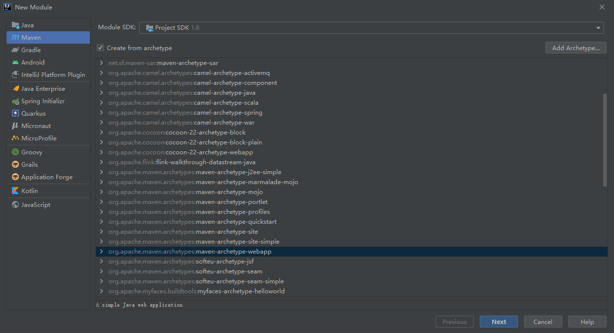
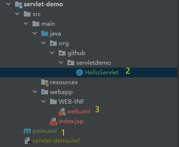
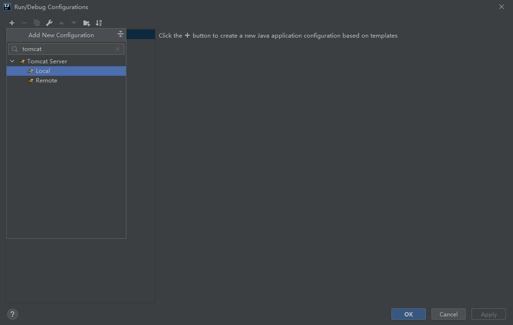
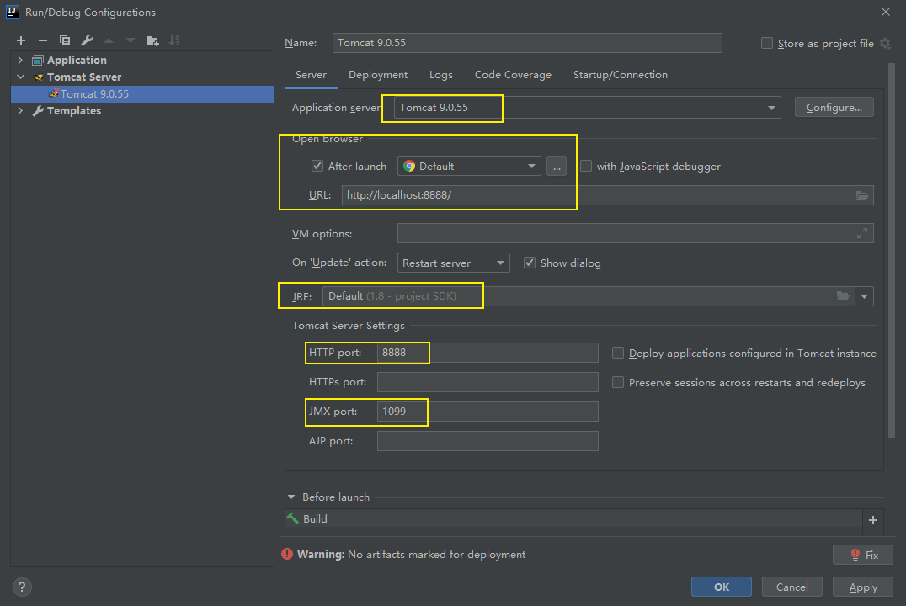
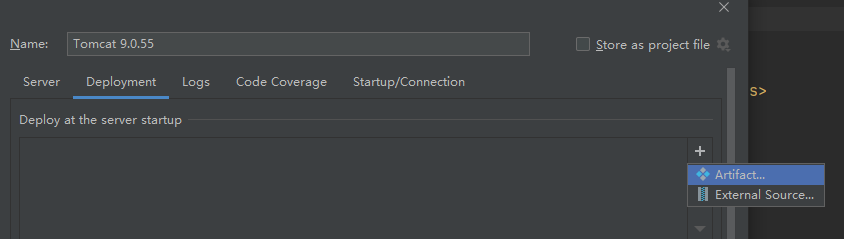
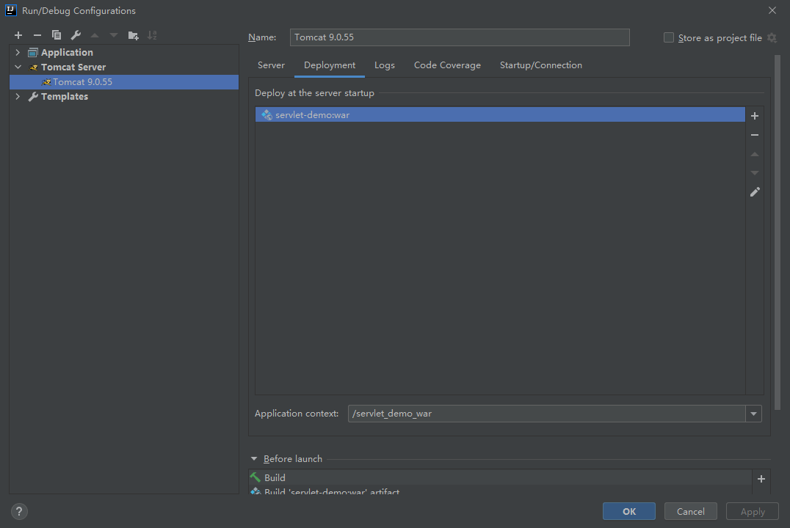
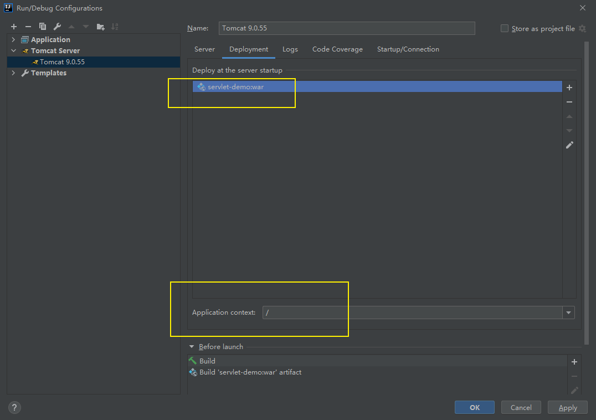

# Tomcat问题

## Tomcat乱码问题

参考 https://blog.csdn.net/B2345012/article/details/88365722

1. 找到**Tomcat**目录下**conf**文件夹中的**logging.properties**文件
2. 打开**logging.properties**文件，找到文件中的**java.util.logging.ConsoleHandler.encoding = UTF-8**
3. 将其中的**UTF-8**改为**GBK**，保存后重启Tomcat服务，启动后就会看到刚才的乱码已经转换过来了。

项目创建

项目结构参考：

https://github.com/Master-He/java-demo  下的servlet-demo/src/main/java/org/github/servletdemo/HelloServlet.java

tomcat配置

添加tomcat local

