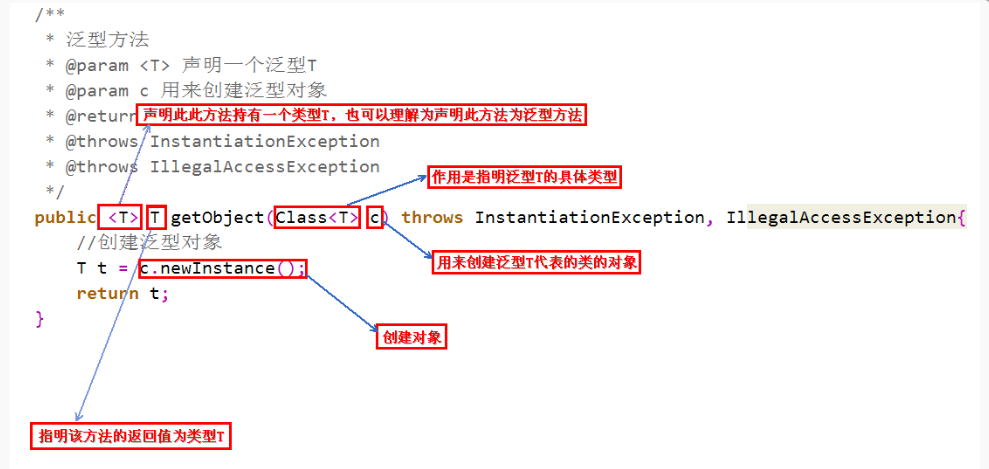
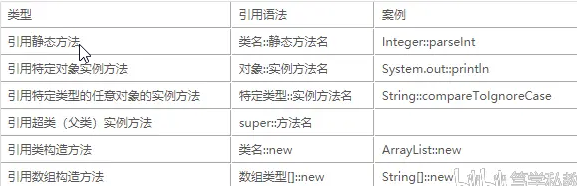
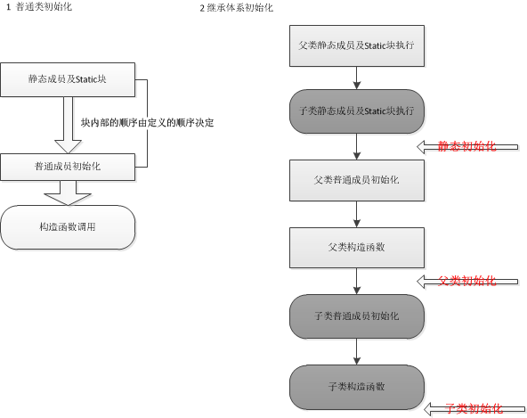
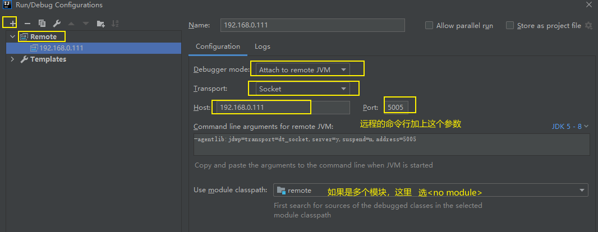
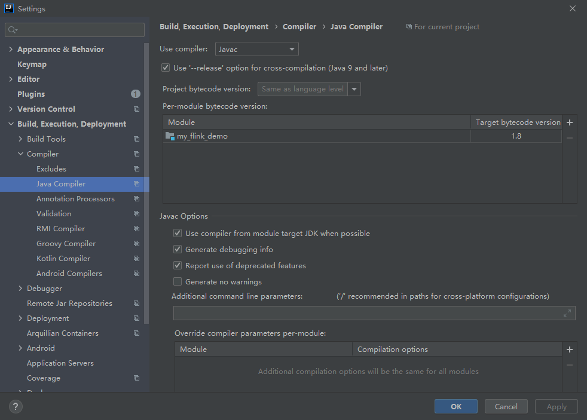
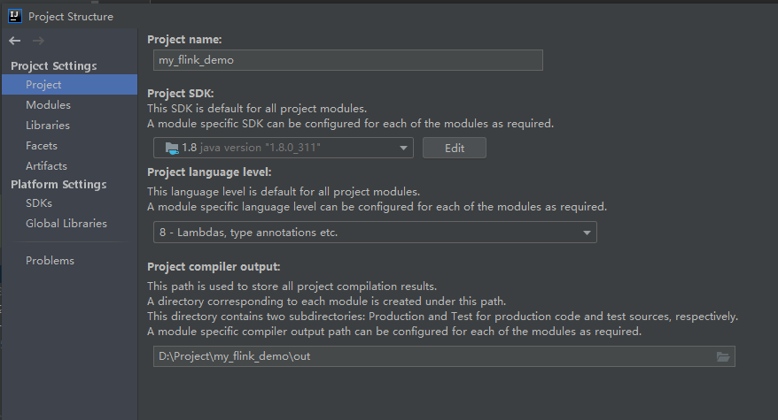
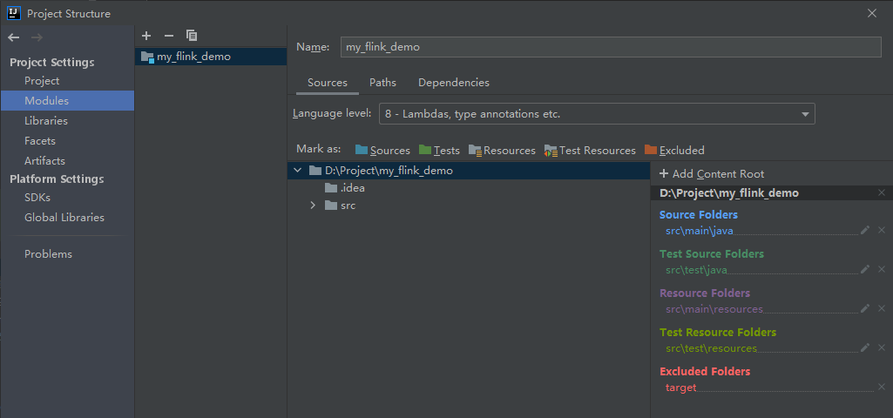

# 基本语法


>  Is there a Java equivalent of Python's 'enumerate' function?

https://stackoverflow.com/questions/7167253/is-there-a-java-equivalent-of-pythons-enumerate-function

```java
// 方法一
import java.util.ListIterator;  
import java.util.List;

List<String> numbers = Arrays.asList("zero", "one", "two");
ListIterator<String> it = numbers.listIterator();
while (it.hasNext()) {
    System.out.println(it.nextIndex() + " " + it.next());
}
```

```java
// 方法二
String[] numbers = {"zero", "one", "two"}
for (int i = 0; i < numbers.length; i++) // Note that length is a property of an array, not a function (hence the lack of () )
    System.out.println(i + " " + numbers[i]);
}
```

## 反射

Java中有一个名为Class的类，该类在运行时保留有关对象和类的所有信息。

Class对象描述了特定类的属性。该对象用于执行反射。

```java
//创建一个Dog类的对象
Dog d1 = new Dog();

//使用getClass()创建Class对象
Class obj = d1.getClass();

//查找由Dog实现的接口
Class[] objInterface = obj.getInterfaces();

//以整数形式获取Dog的访问修饰符
int modifier = obj.getModifiers();
System.out.println("修饰符： " + Modifier.toString(modifier));

//找到Dog的超类
Class superClass = obj.getSuperclass();
System.out.println("Superclass: " + superClass.getName());

// 获取新实例， public T newInstance();
```


```java
// 我们可以使用Field类提供的各种方法检查和修改类的不同字段。
getFields() - 返回该类及其超类的所有公共字段
getDeclaredFields()  - 返回类的所有字段
getModifiers() - 以整数形式返回字段的修饰符
set(classObject,value) - 使用指定的值设置字段的值
get(classObject) - 获取字段的值
setAccessible(boolean) - 使私有字段可访问
// 注意：如果我们知道字段名称，则可以使用
getField("fieldName"） - 从类返回名称为fieldName的公共字段。
getDeclaredField("fieldName"） - 从类返回名称为fieldName的字段。

// 我们可以使用Method类提供的各种方法来检查类的不同方法。
getMethods() - 返回该类及其超类的所有公共方法
getDeclaredMethod() - 返回该类的所有方法
getName() - 返回方法的名称
getModifiers() - 以整数形式返回方法的访问修饰符
getReturnType() - 返回方法的返回类型
                 
// 我们还可以使用Constructor类提供的各种方法检查类的不同构造函数。
getConstructors() - 返回该类的所有公共构造函数以及该类的超类
getDeclaredConstructor() -返回所有构造函数
getName() - 返回构造函数的名称
getModifiers() - 以整数形式返回构造函数的访问修饰符
getParameterCount() - 返回构造函数的参数数量
```


## 泛型

参考：https://itimetraveler.github.io/2016/12/27/%E3%80%90Java%E3%80%91%E6%B3%9B%E5%9E%8B%E4%B8%AD%20extends%20%E5%92%8C%20super%20%E7%9A%84%E5%8C%BA%E5%88%AB%EF%BC%9F/




### 创建泛型类


```java
public class demo {
    public static void main(String[] args) throws ClassNotFoundException {
        GenericsClass<Integer> intObj = new GenericsClass<>(5);
        System.out.println(intObj.getClass());  // class tmp.GenericsClass
        System.out.println(intObj.getData().getClass());  // class java.lang.Integer
        System.out.println(intObj.getData());  // 5

        GenericsClass<String> stringGenericsClass = new GenericsClass<>("1");
        System.out.println(stringGenericsClass.getData().getClass());  // class java.lang.String
        System.out.println(stringGenericsClass.getData());  // 1
        stringGenericsClass.setNull();
        System.out.println(stringGenericsClass.getData());  // null
    }
}

class GenericsClass<T> {
    private T data;

    public GenericsClass(T data) {
        this.data = data;
    }

    public T getData() {
        return this.data;
    }

    public void setNull() {
        this.data = null;
    }
}
```


### 创建泛型方法

```java
class Main {
  public static void main(String[] args) {
    //使用Integer数据初始化类
    DemoClass demo = new DemoClass();
    demo.<String>genericsMethod("Java Programming");  // <String>可省略
    demo.genericsMethod(100);
  }
}

class DemoClass {
  //泛型方法
  public <T> void genericsMethod(T data) {
    System.out.println("这是一个泛型方法。具体类型为" + data.getClass());
    System.out.println("传递给方法的数据是 " + data);
  }
}
```


### 有界类型

```java
<T extends A>  // T只能接受A的子类型的数据。
```

```java
<T super B>  // T只能接受B的父类型的数据。
```


## 注解

预定义注解:

```
@Deprecated
@Override
@SuppressWarnings
@SafeVarargs
@FunctionalInterface
```


元注解： https://juejin.cn/post/6844903943269548045  这个文章讲的不错

```
@Retention  // 被描述的注解在它所修饰的类中可以被保留到何时
@Documented  // 描述在使用 javadoc 工具为类生成帮助文档时是否要保留其注解信息。
@Target // 被修饰的注解可以用在什么地方
@Inherited  // 如果某个类使用了被@Inherited修饰的注解，则其子类将自动具有该注解
@Repeatable // 即允许在同一申明类型（类，属性，或方法）前多次使用同一个类型注解。
```


自定义注解：

```
@Retention(RetentionPolicy.RUNTIME)
@Target(ElementType.FIELD)
public @interface Name {
    public String value() default "";
}
```


# 类


## lambda

在lambda表达式执行时，jvm会先为该lambda生成一个java类，然后再创建一个该类对应的对象。

那lambda每次执行都会创建一个新对象吗?  答案是看情况。 

​	如果lambda引用了上下文变量，且变量更新了，lambda就会重新创建一个该类对应的对象

​    如果lambda没有引用上下文变量，获取引用的上下文变量没有更新，那么lambda表达式对象还是用上次创建的

参考：https://cloud.tencent.com/developer/article/1572212


参考：https://www.bilibili.com/read/cv8023087

lambda表达式示例

```java
Arrays.sort(array, (s1, s2) -> s1.compareTo(s2));
```

```java
list.forEach(System.out::println) //也是Java 8中的Lambda写法之一
```




## 构造方法

```
识别合法的构造方法；
  1 构造方法可以被重载，一个构造方法可以通过this关键字调用另一个构造方法，this语句必须位于构造方法的第一行；！！！
    重载：方法的重载(overload)：重载构成的条件：方法的名称相同，但参数类型或参数个数不同，才能构成方法的重载。 
  2 当一个类中没有定义任何构造方法，Java将自动提供一个缺省构造方法；
  3 子类通过super关键字调用父类的一个构造方法；（super和this必须在构造方法第一行！！！）
  4 当子类的某个构造方法没有通过super关键字调用父类的构造方法，通过这个构造方法创建子类对象时，会自动先调用父类的缺省构造方法
  5 构造方法不能被static、final、synchronized、abstract、native修饰，但可以被public、private、protected修饰；
  6 构造方法不是类的成员方法；
  7 构造方法不能被继承。
```

**当涉及到继承时，按照如下顺序执行：**

1. 执行父类的静态代码块，并初始化父类静态成员变量
2. 执行子类的静态代码块，并初始化子类静态成员变量
3. 执行父类的构造代码块，执行父类的构造函数，并初始化父类普通成员变量
4. 执行子类的构造代码块， 执行子类的构造函数，并初始化子类普通成员变量



参考：https://www.cnblogs.com/Qian123/p/5713440.html#_label1


## 权限控制修饰符


default 就是什么也不写

- **default** (即默认，什么也不写）: 在同一包内可见，不使用任何修饰符。使用对象：类、接口、变量、方法。
- **private** : 在同一类内可见。使用对象：变量、方法。 **注意：不能修饰类（外部类）**
- **public** : 对所有类可见。使用对象：类、接口、变量、方法
- **protected** : 对同一包内的类和所有子类可见。使用对象：变量、方法。 **注意：不能修饰类（外部类）**。protect 详解https://www.runoob.com/w3cnote/java-protected-keyword-detailed-explanation.html (**说实话没搞明白**)


## java 对象销毁时操作

// 重写finalize方法， jvm会调用

```java
// Java code to show the
// overriding of finalize() method

import java.lang.*;

// Defining a class demo since every java class
// is a subclass of predefined Object class
// Therefore demo is a subclass of Object class
public class demo {
	protected void finalize() throws Throwable
	{
		try {
			System.out.println("inside demo's finalize()");
		}
		catch (Throwable e) {
			throw e;
		}
		finally {
			System.out.println("Calling finalize method" + " of the Object class");
			// Calling finalize() of Object class
			super.finalize();
		}
	}

	// Driver code
	public static void main(String[] args) throws Throwable
	{
		// Creating demo's object
		demo d = new demo();
		// Calling finalize of demo
		d.finalize();
	}
}

```


为什么尽量不要Override finalize方法？

https://yfsyfs.github.io/2019/06/28/%E4%B8%BA%E4%BB%80%E4%B9%88%E5%B0%BD%E9%87%8F%E4%B8%8D%E8%A6%81Override-finalize%E6%96%B9%E6%B3%95/


可以使用try(){}语句 : try()括号中的资源会自动调用close()方法


# IO

## 写操作


使用org.apache.commons.io.FileUtils

```java
import org.apache.commons.io.FileUtils;

import java.io.File;
import java.io.IOException;
import java.nio.charset.StandardCharsets;

public class MyWriteFile {
    public static void main(String[] args) {
        File file = new File("/home/hwj/test.json");
        try {
            // 往test.json文件中写入"test"字符串
            FileUtils.write(file, "test", StandardCharsets.UTF_8); 
        } catch (IOException e) {
            e.printStackTrace();
        }
    }
}
```


## IO流

参考https://www.cnblogs.com/oubo/archive/2012/01/06/2394638.html


参考：https://www.cnblogs.com/hopeyes/p/9736642.html


字节流和字符流的区别 https://blog.csdn.net/u011578734/article/details/108346469

- 字节流操作的基本单元为字节；字符流操作的基本单元为Unicode码元(2个字节)。

- 字节流默认不使用缓冲区；字符流使用缓冲区
- 字节流可用于任何类型的对象，包括二进制对象，而字符流只能处理字符或者字符串

在从字节流转化为字符流时，实际上就是byte[]转化为String时，而在字符流转化为字节流时，实际上是String转化为byte[]时。


## 文件IO操作

```java
import org.apache.commons.io.FileUtils;

// 实际路径是resources/home/wordsCh.json 
String wordsPath = /home/wordsCh.json  
    
String path = 指定类.class.getResource(wordsPath).getPath();
// 如果windows下且路径中含有中文，空格等特殊字符,则加个.toURI
String path = 指定类.class.getResource(wordsPath).toURI.getPath();
String jsonStr = FileUtils.readFileToString(new File(path), StandardCharsets.UTF_8);
```

```java
import org.apache.commons.io.IOUtils;

//导入图
byte[] graphBytes = IOUtils.toByteArray(new FileInputStream(TestModel.class.getResource(PB_FILE_PATH).getPath()));
graph.importGraphDef(graphBytes);
```

```java
import org.apache.commons.io.FileUtils;

// 按行读文件，读成set
public static void main(String[] args) {
    String path = FileDemo.class.getResource("/a.txt").getPath();
    try {
        System.out.println(new HashSet<>(FileUtils.readLines(new File(path), StandardCharsets.UTF_8)));
    } catch (IOException e) {
        logger.error("loadWords [" + path + "] failed.");
        logger.error(ExceptionUtils.getStackTrace(e));
    }
}
```


## 文件监控

使用java.nio.file.FileSystems的WatchService监听文件变化

https://www.xncoding.com/2017/09/21/java/watchservice.html


什么是写时复制？

大多数操作系统都采用**写时复制（copy-on-write）来优化子进程的使用效率**

https://juejin.cn/post/6844903702373859335


# 集合


外网版本（用浏览器新建页面查看）


本地版


## 迭代器操作

获取大小

```java
IteratorUtils.toList(input.iterator()).size();  // input是Iterable<Object>对象
```


## List操作总结


//升序排序

```java
public static void testListSort() {
    List<Integer> integers = Arrays.asList(2, 5, 9, 4, 1, 3, 2);
    Collections.sort(integers);
    System.out.println(integers);  // [1, 2, 2, 3, 4, 5, 9]

    integers = Arrays.asList(2, 5, 9, 4, 1, 3, 2);
    integers.sort(Comparator.comparing(Integer::intValue));
    System.out.println(integers);  // [1, 2, 2, 3, 4, 5, 9]
}

public static void testListSortReverse() {
    List<Integer> integers = Arrays.asList(2, 5, 9, 4, 1, 3, 2);
    integers.sort(Comparator.comparing(Integer::intValue).reversed());
    System.out.println(integers);  // [9, 5, 4, 3, 2, 2, 1]
}
```

//求和

```java
public static void testListSum() {
    List<Integer> integers = Arrays.asList(1, 2, 3, 4, 5);
    int sum = integers.stream().mapToInt(Integer::intValue).sum();
    System.out.println(sum);
}
```
// 统计列表中出现最多的元素

```java
    public static void main(String[] args) {
        List<String> list = new ArrayList<>();
        list.add("2");
        list.add("2");
        list.add("2");
        list.add("2");
        list.add("2");
        list.add("2");
        list.add("3");
        list.add("3");
        list.add("4");
        list.add("1");
        list.add("1");
        list.add("1");
        list.add("1");
        Map<String, Long> map = list.stream().collect(Collectors.groupingBy(x -> x, Collectors.counting()));
        System.out.println(JSON.toJSONString(map));
        Map<String, Long> result = new LinkedHashMap<>();
        map.entrySet().stream().sorted(Map.Entry.<String, Long>comparingByValue().reversed()).forEachOrdered(e -> result.put(e.getKey(), e.getValue()));
        System.out.println(JSON.toJSONString(result));
    }

```

```java
public static void getElementCount() {
        List<Integer> integers = Arrays.asList(1, 1, 1, 2, 2, 2, 2, 4, 4, 4, 4, 4, 4, 4);
        Map<Integer, Long> map = integers.stream().collect(Collectors.groupingBy(Integer::intValue, Collectors.counting()));
        System.out.println(map);
        LinkedHashMap<Integer, Long> result = new LinkedHashMap<>();
        map.entrySet().stream().sorted(Map.Entry.<Integer, Long>comparingByValue().reversed()).limit(10).forEachOrdered(e-> result.put(e.getKey(), e.getValue()));
        System.out.println(result);
        for (Integer integer : result.keySet()) {
            System.out.println(result.get(integer));
        }
    }
```


// 列表转数组

```java
public static void main(String[] args) {
        ArrayList<Integer> integers = new ArrayList<>(Arrays.asList(1, 2, 3, 4, 5));
        int[] ints = integers.stream().mapToInt(Integer::intValue).toArray();
        System.out.println(Arrays.toString(ints));  // [1, 2, 3, 4, 5]
    }
```


/guava创建空列表

```java
import com.google.common.collect.Lists; 
Lists.newArrayList()
   
```

 空的map set同理


### LinkedList

LinkedList是双向链接串列(doubly LinkedList)。

LinkedList插入和删除比ArrayList更快，但是需要更多的内存，访问速度更慢。

```java
LinkedList<Integer> list = new LinkedList<Integer>() {{
    add(1);
    add(2);
    add(3);
}};
```


## Map操作总结

map初始化

```java
 private static final Map<String,String> urlMap =new HashMap<String, String>() {
        {
            put("url1", "http://news.sina.com.cn");//新浪新闻
            put("url2", "http://news.163.com");//网易新闻
            put("url3", "http://news.qq.com");//腾讯新闻
            put("url4", "http://news.baidu.com");//百度新闻
            put("url5", "http://www.ifeng.com");//凤凰网
        }
    };
```

map转list

```java
public static void main(String[] args) {
    Map<String, String> map = new HashMap<>();
    map.put("123","===123===");
    map.put("456","===456===");
    List<String> list = new ArrayList<>(map.values());
    System.out.println(list);
}
```


HashMap computeIfAbsent() 方法 作用？
就很像python 的setdefault(), 参考： https://www.runoob.com/java/java-hashmap-computeifabsent.html
类似的有putIfAbsent() ,参考： https://www.runoob.com/java/java-hashmap-putifabsent.html


guava 的 ImmutableMap

ImmutableMap.of(k1, v1, k2,v2  ....)


**LinkedHashMap**


## Set操作总结

```java
// 测试Set<Integer> contains int
public static final int RCODE_OK = 0;
public static final int RCODE_ERROR = 2;
public static final int RCODE_NOT_FIND = 3;
public static final Set<Integer> RCODE_TYPES = new HashSet<>(Arrays.asList(RCODE_OK, RCODE_NOT_FIND));
```

```java
System.out.println("abc.com".substring(3));
System.out.println(RCODE_TYPES.contains(0));
```


## Stream操作总结

入门： https://zhuanlan.zhihu.com/p/299064490


参考  https://www.jianshu.com/p/0687e7003eb2

List<Float> 转换成 float[]   参考：https://stackoverflow.com/questions/4837568/java-convert-arraylistfloat-to-float

```java
// List<Integer> 和 List<Double> 转换成 int[], double[]可以通过stream mapToInt mapToDouble
ArrayList<Integer> integers = new ArrayList<>(Arrays.asList(1, 2, 3, 4, 5));
int[] ints = integers.stream().mapToInt(Integer::intValue).toArray();
System.out.println(Arrays.toString(ints));  // [1, 2, 3, 4, 5]

List<Double> doubles = new ArrayList<>(Arrays.asList(1d,2d,3d,4d,5d));
double[] doubles1 = doubles.stream().mapToDouble(Double::doubleValue).toArray();
System.out.println(Arrays.toString(doubles1));

// 但是List<Float> 转换成 float[] 不能！ 因为不存在mapToFloat!!! 网上找发现： 
ArrayList<Float> floats = new ArrayList<>(Arrays.asList(1f, 2f, 3f, 4f, 5f));
// new Float[0]生成是长度为0的空Float[]
float[] floats1 = ArrayUtils.toPrimitive(floats.toArray(new Float[0]), 0.0f); 
System.out.println(Arrays.toString(floats1));
```


> 字符串去重

```java
Set<Character> collect = "abcdefabcdef".chars().mapToObj(i -> (char) i).collect(Collectors.toSet());
        System.out.println(collect);

```


> 提取出list中bean的某一属性

```java
// DetectData是一个bean
List<String> domainList = detectDataList.stream().map(DetectData::getDomain).collect(Collectors.toList());
```


> **java8Stream map和flatmap的区别**

flatmap可以将map生成的单个流合并成一个流，即扁平化成一个流。

https://www.cnblogs.com/wangjing666/p/9999666.html

```java
public class demo {
    public static void main(String[] args) {
        testMap();
        testFlatMap();
    }

    public static void testMap() {
        String[] words = new String[]{"Hello", "World"};
        List<String[]> a = Arrays.stream(words)
                .map(word -> word.split(""))
                .distinct()
                .collect(Collectors.toList());
        System.out.println(a);  // [[Ljava.lang.String;@25f38edc, [Ljava.lang.String;@1a86f2f1]
    }

    public static void testFlatMap() {
        String[] words = new String[]{"Hello","World"};
        List<String> a = Arrays.stream(words)
                .map(word -> word.split(""))
                .flatMap(Arrays::stream)
                .distinct()
                .collect(Collectors.toList());
        a.forEach(System.out::print);  // HeloWrd
    }

}
```


> flatMap等价写法

```java
// 第一种
String[] words = new String[]{"Hello","World"};
List<String> a = Arrays.stream(words)
        .map(word -> word.split(""))
        .flatMap(Arrays::stream)
        .distinct()
        .collect(toList());
a.forEach(System.out::print);
```

```java
// 第二种
String[] words = new String[]{"Hello","World"};
List<String> collect = Stream.of(words).map(i -> i.split("")).flatMap(Stream::of).collect(toList());
```

```java
// 第三种
List<String> collect = Stream.of(words).flatMap(word -> Stream.of(word.split(""))).collect(toList());
```


> 去几个值中的最小值

```java
Optional<Integer> proofCountOptional = Stream.of(subDomains.size(), answers.size(), tsList.size(), 20).min(Integer::compareTo);
        int proofCount = proofCountOptional.orElse(0);
```


> 统计每个元素的个数

```java
int[] arr=new int[]{5,1,3,4,1};
//若统计的是int数组，先转化为List
List<Integer> list= Arrays.stream(arr).boxed().collect(Collectors.toList());
//groupingBy分组
Map<Integer, Long> map = list.stream().collect(Collectors.groupingBy(Function.identity(), Collectors.counting()));
//控制台输出map
map.forEach((k,v)->{
      System.out.println("k="+k+",v="+v);
});
```


> 判断是否所有元素都为1

```java
list.stream().allMatch(x -> x == 1)
```


## Stack操作总结

栈是Vector的一个子类，它实现了一个标准的后进先出的栈。

```java
//常用的方法
Object peek( ) // 查看堆栈顶部的对象，但不从堆栈中移除它。
Object pop( ) // 移除堆栈顶部的对象，并作为此函数的值返回该对象。
Object push(Object element)  // 把项压入堆栈顶部。
```


## Vector操作总结

暂无


## Queue操作总结

队列接口方法

```java
add // 增加一个元索 如果队列已满，则抛出一个IIIegaISlabEepeplian异常
offer // 添加一个元素并返回true 如果队列已满，则返回false
put // 添加一个元素 如果队列满，则阻塞

remove // 移除并返回队列头部的元素 如果队列为空，则抛出一个NoSuchElementException异常
poll // 移除并返问队列头部的元素 如果队列为空，则返回null
take // 移除并返回队列头部的元素 如果队列为空，则阻塞
element // 返回队列头部的元素 如果队列为空，则抛出一个NoSuchElementException异常
peek // 返回队列头部的元素 如果队列为空，则返回null
```

实现队列接口的类

```java
Java 集合中的 Queue 继承自 Collection 接口 ， Deque(双端队列), LinkedList(双向链表), PriorityQueue, BlockingQueue 等类都实现了它。
```

队列方法总结

| 总结    | 抛出异常  | 返回特殊值 |
| ------- | --------- | ---------- |
| Insert  | add(e)    | offer(e)   |
| Remove  | remove()  | poll()     |
| Examine | element() | peek()     |


## 数组操作

// String转 ==》 char[]数组 ==》  转List
// 即String 转 List<Character>

```java
public static void stringToSetAndList() {
        String domain = "aabbcc";
        Set<Character> collect = domain.chars().mapToObj(i -> (char) i).collect(Collectors.toSet());
        List<Character> collect1 = domain.chars().mapToObj(i -> (char) i).collect(Collectors.toList());
        System.out.println(collect);
        System.out.println(collect1);
    }
```


数组初始化

```java
// 初始化空数组
new int[0];
new Integer[0];
// 初始化数组
new int[] {1,2,3};
// 初始化多维数组
int[][] ints = {{1, 2, 3}, {3, 4, 5}};
```


数组拷贝

```java
    public static void main(String[] args) {
        int[] ints = {1, 2, 3, 4, 5, 6};
        System.out.println(Arrays.toString(Arrays.copyOf(ints, 3))); // [1, 2, 3]
    }
```


二维数组的维度会改变， 并不是固定死的

```java
public static void main(String[] args) {
    float[][] floats = new float[5][10];
    System.out.println(Arrays.deepToString(floats));  // 打印出来是5*10
    for (int i = 0; i < floats.length; i++) {
        floats[i] = new float[]{i * 1f, i * 2f, i * 3f, i * 4f, i * 5f};
    }
    System.out.println(Arrays.deepToString(floats));  // 打印出来是5*5
}
```


降维

```java
// float[5][1]降维成float[5]
private static void test() {
    float[][] rawResults = new float[][] {{1f},{2f},{3f},{4f},{5f}};
    System.out.println(Arrays.deepToString(rawResults));
    // 降维
    List<Float> blackDomainProbabilities = new ArrayList<>();
    for (float[] rawResult : rawResults) {
        blackDomainProbabilities.add(rawResult[0]);
    }
    System.out.println(blackDomainProbabilities);
}
```


数组长度不足则高位填充0 , 比如要求输出是int[10]，给的输入是[1,2,3] 。 输出结果是[0,0,0,0,0,0,0,1,2,3]

下面给出一个类似的例子

```java
public class demo {
    public static void main(String[] args) {
        float[][] floats = padSequences(new float[][]{{1.0f, 2.0f, 3.0f}}, 10);
        System.out.println(Arrays.deepToString(floats));
    }
    /**
     * @param domainVectorArray 域名向量数组
     * @param n 需要返回的数组维度
     * @return 返回高位填充0的域名向量数组 domainVectorArrayWithPad
     * @Description: 例如要求返回数组float[10]，若输入[[1.0, 2.0, 3.0]] 则输出[[0.0, 0.0, 0.0, 0.0, 0.0, 0.0, 0.0, 1.0, 2.0, 3.0]]
     */
    private static float[][] padSequences(float[][] domainVectorArray, int n) {
        for (int i = 0; i < domainVectorArray.length; i++) {
            float[] domainVector = domainVectorArray[i];
            float[] domainVectorWithPad = new float[n];
            for (int j = 1; j <= domainVector.length; j++) {
                domainVectorWithPad[domainVectorWithPad.length - j] = domainVector[domainVector.length - j];
            }
            domainVectorArray[i] = domainVectorWithPad;
        }
        return domainVectorArray;
    }
}
```


数组填充默认值

```java
Long[] tsArray = new Long[10];
Arrays.fill(tsArray, 1645065478000L);
List<Long> tsList = Arrays.stream(tsArray).collect(Collectors.toList());
// 或者 List<Long> tsList = Arrays.asList(tsArray);
// 参考https://blog.csdn.net/yhf597869822/article/details/104626838
```


# 字符串

## 字符串方法

**字符串自带的常用方法** (参考菜鸟教程https://www.runoob.com/java/java-string.html)

```java
char charAt(int index);  //返回指定索引处的 char 值。
int compareTo(String anotherString) // 按ASCII字典顺序比较两个字符串。返回ASCII差值， 如果两个字符前面相同则返回长度差值
int compareToIgnoreCase(String str) // 按字典顺序比较两个字符串，不考虑大小写。
String concat(String str)  // 将指定字符串连接到此字符串的结尾。
boolean startsWith(String prefix)  // 测试此字符串是否以指定的前缀开始。
boolean endsWith(String suffix) // 测试此字符串是否以指定的后缀结束。
boolean equals(Object anObject)  // 将此字符串与指定的对象比较。
boolean equalsIgnoreCase(String anotherString) // 将此 String 与另一个 String 比较，不考虑大小写。
byte[] getBytes(String charsetName) // 使用指定的字符集将此 String 编码为 byte 序列，并将结果存储到一个新的 byte 数组中。
int indexOf(String str) // 返回指定字符在字符串中第一次出现处的索引，如果此字符串中没有这样的字符，则返回 -1
int lastIndexOf(String str) // 返回指定子字符串在此字符串中最右边出现处的索引，如果此字符串中没有这样的字符，则返回 -1。
int length() // 方法用于返回字符串的长度。
boolean matches(String regex)  // 效果等同于Pattern.matches(regex, str) 用于检测字符串是否匹配给定的正则表达式。
String replace(char searchChar, char newChar) // 方法通过用 newChar 字符替换字符串中出现的所有 searchChar 字符，并返回替换后的新字符串。
String replaceAll(String regex, String replacement) // 使用给定的参数 replacement 替换字符串所有匹配给定的正则表达式的子字符串。
String replaceAll(String regex, String replacement) // 使用给定的参数 replacement 替换字符串第一个匹配给定的正则表达式的子字符串。
String[] split(String regex, int limit) // split() 方法根据匹配给定的正则表达式来拆分字符串。
//注意： . 、 $、 | 和 * 等转义字符，必须得加 \\。
//注意：多个分隔符，可以用 | 作为连字符。
String trim() // 返回字符串的副本，忽略前导空白和尾部空白。
String valueOf(primitive data type x) //返回给定data type类型x参数的字符串表示形式。
```


**判断是否是全字母**  https://www.itranslater.com/qa/details/2136843502934819840

```xml
<dependency>
    <groupId>org.apache.commons</groupId>
    <artifactId>commons-lang3</artifactId>
    <version>3.12.0</version>
</dependency>
```

```java
// StringUtils 是org.apache.commons的commons-lang3包
public static void stringAllIsAlpha() {
    String str = "test1";
    System.out.println("test1 is all alpha? ==>" + StringUtils.isAlpha(str));  // false

    str = "test";
    System.out.println("test is all alpha? ==>" + StringUtils.isAlpha(str));  // true
}
```

```java
boolean allLetters = someString.chars().allMatch(Character::isLetter);  // chars()是stream流
```

```
public boolean isAlpha(String name) {
    return name.matches("[a-zA-Z]+");
}
```


**StringBuilder** 

StringBuffer 之间的最大不同在于 StringBuilder 的方法不是线程安全的（不能同步访问）。

StringBuffer常用方法

```java
public StringBuffer append(String s) // 将指定的字符串追加到此字符序列。
public StringBuffer reverse() // 将此字符序列用其反转形式取代。
replace(int start, int end, String str) // 使用给定 String 中的字符替换此序列的子字符串中的字符。
char charAt(int index) // 返回此序列中指定索引处的 char 值。
```


## 正则操作

参考https://www.runoob.com/java/java-regular-expressions.html

```java
import java.util.regex.Pattern;

// 大小写不敏感， 
public static final Pattern REGISTER_URI_PATTERN = Pattern.compile("[./](regist|register|reg(\\d)?\\.|reg/)", Pattern.CASE_INSENSITIVE);


REGISTER_URI_PATTERN.matcher(uri).find()
```

java.util.regex 包主要包括以下三个类：

- Pattern 类：

  pattern 对象是一个正则表达式的编译表示。Pattern 类没有公共构造方法。要创建一个 Pattern 对象，你必须首先调用其公共静态编译方法，它返回一个 Pattern 对象。该方法接受一个正则表达式作为它的第一个参数。

  Pattern.matches(pattern, content)方法 查找字符串content中是否包了pattern

  Pattern.compile(pattern); 创建对象

- Matcher 类：

  Matcher 对象是对输入字符串进行解释和匹配操作的引擎。与Pattern 类一样，Matcher 也没有公共构造方法。你需要调用 Pattern 对象的 matcher 方法来获得一个 Matcher 对象。

  Matcher m = Pattern.compile(pattern).matcher(content); 查找content字符串

  m.find() 方法查找字符串content中是否包了pattern

  m.groupCount ()方法来查看表达式有多少个分组。

  m.group(0)方法获取整体匹配到的

- PatternSyntaxException：

  PatternSyntaxException 是一个非强制异常类，它表示一个正则表达式模式中的语法错误。


Matcher 类的比较重要方法

```java
public boolean find()  // 尝试查找与该模式匹配的输入序列的下一个子序列。
public boolean matches()  // 尝试将整个区域与模式匹配。
//  尝试将从区域开头开始的输入序列与该模式匹配。 lookingAt方法不需要整句都匹配，但要从第一个字符开始匹配。
public boolean lookingAt()
    
public int start() // 返回以前匹配的初始索引。
public int end()  // 返回最后匹配字符之后的偏移量。  
    
// 替换模式与给定替换字符串相匹配的输入序列的每个子序列。
public String replaceAll(String replacement)  
// 替换模式与给定替换字符串匹配的输入序列的第一个子序列。
public String replaceFirst(String replacement)
```


## 字符串格式化

参考 https://blog.csdn.net/lonely_fireworks/article/details/7962171

```java
String.format("一本书的价格是：% 50.5f元%n", 49.8);
```


# 项目相关


## 日志操作

// 日志打印错误信息， 打印错误堆栈信息

```java
public static final Logger logger = LoggerFactory.getLogger(指定类.class);
logger.error(e.getMessage());
logger.error(org.apache.commons.lang3.exception.ExceptionUtils.getStackTrace(e));
```


## 异常处理

```java
// 抛出异常和返回一个值类似，可以直接抛出一个异常类，也可以返回一个异常对象，对象也可以自定义异常信息 	
	@Rule
    public ExpectedException thrown = ExpectedException.none();

    @Test
    public void testThenThrow() {
        List mockedList = mock(List.class);
        when(mockedList.size()).thenReturn(2);
        when(mockedList.get(0)).thenReturn("foo");
        when(mockedList.get(1)).thenReturn("bar");
        when(mockedList.get(2)).thenThrow(IndexOutOfBoundsException.class);
        when(mockedList.remove(2)).thenThrow(new IndexOutOfBoundsException("Max index is 1."));

        Assert.assertEquals(2, mockedList.size());
        Assert.assertEquals("foo", mockedList.get(0));
        Assert.assertEquals("bar", mockedList.get(1));

        thrown.expect(IndexOutOfBoundsException.class);
        mockedList.get(2);

        thrown.expect(IndexOutOfBoundsException.class);
        thrown.expectMessage("Max index is 1.");
        mockedList.remove(2);
    }
```


## Maven

菜鸟教程 https://www.runoob.com/maven/maven-pom.html , https://www.cainiaojc.com/maven/maven-tutorial.html

视频https://www.bilibili.com/video/BV1Fz4y167p5?p=10&spm_id_from=pageDriver

### 常用命令

```shell
mvn compile  #编译
mvn exec:java -Dexec.mainClass="com.xxx.demo.Hello"  # 启动项目
mvn package -Dmaven.test.skip=true  # 打包跳过测试
mvn clean package # 清除旧包并打包
mvn packge -Pdev  # 指定dev开发环境的profile进行打包（还有测试环境，生产环境）
mvn -Dtest=TestSquare,TestCi*le test #maven运行特定的test case
```


> maven 导入本地jar

https://blog.csdn.net/wangjian1204/article/details/54563988

https://blog.csdn.net/w605283073/article/details/90120722


> maven build jar包

```xml
<build>
    <finalName>my-project</finalName>
    <plugins>
        <plugin>
            <groupId>org.apache.maven.plugins</groupId>
            <artifactId>maven-jar-plugin</artifactId>
            <version>2.4</version>
            <configuration>
                <archive>
                    <manifest>
                        <mainClass>com.xxx.yyy.Main</mainClass>
                    </manifest>
                    <manifestEntries>
                        <Class-Path>.</Class-Path>
                    </manifestEntries>
                </archive>
                <!-- exclude resource files or directories -->
                <excludes>
                </excludes>
            </configuration>
        </plugin>
    </plugins>
</build>
```


>  Maven打jar包把配置文件放在META-INF目录下

https://codeantenna.com/a/B0elYtcAXh

```xml
<build>
    <resources>
        <resource>
            <directory>src/main/resources</directory>
            <targetPath>META-INF/</targetPath>
        </resource>
    </resources>
</build>
```


> 将项目使用的包依赖和项目一同打进jar包， （忘了参考哪个博客了。）

```xml
<plugins>
    <plugin>
        <groupId>org.apache.maven.plugins</groupId>
        <artifactId>maven-assembly-plugin</artifactId>
        <version>3.0.0</version>
        <configuration>
            <archive>
                <manifest>
                    <mainClass>com.sangfor.detect.wsk.Jwskiller</mainClass>
                </manifest>
                <manifestEntries>
                    <Class-Path>.</Class-Path>
                </manifestEntries>
            </archive>
            <descriptorRefs>
                <descriptorRef>jar-with-dependencies</descriptorRef>
            </descriptorRefs>
        </configuration>
        <executions>
            <execution>
                <id>make-assembly</id> <!-- this is used for inheritance merges -->
                <phase>package</phase> <!-- 指定在打包节点执行jar包合并操作 -->
                <goals>
                    <goal>single</goal>
                </goals>
            </execution>
        </executions>
    </plugin>
</plugins>
```


> 给指定的系统build jar包， 比如nd4j的包依赖于特定系统， 不同系统有不同的jar包

```xml

```

https://stackoverflow.com/questions/40535909/how-to-build-a-jar-with-maven-for-a-specific-os

https://gist.github.com/agibsonccc/b4e22b861070adcede859f523c172936

https://github.com/neo4j-graph-analytics/ml-models/issues/10


> linux命令行下使用mvn

创建项目

```
mvn archetype:generate "-DgroupId=com.sangfor.sip" "-DartifactId=sip" "-DarchetypeArtifactId=maven-archetype-quickstart" "-DinteractiveMode=false"
mvn archetype:create -DgroupId=com.sangfor.sip -DartifactId=my-app
```

编译 (注意需要在pom所在目录运行)

```
mvn compile
```

运行

```
mvn exec:java -Dexec.mainClass="com.sangfor.sip.App"
```


MVN常用命令

https://blog.csdn.net/xiaxiaorui2003/article/details/52062216


> maven打包一直不成功，显示依赖缺少，但实际上依赖的jar包在本地确实有！ 

尝试过清空IDEA缓存，重启IDEA，手动将依赖jar包复制到本地，结果还不行（镜像库用的是公司的，公司和外网不连通）

最后在大佬的操作下完成了任务， 删除maven仓库下所有的_remote.repositories文件， 让maven只能去公司的镜像去下载jar包

参考： https://blog.csdn.net/jiajane/article/details/104396079


## 为啥要实现Serializable接口？
https://zhuanlan.zhihu.com/p/66210653


## 同步异步

应用一个第三方模块的时候，要注意第三方模块是同步还是异步的， 线程安全的还是线程不安全的

比如yara代码， 快速循环10000次同样的代码，如果每次都能马上获取到结果，那就是同步的，如果10000次里面有一次结果没有马上获取到，结果为空则可能是异步的


## 单例

```java
// 懒汉模式， 静态
public class PwdUEBAKeyword {
	private static final class InstanceHolder {
        static final PwdUEBAKeyword instance = new PwdUEBAKeyword();
    }

    public static PwdUEBAKeyword getInstance() {
        return InstanceHolder.instance;
    }
}
```


## 排序

参考https://zhuanlan.zhihu.com/p/376672600

java种默认的排序用的是什么算法？

**Arrays.sort()** 看底层代码，对于int[]数组，当数组长度len<47用插入排序，47<len<286的用双轴快排， len>286的用归并排序

**Collections.sort()**用的是Arrays.sort() 的其中一种重载方法, Arrays.sort()根据情况使用TimSort排序或者传统的归并排序

双轴快速排序， TimSort， 归并排序介绍文章https://blog.51cto.com/u_15103028/2647024

排序算法有9种

**分类**

- **插入排序：** 直接插入排序、二分法插入排序、希尔排序
- **选择排序：** 简单选择排序、堆排序
- **交换排序：** 冒泡排序、快速排序(分治)
- **归并排序**
- **基数排序**

```java
// 快速排序： 选一个基准元素，把小于基准元素的放在左边，大于基准元素的放在右边。 然后左右两边的按同样的方式递归
public class QuickSort {
    public static void main(String[] args) {
        int[] nums = new int[]{3, 1, 4, 2, 5};
        System.out.println("排序前" + Arrays.toString(nums));
        quickSort(nums, 0, nums.length - 1);
        System.out.println("排序后" + Arrays.toString(nums));
    }

    private static void quickSort(int[] nums, int l, int r) {
        if (l >= r) {
            return;
        }
        int i = l;
        int j = r;
        int tmp = nums[i];
        while (i < j) {
            // 基准元素是nums[l]
            while (i < j && nums[j] >= nums[l]) {
                j--;
            }
            while (i < j && nums[i] <= nums[l]) {
                i++;
            }
            tmp = nums[i];
            nums[i] = nums[j];
            nums[j] = tmp;
        }
        // 这个时候i=j, num[i]和基准元素互换(tmp=num[i]在上面已经定义)
        nums[i] = nums[l];
        nums[l] = tmp;
        quickSort(nums, l, i - 1);
        quickSort(nums, i + 1, r);
    }
}
```


```java
// 快速排序简洁版
private void quickSort(int[] arr, int l, int r) {
        // 子数组长度为 1 时终止递归
        if (l >= r) return;
        // 哨兵划分操作（以 arr[l] 作为基准数）
        int i = l, j = r;
        while (i < j) {
            while (i < j && arr[j] >= arr[l]) j--;
            while (i < j && arr[i] <= arr[l]) i++;
            swap(arr, i, j);
        }
        swap(arr, i, l);
        // 递归左（右）子数组执行哨兵划分
        quickSort(arr, l, i - 1);
        quickSort(arr, i + 1, r);
    }
private void swap(int[] arr, int i, int j) {
        int tmp = arr[i];
        arr[i] = arr[j];
        arr[j] = tmp;
    }
```


# 加密解密

待总结


# 工具


## jd-gui

java 反编译软件 http://java-decompiler.github.io/

mac 版本不兼容问题

修改jd-gui的包，也就是Applications/JD-GUI.app/Contents/MacOS/universalJavaApplicationStub.sh文件

```shell
export JAVA_HOME=$(/usr/libexec/java_home -v11)
```

参考 https://github.com/java-decompiler/jd-gui/issues/332


## IDEA


### IDEA 远程调试

参考https://cloud.tencent.com/developer/article/1666221

远程调试本质就是连接远程的JVM

两步搞定，第一步：



第二步 

```shell
# 输入命令 java -Xdebug (复制上图的命令行参数) -jar xxx.jar ，具体如下命令
java -Xdebug -agentlib:jdwp=transport=dt_socket,server=y,suspend=n,address=5005 -jar my-project.jar
```

如果调试不通。需要telnet一下5005端口是否能够连上（ telnet 192.168.0.111 5005 ）。一般不能连上的情况： 防火墙端口没有开放， 或者端口被占用


### IDEA diagrams使用

https://blog.csdn.net/ttzommed/article/details/114905865

类图维基百科  https://zh.wikipedia.org/wiki/%E9%A1%9E%E5%88%A5%E5%9C%96 


### IDEA 指定Java8

1.指定java compiler



2. 指定sdk 



3.指定模块语言等级




### IEDA 插件

https://blog.csdn.net/qq_35246620/article/details/78289074

|插件名称| 插件介绍| 官网地址|
| ---- | ---- | ---- |
|Statistic| 代码统计插件| https://plugins.jetbrains.com/plugin/4509?pr=idea|
|Translation| 翻译插件 | https://plugins.jetbrains.com/plugin/8579-translation |
|Alibaba Java Coding Guidelines| 阿里巴巴代码规范检查插件| https://plugins.jetbrains.com/plugin/10046-alibaba-java-coding-guidelines|
|Key promoter| 快捷键提示插件| https://plugins.jetbrains.com/plugin/4455?pr=idea|
|Grep Console| 自定义控制台输出格式插件| https://plugins.jetbrains.com/idea/plugin/7125-grep-console|
|CheckStyle-IDEA| 代码规范检查插件| https://plugins.jetbrains.com/plugin/1065?pr=idea|
|FindBugs-IDEA| 潜在 Bug 检查| https://plugins.jetbrains.com/plugin/3847?pr=idea|
|MetricsReloaded| 代码复杂度检查| https://plugins.jetbrains.com/plugin/93?pr=idea|
|JRebel Plugin| 热部署插件| https://plugins.jetbrains.com/plugin/?id=4441|
|CodeGlance| 显示代码地图插件| https://plugins.jetbrains.com/plugin/7275?pr=idea|
|Markdown Navigator| Markdown 编辑器插件| https://plugins.jetbrains.com/plugin/7896?pr=idea|
|Eclipse Code Formatter| Eclipse 代码风格格式化插件| https://plugins.jetbrains.com/plugin/6546?pr=idea|
|Jindent-Source Code Formatter| 自定义模板插件| http://plugins.jetbrains.com/plugin/2170?pr=idea|
|Maven Helper| Maven 辅助插件| https://plugins.jetbrains.com/plugin/7179-maven-helper|
|Properties to YAML Converter| Properties 转 YAML 格式插件| https://plugins.jetbrains.com/plugin/8000-properties-to-yaml-converter|
|Git Flow Integration| Git Flow 集成插件| https://plugins.jetbrains.com/plugin/7315-git-flow-integration|


### IDEA 快捷键(win)

```shell
# 看类结构
alt+7 或者 ctrl+F12
```

### IDEA 快捷键(mac)

```

```


# 其他

## 获取本地语言

https://blog.csdn.net/weixin_39625782/article/details/114051500


## 练手项目

- Java 实现简单计算器：https://www.lanqiao.cn/courses/185
- Eclipse 实现 Java 编辑器：https://www.lanqiao.cn/courses/287
- 一本糊涂账：https://how2j.cn/module/104.html
- Java 五子棋：https://blog.csdn.net/cnlht/article/details/8176130
- Java 中国象棋：https://blog.csdn.net/cnlht/article/details/8205733
- JAVA GUI 图书馆管理系统：https://github.com/uboger/LibraryManager
- JAVA 坦克大战小游戏：https://github.com/wangzhengyi/TankWar
- Swing 编写的俄罗斯方块：https://github.com/HelloClyde/Tetris-Swing
- 小小记账本：https://github.com/xenv/SmallAccount （适合了解数据库的同学）
- 

## 怎么看回调函数的调用栈

```java
StackTraceElement[] stackElements = Thread.currentThread().getStackTrace();
for (StackTraceElement stackElement : stackElements) {
    System.out.print(stackElement.getClassName() + "/t");
    System.out.print(stackElement.getFileName() + "/t");
    System.out.print(stackElement.getLineNumber() + "/t");
    System.out.println(stackElement.getMethodName());
}
```


## jar包相关

linux 下单java文件编译和导入jar包， jar包放在/xxx/lib/下

```shell
javac -Djava.ext.dirs=/xxx/lib/ Test.java
java -Djava.ext.dirs=/xxx/lib/ Test
```


运行jar包

```shell
java -jar xxx.jar
```


怎么build jar包？ pom指定入口

```xml
<build>
        <finalName>test-yara</finalName>
        <plugins>
            <plugin>
                <groupId>org.apache.maven.plugins</groupId>
                <artifactId>maven-jar-plugin</artifactId>
                <version>2.4</version>
                <configuration>
                    <archive>
                        <manifest>
                            <mainClass>com.sangfor.yara.Main</mainClass>
                        </manifest>
                        <manifestEntries>
                            <Class-Path>.</Class-Path>
                        </manifestEntries>
                    </archive>
                    <!-- exclude resource files or directories -->
                    <excludes>
                    </excludes>
                    <includes>

                    </includes>
                </configuration>
            </plugin>
        </plugins>
    </build>
```


## JNI

JNI 的hello world  demo参考

https://stackoverflow.com/questions/761639/why-am-i-getting-this-unsatisfiedlinkerror-with-native-code

创建`HelloWorld.c`:

```c
#include <jni.h>
#include <stdio.h>
#include "HelloWorld.h"

/* shamelessly stolen from the book 'The Java Native Interface: Programmer's
   Guide and Specification' */
JNIEXPORT void JNICALL
Java_HelloWorld_print (JNIEnv *env, jobject obj) {
    printf("Hello World!\n");
}
```

创建`HelloWorld.java`:

```java
class HelloWorld {
     private native void print();
     public static void main(String[] args) {
         new HelloWorld().print();
     }
     static {
         System.loadLibrary("HelloWorld");
     }
 }
```

绑定和测试 Building and testing:

```java
$ javac HelloWorld.java
$ javah -classpath . HelloWorld
$ gcc -shared -fPIC -I $JAVA_HOME/include -I $JAVA_HOME/include/linux HelloWorld.c -o libHelloWorld.so
$ java -classpath . -Djava.library.path=. HelloWorld
Hello World!
```

**注意 ：put `lib` at the beginning of the library's filename **


echo $LD_LIBRARY_PATH 可以查看动态链接库路径


## JNA

JNA是建立在JNI技术基础之上的一个Java类库，它使您可以方便地使用java直接访问动态链接库中的函数。原来使用JNI，你必须手工用C写一个动态链接库，在C语言中映射Java的数据类型。JNA中，它提供了一个动态的C语言编写的转发器，可以自动实现Java和C的数据类型映射。你不再需要编写C动态链接库。当然，这也意味着，使用JNA技术比使用JNI技术调用动态链接库会有些微的性能损失。可能速度会降低十几倍。就看你的需求来用了。https://blog.csdn.net/hqy1719239337/article/details/88966183


JNA的使用参考问题，但是这个有点问题（文件命名问题）

https://blog.csdn.net/todorovchen/article/details/21319033


## 安装java（环境）

> mac系统

我的mac统自带Java ， 目录在/Library/Java/JavaVirtualMachines/adoptopenjdk-8-openj9.jdk/Contents/Home

可以直接用java -version和javac -version命令，但是有些软件还是会需要JAVA_HOME环境变量，这里记录一下配置

```shell
$ open -e .bash_profile  # 或者vim ~/.bash_profile
```
.bash_profile 文件后面加上这6行
```
JAVA_HOME=/Library/Java/JavaVirtualMachines/jdk-11.jdk/Contents/Home
PATH=$JAVA_HOME/bin:$PATH:.
CLASSPATH=$JAVA_HOME/lib/tools.jar:$JAVA_HOME/lib/dt.jar:.
export JAVA_HOME
export PATH
export CLASSPATH
```

```shell
# 验证设置
source ~/.bash_profile
echo $JAVA_HOME
```


> Linux系统

Centos自带java不太好用，比如 jps终端命令不能用

所以卸载重装

参考连接： https://blog.csdn.net/libaineu2004/article/details/80060812

```shell
# 1. 先看看有没有安装java -version
java -version
# 2、查找他们的安装位置（注意不同系统的java版本号会有差异）
[root@java-test-01 ~]# rpm -qa | grep java
java-1.8.0-openjdk-1.8.0.141-1.b16.el7_3.x86_64
java-1.7.0-openjdk-1.7.0.141-2.6.10.1.el7_3.x86_64
java-1.8.0-openjdk-headless-1.8.0.141-1.b16.el7_3.x86_64
java-1.7.0-openjdk-headless-1.7.0.141-2.6.10.1.el7_3.x86_64
python-javapackages-3.4.1-11.el7.noarch
javapackages-tools-3.4.1-11.el7.noarch
tzdata-java-2017b-1.el7.noarch
# 3、删除全部，noarch文件可以不用删除
[root@java-test-01 ~]# rpm -e --nodeps java-1.8.0-openjdk-1.8.0.141-1.b16.el7_3.x86_64
[root@java-test-01 ~]# rpm -e --nodeps java-1.7.0-openjdk-1.7.0.141-2.6.10.1.el7_3.x86_64
[root@java-test-01 ~]# rpm -e --nodeps java-1.8.0-openjdk-headless-1.8.0.141-1.b16.el7_3.x86_64
[root@java-test-01 ~]# rpm -e --nodeps java-1.7.0-openjdk-headless-1.7.0.141-2.6.10.1.el7_3.x86_64
# 4、检查有没有删除
[root@java-test-01 ~]# java -version
# 5、下载安装完整版的JDK。 下载地址： http://www.oracle.com/technetwork/java/javase/downloads/jdk8-downloads-2133151.html
tar -xzvf jdk-8u321-linux-x64.tar.gz -C /usr/lib/
# 6、修改环境变量/etc/profile，在末尾添加这四行命令。保存
export JAVA_HOME=/usr/lib/jdk1.8.0_321
export JRE_HOME=$JAVA_HOME/jre
export CLASSPATH=.:$JAVA_HOME/lib:$JRE_HOME/lib:$CLASSPATH
export PATH=.:$JAVA_HOME/bin:$JRE_HOME/bin:$PATH
# 7、重新开启新的shell窗口，然后测试是否成功
java -version
javac -version 
```


