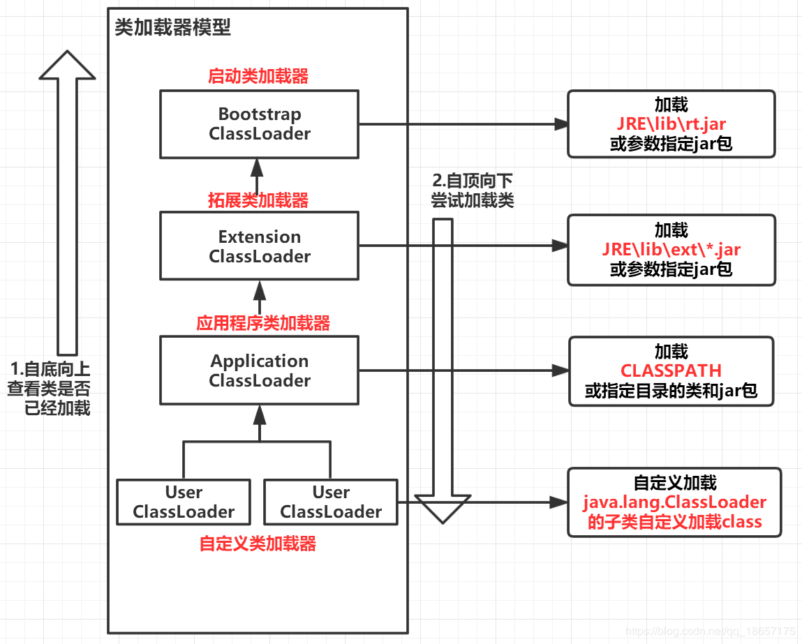
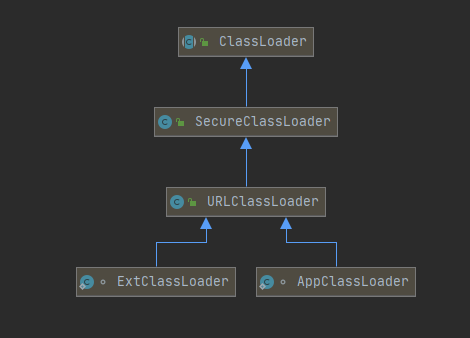
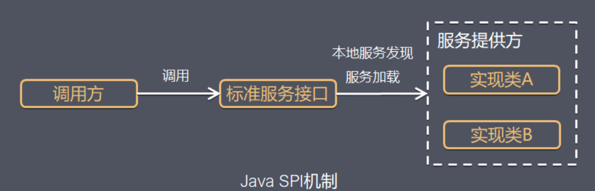
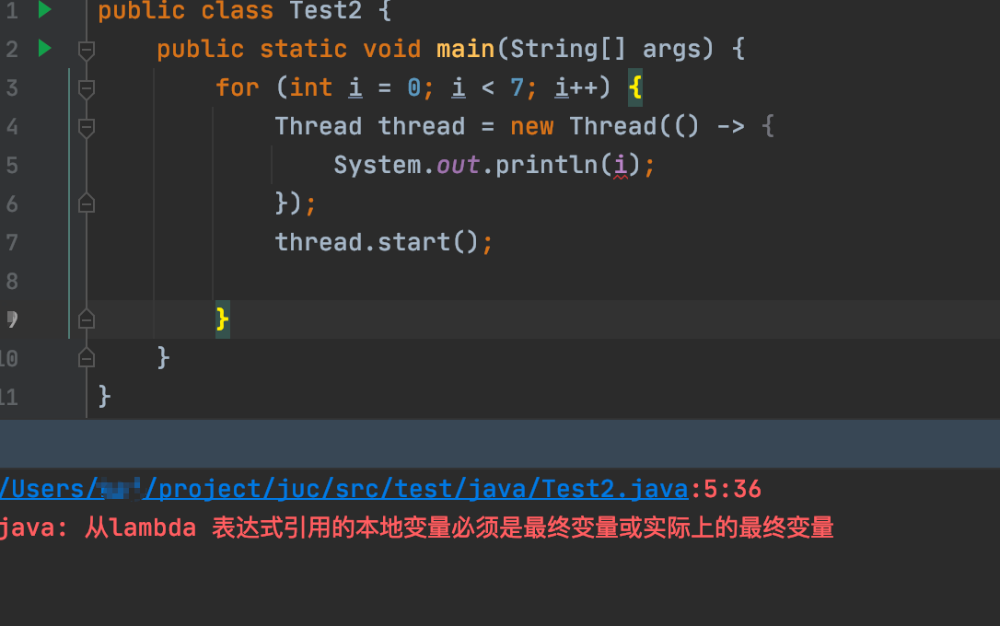
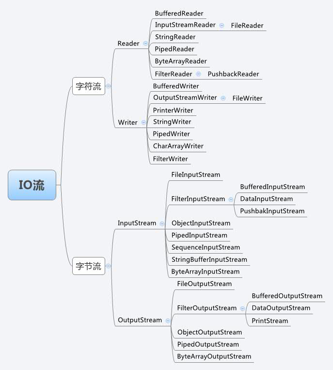
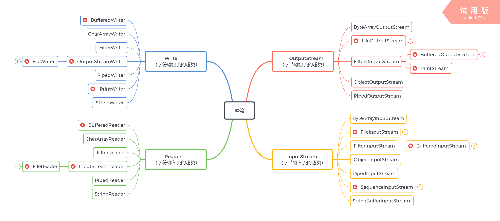
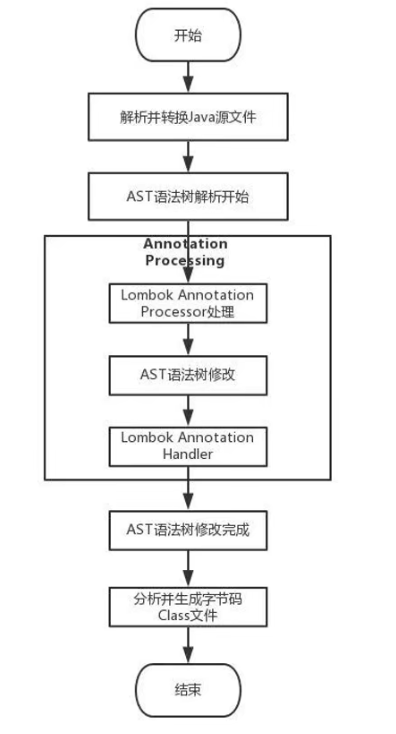

# 基本语法


>  Is there a Java equivalent of Python's 'enumerate' function?

https://stackoverflow.com/questions/7167253/is-there-a-java-equivalent-of-pythons-enumerate-function

```java
// 方法一
import java.util.ListIterator;  
import java.util.List;

List<String> numbers = Arrays.asList("zero", "one", "two");
ListIterator<String> it = numbers.listIterator();
while (it.hasNext()) {
    System.out.println(it.nextIndex() + " " + it.next());
}
```

```java
// 方法二
String[] numbers = {"zero", "one", "two"}
for (int i = 0; i < numbers.length; i++) // Note that length is a property of an array, not a function (hence the lack of () )
    System.out.println(i + " " + numbers[i]);
}
```

## 反射

Java中有一个名为Class的类，该类在运行时保留有关对象和类的所有信息。

个人理解Class类就是用来描述类的类，描述了类有哪些构造器，方法，字段。

Class对象描述了特定类的属性。该对象用于执行反射。

```java
//创建一个Dog类的对象
Dog d1 = new Dog();

//使用getClass()创建Class对象
Class obj = d1.getClass();

//查找由Dog实现的接口
Class[] objInterface = obj.getInterfaces();

//以整数形式获取Dog的访问修饰符
int modifier = obj.getModifiers();
System.out.println("修饰符： " + Modifier.toString(modifier));

//找到Dog的超类
Class superClass = obj.getSuperclass();
System.out.println("Superclass: " + superClass.getName());

// 获取新实例， public T newInstance();
```


```java
// 我们可以使用Field类提供的各种方法检查和修改类的不同字段。
getFields() - 返回该类及其超类的所有公共字段
getDeclaredFields()  - 返回类的所有字段
getModifiers() - 以整数形式返回字段的修饰符
set(classObject,value) - 使用指定的值设置字段的值
get(classObject) - 获取字段的值
setAccessible(boolean) - 使私有字段可访问
// 注意：如果我们知道字段名称，则可以使用
getField("fieldName"） - 从类返回名称为fieldName的公共字段。
getDeclaredField("fieldName"） - 从类返回名称为fieldName的字段。

// 我们可以使用Method类提供的各种方法来检查类的不同方法。
getMethods() - 返回该类及其超类的所有公共方法
getDeclaredMethod() - 返回该类的所有方法
getName() - 返回方法的名称
getModifiers() - 以整数形式返回方法的访问修饰符
getReturnType() - 返回方法的返回类型
                 
// 我们还可以使用Constructor类提供的各种方法检查类的不同构造函数。
getConstructors() - 返回该类的所有公共构造函数以及该类的超类
getDeclaredConstructor() -返回所有构造函数
getName() - 返回构造函数的名称
getModifiers() - 以整数形式返回构造函数的访问修饰符
getParameterCount() - 返回构造函数的参数数量
```


## 泛型

参考：https://itimetraveler.github.io/2016/12/27/%E3%80%90Java%E3%80%91%E6%B3%9B%E5%9E%8B%E4%B8%AD%20extends%20%E5%92%8C%20super%20%E7%9A%84%E5%8C%BA%E5%88%AB%EF%BC%9F/


### 创建泛型类


```java
public class demo {
    public static void main(String[] args) throws ClassNotFoundException {
        GenericsClass<Integer> intObj = new GenericsClass<>(5);
        System.out.println(intObj.getClass());  // class tmp.GenericsClass
        System.out.println(intObj.getData().getClass());  // class java.lang.Integer
        System.out.println(intObj.getData());  // 5

        GenericsClass<String> stringGenericsClass = new GenericsClass<>("1");
        System.out.println(stringGenericsClass.getData().getClass());  // class java.lang.String
        System.out.println(stringGenericsClass.getData());  // 1
        stringGenericsClass.setNull();
        System.out.println(stringGenericsClass.getData());  // null
    }
}

class GenericsClass<T> {
    private T data;

    public GenericsClass(T data) {
        this.data = data;
    }

    public T getData() {
        return this.data;
    }

    public void setNull() {
        this.data = null;
    }
}
```


### 创建泛型方法

```java
class Main {
  public static void main(String[] args) {
    //使用Integer数据初始化类
    DemoClass demo = new DemoClass();
    demo.<String>genericsMethod("Java Programming");  // <String>可省略
    demo.genericsMethod(100);
  }
}

class DemoClass {
  //泛型方法, 传入的数据类型可以任意
  public <T> void genericsMethod(T data) {
    System.out.println("这是一个泛型方法。具体类型为" + data.getClass());
    System.out.println("传递给方法的数据是 " + data);
  }
}
```


### 有界类型

```java
<T extends A>  // T只能接受A的子类型的数据。
```

```java
<T super B>  // T只能接受B的父类型的数据。
```


### PECS原则

PECS（Producer Extends Consumer Super）

频繁往外读取内容的，适合用<? extends T>。  // 个人理解是泛型最好只取值，不赋值，赋值往往很多问题

经常往里插入的，适合用<? super T>


## 注解

### 预定义注解:

```
@Deprecated
@Override
@SuppressWarnings
@SafeVarargs // 抑制编译器对变量参数的警告
@FunctionalInterface // 函数式接口
```


### 元注解：
https://juejin.cn/post/6844903943269548045  这个文章讲的不错

```
@Retention  // 被描述的注解在它所修饰的类中可以被保留到何时，用来描述注解的生命周期
生命周期长度 SOURCE < CLASS < RUNTIME， 前者能作用的地方后者一定也能作用。
如果需要在运行时去动态获取注解信息，那只能用 RUNTIME 注解；
如果要在编译时进行一些预处理操作，比如生成一些辅助代码（如 ButterKnife），就用 CLASS注解；
如果只是做一些检查性的操作，比如 @Override 和 @SuppressWarnings，则可选用 SOURCE 注解。
public enum RetentionPolicy {
    SOURCE,    // 源文件保留
    CLASS,       // 编译期保留，默认值
    RUNTIME   // 运行期保留，可通过反射去获取注解信息
}

@Documented  // 在使用 javadoc 工具为类生成帮助文档时保留其注解信息。

@Target // 被修饰的注解可以用在什么地方
public enum ElementType {
    TYPE, // 类、接口、枚举类
    FIELD, // 成员变量（包括：枚举常量）
    METHOD, // 成员方法
    PARAMETER, // 方法参数
    CONSTRUCTOR, // 构造方法
    LOCAL_VARIABLE, // 局部变量
    ANNOTATION_TYPE, // 注解类
    PACKAGE, // 可用于修饰：包
    TYPE_PARAMETER, // 类型参数，JDK 1.8 新增
    TYPE_USE // 使用类型的任何地方，JDK 1.8 新增
}


@Inherited  // 如果某个类使用了被@Inherited修饰的注解，则其子类将自动具有该注解
@Repeatable // 即允许在同一申明类型（类，属性，或方法）前多次使用同一个类型注解。
```


### 自定义注解：

```
@Retention(RetentionPolicy.RUNTIME)
@Target(ElementType.FIELD)
public @interface Name {
    public String value() default "";
}
```


@Inherited

```java
import java.lang.annotation.*;
import java.util.Arrays;


@Retention(RetentionPolicy.RUNTIME)
@Target(ElementType.TYPE)
@Inherited
@interface IsInheritedAnnotation {

}

@Retention(RetentionPolicy.RUNTIME)
@Target(ElementType.TYPE)
@interface NoInheritedAnnotation {

}


@NoInheritedAnnotation
@IsInheritedAnnotation
class InheritedBase {
}

class MyInheritedClass extends InheritedBase {
}


@NoInheritedAnnotation
@IsInheritedAnnotation
interface InheritedInterface {
}

interface InheritedInterfaceChild extends InheritedInterface {
}


class MyInheritedClassUseInterface implements InheritedInterface {
}

public class Test {
    public static void main(String[] args) {
        // 结论1
        // @IsInheritedAnnotation注解被元注解@Inherited修饰， 父类InheritedBase加了@IsInheritedAnnotation注解， 子类MyInheritedClass也会有@IsInheritedAnnotation注解
        Annotation[] annotations = MyInheritedClass.class.getAnnotations();
        System.out.println(Arrays.toString(annotations)); // [@test.IsInheritedAnnotation()]

        Annotation[] annotations1 = InheritedInterface.class.getAnnotations();
        System.out.println(Arrays.toString(annotations1)); // [@test.NoInheritedAnnotation(), @test.IsInheritedAnnotation()]

        // 结论2
        // 子类接口不会继承父类接口的任何注解
        Annotation[] annotations2 = InheritedInterfaceChild.class.getAnnotations();
        System.out.println(Arrays.toString(annotations2)); // []

        // 结论3
        // 实现接口，不会继承接口的任何注解
        Annotation[] annotations3 = MyInheritedClassUseInterface.class.getAnnotations();
        System.out.println(Arrays.toString(annotations3)); // []
    }
}
```


## 枚举

```java
public class Test
{
    enum Color
    {
        RED, GREEN, BLUE;
    }
 
    // 执行输出结果
    public static void main(String[] args)
    {
        Color c1 = Color.RED; 
        System.out.println(c1); // RED
        
        for (Color myVar : Color.values()) {
      		System.out.println(myVar);  // RED, GREEN BLUE
    	}
        
        Color myVar = Color.BLUE;
        switch(myVar) {
            case RED:
                System.out.println("红色");
                break;
            case GREEN:
                System.out.println("绿色");
                break;
            case BLUE:
                System.out.println("蓝色");
                break;
        }
        
        // 调用 values()
        Color[] arr = Color.values();
 
        // 迭代枚举
        for (Color col : arr)
        {
            // 查看索引
            System.out.println(col + " at index " + col.ordinal());
        }
 
        // 使用 valueOf() 返回枚举常量，不存在的会报错 IllegalArgumentException
        System.out.println(Color.valueOf("RED"));
        // System.out.println(Color.valueOf("WHITE"));
    }
}
```


## 异常

Java异常总结文档： https://www.jianshu.com/p/188cbc07d2f3


Throwable分为Error, Exception
Error分为Virtual MachineError和AWTError （比如OOM异常）
Exception分为RuntimeException和IOException
		RuntimeException （是非检查异常， 比如NullPointerException、ArrayIndexOutOfBoundsException）
		IOException（是检查异常，编译期强制要求的，必须进行处理）


# 类


## 类加载器

参考链接

https://www.bilibili.com/video/BV16T4y1P79h?p=2

https://blog.nowcoder.net/n/0597892d34ae4023add7406cbbe388d0?from=nowcoder_improve


>  类加载器相关示例代码

```java
package org.example;

public class ClassLoaderDemo {
    public static void main(String[] args) {
        ClassLoader classLoader1 = ClassLoaderDemo.class.getClassLoader();
        // app类加载器
        // classLoader1 ->sun.misc.Launcher$AppClassLoader@18b4aac2
        System.out.println("classLoader1 -> " + classLoader1);
        // 扩展类加载器
        // classLoader1's parent ->sun.misc.Launcher$ExtClassLoader@1b6d3586
        System.out.println("classLoader1's parent -> " + classLoader1.getParent());

        // 启动类加载器 BootStrap ClassLoader 由C++开发，是JVM虚拟机的一部分， 本身不是Java类，所以这里显示null
        // classLoader1's grandparent ->null
        System.out.println("classLoader1's grandparent -> " + classLoader1.getParent().getParent());
        // int，String，List等基础类由启动类加载器加载
        // int class loader ->null
        System.out.println("int class loader -> " + int.class.getClassLoader());
        // String class loader ->null
        System.out.println("String class loader -> " + String.class.getClassLoader());
        // List class loader -> null
        System.out.println("List class loader -> " + java.util.List.class.getClassLoader());

        // java指令可以通过增加 -verbose:class -verbose:gc 格式的参数在启动时打印出类加载情况
        // BootStrap ClassLoader 加载java基础类， 这个属性不能在java指令中指定，推断不是由java语言处理。
        // BootStrap ClassLoader加载目录：C:\Program Files\Java\jdk1.8.0_311\jre\lib\resources.jar;C:\Program Files\Java\jdk1.8.0_311\jre\lib\rt.jar;C:\Program Files\Java\jdk1.8.0_311\jre\lib\sunrsasign.jar;C:\Program Files\Java\jdk1.8.0_311\jre\lib\jsse.jar;C:\Program Files\Java\jdk1.8.0_311\jre\lib\jce.jar;C:\Program Files\Java\jdk1.8.0_311\jre\lib\charsets.jar;C:\Program Files\Java\jdk1.8.0_311\jre\lib\jfr.jar;C:\Program Files\Java\jdk1.8.0_311\jre\classes
        System.out.println("BootStrap ClassLoader加载目录：" + System.getProperty("sun.boot.class.path"));
        // Extension ClassLoader 加载JAVA_HOME/ext下的jar包。 可通过-D java.ext.dirs另行指定目录
        // Extension ClassLoader加载目录：C:\Program Files\Java\jdk1.8.0_311\jre\lib\ext;C:\WINDOWS\Sun\Java\lib\ext
        System.out.println("Extension ClassLoader加载目录：" + System.getProperty("java.ext.dirs"));
        // Application ClassLoader 加载CLASSPATH应用下的jar包。 可通过-D java.class.path另行指定目录
        // Application ClassLoader加载目录：C:\Program Files\Java\jdk1.8.0_311\jre\lib\charsets.jar;C:\Program Files\Java\jdk1.8.0_311\jre\lib\deploy.jar;C:\Program Files\Java\jdk1.8.0_311\jre\lib\ext\access-bridge-64.jar;C:\Program Files\Java\jdk1.8.0_311\jre\lib\ext\cldrdata.jar;C:\Program Files\Java\jdk1.8.0_311\jre\lib\ext\dnsns.jar;C:\Program Files\Java\jdk1.8.0_311\jre\lib\ext\jaccess.jar;C:\Program Files\Java\jdk1.8.0_311\jre\lib\ext\jfxrt.jar;C:\Program Files\Java\jdk1.8.0_311\jre\lib\ext\localedata.jar;C:\Program Files\Java\jdk1.8.0_311\jre\lib\ext\nashorn.jar;C:\Program Files\Java\jdk1.8.0_311\jre\lib\ext\sunec.jar;C:\Program Files\Java\jdk1.8.0_311\jre\lib\ext\sunjce_provider.jar;C:\Program Files\Java\jdk1.8.0_311\jre\lib\ext\sunmscapi.jar;C:\Program Files\Java\jdk1.8.0_311\jre\lib\ext\sunpkcs11.jar;C:\Program Files\Java\jdk1.8.0_311\jre\lib\ext\zipfs.jar;C:\Program Files\Java\jdk1.8.0_311\jre\lib\javaws.jar;C:\Program Files\Java\jdk1.8.0_311\jre\lib\jce.jar;C:\Program Files\Java\jdk1.8.0_311\jre\lib\jfr.jar;C:\Program Files\Java\jdk1.8.0_311\jre\lib\jfxswt.jar;C:\Program Files\Java\jdk1.8.0_311\jre\lib\jsse.jar;C:\Program Files\Java\jdk1.8.0_311\jre\lib\management-agent.jar;C:\Program Files\Java\jdk1.8.0_311\jre\lib\plugin.jar;C:\Program Files\Java\jdk1.8.0_311\jre\lib\resources.jar;C:\Program Files\Java\jdk1.8.0_311\jre\lib\rt.jar;D:\Project\remote\target\classes;C:\JetBrains\IntelliJ_IDEA_2020_2_4\lib\idea_rt.jar
        System.out.println("Application ClassLoader加载目录：" + System.getProperty("java.class.path"));
    }
}

```


> Java的类加载体系

```shell
BootStrapClassLoader -> ExtClassLoader ->  AppClassLoader  # 每种类加载器都有自己的加载目录

# ExtClassLoader 指定jar包路径的参数： -Djava.ext.dirs=/opt/java/ext/lib
# AppClassLoader 指定jar包路径的参数：-Djava.class.path=/opt/module/project
```


类加载器模型如下图（**注意： 每个类加载器都会缓存已经加载过的类**）



### 双亲委派机制

双亲委派机制就是 当JVM收到一个类加载请求的时候，不会直接让当前类的类加载器加载该类，而是将请求委派给它的上层类加载器，这个过程一直持续到启动类加载器。如果上层的类加载器加载过了类， 就直接返回类， 如果类没有加载过，就自定向下尝试加载类， 如果找到了类就直接加载后返回，否则就抛出ClassNotFoundException异常

概括的说就是 双亲委派机制就是加载类的时候自底向上查看类是否已经加载，如果已经加载就直接返回。否则就自顶向下尝试加载类，如果能找到类就直接加载后返回，否则就抛出异常

源码在 java.lang.ClassLoader.java

```java
protected Class<?> loadClass(String name, boolean resolve)
        throws ClassNotFoundException
    {
        synchronized (getClassLoadingLock(name)) {
            // First, check if the class has already been loaded
            Class<?> c = findLoadedClass(name);
            if (c == null) {
                long t0 = System.nanoTime();
                try {
                    if (parent != null) {
                        c = parent.loadClass(name, false);
                    } else {
                        c = findBootstrapClassOrNull(name);
                    }
                } catch (ClassNotFoundException e) {
                    // ClassNotFoundException thrown if class not found
                    // from the non-null parent class loader
                }

                if (c == null) {
                    // If still not found, then invoke findClass in order
                    // to find the class.
                    long t1 = System.nanoTime();
                    c = findClass(name);

                    // this is the defining class loader; record the stats
                    sun.misc.PerfCounter.getParentDelegationTime().addTime(t1 - t0);
                    sun.misc.PerfCounter.getFindClassTime().addElapsedTimeFrom(t1);
                    sun.misc.PerfCounter.getFindClasses().increment();
                }
            }
            if (resolve) {
                resolveClass(c);
            }
            return c;
        }
    }
```

**为什么要使用双亲委派机制去加载类呢？**

避免自定义的类覆盖核心类库的行为。比如我们可以自定义一个java.lang.Object的类，如果没有双亲委派机制，那么java.lang.Object的类加载请求就可能被App ClassLoader处理，这样就会加载自定义的java.lang.Object从而屏蔽了核心类库中的Object，影响JVM的正常工作。


**自定义类加载器的优势：**

- 类加载器是 Java 语言的一项创新，也是 Java 语言流行的重要原因之一，它最初的设计是为了满足 java applet 的需求而开发出来的

- 高度的灵活性

- 通过自定义类加载器可以实现热部署 （热加载）
    - 很少用的原因，
    -  1是很容易出错，其中包括热加载的jar包在复制的过程中很容易出错。 编译阶段就可以检查出来的问题都延迟到了运行时
        - 2是每次热加载都要new 新的加载器，会产生很多垃圾对象
    - 相关实现
        - JReble
        - SpringBoot devtool 
    
- 代码加密

**自定义类加载器步骤：**

- 定义一个类，继承 ClassLoader

- 重写 loadClass 方法

- 实例化 Class 对象


### 代码中类加载器的继承关系



可以发现，应用类加载器和扩展类加载器不是继承关系，他们都继承了URLClassLoader


### 类的加载过程


一个类的的类加载过程通常分为**加载、连接、初始化**三个部分， 具体的行为在java虚拟机规范中有详细的定义， 这里大致说一下

- **加载**Loading：这个过程是Java将字节码数据从不同的数据源读取到JVM中，并映射成为JVM认可的数据结构。而如果输入的Class不符合JVM的规范，就会抛出异常，这个阶段是用户可以参与的阶段，我们自定义的类加载器，就是工作在这个过程。
- **连接**Linking：这个是核心的步骤。又可以大致分成三个小阶段： 
    - 1、**验证**： 检查JVM加载的字节信息是否符合Java虚拟机规范，否则就会报错。这个阶段是JVM的安全大门，防止黑客大神的恶意信息或者不合规信息危害JVM的正常运行
    - 2、 **准备**： 这一阶段创建类或接口的静态变量， 并给这些静态变量赋一个初始值（不是最终指定的值）， 这一个部分的作用更大的是**预分配内存**。
    - 3、 **解析**： 这一步主要是将常量池中的符号引用替换为直接引用。 例如我们有个类A调用类B的方法， 这些在代码层次还只是一些对计算机没有意义符号引用，在这一阶段就会转换成计算机所能理解的堆栈，引用等这些直接引用。
- **初始化**Initialization: 这一步才是真正去执行类初始化的代码逻辑， 包括执行static静态代码块，给静态变量赋值等。


### JDBC、Tomcat为什么要破坏双亲委派模型
https://www.javazhiyin.com/44347.html


## SPI  

SPI : SPI全称Service Provider Interface 服务提供者接口，是Java提供的一套用来被第三方实现或者扩展的API，它可以用来启用框架扩展和替换组件。

参考 https://www.jianshu.com/p/46b42f7f593c

基本概念

```
Java SPI 实际上是“基于接口的编程＋策略模式＋配置文件”组合实现的动态加载机制。

系统设计的各个抽象，往往有很多不同的实现方案，在面向的对象的设计里，一般推荐模块之间基于接口编程，模块之间不对实现类进行硬编码。一旦代码里涉及具体的实现类，就违反了可拔插的原则，如果需要替换一种实现，就需要修改代码。为了实现在模块装配的时候能不在程序里动态指明，这就需要一种服务发现机制。
Java SPI就是提供这样的一个机制：为某个接口寻找服务实现的机制。有点类似IOC的思想，就是将装配的控制权移到程序之外，在模块化设计中这个机制尤其重要。所以SPI的核心思想就是解耦。
```




使用SPI的场景

- JDBC的Driver接口
- Dubbo
- ShardingSphere
- Spring


使用Java SPI，需要遵循如下约定：

- 1、当服务提供者提供了接口的一种具体实现后，在jar包的META-INF/services目录下创建一个以“接口全限定名”为命名的文件，内容为实现类的全限定名；
- 2、接口实现类所在的jar包放在主程序的classpath中；
- 3、主程序通过java.util.ServiceLoder动态装载实现模块，它通过扫描META-INF/services目录下的配置文件找到实现类的全限定名，把类加载到JVM；
- 4、SPI的实现类必须携带一个不带参数的构造方法；


使用Java SPI的优点

使用Java SPI机制的优势是实现解耦，使得第三方服务模块的装配控制的逻辑与调用者的业务代码分离，而不是耦合在一起。应用程序可以根据实际业务情况启用框架扩展或替换框架组件。


## lambda

在lambda表达式执行时，jvm会先为该lambda生成一个java类，然后再创建一个该类对应的对象。

那lambda每次执行都会创建一个新对象吗?  答案是看情况。 

​	如果lambda引用了上下文变量，且变量更新了，lambda就会重新创建一个该类对应的对象

​    如果lambda没有引用上下文变量，获取引用的上下文变量没有更新，那么lambda表达式对象还是用上次创建的

参考：https://cloud.tencent.com/developer/article/1572212


> 问: 	为什么lambda 表达式引用的本地变量必须是最终变量或实际上的最终变量 ?

答： 加final，变量会存在堆中的方法区里，子线程共享进程的堆，所以能读到。否则是存在另一个线程的栈中，不同线程读不到




参考：https://www.bilibili.com/read/cv8023087

lambda表达式示例

```java
Arrays.sort(array, (s1, s2) -> s1.compareTo(s2));
```

```java
list.forEach(System.out::println) //也是Java 8中的Lambda写法之一
```


## 构造方法

```
识别合法的构造方法；
  1 构造方法可以被重载，一个构造方法可以通过this关键字调用另一个构造方法，this语句必须位于构造方法的第一行；！！！
    重载：方法的重载(overload)：重载构成的条件：方法的名称相同，但参数类型或参数个数不同，才能构成方法的重载。 
  2 当一个类中没有定义任何构造方法，Java将自动提供一个缺省构造方法；
  3 子类通过super关键字调用父类的一个构造方法；（super和this必须在构造方法第一行！！！）
  4 当子类的某个构造方法没有通过super关键字调用父类的构造方法，通过这个构造方法创建子类对象时，会自动先调用父类的缺省构造方法
  5 构造方法不能被static、final、synchronized、abstract、native修饰，但可以被public、private、protected修饰；
  6 构造方法不是类的成员方法；
  7 构造方法不能被继承。
```

**当涉及到继承时，按照如下顺序执行：**

1. 执行父类的静态代码块，并初始化父类静态成员变量
2. 执行子类的静态代码块，并初始化子类静态成员变量
3. 执行父类的构造代码块，执行父类的构造函数，并初始化父类普通成员变量
4. 执行子类的构造代码块， 执行子类的构造函数，并初始化子类普通成员变量


参考：https://www.cnblogs.com/Qian123/p/5713440.html#_label1


## 权限控制修饰符


default 就是什么也不写

- **default** (即默认，什么也不写）: 在同一包内可见，不使用任何修饰符。使用对象：类、接口、变量、方法。
- **private** : 在同一类内可见。使用对象：变量、方法。 **注意：不能修饰类（外部类）**
- **public** : 对所有类可见。使用对象：类、接口、变量、方法
- **protected** : 对同一包内的类和所有子类可见。使用对象：变量、方法。 **注意：不能修饰类（外部类）**。protect 详解https://www.runoob.com/w3cnote/java-protected-keyword-detailed-explanation.html (**说实话没搞明白**)


## java 对象销毁时操作

// 重写finalize方法， jvm会调用

```java
// Java code to show the
// overriding of finalize() method

import java.lang.*;

// Defining a class demo since every java class
// is a subclass of predefined Object class
// Therefore demo is a subclass of Object class
public class demo {
	protected void finalize() throws Throwable
	{
		try {
			System.out.println("inside demo's finalize()");
		}
		catch (Throwable e) {
			throw e;
		}
		finally {
			System.out.println("Calling finalize method" + " of the Object class");
			// Calling finalize() of Object class
			super.finalize();
		}
	}

	// Driver code
	public static void main(String[] args) throws Throwable
	{
		// Creating demo's object
		demo d = new demo();
		// Calling finalize of demo
		d.finalize();
	}
}

```


## Object类的方法

https://fangjian0423.github.io/2016/03/12/java-Object-method/

理解wait() notify() synchronized()

```java
package com.sangfor.alphasecurity.hwj;

public class WaitNotifyTest {

    public static void main(String[] args) {
        Factory factory = new Factory();
        new Thread(new Producer(factory, 5)).start();
        new Thread(new Producer(factory, 5)).start();
        new Thread(new Producer(factory, 20)).start();
        new Thread(new Producer(factory, 30)).start();
        new Thread(new Producer(factory, 30)).start();
        new Thread(new Producer(factory, 30)).start();
        new Thread(new Consumer(factory, 10)).start();
        new Thread(new Consumer(factory, 20)).start();
        new Thread(new Consumer(factory, 5)).start();
        new Thread(new Consumer(factory, 5)).start();
        new Thread(new Consumer(factory, 20)).start();
        new Thread(new Consumer(factory, 30)).start();
        new Thread(new Consumer(factory, 30)).start();
    }

}

class Factory {

    public static final Integer MAX_NUM = 50;

    private int currentNum = 0;

    public void consume(int num) throws InterruptedException {
        synchronized (this) {
            while(currentNum - num < 0) {
                this.wait();
            }
            currentNum -= num;
            System.out.println("consume " + num + ", left: " + currentNum);
            this.notifyAll();
        }
    }

    public void produce(int num) throws InterruptedException {
        synchronized (this) {
            while(currentNum + num > MAX_NUM) {
                this.wait();
            }
            currentNum += num;
            System.out.println("produce " + num + ", left: " + currentNum);
            this.notifyAll();
        }
    }

}

class Producer implements Runnable {
    private final Factory factory;
    private final int num;
    public Producer(Factory factory, int num) {
        this.factory = factory;
        this.num = num;
    }
    @Override
    public void run() {
        try {
            factory.produce(num);
        } catch (InterruptedException e) {
            e.printStackTrace();
        }
    }
}


class Consumer implements Runnable {
    private final Factory factory;
    private final int num;
    public Consumer(Factory factory, int num) {
        this.factory = factory;
        this.num = num;
    }
    @Override
    public void run() {
        try {
            factory.consume(num);
        } catch (InterruptedException e) {
            e.printStackTrace();
        }
    }
}
```


为什么尽量不要Override finalize方法？

https://yfsyfs.github.io/2019/06/28/%E4%B8%BA%E4%BB%80%E4%B9%88%E5%B0%BD%E9%87%8F%E4%B8%8D%E8%A6%81Override-finalize%E6%96%B9%E6%B3%95/


可以使用try(){}语句 : try()括号中的资源会自动调用close()方法


# 接口


# IO

## 写操作


使用org.apache.commons.io.FileUtils

```java
import org.apache.commons.io.FileUtils;

import java.io.File;
import java.io.IOException;
import java.nio.charset.StandardCharsets;

public class MyWriteFile {
    public static void main(String[] args) {
        File file = new File("/home/hwj/test.json");
        try {
            // 往test.json文件中写入"test"字符串
            FileUtils.write(file, "test", StandardCharsets.UTF_8); 
        } catch (IOException e) {
            e.printStackTrace();
        }
    }
}
```


## IO流

参考https://www.cnblogs.com/oubo/archive/2012/01/06/2394638.html



参考：https://www.cnblogs.com/hopeyes/p/9736642.html




字节流和字符流的区别 https://blog.csdn.net/u011578734/article/details/108346469

- 字节流操作的基本单元为字节；字符流操作的基本单元为Unicode码元(2个字节)。

- 字节流默认不使用缓冲区；字符流使用缓冲区
- 字节流可用于任何类型的对象，包括二进制对象，而字符流只能处理字符或者字符串

在从字节流转化为字符流时，实际上就是byte[]转化为String时，而在字符流转化为字节流时，实际上是String转化为byte[]时。


### IO 流 的优雅关闭

参考https://blog.csdn.net/fangyuandoit/article/details/88175413

利用apache的IOUtils, 或者从apache的IOUilts拷贝代码

```java
import java.io.*;

public class Utils {
    /**
     * 注意，使用此方法的对象要实现序列化接口
     */
    @SuppressWarnings("unchecked")
    public static <T> T deepClone(T obj) {
        ByteArrayOutputStream bos = null;
        ObjectOutputStream oos = null;
        ByteArrayInputStream bis = null;
        ObjectInputStream ois = null;

        T clonedObj = null;

        try {
            bos = new ByteArrayOutputStream();
            oos = new ObjectOutputStream(bos);
            oos.writeObject(obj);

            bis = new ByteArrayInputStream(bos.toByteArray());
            ois = new ObjectInputStream(bis);

            clonedObj = (T) ois.readObject();

        } catch (Exception ignored) {

        } finally {
            closeQuietly(ois, bis, oos, bos);
        }

        return clonedObj;
    }

    public static void closeQuietly(Closeable... closeables) {
        if (closeables != null) {
            for (Closeable closeable : closeables) {
                closeQuietly(closeable);
            }
        }
    }

    public static void closeQuietly(Closeable closeable) {
        try {
            if (closeable != null) {
                closeable.close();
            }
        } catch (Exception ignored) {

        }
    }

}
```


## 文件IO操作

```java
import org.apache.commons.io.FileUtils;

// 实际路径是resources/home/wordsCh.json 
String wordsPath = /home/wordsCh.json  
    
String path = 指定类.class.getResource(wordsPath).getPath();
// 如果windows下且路径中含有中文，空格等特殊字符,则加个.toURI
String path = 指定类.class.getResource(wordsPath).toURI.getPath();
String jsonStr = FileUtils.readFileToString(new File(path), StandardCharsets.UTF_8);
```

```java
import org.apache.commons.io.IOUtils;

//导入图
byte[] graphBytes = IOUtils.toByteArray(new FileInputStream(TestModel.class.getResource(PB_FILE_PATH).getPath()));
graph.importGraphDef(graphBytes);
```

```java
import org.apache.commons.io.FileUtils;

// 按行读文件，读成set
public static void main(String[] args) {
    String path = FileDemo.class.getResource("/a.txt").getPath();
    try {
        System.out.println(new HashSet<>(FileUtils.readLines(new File(path), StandardCharsets.UTF_8)));
    } catch (IOException e) {
        logger.error("loadWords [" + path + "] failed.");
        logger.error(ExceptionUtils.getStackTrace(e));
    }
}
```


## 文件监控

使用java.nio.file.FileSystems的WatchService监听文件变化

https://www.xncoding.com/2017/09/21/java/watchservice.html


什么是写时复制？

大多数操作系统都采用**写时复制（copy-on-write）来优化子进程的使用效率**

https://juejin.cn/post/6844903702373859335


# 集合


外网版本（用浏览器新建页面查看）


本地版


## 迭代器操作

获取大小

```java
IteratorUtils.toList(input.iterator()).size();  // input是Iterable<Object>对象
```


## List操作总结


//升序排序

```java
public static void testListSort() {
    List<Integer> integers = Arrays.asList(2, 5, 9, 4, 1, 3, 2);
    Collections.sort(integers);
    System.out.println(integers);  // [1, 2, 2, 3, 4, 5, 9]

    integers = Arrays.asList(2, 5, 9, 4, 1, 3, 2);
    integers.sort(Comparator.comparing(Integer::intValue));
    System.out.println(integers);  // [1, 2, 2, 3, 4, 5, 9]
}

public static void testListSortReverse() {
    List<Integer> integers = Arrays.asList(2, 5, 9, 4, 1, 3, 2);
    integers.sort(Comparator.comparing(Integer::intValue).reversed());
    System.out.println(integers);  // [9, 5, 4, 3, 2, 2, 1]
}
```

//求和

```java
public static void testListSum() {
    List<Integer> integers = Arrays.asList(1, 2, 3, 4, 5);
    int sum = integers.stream().mapToInt(Integer::intValue).sum();
    System.out.println(sum);
}
```
// 统计列表中出现最多的元素

```java
    public static void main(String[] args) {
        List<String> list = new ArrayList<>();
        list.add("2");
        list.add("2");
        list.add("2");
        list.add("2");
        list.add("2");
        list.add("2");
        list.add("3");
        list.add("3");
        list.add("4");
        list.add("1");
        list.add("1");
        list.add("1");
        list.add("1");
        Map<String, Long> map = list.stream().collect(Collectors.groupingBy(x -> x, Collectors.counting()));
        System.out.println(JSON.toJSONString(map));
        Map<String, Long> result = new LinkedHashMap<>();
        map.entrySet().stream().sorted(Map.Entry.<String, Long>comparingByValue().reversed()).forEachOrdered(e -> result.put(e.getKey(), e.getValue()));
        System.out.println(JSON.toJSONString(result));
    }

```

```java
public static void getElementCount() {
        List<Integer> integers = Arrays.asList(1, 1, 1, 2, 2, 2, 2, 4, 4, 4, 4, 4, 4, 4);
        Map<Integer, Long> map = integers.stream().collect(Collectors.groupingBy(Integer::intValue, Collectors.counting()));
        System.out.println(map);
        LinkedHashMap<Integer, Long> result = new LinkedHashMap<>();
        map.entrySet().stream().sorted(Map.Entry.<Integer, Long>comparingByValue().reversed()).limit(10).forEachOrdered(e-> result.put(e.getKey(), e.getValue()));
        System.out.println(result);
        for (Integer integer : result.keySet()) {
            System.out.println(result.get(integer));
        }
    }
```


// 列表转数组

```java
public static void main(String[] args) {
        ArrayList<Integer> integers = new ArrayList<>(Arrays.asList(1, 2, 3, 4, 5));
        int[] ints = integers.stream().mapToInt(Integer::intValue).toArray();
        System.out.println(Arrays.toString(ints));  // [1, 2, 3, 4, 5]
    }
```


/guava创建空列表

```java
import com.google.common.collect.Lists; 
Lists.newArrayList()
   
```

 空的map set同理


### LinkedList

LinkedList是双向链接串列(doubly LinkedList)。

LinkedList插入和删除比ArrayList更快，但是需要更多的内存，访问速度更慢。

```java
LinkedList<Integer> list = new LinkedList<Integer>() {{
    add(1);
    add(2);
    add(3);
}};
```


## Map操作总结

map初始化

```java
 private static final Map<String,String> urlMap =new HashMap<String, String>() {
        {
            put("url1", "http://news.sina.com.cn");//新浪新闻
            put("url2", "http://news.163.com");//网易新闻
            put("url3", "http://news.qq.com");//腾讯新闻
            put("url4", "http://news.baidu.com");//百度新闻
            put("url5", "http://www.ifeng.com");//凤凰网
        }
    };
```

map转list

```java
public static void main(String[] args) {
    Map<String, String> map = new HashMap<>();
    map.put("123","===123===");
    map.put("456","===456===");
    List<String> list = new ArrayList<>(map.values());
    System.out.println(list);
}
```


HashMap computeIfAbsent() 方法 作用？
就很像python 的setdefault(), 参考： https://www.runoob.com/java/java-hashmap-computeifabsent.html
类似的有putIfAbsent() ,参考： https://www.runoob.com/java/java-hashmap-putifabsent.html


guava 的 ImmutableMap

ImmutableMap.of(k1, v1, k2,v2  ....)


**LinkedHashMap**


## Set操作总结

```java
// 测试Set<Integer> contains int
public static final int RCODE_OK = 0;
public static final int RCODE_ERROR = 2;
public static final int RCODE_NOT_FIND = 3;
public static final Set<Integer> RCODE_TYPES = new HashSet<>(Arrays.asList(RCODE_OK, RCODE_NOT_FIND));
```

```java
System.out.println("abc.com".substring(3));
System.out.println(RCODE_TYPES.contains(0));
```


## Stream操作总结

入门： https://zhuanlan.zhihu.com/p/299064490


参考  https://www.jianshu.com/p/0687e7003eb2

List<Float> 转换成 float[]   参考：https://stackoverflow.com/questions/4837568/java-convert-arraylistfloat-to-float

```java
// List<Integer> 和 List<Double> 转换成 int[], double[]可以通过stream mapToInt mapToDouble
ArrayList<Integer> integers = new ArrayList<>(Arrays.asList(1, 2, 3, 4, 5));
int[] ints = integers.stream().mapToInt(Integer::intValue).toArray();
System.out.println(Arrays.toString(ints));  // [1, 2, 3, 4, 5]

List<Double> doubles = new ArrayList<>(Arrays.asList(1d,2d,3d,4d,5d));
double[] doubles1 = doubles.stream().mapToDouble(Double::doubleValue).toArray();
System.out.println(Arrays.toString(doubles1));

// 但是List<Float> 转换成 float[] 不能！ 因为不存在mapToFloat!!! 网上找发现： 
ArrayList<Float> floats = new ArrayList<>(Arrays.asList(1f, 2f, 3f, 4f, 5f));
// new Float[0]生成是长度为0的空Float[]
float[] floats1 = ArrayUtils.toPrimitive(floats.toArray(new Float[0]), 0.0f); 
System.out.println(Arrays.toString(floats1));
```


> 字符串去重

```java
Set<Character> collect = "abcdefabcdef".chars().mapToObj(i -> (char) i).collect(Collectors.toSet());
        System.out.println(collect);

```


> 提取出list中bean的某一属性

```java
// DetectData是一个bean
List<String> domainList = detectDataList.stream().map(DetectData::getDomain).collect(Collectors.toList());
```


> **java8Stream map和flatmap的区别**

flatmap可以将map生成的单个流合并成一个流，即扁平化成一个流。

https://www.cnblogs.com/wangjing666/p/9999666.html

```java
public class demo {
    public static void main(String[] args) {
        testMap();
        testFlatMap();
    }

    public static void testMap() {
        String[] words = new String[]{"Hello", "World"};
        List<String[]> a = Arrays.stream(words)
                .map(word -> word.split(""))
                .distinct()
                .collect(Collectors.toList());
        System.out.println(a);  // [[Ljava.lang.String;@25f38edc, [Ljava.lang.String;@1a86f2f1]
    }

    public static void testFlatMap() {
        String[] words = new String[]{"Hello","World"};
        List<String> a = Arrays.stream(words)
                .map(word -> word.split(""))
                .flatMap(Arrays::stream)
                .distinct()
                .collect(Collectors.toList());
        a.forEach(System.out::print);  // HeloWrd
    }

}
```


> flatMap等价写法

```java
// 第一种
String[] words = new String[]{"Hello","World"};
List<String> a = Arrays.stream(words)
        .map(word -> word.split(""))
        .flatMap(Arrays::stream)
        .distinct()
        .collect(toList());
a.forEach(System.out::print);
```

```java
// 第二种
String[] words = new String[]{"Hello","World"};
List<String> collect = Stream.of(words).map(i -> i.split("")).flatMap(Stream::of).collect(toList());
```

```java
// 第三种
List<String> collect = Stream.of(words).flatMap(word -> Stream.of(word.split(""))).collect(toList());
```


> 去几个值中的最小值

```java
Optional<Integer> proofCountOptional = Stream.of(subDomains.size(), answers.size(), tsList.size(), 20).min(Integer::compareTo);
        int proofCount = proofCountOptional.orElse(0);
```


> 统计每个元素的个数

```java
int[] arr=new int[]{5,1,3,4,1};
//若统计的是int数组，先转化为List
List<Integer> list= Arrays.stream(arr).boxed().collect(Collectors.toList());
//groupingBy分组
Map<Integer, Long> map = list.stream().collect(Collectors.groupingBy(Function.identity(), Collectors.counting()));
//控制台输出map
map.forEach((k,v)->{
      System.out.println("k="+k+",v="+v);
});
```


> 判断是否所有元素都为1

```java
list.stream().allMatch(x -> x == 1)
```


> 将集合中的null元素设置为默认值

```shell
List<String> list = Arrays.asList("1", "2", "3", null);
List<String> newList = list.stream().map(str->Optional.ofNullable(str).orElse("10")).collect(Collectors.toList());
System.out.println(newList);  // [1, 2, 3, 10]  null 变成了默认值10
```


## Stack操作总结

栈是Vector的一个子类，它实现了一个标准的后进先出的栈。

```java
//常用的方法
Object peek( ) // 查看堆栈顶部的对象，但不从堆栈中移除它。
Object pop( ) // 移除堆栈顶部的对象，并作为此函数的值返回该对象。
Object push(Object element)  // 把项压入堆栈顶部。
```


## Vector操作总结

暂无


## Queue操作总结

队列接口方法

```java
add // 增加一个元索 如果队列已满，则抛出一个IIIegaISlabEepeplian异常
offer // 添加一个元素并返回true 如果队列已满，则返回false
put // 添加一个元素 如果队列满，则阻塞

remove // 移除并返回队列头部的元素 如果队列为空，则抛出一个NoSuchElementException异常
poll // 移除并返问队列头部的元素 如果队列为空，则返回null
take // 移除并返回队列头部的元素 如果队列为空，则阻塞
element // 返回队列头部的元素 如果队列为空，则抛出一个NoSuchElementException异常
peek // 返回队列头部的元素 如果队列为空，则返回null
```

实现队列接口的类

```java
Java 集合中的 Queue 继承自 Collection 接口 ， Deque(双端队列), LinkedList(双向链表), PriorityQueue, BlockingQueue 等类都实现了它。
```

队列方法总结

| 总结    | 抛出异常  | 返回特殊值 |
| ------- | --------- | ---------- |
| Insert  | add(e)    | offer(e)   |
| Remove  | remove()  | poll()     |
| Examine | element() | peek()     |


## 数组操作

// String转 ==》 char[]数组 ==》  转List
// 即String 转 List<Character>

```java
public static void stringToSetAndList() {
        String domain = "aabbcc";
        Set<Character> collect = domain.chars().mapToObj(i -> (char) i).collect(Collectors.toSet());
        List<Character> collect1 = domain.chars().mapToObj(i -> (char) i).collect(Collectors.toList());
        System.out.println(collect);
        System.out.println(collect1);
    }
```


数组初始化

```java
// 初始化空数组
new int[0];
new Integer[0];
// 初始化数组
new int[] {1,2,3};
// 初始化多维数组
int[][] ints = {{1, 2, 3}, {3, 4, 5}};
```


数组拷贝

```java
    public static void main(String[] args) {
        int[] ints = {1, 2, 3, 4, 5, 6};
        System.out.println(Arrays.toString(Arrays.copyOf(ints, 3))); // [1, 2, 3]
    }
```


二维数组的维度会改变， 并不是固定死的

```java
public static void main(String[] args) {
    float[][] floats = new float[5][10];
    System.out.println(Arrays.deepToString(floats));  // 打印出来是5*10
    for (int i = 0; i < floats.length; i++) {
        floats[i] = new float[]{i * 1f, i * 2f, i * 3f, i * 4f, i * 5f};
    }
    System.out.println(Arrays.deepToString(floats));  // 打印出来是5*5
}
```


降维

```java
// float[5][1]降维成float[5]
private static void test() {
    float[][] rawResults = new float[][] {{1f},{2f},{3f},{4f},{5f}};
    System.out.println(Arrays.deepToString(rawResults));
    // 降维
    List<Float> blackDomainProbabilities = new ArrayList<>();
    for (float[] rawResult : rawResults) {
        blackDomainProbabilities.add(rawResult[0]);
    }
    System.out.println(blackDomainProbabilities);
}
```


数组长度不足则高位填充0 , 比如要求输出是int[10]，给的输入是[1,2,3] 。 输出结果是[0,0,0,0,0,0,0,1,2,3]

下面给出一个类似的例子

```java
public class demo {
    public static void main(String[] args) {
        float[][] floats = padSequences(new float[][]{{1.0f, 2.0f, 3.0f}}, 10);
        System.out.println(Arrays.deepToString(floats));
    }
    /**
     * @param domainVectorArray 域名向量数组
     * @param n 需要返回的数组维度
     * @return 返回高位填充0的域名向量数组 domainVectorArrayWithPad
     * @Description: 例如要求返回数组float[10]，若输入[[1.0, 2.0, 3.0]] 则输出[[0.0, 0.0, 0.0, 0.0, 0.0, 0.0, 0.0, 1.0, 2.0, 3.0]]
     */
    private static float[][] padSequences(float[][] domainVectorArray, int n) {
        for (int i = 0; i < domainVectorArray.length; i++) {
            float[] domainVector = domainVectorArray[i];
            float[] domainVectorWithPad = new float[n];
            for (int j = 1; j <= domainVector.length; j++) {
                domainVectorWithPad[domainVectorWithPad.length - j] = domainVector[domainVector.length - j];
            }
            domainVectorArray[i] = domainVectorWithPad;
        }
        return domainVectorArray;
    }
}
```


数组填充默认值

```java
Long[] tsArray = new Long[10];
Arrays.fill(tsArray, 1645065478000L);
List<Long> tsList = Arrays.stream(tsArray).collect(Collectors.toList());
// 或者 List<Long> tsList = Arrays.asList(tsArray);
// 参考https://blog.csdn.net/yhf597869822/article/details/104626838
```


# 字符串

## 字符串方法

**字符串自带的常用方法** (参考菜鸟教程https://www.runoob.com/java/java-string.html)

```java
char charAt(int index);  //返回指定索引处的 char 值。
int compareTo(String anotherString) // 按ASCII字典顺序比较两个字符串。返回ASCII差值， 如果两个字符前面相同则返回长度差值
int compareToIgnoreCase(String str) // 按字典顺序比较两个字符串，不考虑大小写。
String concat(String str)  // 将指定字符串连接到此字符串的结尾。
boolean startsWith(String prefix)  // 测试此字符串是否以指定的前缀开始。
boolean endsWith(String suffix) // 测试此字符串是否以指定的后缀结束。
boolean equals(Object anObject)  // 将此字符串与指定的对象比较。
boolean equalsIgnoreCase(String anotherString) // 将此 String 与另一个 String 比较，不考虑大小写。
byte[] getBytes(String charsetName) // 使用指定的字符集将此 String 编码为 byte 序列，并将结果存储到一个新的 byte 数组中。
int indexOf(String str) // 返回指定字符在字符串中第一次出现处的索引，如果此字符串中没有这样的字符，则返回 -1
int lastIndexOf(String str) // 返回指定子字符串在此字符串中最右边出现处的索引，如果此字符串中没有这样的字符，则返回 -1。
int length() // 方法用于返回字符串的长度。
boolean matches(String regex)  // 效果等同于Pattern.matches(regex, str) 用于检测字符串是否匹配给定的正则表达式。
String replace(char searchChar, char newChar) // 方法通过用 newChar 字符替换字符串中出现的所有 searchChar 字符，并返回替换后的新字符串。
String replaceAll(String regex, String replacement) // 使用给定的参数 replacement 替换字符串所有匹配给定的正则表达式的子字符串。
String replaceAll(String regex, String replacement) // 使用给定的参数 replacement 替换字符串第一个匹配给定的正则表达式的子字符串。
String[] split(String regex, int limit) // split() 方法根据匹配给定的正则表达式来拆分字符串。
//注意： . 、 $、 | 和 * 等转义字符，必须得加 \\。
//注意：多个分隔符，可以用 | 作为连字符。
String trim() // 返回字符串的副本，忽略前导空白和尾部空白。
String valueOf(primitive data type x) //返回给定data type类型x参数的字符串表示形式。
```


**判断是否是全字母**  https://www.itranslater.com/qa/details/2136843502934819840

```xml
<dependency>
    <groupId>org.apache.commons</groupId>
    <artifactId>commons-lang3</artifactId>
    <version>3.12.0</version>
</dependency>
```

```java
// StringUtils 是org.apache.commons的commons-lang3包
public static void stringAllIsAlpha() {
    String str = "test1";
    System.out.println("test1 is all alpha? ==>" + StringUtils.isAlpha(str));  // false

    str = "test";
    System.out.println("test is all alpha? ==>" + StringUtils.isAlpha(str));  // true
}
```

```java
boolean allLetters = someString.chars().allMatch(Character::isLetter);  // chars()是stream流
```

```
public boolean isAlpha(String name) {
    return name.matches("[a-zA-Z]+");
}
```


**StringBuilder** 

StringBuffer 之间的最大不同在于 StringBuilder 的方法不是线程安全的（不能同步访问）。

StringBuffer常用方法

```java
public StringBuffer append(String s) // 将指定的字符串追加到此字符序列。
public StringBuffer reverse() // 将此字符序列用其反转形式取代。
replace(int start, int end, String str) // 使用给定 String 中的字符替换此序列的子字符串中的字符。
char charAt(int index) // 返回此序列中指定索引处的 char 值。
```


## 正则操作

参考https://www.runoob.com/java/java-regular-expressions.html

```java
import java.util.regex.Pattern;

// 大小写不敏感， 
public static final Pattern REGISTER_URI_PATTERN = Pattern.compile("[./](regist|register|reg(\\d)?\\.|reg/)", Pattern.CASE_INSENSITIVE);


REGISTER_URI_PATTERN.matcher(uri).find()
```

java.util.regex 包主要包括以下三个类：

- Pattern 类：

  pattern 对象是一个正则表达式的编译表示。Pattern 类**没有公共构造方法**。要创建一个 Pattern 对象，你必须首先调用其公共静态编译compile()方法，它返回一个 Pattern 对象。该方法接受一个正则表达式作为它的第一个参数。

  Pattern.matches(pattern, content)方法 查找字符串content中是否包了pattern

  Pattern.compile(pattern); 创建对象

- Matcher 类：

  Matcher 对象是对输入字符串进行解释和匹配操作的引擎。与Pattern 类一样，Matcher 也没有公共构造方法。你需要调用 **Pattern 对象的 matcher 方法**来获得一个 Matcher 对象。

  Matcher m = Pattern.compile(pattern).matcher(content); 查找content字符串

  m.find() 方法查找字符串content中是否包了pattern

  m.groupCount ()方法来查看表达式有多少个分组。

  m.group(0)方法获取整体匹配到的

- PatternSyntaxException：

  PatternSyntaxException 是一个非强制异常类，它表示一个正则表达式模式中的语法错误。


Matcher 类的比较重要方法

```java
public boolean find()  // 尝试查找与该模式匹配的输入序列的下一个子序列。
public boolean matches()  // 尝试将整个区域与模式匹配。
//  尝试将从区域开头开始的输入序列与该模式匹配。 lookingAt方法不需要整句都匹配，但要从第一个字符开始匹配。
public boolean lookingAt()
    
public int start() // 返回以前匹配的初始索引。
public int end()  // 返回最后匹配字符之后的偏移量。  
    
// 替换模式与给定替换字符串相匹配的输入序列的每个子序列。
public String replaceAll(String replacement)  
// 替换模式与给定替换字符串匹配的输入序列的第一个子序列。
public String replaceFirst(String replacement)
```


| 字符          | 说明                                                         |
| ------------- | ------------------------------------------------------------ |
| (*pattern*)   | 匹配 *pattern* 并捕获该匹配的子表达式。可以使用 **$0…$9** 属性从结果"匹配"集合中检索捕获的匹配。若要匹配括号字符 ( )，请使用"\("或者"\)"。 |
| (?:*pattern*) | 匹配 *pattern* 但不捕获该匹配的子表达式，即它是一个**非捕获匹配**，不存储供以后使用的匹配。这对于用"or"字符 (\|) 组合模式部件的情况很有用。例如，'industr(?:y\|ies) 是比 'industry\|industries' 更经济的表达式。 |
| (?=*pattern*) | 执行正向预测先行搜索的子表达式，该表达式匹配处于匹配 *pattern* 的字符串的起始点的字符串。它是一个**非捕获匹配**，即不能捕获供以后使用的匹配。例如，'Windows (?=95\|98\|NT\|2000)' 匹配"Windows 2000"中的"Windows"，但不匹配"Windows 3.1"中的"Windows"。预测先行不占用字符，即发生匹配后，下一匹配的搜索紧随上一匹配之后，而不是在组成预测先行的字符后。 |
| \b   | 匹配一个字边界，即字与空格间的位置。例如，"er\b"匹配"never"中的"er"，但不匹配"verb"中的"er"。 |
| \B   | 非字边界匹配。"er\B"匹配"verb"中的"er"，但不匹配"never"中的"er"。 |


> 捕获组

捕获组是把多个字符当一个单独单元进行处理的方法，它通过对括号内的字符分组来创建。
例如，正则表达式 (dog) 创建了单一分组，组里包含"d"，"o"，和"g"。
捕获组是通过从左至右计算其开括号来编号。例如，在表达式（（A）（B（C））），有四个这样的组：
- ((A)(B(C)))
- (A)
- (B(C))
- (C)

可以通过调用 matcher 对象的 groupCount 方法来查看表达式有多少个分组。groupCount 方法返回一个 int 值，表示matcher对象当前有多个捕获组。
还有一个特殊的组（group(0)），它总是代表整个表达式。该组不包括在 groupCount 的返回值中。


## 字符串格式化

参考 https://blog.csdn.net/lonely_fireworks/article/details/7962171

```java
String.format("一本书的价格是：% 50.5f元%n", 49.8);
```


## 字符串链接

https://zhuanlan.zhihu.com/p/367918632#:~:text=%E5%8F%AF%E4%BB%A5%E7%94%A8String.join(),joining()%E6%96%B9%E6%B3%95%E8%BF%9B%E8%A1%8C%E5%90%88%E5%B9%B6%E3%80%82

- 可以用String.join()方法将字符串的List或数组拼接成一个大字符串，并指定分隔符。
- 也可以手动创建StringJoiner对象，指定分隔符、前缀和后缀。
- 如果需要先对字符串进行处理，可以将List或数组转成Stream，处理后再利用Collectors.joining()方法进行合并。
- 避免在循环中使用+操作符进行字符串拼接


# 项目相关


## 日志操作

// 日志打印错误信息， 打印错误堆栈信息

```java
public static final Logger logger = LoggerFactory.getLogger(指定类.class);
logger.error(e.getMessage());
logger.error(org.apache.commons.lang3.exception.ExceptionUtils.getStackTrace(e));
```


其他demo

```
import org.apache.log4j.Logger;
private static final Logger log = Logger.getLogger(YaraJavaDemo.class);
// 依赖是：
        <dependency>
            <groupId>org.slf4j</groupId>
            <artifactId>slf4j-log4j12</artifactId>
            <version>1.7.22</version>
        </dependency>
        <dependency>
            <groupId>org.slf4j</groupId>
            <artifactId>slf4j-api</artifactId>
            <version>1.7.22</version>
        </dependency>
```


## mock异常处理

```java
// 抛出异常和返回一个值类似，可以直接抛出一个异常类，也可以返回一个异常对象，对象也可以自定义异常信息 	
	@Rule
    public ExpectedException thrown = ExpectedException.none();

    @Test
    public void testThenThrow() {
        List mockedList = mock(List.class);
        when(mockedList.size()).thenReturn(2);
        when(mockedList.get(0)).thenReturn("foo");
        when(mockedList.get(1)).thenReturn("bar");
        when(mockedList.get(2)).thenThrow(IndexOutOfBoundsException.class);
        when(mockedList.remove(2)).thenThrow(new IndexOutOfBoundsException("Max index is 1."));

        Assert.assertEquals(2, mockedList.size());
        Assert.assertEquals("foo", mockedList.get(0));
        Assert.assertEquals("bar", mockedList.get(1));

        thrown.expect(IndexOutOfBoundsException.class);
        mockedList.get(2);

        thrown.expect(IndexOutOfBoundsException.class);
        thrown.expectMessage("Max index is 1.");
        mockedList.remove(2);
    }
```


## Maven

菜鸟教程 https://www.runoob.com/maven/maven-pom.html , https://www.cainiaojc.com/maven/maven-tutorial.html

视频https://www.bilibili.com/video/BV1Fz4y167p5?p=10&spm_id_from=pageDriver

### 常用命令

```shell
mvn compile  #编译
mvn exec:java -Dexec.mainClass="com.xxx.demo.Hello"  # 启动项目
mvn package -Dmaven.test.skip=true  # 打包跳过测试
mvn clean package # 清除旧包并打包
mvn packge -Pdev  # 指定dev开发环境的profile进行打包（还有测试环境，生产环境）
mvn -Dtest=TestSquare,TestCi*le test #maven运行特定的test case
```


### pom指定java8

```
<plugin>
    <groupId>org.apache.maven.plugins</groupId>
    <artifactId>maven-compiler-plugin</artifactId>
    <version>3.6.2</version>
    <configuration>
       <target>1.8</target>   
       <source>1.8</source>
       <encoding>utf-8</encoding>
    </configuration>
 </plugin>
```


### maven 导入本地jar包

https://blog.csdn.net/wangjian1204/article/details/54563988

https://blog.csdn.net/w605283073/article/details/90120722


### 怎么build jar包？ 

```xml
<build>
    <finalName>test-yara</finalName>
    <plugins>
        <plugin>
            <groupId>org.apache.maven.plugins</groupId>
            <artifactId>maven-jar-plugin</artifactId>
            <version>2.4</version>
            <configuration>
                <archive>
                    <manifest>
                        <!-- 指定入口类 -->
                        <mainClass>com.hwj.yara.Main</mainClass>
                    </manifest>
                    <manifestEntries>
                        <Class-Path>.</Class-Path>
                    </manifestEntries>
                </archive>
                <!-- exclude resource files or directories -->
                <excludes>
                </excludes>
                <includes>

                </includes>
            </configuration>
        </plugin>
    </plugins>
</build>
```


### 指定java编译版本

```
<build>
	<plugins>
		<plugin>
			<groupId>org.apache.maven.plugins</groupId>
			<artifactId>maven-compiler-plugin</artifactId>
			<version>2.3.2</version>
			<configuration>
				<source>1.8</source>
				<target>1.8</target>
				<encoding>UTF-8</encoding>
			</configuration>
		</plugin>
	</plugins>
</build>
```


### 将项目依赖的包也打包进jar包

```xml
<build>
    <plugins>
        <plugin>
            <groupId>org.apache.maven.plugins</groupId>
            <artifactId>maven-assembly-plugin</artifactId>
            <version>3.0.0</version>
            <configuration>
                <archive>
                    <manifest>
                        <mainClass>org.example.YaraJavaDemo</mainClass>
                    </manifest>
                    <manifestEntries>
                        <Class-Path>.</Class-Path>
                    </manifestEntries>
                </archive>
                <descriptorRefs>
                    <descriptorRef>jar-with-dependencies</descriptorRef>
                </descriptorRefs>
            </configuration>
            <executions>
                <execution>
                    <id>make-assembly</id> <!-- this is used for inheritance merges -->
                    <phase>package</phase> <!-- 指定在打包节点执行jar包合并操作 -->
                    <goals>
                        <goal>single</goal>
                    </goals>
                </execution>
            </executions>
        </plugin>
    </plugins>
</build>
```

这种只能将pom中依赖的jar包打进项目jar包

> 补充： 如果需要将自己本地的jar包也当做依赖打进项目jar包，需要自定义descriptorRefs

参考： https://vzhougm.gitee.io/2020/08/31/other/maven-assembly-plugin%20%E6%89%93%E5%8C%85%E5%8A%A0%E5%85%A5%E6%9C%AC%E5%9C%B0lib%E4%B8%AD%E7%9A%84jar%E5%8C%85/

两步走

第一步： 

```xml
<plugin>
                <artifactId>maven-assembly-plugin</artifactId>
                <configuration>
                    <archive>
                        <manifest>
                            <mainClass>Main</mainClass>
                        </manifest>
                        <manifestEntries>
                            <Class-Path>.</Class-Path>
                        </manifestEntries>
                    </archive>
                    	<!-- 注释这个 -->
<!--                    <descriptorRefs>-->
<!--                        <descriptorRef>jar-with-dependencies</descriptorRef>-->
<!--                    </descriptorRefs>-->

                </configuration>
                <executions>
                    <execution>
                        <id>make-assembly</id>
                        <phase>package</phase>
                        <goals>
                            <goal>single</goal>
                        </goals>
                        <!-- 增加配置 -->
                        <configuration>
                            <!-- assembly.xml文件路径 -->
                            <descriptors>
                                <descriptor>${project.basedir}/assembly.xml</descriptor>
                            </descriptors>
                        </configuration>
                    </execution>
                </executions>

            </plugin>
```

第二步 pom.xml同级目录新增assembly.xml文件：

```
<assembly>
    <id>all</id>
    <formats>
        <format>jar</format>
    </formats>
    <includeBaseDirectory>false</includeBaseDirectory>
    <dependencySets>
        <!-- 默认的配置 -->
        <dependencySet>
            <outputDirectory>/</outputDirectory>
            <useProjectArtifact>true</useProjectArtifact>
            <unpack>true</unpack>
            <scope>runtime</scope>
        </dependencySet>

        <!-- 增加scope类型为system的配置 -->
        <dependencySet>
            <outputDirectory>/</outputDirectory>
            <useProjectArtifact>true</useProjectArtifact>
            <unpack>true</unpack>
            <scope>system</scope>
        </dependencySet>

    </dependencySets>
</assembly>
```


### 其他

>  Maven打jar包把配置文件放在META-INF目录下

https://codeantenna.com/a/B0elYtcAXh

```xml
<build>
    <resources>
        <resource>
            <directory>src/main/resources</directory>
            <targetPath>META-INF/</targetPath>
        </resource>
    </resources>
</build>
```


> 将项目使用的包依赖和项目一同打进jar包， （忘了参考哪个博客了。）

```xml
<plugins>
    <plugin>
        <groupId>org.apache.maven.plugins</groupId>
        <artifactId>maven-assembly-plugin</artifactId>
        <version>3.0.0</version>
        <configuration>
            <archive>
                <manifest>
                    <mainClass>com.sangfor.detect.wsk.Jwskiller</mainClass>
                </manifest>
                <manifestEntries>
                    <Class-Path>.</Class-Path>
                </manifestEntries>
            </archive>
            <descriptorRefs>
                <descriptorRef>jar-with-dependencies</descriptorRef>
            </descriptorRefs>
        </configuration>
        <executions>
            <execution>
                <id>make-assembly</id> <!-- this is used for inheritance merges -->
                <phase>package</phase> <!-- 指定在打包节点执行jar包合并操作 -->
                <goals>
                    <goal>single</goal>
                </goals>
            </execution>
        </executions>
    </plugin>
</plugins>
```


> 给指定的系统build jar包， 比如nd4j的包依赖于特定系统， 不同系统有不同的jar包

https://stackoverflow.com/questions/40535909/how-to-build-a-jar-with-maven-for-a-specific-os

https://gist.github.com/agibsonccc/b4e22b861070adcede859f523c172936

https://github.com/neo4j-graph-analytics/ml-models/issues/10


> linux命令行下使用mvn

创建项目

```
mvn archetype:generate "-DgroupId=com.sangfor.sip" "-DartifactId=sip" "-DarchetypeArtifactId=maven-archetype-quickstart" "-DinteractiveMode=false"
mvn archetype:create -DgroupId=com.sangfor.sip -DartifactId=my-app
```

编译 (注意需要在pom所在目录运行)

```
mvn compile
```

运行

```
mvn exec:java -Dexec.mainClass="com.sangfor.sip.App"
```


MVN常用命令

https://blog.csdn.net/xiaxiaorui2003/article/details/52062216


> maven打包一直不成功，显示依赖缺少，但实际上依赖的jar包在本地确实有！ 

尝试过清空IDEA缓存，重启IDEA，手动将依赖jar包复制到本地，结果还不行（镜像库用的是公司的，公司和外网不连通）

最后在大佬的操作下完成了任务， 删除maven仓库下所有的_remote.repositories文件， 让maven只能去公司的镜像去下载jar包

参考： https://blog.csdn.net/jiajane/article/details/104396079


## 为啥要实现Serializable接口？
https://zhuanlan.zhihu.com/p/66210653


## 同步异步

应用一个第三方模块的时候，要注意第三方模块是同步还是异步的， 线程安全的还是线程不安全的

比如yara代码， 快速循环10000次同样的代码，如果每次都能马上获取到结果，那就是同步的，如果10000次里面有一次结果没有马上获取到，结果为空则可能是异步的


## 单例

```java
// 懒汉模式， 静态
public class PwdUEBAKeyword {
	private static final class InstanceHolder {
        static final PwdUEBAKeyword instance = new PwdUEBAKeyword();
    }

    public static PwdUEBAKeyword getInstance() {
        return InstanceHolder.instance;
    }
}
```


## 排序

参考https://zhuanlan.zhihu.com/p/376672600

java种默认的排序用的是什么算法？

**Arrays.sort()** 看底层代码，对于int[]数组，当数组长度len<47用插入排序，47<len<286的用双轴快排， len>286的用归并排序

**Collections.sort()**用的是Arrays.sort() 的其中一种重载方法, Arrays.sort()根据情况使用TimSort排序或者传统的归并排序

双轴快速排序， TimSort， 归并排序介绍文章https://blog.51cto.com/u_15103028/2647024

排序算法有9种

**分类**

- **插入排序：** 直接插入排序、二分法插入排序、希尔排序
- **选择排序：** 简单选择排序、堆排序
- **交换排序：** 冒泡排序、快速排序(分治)
- **归并排序**
- **基数排序**

```java
// 快速排序： 选一个基准元素，把小于基准元素的放在左边，大于基准元素的放在右边。 然后左右两边的按同样的方式递归
public class QuickSort {
    public static void main(String[] args) {
        int[] nums = new int[]{3, 1, 4, 2, 5};
        System.out.println("排序前" + Arrays.toString(nums));
        quickSort(nums, 0, nums.length - 1);
        System.out.println("排序后" + Arrays.toString(nums));
    }

    private static void quickSort(int[] nums, int l, int r) {
        if (l >= r) {
            return;
        }
        int i = l;
        int j = r;
        int tmp = nums[i];
        while (i < j) {
            // 基准元素是nums[l]
            while (i < j && nums[j] >= nums[l]) {
                j--;
            }
            while (i < j && nums[i] <= nums[l]) {
                i++;
            }
            tmp = nums[i];
            nums[i] = nums[j];
            nums[j] = tmp;
        }
        // 这个时候i=j, num[i]和基准元素互换(tmp=num[i]在上面已经定义)
        nums[i] = nums[l];
        nums[l] = tmp;
        quickSort(nums, l, i - 1);
        quickSort(nums, i + 1, r);
    }
}
```


```java
// 快速排序简洁版
private void quickSort(int[] arr, int l, int r) {
        // 子数组长度为 1 时终止递归
        if (l >= r) return;
        // 哨兵划分操作（以 arr[l] 作为基准数）
        int i = l, j = r;
        while (i < j) {
            while (i < j && arr[j] >= arr[l]) j--;
            while (i < j && arr[i] <= arr[l]) i++;
            swap(arr, i, j);
        }
        swap(arr, i, l);
        // 递归左（右）子数组执行哨兵划分
        quickSort(arr, l, i - 1);
        quickSort(arr, i + 1, r);
    }
private void swap(int[] arr, int i, int j) {
        int tmp = arr[i];
        arr[i] = arr[j];
        arr[j] = tmp;
    }
```


# 序列化

常见的序列化有

- java原生流序列化
- Json/Xml序列化
- Protobuff序列化

yaml配置 用 snakeyaml

五种读取yaml的方式： https://developer.51cto.com/article/699653.html


json序列化

fastjson2

jackson

Jackson(1)之ObjectMapper配置详解

https://blog.csdn.net/Seky_fei/article/details/109960178


# 编码

## unicode

参考https://segmentfault.com/a/1190000019555729

一开始使用ascii, gb2312,gkb等编码，后来为了世界统一编码就有了unicode编码

原始的Unicode是定长的4个字节，比如字母A，用Unicode表示需要4个字节，比ASCII多了3个字节，由于这样做太浪费空间，因此经过优化制定了变长表示字符的UTF编码。

- UTF-8：用1-6个字节表示所有字符，此处使用变长字节表示，优先使用短字节。
- UTF-16：用2、4个字节表示所有字符，此处使用变长字节表示，优先使用短字节。
- UTF-32：用4个字节表示。

##### 编码和解码

- 编码：将字符转为二进制（或unicode）。
- 解码：将二进制（或unicode）转为字符。

# 加密解密

待总结


# 工具


## jd-gui

java 反编译软件 http://java-decompiler.github.io/

mac 版本不兼容问题

修改jd-gui的包，也就是Applications/JD-GUI.app/Contents/MacOS/universalJavaApplicationStub.sh文件

```shell
export JAVA_HOME=$(/usr/libexec/java_home -v11)
```

参考 https://github.com/java-decompiler/jd-gui/issues/332


## jprofiler 

### jprofiler 安装和连接

介绍： JProfiler 是由ej-technologies 公司开发的一款Java 应用性能诊断工具。

下载地址页面 ： https://www.ej-technologies.com/download/jprofiler/version_111

Linux jprofiler下载地址: https://download-gcdn.ej-technologies.com/jprofiler/jprofiler_linux_11_1_4.tar.gz

Windows jprofiler破解版可以去脚本之家看： http://zhannei.baidu.com/cse/site?q=jprofiler&cc=jb51.net&ie=utf

>  安装步骤

windows 安装就不说了,下面说一下在linux下的安装

1. 将jprofiler包解压到服务器/opt/jprofiler/下
2.  将 export JPROFILER=/opt/jprofiler/jprofiler11.1.4/bin/linux-x64写入/etc/profile文件中
   创建软连接 ln -s /opt/jprofiler/jprofiler11.1.4/bin/jpenable /usr/local/bin/jpenable

> 开启远程jprofiler

```shell
# 运行jpenable
# 第一步选择要监控的进程编号
# 第二步选1 ，GUI模式
# 第三部输入开启Jprofiler的端口， 效果如下
/opt/jprofiler/jprofiler11.1.4/bin # jpenable
Select a JVM:
org.logstash.Logstash --path.setti...2/var/run/logstash-config [44407] [1]
xxxxx.jar [122845] [2]
org.apache.flink.runtime.entrypoi...m-overhead.max=214748368b [164859] [3]
org.apache.flink.runtime.taskexec...m-overhead.max=644245104b [165502] [4]
4
Please select the profiling mode:
GUI mode (attach with JProfiler GUI) [1, Enter]
Offline mode (use config file to set profiling settings) [2]
1
Please enter a profiling port
[33735]
8849
You can now use the JProfiler GUI to connect on port 8849
```

直接输入命令

```python
# encoding: utf-8
import os
import subprocess
import commands

cmd = "/home/xxx/yyy/java/jdk/bin/jps | grep TaskManagerRunner | awk {'print $1'}"
status, task_manager_pid = commands.getstatusoutput(cmd)
if status != 0 or not task_manager_pid:
    raise Exception("can't get the pid of TaskManagerRunner, may be flink has not start.")

jprofiler_home = "/home/hwj/jprofiler11.1.4/bin"
jp_enable_cmd = "{}/jpenable --pid={} --gui --port=8849".format(jprofiler_home, task_manager_pid)

print "execute: {}".format(jp_enable_cmd)
os.system(jp_enable_cmd)
```

windows客户端

```
1. ctrl+n 创建new session
2. attach to remote JVM
3. 输入远程服务器ip和端口， 确认ok, 就可以看到JVM的各种信息了
```


### jprofiler分析内存


## Arthas

*Arthas* 是Alibaba开源的Java诊断工具 

教程：https://start.aliyun.com/handson-lab?category=arthas

​			https://start.aliyun.com/handson-lab?category=arthas

1. 退出Arthas
   Arthas启动的时候会同时启动客户端和服务端，并会开启3658（telnet）和8563（http）端口
   查看命令

   ```shell
   for pid in $(jps |grep yourApp | grep -v grep | awk -F ' ' '{print $1}'); do netstat -nlp | grep $pid; done
   ```

   所以需要注意关闭Arthas时，用stop命令退出，才能关闭Arthas服务端。不要使用quit命令，quit只会关闭客户端，服务端还在运行，3658(telnet)和8563(http)端口依旧在监听，主机多暴露两个端口就会多增加安全风险。

2. 查看Jar包是否为最新的
   查看当前运行的Jar包是否包含了刚更新的代码，之前的话可能需要从服务器上把jar包拉下来，然后反编译看看对应的类是否为最新的。现在有了Arthas，可以直接在线反编译查看。
   使用 jad命令（反编译指定已加载类的源码，支持关键字高亮），直接反编译对应的类即可

   ```shell
   jad com.hwj.HashedWheelTimer	// 反编译指定的类
   jad com.hwj.HashedWheelTimer  processTimeoutModels    // 反编译指定类中的方法
   jad *HashedWheelTimer processTimeoutModels    // 支持模糊匹配
   ```

   


## JDK内置工具

JDK 内置了许多命令行工具，它们可用来获取目标 JVM 不同方面、不同层次的信息。

- jinfo - 用于实时查看和调整目标 JVM 的各项参数。
- jstack - 用于获取目标 Java 进程内的线程堆栈信息，可用来检测**死锁、定位死循环**等。
- jmap - 用于获取目标 Java 进程的内存相关信息，包括 Java 堆各区域的使用情况、堆中对象的统计信息、**类加载信息**等。
- jstat - 一款轻量级多功能监控工具，可用于获取目标 Java 进程的类加载、JIT 编译、垃圾收集、内存使用等信息。
- jcmd - 相比 jstat 功能更为全面的工具，可用于获取目标 Java 进程的性能统计、JFR、内存使用、垃圾收集、线程堆栈、JVM 运行时间等信息。

```
java堆栈信息调试：
jstack -l pid查看各个消费线程及对应线程id：nid
strace -p nid（16进制转10进制）查看对应信息
获取dump文件：jmap -dump:format=b,file=文件名 pid
java查看当前进程内存占用：jps -lvm|grep pid

top -Hp [pid] # 可以看到Java进程下的所有线程
```


## IDEA


### IDEA 远程调试

参考https://cloud.tencent.com/developer/article/1666221

远程调试本质就是连接远程的JVM

两步搞定，第一步：


第二步 

```shell
# 输入命令 java -Xdebug (复制上图的命令行参数) -jar xxx.jar ，具体如下命令
java -Xdebug -agentlib:jdwp=transport=dt_socket,server=y,suspend=n,address=5005 -jar my-project.jar
```

如果调试不通。需要telnet一下5005端口是否能够连上（ telnet 192.168.0.111 5005 ）。一般不能连上的情况： 防火墙端口没有开放， 或者端口被占用


### IDEA diagrams使用

https://blog.csdn.net/ttzommed/article/details/114905865

类图维基百科  https://zh.wikipedia.org/wiki/%E9%A1%9E%E5%88%A5%E5%9C%96 


### IDEA 指定Java8

1.指定java compiler


2. 指定sdk 


3.指定模块语言等级


### IEDA 插件

https://blog.csdn.net/qq_35246620/article/details/78289074

|插件名称| 插件介绍| 官网地址|
| ---- | ---- | ---- |
|Statistic| 代码统计插件| https://plugins.jetbrains.com/plugin/4509?pr=idea|
|Translation| 翻译插件 | https://plugins.jetbrains.com/plugin/8579-translation |
|Alibaba Java Coding Guidelines| 阿里巴巴代码规范检查插件| https://plugins.jetbrains.com/plugin/10046-alibaba-java-coding-guidelines|
|Key promoter| 快捷键提示插件| https://plugins.jetbrains.com/plugin/4455?pr=idea|
|Grep Console| 自定义控制台输出格式插件| https://plugins.jetbrains.com/idea/plugin/7125-grep-console|
|CheckStyle-IDEA| 代码规范检查插件| https://plugins.jetbrains.com/plugin/1065?pr=idea|
|FindBugs-IDEA| 潜在 Bug 检查| https://plugins.jetbrains.com/plugin/3847?pr=idea|
|MetricsReloaded| 代码复杂度检查| https://plugins.jetbrains.com/plugin/93?pr=idea|
|JRebel Plugin| 热部署插件| https://plugins.jetbrains.com/plugin/?id=4441|
|CodeGlance| 显示代码地图插件| https://plugins.jetbrains.com/plugin/7275?pr=idea|
|Markdown Navigator| Markdown 编辑器插件| https://plugins.jetbrains.com/plugin/7896?pr=idea|
|Eclipse Code Formatter| Eclipse 代码风格格式化插件| https://plugins.jetbrains.com/plugin/6546?pr=idea|
|Jindent-Source Code Formatter| 自定义模板插件| http://plugins.jetbrains.com/plugin/2170?pr=idea|
|Maven Helper| Maven 辅助插件| https://plugins.jetbrains.com/plugin/7179-maven-helper|
|Properties to YAML Converter| Properties 转 YAML 格式插件| https://plugins.jetbrains.com/plugin/8000-properties-to-yaml-converter|
|Git Flow Integration| Git Flow 集成插件| https://plugins.jetbrains.com/plugin/7315-git-flow-integration|


### IDEA 快捷键(win)

```shell
# 看类结构
alt+7 或者 ctrl+F12
# 将局部变量变成成员变量
ctrl+shift+f

# 将代码块抽取成方法
ctrl+alt+m
```

### IDEA 快捷键(mac)

```

```


# 其他

## 获取本地语言

https://blog.csdn.net/weixin_39625782/article/details/114051500


## 怎么看回调函数的调用栈

```java
StackTraceElement[] stackElements = Thread.currentThread().getStackTrace();
for (StackTraceElement stackElement : stackElements) {
    System.out.print(stackElement.getClassName() + "/t");
    System.out.print(stackElement.getFileName() + "/t");
    System.out.print(stackElement.getLineNumber() + "/t");
    System.out.println(stackElement.getMethodName());
}
```


> 原本python使用tensorflow训练出来的模型， 在python代码里面加载没问题，结果改成java加载有问题！

​		在大佬看源码后解决！！！java加载模型的代码里面要多传一个参数，我怎么就不知道呢？我怎么不仔细看源码呢？

为什么大佬会仔细看源码？ 还有，我对机器学习的认知，知识也不够，没有胆量。。。细究原理。。。


## jar包相关

参考： https://www.cnblogs.com/mq0036/p/8566427.html


linux 下单java文件编译和导入jar包， jar包放在/xxx/lib/下

```shell
javac -Djava.ext.dirs=/xxx/lib/ Test.java
java -Djava.ext.dirs=/xxx/lib/ Test
```


运行jar包

```shell
java -jar xxx.jar
```


## JNI

JNI 的hello world  demo参考

https://stackoverflow.com/questions/761639/why-am-i-getting-this-unsatisfiedlinkerror-with-native-code

创建`HelloWorld.c`:

```c
#include <jni.h>
#include <stdio.h>
#include "HelloWorld.h"

/* shamelessly stolen from the book 'The Java Native Interface: Programmer's
   Guide and Specification' */
JNIEXPORT void JNICALL
Java_HelloWorld_print (JNIEnv *env, jobject obj) {
    printf("Hello World!\n");
}
```

创建`HelloWorld.java`:

```java
class HelloWorld {
     private native void print(); // 声明native方法
     public static void main(String[] args) {
         new HelloWorld().print();  // 打印Hello World
     }
     static {
         System.loadLibrary("HelloWorld");  // 载入libHelloWorld.SO库
     }
 }
```

绑定和测试 Building and testing:

```shell
$ javac HelloWorld.java
$ javah -classpath . HelloWorld
$ gcc -shared -fPIC -I $JAVA_HOME/include -I $JAVA_HOME/include/linux HelloWorld.c -o libHelloWorld.so
$ java -classpath . -Djava.library.path=. HelloWorld
Hello World!
   
# 运行时指定非java库文件路径，比如so库，dll库： -Djava.library.path=/opt/java/lib
```

**注意 ：put `lib` at the beginning of the library's filename **，linux下的so库必须以lib开头

 **ps:**linux下编译共享库时，必须加上-fPIC参数，否则在链接时会有错误提示（有资料说AMD64的机器才会出现这种错误）

**-shared:** 表明产生共享库，也就告诉gcc生成的是库，而不是可执行程序

-fPIC：表明使用地址无关代码， gcc -v --help查看-fPIC: position independent code。共享对象可能被不同的进程加载到不同的位置上，如果共享对象中的指令使用了绝对地址，外部模块地址，那么在共享对象被加载时就必须根据相关模块的加载位置对这个地址做调整，也就是修改这些地址，让它在对应进程中能正确访问。

linux在**gcc**编译时加上-shared 参数时，目的是使源码编译成动态库.so 文件； 而-**fPIC**的作用是告知编译器生成位置无关代码（编译产生的代码没有绝对位置，只有相对位置）；从而可以在任意地方调用生成的动态库。

参考：

​	https://blog.csdn.net/weixin_38145317/article/details/105241512

​	https://www.cnblogs.com/sanshigoodgoodstudy/p/14682875.html#:~:text=linux%E5%9C%A8gcc%E7%BC%96%E8%AF%91%E6%97%B6,%E8%B0%83%E7%94%A8%E7%94%9F%E6%88%90%E7%9A%84%E5%8A%A8%E6%80%81%E5%BA%93%E3%80%82

echo $LD_LIBRARY_PATH 可以查看动态链接库路径


java调用本地方法--JNI字符串参数传递与返回

https://blog.csdn.net/w1992wishes/article/details/80283435

NDK/JNI 中Java和C/C++互相传递数组

https://blog.csdn.net/ezconn/article/details/101321564


> yara-java（github开源项目）打包问题

​		编译yara的时候， 因为我用的linux环境Perl 语言版本太老了，导致Perl很多依赖包没有，导致编译yara失败了。导致进度卡了一天
这个也是认知问题。 找大佬帮忙解决， 大佬会看源码，perl的源码。。。。 然后发现一些版本问题，换了一台linux机器（B机器），发现B机器的perl语言是正常的！然后我重新安装了perl语言，就能正常编译yara了。

​		能正常编译yara(4.1.3版本)后，yara-java工程的打包出现了问题，这个涉及pom.xml文件里面指定的插件，这个插件我具体也忘了叫什么。因为是这个插件包的错，然后我就卡了半天，后来请了大佬看一波问题。大佬又看插件的源码。然后大概判断除了是yara版本的问题。最后选了yara-3.10版本的(因为yara-java是基于3.10版本的)，然后就能成功了。


> JNI问题，C++代码的包路径和Java native代码的包路径不同，导致找不到C的接口。 

​		这个是认知问题， 因为我不知道C++也有包路径的概念！一直在疑惑为什么找不到C接口。


> JNI 代码 和 so 文件（动态链接库）封装成jar包后 so 文件不能加载的问题

​		在网上搜索问题时没有用合适的关键词，同时搜索到答案后没有一眼看懂，或者全是英文，你就不往下面看了，结果导致错过了解决方案。  另外这个在yara-java的工程里面也是相似的案例，就算你不在网上查相关问题你应该也可以解决的！ 你研究的时候没有想到看源码和调试，当时你在想so文件是linux下的动态链接库文件， windows下调试没用，实际上。windows也可以调试，因为java本身是跨平台的。

​		最后： 因为java不能直接load jar包里面的so文件， 不能直接load的原因是load函数必须传入绝对路径， jar里的so文件不是绝对路径。 需要将so文件临时复制出来load. 最后这个工作交给hawtjni.runtime包解决，具体请参考yara-java load so文件时候的代码

```
1. 打包时将libMyLib.so库放在/META-INF/native/linux64/下
2. pom加入依赖:
        <dependency>
            <groupId>org.fusesource.hawtjni</groupId>
            <artifactId>hawtjni-runtime</artifactId>
            <version>${hawtjni-version}</version>
        </dependency>
3. 加载so库的代码:
public class MyLib {
    public MyLib() {
    }
    public native byte[] myMethod(byte[] var1, int var2);
    static {
        Library library = new Library("MyLib", MyLib.class);
        library.load();
    }
}
```


打包时用的pom.xml

```xml
<?xml version="1.0" encoding="UTF-8"?>
<project xmlns="http://maven.apache.org/POM/4.0.0"
         xmlns:xsi="http://www.w3.org/2001/XMLSchema-instance"
         xsi:schemaLocation="http://maven.apache.org/POM/4.0.0 http://maven.apache.org/xsd/maven-4.0.0.xsd">
    <modelVersion>4.0.0</modelVersion>

    <groupId>com.sangfor</groupId>
    <artifactId>hello-jni-jar</artifactId>
    <version>1.0</version>

    <properties>
        <maven.compiler.source>8</maven.compiler.source>
        <maven.compiler.target>8</maven.compiler.target>
    </properties>

    <dependencies>
        <dependency>
            <groupId>org.fusesource.hawtjni</groupId>
            <artifactId>hawtjni-runtime</artifactId>
            <version>1.14</version>
        </dependency>
    </dependencies>

    <build>

        <plugins>
            <plugin>
                <groupId>org.apache.maven.plugins</groupId>
                <artifactId>maven-assembly-plugin</artifactId>
                <version>3.0.0</version>
                <configuration>
                    <archive>
                        <manifest>
                            <mainClass>com.sangfor.sip.HelloWorld</mainClass>
                        </manifest>
                        <manifestEntries>
                            <Class-Path>.</Class-Path>
                        </manifestEntries>
                    </archive>
                    <descriptorRefs>
                        <descriptorRef>jar-with-dependencies</descriptorRef>
                    </descriptorRefs>
                </configuration>
                <executions>
                    <execution>
                        <id>make-assembly</id> <!-- this is used for inheritance merges -->
                        <phase>package</phase> <!-- 指定在打包节点执行jar包合并操作 -->
                        <goals>
                            <goal>single</goal>
                        </goals>
                    </execution>
                </executions>
            </plugin>
        </plugins>
    </build>

</project>
```


## JNA

JNA是建立在JNI技术基础之上的一个Java类库，它使您可以方便地使用java直接访问动态链接库中的函数。原来使用JNI，你必须手工用C写一个动态链接库，在C语言中映射Java的数据类型。JNA中，它提供了一个动态的C语言编写的转发器，可以自动实现Java和C的数据类型映射。你不再需要编写C动态链接库。当然，这也意味着，使用JNA技术比使用JNI技术调用动态链接库会有些微的性能损失。可能速度会降低十几倍。就看你的需求来用了。https://blog.csdn.net/hqy1719239337/article/details/88966183


JNA的使用参考问题，但是这个有点问题（文件命名问题）

https://blog.csdn.net/todorovchen/article/details/21319033


## 安装java（环境）

> win系统

去官网下载jdk1.8.0_xxx.exe，一键安装，然后设置环境变量

```
JAVA_HOME C:\Java\jdk1.8.0_311
PATH
	%JAVA_HOME%\bin
	%JAVA_HOME%\jre\bin
CLASSPATH .;%JAVA_HOME%\lib;%JAVA_HOME%\lib\tools.jar
```


> mac系统

我的mac统自带Java ， 目录在/Library/Java/JavaVirtualMachines/adoptopenjdk-8-openj9.jdk/Contents/Home

可以直接用java -version和javac -version命令，但是有些软件还是会需要JAVA_HOME环境变量，这里记录一下配置

```shell
$ open -e .bash_profile  # 或者vim ~/.bash_profile
```
.bash_profile 文件后面加上这6行
```
JAVA_HOME=/Library/Java/JavaVirtualMachines/jdk-11.jdk/Contents/Home
PATH=$JAVA_HOME/bin:$PATH:.
CLASSPATH=$JAVA_HOME/lib/tools.jar:$JAVA_HOME/lib/dt.jar:.
export JAVA_HOME
export PATH
export CLASSPATH
```

```shell
# 验证设置
source ~/.bash_profile
echo $JAVA_HOME
```


> Linux系统

Centos自带java不太好用，比如 jps终端命令不能用

所以卸载重装

参考连接： https://blog.csdn.net/libaineu2004/article/details/80060812

```shell
# 1. 先看看有没有安装java -version
java -version
# 2、查找他们的安装位置（注意不同系统的java版本号会有差异）
[root@java-test-01 ~]# rpm -qa | grep java
java-1.8.0-openjdk-1.8.0.141-1.b16.el7_3.x86_64
java-1.7.0-openjdk-1.7.0.141-2.6.10.1.el7_3.x86_64
java-1.8.0-openjdk-headless-1.8.0.141-1.b16.el7_3.x86_64
java-1.7.0-openjdk-headless-1.7.0.141-2.6.10.1.el7_3.x86_64
python-javapackages-3.4.1-11.el7.noarch
javapackages-tools-3.4.1-11.el7.noarch
tzdata-java-2017b-1.el7.noarch
# 3、删除全部，noarch文件可以不用删除
[root@java-test-01 ~]# rpm -e --nodeps java-1.8.0-openjdk-1.8.0.141-1.b16.el7_3.x86_64
[root@java-test-01 ~]# rpm -e --nodeps java-1.7.0-openjdk-1.7.0.141-2.6.10.1.el7_3.x86_64
[root@java-test-01 ~]# rpm -e --nodeps java-1.8.0-openjdk-headless-1.8.0.141-1.b16.el7_3.x86_64
[root@java-test-01 ~]# rpm -e --nodeps java-1.7.0-openjdk-headless-1.7.0.141-2.6.10.1.el7_3.x86_64
# 4、检查有没有删除
[root@java-test-01 ~]# java -version
# 5、下载安装完整版的JDK。 下载地址： http://www.oracle.com/technetwork/java/javase/downloads/jdk8-downloads-2133151.html
tar -xzvf jdk-8u321-linux-x64.tar.gz -C /usr/lib/
# 6、修改环境变量/etc/profile，在末尾添加这四行命令。保存
export JAVA_HOME=/usr/lib/jdk1.8.0_321
export JRE_HOME=$JAVA_HOME/jre
export CLASSPATH=.:$JAVA_HOME/lib:$JRE_HOME/lib:$CLASSPATH
export PATH=.:$JAVA_HOME/bin:$JRE_HOME/bin:$PATH
# 7、重新开启新的shell窗口，然后测试是否成功
java -version
javac -version 
```


## Lombok

参考https://www.bilibili.com/video/BV1qJ411G7Dv?vd_source=6cd527c3a43bcb0943d3d64a7923b3bc


> Lombok原理

Lombok是在编译阶段生效的 @Retention(RetentionPolicy.SOURCE)



> Maven pom引入依赖

```xml
<dependency>
    <groupId>org.projectlombok</groupId>
    <artifactId>lombok</artifactId>
    <version>1.18.22</version>
</dependency>
```


> IDEA安装 插件

IDEA需要安装Lombok插件， IDEA才不会提示编译错误


> Lombok注解

```
@Getter/@Setter
@ToString
@EqualsAndHashCode
@NotNull
@NoArgsConstructor/@RequiredArgsConstructor/@AllArgsConstructor
@Data  // 包含了@Getter/@Setter，@ToString，@EqualsAndHashCode，@RequiredArgsConstructor
@Builder // 使用建造者模式增加了一个XxxBuilder内部类， 增加了一个builder()方法提供XxxBuilder内部类
@Log // 引入log变量
@Slf4j // 引入slf4j的log变量
val // lombok引入的关键字，类似js的var关键字
@Cleanup  // 帮忙处理 IO close
```


> lombok.config


lombok.config中配置项config.stopBubbling=true指明lombok的根目录为当前配置文件所在目录

```
config.stopBubbling = true
```


## Jedis


### jedis cluster pipeline

参考： https://xie.infoq.cn/article/92dcb516327addd3ddd7dc189

JedisCluster 不支持 Pipeline,可以选择其他框架Redisson， lettuce

Jedis 对 Redis Cluster 提供了 JedisCluster 客户端，但是没有 Pipeline 模式，那么 JedisCluster 为什么不支持 Pipeline？

在 redis 中一共有 16384 个 Slot，每个节点负责一部分 Slot，当对 Key 进行操作时，redis 会通过 *CRC16* 计算出 key 对应的 Slot，将 Key 映射到 Slot 所在节点上执行操作。  16384个slot可以通过 `cluster nodes`命令查看

因为不同 Key 映射的节点不同，所以 JedisCluster 需要持有 Redis Cluster 每个节点的连接才能执行操作，而 Pipeline 是面向于一个 redis 连接的执行模式，所以 JedisCluster 无法支持 Pipeline。

*那么我们自己有没有办法利用 JedisCluster 去封装一个具有 Pipeline 模式的客户端？*

> 思路

**刚刚提到，JedisCluster 会持有 Redis Cluster 所有节点的连接**。那么，如果我们可以获取到所有节点的连接，对每个节点的连接都开启 Pipeline。首先计算出每个 Key 所在的 Slot，再找到 Slot 对应节点，就可以将 Key 放到对应节点连接的 Pipeline 上，这样不就实现了集群版的 Pipeline 了么！

我们要做的工作就是找到对应关系，**将每个 Key 分配到对应的节点连接中**。


## Caffine


