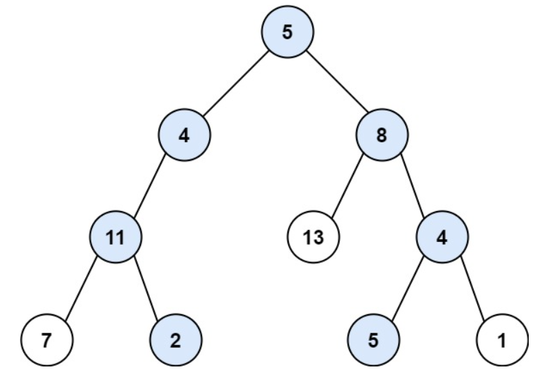
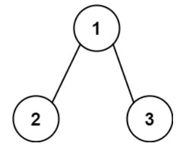
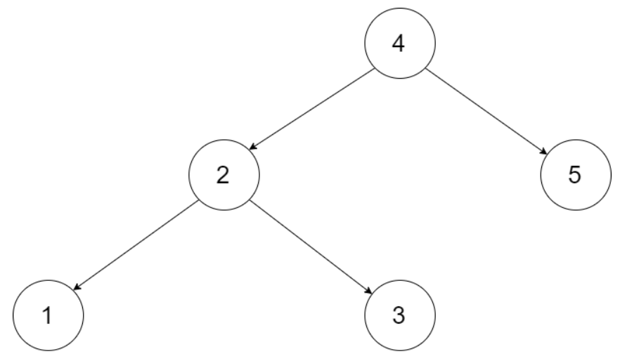
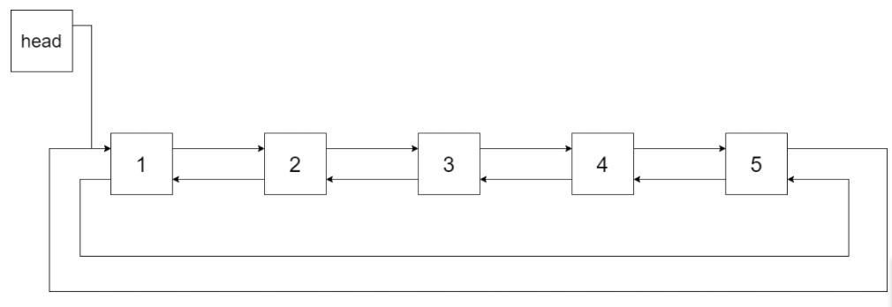
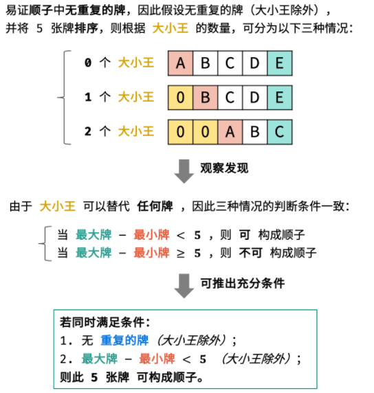
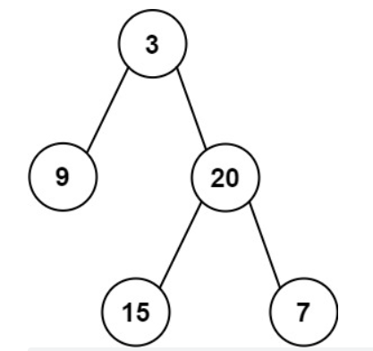

## 参考

https://leetcode-cn.com/leetbook/read/illustration-of-algorithm/px2ds5/


## Day1 栈与队列（简单）


### 1.  用两个栈实现队列

用两个栈实现一个队列。队列的声明如下，请实现它的两个函数 appendTail 和 deleteHead ，分别完成在队列尾部插入整数和在队列头部删除整数的功能。(若队列中没有元素，deleteHead 操作返回 -1 )

```java
// 耗费时间36ms
public class CQueue {
    private LinkedList<Integer> aList;
    private LinkedList<Integer> bList;

    public CQueue() {
        aList = new LinkedList<>();
        bList = new LinkedList<>();
    }

    public void appendTail(int value) {
        aList.add(value);
    }

    public int deleteHead() {
        if (!bList.isEmpty()) {
            return bList.removeLast();
        }
        if (aList.isEmpty()) {
            return -1;
        }
        while (!aList.isEmpty()) {
            bList.add(aList.removeLast());
        }
        return bList.removeLast();
    }

    public static void main(String[] args) {
        CQueue obj = new CQueue();
        obj.appendTail(3);
        int param_2 = obj.deleteHead();
        System.out.println(param_2);  // 3
        int param_3 = obj.deleteHead();
        System.out.println(param_3);  // -1
    }
}
```

```java
// 耗费时间58ms
public class CQueue {
    private Stack<Integer> aStack;
    private Stack<Integer> bStack;

    public CQueue() {
        aStack = new Stack<>();
        bStack = new Stack<>();
    }

    public void appendTail(int value) {
        aStack.push(value);
    }

    public int deleteHead() {
        if (!bStack.isEmpty()) {
            return bStack.pop();
        }
        if (aStack.isEmpty()) {
            return -1;
        }
        while (!aStack.isEmpty()) {
            bStack.add(aStack.pop());
        }
        return bStack.pop();
    }

    public static void main(String[] args) {
        CQueue obj = new CQueue();
        obj.appendTail(3);
        int param_2 = obj.deleteHead();
        System.out.println(param_2);  // 3
        int param_3 = obj.deleteHead();
        System.out.println(param_3);  // -1
    }
}
```


### 2. 包含 min 函数的栈

定义栈的数据结构，请在该类型中实现一个能够得到栈的最小元素的 min 函数在该栈中，调用 min、push 及 pop 的时间复杂度都是 O(1)。

```java
public class MinStack {

    private LinkedList<Integer> aList;
    private LinkedList<Integer> bList;

    /** initialize your data structure here. */
    public MinStack() {
        aList = new LinkedList<>();
        bList = new LinkedList<>();
    }

    public void push(int x) {
        aList.add(x);
        if (bList.isEmpty() || x <= bList.getLast()) {
            bList.add(x);
        }
    }

    public void pop() {
        Integer integer = aList.removeLast();
        if (integer.equals(bList.getLast())) {
            bList.removeLast();
        }
    }

    public int top() {
        return aList.getLast();
    }

    public int min() {
        return bList.getLast();
    }

    public static void main(String[] args) {
        MinStack minStack = new MinStack();
        minStack.push(0);
        minStack.push(1);
        minStack.push(0);
        System.out.println(minStack.min());  // -3
        minStack.pop();
        System.out.println(minStack.min());  // -2
    }
}
```


## Day2 链表（简单）

### 1. 从尾到头打印链表
输入一个链表的头节点，从尾到头反过来返回每个节点的值（用数组返回）。

 示例 1：

输入：head = [1,3,2]
输出：[2,3,1]

```java
public class Solution {
    public int[] reversePrint(ListNode head) {
        LinkedList<Integer> resultList = new LinkedList<>();
        while (head != null) {
            resultList.add(head.val);
            head = head.next;
        }

        int[] result = new int[resultList.size()];
      	// 这里需要特别注意，for循环中的result.length， 不能用resultList.size()代替
        // 因为resultList.removeLast()后，resultList.size()的值会变化！！！
        for (int i = 0; i < result.length; i++) {
            result[i] = resultList.removeLast();
        }
        return result;
    }

    public static void main(String[] args) {
        ListNode listNode = new ListNode(1);
        listNode.next = new ListNode(3);
        listNode.next.next = new ListNode(2);

        Solution solution = new Solution();
        System.out.println(Arrays.toString(solution.reversePrint(listNode)));
    }
}

```

```java
// 方式二， 递归
class Solution {
    ArrayList<Integer> tmp = new ArrayList<Integer>();
    public int[] reversePrint(ListNode head) {
        recur(head);
        int[] res = new int[tmp.size()];
        for(int i = 0; i < res.length; i++)
            res[i] = tmp.get(i);
        return res;
    }
    void recur(ListNode head) {
        if(head == null) return;
        recur(head.next);
        tmp.add(head.val);
    }
}
```


### 2. 反转链表
定义一个函数，输入一个链表的头节点，反转该链表并输出反转后链表的头节点。

示例:

输入: 1->2->3->4->5->NULL
输出: 5->4->3->2->1->NULL

```
public class Solution {
    public ListNode reverseList(ListNode head) {
        ListNode previousNode = null;
        while (head != null) {
            ListNode nextNode = head.next;
            head.next = previousNode;
            previousNode = head;
            head = nextNode;
        }
        return previousNode;
    }

    public static void main(String[] args) {
        ListNode listNode = new ListNode(1);
        listNode.next = new ListNode(2);
        listNode.next.next = new ListNode(3);
        listNode.next.next.next = new ListNode(4);
        listNode.next.next.next.next = new ListNode(5);

        Solution solution = new Solution();
        ListNode reverseListNode = solution.reverseList(listNode);
        while (reverseListNode != null){
            System.out.println(reverseListNode.val);
            reverseListNode = reverseListNode.next;
        }
    }
}

```

```java
// 方式二， 递归
class Solution {
    public ListNode reverseList(ListNode head) {
        return recur(head, null);    // 调用递归并返回
    }
    private ListNode recur(ListNode cur, ListNode pre) {
        if (cur == null) return pre; // 终止条件
        ListNode res = recur(cur.next, cur);  // 递归后继节点
        cur.next = pre;              // 修改节点引用指向
        return res;                  // 返回反转链表的头节点
    }
}
```


### 3. 复杂链表的复制
请实现 copyRandomList 函数，复制一个复杂链表。在复杂链表中，每个节点除了有一个 next 指针指向下一个节点，还有一个 random 指针指向链表中的任意节点或者 null。

```java
//方式一
class Solution {
    public Node copyRandomList(Node head) {
        if(head == null) return null;
        Node cur = head;
        Map<Node, Node> map = new HashMap<>();
        // 3. 复制各节点，并建立 “原节点 -> 新节点” 的 Map 映射
        while(cur != null) {
            map.put(cur, new Node(cur.val));
            cur = cur.next;
        }
        cur = head;
        // 4. 构建新链表的 next 和 random 指向
        while(cur != null) {
            map.get(cur).next = map.get(cur.next);
            map.get(cur).random = map.get(cur.random);
            cur = cur.next;
        }
        // 5. 返回新链表的头节点
        return map.get(head);
    }
}

```


```java
//方式二
class Solution {
    public Node copyRandomList(Node head) {
        if(head == null) return null;
        Node cur = head;
        // 1. 复制各节点，并构建拼接链表
        while(cur != null) {
            Node tmp = new Node(cur.val);
            tmp.next = cur.next;
            cur.next = tmp;
            cur = tmp.next;
        }
        // 2. 构建各新节点的 random 指向
        cur = head;
        while(cur != null) {
            if(cur.random != null)
                cur.next.random = cur.random.next;
            cur = cur.next.next;
        }
        // 3. 拆分两链表
        cur = head.next;
        Node pre = head, res = head.next;
        while(cur.next != null) {
            pre.next = pre.next.next;
            cur.next = cur.next.next;
            pre = pre.next;
            cur = cur.next;
        }
        pre.next = null; // 单独处理原链表尾节点
        return res;      // 返回新链表头节点
    }
}

```


## Day3 字符串（简单）


### 1. 替换空格
请实现一个函数，把字符串 s 中的每个空格替换成"%20"。

示例 1：

输入：s = "We are happy."
输出："We%20are%20happy."

```java
class Solution {
    public String replaceSpace(String s) {
        StringBuilder res = new StringBuilder();
        for(Character c : s.toCharArray())
        {
            if(c == ' ') res.append("%20");
            else res.append(c);
        }
        return res.toString();
    }
}

```


### 2. 左旋转字符串
字符串的左旋转操作是把字符串前面的若干个字符转移到字符串的尾部。请定义一个函数实现字符串左旋转操作的功能。比如，输入字符串"abcdefg"和数字2，该函数将返回左旋转两位得到的结果"cdefgab"。

示例 1：

输入: s = "abcdefg", k = 2
输出: "cdefgab"

```java
// 方法1 切片
class Solution {
    public String reverseLeftWords(String s, int n) {
        return s.substring(n, s.length()) + s.substring(0, n);
    }
}

```

```java
// 方法2
class Solution {
    public String reverseLeftWords(String s, int n) {
        StringBuilder res = new StringBuilder();
        for(int i = n; i < s.length(); i++)
            res.append(s.charAt(i));
        for(int i = 0; i < n; i++)
            res.append(s.charAt(i));
        return res.toString();
    }
}


利用求余运算，可以简化代码。
class Solution {
    public String reverseLeftWords(String s, int n) {
        StringBuilder res = new StringBuilder();
        for(int i = n; i < n + s.length(); i++)
            res.append(s.charAt(i % s.length()));
        return res.toString();
    }
}

```


## Day4 查找算法（简单）

### 1.  数组中重复的数字
找出数组中重复的数字。


在一个长度为 n 的数组 nums 里的所有数字都在 0～n-1 的范围内。数组中某些数字是重复的，但不知道有几个数字重复了，也不知道每个数字重复了几次。请找出数组中任意一个重复的数字。

示例 1：

输入：
[2, 3, 1, 0, 2, 5, 3]
输出：2 或 3

```java
// 利用hash表
class Solution {
    public int findRepeatNumber(int[] nums) {
        Set<Integer> dic = new HashSet<>();
        for(int num : nums) {
            if(dic.contains(num)) return num;
            dic.add(num);
        }
        return -1;
    }
}

```

```java
// 方法二：原地交换
class Solution {
    public int findRepeatNumber(int[] nums) {
        int i = 0;
        while(i < nums.length) {
            if(nums[i] == i) {
                i++;
                continue;
            }
            if(nums[nums[i]] == nums[i]) return nums[i];
            int tmp = nums[i];
            nums[i] = nums[tmp];
            nums[tmp] = tmp;
        }
        return -1;
    }
}

```


### 2. 在排序数组中查找数字 I

统计一个数字在排序数组中出现的次数。

示例 1:

输入: nums = [5,7,7,8,8,10], target = 8
输出: 2
示例 2:

输入: nums = [5,7,7,8,8,10], target = 6
输出: 0

```java
// 思路： target的右边界坐标 减去 (target-1)的右边界坐标
public int search(int[] nums, int target) {
        return searchRight(nums, target) - searchRight(nums, target-1);
    }

    private int searchRight(int[] nums, int target) {
        int start = 0;
        int end = nums.length - 1;
        while (start <= end) {
            int middle = (start + end) / 2;
            if (nums[middle] <= target) {
                start = middle + 1;
            } else {
                end = middle - 1;
            }
        }
        return start;
    }
```


复习一下二分查找

```java
public static int search2(int[] nums, int target) {
    int start = 0;
    int end = nums.length - 1;
    while (start <= end) {
      int middle = (start + end) / 2;
      if (nums[middle] < target) {
        start = middle + 1;
      } else if (nums[middle] > target) {
        end = middle - 1;
      } else {
        return middle;
      }
    }
    return -1;
}
```


### 3. 0～n-1 中缺失的数字
一个长度为n-1的递增排序数组中的所有数字都是唯一的，并且每个数字都在范围0～n-1之内。在范围0～n-1内的n个数字中有且只有一个数字不在该数组中，请找出这个数字。

```java
// 暴力法
class Solution {
    public int missingNumber(int[] nums) {
        for (int i=0; i<nums.length; i++) {
            if (i != nums[i]) {
                return i;
            }
        }
        return nums.length;
    }
}
```

```java
// 二分法
// 若 nums[m] == m ，则 缺失的元素 一定在闭区间 [m + 1, j]中，因此执行 i = m + 1
// 若 nums[m] != m ，则 缺失的元素 一定在闭区间 [i, m - 1]中，因此执行 j = m - 1
// i指的是start, j指的是end;

class Solution {
    public int missingNumber(int[] nums) {
        int start = 0;
        int end = nums.length - 1;
        while (start <= end) {
            int middle = (start + end) / 2;
            if (nums[middle] == middle) {
                start = middle + 1;
            } else {
                end = middle - 1;
            }
        }
        return start;
    }
}
```


## Day5 查找算法（中等）


### 1. 二维数组中的查找
在一个 n * m 的二维数组中，每一行都按照从左到右递增的顺序排序，每一列都按照从上到下递增的顺序排序。请完成一个高效的函数，输入这样的一个二维数组和一个整数，判断数组中是否含有该整数。 

示例:

现有矩阵 matrix 如下：

[
  [1,   4,  7, 11, 15],
  [2,   5,  8, 12, 19],
  [3,   6,  9, 16, 22],
  [10, 13, 14, 17, 24],
  [18, 21, 23, 26, 30]
]
给定 target = 5，返回 true。

给定 target = 20，返回 false。

```java
class Solution {
    public boolean findNumberIn2DArray(int[][] matrix, int target) {
        if (matrix.length == 0) {
            return false;
        }
        int i = matrix.length - 1;
        int j = 0;
        while (i >=0 && j < matrix[0].length) {
            if(target < matrix[i][j]) {
                i--;
            } else if (target>matrix[i][j]) {
                j++;
            } else {
                return true;
            }
        }
        return false;
    }
}
```


### 2. 旋转数组的最小数字

把一个数组最开始的若干个元素搬到数组的末尾，我们称之为数组的旋转。

给你一个可能存在 重复 元素值的数组 numbers ，它原来是一个升序排列的数组，并按上述情形进行了一次旋转。请返回旋转数组的最小元素。例如，数组 [3,4,5,1,2] 为 [1,2,3,4,5] 的一次旋转，该数组的最小值为1。  

示例 1：

输入：[3,4,5,1,2]
输出：1
示例 2：

输入：[2,2,2,0,1]
输出：0

```java
// 暴力法
class Solution {
    public int minArray(int[] numbers) {
        for (int i = numbers.length-1; i>0; i--) {
            if (numbers[i-1] > numbers[i]) {
                return numbers[i];
            }
        }
        return numbers[0];
    }
}
```

```java
//二分法
class Solution {
    public int minArray(int[] numbers) {
        int i = 0;
        int j = numbers.length - 1;
        while (i != j) {
            int m = (i+j) / 2;
            if (numbers[m] > numbers[j]) {
                i = m + 1;
            } else if (numbers[m] < numbers[j]) {
                j = m;
            } else {
                j--;
            }
        }
        return numbers[i];
    }
}
```


### 3. 第一个只出现一次的字符
在字符串 s 中找出第一个只出现一次的字符。如果没有，返回一个单空格。 s 只包含小写字母。

示例 1:

输入：s = "abaccdeff"
输出：'b'
示例 2:

输入：s = "" 
输出：' '

```java
//方法一：哈希表
class Solution {
    public char firstUniqChar(String s) {
        HashMap<Character, Boolean> map = new HashMap<>();
        char[] chars = s.toCharArray();
        for (char aChar : chars) {
            if (!map.containsKey(aChar)) {
                map.put(aChar, true);
            } else {
                map.put(aChar, false);
            }
        }
        for (char aChar : chars) {
            if (map.get(aChar)) {
                return aChar;
            }
        }
        return ' ';
    }
}

```

```java
//方法二：有序哈希表
class Solution {
    public char firstUniqChar(String s) {
        Map<Character, Boolean> dic = new LinkedHashMap<>();
        char[] sc = s.toCharArray();
        for(char c : sc)
            dic.put(c, !dic.containsKey(c));
        for(Map.Entry<Character, Boolean> d : dic.entrySet()){
           if(d.getValue()) return d.getKey();
        }
        return ' ';
    }
}

```


## Day9 动态规划（中等）

### 2.礼物的最大价值

在一个 m*n 的棋盘的每一格都放有一个礼物，每个礼物都有一定的价值（价值大于 0）。你可以从棋盘的左上角开始拿格子里的礼物，并每次向右或者向下移动一格、直到到达棋盘的右下角。给定一个棋盘及其上面的礼物的价值，请计算你最多能拿到多少价值的礼物？

示例 1:

```
输入: 
[
  [1,3,1],
  [1,5,1],
  [4,2,1]
]
输出: 12
解释: 路径 1→3→5→2→1 可以拿到最多价值的礼物
```


提示：

0 < grid.length <= 200
0 < grid[0].length <= 200

```java
// 自己看提示写的
class Solution {
    public int maxValue(int[][] grid) {
        for (int i=0; i<grid.length; i++) {
            for (int j=0; j<grid[0].length; j++) {
                if (i==0 && j==0){
                    continue;
                } else if (i==0 && j!=0){
                    grid[i][j] = grid[i][j]+grid[i][j-1];
                } else if (i!=0 && j==0){
                    grid[i][j] = grid[i][j]+grid[i-1][j];
                } else {
                    grid[i][j] = grid[i][j]+Math.max(grid[i-1][j], grid[i][j-1]);
                }
            }
        }
        return grid[grid.length-1][grid[0].length-1];
    }
}
```

```java
//答案写的
class Solution {
    public int maxValue(int[][] grid) {
        int m = grid.length, n = grid[0].length;
        for (int j=1; j<n; j++) {
            grid[0][j] += grid[0][j-1];  # 初始化第一行
        }
        for (int i=1; i<m; i++) {
            grid[i][0] += grid[i-1][0];  # 初始化第一列
        }
        for (int i=1; i<m; i++) {
            for (int j=1; j<n; j++) {
                grid[i][j] += Math.max(grid[i][j-1], grid[i-1][j]);
            }
        }
        return grid[m-1][n-1];
    }
}
```


## Day10 动态规划（中等）

### 1.把数字翻译成字符串

给定一个数字，我们按照如下规则把它翻译为字符串：0 翻译成 “a” ，1 翻译成 “b”，……，11 翻译成 “l”，……，25 翻译成 “z”。一个数字可能有多个翻译。请编程实现一个函数，用来计算一个数字有多少种不同的翻译方法。

示例 1:

```
输入: 12258
输出: 5
解释: 12258有5种不同的翻译，分别是"bccfi", "bwfi", "bczi", "mcfi"和"mzi"
```


提示：

0 <= num < 231

```java
// 看看自己写的垃圾代码... 
class Solution {
    public int translateNum(int num) {
        char[] numChars = String.valueOf(num).toCharArray();
        if (numChars.length == 1) {
            return 1;
        }
        int[] dp = new int[numChars.length];
        dp[0] = 1;
        if(Integer.parseInt(String.valueOf(numChars[0]) + String.valueOf(numChars[1])) < 26) {
            dp[1] = 2;
        } else {
            dp[1] = 1;
        }
        for (int i = 2; i<numChars.length; i++) {
            int entity = Integer.parseInt(String.valueOf(numChars[i - 1]) + String.valueOf(numChars[i]));
            if (entity < 26 && entity >= 10) {
                dp[i] = dp[i-1] + dp[i-2];
            } else {
                dp[i] = dp[i-1];
            }
        }
        return dp[dp.length-1];
    }
}
```


## Day11 双指针（简单）

### 1.删除链表的节点

给定单向链表的头指针和一个要删除的节点的值，定义一个函数删除该节点。

返回删除后的链表的头节点。

注意：此题对比原题有改动

示例 1:

输入: head = [4,5,1,9], val = 5
输出: [4,1,9]
解释: 给定你链表中值为 5 的第二个节点，那么在调用了你的函数之后，该链表应变为 4 -> 1 -> 9.

```java
/**
 * Definition for singly-linked list.
 * public class ListNode {
 *     int val;
 *     ListNode next;
 *     ListNode(int x) { val = x; }
 * }
 */
class Solution {
    public ListNode deleteNode(ListNode head, int val) {
        // val在头节点的时候
        if (head.val == val) {
            head = head.next;
        }
        // pre指向第一个节点， cur指向第二个节点， 然后pre=pre.next, cur=cur.next遍历 直到 cur = null 为止
        // 如果找到节点了， 直接pre指针的next指向当前节点的next即可
        ListNode pre = head;
        ListNode cur = head.next;
        while (cur != null) {
            if (cur.val == val) {
                pre.next = cur.next;
                break;
            }
            pre = pre.next;
            cur = cur.next;
        }
        return head;
    }
}
```


### 2.链表中倒数第 k 个节点
输入一个链表，输出该链表中倒数第k个节点。为了符合大多数人的习惯，本题从1开始计数，即链表的尾节点是倒数第1个节点。

例如，一个链表有 6 个节点，从头节点开始，它们的值依次是 1、2、3、4、5、6。这个链表的倒数第 3 个节点是值为 4 的节点。

示例：

给定一个链表: 1->2->3->4->5, 和 k = 2.

返回链表 4->5.

```java
// 你的写法： 先遍历一次知道长度，然后再遍历到n-k, 感觉就很蠢。。。。
/**
 * Definition for singly-linked list.
 * public class ListNode {
 *     int val;
 *     ListNode next;
 *     ListNode(int x) { val = x; }
 * }
 */
class Solution {
    public ListNode getKthFromEnd(ListNode head, int k) {
        if (head == null) {
            return null;
        }

        int length = 1;
        ListNode cur = head.next; 
        while (cur != null) {
            length += 1;
            cur = cur.next;
        }
        int index = length - k;
        cur = head;
        while (index > 0) {
            cur = cur.next;
            index -= 1;
        }
        return cur;
    }
}
```

```java
// 别人写的
/**
 * Definition for singly-linked list.
 * public class ListNode {
 *     int val;
 *     ListNode next;
 *     ListNode(int x) { val = x; }
 * }
 */
class Solution {
    public ListNode getKthFromEnd(ListNode head, int k) {
        ListNode former = head;
        ListNode latter = head;
        for (int i = 0; i < k; i++) {
            if (former == null) {
                return null;
            }
            former = former.next;
        }
        while (former != null) {
            former = former.next;
            latter = latter.next;
        }
        return latter;
    }
}
```


## Day12 双指针（简单）

### 1.合并两个排序的链表

输入两个递增排序的链表，合并这两个链表并使新链表中的节点仍然是递增排序的。

示例1：

输入：1->2->4, 1->3->4
输出：1->1->2->3->4->4
限制：

0 <= 链表长度 <= 1000

作者：Krahets
链接：https://leetcode-cn.com/leetbook/read/illustration-of-algorithm/5vq98s/
来源：力扣（LeetCode）
著作权归作者所有。商业转载请联系作者获得授权，非商业转载请注明出处。

```java
// 你的写法
/**
 * Definition for singly-linked list.
 * public class ListNode {
 *     int val;
 *     ListNode next;
 *     ListNode(int x) { val = x; }
 * }
 */
class Solution {
    public ListNode mergeTwoLists(ListNode l1, ListNode l2) {
        if (l1 == null) {
            return l2;
        }
        if (l2 == null) {
            return l1;
        }

        ListNode head;
        if (l1.val <= l2.val) {
            head = new ListNode(l1.val);
            l1 = l1.next;
        } else {
            head = new ListNode(l2.val);
            l2 = l2.next;
        }
        ListNode cur = head;
        while (l1 != null && l2 != null) {
            if (l1.val <= l2.val) {
                cur.next = new ListNode(l1.val);
                l1 = l1.next;
            } else {
                cur.next = new ListNode(l2.val);
                l2 = l2.next;
            }
            cur = cur.next;
        }
        if (l1 == null) {
            cur.next = l2;
        } else {
            cur.next = l1;
        }
        return head;
    }
}
```

```java
// 别人的写法

```


## Day13 双指针（简单）

### 1.翻转单词顺序
输入一个英文句子，翻转句子中单词的顺序，但单词内字符的顺序不变。为简单起见，标点符号和普通字母一样处理。例如输入字符串"I am a student. "，则输出"student. a am I"。

示例 1：

输入: "the sky is blue"
输出: "blue is sky the"

```java
// 答案
public class Solution {
    public static String reverseWords(String s) {
        s = s.trim();
        int i = s.length() - 1;
        int j = i;
        StringBuilder stringBuilder = new StringBuilder();
        while (i >= 0) {
            while (i >= 0 && s.charAt(i) != ' ') {
                i--;
            }
            stringBuilder.append(s.substring(i + 1, j + 1) + " ");
            while (i >=0 && s.charAt(i) == ' ') {
                i --;
            }
            j = i;
        }
        return stringBuilder.toString().trim();
    }

    public static void main(String[] args) {
        System.out.println(reverseWords(" the sky is blue "));
    }
}
```


## Day14 搜索与回溯算法（中等）

### 1. 矩阵中的路径

给定一个 m x n 二维字符网格 board 和一个字符串单词 word 。如果 word 存在于网格中，返回 true ；否则，返回 false 。
单词必须按照字母顺序，通过相邻的单元格内的字母构成，其中“相邻”单元格是那些水平相邻或垂直相邻的单元格。同一个单元格内的字母不允许被重复使用。

例如，在下面的 3×4 的矩阵中包含单词 "ABCCED"（单词中的字母已标出）。
示例 1：
输入：board = [["A","B","C","E"],["S","F","C","S"],["A","D","E","E"]], word = "ABCCED"
输出：true
示例 2：
输入：board = [["a","b"],["c","d"]], word = "abcd"
输出：false

提示：
1 <= board.length <= 200
1 <= board[i].length <= 200
board 和 word 仅由大小写英文字母组成

```java
class Solution {
    public boolean exist(char[][] board, String word) {
        char[] words = word.toCharArray();
        for(int i = 0; i < board.length; i++) {
            for(int j = 0; j < board[0].length; j++) {
                if(dfs(board, words, i, j, 0)) return true;
            }
        }
        return false;
    }
    boolean dfs(char[][] board, char[] word, int i, int j, int k) {
        if(i >= board.length || i < 0 || j >= board[0].length || j < 0 || board[i][j] != word[k]) return false;
        if(k == word.length - 1) return true;
        board[i][j] = '\0';
        boolean res = dfs(board, word, i + 1, j, k + 1) || dfs(board, word, i - 1, j, k + 1) || 
                      dfs(board, word, i, j + 1, k + 1) || dfs(board, word, i , j - 1, k + 1);
        board[i][j] = word[k];
        return res;
    }
}
```


### 2. 机器人的运动范围
地上有一个m行n列的方格，从坐标 [0,0] 到坐标 [m-1,n-1] 。一个机器人从坐标 [0, 0] 的格子开始移动，它每次可以向左、右、上、下移动一格（不能移动到方格外），也不能进入行坐标和列坐标的数位之和大于k的格子。例如，当k为18时，机器人能够进入方格 [35, 37] ，因为3+5+3+7=18。但它不能进入方格 [35, 38]，因为3+5+3+8=19。请问该机器人能够到达多少个格子？

示例 1：

输入：m = 2, n = 3, k = 1
输出：3
示例 2：

输入：m = 3, n = 1, k = 0
输出：1
提示：

1 <= n,m <= 100
0 <= k <= 20

```java
// 深度优先遍历 DFS
class Solution {
    int m, n, k;
    boolean[][] visited;
    public int movingCount(int m, int n, int k) {
        this.m = m; this.n = n; this.k = k;
        this.visited = new boolean[m][n];
        return dfs(0, 0, 0, 0);
    }
    public int dfs(int i, int j, int si, int sj) {
        if(i >= m || j >= n || k < si + sj || visited[i][j]) return 0;
        visited[i][j] = true;
        return 1 + dfs(i + 1, j, (i + 1) % 10 != 0 ? si + 1 : si - 8, sj) + dfs(i, j + 1, si, (j + 1) % 10 != 0 ? sj + 1 : sj - 8);
    }
}
```


```java
// 广度有限优先BFS
class Solution {
    public int movingCount(int m, int n, int k) {
        boolean[][] visited = new boolean[m][n];
        int res = 0;
        Queue<int[]> queue= new LinkedList<int[]>();
        queue.add(new int[] { 0, 0, 0, 0 });
        while(queue.size() > 0) {
            int[] x = queue.poll();
            int i = x[0], j = x[1], si = x[2], sj = x[3];
            if(i >= m || j >= n || k < si + sj || visited[i][j]) continue;
            visited[i][j] = true;
            res ++;
            queue.add(new int[] { i + 1, j, (i + 1) % 10 != 0 ? si + 1 : si - 8, sj });
            queue.add(new int[] { i, j + 1, si, (j + 1) % 10 != 0 ? sj + 1 : sj - 8 });
        }
        return res;
    }
}
```


## Day15 搜索与回溯算法（中等）

### 1. 二叉树中和为某一值的路径

给你二叉树的根节点 root 和一个整数目标和 targetSum ，找出所有 从根节点到叶子节点 路径总和等于给定目标和的路径。

叶子节点 是指没有子节点的节点。

示例 1：

输入：root = [5,4,8,11,null,13,4,7,2,null,null,5,1], targetSum = 22
输出：[[5,4,11,2],[5,8,4,5]]

示例 2：

输入：root = [1,2,3], targetSum = 5
输出：[]

示例 3：
输入：root = [1,2], targetSum = 0
输出：[]

```java
public class TreeNode {
    int val;
    TreeNode left;
    TreeNode right;

    public TreeNode() {
    }

    public TreeNode(int val) {
        this.val = val;
    }

    public TreeNode(int val, TreeNode left, TreeNode right) {
        this.val = val;
        this.left = left;
        this.right = right;
    }
}
```

```java
// 参考答案
public class Solution {
    LinkedList<List<Integer>> res = new LinkedList<List<Integer>>();
    LinkedList<Integer> path = new LinkedList<Integer>();

    public List<List<Integer>> pathSum(TreeNode root, int target) {
        recur(root, target);
        return res;
    }

    public void recur(TreeNode node, int target) {
        if (node == null) {
            return;
        }
        path.add(node.val);
        target -= node.val;
        if (target == 0 && node.left == null && node.right == null) {
            res.add(new LinkedList<Integer>(path));
        }
        recur(node.left, target);
        recur(node.right, target);
        path.removeLast();
    }

    public static void main(String[] args) {
        Solution solution = new Solution();
        TreeNode treeNode1 = new TreeNode(7);
        TreeNode treeNode2 = new TreeNode(2);
        TreeNode treeNode3 = new TreeNode(5);
        TreeNode treeNode4 = new TreeNode(1);

        TreeNode treeNode5 = new TreeNode(11, treeNode1, treeNode2);
        TreeNode treeNode6 = new TreeNode(13);
        TreeNode treeNode7 = new TreeNode(4, treeNode3, treeNode4);

        TreeNode treeNode8 = new TreeNode(4, treeNode5, null);
        TreeNode treeNode9 = new TreeNode(8, treeNode6, treeNode7);

        TreeNode treeNode10 = new TreeNode(5, treeNode8, treeNode9);

        System.out.println(solution.pathSum(treeNode10, 22));
    }
}
```


### 2. 二叉搜索树与双向链表
输入一棵二叉搜索树，将该**二叉搜索树**转换成一个**排序的循环双向链表**。要求不能创建任何新的节点，只能调整树中节点指针的指向。

为了让您更好地理解问题，以下面的二叉搜索树为例：



我们希望将这个二叉搜索树转化为双向循环链表。链表中的每个节点都有一个前驱和后继指针。对于双向循环链表，第一个节点的前驱是最后一个节点，最后一个节点的后继是第一个节点。

下图展示了上面的二叉搜索树转化成的链表。“head” 表示指向链表中有最小元素的节点。



特别地，我们希望可以就地完成转换操作。当转化完成以后，树中节点的左指针需要指向前驱，树中节点的右指针需要指向后继。还需要返回链表中的第一个节点的指针。

```java
// 节点
public class Node {
    public int val;
    public Node left;
    public Node right;

    public Node() {
    }

    public Node(int _val) {
        this.val = _val;
    }

    public Node(int _val, Node _left, Node _right) {
        this.val = _val;
        this.left = _left;
        this.right = _right;
    }
}

```


```java
// 使用深度优先遍历的中序优先遍历（先遍历左节点，然后遍历根节点，最后遍历右节点）
public class Solution {

    public Node pre;
    public Node head;
    public Node treeToDoublyList(Node root) {
        if (root == null) {
            return null;
        }
        dfs(root);
        // 首尾互联
        pre.right = head;
        head.left = pre;
        return head;
    }

    public void dfs(Node node) {
        if (node == null) {
            return;
        }
        // 先处理左节点
        dfs(node.left);
        // 然后处理根节点
        if (pre != null) {
            pre.right = node;
            node.left = pre;
        } else {
            head = node;
        }
        pre = node;
        // 最后处理右节点
        dfs(node.right);
    }

    public static void main(String[] args) {
        Solution solution = new Solution();

        Node node1 = new Node(1);
        Node node2 = new Node(2);
        Node node3 = new Node(3);
        Node node4 = new Node(4);
        Node node5 = new Node(5);

        node4.left = node2;
        node4.right = node5;
        node2.left = node1;
        node2.right = node3;

        Node head = solution.treeToDoublyList(node4);
        // 这里打断点看head结构
        System.out.println(head);
        Node cur = head;
        while (cur.right != head) {
            System.out.println(cur.val);
            cur = cur.right;
        }
        System.out.println(cur.val);
    }
}

```


### 3. 二叉搜索树的第 k 大节点
给定一棵二叉搜索树，请找出其中第 k 大的节点的值。
示例 1:
输入: root = [3,1,4,null,2], k = 1
   3
  / \
 1   4
  \
   2
输出: 4

示例 2:
输入: root = [5,3,6,2,4,null,null,1], k = 3
       5
      / \
     3   6
    / \
   2   4
  /
 1
输出: 4

限制：
1 ≤ k ≤ 二叉搜索树元素个数

```java
// 自己写的，有点蠢
public class Solution {
    TreeNode pre;

    public int kthLargest(TreeNode root, int k) {
        if (root == null) {
            return 0;
        }
        // 中序遍历形成 1<-2<-3<-4<-5
        dfs(root);
        // 然后倒着数
        for (int i = k - 1; i > 0; i--) {
            pre = pre.left;
        }
        return pre.val;
    }

    public void dfs(TreeNode node) {
        if (node == null) {
            return;
        }
        dfs(node.left);
        node.left = pre != null ? pre : null;
        pre = node;
        dfs(node.right);
    }

    public static void main(String[] args) {
        Solution solution = new Solution();
        TreeNode treeNode1 = new TreeNode(1);
        TreeNode treeNode2 = new TreeNode(2);
        TreeNode treeNode3 = new TreeNode(2);
        TreeNode treeNode4 = new TreeNode(4);
        TreeNode treeNode5 = new TreeNode(5);
        TreeNode treeNode6 = new TreeNode(6);

        treeNode5.left = treeNode3;
        treeNode5.right = treeNode6;
        treeNode3.left = treeNode2;
        treeNode3.right = treeNode4;
        treeNode2.left = treeNode1;
        System.out.println(solution.kthLargest(treeNode5, 3));
    }
}
```


```java
// 参考答案的
public class Solution2 {

    int res;
    int k;
    public int kthLargest(TreeNode root, int k) {
        this.k = k;
        dfs(root);
        return res;
    }

    public void dfs(TreeNode node) {
        if (node == null) {
            return;
        }
        dfs(node.right);
        if (k == 0) {
            return;
        }
        if (--k == 0) {
            res = node.val;
        }
        dfs(node.left);
    }

    public static void main(String[] args) {
        Solution2 solution = new Solution2();
        TreeNode treeNode1 = new TreeNode(1);
        TreeNode treeNode2 = new TreeNode(2);
        TreeNode treeNode3 = new TreeNode(2);
        TreeNode treeNode4 = new TreeNode(4);
        TreeNode treeNode5 = new TreeNode(5);
        TreeNode treeNode6 = new TreeNode(6);

        treeNode5.left = treeNode3;
        treeNode5.right = treeNode6;
        treeNode3.left = treeNode2;
        treeNode3.right = treeNode4;
        treeNode2.left = treeNode1;
        System.out.println(solution.kthLargest(treeNode5, 3));
    }
}
```


## Day16 排序（简单）

###  1. 把数组排成最小的数

输入一个非负整数数组，把数组里所有数字拼接起来排成一个数，打印能拼接出的所有数字中最小的一个。

**示例 1:**

```
输入: [10,2]
输出: "102"
```

**示例 2:**

```
输入: [3,30,34,5,9]
输出: "3033459"
```

提示:
0 < nums.length <= 100
说明:
输出结果可能非常大，所以你需要返回一个字符串而不是整数
拼接起来的数字可能会有前导 0，最后结果不需要去掉前导 0

```java
// 参考答案
public class Solution {
    public String minNumber(int[] nums) {
        String[] strs = new String[nums.length];
        for (int i = 0; i < nums.length; i++) {
            strs[i] = String.valueOf(nums[i]);
        }
        quickSort(strs, 0, strs.length - 1);
        StringBuilder res = new StringBuilder();
        for (String str : strs) {
            res.append(str);
        }
        return res.toString();
    }

    private void quickSort(String[] strs, int l, int r) {
        if (l >= r) {
            return;
        }
        int i = l;
        int j = r;
        String tmp = strs[l];
        while (i < j) {
            while (i < j && (strs[j] + strs[l]).compareTo(strs[l] + strs[j]) >= 0) {
                j--;
            }
            while (i < j && (strs[i] + strs[l]).compareTo(strs[l] + strs[i]) <= 0) {
                i++;
            }
            tmp = strs[i];
            strs[i] = strs[j];
            strs[j] = tmp;
        }
        strs[i] = strs[l];
        strs[l] = tmp;
        quickSort(strs, l, i - 1);
        quickSort(strs, i + 1, r);
    }

    public static void main(String[] args) {
        Solution solution = new Solution();
        System.out.println(solution.minNumber(new int[]{3, 30, 34, 5, 9}));
    }
}
```


### 2. 扑克牌中的顺子
从若干副扑克牌中随机抽 5 张牌，判断是不是一个顺子，即这5张牌是不是连续的。2～10为数字本身，A为1，J为11，Q为12，K为13，而大、小王为 0 ，可以看成任意数字。A 不能视为 14。

示例 1:
输入: [1,2,3,4,5]
输出: True

示例 2:
输入: [0,0,1,2,5]
输出: True

限制：
数组长度为 5 
数组的数取值为 [0, 13] 

```java
// 方法一： 集合 Set + 遍历
class Solution {
    public boolean isStraight(int[] nums) {
        Set<Integer> repeat = new HashSet<>();
        int max = 0, min = 14;
        for(int num : nums) {
            if(num == 0) continue; // 跳过大小王
            max = Math.max(max, num); // 最大牌
            min = Math.min(min, num); // 最小牌
            if(repeat.contains(num)) return false; // 若有重复，提前返回 false
            repeat.add(num); // 添加此牌至 Set
        }
        return max - min < 5; // 最大牌 - 最小牌 < 5 则可构成顺子
    }
}
```


```java
// 方法二：排序 + 遍历
class Solution {
    public boolean isStraight(int[] nums) {
        int joker = 0;
        Arrays.sort(nums); // 数组排序
        for(int i = 0; i < 4; i++) {
            if(nums[i] == 0) joker++; // 统计大小王数量
            else if(nums[i] == nums[i + 1]) return false; // 若有重复，提前返回 false
        }
        return nums[4] - nums[joker] < 5; // 最大牌 - 最小牌 < 5 则可构成顺子
    }
}
```


参考答案解题思路




## Day17 排序（中等）

### 1. 最小的 k 个数
输入整数数组 arr ，找出其中最小的 k 个数。例如，输入4、5、1、6、2、7、3、8这8个数字，则最小的4个数字是1、2、3、4。

 

示例 1：

```
输入：arr = [3,2,1], k = 2
输出：[1,2] 或者 [2,1]
```


示例 2：

```
输入：arr = [0,1,2,1], k = 1
输出：[0]
```


限制：

0 <= k <= arr.length <= 10000
0 <= arr[i] <= 10000


```java
// 你的答案 才打败30%的人
public int[] getLeastNumbers(int[] arr, int k) {
        quickSort(arr, 0, arr.length - 1);
        int[] res = new int[k];
        for (int i = 0; i < res.length; i++) {
            res[i] = arr[i];
        }
        return res;
    }

    public void quickSort(int[] nums, int l, int r) {
        if (l >= r) {
            return;
        }
        int i = l;
        int j = r;
        int tmp = nums[i];
        while (i < j) {
            while (i < j && nums[j] >= nums[l]) {
                j--;
            }
            while (i < j && nums[i] <= nums[l]) {
                i++;
            }
            tmp = nums[i];
            nums[i] = nums[j];
            nums[j] = tmp;
        }
        nums[i] = nums[l];
        nums[l] = tmp;
        quickSort(nums, l, i - 1);
        quickSort(nums, i + 1, r);
    }
```


```java
// 官方的答案，打败了95%的人 
// 思路是最小的 k 个数不一定要排序， 只要是最小的k个数即可！
class Solution {
    public int[] getLeastNumbers(int[] arr, int k) {
        if (k >= arr.length) return arr;
        return quickSort(arr, k, 0, arr.length - 1);
    }
    private int[] quickSort(int[] arr, int k, int l, int r) {
        int i = l, j = r;
        while (i < j) {
            while (i < j && arr[j] >= arr[l]) j--;
            while (i < j && arr[i] <= arr[l]) i++;
            swap(arr, i, j);
        }
        swap(arr, i, l);
        if (i > k) return quickSort(arr, k, l, i - 1);
        if (i < k) return quickSort(arr, k, i + 1, r);
        return Arrays.copyOf(arr, k);
    }
    private void swap(int[] arr, int i, int j) {
        int tmp = arr[i];
        arr[i] = arr[j];
        arr[j] = tmp;
    }
}
```


### 2. 数据流中的中位数
如何得到一个数据流中的中位数？如果从数据流中读出奇数个数值，那么中位数就是所有数值排序之后位于中间的数值。如果从数据流中读出偶数个数值，那么中位数就是所有数值排序之后中间两个数的平均值。

例如
[2,3,4] 的中位数是 3
[2,3] 的中位数是 (2 + 3) / 2 = 2.5
设计一个支持以下两种操作的数据结构：
void addNum(int num) - 从数据流中添加一个整数到数据结构中。
double findMedian() - 返回目前所有元素的中位数。

示例 1：

```text
输入：
["MedianFinder","addNum","addNum","findMedian","addNum","findMedian"]
[[],[1],[2],[],[3],[]]
输出：[null,null,null,1.50000,null,2.00000]
```

示例 2：

```text
输入：
["MedianFinder","addNum","findMedian","addNum","findMedian"]
[[],[2],[],[3],[]]
输出：[null,null,2.00000,null,2.50000]
```

限制：
最多会对 addNum、findMedian 进行 50000 次调用。


参考答案

```java
class MedianFinder {
    Queue<Integer> A, B;
    public MedianFinder() {
        A = new PriorityQueue<>(); // 小顶堆，保存较大的一半
        B = new PriorityQueue<>((x, y) -> (y - x)); // 大顶堆，保存较小的一半
    }
    public void addNum(int num) {
        if(A.size() != B.size()) {
            A.add(num);
            B.add(A.poll());
        } else {
            B.add(num);
            A.add(B.poll());
        }
    }
    public double findMedian() {
        return A.size() != B.size() ? A.peek() : (A.peek() + B.peek()) / 2.0;
    }
}
```


### 扩展知识： 顶堆是什么？

https://juejin.cn/post/6844903869332324365#heading-6

1、大顶堆

- 根结点（亦称为堆顶）的关键字是堆里所有结点关键字中最大者，称为大顶堆。大根堆要求根节点的关键字既大于或等于左子树的关键字值，又大于或等于右子树的关键字值。

2、小顶堆

- 根结点（亦称为堆顶）的关键字是堆里所有结点关键字中最小者，称为小顶堆。小根堆要求根节点的关键字既小于或等于左子树的关键字值，又小于或等于右子树的关键字值。


## Day18 搜索与回溯算法（中等）

### 1. 二叉树的深度

输入一棵二叉树的根节点，求该树的深度。从根节点到叶节点依次经过的节点（含根、叶节点）形成树的一条路径，最长路径的长度为树的深度。

例如：

给定二叉树 [3,9,20,null,null,15,7]，

        3
       / \
      9   20
         /  \
        15   7

返回它的最大深度 3 。

提示：

节点总数 <= 10000


```java
// 深度优先遍历 效率高一点 代码也简单
class Solution {
    public int  (TreeNode root) {
        if(root == null) return 0;
        // 后序遍历， 左，右，根， 这里的的根是“+1”，个人理解，表述多少有点不妥
        return Math.max(maxDepth(root.left), maxDepth(root.right)) + 1;
    }
}
```

```java
// 广度优先遍历 效率低一点 代码也复杂点
class Solution {
    public int maxDepth(TreeNode root) {
        if(root == null) return 0;
        List<TreeNode> queue = new LinkedList<>() {{ add(root); }}, tmp;
        int res = 0;
        while(!queue.isEmpty()) {
            tmp = new LinkedList<>();
            // 开始遍历一层的节点， 如果遍历的节点有左右子节点，则加入tmp队列
            for(TreeNode node : queue) {
                if(node.left != null) tmp.add(node.left);
                if(node.right != null) tmp.add(node.right);
            }
            // 一层遍历完，将下一层节点tmp队列赋值给queue
            queue = tmp;
            // 层数加1
            res++;
        }
        return res;
    }
}

```

### 2. 平衡二叉树
输入一棵二叉树的根节点，判断该树是不是平衡二叉树。如果某二叉树中任意节点的左右子树的深度相差不超过1，那么它就是一棵平衡二叉树。


示例 1: 给定二叉树 [3,9,20,null,null,15,7]

```java
    3
   / \
  9  20
    /  \
   15   7
```

返回 true 。

示例 2: 给定二叉树 [1,2,2,3,3,null,null,4,4]

```java
       1
      / \
     2   2
    / \
   3   3
  / \
 4   4
```

返回 false 。

限制：

0 <= 树的结点个数 <= 10000


```java
// 参考答案
public class Solution {
    public boolean isBalanced(TreeNode root) {
        return recur(root) != -1;
    }

    private int recur(TreeNode root) {
        if (root == null) {
            return 0;
        }
        int left = recur(root.left);
        if (left == -1) {
            return -1;
        }
        int right = recur(root.right);
        if (right == -1) {
            return -1;
        }
        return Math.abs(left - right) < 2 ? Math.max(left, right) + 1: -1;
    }
}
```


```java
// 比较挫的方法， 效率比较低， 和上一题有关系
class Solution {
    public boolean isBalanced(TreeNode root) {
        if (root == null) return true;
        // 需要注意判断左右子树本身是否平衡 isBalanced(root.left) && isBalanced(root.right);
        return Math.abs(depth(root.left) - depth(root.right)) <= 1 && isBalanced(root.left) && isBalanced(root.right);
    }

    private int depth(TreeNode root) {
        if (root == null) return 0;
        return Math.max(depth(root.left), depth(root.right)) + 1;
    }
}
```


## Day19 搜索与回溯算法（中等）

### 1. 1 + 2 + … + n
求 1+2+...+n ，要求不能使用乘除法、for、while、if、else、switch、case等关键字及条件判断语句（A?B:C）。

示例 1：

输入: n = 3
输出: 6
示例 2：

输入: n = 9
输出: 45

```java
// 参考答案， 这个题目其实有点无聊， 仅仅是利用了短路的特性
class Solution {
    public int sumNums(int n) {
        boolean x = n > 1 && ( n+= sumNums(n-1) ) > 0;
        return n;
    }
}
```


### 2.二叉搜索树的最近公共祖先
给定一个二叉搜索树, 找到该树中两个指定节点的最近公共祖先。
百度百科中最近公共祖先的定义为：“对于有根树 T 的两个结点 p、q，最近公共祖先表示为一个结点 x，满足 x 是 p、q 的祖先且 x 的深度尽可能大（一个节点也可以是它自己的祖先）。”
例如，给定如下二叉搜索树:  root = [6,2,8,0,4,7,9,null,null,3,5] 
示例 1:

```
输入: root = [6,2,8,0,4,7,9,null,null,3,5], p = 2, q = 8
输出: 6 
解释: 节点 2 和节点 8 的最近公共祖先是 6。
```

示例 2:

```
输入: root = [6,2,8,0,4,7,9,null,null,3,5], p = 2, q = 4
输出: 2
解释: 节点 2 和节点 4 的最近公共祖先是 2, 因为根据定义最近公共祖先节点可以为节点本身。
```

说明:
所有节点的值都是唯一的。
p、q 为不同节点且均存在于给定的二叉搜索树中。


### 3.二叉树的最近公共祖先

给定一个二叉树, 找到该树中两个指定节点的最近公共祖先。

百度百科中最近公共祖先的定义为：“对于有根树 T 的两个结点 p、q，最近公共祖先表示为一个结点 x，满足 x 是 p、q 的祖先且 x 的深度尽可能大（一个节点也可以是它自己的祖先）。”

例如，给定如下二叉树:  root = [3,5,1,6,2,0,8,null,null,7,4]

示例 1:

```
输入: root = [3,5,1,6,2,0,8,null,null,7,4], p = 5, q = 1
输出: 3
解释: 节点 5 和节点 1 的最近公共祖先是节点 3。
```

示例 2:

```
输入: root = [3,5,1,6,2,0,8,null,null,7,4], p = 5, q = 4
输出: 5
解释: 节点 5 和节点 4 的最近公共祖先是节点 5。因为根据定义最近公共祖先节点可以为节点本身。
```


说明:

所有节点的值都是唯一的。
p、q 为不同节点且均存在于给定的二叉树中。

```java
class Solution {
    public TreeNode lowestCommonAncestor(TreeNode root, TreeNode p, TreeNode q) {
        if(root == null || root == p || root == q) return root;
        TreeNode left = lowestCommonAncestor(root.left, p, q);
        TreeNode right = lowestCommonAncestor(root.right, p, q);
        if(left == null) return right;
        if(right == null) return left;
        return root;
    }
}
```


## Day20  分治算法（中等）

### 1. 重建二叉树

输入某二叉树的前序遍历和中序遍历的结果，请构建该二叉树并返回其根节点。

假设输入的前序遍历和中序遍历的结果中都不含重复的数字。

示例 1:



```
Input: preorder = [3,9,20,15,7], inorder = [9,3,15,20,7]
Output: [3,9,20,null,null,15,7]
```

示例 2:

```
Input: preorder = [-1], inorder = [-1]
Output: [-1]
```

```java
// 自己看视频和图解写的
/**
 * Definition for a binary tree node.
 * public class TreeNode {
 *     int val;
 *     TreeNode left;
 *     TreeNode right;
 *     TreeNode(int x) { val = x; }
 * }
 */
class Solution {
    private int[] preorder;
    Map<Integer, Integer> map = new HashMap<>();

    public TreeNode buildTree(int[] preorder, int[] inorder) {
        this.preorder = preorder;
        for (int i = 0; i < inorder.length; i++) {
            map.put(inorder[i], i);
        }
        return recur(0, 0, inorder.length - 1);
    }

    private TreeNode recur(int root, int left, int right) {
        if (left > right) {
            return null;
        }
        TreeNode rootNode = new TreeNode(preorder[root]);
        int i = map.get(preorder[root]);
        rootNode.left = recur(root + 1, left, i - 1);
        rootNode.right = recur(i - left + root + 1, i + 1, right);
        return rootNode;
    }
}
```


```java
// 图解的答案
class Solution {
    int[] preorder;
    HashMap<Integer, Integer> dic = new HashMap<>();
    public TreeNode buildTree(int[] preorder, int[] inorder) {
        this.preorder = preorder;
        for(int i = 0; i < inorder.length; i++)
            dic.put(inorder[i], i);
        return recur(0, 0, inorder.length - 1);
    }
    TreeNode recur(int root, int left, int right) {
        if(left > right) return null;                          // 递归终止
        TreeNode node = new TreeNode(preorder[root]);          // 建立根节点
        int i = dic.get(preorder[root]);                       // 划分根节点、左子树、右子树
        node.left = recur(root + 1, left, i - 1);              // 开启左子树递归
        node.right = recur(root + i - left + 1, i + 1, right); // 开启右子树递归
        return node;                                           // 回溯返回根节点
    }
}
```


```java
// 视频的答案
class Solution {
    private Map<Integer, Integer> indexMap;

    public TreeNode myBuildTree(int[] preorder, int[] inorder, int preorder_left, int preorder_right, int inorder_left, int inorder_right) {
        if (preorder_left > preorder_right) {
            return null;
        }

        // 前序遍历中的第一个节点就是根节点
        int preorder_root = preorder_left;
        // 在中序遍历中定位根节点
        int inorder_root = indexMap.get(preorder[preorder_root]);
        
        // 先把根节点建立出来
        TreeNode root = new TreeNode(preorder[preorder_root]);
        // 得到左子树中的节点数目
        int size_left_subtree = inorder_root - inorder_left;
        // 递归地构造左子树，并连接到根节点
        // 先序遍历中「从 左边界+1 开始的 size_left_subtree」个元素就对应了中序遍历中「从 左边界 开始到 根节点定位-1」的元素
        root.left = myBuildTree(preorder, inorder, preorder_left + 1, preorder_left + size_left_subtree, inorder_left, inorder_root - 1);
        // 递归地构造右子树，并连接到根节点
        // 先序遍历中「从 左边界+1+左子树节点数目 开始到 右边界」的元素就对应了中序遍历中「从 根节点定位+1 到 右边界」的元素
        root.right = myBuildTree(preorder, inorder, preorder_left + size_left_subtree + 1, preorder_right, inorder_root + 1, inorder_right);
        return root;
    }

    public TreeNode buildTree(int[] preorder, int[] inorder) {
        int n = preorder.length;
        // 构造哈希映射，帮助我们快速定位根节点
        indexMap = new HashMap<Integer, Integer>();
        for (int i = 0; i < n; i++) {
            indexMap.put(inorder[i], i);
        }
        return myBuildTree(preorder, inorder, 0, n - 1, 0, n - 1);
    }
}

作者：LeetCode-Solution
链接：https://leetcode-cn.com/problems/construct-binary-tree-from-preorder-and-inorder-traversal/solution/cong-qian-xu-yu-zhong-xu-bian-li-xu-lie-gou-zao-9/
来源：力扣（LeetCode）
著作权归作者所有。商业转载请联系作者获得授权，非商业转载请注明出处。
```


### 2. 数值的整数次方

实现 pow(x, n) ，即计算 x 的 n 次幂函数（即，xn）。不得使用库函数，同时不需要考虑大数问题。

示例 1：
输入：x = 2.00000, n = 10
输出：1024.00000

示例 2：
输入：x = 2.10000, n = 3
输出：9.26100

示例 3：
输入：x = 2.00000, n = -2
输出：0.25000
解释：2-2 = 1/22 = 1/4 = 0.25

提示：
-100.0 < x < 100.0
-231 <= n <= 231-1
-104 <= xn <= 104

```java
// 自己写的
class Solution {
    public double myPow(double x, int n) {
        long N = n;
        return N>=0 ? myPowHelper(x, N): 1.0/myPowHelper(x, -N);
    }
    public double myPowHelper(double x, long n) {
        if (n == 0 || x == 1) {
            return 1.0;
        }
        double y = myPowHelper(x, n/2);
        return n%2==0 ? y*y : y*y*x;
    }
}
```


```java
// 视频解法
class Solution {
    public double myPow(double x, int n) {
        long N = n;
        return N >= 0 ? quickMul(x, N) : 1.0 / quickMul(x, -N);
    }

    public double quickMul(double x, long N) {
        if (N == 0) {
            return 1.0;
        }
        double y = quickMul(x, N / 2);
        return N % 2 == 0 ? y * y : y * y * x;
    }
}

作者：LeetCode-Solution
链接：https://leetcode-cn.com/problems/powx-n/solution/powx-n-by-leetcode-solution/
来源：力扣（LeetCode）
著作权归作者所有。商业转载请联系作者获得授权，非商业转载请注明出处。
```


### 3.二叉搜索树的后序遍历序列

输入一个整数数组，判断该数组是不是某二叉搜索树的后序遍历结果。如果是则返回 true，否则返回 false。假设输入的数组的任意两个数字都互不相同。

参考以下这颗二叉搜索树：

         5
    	  / \
       2   6
      / \
     1   3

示例 1：
输入: [1,6,3,2,5]
输出: false

示例 2：
输入: [1,3,2,6,5]
输出: true

**提示：**
1. 数组长度 <= 1000

```java
```


## Day21  位运算（简单）


### 1. 二进制中 1 的个数

编写一个函数，输入是一个无符号整数（以二进制串的形式），返回其二进制表达式中数字位数为 '1' 的个数（也被称为 汉明重量).）。

提示：

请注意，在某些语言（如 Java）中，没有无符号整数类型。在这种情况下，输入和输出都将被指定为有符号整数类型，并且不应影响您的实现，因为无论整数是有符号的还是无符号的，其内部的二进制表示形式都是相同的。
在 Java 中，编译器使用 二进制补码 记法来表示有符号整数。因此，在上面的 示例 3 中，输入表示有符号整数 -3。

示例 1：
输入：n = 11 (控制台输入 00000000000000000000000000001011)
输出：3
解释：输入的二进制串 00000000000000000000000000001011 中，共有三位为 '1'。

示例 2：
输入：n = 128 (控制台输入 00000000000000000000000010000000)
输出：1
解释：输入的二进制串 00000000000000000000000010000000 中，共有一位为 '1'。

示例 3：
输入：n = 4294967293 (控制台输入 11111111111111111111111111111101，部分语言中 n = -3）
输出：31
解释：输入的二进制串 11111111111111111111111111111101 中，共有 31 位为 '1'。

提示：
输入必须是长度为 32 的 二进制串 。


```java
public class Solution {
    // you need to treat n as an unsigned value
    public int hammingWeight(int n) {
        int count = 0;
        while(n!=0) {
            count += n & 1;
            n = n>>>1;
        }
        return count;
    }
}
```


方法2


```java
// 巧用 n \& (n - 1)n&(n−1)
// (n - 1)(n−1) 解析： 二进制数字 nn 最右边的 11 变成 00 ，此 11 右边的 00 都变成 11 。
// n \& (n - 1)n&(n−1) 解析： 二进制数字 nn 最右边的 11 变成 00 ，其余不变。
public class Solution {
    // you need to treat n as an unsigned value
    public int hammingWeight(int n) {
        int count = 0;
        while(n!=0) {
            n = n&(n-1);
            count++;
        }
        return count;
    }
}
```


## Day30

### 1. 打印从 1 到最大的 n 位数

输入数字 n，按顺序打印出从 1 到最大的 n 位十进制数。比如输入 3，则打印出 1、2、3 一直到最大的 3 位数 999。

示例 1:
输入: n = 1
输出: [1,2,3,4,5,6,7,8,9]

说明：
用返回一个整数列表来代替打印
n 为正整数

```java
//感觉这题意义不大
class Solution {
    public int[] printNumbers(int n) {
        int end = (int)Math.pow(10, n) - 1;
        int[] res = new int[end];
        for(int i = 0; i < end; i++)
            res[i] = i + 1;
        return res;
    }
}
```

