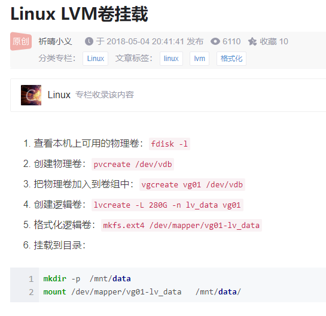

JVM需要加深学习

Jprofiler 使用

下载： https://www.macwk.com/soft/jprofiler

arthas 使用

jackson 怎么监控文件变化的？

怎么设置系统环境变量？

System.xxx

公司用的网络协议字段是怎么来的？ 自己定义的吗？

docker 可视化界面

docker  rancher # 有空再研究，

du -s /* | sort -nr

## Docsify定制代码高亮主题设置

https://juejin.cn/post/7059757753052430372

## JUC 图片补充

类找不到的异常总结

	1. 有些类初始化的时候就报错了，导致没有初始化。所以类找不到异常
 	2. maven依赖的scope是provide， 导致本地调试有问题

python 测试框架 

epel 	EPEL(Extra Packages for Enterprise Linux) Enterprise Linux（RHEL、CentOS）中经 常用到的包。总结

各种乱码问题！！！

chardet

clickhouse是什么