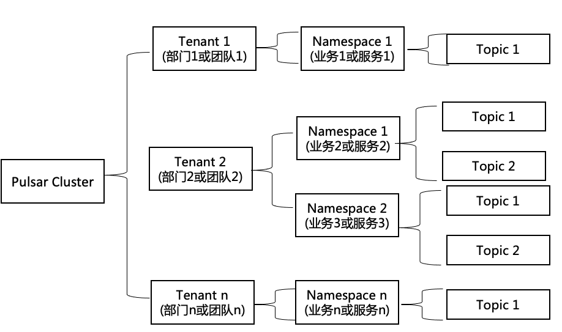

# pulsar笔记

参考 https://blog.frognew.com/2021/10/learning-apache-pulsar-03.html


# 一、pulsar简介


## 基本概念




### 租户(Tenant)

租户可以跨集群分布，表了组织中特定的业务单元，产品线、核心功能，这些由组织不同的部门或团队负责。每个租户都可以有单独的认证和授权机制，可以针对租户设置存储配额、消息生存时间TTL和隔离策略。

### 命名空间(Namespace)

命名空间是租户的管理单元，每个租户下可以创建多个命名空间。可以通过在命名空间上设置的配置策略来管理该命名空间下的Topic，这样就可以在命名空间的级别上为该命名空间的所有Topic设置访问权限、调整复制设置、管理跨集群跨地域的消息复制，控制消息过期时间。

### 主题(Topic)和分区主题(Partitioned Topic)

在Pulsar中所有消息的读取和写入都是和Topic进行，Pulsar的Topic本身并不区分`发布订阅模式`或者`生产消费模式(独占, 一个消息只能被一个消费者消费)`，Pulsar是依赖于各种`订阅类型`来控制消息的使用模式。


# 二、pulsar安装

docker安装 https://pulsar.apache.org/docs/zh-CN/next/standalone-docker/


# 三、 pulsar基本使用


## pulsar-admin命令

使用`pulsar-admin`查看一下集群列表，可以看到只有一个名称为`standalone`的集群:

```shell
cd /pulsar/bin
./pulsar-admin clusters list
```

查看一下租户列表，可以看到默认已经创建了`public`, `pulsar`, `sample`三个租户:

```shell
./pulsar-admin tenants list
```

创建一个名称为`study`的租户

```shell
./pulsar-admin tenants create study
./pulsar-admin tenants list
```

在study租户下创建名称为app1的命名空间:

```shell
./pulsar-admin namespaces create study/app1
./pulsar-admin namespaces list study
```

在app1的命名空间下创建一个名称为`topic-1`的topic:

```shell
./pulsar-admin topics create persistent://study/app1/topic-1
./pulsar-admin topics list study/app1
```


实际上，pulsar-admin命令行工具是使用Pulsar Admin REST API接口来完成工作的。Pulsar的Web接口在8080端口上。 可以直接以HTTP请求的形式访问Pulsar Admin REST API接口，例如查看study租户下的命名空间:

```
curl 127.0.0.1:8080/admin/v2/namespaces/study
# 结果： ["study/app1"]
```

https://pulsar.apache.org/admin-rest-api/是Pulsar Admin REST API的接口文档。


# 四、pulsar web 管理

https://github.com/apache/pulsar-manager


