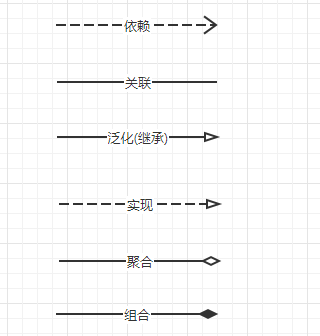
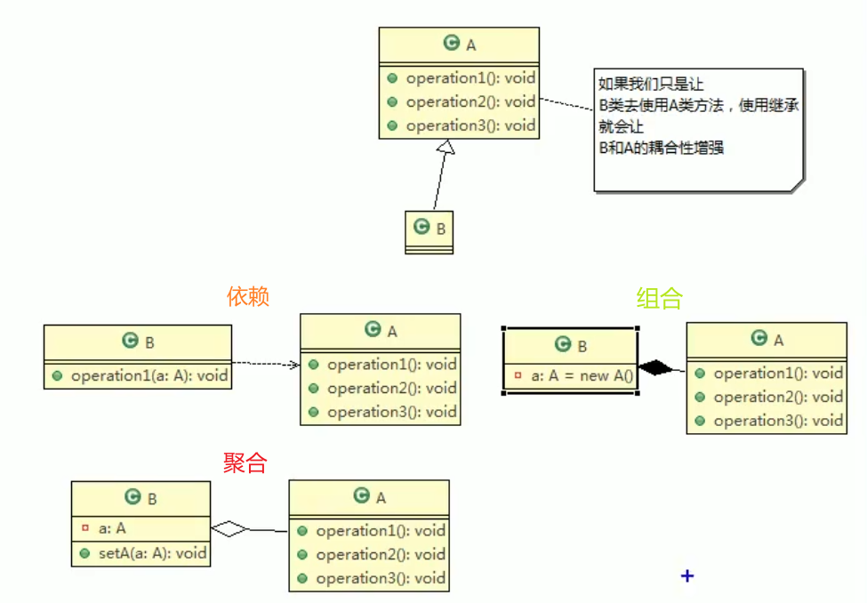

**设计模式**

参考 

https://www.runoob.com/design-pattern/singleton-pattern.html

http://c.biancheng.net/view/1317.html

# UML图

连线种类

工具: 在线的presson， RationalRose,  IDEA的PlantUML插件

依赖是指，只要类中用到了对方，那么他们之间求存在依赖关系，比如B类的父类、成员变量、构造器参数、方法参数、返回值、是A类， B和A就存在依赖

关联只是， 类于类是1对1，1对多，多对1的关系， 比如B类有成员变量List\<A\>， B和A的关系就是1对多的关系

组合和聚合的异同点

​	相同点：都是整体和部分的关系，依赖关系为类和成员变量的关系
​	不同点：
​		组合关系，整体和部分不可以分开（比如人和人头）
​		聚合关系，整体和部分可以分开（比如人和身份证）

关联，聚合，组合，泛化，实现都是特殊情况的依赖

# 七大设计原则

设计原则核心思想

1. 找出应用中可能需要变化之处，把他们独立出来，不要和那些不需要变化的代码混在一起
2. 针对接口编程，而不是针对实现编程
3. 为了交互对象之间的松耦合设计而努力

七大设计原则

1. 单一职责原则
    1. 一个类只干一件事，或者一个方法只干一件事
2. 接口隔离原则
    1. 一个类依赖的接口如果有他自己不需要的方法，那么就需要将这个接口进行拆分，拆分成几个接口，然后类只依赖自己需要的接口
    2. 接口隔离就是说依赖的接口必须是最小的接口，无关的接口要隔离掉
3. 依赖倒转原则
    1. 思想
        1. 高层模块不应该依赖底层模块，二者都应该依赖于其抽象
        2. 抽象不应该依赖于细节，细节应该依赖于抽象，这就是**反转**
        3. 依赖倒转（倒置）的中心思想是**面向接口编程**
        4. 依赖倒转的设计理念： 相对于细节的多变性，抽象的东西会更稳定，java中的抽象是接口和抽象类，细节是具体的实现类
        5. 使用接口和抽象类的目的是制定好规范，而不涉及任何的具体操作，展现细节的任务交给他们的实现类完成
    2. 实现方式
        1. 通过接口传递实现依赖
        2. 通过构造方法实现依赖
        3. 通过setter方法传递依赖
4. 里氏替换原则
    1. 思想
        1. 继承会增加对象间的耦合性
            1. 比如父类的修改会影响到子类，不然子类的功能可能会有故障。
            2. 去掉继承的做法：原来的父类和子类都继承一个更通俗的基类，原有的继承关系去掉，才用依赖，聚合，组合等关系替代
        2. 里氏替换原则
            1. **所有引用基类的地方必须能透明地使用其子类的对象**;  
            2. 如果对每一个类型为 T1的对象 o1，都有类型为 T2 的对象o2，使得以 T1定义的所有程序 P 在所有的对象 o1 都代换成 o2 时，程序 P 的行为没有发生变化，那么类型 T2 是类型 T1 的子类型
        3. 在子类中尽量不要重写父类的方法
            1. 子类可以实现父类的抽象方法，但不能覆盖父类的非抽象方法
            2. 如果要重写，覆盖或实现父类的方法时输入参数可以被放大
            3. 如果要从写，覆写或实现父类的方法时输出结果可以被缩小
        4. 参考 https://geek-docs.com/design-pattern/design-principle/liskov-substitution-principle.html
5. **开闭原则（核心，重点）**
    1. 一个软件实体如类，模块和函数应该对扩展开放(对提供方而言)，对修改关闭（对使用方而言）。用抽象构建矿建，用实现扩展细节
    2. 当软件需要变化时，尽量通过扩展软件实体的行为来实现变化，而不是通过修改已有的代码的实现变化
6. 迪米特法则（最少知道原则）
    1. 一个对象应该对其他对象保持最少的了解
    2. 类与类的关系越密切，耦合度越大，耦合的方式有
        1. 依赖
        2. 关联
        3. 组合
        4. 聚合
    3. 迪米特法则还有个更简单的定义：只于直接的朋友通信， 直接的朋友包含
        1. 成员变量
        2. 方法参数
        3. 方法返回值
    4. 直接的朋友： 每个对象都会与其他对象有耦合关系，只要两个对象之间有耦合关系，我们就说这两个对象之前是朋友关系，局部变量中的类不是直接的朋友，也就是说陌生的类不要以局部变量的形式出现在类的内部。
7. 合成复用原则
    1. 尽量使用依赖，组合，聚合的方式，而不是使用继承
       

# 设计模式

github代码地址：https://github.com/Master-He/design-pattern/tree/master/src/main/java/org/github/hwj/singleton

## 创建型

创建型模式强调对象的创建， 在对象的创建上思考问题

### **工厂模式**

	#### 简单（静态）工厂模式

#### 工厂方法模式

### 抽象工厂模式

### **单例模式**

1. 饿汉式
    1. 饿汉式（静态常量）--可用
2. 懒汉式
    1. 懒汉式（线程不安全）
    2. 懒汉式（线程安全， 同步方法）
    3. 懒汉式（线程安全，同步代码块）
3. 双重检查
4. 静态内部类
5. 枚举

### 原型模式

强调怎么克隆对象，深拷贝还是浅拷贝

### 建造者模式

## 结构型

结构型模式是站在软件结构上思考问题

### 适配器模式

### 桥接模式

### **装饰器模式**

### 组合模式

### 外观模式

### 享元模式

### **代理模式**

## 行为型

在方法的设计层面上思考问题

### 模板方法模式

### 命令模式

### 访问者模式

### 迭代器模式

### 观察者模式

### 中介者模式

### 备忘录模式

### 解释器模式

### 状态模式

### 策略模式

### 责任链模式