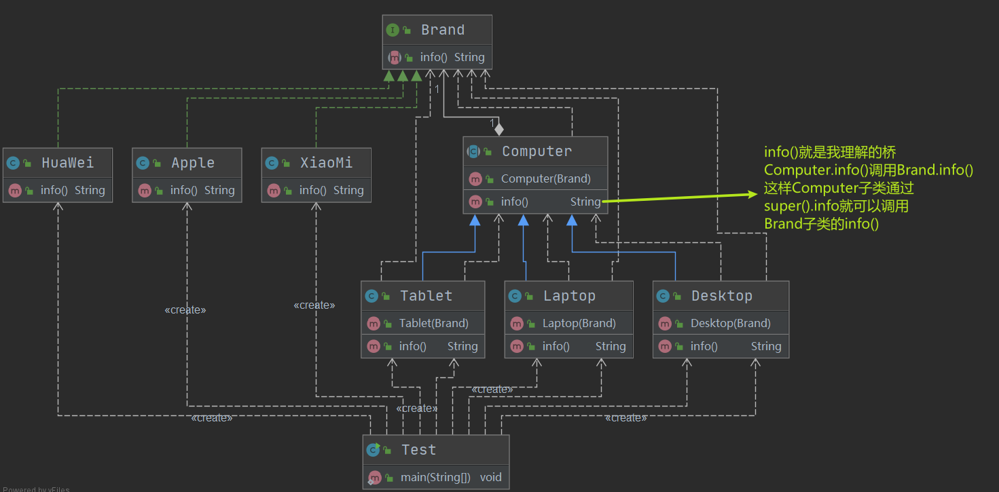
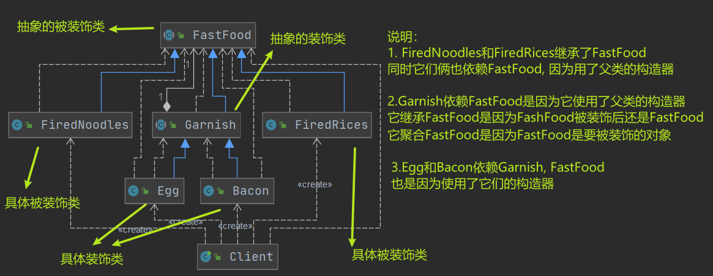
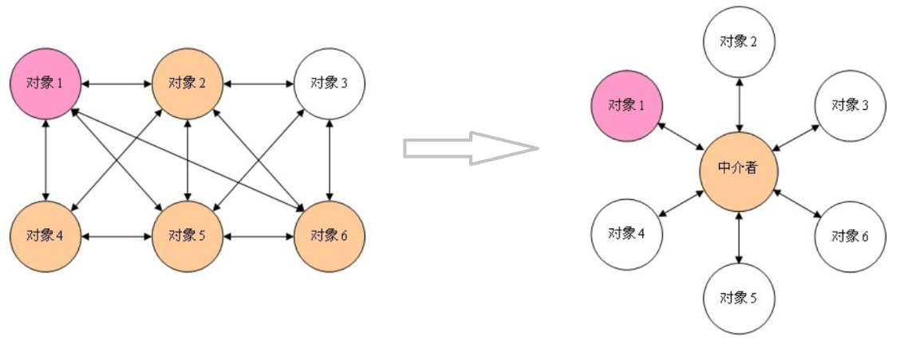
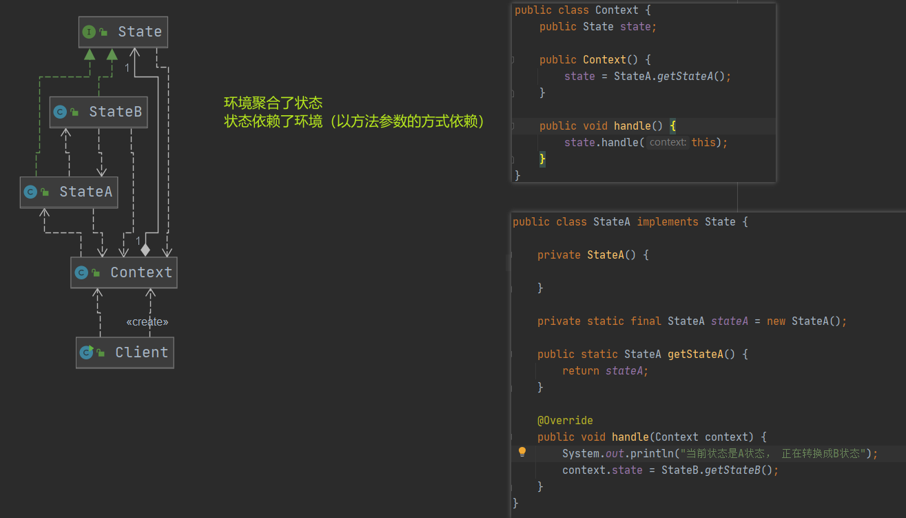

**设计模式**

参考 

https://www.runoob.com/design-pattern/singleton-pattern.html

http://c.biancheng.net/view/1317.html

# UML图

连线种类


工具: 在线的presson， RationalRose,  IDEA的PlantUML插件


依赖是指，只要类中用到了对方，那么他们之间求存在依赖关系，比如B类的父类、成员变量、构造器参数、方法参数、返回值、是A类， B和A就存在依赖

关联只是， 类于类是1对1，1对多，多对1的关系， 比如B类有成员变量List\<A\>， B和A的关系就是1对多的关系

组合和聚合的异同点

​	相同点：都是整体和部分的关系，依赖关系为类和成员变量的关系
​	不同点：
​		组合关系，整体和部分不可以分开（比如人和人头）
​		聚合关系，整体和部分可以分开（比如人和身份证）

关联，聚合，组合，泛化，实现都是特殊情况的依赖

# 七大设计原则

设计原则核心思想

1. 找出应用中可能需要变化之处，把他们独立出来，不要和那些不需要变化的代码混在一起
2. 针对接口编程，而不是针对实现编程
3. 为了交互对象之间的松耦合设计而努力


七大设计原则 （开里单接依迪合）

1. 单一职责原则
    1. 一个类只干一件事，或者一个方法只干一件事。 比如做菜的活只让厨师干， 理发的活只让tony老师干
2. 接口隔离原则
    1. 一个类依赖的接口如果有他自己不需要的方法，那么就需要将这个接口进行拆分，拆分成几个接口，然后类只依赖自己需要的接口
    2. 接口隔离就是说依赖的接口必须是最小的接口，无关的接口要隔离掉
3. 依赖倒转原则
    1. 思想
        1. 高层模块不应该依赖底层模块，二者都应该依赖于其抽象
        2. 抽象不应该依赖于细节，细节应该依赖于抽象，这就是**反转**（比如小明实现司机接口，宝马和奔驰实现车接口，司机接口依赖于车接口，而不是小明依赖于宝马或者奔驰）
        3. 依赖倒转（倒置）的中心思想是**面向接口编程**
        4. 依赖倒转的设计理念： 相对于细节的多变性，抽象的东西会更稳定，java中的抽象是接口和抽象类，细节是具体的实现类
        5. 使用接口和抽象类的目的是制定好规范，而不涉及任何的具体操作，展现细节的任务交给他们的实现类完成
    2. 实现方式
        1. 通过接口传递实现依赖
        2. 通过构造方法实现依赖
        3. 通过setter方法传递依赖
4. 里氏替换原则
    1. 思想
        1. 继承会增加对象间的耦合性
            1. 比如父类的修改会影响到子类，不然子类的功能可能会有故障。
            2. 去掉继承的做法：原来的父类和子类都继承一个更通俗的基类，原有的继承关系去掉，才用依赖，聚合，组合等关系替代
        2. 里氏替换原则
            1. **所有引用基类的地方必须能透明地使用其子类的对象**;  大白话就是父类被用到的地方，子类也能用，不会报错
            2. 如果对每一个类型为 T1的对象 o1，都有类型为 T2 的对象o2，使得以 T1定义的所有程序 P 在所有的对象 o1 都代换成 o2 时，程序 P 的行为没有发生变化，那么类型 T2 是类型 T1 的子类型
        3. 在子类中尽量不要重写父类的方法
            1. 子类可以实现父类的抽象方法，但不能覆盖父类的非抽象方法
            2. 如果要重写，覆盖或实现父类的方法时输入参数可以被放大
            3. 如果要从写，覆写或实现父类的方法时输出结果可以被缩小
        4. 参考 https://geek-docs.com/design-pattern/design-principle/liskov-substitution-principle.html
5. **开闭原则（核心，重点）**
    1. 一个软件实体如类，模块和函数应该对扩展开放(对提供方而言)，对修改关闭（对使用方而言）。用抽象构建矿建，用实现扩展细节
    2. 当软件需要变化时，尽量通过扩展软件实体的行为来实现变化，而不是通过修改已有的代码的实现变化
6. 迪米特法则（最少知道原则）
    1. 一个对象应该对其他对象保持最少的了解
    2. 类与类的关系越密切，耦合度越大，耦合的方式有
        1. 依赖
        2. 关联
        3. 组合
        4. 聚合
    3. 迪米特法则还有个更简单的定义：只于直接的朋友通信， 直接的朋友包含
        1. 成员变量
        2. 方法参数
        3. 方法返回值
    4. 直接的朋友： 每个对象都会与其他对象有耦合关系，只要两个对象之间有耦合关系，我们就说这两个对象之前是朋友关系，局部变量中的类不是直接的朋友，也就是说陌生的类不要以局部变量的形式出现在类的内部。
7. 合成复用原则
    1. 尽量使用依赖，组合，聚合的方式，而不是使用继承
       


# 设计模式（23种）

## github代码 

地址： https://github.com/Master-He/design-pattern/


## 创建型（5种）

创建型模式强调对象的创建， 在对象的创建上思考问题

### 工厂模式

1. 简单工厂模式（静态工厂模式）
2. 工厂方法模式

简单工厂不满足开闭原则， 而工厂方法模式满足


### 抽象工厂模式

和工厂模式的区别，工厂模式是针对一种产品的， 而抽象工厂模式是针对多种产品的，产品是一个系列或者有关系的
换句话说就是工厂模式生产一种产品，抽象工厂模式生产一整个产品族的产品

### 单例模式

1. 饿汉式
    1. 饿汉式（静态常量）--可用
2. 懒汉式
    1. 懒汉式（线程不安全）
    2. 懒汉式（线程安全， 同步方法）
    3. 懒汉式（线程安全，同步代码块）
3. 双重检查
4. 静态内部类
5. 枚举

### 原型模式

用于创建重复对象；如果直接创建对象过程比较复杂，比如创建过程需要连接数据库，那么可以通过复制创建新的对象
深拷贝的方法：	

1. 序列化和反序列化
2. 重写clone方法

### 建造者模式

建造者模式将对象和对象的创建过程解耦，方便构建复杂对象
建造者模式有四个部分，产品，抽象建造者，具体建造者，指挥者

隔离了复杂对象的创建和使用，并使相同的创建过程可以创建不同的产品
建造者侧重于一步步构建一个复杂的对象，构建完后返回。 侧重在于构建对象的步骤

建造者模式又叫生成器模式


## 结构型（7种）

结构型模式是站在软件结构上思考问题， 目的是从程序的结构上实现松耦合，从而可以扩大整体的类结构，解决更大的问题

### 适配器模式

适配器模式可以使**由于接口不兼容而不能一起工作的那些类**可以一起工作。比如Java代码中字节流转换成字符流就用到了此模式
简单的说就是原本不能兼容的类可以变得兼容

适配器的类型

1. 类适配器： 适配器继承被适配的类，实现要适配的接口
2. 对象适配器： 适配器聚合被适配的类，实现要适配的接口
3. 接口适配器：（接口隔离的一种实现方式）定义一个抽象类对接口进行空实现，然后继承抽象类只实现自己需要实现的方法。 这样就能达到只实现部分接口方法的目的

适配器模式使用案例： springmvc 的 dispatcher的HandleAdapter处理类


### 桥接模式

桥接将抽象部分和实现部分分离，使它们都可以独立的变化。 如果实现部分继承抽象部分，会造成类爆炸问题，扩展起来不灵活
比如抽象部分：电脑类型（平板电脑，笔记本电脑，台式电脑）实现部分：品牌（小米，华为，苹果， 三星），如果是实现部分继承抽象部分
就有3*4=12种类， 而如果是桥接则只有3+4=7种类，桥接不会有类爆炸问题，扩展起来也方便

桥接模式遵循了单一职责原则，一个类只做一件事

桥接模式是为了让类在多个维度上自由的扩展

桥接模式中， 抽象类（桥）是电脑， 抽象类的子类(平板，笔记本，台式) 通过电脑（桥）桥接到品牌接口，使用品牌的功能

```java
Computer抽象类（桥）
    Tablet平板电脑类 // 他可以通过桥调用Brand接口定义的方法
    Laptop笔记本电脑类
    Desktop台式电脑类
Brand接口（聚合到Computer类，作为Computer的成员变量）
    XiaoMi品牌
    Apple品牌
    HuaWei品牌
```

适配器模式使用案例：JDBC

桥接模式的优缺点

1. 优点
    1. 因为抽象和实现分离，极大提供了系统的灵活性。
    2. 桥接模式替代了多层继承方案，可以减少子类的个数，降低系统管理和维护成本。
2. 缺点
    1. 桥接模式的引入会增加系统的理解和设计的难度。因为聚合关联关系建立在抽象层，所以开发者需要针对抽象进行设计和编程
    2. 桥接模式需要正确识别说系统独立变化的维度，识别出哪个是抽象部分，哪个是实现部分




### **装饰器模式**

装饰器模式允许向一个现有的对象添加新的功能，同时又不改变其原有的结构。即动态地将新功能附加到对象上

装饰器类 **继承 并 聚合** 了被装饰类， **聚合**会为了对类进行装饰，继承是为了装时候还是属于被装饰类

装饰器模式含有递归的思想

以快餐加配料为例



java IO源码就用到了装饰器模式


### 组合模式

组合模式又叫部分整体模式

组合模式  把一组相似对象当做单一对象，依据**树形结构**来组合对象

组合模式主要包含三种角色：

* 抽象根节点（Component）：定义系统**各层次对象**的共有方法和属性，可以预先定义一些**默认行为和属性。**
* 树枝节点（Composite）：定义树枝节点的行为，存储子节点，组合树枝节点和叶子节点**形成一个树形结构。**
* 叶子节点（Leaf）：叶子节点对象，其下再无分支，是系统层次遍历的最小单位。

在使用组合模式时，根据抽象构件类的定义形式，我们可将组合模式分为**透明组合模式**和**安全组合模式**两种形式。
透明组合模式中，抽象根节点角色中声明了所有用于管理成员对象的方法， 抽象根节点提供 add()、remove() 等方法对叶子结点是没有意义的，这在编译阶段不会出错，但在运行阶段如果调用这些方法可能会出错

java HashMap就用到了组合模式


### 外观模式

外观（Facade）模式包含以下主要角色：

* 外观（Facade）角色：为多个子系统对外提供一个共同的接口。
* 子系统（Sub System）角色：实现系统的部分功能，客户可以通过外观角色访问它。

外观（Facade）模式是“迪米特法则”的典型应用

外观模式也叫门面模式

外观模式和代理模式有点像，外观模式是针对多个类进行操作，而代理模式是对一个类进行操作


### 享元模式

​	享元模式运用共享技术来有效地支持大量细粒度对象的复用。它通过共享已经存在的对象来大幅度减少需要创建的对象数量、避免大量相似对象的开销，从而提高系统资源的利用率。

享元（Flyweight ）模式中存在以下两种状态：

1. 内部状态，即不会随着环境的改变而改变的可共享部分。
2. 外部状态，指随环境改变而改变的不可以共享的部分。享元模式的实现要领就是区分应用中的这两种状态，并将外部状态外部化。

享元模式的主要有以下角色：

* 抽象享元角色（Flyweight）：通常是一个接口或抽象类，在抽象享元类中声明了具体享元类公共的方法，这些方法可以向外界提供享元对象的内部数据（内部状态），同时也可以通过这些方法来设置外部数据（外部状态）。
* 具体享元（Concrete Flyweight）角色 ：它实现了抽象享元类，称为享元对象；在具体享元类中为内部状态提供了存储空间。通常我们可以结合单例模式来设计具体享元类，为每一个具体享元类提供唯一的享元对象。
* 非享元（Unsharable Flyweight)角色 ：并不是所有的抽象享元类的子类都需要被共享，不能被共享的子类可设计为非共享具体享元类；当需要一个非共享具体享元类的对象时可以直接通过实例化创建。
* 享元工厂（Flyweight Factory）角色 ：负责创建和管理享元角色。当客户对象请求一个享元对象时，享元工厂检査系统中是否存在符合要求的享元对象，如果存在则提供给客户；如果不存在的话，则创建一个新的享元对象。


### **代理模式**

代理模式分为

- 静态代理
- 动态代理
    - JDK代理
        - JDK提供的动态代理。Java中提供了一个动态代理类Proxy，Proxy并不是我们上述所说的代理对象的类，而是提供了一个创建代理对象的静态方法（newProxyInstance方法）来获取代理对象。
    - CGLib代理
        - 需要引入第三方包
        - spring AOP用的是cglib代理

结构

​	代理（Proxy）模式分为三种角色：

* 抽象主题（Subject）类： 通过接口或抽象类声明真实主题和代理对象实现的业务方法。
* 真实主题（Real Subject）类： 实现了抽象主题中的具体业务，是代理对象所代表的真实对象，是最终要引用的对象。
* 代理（Proxy）类 ： 提供了与真实主题相同的接口，其内部含有对真实主题的引用，它可以访问、控制或扩展真实主题的功能。


代理选择

* jdk代理和CGLIB代理

    使用CGLib实现动态代理，CGLib底层采用ASM字节码生成框架，使用字节码技术生成代理类，在JDK1.6之前比使用Java反射效率要高。唯一需要注意的是，CGLib不能对声明为final的类或者方法进行代理，因为CGLib原理是动态生成被代理类的子类。

    在JDK1.6、JDK1.7、JDK1.8逐步对JDK动态代理优化之后，在调用次数较少的情况下，JDK代理效率高于CGLib代理效率，只有当进行大量调用的时候，JDK1.6和JDK1.7比CGLib代理效率低一点，但是到JDK1.8的时候，JDK代理效率高于CGLib代理。所以如果有接口使用JDK动态代理，如果没有接口使用CGLIB代理。

* 动态代理和静态代理

    动态代理与静态代理相比较，最大的好处是接口中声明的所有方法都被转移到调用处理器一个集中的方法中处理（InvocationHandler.invoke）。这样，在接口方法数量比较多的时候，我们可以进行灵活处理，而不需要像静态代理那样每一个方法进行中转。

    如果接口增加一个方法，静态代理模式除了所有实现类需要实现这个方法外，所有代理类也需要实现此方法。增加了代码维护的复杂度。而动态代理不会出现该问题


## 行为型（11种）

在方法的设计层面上思考问题

### 模板方法模式


流程固定，但是流程中的每一步算法都是需要具体情况具体分析的

抽象类，抽象类里面有final方法（流程固定）， 多个抽象方法

比如： 银行业务， 取号，排队，办理业务流程固定， 但是其中排队可以分别VIP的排队和普通会员的排队， 其中不同的人的办理的业务不同，有人存钱，有人取钱


模板方法模式包含以下主要角色。

1）抽象类/抽象模板（Abstract Class）

抽象模板类，负责给出一个算法的轮廓和骨架。它由一个模板方法和若干个基本方法构成。这些方法的定义如下。

① 模板方法：定义了算法的骨架，按某种顺序调用其包含的基本方法。

② 基本方法：是整个算法中的一个步骤，包含以下几种类型。

- 抽象方法：在抽象类中声明，由具体子类实现。
- 具体方法：在抽象类中已经实现，在具体子类中可以继承或重写它。
- 钩子方法：在抽象类中已经实现，包括用于判断的逻辑方法和需要子类重写的空方法两种。

2）具体子类/具体实现（Concrete Class）

具体实现类，实现抽象类中所定义的抽象方法和钩子方法，它们是一个顶级逻辑的一个组成步骤。


### 命令模式

将一个请求封装为一个对象，使发出请求的责任和执行请求的责任分割开。这样两者之间通过命令对象进行沟通，这样方便将命令对象进行存储、传递、调用、增加与管理。

命令模式包含以下主要角色：

* 抽象命令类（Command）角色： 定义命令的接口，声明执行的方法。
* 具体命令（Concrete  Command）角色：具体的命令，实现命令接口；通常会持有接收者，并调用接收者的功能来完成命令要执行的操作。
* 实现者/接收者（Receiver）角色： 接收者，真正执行命令的对象。任何类都可能成为一个接收者，只要它能够实现命令要求实现的相应功能。
* 调用者/请求者（Invoker）角色： 要求命令对象执行请求，通常会持有命令对象，可以持有很多的命令对象。这个是客户端真正触发命令并要求命令执行相应操作的地方，也就是说相当于使用命令对象的入口。


```java
public interface Command {
    void execute();//只需要定义一个统一的执行方法
}

public class OrderCommand implements Command {

    //持有接受者对象
    private SeniorChef receiver;
    private Order order;

    public OrderCommand(SeniorChef receiver, Order order){
        this.receiver = receiver;
        this.order = order;
    }

    public void execute()  {
        System.out.println(order.getDiningTable() + "桌的订单：");
        Set<String> keys = order.getFoodDic().keySet();
        for (String key : keys) {
            receiver.makeFood(order.getFoodDic().get(key),key);
        }

        try {
            Thread.sleep(100);//停顿一下 模拟做饭的过程
        } catch (InterruptedException e) {
            e.printStackTrace();
        }


        System.out.println(order.getDiningTable() + "桌的饭弄好了");
    }
}

public class Order {
    // 餐桌号码
    private int diningTable;

    // 用来存储餐名并记录份数
    private Map<String, Integer> foodDic = new HashMap<String, Integer>();

    public int getDiningTable() {
        return diningTable;
    }

    public void setDiningTable(int diningTable) {
        this.diningTable = diningTable;
    }

    public Map<String, Integer> getFoodDic() {
        return foodDic;
    }

    public void setFoodDic(String name, int num) {
        foodDic.put(name,num);
    }
}

// 资深大厨类 是命令的Receiver
public class SeniorChef {

    public void makeFood(int num,String foodName) {
        System.out.println(num + "份" + foodName);
    }
}

public class Waitor {

    private ArrayList<Command> commands;//可以持有很多的命令对象

    public Waitor() {
        commands = new ArrayList();
    }
    
    public void setCommand(Command cmd){
        commands.add(cmd);
    }

    // 发出命令 喊 订单来了，厨师开始执行
    public void orderUp() {
        System.out.println("美女服务员：叮咚，大厨，新订单来了.......");
        for (int i = 0; i < commands.size(); i++) {
            Command cmd = commands.get(i);
            if (cmd != null) {
                cmd.execute();
            }
        }
    }
}

public class Client {
    public static void main(String[] args) {
        //创建2个order
        Order order1 = new Order();
        order1.setDiningTable(1);
        order1.getFoodDic().put("西红柿鸡蛋面",1);
        order1.getFoodDic().put("小杯可乐",2);

        Order order2 = new Order();
        order2.setDiningTable(3);
        order2.getFoodDic().put("尖椒肉丝盖饭",1);
        order2.getFoodDic().put("小杯雪碧",1);

        //创建接收者
        SeniorChef receiver=new SeniorChef();
        //将订单和接收者封装成命令对象
        OrderCommand cmd1 = new OrderCommand(receiver, order1);
        OrderCommand cmd2 = new OrderCommand(receiver, order2);
        //创建调用者 waitor
        Waitor invoker = new Waitor();
        invoker.setCommand(cmd1);
        invoker.setCommand(cmd2);

        //将订单带到柜台 并向厨师喊 订单来了
        invoker.orderUp();
    }
}
```


### 访问者模式

**定义：**

封装一些作用于某种数据结构中的各元素的操作，它可以在不改变这个数据结构的前提下定义作用于这些元素的新的操作。

访问者模式包含以下主要角色:

* 抽象访问者（Visitor）角色：定义了对每一个元素`（Element）`访问的行为，它的参数就是可以访问的元素，它的方法个数理论上来讲与元素类个数（Element的实现类个数）是一样的，从这点不难看出，访问者模式要求元素类的个数不能改变。
* 具体访问者（ConcreteVisitor）角色：给出对每一个元素类访问时所产生的具体行为。
* 抽象元素（Element）角色：定义了一个接受访问者的方法（`accept`），其意义是指，每一个元素都要可以被访问者访问。
* 具体元素（ConcreteElement）角色： 提供接受访问方法的具体实现，而这个具体的实现，通常情况下是使用访问者提供的访问该元素类的方法。
* 对象结构（Object Structure）角色：定义当中所提到的对象结构，对象结构是一个抽象表述，具体点可以理解为一个具有容器性质或者复合对象特性的类，它会含有一组元素（`Element`），并且可以迭代这些元素，供访问者访问。


**1，优点：**

* 扩展性好

    在不修改对象结构中的元素的情况下，为对象结构中的元素添加新的功能。

* 复用性好

    通过访问者来定义整个对象结构通用的功能，从而提高复用程度。

* 分离无关行为

    通过访问者来分离无关的行为，把相关的行为封装在一起，构成一个访问者，这样每一个访问者的功能都比较单一。

**2，缺点：**

* 对象结构变化很困难

    在访问者模式中，每增加一个新的元素类，都要在每一个具体访问者类中增加相应的具体操作，这违背了“开闭原则”。

* 违反了依赖倒置原则

    访问者模式依赖了具体类，而没有依赖抽象类。

    

​	使用场景

* 对象结构相对稳定，但其操作算法经常变化的程序。
* 对象结构中的对象需要提供多种不同且不相关的操作，而且要避免让这些操作的变化影响对象的结构。


扩展

访问者模式用到了一种双分派的技术。

**1，分派：**

变量被声明时的类型叫做变量的静态类型，有些人又把静态类型叫做明显类型；而变量所引用的对象的真实类型又叫做变量的实际类型。比如 `Map map = new HashMap()` ，map变量的静态类型是 `Map` ，实际类型是 `HashMap` 。根据对象的类型而对方法进行的选择，就是分派(Dispatch)，分派(Dispatch)又分为两种，即静态分派和动态分派。

**静态分派(Static Dispatch)** 发生在编译时期，分派根据静态类型信息发生。静态分派对于我们来说并不陌生，**方法重载**就是静态分派。

**动态分派(Dynamic Dispatch)** 发生在运行时期，动态分派动态地置换掉某个方法。Java通过**方法的重写**支持动态分派。

**2，动态分派：**

通过方法的重写支持动态分派。

```java
public class Animal {
    public void execute() {
        System.out.println("Animal");
    }
}

public class Dog extends Animal {
    @Override
    public void execute() {
        System.out.println("dog");
    }
}

public class Cat extends Animal {
     @Override
    public void execute() {
        System.out.println("cat");
    }
}

public class Client {
   	public static void main(String[] args) {
        Animal a = new Dog();
        a.execute();  // dog
        
        Animal a1 = new Cat();
        a1.execute();  // cat 
    }
}
```

上面代码的结果大家应该直接可以说出来，这不就是多态吗！运行执行的是子类中的方法。

Java编译器在编译时期并不总是知道哪些代码会被执行，因为编译器仅仅知道对象的静态类型，而不知道对象的真实类型；而方法的调用则是根据对象的真实类型，而不是静态类型。


**3，静态分派：**

通过方法重载支持静态分派。

```java
public class Animal {
}

public class Dog extends Animal {
}

public class Cat extends Animal {
}

public class Execute {
    public void execute(Animal a) {
        System.out.println("Animal");
    }

    public void execute(Dog d) {
        System.out.println("dog");
    }

    public void execute(Cat c) {
        System.out.println("cat");
    }
}

public class Client {
    public static void main(String[] args) {
        Animal a = new Animal();
        Animal a1 = new Dog();
        Animal a2 = new Cat();

        Execute exe = new Execute();
        exe.execute(a);  // Animal
        exe.execute(a1);  // Animal
        exe.execute(a2);  // Animal
        
        // 重载方法的分派是根据静态类型进行的，这个分派过程在编译时期就完成了。， 所以都是打印Animal
    }
}
```

**4，双分派：**

所谓双分派技术就是在选择一个方法的时候，不仅仅要根据消息接收者（receiver）的运行时区别，还要根据参数的运行时区别。

```java
public class Animal {
    public void accept(Execute exe) {
        exe.execute(this);
    }
}

public class Dog extends Animal {
    public void accept(Execute exe) {
        exe.execute(this);
    }
}

public class Cat extends Animal {
    public void accept(Execute exe) {
        exe.execute(this);
    }
}

public class Execute {
    public void execute(Animal a) {
        System.out.println("animal");
    }

    public void execute(Dog d) {
        System.out.println("dog");
    }

    public void execute(Cat c) {
        System.out.println("cat");
    }
}

public class Client {
    public static void main(String[] args) {
        Animal a = new Animal();
        Animal d = new Dog();
        Animal c = new Cat();

        Execute exe = new Execute();
        a.accept(exe);  // Animal
        d.accept(exe);  // Dog
        c.accept(exe);  // Cat
    }
}
```

在上面代码中，客户端将Execute对象做为参数传递给Animal类型的变量调用的方法，这里完成第一次分派，这里是方法重写，所以是动态分派，也就是执行实际类型中的方法，同时也`将自己this作为参数传递进去，这里就完成了第二次分派`，这里的Execute类中有多个重载的方法，而传递进行的是this，就是具体的实际类型的对象。

**双分派实现动态绑定的本质，就是在重载方法委派的前面加上了继承体系中覆盖的环节，由于覆盖是动态的，所以重载就是动态的了。**


### 迭代器模式

**定义：**

提供一个对象来顺序访问聚合对象中的一系列数据，而不暴露聚合对象的内部表示。 


迭代器模式主要包含以下角色：

* 抽象聚合（Aggregate）角色：定义存储、添加、删除聚合元素以及创建迭代器对象的接口。

* 具体聚合（ConcreteAggregate）角色：实现抽象聚合类，返回一个具体迭代器的实例。
* 抽象迭代器（Iterator）角色：定义访问和遍历聚合元素的接口，通常包含 hasNext()、next() 等方法。
* 具体迭代器（Concretelterator）角色：实现抽象迭代器接口中所定义的方法，完成对聚合对象的遍历，记录遍历的当前位置。


### 观察者模式

又被称为发布-订阅（Publish/Subscribe）模式，它定义了一种一对多的依赖关系，让多个观察者对象同时监听某一个主题对象。这个主题对象在状态变化时，会通知所有的观察者对象，使他们能够自动更新自己。

在观察者模式中有如下角色：

* Subject：抽象主题（抽象被观察者），抽象主题角色把所有观察者对象保存在一个集合里，每个主题都可以有任意数量的观察者，抽象主题提供一个接口，可以增加和删除观察者对象。
* ConcreteSubject：具体主题（具体被观察者），该角色将有关状态存入具体观察者对象，在具体主题的内部状态发生改变时，给所有注册过的观察者发送通知。
* Observer：抽象观察者，是观察者的抽象类，它定义了一个更新接口，使得在得到主题更改通知时更新自己。
* ConcrereObserver：具体观察者，实现抽象观察者定义的更新接口，以便在得到主题更改通知时更新自身的状态。


在 Java 中，通过 java.util.Observable 类和 java.util.Observer 接口定义了观察者模式，只要实现它们的子类就可以编写观察者模式实例。

**1，Observable类**

Observable 类是抽象目标类（被观察者），它有一个 Vector 集合成员变量，用于保存所有要通知的观察者对象，下面来介绍它最重要的 3 个方法。

* void addObserver(Observer o) 方法：用于将新的观察者对象添加到集合中。

* void notifyObservers(Object arg) 方法：调用集合中的所有观察者对象的 update方法，通知它们数据发生改变。通常越晚加入集合的观察者越先得到通知。

* void setChange() 方法：用来设置一个 boolean 类型的内部标志，注明目标对象发生了变化。当它为true时，notifyObservers() 才会通知观察者。

**2，Observer 接口**

Observer 接口是抽象观察者，它监视目标对象的变化，当目标对象发生变化时，观察者得到通知，并调用 update 方法，进行相应的工作。


### 中介者模式

中介模式个人理解就是通过中介将多对多的关系变成1对1，1对多的关系

中介模式又叫调停模式，定义一个中介角色来封装一系列对象之间的交互，使原有对象之间的耦合松散，且可以独立地改变它们之间的交互。



中介者模式包含以下主要角色：

* 抽象中介者（Mediator）角色：它是中介者的接口，提供了同事对象注册与转发同事对象信息的抽象方法。

* 具体中介者（ConcreteMediator）角色：实现中介者接口，定义一个 List 来管理同事对象，协调各个同事角色之间的交互关系，因此它依赖于同事角色。
* 抽象同事类（Colleague）角色：定义同事类的接口，保存中介者对象，提供同事对象交互的抽象方法，实现所有相互影响的同事类的公共功能。
* 具体同事类（Concrete Colleague）角色：是抽象同事类的实现者，当需要与其他同事对象交互时，由中介者对象负责后续的交互。


在实际开发中，通常采用以下两种方法来简化中介者模式，使开发变得更简单。

1. 不定义中介者接口，把具体中介者对象实现成为单例。
2. 同事对象不持有中介者，而是在需要的时候直接获取中介者对象并调用。


### 备忘录模式

备忘录模式提供了一种状态恢复的实现机制，使得用户可以方便地回到一个特定的历史步骤，当新的状态无效或者存在问题时，可以使用暂时存储起来的备忘录将状态复原，很多软件都提供了撤销（Undo）操作，如 Word、记事本、Photoshop、IDEA等软件在编辑时按 Ctrl+Z 组合键时能撤销当前操作，使文档恢复到之前的状态；还有在 浏览器 中的后退键、数据库事务管理中的回滚操作、玩游戏时的中间结果存档功能、数据库与操作系统的备份操作、棋类游戏中的悔棋功能等都属于这类。

**定义：**

又叫快照模式，在不破坏封装性的前提下，捕获一个对象的内部状态，并在该对象之外保存这个状态，以便以后当需要时能将该对象恢复到原先保存的状态。


备忘录模式的主要角色如下：

* 发起人（Originator）角色：记录当前时刻的内部状态信息，提供创建备忘录和恢复备忘录数据的功能，实现其他业务功能，它可以访问备忘录里的所有信息。
* 备忘录（Memento）角色：负责存储发起人的内部状态，在需要的时候提供这些内部状态给发起人。
* 管理者（Caretaker）角色：对备忘录进行管理，提供保存与获取备忘录的功能，但其不能对备忘录的内容进行访问与修改。

> 备忘录有两个等效的接口：
>
> * **窄接口**：管理者(Caretaker)对象（和其他发起人对象之外的任何对象）看到的是备忘录的窄接口(narror Interface)，这个窄接口只允许他把备忘录对象传给其他的对象。
> * **宽接口**：与管理者看到的窄接口相反，发起人对象可以看到一个宽接口(wide Interface)，这个宽接口允许它读取所有的数据，以便根据这些数据恢复这个发起人对象的内部状态。


### 解释器模式

在软件开发中，会遇到有些问题多次重复出现，而且有一定的相似性和规律性。
如果将它们归纳成一种简单的语言，那么这些问题实例将是该语言的一些句子，这样就可以用编译原理中的解释器模式来实现了


定义和特点

**定义：**

> 给定一个语言，定义它的文法表示，并定义一个解释器，这个解释器使用该标识来解释语言中的句子。

也就是说，**用编译语言的方式来分析应用中的实例**。 这种模式实现了文法表达式处理的就接口，该接口解释一个特定的上下文。


解释器模式包含以下主要角色。

* 抽象表达式（Abstract Expression）角色：定义解释器的接口，约定解释器的解释操作，主要包含解释方法 interpret()。

* 终结符表达式（Terminal  Expression）角色：是抽象表达式的子类，用来实现文法中与终结符相关的操作，文法中的每一个终结符都有一个具体终结表达式与之相对应。
* 非终结符表达式（Nonterminal Expression）角色：也是抽象表达式的子类，用来实现文法中与非终结符相关的操作，文法中的每条规则都对应于一个非终结符表达式。
* 环境（Context）角色：通常包含各个解释器需要的数据或是公共的功能，一般用来传递被所有解释器共享的数据，后面的解释器可以从这里获取这些值。
* 客户端（Client）：主要任务是将需要分析的句子或表达式转换成使用解释器对象描述的抽象语法树，然后调用解释器的解释方法，当然也可以通过环境角色间接访问解释器的解释方法。


**1，优点：**

* 易于改变和扩展文法。

    由于在解释器模式中使用类来表示语言的文法规则，因此可以通过继承等机制来改变或扩展文法。每一条文法规则都可以表示为一个类，因此可以方便地实现一个简单的语言。

* 实现文法较为容易。

    在抽象语法树中每一个表达式节点类的实现方式都是相似的，这些类的代码编写都不会特别复杂。

* 增加新的解释表达式较为方便。

    如果用户需要增加新的解释表达式只需要对应增加一个新的终结符表达式或非终结符表达式类，原有表达式类代码无须修改，符合 "开闭原则"。

**2，缺点：**

- 对于复杂文法难以维护。

    在解释器模式中，每一条规则至少需要定义一个类，因此如果一个语言包含太多文法规则，类的个数将会急剧增加，导致系统难以管理和维护。

* 执行效率较低。

    由于在解释器模式中使用了大量的循环和递归调用，因此在解释较为复杂的句子时其速度很慢，而且代码的调试过程也比较麻烦。


使用场景

* 当语言的文法较为简单，且执行效率不是关键问题时。

* 当问题重复出现，且可以用一种简单的语言来进行表达时。

* 当一个语言需要解释执行，并且语言中的句子可以表示为一个抽象语法树的时候。


解释器模式常用于对简单语言的编译或分析实例中，为了掌握好它的结构与实现，必须先了解编译原理中的“文法、句子、语法树”等相关概念。


### 状态模式

定义：

对有状态的对象，把复杂的“判断逻辑”提取到不同的状态对象中，允许状态对象在其内部状态发生改变时改变其行为。
个人理解： 就是把状态对应的操作交给状态对象本身

状态模式包含以下主要角色。

* 环境（Context）角色：也称为上下文，它定义了客户程序需要的接口，维护一个当前状态，并将与状态相关的操作委托给当前状态对象来处理。
* 抽象状态（State）角色：定义一个接口，用以封装环境对象中的特定状态所对应的行为。
* 具体状态（Concrete  State）角色：实现抽象状态所对应的行为。

使用场景

- 当一个对象的行为取决于它的状态，并且它必须在运行时根据状态改变它的行为时，就可以考虑使用状态模式。
- 一个操作中含有庞大的分支结构，并且这些分支决定于对象的状态时。

UML图




### 策略模式

定义一系列的算法，这些算法可以在运行时相互替换。不影响算法的使用者，这个算法可以根据不同的情况随时切换

比如： 销售，想增加销售额
	策略1
		买一送一
	策略2
		满减
	策略3
		以旧换新


策略模式的主要角色如下：

* 抽象策略（Strategy）类：这是一个抽象角色，通常由一个接口或抽象类实现。此角色给出所有的具体策略类所需的接口。
* 具体策略（Concrete Strategy）类：实现了抽象策略定义的接口，提供具体的算法实现或行为。
* 环境（Context）类：持有一个策略类的引用，最终给客户端调用。


### 责任链模式

又名职责链模式，为了避免**请求发送者**与多个**请求处理者**耦合在一起，将所有请求的处理者通过**前一对象记住其下一个对象的引用**而连成一条链；当有请求发生时，可将请求沿着这条链传递，直到有对象处理它为止。

职责链模式主要包含以下角色:

* 抽象处理者（Handler）角色：定义一个处理请求的接口，包含抽象处理方法和一个后继连接。
* 具体处理者（Concrete Handler）角色：实现抽象处理者的处理方法，判断能否处理本次请求，如果可以处理请求则处理，否则将该请求转给它的后继者。
* 客户类（Client）角色：创建处理链，并向链头的具体处理者对象提交请求，它不关心处理细节和请求的传递过程。