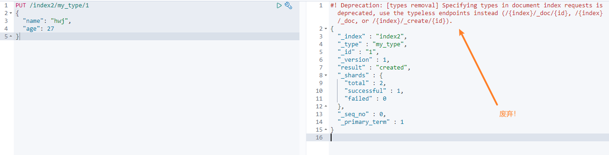
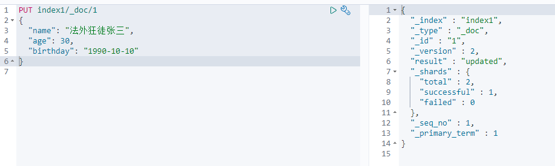

# ElasticSearch


名言： 在学校里，很多时候都是先进行学习，然后再进行考验。而在社会里，很多时候都是先经过了考验，才有机会进行学习！


名言：人生很难学会的一节课是放下。


# 1. ElasticSearch概述

es是分布式全文搜索引擎， es基于Lucene进行了封装。

Lucene是一个全文检索的函数库,或者说是一套信息检索的工具包! jar包！ 不包含搜索引擎系统！ Lucene包含了索引结构， 读写索引的工具， 排序搜索规则等

> 扩展: Doug Cutting是Lucene的作者, Hadoop之父

​	GFS(Google File System)

​		==> NDFS(Nutch Distributed File System)  

​			==> HDFS (Hadoop Distributed File System)

​			==> HBase 

> es历史

Shay Banon 一开始基于Lucene开发了一个开源项目Compass，方便在应用中添加搜索功能

==> 然后因为Shay Banon的工作需要，基于Compass又写了一个独立的服务叫做ElasticSearch

  

# 2. ElasticSearch安装

## ElasticSearch安装

```shell
docker network create es_network
docker run -d --name elasticsearch --net es_network -p 9200:9200 -p 9300:9300 -e "discovery.type=single-node" elasticsearch:7.6.2

# 或者
docker run -d --name elasticsearch --net somenetwork -p 9200:9200 -p 9300:9300 -e "discovery.type=single-node" -e ES_JAVA_OPTS="-Xms64m -Xmx512m"  elasticsearch:7.6.2
# -e 是设置环境变量
# ES_JAVA_OPTS="-Xms64m -Xmx512m" 将jvm的内存限制在64~512M
```

目录说明

```shell
bin # 启动目录
config # 配置文件目录
	log4j2 # 日志配置文件
	jvm.options # jvm配置文件
	elasticserach.yml # es配置文件， 默认9200, 跨域
lib # 相关jar包， 比如lucene
modules # 功能模块
plugins # 插件， 比如ik分词器
```


## Kibana安装

```shel
docker run -d --name kibana --net es_network -p 5601:5601 kibana:7.6.2
```

设置成中文

```shell
# 1. 进入kibana容器
vi /usr/share/kibana/config/kibana.yml
# 2. 最后一行加上i18n.locale: "zh-CN"
# 3. 退出容器， 重启容器
```


## elasticsearch 浏览器插件


# 3. ElasticSearch核心概念


1、索引（indices）

2、字段类型（mappings）

3、文档（documents）


> es是面向文档的， 关系型数据库和es的客观对比

| DB        | ES                  |
| --------- | ------------------- |
| databases | indices             |
| tables    | types（deprecated） |
| rows      | documents           |
| columns   | fields              |


> 倒排索引


倒排索引我的理解是：以关键词作为key,关键词出现过的地方形成一个列表作为value  严格的定义我说不出来。

百科定义


> es的索引和lucene的索引对比

在es中，一个索引分为多个分片，每个分片就是一个lucene索引 ==> 所以一个es索引就是由多个lucene索引组成的


# 4. IK分词器插件

> 一般安装

1. 下载： https://github.com/medcl/elasticsearch-analysis-ik/tree/v7.6.2
2. 将其解压放进/usr/share/elasticsearch/plugins目录中
3. 重启es
4. 执行`elasticsearch-plugin list`命令查看已经加载的插件

> docker下安装

参考

https://www.jianshu.com/p/d8b0c736070f

1. 我先下载zip包到本地， 因为docker容器下载可能会很慢很慢

```shell
wget https://github.com/medcl/elasticsearch-analysis-ik/releases/download/v7.6.2/elasticsearch-analysis-ik-7.6.2.zip
```

2. 复制到es容器中

```shell
docker cp elasticsearch-analysis-ik-7.6.2.zip [容器id]:/usr/share/elasticsearch/plugins
```

3. 进入es容器/plugins目录解压zip包, 解压完删除zip包

```shell
docker exec -it [容器id] unzip -d /usr/share/elasticsearch/plugins/ik /usr/share/elasticsearch/plugins/elasticsearch-analysis-ik-7.6.2.zip

docker exec -it [容器id] rm -f /usr/share/elasticsearch/plugins/elasticsearch-analysis-ik-7.6.2.zip
```

4. 重启es容器

```shell
docker restart [容器id]
```

5. 查看是否加载了插件

```shell
docker exec -it [容器id] elasticsearch-plugin list
```


> 分词

分词就是把一段文字划分成一个个的关键字，我们在搜索的时候会将自己的信息进行分词， 会把数据库中或者索引库中的数据进行分析，然后进行一个匹配操作，默认的中文分词就是将每个字看成一个词，比如“你好世界“会被分成”你“,"好","世","界，这个显然是不符合要求的，所以我们需要安装中文分词器ik来解决这个问题


> 分词算法

ik提供两种分词算法： ik_smart 和 ik_max_word， 其中ik_smart是最少切分， is_max_word是最细粒度划分

ik_smart 效果：


ik_max_word效果：


自己自定义的词需要加在字典里面(需要重启es)


参考狂神说 https://www.bilibili.com/video/BV17a4y1x7zq?p=8


 # 5. 索引的CURD


## 1、创建一个索引

```shell
PUT /索引名/_doc/文档id
PUT /索引名/类型名/文档id  # 这种以后是是废弃的
```





指定字段类型

https://www.elastic.co/guide/en/elasticsearch/reference/7.6/mapping.html#update-mapping


查看**指定字段类型**的索引


>  其他查询

```shell
GET _cat/health
GET _cat/indices?v
```


## 2、修改一个索引

修改和提交都可以用put （不能进行部分修改）



不过大多数修改还是用post ( 可进行部分修改 )


## 3、 删除一个索引


# 6. 文档的CURD(重点)

