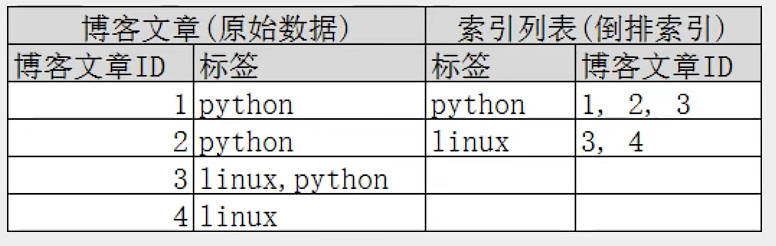
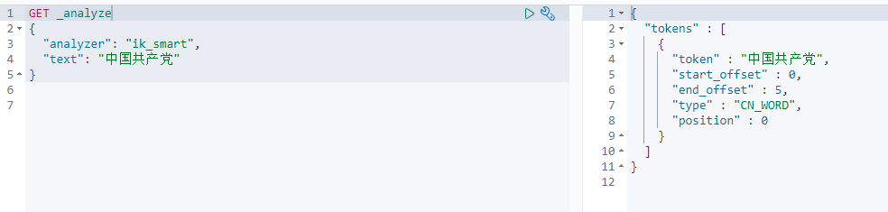

# ElasticSearch


名言： 在学校里，很多时候都是先进行学习，然后再进行考验。而在社会里，很多时候都是先经过了考验，才有机会进行学习！


名言：人生很难学会的一节课是放下。


# 1. ElasticSearch概述

es是分布式全文搜索引擎， es基于Lucene进行了封装。

Lucene是一个全文检索的函数库,或者说是一套信息检索的工具包! jar包！ 不包含搜索引擎系统！ Lucene包含了索引结构， 读写索引的工具， 排序搜索规则等

> 扩展: Doug Cutting是Lucene的作者, Hadoop之父

​	GFS(Google File System)

​		==> NDFS(Nutch Distributed File System)  

​			==> HDFS (Hadoop Distributed File System)

​			==> HBase 

> es历史

Shay Banon 一开始基于Lucene开发了一个开源项目Compass，方便在应用中添加搜索功能

==> 然后因为Shay Banon的工作需要，基于Compass又写了一个独立的服务叫做ElasticSearch

  

# 2. ElasticSearch安装

## ElasticSearch安装

```shell
docker network create es_network
docker run -d --name elasticsearch --net es_network -p 9200:9200 -p 9300:9300 -e "discovery.type=single-node" elasticsearch:7.6.2

# 或者
docker run -d --name elasticsearch --net es_network -p 9200:9200 -p 9300:9300 -e "discovery.type=single-node" -e ES_JAVA_OPTS="-Xms512m -Xmx512m"  elasticsearch:7.6.2
# -e 是设置环境变量
# ES_JAVA_OPTS="-Xms64m -Xmx512m" 将jvm的内存限制在64~512M
```

目录说明

```shell
bin # 启动目录
config # 配置文件目录
	log4j2 # 日志配置文件
	jvm.options # jvm配置文件
	elasticserach.yml # es配置文件， 默认9200, 跨域
lib # 相关jar包， 比如lucene
modules # 功能模块
plugins # 插件， 比如ik分词器
```


## Kibana安装

```shel
docker run -d --name kibana --net es_network -p 5601:5601 kibana:7.6.2
```

设置成中文

```shell
# 1. 进入kibana容器
vi /usr/share/kibana/config/kibana.yml
# 2. 最后一行加上i18n.locale: "zh-CN"
# 3. 退出容器， 重启容器
```


## elasticsearch 浏览器插件


# 3. ElasticSearch核心概念


1、索引（indices）

2、字段类型（mappings）

3、文档（documents）


> es是面向文档的， 关系型数据库和es的客观对比

| DB        | ES                  |
| --------- | ------------------- |
| databases | indices             |
| tables    | types（deprecated） |
| rows      | documents           |
| columns   | fields              |


> 倒排索引



倒排索引我的理解是：以关键词作为key,关键词出现过的地方形成一个列表作为value  严格的定义我说不出来。

百科定义


> es的索引和lucene的索引对比

在es中，一个索引分为多个分片，每个分片就是一个lucene索引 ==> 所以一个es索引就是由多个lucene索引组成的


# 4. IK分词器插件

elasticsearch教程--中文分词器作用和使用： https://cloud.tencent.com/developer/article/1444500

例子：  我爱伟大的祖国 分词成： [我,爱,伟大,的,祖国]

> 一般安装

1. 下载： https://github.com/medcl/elasticsearch-analysis-ik/tree/v7.6.2
2. 将其解压放进/usr/share/elasticsearch/plugins目录中
3. 重启es
4. 执行`elasticsearch-plugin list`命令查看已经加载的插件

> docker下安装

参考

https://www.jianshu.com/p/d8b0c736070f

1. 我先下载zip包到本地， 因为docker容器下载可能会很慢很慢

```shell
wget https://github.com/medcl/elasticsearch-analysis-ik/releases/download/v7.6.2/elasticsearch-analysis-ik-7.6.2.zip
# win下，复制链接下载，而不是去github下载zip包！
```

2. 复制到es容器中

```shell
docker cp elasticsearch-analysis-ik-7.6.2.zip [容器id]:/usr/share/elasticsearch/plugins
```

3. 进入es容器/plugins目录解压zip包, 解压完删除zip包

```shell
docker exec -it [容器id] unzip -d /usr/share/elasticsearch/plugins/ik /usr/share/elasticsearch/plugins/elasticsearch-analysis-ik-7.6.2.zip
docker exec -it [容器id] rm -f /usr/share/elasticsearch/plugins/elasticsearch-analysis-ik-7.6.2.zip
```

4. 重启es容器

```shell
docker restart [容器id]
```

5. 查看是否加载了插件

```shell
docker exec -it [容器id] elasticsearch-plugin list
```


> 分词

分词就是把一段文字划分成一个个的关键字，我们在搜索的时候会将自己的信息进行分词， 会把数据库中或者索引库中的数据进行分析，然后进行一个匹配操作，默认的中文分词就是将每个字看成一个词，比如“你好世界“会被分成”你“,"好","世","界，这个显然是不符合要求的，所以我们需要安装中文分词器ik来解决这个问题


> 分词算法

ik提供两种分词算法： ik_smart 和 ik_max_word， 其中ik_smart是最少切分， is_max_word是最细粒度划分

ik_smart 效果：

```shell
GET _analyze 
{
  "analyzer": "ik_smart",
  "text": "中国共产党"
}
```



ik_max_word效果：

```shell
GET _analyze 
{
  "analyzer": "ik_max_word",
  "text": "中国共产党"
}
```


自己自定义的词需要加在字典里面(需要重启es)


参考狂神说 https://www.bilibili.com/video/BV17a4y1x7zq?p=8


 # 5. 索引的CURD


## 1、创建一个索引

```shell
PUT /索引名/_doc/文档id
PUT /索引名/类型名/文档id  # 这种以后是是废弃的

PUT /index/_doc/1
{
  "name":"hwj",
  "age":12
}
```


指定字段类型

https://www.elastic.co/guide/en/elasticsearch/reference/7.6/mapping.html#update-mapping


查看**指定字段类型**的索引


>  其他查询

```shell
GET _cat/health
GET _cat/indices?v
```


## 2、修改一个索引

修改和提交都可以用put （不能进行部分修改）


不过大多数修改还是用post ( 可进行部分修改 )


## 3、 删除一个索引


# 6. 文档的CURD(重点)

 

## 1、添加数据 PUT

```shell
PUT /index1/_doc/1
{
  "name": "hwj",
  "age": 27
}
```


## 2、 查询数据 GET

### 简单的条件查询

```shell
GET /index1/_doc/1
```


 

### 复杂的条件搜索

```SH
# 这几个等价
GET index1/_doc/_search?q=name:hwj
GET index1/_search?q=name:hwj
GET index1/_search
{
  "query": {
    "match": {
      "name": "hwj"
    }
  }
}
```


### 数据准备

```shell
PUT /index/_doc/1
{
  "name":"特朗普",
  "age":71
}
```


### 结果字段的过滤用_source

```shell
GET index1/_search
{
  "query": {
    "match": {
      "name": "特朗普"
    }
  }, 
  "_source": ["name", "age"]
}
```

  

### 排序

```shell
GET index1/_search
{
  "query": {
    "match": {
      "name": "特朗普"
    }
  }, 
  "_source": ["name", "age"],
  "sort": [
    {
      "age": {
        "order": "asc"
      }
    }
  ]
}
```


### 分页

```shell
GET index1/_search
{
  "query": {
    "match": {
      "name": "特朗普"
    }
  }, 
  "_source": ["name", "age"],
  "sort": [
    {
      "age": {
        "order": "asc"
      }
    }
  ],
  "from": 0,
  "size": 2
}
```


### 布尔值查询

#### must ( and )， 所有的条件都要符合！

```shell
# 搜索名叫特朗普并且是71岁的人
GET index1/_search
{
  "query": {
    "bool": {
      "must": [
        {
          "match": {
            "name": "唐特朗普"
          }
        },
        {
          "match": {
            "age": "71"
          }
        }
      ]
    }
  }
}
```

#### should（or）, 有一个条件符合即可！

```shell
# 搜索名叫特朗普或者71岁的人
GET index1/_search
{
  "query": {
    "bool": {
      "should": [
        {
          "match": {
            "name": "特朗普"
          }
        },
        {
          "match": {
            "age": "71"
          }
        }
      ]
    }
  }
}
```

#### must_not ( not )， 条件取反

```json
# 搜索不叫特朗普的人
GET index1/_search
{
  "query": {
    "bool": {
      "must_not": [
        {
          "match": {
            "name": "唐特朗普"
          }
        }
      ]
    }
  }
}
```

#### filter 过滤得到符合条件的

```json
# 过滤得到71-72年龄段的人
GET index1/_search
{
  "query": {
    "bool": {
      "must": [
        {
          "match": {
            "name": "唐特朗普"
          }
        }
      ],
      "filter": [
        {
          "range": {
            "age": {
              "gte": 71,
              "lte": 72
            }
          }
        }
      ]
    }
  }
}
```

### 匹配多个条件

匹配一个条件

```json
GET index1/_search
{
  "query": {
    "match": {
      "tags": "总统"
    }
  }
}
```


匹配多个条件（多个条件用空格分开，只要有个条件匹配到即可，条件匹配到的越多score越高）

```json
GET index1/_search
{
  "query": {
    "match": {
      "tags": "总统 男人 负翁"
    }
  }
}
```


term和match， `match_phrase` 的区别

term是代表完全匹配，也就是精确查询，搜索前不会再对搜索词进行分词拆解。

从概念上看，term属于精确匹配，只能查单个词。我想用term匹配多个词怎么做？


`match_phrase` 称为短语搜索，要求所有的分词必须同时出现在文档中，同时位置必须紧邻一致。

参考：https://www.jianshu.com/p/d5583dff4157


### 精确查询 term

term 查询是直接通过**倒排索引**指定的词条进行精确的查找

**关于分词：**

term， 直接查询精确的值

match， 会使用分词器解析！（先分析文档，然后再通过分析的文档进行查询！）

**两个类型：**

text: 会被分词器解析

keyword: 不会被分词器解析


我们先创建测试用的索引

```json
PUT test_index
{
  "mappings": {
    "properties": {
      "name": {
        "type": "text"
      },
      "desc": {
        "type": "keyword"
      }
    }
  }
}

# 这里name字段的值会被解析， 而desc字段的值不会被解析
```

然后插入数据

```json
PUT test_index/_doc/1
{
  "name": "特朗普教java name",
  "desc": "特朗普教java desc"
}
PUT test_index/_doc/2
{
  "name": "特朗普教java name",
  "desc": "特朗普教java desc2"
}
```

然后进行分词查看， 发现**standard会被分词器解析， 而keyword不会**

```json
# 尝试运行
GET _analyze
{
  "analyzer": "keyword",
  "text": "特朗普说java name"
}
# 发现如果是keyword， “特朗普说java name”没有被拆分

# 尝试运行
GET _analyze
{
  "analyzer": "standard",
  "text": "特朗普说java name"
}
# 发现被拆分成了特，朗，普，说，java，name
```

然后进行搜索查询

```json
# 尝试运行
GET test_index/_search
{
  "query": {
    "term": {
      "name": {
        "value": "特"
      }
    }
  }
}
# 发现只有“特”，“朗”，“普”，“说”，“java”，“name”才能匹配到结果， “特朗普”不能匹配到结果
# 因为name字段的type是text， “特朗普说java name”文本被拆分成了“特”，“朗”，“普”，“说”，“java”，“name”这几个关键词

# 尝试运行
GET test_index/_search
{
  "query": {
    "term": {
      "desc": {
        "value": "特朗普教java desc"
      }
    }
  }
}
GET test_index/_search
{
  "query": {
    "term": {
      "desc": {
        "value": "特朗普教java desc2"
      }
    }
  }
}
# 发现“特朗普教java desc”, “特朗普教java desc2”才能匹配到结果
# 因为desc字段的type是keyword
```

### 多个值匹配精确查询

```json
# 创建数据1
PUT test_index/_doc/3
{
  "t1": "22",
  "ts": "2022-02-02"
}

# 创建数据2
PUT test_index/_doc/4
{
  "t1": "33",
  "ts": "2033-03-03"
}

# 多个值匹配（方法1）
GET test_index/_search
{
  "query": {
    "bool": {
      "should": [
        {
          "term": {
            "t1": {
              "value": "22"
            }
          }
        },
        {
          "term": {
            "t1": {
              "value": "33"
            }
          }
        }
      ]
    }
  }
}

# 多个值匹配（方法2）
GET test_index/_search
{
  "query": {
    "terms": {
      "t1": [
        "22",
        "33"
      ]
    }
  }
}
```

  

### 高亮查询

```json
# 对name字段进行高亮
GET index1/_search
{
  "query": {
    "match": {
      "name": "特朗普"
    }
  },
  "highlight": {
    "fields": {
      "name": {}
    }
  }
}
```


## 3、更新数据 PUT POST

put 全部更新（不建议使用）

```
PUT index1/_doc/1
{
  "name": "hwj",
  "age": 18,
  "date": "1999-12-12"
}
```


post _update 部分更新 (推荐使用)

```shell
POST /index1/_doc/1/_update
{
  "doc": {
    "age": 35
  }
}
```


```shell
POST /index1/_update/1
{
  "doc": {
    "age": 20
  }
}
```


# 7. SpringBoot集成ES

代码地址

https://github.com/Master-He/springboot-es-demo

https://github.com/Master-He/springboot-es-demo/blob/main/src/test/java/com/example/SpringbootEsDemoApplicationTests.java


# 8. python es crud

参考文档： 

https://elasticsearch-py.readthedocs.io/en/v8.4.3/