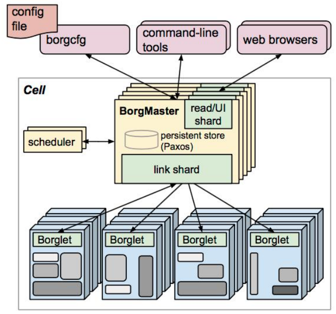
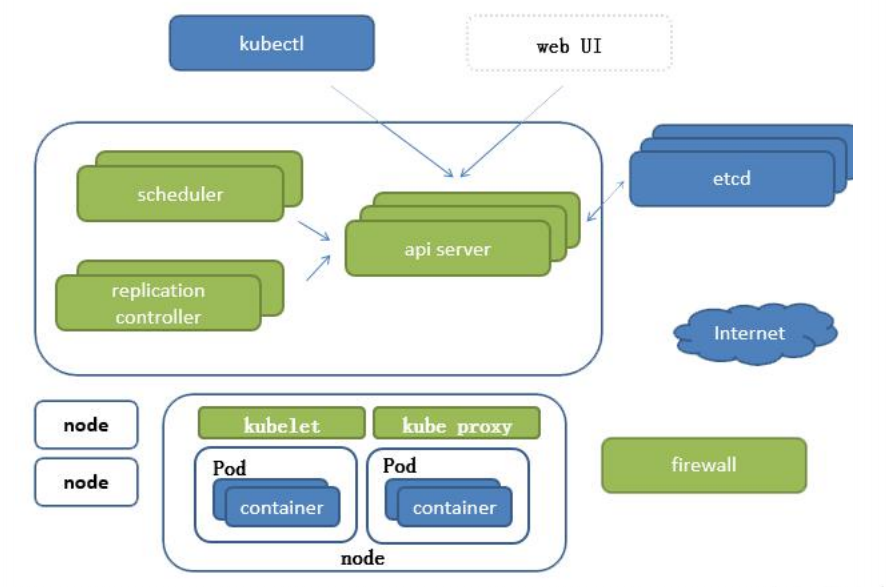

# k8s

视频教程 https://www.bilibili.com/video/BV1w4411y7Go?spm_id_from=333.337.search-card.all.click

下载地址：https://pan.baidu.com/s/18M4WCXsfD0jDeM6Jq1lMDw ，提取码：x1sg


## 学习目标

基础概念： 什么是pod, 有哪些控制器类型， k8s的网络通讯模式，怎么构建k8s集群

资源清单： 掌握资源清单的语法， 编写pod ， 掌握pod的生命周期

pod控制器： 掌握各种控制器的特点以及使用，定义方式

服务发现：掌握SVC原理以及构建方式

存储：configMap, volume, secret, pv, 掌握多种存储类型的特点，并且能够在不同环境中选择合适的存储方案

调度器： 掌握调度器原理，能够根据要求把pod定义到想要的节点上运行

集群安全机制：认证，鉴权，访问控制原理及其流程  这个很难也很重要

HELM: 类似yum管理器

运维: 源码修改， cicd构建， 修改kubeadm 达到证书可用期限为10年， 构建高可用k8s


比较好的博客

http://victorfengming.gitee.io/kubernetes/1_Kubernetes%E7%AE%80%E4%BB%8B/#kubernetes%E7%AE%80%E4%BB%8B

http://bbigsun.gitee.io/kubernetes-study/#/README

https://gitee.com/moxi159753/LearningNotes/tree/master/K8S


## k8s 组件

Borg系统是k8s的前生， k8s用go语言编写

Borg架构



k8s架构



高可用集群副本数据最好是 >= 3 奇数个
	
api server：所有服务访问统一入口
srontrollerManager：维持副本期望数目
scheduler：：负责介绍任务，选择合适的节点进行分配任务
ctcd：键值对数据库  储存K8S集群所有重要信息（持久化）
kubelet：直接跟容器引擎交互实现容器的生命周期管理
kube-proxy：负责写入规则至 IPTABLES、IPVS 实现服务映射访问的
CoreDNS：可以为集群中的SVC创建一个域名IP的对应关系解析
Dashboard：给 K8S 集群提供一个 B/S 结构访问体系
Ingress Controller：官方只能实现四层代理，INGRESS 可以实现七层代理
Federation：提供一个可以跨集群中心多K8S统一管理功能
Prometheus：提供K8S集群的监控能力
ELK：提供 K8S 集群日志统一分析介入平台


# 1. Pod


# 单机部署

参考文章

https://blog.51cto.com/u_15077545/4364254

https://zhuanlan.zhihu.com/p/390166594

## 准备

1.关闭防火墙和selinux
systemctl stop firewalld
systemctl disable firewalld
setenforce 0

2.修改文件/etc/selinux/config
#：cat /etc/selinux/config
SELINUX=disabled
SELINUXTYPE=targeted

3.禁用swap
swapoff -a

4.修改内核参数和模块（没搞懂这一步，搞得时候报错，然后没管，继续往下走）
修改文件/etc/sysctl.d/k8s.conf
net.bridge.bridge-nf-call-ip6tables = 1
net.bridge.bridge-nf-call-iptables = 1
执行命令
sysctl --system
modprobe br_netfilter

## 安装docker

这个参考其他文章，这里不赘述


## 安装kubernates组件

修改文件/etc/yum.repos.d/kubernetes.repo（这个和docker很像）

```shell
[kubernetes]
name=Kubernetes
baseurl=https://mirrors.aliyun.com/kubernetes/yum/repos/kubernetes-el7-x86_64/
enabled=1
gpgcheck=1
repo_gpgcheck=1
gpgkey=https://mirrors.aliyun.com/kubernetes/yum/doc/yum-key.gpg https://mirrors.aliyun.com/kubernetes/yum/doc/rpm-package

```

然后执行

```shell
yum -y install kubelet kubeadm kubectl
systemctl start kubelet
systemctl enable kubelet
# 运行上面的命令后： Created symlink from /etc/systemd/system/multi-user.target.wants/kubelet.service to /usr/lib/systemd/system/kubelet.service.
```


下载kubernetes镜像，并且打标签

```shell
docker pull mirrorgooglecontainers/kube-apiserver:v1.24.2
docker pull mirrorgooglecontainers/kube-controller-manager:v1.24.2
docker pull mirrorgooglecontainers/kube-scheduler:v1.24.2
docker pull mirrorgooglecontainers/kube-proxy:v1.24.2
docker pull mirrorgooglecontainers/pause:3.1
docker pull mirrorgooglecontainers/etcd:3.2.24
docker pull coredns/coredns:1.8.0
 
# 打标签
docker tag mirrorgooglecontainers/kube-apiserver:v1.24.2 k8s.gcr.io/kube-apiserver:v1.24.2
docker tag mirrorgooglecontainers/kube-controller-manager:v1.24.2 k8s.gcr.io/kube-controller-manager:v1.24.2
docker tag mirrorgooglecontainers/kube-scheduler:v1.24.2 k8s.gcr.io/kube-scheduler:v1.24.2
docker tag mirrorgooglecontainers/kube-proxy:v1.24.2 k8s.gcr.io/kube-proxy:v1.24.2
docker tag mirrorgooglecontainers/pause:3.1 k8s.gcr.io/pause:3.1
docker tag mirrorgooglecontainers/etcd:3.2.24 k8s.gcr.io/etcd:3.2.24
docker tag coredns/coredns:1.2.6 k8s.gcr.io/coredns:1.8.0
```


初始化

```shell
kubeadm init --kubernetes-version=v1.24.2

 ~ # kubeadm init --kubernetes-version=v1.24.2
[init] Using Kubernetes version: v1.24.2
[preflight] Running pre-flight checks
[preflight] The system verification failed. Printing the output from the verification:
KERNEL_VERSION: 3.10.0-229.el7.x86_64
CONFIG_NAMESPACES: enabled
CONFIG_NET_NS: enabled
CONFIG_PID_NS: enabled
CONFIG_IPC_NS: enabled
CONFIG_UTS_NS: enabled
CONFIG_CGROUPS: enabled
CONFIG_CGROUP_CPUACCT: enabled
CONFIG_CGROUP_DEVICE: enabled
CONFIG_CGROUP_FREEZER: enabled
CONFIG_CGROUP_PIDS: not set
CONFIG_CGROUP_SCHED: enabled
CONFIG_CPUSETS: enabled
CONFIG_MEMCG: enabled
CONFIG_INET: enabled
CONFIG_EXT4_FS: enabled (as module)
CONFIG_PROC_FS: enabled
CONFIG_NETFILTER_XT_TARGET_REDIRECT: enabled (as module)
CONFIG_NETFILTER_XT_MATCH_COMMENT: enabled (as module)
CONFIG_FAIR_GROUP_SCHED: enabled
CONFIG_OVERLAY_FS: enabled (as module)
CONFIG_AUFS_FS: not set - Required for aufs.
CONFIG_BLK_DEV_DM: enabled (as module)
CONFIG_CFS_BANDWIDTH: enabled
CONFIG_CGROUP_HUGETLB: enabled
CONFIG_SECCOMP: enabled
CONFIG_SECCOMP_FILTER: enabled
OS: Linux
CGROUPS_CPU: enabled
CGROUPS_CPUACCT: enabled
CGROUPS_CPUSET: enabled
CGROUPS_DEVICES: enabled
CGROUPS_FREEZER: enabled
CGROUPS_MEMORY: enabled
CGROUPS_PIDS: missing
CGROUPS_HUGETLB: enabled
CGROUPS_BLKIO: enabled
error execution phase preflight: [preflight] Some fatal errors occurred:
        [ERROR CRI]: container runtime is not running: output: E0628 15:58:01.288966   27701 remote_runtime.go:925] "Status from runtime service failed" err="rpc error: code = Unimplemented desc = unknown service runtime.v1alpha2.RuntimeService"
time="2022-06-28T15:58:01+08:00" level=fatal msg="getting status of runtime: rpc error: code = Unimplemented desc = unknown service runtime.v1alpha2.RuntimeService"
, error: exit status 1
        [ERROR SystemVerification]: unexpected kernel config: CONFIG_CGROUP_PIDS
        [ERROR SystemVerification]: missing required cgroups: pids
[preflight] If you know what you are doing, you can make a check non-fatal with `--ignore-preflight-errors=...`
To see the stack trace of this error execute with --v=5 or higher

```

内核太低需要升级内核？？？

参考

https://blog.csdn.net/weixin_38146924/article/details/117519139

https://blog.csdn.net/wulinpingailxr/article/details/96480526

rpm 下载： https://www.elrepo.org/elrepo-release-7.el7.elrepo.noarch.rpm


然后有报错

```shell
$ # kubeadm init --kubernetes-version=v1.24.2
[init] Using Kubernetes version: v1.24.2
[preflight] Running pre-flight checks
error execution phase preflight: [preflight] Some fatal errors occurred:
        [ERROR CRI]: container runtime is not running: output: E0629 14:41:27.578180   46995 remote_runtime.go:925] "Status from runtime service failed" err="rpc error: code = Unimplemented desc = unknown service runtime.v1alpha2.RuntimeService"
time="2022-06-29T14:41:27+08:00" level=fatal msg="getting status of runtime: rpc error: code = Unimplemented desc = unknown service runtime.v1alpha2.RuntimeService"
, error: exit status 1
[preflight] If you know what you are doing, you can make a check non-fatal with `--ignore-preflight-errors=...`
To see the stack trace of this error execute with --v=5 or higher

```

参考 https://blog.csdn.net/qq_43580215/article/details/125153959

```shell
# 解决方案
[root@master:~] rm -rf /etc/containerd/config.toml
[root@master:~] systemctl restart containerd
```


```shell
/home/hwj/bin # kubeadm init --kubernetes-version=v1.24.2
[init] Using Kubernetes version: v1.24.2
[preflight] Running pre-flight checks
[preflight] Pulling images required for setting up a Kubernetes cluster
[preflight] This might take a minute or two, depending on the speed of your internet connection
[preflight] You can also perform this action in beforehand using 'kubeadm config images pull'
^C
/home/hwj/bin # kubeadm config images pull
W0629 14:47:39.212350  115587 version.go:103] could not fetch a Kubernetes version from the internet: unable to get URL "https://dl.k8s.io/release/stable-1.txt": Get "https://dl.k8s.io/release/stable-1.txt": context deadline exceeded (Client.Timeout exceeded while awaiting headers)
W0629 14:47:39.212492  115587 version.go:104] falling back to the local client version: v1.24.2
^C

```

https://blog.csdn.net/kozazyh/article/details/109168078


https://www.cnblogs.com/kevin-ying/p/13299977.html


