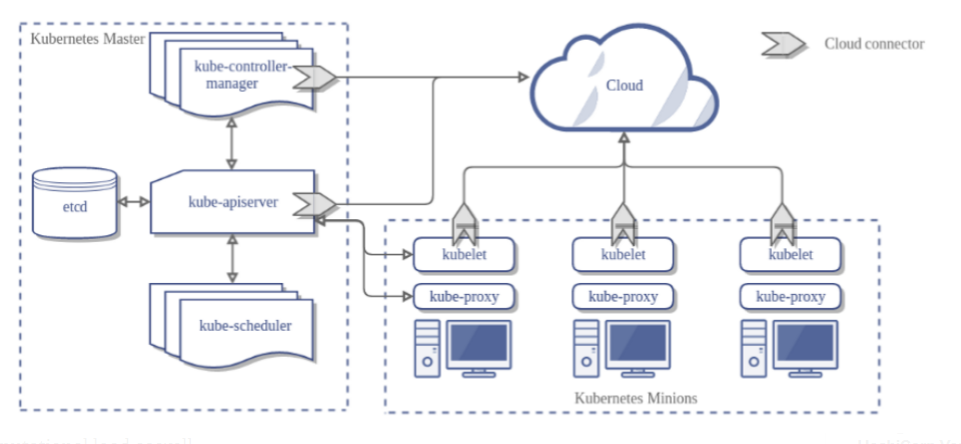

参考：

https://zhuanlan.zhihu.com/p/292081941

Master Node和Worker Node是分别安装了K8S的Master和Woker组件的实体服务器，每个Node都对应了一台实体服务器（虽然Master Node可以和其中一个Worker Node安装在同一台服务器，但是建议Master Node单独部署），**所有Master Node和Worker Node组成了K8S集群**，同一个集群可能存在多个Master Node和Worker Node。

首先来看**Master Node**都有哪些组件：

- **API Server**。**K8S的请求入口服务**。API Server负责接收K8S所有请求（来自UI界面或者CLI命令行工具），然后，API Server根据用户的具体请求，去通知其他组件干活。
- **Scheduler**。**K8S所有Worker Node的调度器**。当用户要部署服务时，Scheduler会选择最合适的Worker Node（服务器）来部署。
- **Controller Manager**。**K8S所有Worker Node的监控器**。Controller Manager有很多具体的Controller，在文章[Components of Kubernetes Architecture](https://link.zhihu.com/?target=https%3A//medium.com/%40kumargaurav1247/components-of-kubernetes-architecture-6feea4d5c712)中提到的有Node Controller、Service Controller、Volume Controller等。Controller负责监控和调整在Worker Node上部署的服务的状态，比如用户要求A服务部署2个副本，那么当其中一个服务挂了的时候，Controller会马上调整，让Scheduler再选择一个Worker Node重新部署服务。
- **etcd**。**K8S的存储服务**。etcd存储了K8S的关键配置和用户配置，K8S中仅API Server才具备读写权限，其他组件必须通过API Server的接口才能读写数据（见[Kubernetes Works Like an Operating System](https://link.zhihu.com/?target=https%3A//thenewstack.io/how-does-kubernetes-work/)）。

接着来看**Worker Node**的组件：

- **Kubelet**。**Worker Node的监视器，以及与Master Node的通讯器**。Kubelet是Master Node安插在Worker Node上的“眼线”，它会定期向Master Node汇报自己Node上运行的服务的状态，并接受来自Master Node的指示采取调整措施。
- **Kube-Proxy**。**K8S的网络代理**。私以为称呼为Network-Proxy可能更适合？Kube-Proxy负责Node在K8S的网络通讯、以及对外部网络流量的负载均衡。
- **Container Runtime**。**Worker Node的运行环境**。即安装了容器化所需的软件环境确保容器化程序能够跑起来，比如Docker Engine。大白话就是帮忙装好了Docker运行环境。
- **Logging Layer**。**K8S的监控状态收集器**。私以为称呼为Monitor可能更合适？Logging Layer负责采集Node上所有服务的CPU、内存、磁盘、网络等监控项信息。
- **Add-Ons**。**K8S管理运维Worker Node的插件组件**。有些文章认为Worker Node只有三大组件，不包含Add-On，但笔者认为K8S系统提供了Add-On机制，让用户可以扩展更多定制化功能，是很不错的亮点。

总结来看，**K8S的Master Node具备：请求入口管理（API Server），Worker Node调度（Scheduler），监控和自动调节（Controller Manager），以及存储功能（etcd）；而K8S的Worker Node具备：状态和监控收集（Kubelet），网络和负载均衡（Kube-Proxy）、保障容器化运行环境（Container Runtime）、以及定制化功能（Add-Ons）。**

官方对于**Pod**的解释是：

> **Pod**是可以在 Kubernetes 中创建和管理的、最小的可部署的计算单元。