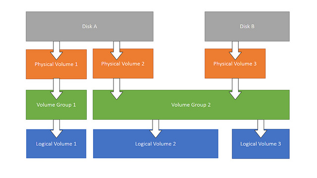
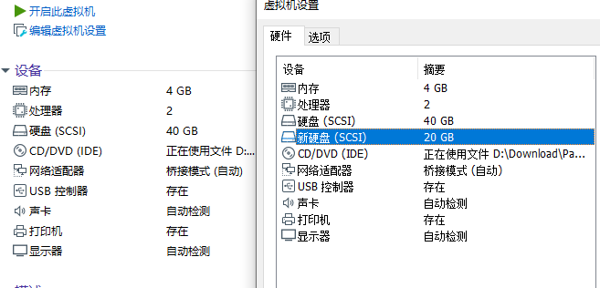
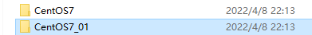
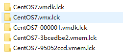
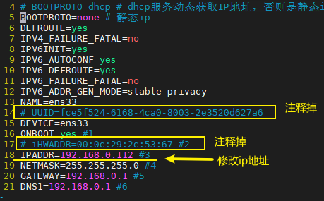

# 

基于Centos7系统

# rpm

```shell
# 查看已经安装的包
rpm -qa
```


# yum

> yum源查看

```shell
yum repolist

[root@localhost ~]# yum repolist
已加载插件：fastestmirror, langpacks
Determining fastest mirrors
 * base: mirrors.ustc.edu.cn
 * epel: hk.mirrors.thegigabit.com
 * extras: mirrors.163.com
 * updates: mirrors.ustc.edu.cn
源标识                                                 源名称                                                                      状态
!base/7/x86_64                                         CentOS-7 - Base                                                           
!docker-ce-stable/7/x86_64                             Docker CE Stable - x86_64                                                 
!epel/x86_64                                           Extra Packages for Enterprise Linux 7 - x86_64                           
!extras/7/x86_64                                       CentOS-7 - Extras                                                         
!updates/7/x86_64                                      CentOS-7 - Updates                                                       
repolist: 28,204
```

```shell
ls /etc/yum.repos.d/  # 这个是yum源目录， 里面的*.repo文件都是源配置文件，存放各种源
vim /etc/yum.repos.d/CentOS-Base.repo  # 基本的源
cat /etc/yum.repos.d/docker-ce.repo  # docker的源
```


> 反查命令安装包

```shell
# yum whatprovides 反查命令在哪个安装包中, 例如查看automake是哪个安装包的。
yum whatprovides automake  # 然后得到automake-1.13.4-3.el7.noarch 
```


# 常见的包

epel-release 

```shell
# 参考 https://blog.csdn.net/weixin_41831919/article/details/109035936
# 运行
yum -y install epel-release 
# 因为红帽系rpm repository仓库的软件包不丰富，所以需要增加epel源来提供额外的软件包。 装上了 EPEL之后，就相当于添加了一个第三方源
# 运行
yum repolist 
# 认真查看就会发现多了epel/x86_64源， 还会多出/etc/yum.repos.d/epel.repo文件
```

net-tools

```shell
yum -y install net-tools  # ifconfig工具
```


# Shell

> centos命令行提示符显示所在路径pwd

参考: https://blog.csdn.net/u010039418/article/details/80521877

其实这个命令提示符格式是由PS1这个环境变量控制的

```shell
[root@localhost sh]# echo $PS1
[root@localhost sh]# export PS1='[\u@\h \w]\$'  # 临时生效
```

在**/etc/bashrc**里设置该变量。找到如下代码，将大写的**W**改为小写即可。(重新打开一个shell可以看到)

```shell
 #[ "$PS1" = "\\s-\\v\\\$ " ] && PS1="[\u@\h \W]\\$ "
  [ "$PS1" = "\\s-\\v\\\$ " ] && PS1="[\u@\h \w]\\$ "
```


> 将/home/hwj/bin加入path

在profile或者bashrc中加入

```shell
export PATH=$PATH:/home/hwj/bin
```

注意： export PATH必须加上之前的PATH（即$PATH:）


> Linux 之 /etc/profile、~/.bash_profile 等几个文件的执行过程

https://blog.csdn.net/ithomer/article/details/6322892

执行顺序为：

```shell
/etc/profile -> (~/.bash_profile | ~/.bash_login | ~/.profile) -> ~/.bashrc -> /etc/bashrc -> ~/.bash_logout
```


### shell常用命令

```bash
source FileName # 当前bash 可以无”执行权限” 该命令通常用命令“.”来替代。

sh/bash FileName # 子shell 可以无”执行权限”

./FileName # 子shell 需要”执行权限”  #直接鍵入脚本的名字 子shell 需要”执行权限”
```


# C/C++编译环境安装

在Linux下通过源码安装一个应用程序时，
一般先运行脚本configure，
然后用make来编译源程序，
再运行make install，
最后运行make clean删除一些临时文件。


> 说实话，这有点乱。。。不如直接网上搜一个教程

安装automake, libtool, make, gcc, pkg-config （源码安装应用程序时依赖的环境）

```shell
yum install automake-1.13.4-3.el7.noarch 
yum install libtool-2.4.2-22.el7_3.x86_64
yum install make-3.82-24.el7.x86_64
yum install gcc-4.8.5-44.el7.x86_64
yum install pkgconfig-0.27.1-4.el7.x86_64
```

安装后尝试运行检查是否安装成功

```shell
automake --verison
libtool  --verison
make  --verison
gcc --verison
pkg-config  --verison
```

发现automake命令报错，其他命令没报错
automake 报错： Can't locate Carp.pm in @INC (@INC contains: /usr/share/automake-1.13

```java
1.输入命令：wget http://ftp.gnu.org/gnu/automake/automake-1.14.1.tar.gz下载autoconf安装包
2.解压缩automake-1.14.1.tar.gz ，输入命令：tar -zxvf automake-1.14.1.tar.gz -C /opt/
3.进入解压缩后的目录automake-1.14.1，输入命令：cd /opt/automake-1.14.1
4.输入命令：./bootstrap.sh
5.配置编译环境，输入命令：./configure
6.编译并安装automake，输入俩命令：make ;  make install
```

参考： https://blog.51cto.com/u_12877374/2866838

重新安装automake又报错：Can't locate Exporter.pm in @INC (@INC contains: /usr/local/lib64/perl5 

 https://stackoverflow.com/questions/21784492/cant-locate-module-build-pm-in-inc-inc-contains-usr-local-lib64-perl5

看样子是perl语言的依赖问题？

然后yum install cpan 发现cpan也报类似的错。 然后觉得perl有问题

发现perl的版本太老古董了，导致很多perl的包都没有.

```
wget https://www.cpan.org/src/5.0/perl-5.30.0.tar.gz
tar -xzf perl-5.30.0.tar.gz
cd perl-5.30.0
./Configure -des -Dprefix=/opt/perl -Dusethreads -Uinstalluserbinperl -Dcc=gcc
make # 很长时间。。。
make test # 时间更长。。。	有两个测试没通过，但是算了。。。
make install 
```

旧的perl修改链接 不建议删除，还是备份比较好 。

```shell
mv /usr/bin/perl /usr/bin/perl.bak
```

建立新的软连接

```shell
ln -s /opt/perl/bin/perl /usr/bin/perl 
```

CENTOS7安装最新Perl环境 : 参考文档https://cloud.tencent.com/developer/article/1561814

然后又发现automake又报错： This Perl not built to support threads。 汗。。。-_-||

原因是之前执行的是./Configure -des -Dprefix=/opt/perl命令，这个是不对的！参考文档如下

https://blog.csdn.net/zzq900503/article/details/16948349

最后一个报错。。。。Unescaped left brace in regex is passed through in regex; marked by <-- HERE in m/\${ <-- HERE ([^ \t=:+{}]+)}/ at /usr/bin/automake line 3935.

https://www.cnblogs.com/zengjfgit/p/9178523.html

```perl
# 注释的为原代码，下面的为修改后的代码
# $text =~ s/\${([^ \t=:+{}]+)}/substitute_ac_subst_variables_worker ($1)/ge;
$text =~ s/\$[{]([^ \t=:+{}]+)}/substitute_ac_subst_variables_worker ($1)/ge;
```

终于正常了！ ( 最新Perl + 报错修改 )


# 硬件信息查看

CPU

```shell
# 查看CPU逻辑数
cat /proc/cpuinfo| grep "processor"| wc -l

# 查看CPU物理个数
cat /proc/cpuinfo| grep "physical id"| sort| uniq| wc -l

# 查看每个物理CPU逻辑核数
cat /proc/cpuinfo| grep "cpu cores"| uniq
```


# 硬盘配置

## LVM

参考

https://linux.cn/article-3218-1.html

https://www.cnblogs.com/lijiaman/p/12885649.html

https://stackoverflow.com/questions/26305376/resize2fs-bad-magic-number-in-super-block-while-trying-to-open


LVM全程是逻辑卷管理， 无论在Linux或者其他类似的系统，都是非常的好用。传统分区使用固定大小分区，重新调整大小十分麻烦。但是，LVM可以创建和管理“逻辑”卷，而不是直接使用物理硬盘。可以让管理员弹性的管理逻辑卷的扩大缩小，操作简单，而不损坏已存储的数据。可以随意将新的硬盘添加到LVM，以直接扩展已经存在的逻辑卷。

LVM使用分层结构，如下图所示。



图中顶部，首先是实际的物理磁盘及其划分的分区和其上的物理卷（PV）。一个或多个物理卷可以用来创建卷组（VG）。然后基于卷组可以创建逻辑卷（LV）。只要在卷组中有可用空间，就可以随心所欲的创建逻辑卷。文件系统就是在逻辑卷上创建的，然后可以在操作系统挂载和访问。

```shell
# 这个是我硬盘最初的样子， 我们的根目录是类型是lvm, 大小是37G
[root@localhost114 ~]# lsblk
NAME            MAJ:MIN RM  SIZE RO TYPE MOUNTPOINT
sda               8:0    0   40G  0 disk
├─sda1            8:1    0    1G  0 part /boot
└─sda2            8:2    0   39G  0 part
  ├─centos-root 253:0    0   37G  0 lvm  /
  └─centos-swap 253:1    0    2G  0 lvm  [SWAP]
sr0              11:0    1  1.6G  0 rom
```

下面开始给根目录扩容，计划扩容20G。

VMware添加硬件，选择硬件类型->硬盘， 然后不断地下一步完成创建（注意这个硬盘的存储目录），创建好后如下图多出了一个“新硬盘”



```shell
# 此时多了一块硬盘sdb
[root@localhost114 ~]# lsblk
NAME            MAJ:MIN RM  SIZE RO TYPE MOUNTPOINT
sda               8:0    0   40G  0 disk
├─sda1            8:1    0    1G  0 part /boot
└─sda2            8:2    0   39G  0 part
  ├─centos-root 253:0    0   37G  0 lvm  /
  └─centos-swap 253:1    0    2G  0 lvm  [SWAP]
sdb               8:16   0   20G  0 disk
sr0              11:0    1  1.6G  0 rom
```

然后，我这里就不进行分区了。。。 分区相关命令: `fdisk /dev/sdb`,

如果进行分区，磁盘分区之后，磁盘id为83，如果要使用逻辑卷管理，需要将id改为8e，才能创建物理卷。这里就不进行演示

```shell
# 直接创建数据卷
[root@localhost114 ~]# pvcreate /dev/sdb
  Physical volume "/dev/sdb" successfully created.
  
# 查看到/dev/sdb已经变成了物理卷
[root@localhost114 ~]# pvs
  PV         VG     Fmt  Attr PSize   PFree
  /dev/sda2  centos lvm2 a--  <39.00g  4.00m
  /dev/sdb          lvm2 ---   20.00g 20.00g
```

```shell
# 使用vgs, vgdisplay查看卷组， 
[root@localhost114 ~]# vgs
  VG     #PV #LV #SN Attr   VSize   VFree
  centos   1   2   0 wz--n- <39.00g 4.00m

# 将物理卷/dev/sdb加入和根目录相同的卷组
[root@localhost114 ~]# vgextend centos /dev/sdb
  Volume group "centos" successfully extended

# pvs查看物理卷已经成为了centos卷组的一员了
[root@localhost114 ~]# pvs
  PV         VG     Fmt  Attr PSize   PFree
  /dev/sda2  centos lvm2 a--  <39.00g      0
  /dev/sdb   centos lvm2 a--  <20.00g 100.00m

# 此时root逻辑卷还是36.99G， 而卷组从39G，变成了58.99G， 加了20G，这20G就可以给root逻辑卷扩充了
[root@localhost114 ~]# lvs
  LV   VG     Attr       LSize  Pool Origin Data%  Meta%  Move Log Cpy%Sync Convert
  root centos -wi-ao---- 36.99g
  swap centos -wi-ao----  2.00g
[root@localhost114 ~]# vgs
  VG     #PV #LV #SN Attr   VSize  VFree
  centos   2   2   0 wz--n- 58.99g 100.00m

# 给root逻辑卷扩充了20G内存
[root@localhost114 ~]# lvextend -L +19.9G /dev/centos/root
  Rounding size to boundary between physical extents: 19.90 GiB.
  Size of logical volume centos/root changed from 36.99 GiB (9470 extents) to 56.89 GiB (14565 extents).
  Logical volume centos/root successfully resized.

# lvs再次查看， 发现root逻辑卷从36.99G变成了56.89G, 多了19.9G！
[root@localhost114 ~]# lvs
  LV   VG     Attr       LSize  Pool Origin Data%  Meta%  Move Log Cpy%Sync Convert
  root centos -wi-ao---- 56.89g
  swap centos -wi-ao----  2.00g

# lsblk再次查看, 发现根目录由原来的37G变成了56.9G， 多了19.9G！
[root@localhost114 ~]# lsblk
NAME            MAJ:MIN RM  SIZE RO TYPE MOUNTPOINT
sda               8:0    0   40G  0 disk
├─sda1            8:1    0    1G  0 part /boot
└─sda2            8:2    0   39G  0 part
  ├─centos-root 253:0    0 56.9G  0 lvm  /
  └─centos-swap 253:1    0    2G  0 lvm  [SWAP]
sdb               8:16   0   20G  0 disk
└─centos-root   253:0    0 56.9G  0 lvm  /
sr0              11:0    1  1.6G  0 rom

# 然后还有个问题， 此时df命令发现根目录还是37G
[root@localhost114 ~]# df -h
文件系统                 容量  已用  可用 已用% 挂载点
devtmpfs                 1.9G     0  1.9G    0% /dev
tmpfs                    1.9G     0  1.9G    0% /dev/shm
tmpfs                    1.9G   13M  1.9G    1% /run
tmpfs                    1.9G     0  1.9G    0% /sys/fs/cgroup
/dev/mapper/centos-root   37G   11G   27G   29% /
/dev/sda1               1014M  185M  830M   19% /boot
tmpfs                    378M     0  378M    0% /run/user/0
tmpfs                    378M  8.0K  378M    1% /run/user/42

# 用xfs_growfs进行更新，然后再df, 发现容量由原来的37G变成了57G， 搞定！
[root@localhost114 ~]# xfs_growfs /dev/centos/root
meta-data=/dev/mapper/centos-root isize=512    agcount=4, agsize=2424320 blks
         =                       sectsz=512   attr=2, projid32bit=1
         =                       crc=1        finobt=0 spinodes=0
data     =                       bsize=4096   blocks=9697280, imaxpct=25
         =                       sunit=0      swidth=0 blks
naming   =version 2              bsize=4096   ascii-ci=0 ftype=1
log      =internal               bsize=4096   blocks=4735, version=2
         =                       sectsz=512   sunit=0 blks, lazy-count=1
realtime =none                   extsz=4096   blocks=0, rtextents=0
data blocks changed from 9697280 to 14914560
[root@localhost114 ~]#
[root@localhost114 ~]# df -h
文件系统                 容量  已用  可用 已用% 挂载点
devtmpfs                 1.9G     0  1.9G    0% /dev
tmpfs                    1.9G     0  1.9G    0% /dev/shm
tmpfs                    1.9G   13M  1.9G    1% /run
tmpfs                    1.9G     0  1.9G    0% /sys/fs/cgroup
/dev/mapper/centos-root   57G   11G   47G   19% /
/dev/sda1               1014M  185M  830M   19% /boot
tmpfs                    378M     0  378M    0% /run/user/0
tmpfs                    378M   12K  378M    1% /run/user/42

```


##  Mount 挂载

解决linux重启后磁盘挂载失效的问题

https://blog.csdn.net/sugarbliss/article/details/107033034

问题：resize2fs命令问题： resize2fs: Permission denied to resize filesystem

https://arkit.co.in/resize2fs-permission-denied-to-resize-filesystem/

问题： umount命令问题， Umount target is busy

https://www.cnblogs.com/ding2016/p/9605526.html

Umount target is busy的情况是因为有进程在使用硬盘，所以不能取消挂载。需要kill掉进程才能umount， 如果进程太多了， reboot重启可能更快！

# 其他


##  给普通用户配置root权限

```shell
# 1.vim /etc/sudoers
# 2. 在 %wheel  ALL=(ALL)       ALL 下面加一行代码, # 比如给hwj用户加root权限
hwj   ALL=(ALL)     NOPASSWD:ALL
```


## VMware复制虚拟机



CentOS7是主虚拟机，复制一份为CentOS7_01。然后进行四步走即可

- 1. 复制后需要删除虚拟机目录里面的.lck目录



- 2. 删掉网卡配置文件的UUID, HWADDR，并修改ip地址

    

- 3. 删除Linux物理地址绑定的文件

    

- 4. 重启机器shutdown -r now

- 5. 为了区别主机, 需要给机器重新设置主机名

        ```shell
         # hostnamectl set-hostname name
         # hostnamectl set-hostname localhost114 # 设置名为localhost114
        ```

        


## 系统时间

> Linux设置和修改时间与时区

https://blog.csdn.net/m0_37886429/article/details/78477638

```shell
timedatectl set-timezone Asia/Shanghai
```


## github加速

修改hosts文件（修改不了，就复制hosts文件出来，修改后再覆盖回去）

https://gitee.com/doshengl/GitHub520#github520

github的代理地址在上面的gitee中

```powershell
# 刷新DNS解析缓存
ipconfig /flushdns 
```


## Node js 安装

~~~shell
# 安装包安装： https://nodejs.org/en/
# yum安装
yum install nodejs 
yum whatprovides npm  # 安装nodejs后发现没有安装, 于是利用whatprovides，得知npm的安装包是： npm-8.5.0-1.16.14.1.1.el7.x86_64
yum install npm-8.5.0-1.16.14.1.1.el7.x86_64
# 检查安装： 
node -v
npm -v

# 安装淘宝镜像cnpm ,可以让资源包下载得更快。
npm install -g cnpm --registry=HTTPS://registry.npm.taobao.org  # -g表示全局global
# 因为cnpm和npm是存在差异的， 如果出现安装包资源出错， 尝试用npm重新下载一次资源包。
~~~

npm的下载的包路径（全局安装）

```shell
# /usr/local/lib/node_modules
```


##  docsify 安装

```
npm i docsify-cli -g  # 安装包在/usr/local/lib/node_modules
docsify init ./docs
docsify serve docs
```


## Java安装


> Linux系统

Centos自带java不太好用，比如 jps终端命令不能用

所以卸载重装

参考连接： https://blog.csdn.net/libaineu2004/article/details/80060812

```shell
# 1. 先看看有没有安装java -version
java -version
# 2、查找他们的安装位置（注意不同系统的java版本号会有差异）
[root@java-test-01 ~]# rpm -qa | grep java
java-1.8.0-openjdk-1.8.0.141-1.b16.el7_3.x86_64
java-1.7.0-openjdk-1.7.0.141-2.6.10.1.el7_3.x86_64
java-1.8.0-openjdk-headless-1.8.0.141-1.b16.el7_3.x86_64
java-1.7.0-openjdk-headless-1.7.0.141-2.6.10.1.el7_3.x86_64
python-javapackages-3.4.1-11.el7.noarch
javapackages-tools-3.4.1-11.el7.noarch
tzdata-java-2017b-1.el7.noarch
# 3、删除全部，noarch文件可以不用删除
[root@java-test-01 ~]# rpm -e --nodeps java-1.8.0-openjdk-1.8.0.141-1.b16.el7_3.x86_64
[root@java-test-01 ~]# rpm -e --nodeps java-1.7.0-openjdk-1.7.0.141-2.6.10.1.el7_3.x86_64
[root@java-test-01 ~]# rpm -e --nodeps java-1.8.0-openjdk-headless-1.8.0.141-1.b16.el7_3.x86_64
[root@java-test-01 ~]# rpm -e --nodeps java-1.7.0-openjdk-headless-1.7.0.141-2.6.10.1.el7_3.x86_64
# 4、检查有没有删除
[root@java-test-01 ~]# java -version
# 5、下载安装完整版的JDK。 下载地址： http://www.oracle.com/technetwork/java/javase/downloads/jdk8-downloads-2133151.html
tar -xzvf jdk-8u321-linux-x64.tar.gz -C /usr/lib/
# 6、修改环境变量/etc/profile，在末尾添加这四行命令。保存
export JAVA_HOME=/usr/lib/jdk1.8.0_321
export JRE_HOME=$JAVA_HOME/jre
export CLASSPATH=.:$JAVA_HOME/lib:$JRE_HOME/lib:$CLASSPATH
export PATH=.:$JAVA_HOME/bin:$JRE_HOME/bin:$PATH
# 7、重新开启新的shell窗口，然后测试是否成功
java -version
javac -version 
```


