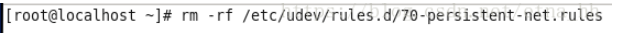

# 基于Centos7系统

基于Centos7系统


# rpm

```shell
# 查看已经安装的包
rpm -qa
```


# yum

> yum源查看

```shell
yum repolist
```

```shell
ls /etc/yum.repos.d/  # 这个是yum源目录， 里面的*.repo文件都是源配置文件，存放各种源
vim /etc/yum.repos.d/CentOS-Base.repo  # 基本的源
cat /etc/yum.repos.d/docker-ce.repo  # docker的源
```


> 反查命令安装包

```shell
# yum whatprovides 反查命令在哪个安装包中, 例如查看automake是哪个安装包的。
yum whatprovides automake  # 然后得到automake-1.13.4-3.el7.noarch 
```


# Shell

> centos命令行提示符显示所在路径pwd

参考: https://blog.csdn.net/u010039418/article/details/80521877

其实这个命令提示符格式是由PS1这个环境变量控制的

```shell
[root@localhost sh]# echo $PS1
[root@localhost sh]# export PS1='[\u@\h \w]\$'  # 临时生效
```

在**/etc/bashrc**里设置该变量。找到如下代码，将大写的**W**改为小写即可。(重新打开一个shell可以看到)

```shell
 #[ "$PS1" = "\\s-\\v\\\$ " ] && PS1="[\u@\h \W]\\$ "
  [ "$PS1" = "\\s-\\v\\\$ " ] && PS1="[\u@\h \w]\\$ "
```


> 将/home/hwj/bin加入path

在profile或者bashrc中加入

```shell
export PATH=$PATH:/home/hwj/bin
```

注意： export PATH必须加上之前的PATH（即$PATH:）


> Linux 之 /etc/profile、~/.bash_profile 等几个文件的执行过程

https://blog.csdn.net/ithomer/article/details/6322892

执行顺序为：

```shell
/etc/profile -> (~/.bash_profile | ~/.bash_login | ~/.profile) -> ~/.bashrc -> /etc/bashrc -> ~/.bash_logout
```


### shell常用命令

```bash
source FileName # 当前bash 可以无”执行权限” 该命令通常用命令“.”来替代。

sh/bash FileName # 子shell 可以无”执行权限”

./FileName # 子shell 需要”执行权限”  #直接鍵入脚本的名字 子shell 需要”执行权限”
```


# C/C++编译环境安装

在Linux下通过源码安装一个应用程序时，
一般先运行脚本configure，
然后用make来编译源程序，
再运行make install，
最后运行make clean删除一些临时文件。


> 说实话，这有点乱。。。不如直接网上搜一个教程

安装automake, libtool, make, gcc, pkg-config （源码安装应用程序时依赖的环境）

```shell
yum install automake-1.13.4-3.el7.noarch 
yum install libtool-2.4.2-22.el7_3.x86_64
yum install make-3.82-24.el7.x86_64
yum install gcc-4.8.5-44.el7.x86_64
yum install pkgconfig-0.27.1-4.el7.x86_64
```

安装后尝试运行检查是否安装成功

```shell
automake --verison
libtool  --verison
make  --verison
gcc --verison
pkg-config  --verison
```

发现automake命令报错，其他命令没报错
automake 报错： Can't locate Carp.pm in @INC (@INC contains: /usr/share/automake-1.13

```java
1.输入命令：wget http://ftp.gnu.org/gnu/automake/automake-1.14.1.tar.gz下载autoconf安装包
2.解压缩automake-1.14.1.tar.gz ，输入命令：tar -zxvf automake-1.14.1.tar.gz -C /opt/
3.进入解压缩后的目录automake-1.14.1，输入命令：cd /opt/automake-1.14.1
4.输入命令：./bootstrap.sh
5.配置编译环境，输入命令：./configure
6.编译并安装automake，输入俩命令：make ;  make install
```

参考： https://blog.51cto.com/u_12877374/2866838

重新安装automake又报错：Can't locate Exporter.pm in @INC (@INC contains: /usr/local/lib64/perl5 

 https://stackoverflow.com/questions/21784492/cant-locate-module-build-pm-in-inc-inc-contains-usr-local-lib64-perl5

看样子是perl语言的依赖问题？

然后yum install cpan 发现cpan也报类似的错。 然后觉得perl有问题

发现perl的版本太老古董了，导致很多perl的包都没有.

```
wget https://www.cpan.org/src/5.0/perl-5.30.0.tar.gz
tar -xzf perl-5.30.0.tar.gz
cd perl-5.30.0
./Configure -des -Dprefix=/opt/perl -Dusethreads -Uinstalluserbinperl -Dcc=gcc
make # 很长时间。。。
make test # 时间更长。。。	有两个测试没通过，但是算了。。。
make install 
```

旧的perl修改链接 不建议删除，还是备份比较好 。

```shell
mv /usr/bin/perl /usr/bin/perl.bak
```

建立新的软连接

```shell
ln -s /opt/perl/bin /usr/bin/perl 
```

CENTOS7安装最新Perl环境 : 参考文档https://cloud.tencent.com/developer/article/1561814

然后又发现automake又报错： This Perl not built to support threads。 汗。。。-_-||

原因是之前执行的是./Configure -des -Dprefix=/opt/perl命令，这个是不对的！参考文档如下

https://blog.csdn.net/zzq900503/article/details/16948349

最后一个报错。。。。Unescaped left brace in regex is passed through in regex; marked by <-- HERE in m/\${ <-- HERE ([^ \t=:+{}]+)}/ at /usr/bin/automake line 3935.

https://www.cnblogs.com/zengjfgit/p/9178523.html

```perl
# 注释的为原代码，下面的为修改后的代码
# $text =~ s/\${([^ \t=:+{}]+)}/substitute_ac_subst_variables_worker ($1)/ge;
$text =~ s/\$[{]([^ \t=:+{}]+)}/substitute_ac_subst_variables_worker ($1)/ge;
```

终于正常了！ ( 最新Perl + 报错修改 )


# 其他


## VMware复制虚拟机


CentOS7是主虚拟机，复制一份为CentOS7_01。然后进行四步走即可

- 1. 复制后需要删除虚拟机目录里面的.lck目录


- 2. 删掉网卡配置文件的UUID, HWADDR，并修改ip地址

    

- 3. 删除Linux物理地址绑定的文件

    

- 4. 重启机器shutdown -r now

- 5. 为了区别主机, 需要给机器重新设置主机名

        ```shell
         # hostnamectl set-hostname name
         # hostnamectl set-hostname localhost114 # 设置名为localhost114
        ```

        


## 系统时间

> Linux设置和修改时间与时区

https://blog.csdn.net/m0_37886429/article/details/78477638

```shell
timedatectl set-timezone Asia/Shanghai
```


## github加速

修改hosts文件（修改不了，就复制hosts文件出来，修改后再覆盖回去）

https://gitee.com/doshengl/GitHub520#github520

github的代理地址在上面的gitee中

```powershell
# 刷新DNS解析缓存
ipconfig /flushdns 
```


## Node js

~~~shell
# 安装包安装： https://nodejs.org/en/
# yum安装
yum install nodejs 
yum whatprovides npm  # 安装nodejs后发现没有安装, 于是利用whatprovides，得知npm的安装包是： npm-8.5.0-1.16.14.1.1.el7.x86_64
yum install npm-8.5.0-1.16.14.1.1.el7.x86_64
# 检查安装： 
node -v
npm -v

# 安装淘宝镜像cnpm ,可以让资源包下载得更快。
npm install -g cnpm --registry=HTTPS://registry.npm.taobao.org  # -g表示全局global
# 因为cnpm和npm是存在差异的， 如果出现安装包资源出错， 尝试用npm重新下载一次资源包。
~~~

npm的下载的包路径（全局安装）

```shell
# /usr/local/lib/node_modules
```


##  docsify 安装

```
npm i docsify-cli -g  # 安装包在/usr/local/lib/node_modules
docsify init ./docs
docsify serve docs
```

