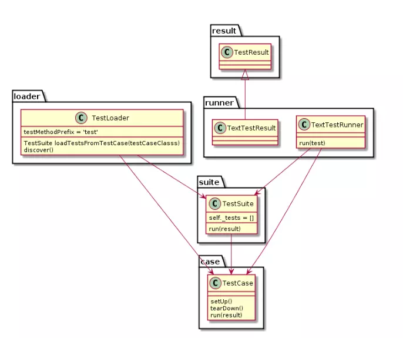

可选框架

```
pytest(兼容nose和unittest, 基本都用这个，但需要安装)
nose(需要安装)
unittest(不需要安装， 所以用的人也多)
```




unittest默认提供了 TextTestRunner（源码：unittest/runner.py），也可以自己实现TestRunner。比较好用的第三方的TestRunner为：[HTMLTestRunner](http://tungwaiyip.info/software/HTMLTestRunner.html)，可以自动生成HTML页面的测试报告。

```python
t_suite1 = unittest.TestSuite()
t_suite1.addTests([SomeoneClass('someone_method')])

t_suite2 = tunittest.defaultTestLoader.discover(testcase_path, pattern=model_pattern)
```


github比较好的项目： https://github.com/search?q=python+unittest+framework


python 测试框架 内网总结

http://tungwaiyip.info/software/HTMLTestRunner.html


