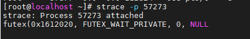
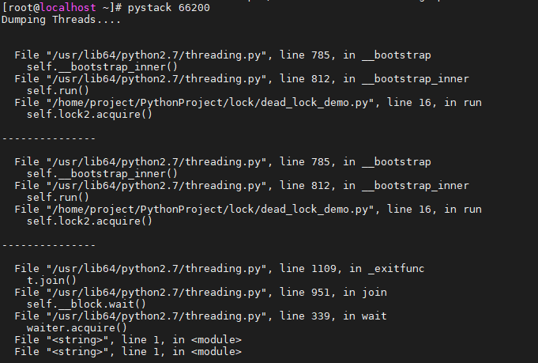

###  魔法方法总结

with 上下文管理器相关的魔法方法

```python3
class A(object):
    def __enter__(self):
        print("with 进来了")
        return "我是as关键字后面的东西"

    def __exit__(self, exc_type, exc_val, exc_tb):
        print("with 出去了")


a = A()
with a as f:
    print("with 里面")
    print(f)

```

输出结果

```shell
with 进来了
with 里面
我是as关键字后面的东西
with 出去了
```


### 常见排序算法

```python
def bubble_sort(lst):
    for i in range(len(lst) - 1, 0, -1):
        exchange = False
        for j in range(i):
            if lst[j] > lst[j + 1]:
                exchange = True
                lst[j], lst[j + 1] = lst[j + 1], lst[j]
        if not exchange:
            break


a_list = [54, 26, 93, 17, 77, 31, 44, 55, 20]
bubble_sort(a_list)
print("bubble sort", a_list)


def select_sort(lst):
    for i in range(len(lst) - 1, 0, -1):
        max_index = 0
        for j in range(1, i + 1):
            if lst[j] > lst[max_index]:
                max_index = j
        lst[i], lst[max_index] = lst[max_index], lst[i]

# 另外想的解法
# def select_sort(lst):
#     for i in range(len(lst) - 1, 0, -1):
#         max_index = i
#         for j in range(i):
#             if lst[j] > lst[max_index]:
#                 max_index = j
#         lst[i], lst[max_index] = lst[max_index], lst[i]

a_list = [54, 26, 93, 17, 77, 31, 44, 55, 20]
select_sort(a_list)
print("select sort", a_list)


def insert_sort(lst):
    for i in range(1, len(lst)):
        for j in range(i, 0, -1):
            if lst[j - 1] > lst[j]:
                lst[j - 1], lst[j] = lst[j], lst[j - 1]
            else:
                break

# 另外想的解法
# def insert_sort(lst):
#     for i in range(len(lst)-1):
#         for j in range(i + 1, len(lst)):
#             while j > 0 and lst[j] < lst[j - 1]:
#                 lst[j], lst[j-1] = lst[j-1], lst[j]
#                 j -= 1

a_list = [54, 26, 93, 17, 77, 31, 44, 55, 20]
insert_sort(a_list)
print("insert sort", a_list)


def shell_sort(lst):
    n = len(lst)
    gap = n // 2
    while gap > 0:
        for i in range(gap, n):
            j = i
            while j >= gap and lst[j - gap] > lst[j]:
                lst[j - gap], lst[j] = lst[j], lst[j - gap]
                j -= gap
        gap = gap // 2


a_list = [54, 26, 93, 17, 77, 31, 44, 55, 20]
shell_sort(a_list)
print("shell sort", a_list)


def quick_sort(lst, start, end):
    if start >= end:
        return

    mid = lst[start]
    low = start
    high = end

    while low < high:
        while low < high and lst[high] >= mid:
            high -= 1
        lst[low] = lst[high]

        while low < high and lst[low] <= mid:
            low += 1
        lst[high] = lst[low]

    lst[low] = mid
    quick_sort(lst, start, low - 1)
    quick_sort(lst, low + 1, end)


a_list = [54, 26, 93, 17, 77, 31, 44, 55, 20]
quick_sort(a_list, 0, len(a_list) - 1)
print("quick sort", a_list)


def merge_sort(lst):
    if len(lst) <= 1:
        return lst
    mid = len(lst) // 2
    left = merge_sort(lst[:mid])
    right = merge_sort(lst[mid:])

    merged = []
    while left and right:
        if left[0] < right[0]:
            merged.append(left.pop(0))
        else:
            merged.append(right.pop(0))
    merged.extend(left if left else right)
    return merged


a_list = [54, 26, 93, 17, 77, 31, 44, 55, 20]
print("merge sort", merge_sort(a_list))

```


### 多线程

https://www.runoob.com/python/python-multithreading.html

#### 用类的方式实现多线程

pass...


#### 用函数的方式实现多线程

pass...


### 字符问题

报错： UnicodeDecodeError: 'utf8' codec can't decode byte 0x82 in position 35

然后google搜索 `json dumps error ignored`

```python
json.dumps(packet, default=lambda o: '<not serializable>')
```

https://stackoverflow.com/questions/51674222/how-to-make-json-dumps-in-python-ignore-a-non-serializable-field


### 死锁问题

工作中遇到： python常驻进程CPU占用100%-->无法调试（因为不知道是哪里报错）--> 然后用strace命令发现是进程在不断获取锁卡死了， 然后修改了代码后， CPU的占用100%的问题就解决了。

另外举个例子

```python
import time
import threading

class MyThread(threading.Thread):
    def __init__(self, name, lock1, lock2):
        # type: (str, threading.Lock, threading.Lock) -> None
        super(MyThread, self).__init__()
        self.name = name
        self.lock1 = lock1
        self.lock2 = lock2

    def run(self):
        self.lock1.acquire()
        print "{} got lock: {}, and ready to get lock: {}".format(threading.current_thread().name, self.lock1, self.lock2)
        time.sleep(1)
        self.lock2.acquire()
        print "{} got lock: {}".format(threading.current_thread().name, self.lock2)
        self.lock1.release()
        self.lock2.release()


def main():
    lock1 = threading.Lock()
    lock2 = threading.Lock()
    print "there are {} and {}".format(lock1, lock2)
    MyThread("T1", lock1, lock2).start()
    MyThread("T2", lock2, lock1).start()


if __name__ == '__main__':
    main()
```

然后程序打印

```
T1 got lock1 and ready to get lock2
T2 got lock2 and ready to get lock1
```

用strace -p pid命令



不难发现是futex锁的问题


> pystack工具

```shell
pip install pystack-debugger
```

然后pystack 【pid】




### 检测安全性

RestrictedPython


### Python2的类型提示

python3.5之后才内置了typing包。python2需要自己安装

```shell
pip install typing
```


怎么指定一个类的类型提示？ How to Specify a Class Rather Than an Instance Thereof

https://adamj.eu/tech/2021/05/16/python-type-hints-return-class-not-instance/

https://mypy.readthedocs.io/en/stable/cheat_sheet.html

```python
def __init__(self, lock1, lock2):
    # type: (threading.Lock, threading.Lock) -> None   # 后来发现不import typing包就可以不用pip install typing
    self.lock1 = lock1
    self.lock2 = lock2
```


### 调试问题

traceback

```python
import traceback
traceback.format_exc()
```


#### 日志配置


# pip install 问题

一开始安装pip install fastavro==0.24.0报这个错

```shell
pkg_resources.VersionConflict: (setuptools 0.9.8 (/usr/lib/python2.7/site-packages), Requirement.parse('setuptools>=18.0'))

Command "python setup.py egg_info" failed with error code 1 in /tmp/pip-build-0v3VJX/pip/
```

然后升级setuptools ：pip install --upgrade setuptools， 发现还是报错，错误如下

```shell
$ /etc/yum.repos.d # pip install --upgrade setuptools
Collecting setuptools
  Downloading http://mirrors.sangfor.org/pypi/packages/ea/a3/3d3cbbb7150f90c4cf554048e1dceb7c6ab330e4b9138a40e130a4cc79e1/setuptools-62.1.0.tar.gz (2.5MB)
    100% |████████████████████████████████| 2.5MB 36.4MB/s
    Complete output from command python setup.py egg_info:
    Traceback (most recent call last):
      File "<string>", line 1, in <module>
      File "setuptools/__init__.py", line 8, in <module>
        import _distutils_hack.override  # noqa: F401
      File "_distutils_hack/override.py", line 1, in <module>
        __import__('_distutils_hack').do_override()
      File "_distutils_hack/__init__.py", line 72, in do_override
        ensure_local_distutils()
      File "_distutils_hack/__init__.py", line 55, in ensure_local_distutils
        importlib.import_module('distutils')
      File "/usr/lib64/python2.7/importlib/__init__.py", line 37, in import_module
        __import__(name)
    AttributeError: find_module
```

然后   pip install --upgrade pip 还是报错！

```shell

$ /home/hwj/data_convert/conf # python -m pip install --upgrade pip
Collecting pip
  Downloading http://mirrors.sangfor.org/pypi/packages/33/c9/e2164122d365d8f823213a53970fa3005eb16218edcfc56ca24cb6deba2b/pip-22.0.4.tar.gz (2.1MB)
    100% |████████████████████████████████| 2.1MB 33.0MB/s
    Complete output from command python setup.py egg_info:
    Traceback (most recent call last):
      File "<string>", line 1, in <module>
      File "/tmp/pip-build-dIISr4/pip/setup.py", line 7
        def read(rel_path: str) -> str:
                         ^
    SyntaxError: invalid syntax

    ----------------------------------------
Command "python setup.py egg_info" failed with error code 1 in /tmp/pip-build-dIISr4/pip/
```

最后，不管了pip 太旧了，想办法升级上去， 下载whl包吧！

```shell
pip install pip-20.3.4-py2.py3-none-any.whl  # 更新pip后终于能安装fastavro了！
```


