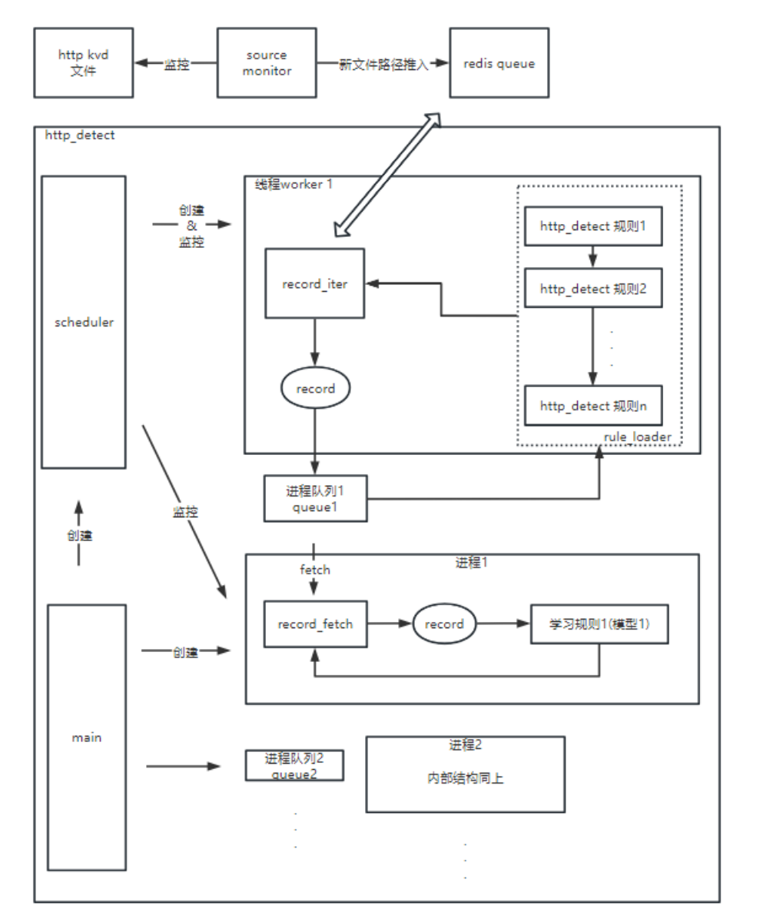

# 2020年下半年

```
蓝军xhack工具（背景是为了验证深信服下一代防火墙AF的作用）

发现并解决蓝军xhack产品安装和使用繁琐问题，将xhack搭建演示环境的时间从2小时缩减至10分钟
迭代开发xhack(windows应用)，提出将靶机集成进xhack方案，将原本需要单独安装在linux环境的DVWA靶机，移入xhack（负责前后端的开发）。提高了技服人员的工作效率。在客户公司，技服搭建演示环境的时间从2小时缩减至10分钟。 

目前使用的靶机是安装在debian虚拟机上的。 用户想要测试攻击靶机，还需要安装VM之后再装上debian虚拟机，过程繁琐耗时，在用户体验上不友好。 为了加强xhack工具的易用性，需要将靶机的安装进行优化。计划将靶机去虚拟化，将DWVA,  津城市人社局网站(jcsweb)等应用移植进Xhack工具中。

PHP 5.3  
MySQL 5.5  
Apache 2.4 

windows mysql乱码问题，路径过长问题，长度256

查看本地靶机状态，设置本地靶机端口，启动本地靶机，关闭本地靶机。 
	开启靶机前，支持靶机端口的设置。 需要注意问题
		1、验证端口的合法性 （必须是数字，默认是80端口， 然后前端显示建议在1024~65535之间）
		2、端口的占用问题 

web实况攻击
目录攻击
sql注入攻击
XSS攻击
暴力破解攻击（输入密码本）

前端用vue，后端用python3
```


# 2021年上半年

```
1.SIP58版本SIEM模块重构，减少大量冗余操作
2.SIP58版本之后对检测app架构进行优化，满足在横向扩展新检测规则的时候不会有造成额外的磁盘IO压力。
3.SIP58-62版本需求开发，解决客户问题


siem模块由agent2和sec_thirdparty两部分组成，其中agent2模块收集第三方日志
sec_thirdparty根据第三方日志匹配规则然后生成告警和安全事件
整个过程是： 
日志源（比如华为的设备）上传数据到514/8514端口 -->  sip通过rsyslog读取(514/8514端口)  --> 生成文件， logstash监控文件，然后将日志存到es  -->  python读取es的进行规则匹配 --> 最后生成安全日志 -->  log-transit根据安全日志生成告警和事件
```

协议

```python
1=>http
2=>https
3=>smtp
4=>pop3
5=>imap
6=>ftp
7=>smb
8=>ssh
9=>telnet
10=>rlogin
11=>rdp
12=>rsync
13=>tftp
14=>nfs
15=>ldap
16=>snmp
17=>redis
18=>dce_rpc
19=>dns
20=>ssl/tls
21=>icmp
22=>arp
23=>kerberos
24=>dncp
25=>socks
26=>mongo
27=>mysql
28=>sybase
29=>onvif
30=>netbios_nbns
31=>ntlm
32=>oracle
33=>tcp
34=>sql_server
35=>ngrok
36=>frp
```

文件检测逻辑

```
文件检测主要由两部分组成
	filethreat 和 file_detect

输入数据在
	1. 存病毒文件，文件名为md5值
		/data/xxx/kvd/file/20221009/  # 一开始存放在这里
		/data/xxx/kvd/virus/20221009/  # 扫描结果是病毒，存放在这里
		/data/xxx/kvd/white_file/20221009  # 扫描结果是白文件，存放在这里
	2. 存病毒文件信息， 一开始为json格式，然后被转换为avro格式， /data/dap/log_data/store/dvr/avro/file_info/20221009/1740D4E7/
		转换脚本： python /home/fantom/apps/ngfw/bin/file_info_to_avro/main.py
```

邮件检测逻辑

```
{'smtp', 'pop3', 'imap'}
apps.sec_netdetect.bin.mail_detect.main.main # 5分钟执行一次！ 读取多个数据源 目前数据源包含{'smtp', 'pop3', 'imap'}
		mail_flow = MailFlow(start_time, end_time)
		mail_flow.run()  # apps.sec_netdetect.bin.mail_detect.mail_flow.MailFlow.run()
			for source in AppConfig.ALLOW_SOURCE: 
				l_reader = log_readers[source]  # l_reader以 pop3_reader 为例
				mails_info = l_reader(self.start_time - timedelta(minutes=5),self.end_time - timedelta(minutes=5))
				for mail_info in mails_info:
					self.mail_parser.parsing(mail_info)
					self.file_info.gen_files_info_by_fuids(fuids)  # 兼容老版探针：根据邮件fuids获取files_info
					self._run_body_detect(mail_info, file_info)  # 正文检测  （读邮件协议avro，然后再读邮件文件avro）
						self._body_detect(mail_info, file_info)
							body_text = read_file(file_info['file_path'])
							self.trash_mail.detect(body_text)  # 垃圾邮件检测（通过打分的方式判断是否是垃圾邮件）
							urls = self.phishing_url.detect(body_text)  # 恶意url检测, 灰度发布
								urls = [url for url in urls if not self.url_operator.check_white(urlparse(url).hostname)] # 不在白名单内就认为是可以恶意url，然后进行收集
							# 勒索邮件检测, 灰度发布
							bitcoin_address = self.fraud_detect.run(body_text.encode('utf8'))
					self._run_attachment_detect(mail_info, file_info)  # 附件检测
					self._run_mail_detect(mail_info)  # 邮件头检测
					self.mail_result_handler.deal_detect_result(mail_info)  # 安全事件生成、KVD文件写入
						self._deal_result(byteify(deepcopy(mail_info)), to)
							proof = self._get_proof(mail_info, to)  # 填充举证
							mail_info['result'] = proof
							self.event_handler.process(mail_info, to)  # apps.sec_netdetect.bin.mail_detect.dao.mail_record_writer.RecordWrite.process
								rule_id = self._get_rule_id(record)
								self.sec_log_instance.push_to_redis(sec_log)  # 写入redis
			domain_result, new_cache = self.mail_domain.run()  # 发件人域名检测
			self.domain_result_handler.deal_detect_result(domain_result)
			
钓鱼邮件
	正则提取恶意url，url进行云查，调用威胁情报接口，判断是否是恶意url
垃圾邮件
	关键字识别,就简单的遍历关键词是否在文本中出现了
```


# 2021年下半年

```
增加日志分流，减少IO压力
	将审计日志分流到研究院异常检测学习模型， 不增加IO压力。
	不影响原有http_detect的检测速度，CPU和内存占用。
	日志分流模块内存占用优化到最小，同时控制异常检测的内存到最小。
	2021年9月份，对检测app架构进行优化，满足在横向扩展新检测规则的时候不会有造成额外的磁盘IO压力。 


加强检测app的稳定性
	加强检测app的稳定性
	参与代码审核，保证代码质量
	


增加自定义安全告警事件开关功能
	支持自定义安全告警事件开关功能
	支持恢复默认配置（解决数据表设计，兼容性等问题）
	实现安全引擎启动关闭功能
```


日志分流



火焰图分析耗时， memory_profiler分析内存


# 2022年上半年

```
将SIP的检测app迁移到中台的算子
	迁移完Web Ueba弱密码学习模型
	迁移完DGA规则，包含实现java机器学习模型
	迁移完挖矿检测， 包含实现java矩阵运算模块
	迁移完SIP63版本， 64版本新增的几个规则
	
	python版本的DGA检测（含学习模型）重构成java版本，负责决定java代码使用哪种方式迁移学习模型，加载学习模型。tensorflow, keras 等依赖在java中找到等效替换。
	https 加密挖矿检测用java代码进行重新实现。找到numpy在java中的等效替代 (nd4j)
	dga的h5格式模型转换成pb格式模型脚本

	
验收中台人员迁移的规则，保证中台功能和质量问题
	作为sip问题接口人，验收负责人。为中台同事提供迁移问题协助，确认安全日志的字段问题，app检测逻辑问题，推动了迁移进度
	写自动化测试进行功能验证，安全日志字段验证（包含十几种协议的80多个规则），保证了中台数据结果的正确性
	构建性能测试，稳定测试环境， 并排查问题，并提供了解决问题的方案，保证了中台运行的稳定性和性能
	
	使用jprofiler分析内存占用，减少不必要的内存占用
	
负责XDR日志消减模块功能，优化日志消减和告警转换模块性能， 协助二次检测模块的开发
	优化了日志消减模块的性能，使日志消减模块eps提升了20倍
	优化告警转换模块性能， 使告警转换模块eps提升2-3倍
	重新构建二次检测需要的so库依赖（yara-java， log4j，wskiller等）， 并将so库封装成可直接使用的jar包
	
	
在python语言实现的检测app转成java语言实现过程。总结一些项目迁移需要的一些知识点，然后整理成了教程入门，包括JNI 开发教程，linux LVM 动态扩容，yara检测库java版本实现等
```


## DGA 

```python
#!/usr/bin/env python
# encoding: utf-8

from keras import backend as K
import tensorflow as tf
import numpy as np
import keras.models as ks
from keras.preprocessing.sequence import pad_sequences

model = ks.load_model(
    "/home/fantom/apps/sec_netdetect/bin/dns_detect/rules/config/acdgadetect/model_dir/model_best_65.h5")


# =================测试h5模型===================
def split_domain_to_index(domain_array, word_dic):
    """
    将域名按字典映射为数字
    :param domain_array: 域名序列
    :param word_dic: 域名字典
    :return: 数字向量
    """
    domain_index_all = []
    for domain_elem in domain_array:
        domain_elem_split = list(domain_elem)
        domain_elem_index = []
        for domain_elem_split_elem in domain_elem_split:
            try:
                domain_elem_index.append(word_dic[domain_elem_split_elem])
            except KeyError:
                continue
        domain_index_all.append(domain_elem_index)
    return domain_index_all


domain_list = [u'hvilpvggvz.net', u'qftooinviyp.biz', u'bnnkqwzmy.biz', u'mmiiusb.cc', u'jsenhnsl.com', u'ajesusc.biz',
               u'wvrkz.org', u'kgynrtvcow.cn', u'oitjrixthdldm.cn', u'ywmcamfdszc.cn', u'hvilpvvgvz.net']
domain_list = np.array(domain_list)

domain_list_index = split_domain_to_index(domain_list,
                                          {'r': 32, 'w': 35, 'p': 30, 'm': 25, 'v': 36, 'y': 37, 'x': 38, 'n': 28,
                                           'u': 33, '_': 13, 'a': 14, 'q': 29, 'c': 15, 'b': 16, 'e': 17, 'd': 18,
                                           'g': 19, 'f': 20, 'i': 21, 'h': 22, 'k': 23, 'j': 24, '-': 1, 'l': 26,
                                           'o': 27, '.': 2, '1': 3, '0': 4, '3': 5, '2': 6, '5': 7, '4': 8, '7': 9,
                                           '6': 10, '9': 11, '8': 12, 's': 31, 'z': 39, 't': 34})
domain_list_index_pad = pad_sequences(domain_list_index, maxlen=65)
predict_probability = model.predict_proba(domain_list_index_pad, verbose=0)

print predict_probability


# [[ 0.99999952]
#  [ 0.99998176]
#  [ 0.998676  ]
#  [ 0.99999893]
#  [ 0.68123603]
#  [ 0.99099344]
#  [ 0.82735586]
#  [ 0.99978596]
#  [ 0.99998724]
#  [ 0.99950266]
#  [ 0.99999917]]

# embedding_2_input
# activation_2/Sigmoid
# Converted 16 variables to const ops.
#
# Process finished with exit code 0


#   ==================    h5  ->  pb模型   =====================
def freeze_session(session, keep_var_names=None, output_names=None, clear_devices=True):
    """
    :param session: 需要转换的tensorflow的session
    :param keep_var_names:需要保留的variable，默认全部转换constant
    :param output_names:output的名字
    :param clear_devices:是否移除设备指令以获得更好的可移植性
    :return:
    """
    from tensorflow.python.framework.graph_util import convert_variables_to_constants
    graph = session.graph
    with graph.as_default():
        freeze_var_names = list(set(v.op.name for v in tf.global_variables()).difference(keep_var_names or []))
        output_names = output_names or []
        # 如果指定了output名字，则复制一个新的Tensor，并且以指定的名字命名
        if len(output_names) > 0:
            for i in range(len(output_names)):
                # 当前graph中复制一个新的Tensor，指定名字
                tf.identity(model.model.outputs[i], name=output_names[i])
        output_names += [v.op.name for v in tf.global_variables()]
        input_graph_def = graph.as_graph_def()
        if clear_devices:
            for node in input_graph_def.node:
                node.device = ""
        frozen_graph = convert_variables_to_constants(session, input_graph_def,
                                                      output_names, freeze_var_names)
        return frozen_graph


print(model.input.op.name)  # embedding_2_input
print(model.output.op.name)  # activation_2/Sigmoid
# import pdb;pdb.set_trace()
# 自定义output_names
frozen_graph = freeze_session(K.get_session(), output_names=["activation_2/Sigmoid"])
tf.train.write_graph(frozen_graph, "./", "model.pb", as_text=False)

```


```xml
<dependency>
    <groupId>org.tensorflow</groupId>
    <artifactId>tensorflow</artifactId>
    <version>1.2.1</version>
</dependency>
<dependency>
    <groupId>org.tensorflow</groupId>
    <artifactId>tensorflow-core-api</artifactId>
    <version>0.4.0</version>
</dependency>
```


```java
public Graph graph;
public Session session;
    
public DGAModel() {
        // 关闭日志
        System.setProperty("TF_CPP_MIN_LOG_LEVEL", "3");

        // 加载模型
        graph = new Graph();
        byte[] graphBytes = new byte[0];
        try (InputStream fileInputStream = DGAModel.class.getResourceAsStream(Config.MODEL_FILE_PATH)) {
            graphBytes = IOUtils.toByteArray(fileInputStream);
            graph.importGraphDef(graphBytes);
        } catch (IOException e) {
            logger.error("load modelBest65.pb fail!");
            logger.error(ExceptionUtils.getStackTrace(e));
        }


        byte[] configBytes = ConfigProto.newBuilder()
                .putDeviceCount("GPU", 0)
                .putDeviceCount("CPU", 1)
                .setInterOpParallelismThreads(1)
                .setIntraOpParallelismThreads(1)
                .setLogDevicePlacement(true)
                .build().toByteArray();

        session = new Session(graph, configBytes);
    }
```

```java
	public static String INPUT_TENSOR_NAME = "embedding_2_input";
    public static String OUTPUT_TENSOR_NAME = "activation_2/Sigmoid";
    public static String DROPOUT_TENSOR_NAME = "dropout_2/keras_learning_phase";

	/**
     * @param domains 域名列表 ["hvilpvggvz.net", "qftooinviyp.biz", "bnnkqwzmy.biz", "mmiiusb.cc", "jsenhnsl.com", "ajesusc.biz"]
     * @return 概率值列表 例如：[0.9999995, 0.99998176, 0.998676, 0.9999989, 0.681236, 0.99099344]
     */
    public List<Float> predictProcess(List<String> domains) {
        float[][] domainVectorArray = splitDomainToIndex(domains);
        float[][] domainVectorArrayWithPad = padSequences(domainVectorArray);
        float[][] rawResults = new float[domainVectorArrayWithPad.length][1];
        session.runner().feed(INPUT_TENSOR_NAME, Tensor.create(domainVectorArrayWithPad))
                .feed(DROPOUT_TENSOR_NAME, Tensor.create(false))
                .fetch(OUTPUT_TENSOR_NAME)
                .run()
                .get(0)
                .copyTo(rawResults);

        // 将 float[][1] 类型转换成 List<Float> 类型
        List<Float> blackDomainProbabilities = new ArrayList<>();
        for (float[] rawResult : rawResults) {
            blackDomainProbabilities.add(rawResult[0]);
        }
        return blackDomainProbabilities;
    }

	/**
     * @param domainArray 域名数组
     * @return 返回 域名向量数组 domainVectorArray
     * @Description: 将域名按字典Config.validChars映射为数字向量
     */
    private float[][] splitDomainToIndex(List<String> domainArray) {
        float[][] domainVectorArray = new float[domainArray.size()][domainVectorMaxLength];

        for (int i = 0; i < domainArray.size(); i++) {
            List<Float> rawDomainVector = new ArrayList<>();
            for (char aChar : domainArray.get(i).toCharArray()) {
                if (Config.VALID_CHARS.containsKey(aChar)) {
                    rawDomainVector.add(Config.VALID_CHARS.get(aChar));
                }
            }
            // ArrayUtils（org.apache.commons.lang3）
            domainVectorArray[i] = ArrayUtils.toPrimitive(rawDomainVector.toArray(new Float[0]), 0.0f);
        }

        return domainVectorArray;
    }

	/**
     * @param domainVectorArray 域名向量数组
     * @return 返回高位填充0的域名向量数组 domainVectorArrayWithPad
     * @Description: 例如要求返回数组float[10]，若输入[1.0, 2.0, 3.0] 则输出[0.0, 0.0, 0.0, 0.0, 0.0, 0.0, 0.0, 1.0, 2.0, 3.0]
     */
    private float[][] padSequences(float[][] domainVectorArray) {
        for (int i = 0; i < domainVectorArray.length; i++) {
            float[] domainVector = domainVectorArray[i];
            float[] domainVectorWithPad = new float[domainVectorMaxLength];
            for (int j = 1; j <= domainVector.length; j++) {
                domainVectorWithPad[domainVectorWithPad.length - j] = domainVector[domainVector.length - j];
            }
            domainVectorArray[i] = domainVectorWithPad;
        }
        return domainVectorArray;
    }
```


java ac自动机

```xml
-- ahocorasick
<dependency>
    <groupId>org.ahocorasick</groupId>
    <artifactId>ahocorasick</artifactId>
    <version>0.6.3</version>
</dependency>
```


## logreduce-convert

```java
ConfigLoader configLoader = ConfigLoader.getConfigLoader(); // 单例获取loader
ConvertConfig convertConfig = configLoader.getConvertConfig(); //jackson
ConvertEngine engine = new ConvertEngine(convertConfig);
	ObjectMapper objectMapper = ObjectMapperHelper.getFlinkObjectMapper();
	JsonFileReader jsonFileReader = new JsonFileReader(objectMapper);
	this.environment = FlinkEnvironment.getFlinkEnvironment(convertConfig, jsonFileReader);
		env = StreamExecutionEnvironment.getExecutionEnvironment();
engine.init();
	DataStream<XdrAlertState> oneDetectStream = initOneDetect();
		PulsarConfig oneDetectPulsarConfig = getOneDetectPulsarConfig();
		DataStream<byte[]> sourceStream = loadSource(oneDetectPulsarConfig);
			env.fromSource(....)
		PulsarConfig samplePulsarConfig = getSamplePulsarConfig();
		DataStream<XdrAlertState> mapStream = loadMap(sourceStream, samplePulsarConfig); // 重点
			SingleOutputStreamOperator<N_alert_tmg> nAlertTmgStream = sourceStream.map(new ByteToNAlertTmgMapFunction())
                .process(new ExtractLogTraceToSideOutputFunction(logTraceTag));
			SingleOutputStreamOperator<N_alert_tmg_reduced> LogTraceStream = nAlertTmgStream.getSideOutput(logTraceTag)
					.map(new LogTraceMapFunction()) // 准备消减
					.uid("log-trace");

			int windowTime = convertConfig.getApplication().getApplicationFlink().getLogReduceWindowSize();
			SingleOutputStreamOperator<N_alert_tmg_reduced> nAlertTmgReduceStream = nAlertTmgStream
					.keyBy(new FirstAggregateKeySelector())
					.window(TumblingProcessingTimeWindows.of(Time.seconds(windowTime)))
					.aggregate(new FirstAggregateFunction(samplePulsarConfig, convertConfig))
					.uid("log-reduce");  // 消减

			ConvertConfig.SecondaryDetect secondaryConfig = convertConfig.getApplication().getSecondaryDetect();
			if (secondaryConfig == null || secondaryConfig.getSecondaryDetectEnable()) {
				nAlertTmgReduceStream.filter(new SecdetectMainFunctionFilter()).setParallelism(1);
			}  // 日志追踪的不消减

			DataStream<N_alert_tmg_reduced> logReduceStream = nAlertTmgReduceStream.union(LogTraceStream);

			return logReduceStream
					.map((MapFunction<N_alert_tmg_reduced, XdrAlertState>) XdrAlertState::new)
					/*.filter(new CommonFilterFunction(rulePath, jsonFileReader, convertConfig.getCommon().getTenants(),
							samplePulsarConfig, convertConfig))*/
					.uid("once-detect-filter");  // 给下面的流
	DataStream<XdrAlertState> secDetectStream = initSecondaryDetect(); // 和一次检测类似
	DataStream<XdrAlertState> unionStream = oneDetectStream.union(secDetectStream);
	DataStream<Tuple2<String, String>> resultStream = initCommonProcess(unionStream);  // 聚合一天的告警，传给下游， 中间状态用rockdb存起来
		PulsarConfig samplePulsarConfig = getSamplePulsarConfig();
        return unionStream
                .filter(
                        new CommonFilterFunction(rulePath,
                                jsonFileReader,
                                convertConfig.getCommon().getTenants(),
                                samplePulsarConfig,
                                convertConfig)
                )
                .keyBy(new AlertRichKeySelector())
                .process(new CommonKeyedProcessFunction(convertConfig, rulePath, jsonFileReader,
                        convertConfig.getLogtrace(), samplePulsarConfig))
                .uid("convert-alert");
	loadSink(resultStream);
engine.start();	
	environment.execute();
		env.execute("convert_and_sec_detect");
```


# 2022年下半年

```
提高NDR引擎性能，增加NDR引擎的稳定性，可靠性。
	将NDR引擎中LogReduce，Convert模块合并，降低50%的内存使用。
	增加日志对账，使线上客户问题，疑难问题能快速解决，提高后续业务的开发效率，预计提供效率30%。
	保证NDR支持新增的举证类型
	
	接手logreduce模块，并对logreduce引擎进行重构然后合入convert引擎，减少了将近一半的CPU和内存资源，优化了整体项目打包速度（7-10分钟缩减至2-3分钟），logreduce的模块处理速率从200tps优化到4000tps。 logreduce模块的单测方法覆盖率100%，行覆盖率95%以上（原本无单测）

提高SIP检测能力，改进护网存在的问题
	将邮件正文url和情报检测结合，生成恶意url告警， 同时判断恶意url是否被用户点击，如果用户点击则生成安全事件。
	增加122条应用识别告警， 能够生成122种应用代理和远程控制流量相应的告警。
	提供SIEM的检测能力， 支持6类第三方日志，一共104种第三方日志安全告警。
	协助技服解决客户问题，提高客户满意度。

将57版本的物联网合入到主线版本，提高产品效益
	合入57版本的视频网app的检测能力，适配58及以上版本，并同时提高其性能， 共6个告警
	合入57版本的物联网ueba（医疗设备相关）的检测， 并支持sig物联网数据的输入。共198个告警
	解决ueba客户问题，提高客户满意度。
	

```


##  物联网

摄像头检测逻辑（都是业务，好像没有什么技术价值）

```
设备已经掉线n个小时及以上(离线时间在资产中心--配置--高级配置中的离线规则中设置)，表明已经处于离线状态\n 
	定时查资产表，最新在线时间离当前时间是否超过n小时
设备的MAC地址发生了改变，说明设备信息发生变更
	查资产表和终端状态表，查看修改是否合法
源地址和目的地址都是视频设备地址，说明视频设备相互访问
	查看tcp审计日志流量。就是查看源目的是否是摄像头
视频设备的IP地址发起netbios、smb、telnet、ftp、http、https、ssh、mongo、mysql、sqlserver、db2等协议，说明视频设备使用违规协议
	查看tcp审计日志流量
不同的设备MAC地址相同
	查资产表和终端状态表
设备的厂商发生了改变，说明设备信息发生变更
```


## kafka

```java
# kafka输入逻辑
	InputManagers.init()
		KafkaInputManager.init()
			KafkaInput.init()
				new Dispatcher();
	InputManagers.run()
		KafkaInputManager.run()
			kafkaInput.runOnce();
				dispatcher.run(uebaContext, uebaKafkaConsumerConfig, kafkaOffsetsConsumedCollection);
					// === 重置offset
					OffsetReseter offsetReseter = new OffsetReseter(uebaKafkaConsumerConfig);  
					offsetReseter.reset();
					offsetReseter.destroy();
					// === consumerCount = 1 
					// log.info("Begin to create RecordPoller, RecordConsumer and RecordProcessor.");
					SubscribePhaser commitInitialOffsetPhaser = new SubscribePhaser();  
					commitInitialOffsetPhaser.register();
					RecordPoller recordPoller = new RecordPoller(uebaContext, uebaKafkaConsumerConfig, commitInitialOffsetPhaser, kafkaOffsetsConsumedCollection);	
					Thread pollThread = new Thread(recordPoller);
					pollThread.setDaemon(true);
					pollThread.setName("poller-" + 0);
					recordPollers[0] = recordPoller;
					pollerThreads[0] = pollThread;
					// === manage 管理poller线程,拉起挂了的线程
					RecordPollerManager recordPollerManager = new RecordPollerManager(uebaContext, uebaKafkaConsumerConfig, recordPollers, pollerThreads, kafkaOffsetsConsumedCollection);
					recordPollers[0].setRecordPollerManager(recordPollerManager);
					pollerThreads[0].start();
						RecordPoller.run();  // ***********主要逻辑***********  线程， kafka的数据转移到queue中
							subscribeTopic(kafkaConsumer, topicName);
							doRun();
								RecordConsumer recordConsumer = findByPartition(topicPartition, true);	
									createByPartition(topicPartition);
										RecordConsumer recordConsumer = new RecordConsumer(uebaContext, uebaKafkaConsumerConfig, this);
										startConsumer(topicPartition, recordConsumer);
											RecordConsumer.run();  // ***********主要逻辑***********  线程， 这里和kafka没关系， 和内存的queue有关系
												ConsumerRecord<K, V> record = poll(); // 从queue中pull
												process(record);
													RecordProcessor consumerRecordRecordProcessor = new AvroRecordProcessor(uebaContext, uebaKafkaConsumerConfig);
														consumerRecordRecordProcessor.process(record);
															Object[] event = new Object[fields.size()];
															preprocessor.apply(event);
															sendData(event); // ******数据到了siddhi中*********
								consumeRecord(recordConsumer, record);
									recordConsumer.add(record); // 将消息加到任务对列中
					while (true) {
						recordPollerManager.manage();  // 管理poller线程,拉起挂了的线程
						waitMillis(1000L * 30);
					}
```


