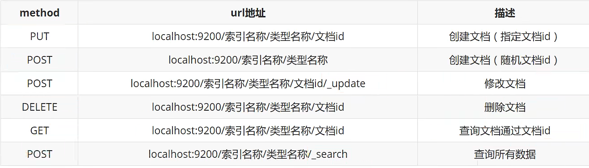

# ElasticSearch


名言： 在学校里，很多时候都是先进行学习，然后再进行考验。而在社会里，很多时候都是先经过了考验，才有机会进行学习！

名言：人生很难学会的一节课是放下。

 

参考： https://www.bilibili.com/video/BV1Sy4y1G7LL/?p=4&spm_id_from=pageDriver&vd_source=6cd527c3a43bcb0943d3d64a7923b3bc

https://www.bilibili.com/video/BV17a4y1x7zq/?spm_id_from=333.337.search-card.all.click


# 1. ElasticSearch概述

es是分布式全文搜索引擎， es基于Lucene进行了封装。

Lucene是一个全文检索的函数库,或者说是一套信息检索的工具包! jar包！ 不包含搜索引擎系统！ Lucene包含了索引结构， 读写索引的工具， 排序搜索规则等

> 扩展: Doug Cutting是Lucene的作者, Hadoop之父

​	GFS(Google File System)

​		==> NDFS(Nutch Distributed File System)  

​			==> HDFS (Hadoop Distributed File System)

​			==> HBase 

> es历史

Shay Banon 一开始基于Lucene开发了一个开源项目Compass，方便在应用中添加搜索功能

==> 然后因为Shay Banon的工作需要，基于Compass又写了一个独立的服务叫做ElasticSearch

 

和es相同的组件有solr， 但是性能没有es好 


## 倒排索引

分词得到词条


1. “手机”这个词条的位置不是在中间。找到“手机”的时间复杂度是O(n)
    使用“手机”作为关键字查询生成的倒排索引中，词条会排序，形成一颗树形结构，提升词条的查询速度

2. 使用“华为手机" 作为关键字查询
    es会自动将“华为手机“拆分成”华为“和”手机“


# 2. ElasticSearch安装

## ElasticSearch安装

```shell
docker network create es_network

docker run -d --name elasticsearch --net es_network -p 9200:9200 -p 9300:9300 -e "discovery.type=single-node" elasticsearch:7.6.2

# 或者
docker run -d --name elasticsearch --net es_network -p 9200:9200 -p 9300:9300 -e "discovery.type=single-node" -e ES_JAVA_OPTS="-Xms512m -Xmx512m"  elasticsearch:7.6.2
# -e 是设置环境变量
# ES_JAVA_OPTS="-Xms64m -Xmx512m" 将jvm的内存限制在64~512M
```

目录说明

```shell
bin # 启动目录
config # 配置文件目录
	log4j2 # 日志配置文件
	jvm.options # jvm配置文件
	elasticserach.yml # es配置文件， 默认9200, 跨域
lib # 相关jar包， 比如lucene
modules # 功能模块
plugins # 插件， 比如ik分词器
```


## Kibana安装

```shel
docker run -d --name kibana --net es_network -p 5601:5601 kibana:7.6.2
```

设置成中文

```shell
# 1. 进入kibana容器
vi /usr/share/kibana/config/kibana.yml
# 2. 最后一行加上i18n.locale: "zh-CN"
# 3. 退出容器， 重启容器  docker restart
```


## elasticsearch 浏览器插件


# 3. ElasticSearch核心概念


1、索引（indices）

2、字段类型（mappings）

3、文档（documents）


> es是面向文档的， 关系型数据库和es的客观对比

| DB        | ES                  |
| --------- | ------------------- |
| databases | indices             |
| tables    | types（deprecated） |
| rows      | documents           |
| columns   | fields              |


> 倒排索引


倒排索引我的理解是：以关键词作为key,关键词出现过的地方形成一个列表作为value  严格的定义我说不出来。

百科定义


> es的索引和lucene的索引对比

在es中，一个索引分为多个分片，每个分片就是一个lucene索引 ==> 所以一个es索引就是由多个lucene索引组成的


# 4. 分词器插件

ElasticSearch内置分词器

- StandardAnalyzer-默认分词器，按词切分，小写处理
- SimpleAnalyzer-按照非字母切分(符号被过滤),小写处理
- Stop Analyzer- 小写处理，停用词过滤(the,a,is).
- WhitespaceAnalyzer- 按照空格切分，不转小写.
- Keyword Analyzer-不分词，直接将输入当作输出
- PatterAnalyzer-正则表达式，默认W+(非字符分割)· 
- Language- 提供了30多种常见语言的分词器


elasticsearch教程--中文分词器作用和使用： https://cloud.tencent.com/developer/article/1444500

例子：  我爱伟大的祖国 分词成： [我,爱,伟大,的,祖国]

> 一般安装

1. 下载： https://github.com/medcl/elasticsearch-analysis-ik/tree/v7.6.2
2. 将其解压放进/usr/share/elasticsearch/plugins目录中
3. 重启es
4. 执行`elasticsearch-plugin list`命令查看已经加载的插件

> docker下安装

参考

https://www.jianshu.com/p/d8b0c736070f

1. 我先下载zip包到本地， 因为docker容器下载可能会很慢很慢

```shell
wget https://github.com/medcl/elasticsearch-analysis-ik/releases/download/v7.6.2/elasticsearch-analysis-ik-7.6.2.zip
# win下，复制链接下载，而不是去github下载zip包！
```

2. 复制到es容器中

```shell
docker cp elasticsearch-analysis-ik-7.6.2.zip [容器id]:/usr/share/elasticsearch/plugins
```

3. 进入es容器/plugins目录解压zip包, 解压完删除zip包

```shell
docker exec -it [容器id] unzip -d /usr/share/elasticsearch/plugins/ik 
/usr/share/elasticsearch/plugins/elasticsearch-analysis-ik-7.6.2.zip  # 注意这是一行，而不是两行

docker exec -it [容器id] rm -f /usr/share/elasticsearch/plugins/elasticsearch-analysis-ik-7.6.2.zip
```

4. 重启es容器

```shell
docker restart [容器id]
```

5. 查看是否加载了插件

```shell
docker exec -it [容器id] elasticsearch-plugin list
```


> 分词

分词就是把一段文字划分成一个个的关键字，我们在搜索的时候会将自己的信息进行分词， 会把数据库中或者索引库中的数据进行分析，然后进行一个匹配操作，默认的中文分词就是将每个字看成一个词，比如“你好世界“会被分成”你“,"好","世","界，这个显然是不符合要求的，所以我们需要安装中文分词器ik来解决这个问题


> 分词算法

ik提供两种分词算法： ik_smart 和 ik_max_word， 其中ik_smart是最少切分， is_max_word是最细粒度划分

ik_smart 效果：

```shell
GET _analyze 
{
  "analyzer": "ik_smart",
  "text": "中国共产党"
}
```


ik_max_word效果：

```shell
GET _analyze 
{
  "analyzer": "ik_max_word",
  "text": "中国共产党"
}
```


自己自定义的词需要加在字典里面(需要重启es)


参考狂神说 https://www.bilibili.com/video/BV17a4y1x7zq?p=8


 # 5. 索引的CURD 和 数据类型





## 数据类型

- 字符串类型 
    - text
    - keyword
- 数值类型 
    - 整型
        - long
        - integer
        - short
        - byte
    - 浮点型
        - double
        - float
        - half_float
        - scaled_float
- 日期类型
    - date
- 布尔类型
    - boolean
- 二进制类型
    - binary
- 范围类型
    - range
- 复合类型 
    - 数组类型 []
        - array
    - 对象类型 {}
        - object
- 嵌套类型
    - nested
- 地理类型
    - 地图坐标类型
        - geo_point
    - 地图类型
        - geo_shape
- 特殊类型
    - ip类型
- 令牌计数类型
    - token_count
- 附件类型
    - attachment
- 抽取类型
    - precolator


### Object类型

JSON天生具有层级关系，文档会包含嵌套的对象：

```
PUT my_index/_doc/1
{ 
  "region": "US",
  "manager": { 
    "age":     30,
    "name": { 
      "first": "John",
      "last":  "Smith"
    }
  }
}
```

上面的文档中，整体是一个JSON，JSON中包含一个manager,manager又包含一个name。最终，文档会被索引扁平成key-value对：

```
{
  "region":             "US",
  "manager.age":        30,
  "manager.name.first": "John",
  "manager.name.last":  "Smith"
}
```

上面文档结构的Mapping如下：

```
PUT my_index
{
  "mappings": {
    "properties": {
      "region": {
        "type": "keyword"
      },
      "manager": { 
        "properties": {
          "age":  { "type": "integer" },
          "name": { 
            "properties": {
              "first": { "type": "text" },
              "last":  { "type": "text" }
            }
          }
        }
      }
    }
  }
}
```


## 设置mapping

```json
PUT test 
{
  "mappings": {
    "properties": {
      "name": {
        "type": "text",
        "analyzer": "ik_smart"
      },
      "age": {
        "type": "integer"
      },
      "birthday": {
        "type": "date"
      }
    }
  }
}
```


## 1、创建一个索引

```shell
PUT /索引名/_doc/文档id
PUT /索引名/类型名/文档id  # 这种以后是是废弃的

PUT /index/_doc/1
{
  "name":"hwj",
  "age":12
}
```


指定字段类型

https://www.elastic.co/guide/en/elasticsearch/reference/7.6/mapping.html#update-mapping


查看**指定字段类型**的索引

```
GET /index/_mapping
GET /index
```


>  其他查询

```shell
GET _cat/health  # 查看健康状态
GET _cat/indices?v  # 查看索引有哪些？
```


## 2、修改一个索引

修改和提交都可以用put （不能进行部分修改）


不过大多数修改还是用post ( 可进行部分修改 )


## 3、 删除一个索引


# 6. 文档的CURD(重点)

 

## 1、添加数据 PUT

```shell
PUT /index1/_doc/1
{
  "name": "hwj",
  "age": 27
}
```


## 2、 查询数据 GET

### 简单的条件查询

```shell
GET /index1/_doc/1
```


 

### 复杂的条件搜索

```SH
# 这几个等价
GET index1/_doc/_search?q=name:hwj
GET index1/_search?q=name:hwj
GET index1/_search
{
  "query": {
    "match": {
      "name": "hwj"
    }
  }
}
```


### 数据准备

```shell
PUT /index/_doc/1
{
  "name":"特朗普",
  "age":71
}
```


### 结果字段的过滤用_source

```shell
GET index1/_search
{
  "query": {
    "match": {
      "name": "特朗普"
    }
  }, 
  "_source": ["name", "age"]
}
```

  

### 排序

```shell
GET index1/_search
{
  "query": {
    "match": {
      "name": "特朗普"
    }
  }, 
  "_source": ["name", "age"],
  "sort": [
    {
      "age": {
        "order": "asc"
      }
    }
  ]
}
```


### 分页

```shell
GET index1/_search
{
  "query": {
    "match": {
      "name": "特朗普"
    }
  }, 
  "_source": ["name", "age"],
  "sort": [
    {
      "age": {
        "order": "asc"
      }
    }
  ],
  "from": 0,
  "size": 2
}
```


### 布尔值查询

#### must ( and )， 所有的条件都要符合！

```shell
# 搜索名叫特朗普并且是71岁的人
GET index1/_search
{
  "query": {
    "bool": {
      "must": [
        {
          "match": {
            "name": "唐特朗普"
          }
        },
        {
          "match": {
            "age": "71"
          }
        }
      ]
    }
  }
}
```

#### should（or）, 有一个条件符合即可！

```shell
# 搜索名叫特朗普或者71岁的人
GET index1/_search
{
  "query": {
    "bool": {
      "should": [
        {
          "match": {
            "name": "特朗普"
          }
        },
        {
          "match": {
            "age": "71"
          }
        }
      ]
    }
  }
}
```

#### must_not ( not )， 条件取反

```json
# 搜索不叫特朗普的人
GET index1/_search
{
  "query": {
    "bool": {
      "must_not": [
        {
          "match": {
            "name": "唐特朗普"
          }
        }
      ]
    }
  }
}
```

#### filter 过滤得到符合条件的

```json
# 过滤得到71-72年龄段的人
GET index1/_search
{
  "query": {
    "bool": {
      "must": [
        {
          "match": {
            "name": "唐特朗普"
          }
        }
      ],
      "filter": [
        {
          "range": {
            "age": {
              "gte": 71,
              "lte": 72
            }
          }
        }
      ]
    }
  }
}
```

### 匹配多个条件

匹配一个条件

```json
GET index1/_search
{
  "query": {
    "match": {
      "tags": "总统"
    }
  }
}
```


匹配多个条件（多个条件用空格分开，只要有个条件匹配到即可，条件匹配到的越多score越高）

```json
GET index1/_search
{
  "query": {
    "match": {
      "tags": "总统 男人 负翁"
    }
  }
}
```


term和match， `match_phrase` 的区别

term是代表完全匹配，也就是精确查询，搜索前不会再对搜索词进行分词拆解。

从概念上看，term属于精确匹配，只能查单个词。我想用term匹配多个词怎么做？


`match_phrase` 称为短语搜索，要求所有的分词必须同时出现在文档中，同时位置必须紧邻一致。

参考：https://www.jianshu.com/p/d5583dff4157


### 精确查询 term

term 查询是直接通过**倒排索引**指定的词条进行精确的查找

**关于分词：**

term， 直接查询精确的值

match， 会使用分词器解析！（先分析文档，然后再通过分析的文档进行查询！）

**两个类型：**

text: 会被分词器解析

keyword: 不会被分词器解析


我们先创建测试用的索引

```json
PUT test_index
{
  "mappings": {
    "properties": {
      "name": {
        "type": "text"
      },
      "desc": {
        "type": "keyword"
      }
    }
  }
}

# 这里name字段的值会被解析， 而desc字段的值不会被解析
```

然后插入数据

```json
PUT test_index/_doc/1
{
  "name": "特朗普教java name",
  "desc": "特朗普教java desc"
}
PUT test_index/_doc/2
{
  "name": "特朗普教java name",
  "desc": "特朗普教java desc2"
}
```

然后进行分词查看， 发现**standard会被分词器解析， 而keyword不会**

```json
# 尝试运行
GET _analyze
{
  "analyzer": "keyword",
  "text": "特朗普说java name"
}
# 发现如果是keyword， “特朗普说java name”没有被拆分

# 尝试运行
GET _analyze
{
  "analyzer": "standard",
  "text": "特朗普说java name"
}
# 发现被拆分成了特，朗，普，说，java，name
```

然后进行搜索查询

```json
# 尝试运行
GET test_index/_search
{
  "query": {
    "term": {
      "name": {
        "value": "特"
      }
    }
  }
}
# 发现只有“特”，“朗”，“普”，“说”，“java”，“name”才能匹配到结果， “特朗普”不能匹配到结果
# 因为name字段的type是text， “特朗普说java name”文本被拆分成了“特”，“朗”，“普”，“说”，“java”，“name”这几个关键词

# 尝试运行
GET test_index/_search
{
  "query": {
    "term": {
      "desc": {
        "value": "特朗普教java desc"
      }
    }
  }
}
GET test_index/_search
{
  "query": {
    "term": {
      "desc": {
        "value": "特朗普教java desc2"
      }
    }
  }
}
# 发现“特朗普教java desc”, “特朗普教java desc2”才能匹配到结果
# 因为desc字段的type是keyword
```

### 多个值匹配精确查询

```json
# 创建数据1
PUT test_index/_doc/3
{
  "t1": "22",
  "ts": "2022-02-02"
}

# 创建数据2
PUT test_index/_doc/4
{
  "t1": "33",
  "ts": "2033-03-03"
}

# 多个值匹配（方法1）
GET test_index/_search
{
  "query": {
    "bool": {
      "should": [
        {
          "term": {
            "t1": {
              "value": "22"
            }
          }
        },
        {
          "term": {
            "t1": {
              "value": "33"
            }
          }
        }
      ]
    }
  }
}

# 多个值匹配（方法2）
GET test_index/_search
{
  "query": {
    "terms": {
      "t1": [
        "22",
        "33"
      ]
    }
  }
}
```

  

### 高亮查询

```json
# 对name字段进行高亮
GET test_index/_search
{
  "query": {
    "match": {
      "name": "特朗普"
    }
  },
  "highlight": {
    "fields": {
      "name": {}
    }
  }
}
```


### 类似 sql 中 in 查询

在SQL中可以使用 `in`关键字选择多个条件之一。例如：

```javascript
select * from test where id in (1, 2, 3)
```

相当于：

```javascript
select * from test where id=1 or id=2 or id=3
```

在ES中，也可以实现类似的功能。不过关键字为 `terms`:

```javascript
{"query":
  {"bool":
    {"must":[{"match": {"age": 28}},
             {"terms": {"work": ["engineer", "office lady", "teacher"]}}
             ]} 
  }
}
```

这一段查询的意思是，查询所有年龄为28，并且工作为 `engineer`、 `office lady` 或者 `teacher`之一的人的信息。

这个查询语句中的

```javascript
{"terms": {"work": ["engineer", "office lady", "teacher"]}}
```

就实现了类似于:

```javascript
work in ('engineer', 'office lady', 'teacher')
```


## 3、更新数据 PUT POST

put 全部更新（不建议使用）

```
PUT index1/_doc/1
{
  "name": "hwj",
  "age": 18,
  "date": "1999-12-12"
}
```


post _update 部分更新 (推荐使用)

```shell
POST /index1/_doc/1/_update
{
  "doc": {
    "age": 35
  }
}
```


```shell
POST /index1/_update/1
{
  "doc": {
    "age": 20
  }
}
```


## 4. 删除数据

```
DELETE /test/_doc/1
```


# 7. SpringBoot集成ES

代码地址

https://github.com/Master-He/springboot-es-demo

https://github.com/Master-He/springboot-es-demo/blob/main/src/test/java/com/example/SpringbootEsDemoApplicationTests.java


# 8. python es crud

参考文档： 

https://elasticsearch-py.readthedocs.io/en/v8.4.3/

参考https://kb.objectrocket.com/elasticsearch/get-the-mapping-of-an-elasticsearch-index-in-python-880

看es基本信息， 看索引列表

```shell
from elasticsearch import Elasticsearch

client = Elasticsearch()

elastic_info = Elasticsearch.info(client)
print "Cluster info:{}".format(json.dumps(elastic_info, indent=4))


all_indices = client.indices.get_alias("*")
print dir(client.indices)

for ind in all_indices:
    print ind

idx_mapping = client.indices.get_mapping(index="ngfw.httpflow-2022-10-11")
print idx_mapping
print idx_mapping["ngfw.httpflow-2022-10-11"]["mappings"]["properties"].keys()
```


# 9. es 的高级操作

## 批量操作

bulk操作，减少网络IO，一次请求全部做完

语法格式

```
POST /_bulk
{"action": {"metadata"}}   
{"data"}

#注意不能换行
```

示例

```
# 批量操作
# 1.删除5号记录
# 2.添加8号记录
# 3.修改2号记录， 名称为“二号”

POST /_bulk
{"delete": {"_index":"person", "_id":"5"}} 
{"create": {"_index":"person", "_id":"5"}}
{"name":"六号","age":20,"address":"北京"}
{"update": {"_index":"person", "_id":"2"}}
{"doc":{"name":"二号”}}

# delete后面不用的具体的data，因为是删除， update和create则要 
```


## 导入数据

需求： 将数据库中的数据导入到es中

 操作步骤：

1. 创建索引
2. 查询数据库表数据
3. bulk批量导入数据


## 各种查询

准备mapping和数据

```
PUT /phone
{
  "mappings": {
    "properties": {
      "name": {
        "type": "text",
        "analyzer": "ik_max_word"
      },
      "age": {
        "type": "integer"
      }
    }
  }
}

GET /phone

PUT /phone/_doc/1
{
  "name": "华为 matenote 手机",
  "age": 12
}

PUT /phone/_doc/2
{
  "name": "苹果 promax 手机",
  "age": 12
}

GET /phone/_search
```


### matchAll

```
# 默认最多显示10条
GET goods/_search
{
	"query": {
		"match_all": {}
	}
}


# 显示100条的话，通过分页进行
GET goods/_search
{
	"query": {
		"match_all": {}
	},
	"from": 0,
	"size"：100
}
```


### 查询结果的详解

```
{
  "took" : 1,  # 执行时间是1ms， 这个会越来越快，因为他有缓存
  "timed_out" : false,  # 表示没有超时
  "_shards" : {  # 分片信息
    "total" : 1,
    "successful" : 1,
    "skipped" : 0,
    "failed" : 0
  },
  "hits" : {  # 表示命中
    "total" : {
      "value" : 2,	 # 命中了2条
      "relation" : "eq"  # 操作方式是等值查询
    },
    "max_score" : 1.0,  # 最大得分，每一条记录都有得分。
    "hits" : [
      {
        "_index" : "index",
        "_type" : "_doc",
        "_id" : "1",
        "_score" : 1.0,  # 会根据得分排序
        "_source" : {
          "name" : "hwj 2022",
          "age" : 27
        }
      },
      {
        "_index" : "index",
        "_type" : "_doc",
        "_id" : "3",
        "_score" : 1.0,
        "_source" : {
          "name" : "hwj 2023",
          "age" : 27
        }
      }
    ]
  }
}

```


### term

```
 GET goods/_search
{
	"query": {
		"term": {
			"brand": {
				"value": "华为"
			}
		}
	}
}
```


### match

会对查询条件进行分词

然后将分析后的查询条件和词条进行等值匹配

默认取并集OR

```
GET /phone/_search
{
  "query": {
    "match": {
      "name": "华为手机"
    }
  }
}
```

如果想取交集

```
GET /phone/_search
{
  "query": {
    "match": {
      "name": {
        "query": "华为手机",
        "operator": "and"
      }
    }
  }
}
```


### 模糊查询

之前的都是等值查询，term是不分词，match是分词

wildcard查询 ：会对**查询条件**进行分词，还可以使用通配符？（任意单个字符） 和 * （0个或多个字符）

regexp查询： 正则查询

prefix查询： 前缀查询


### 范围查询

```数据准备
PUT /phone/_doc/1
{
  "name": "华为 matenote 手机",
  "price": 1200
}

PUT /phone/_doc/2
{
  "name": "苹果 promax 手机",
  "price": 4300
}
```


```
GET /phone/_search
{
  "query": {
    "range": {
      "price": {
        "gte": 1000,
        "lte": 2000
      }
    }
  }
}

# 带上排序
GET /phone/_search
{
  "query": {
    "range": {
      "price": {
        "gte": 1000,
        "lte": 5000
      }
    }
  },
  "sort": [
    {
      "price": {
        "order": "desc"
      }
    }
  ]
}
```


### queryString

准备数据

```
PUT /phone/_doc/1
{
  "name": "华为 matenote 手机",
  "brand": "华为",
  "category": "手机",
  "price": 1200
}

PUT /phone/_doc/2
{
  "name": "苹果 pro 电脑",
  "brand": "苹果",
  "category": "电脑",
  "price": 4300
}
```


和match有点像，但是queryString指定多个字段

```
# 华为在 name ,brand, category这些字段中搜
GET /phone/_search
{
  "query": {
    "query_string": {
      "fields": ["name", "brand", "category"],
      "query": "华为"
    }
  }
}

# 如果一定要是苹果电脑，就需要借助连接符
GET /phone/_search
{
  "query": {
    "query_string": {
      "fields": ["name", "brand", "category"],
      "query": "苹果 and 电脑"
    }
  }
}
```

query_string和simple_query_string在于， simple_query_string不支持and 后者 or 这两种连接符， 而query_string支持


### bool查询（很重要）

本质是为了将多个查询连接起来。 

boolQuery 对多个查询条件进行连接，连接方式：

- must（and） 条件必须成立
- must not (not) 条件必须不成立
- should (or) 条件可以成立
- filter 条件必须成立，但是性能比must高， 不会计算得分（得分高的排前面）


### 聚合查询

指标聚合： 相当于mysql的max ,min, avg, sum等

通聚合： 相当于mysql中的group by操作， 不要对text类型的数据进行分组，会失败


数据准备

```
PUT /phone
{
  "mappings": {
    "properties": {
      "name": {
        "type": "text",
        "analyzer": "ik_max_word"
      },
      "brand": {
        "type": "keyword"
      },
      "price": {
        "type": "long"
      },
      "category": {
        "type": "keyword"
      }
    }
  }
}

GET /phone

PUT /phone/_doc/1
{
  "name": "华为 matenote 手机",
  "brand": "华为",
  "category": "手机",
  "price": 1200
}

PUT /phone/_doc/2
{
  "name": "苹果 pro 电脑",
  "brand": "苹果",
  "category": "电脑",
  "price": 4300
}

PUT /phone/_doc/3
{
  "name": "苹果手机",
  "brand": "苹果",
  "category": "手机",
  "price": 5600
}

PUT /phone/_doc/4
{
  "name": "华为电脑",
  "brand": "华为",
  "category": "电脑",
  "price": 5600
}

```


```
# 获取最贵的手机  （指标聚合）
GET /phone/_search
{
  "query": {
    "match": {
      "category": "手机"
    }
  }, 
  "aggs": {
    "maxPrice": {
      "max": {
        "field": "price"
      }
    }
  }
}


# 根据品牌进行分组，看每个品牌下面有多少个产品（桶聚合)
GET /phone/_search
{
  "aggs": {
    "brand_statistic": {
      "terms": {
        "field": "brand",
        "size": 100
      }
    }
  }
}


```

### 高亮
怎么实现高亮, 在需要变红的地方加标签<em></em>

```
GET /phone/_search
{
  "query": {
    "match": {
      "name": "华为"
    }
  },
  "highlight": {
    "fields": {
      "name": {}
    }
  }
}


# 或者
GET /phone/_search
{
  "query": {
    "match": {
      "name": "华为"
    }
  },
  "highlight": {
    "fields": {
      "name": {
        "pre_tags": "<em>",
        "post_tags": "</em>"
      }
    }
  }
}

```


##  复合查询

复合查询 (组合多个查询)

- bool query （布尔查询）
    - must  贡献算分
    - must not  不贡献算分
    - should 贡献算分
    - filter  不贡献算分
- boosting query（提高查询）
- constant_score （垃圾邮件）
- dis_max（最佳匹配查询）
- function_score(函数查询)

### bool query （布尔查询）

略，上面总结过


### boosting query(提高查询)

不同于bool查询，bool查询中只要一个子查询条件不匹配那么搜索的数据就不会出现。而boosting query则是降低显示的权重/优先级（即score)。

比如搜索逻辑是 name = 'apple' and type ='fruit'，对于只满足部分条件的数据，不是不显示，而是降低显示的优先级（即score)


创建数据

```
POST /test-dsl-boosting/_bulk
{ "index": { "_id": 1 }}
{ "content":"Apple Mac" }
{ "index": { "_id": 2 }}
{ "content":"Apple Fruit" }
{ "index": { "_id": 3 }}
{ "content":"Apple employee like Apple Pie and Apple Juice" }
```

```
GET /test-dsl-boosting/_search
{
  "query": {
    "boosting": {
      "positive": {
        "term": {
          "content": "apple"
        }
      },
      "negative": {
        "term": {
          "content": "pie"
        }
      },
      "negative_boost": 0.5
    }
  }
}
```


### constant_score（固定分数查询）

查询某个条件时，固定的返回指定的score；显然当不需要计算score时，只需要filter条件即可，因为filter context忽略score。

数据准备

```
POST /test-dsl-constant/_bulk
{ "index": { "_id": 1 }}
{ "content":"Apple Mac" }
{ "index": { "_id": 2 }}
{ "content":"Apple Fruit" }
```

查询

```
GET /test-dsl-constant/_search
{
  "query": {
    "constant_score": {
      "filter": {
        "term": { "content": "apple" }
      },
      "boost": 1.2
    }
  }
}
```


### dis_max(最佳匹配查询）

分离最大化查询（Disjunction Max Query）指的是： 将任何与任一查询匹配的文档作为结果返回，但只将最佳匹配的评分作为查询的评分结果返回 。

有点复杂： 参考; https://pdai.tech/md/db/nosql-es/elasticsearch-x-dsl-com.html


### function_score(函数查询)

简而言之就是用自定义function的方式来计算_score。


## 索引别名和重建索引

（索引别名和重建索引， 线上环境迁移时平滑过度能用到）

随着业务的需求的变更，索引的结构可能发生改变，但是es的索引一旦创建，只允许添加字段，不允许改变字段，因为改变字段，需要重建倒排索引，影响内部缓存结构，性能太低

那么此时，需要重新创建一个新的索引，将原有的索引的数据导入到新索引中

```shell

# ----- 重建索引------
# 新建student_index_v1. 索引名称必须全部小写

PUT student_index_v1
{
  "mappings": {
    "properties": {
      "birthday" : {
        "type": "date"
      }
    }
  }
}

GET student_index_v1


PUT student_index_v1/_doc/1
{
  "birthday" : "1999-10-10"
}


GET student_index_v1/_search


# 业务变更了，需要概念birthday的字段为text
# 方法就是重新建立索引
# 1. 创建新的索引student_index_v2
# 2. 将student_index_v1的数据拷贝到student_index_v2·

PUT student_index_v2
{
  "mappings": {
    "properties": {
      "birthday" : {
        "type": "text"
      }
    }
  }
}

# es提供了_reindex 重建索引
POST _reindex
{
  "source": {
    "index": "student_index_v1"
  }
  , "dest": {
    "index": "student_index_v2"
  }
}


# 查student_index_v2， 看数据有没有复制过来
GET student_index_v2/_search
{
  "query": {
    "match_all": {}
  }
}


# 思考， 在java代码中操作es， 还是使用就旧的索引名称？ 这个就需要动态的获取索引名称了， 以后就根据时间定义索引,  另外，也可以用索引别名（推荐）
# 0. 先删除老版本的索引库student_index_v1
# 1. 给student_index_v2起个别名叫student_index_v1
POST student_index_v2/_alias/student_index_20230523

# 查看student_index_v2的别名
GET student_index_v2
 
```


# 10.集群和分布式

集群，多个人做样的事情

分布式，多个人做不一样的事情


集群解决的是高可用的问题，进行负载均衡，分担请求压力。不同的节点存储相同的数据， 一个节点挂了，另外一个节点可以顶上

分布式解决的是扩容的问题，不同的节点存储不同的数据，解决存储带来的压力


es天然支持集群分布式，我们解决了很多细节问题


## 集群概念

概念（从大到小）
	集群
		一组存相同数据的节点
	节点
		一个es实例
	索引
		存储数据的地方
	分片 primary shard
		索引可以被拆分为不同部分进行存储，成为分片
		在集群环境下，一个索引的不同分片拆分到不同的节点中
	副本分片 replica shard
		每个分片有一个或者多个副本，数据和主分片一样


## 节点角色

```
master # 主节点
data # 通用数据节点
data_content # 数据目录节点
data_hot # 热点数据节点
data_warm # 中温数据节点
data_cold # 冷数据节点
data_frozen # 封存数据节点
ingest # 数据摄入节点
ml # 机器学习节点
remote_cluster_client # 远程候选节点
transform # 转换节点

作者：过悟
链接：https://juejin.cn/post/7038828692671299620
来源：稀土掘金
著作权归作者所有。商业转载请联系作者获得授权，非商业转载请注明出处。
```


## 集群的搭建

参考： https://www.bilibili.com/video/BV1Sy4y1G7LL?p=45&spm_id_from=pageDriver&vd_source=6cd527c3a43bcb0943d3d64a7923b3bc


步骤

1. 准备3个es实例， 最好在不同机器上，如果在一个机器上就用不多端口区分
2. 修改3个实例的elasticsearch.yml文件
    1. 创建3个实例的日志目录logs（/opt/1ogs）和数据目录data（/opt/data）（注意更改目录权限！！！）
        1. 有错误需要认真看日志文件报的错！
    2. 修改elasticsearch.yml文件
3. 启动3个实例
    1. 启动前改一下 es 的jvm内存参数，防止内存不做， es还是很吃资源的 （注意3个节点都要改）
        1. bin/elasticsearch脚本中就可以看到jvm.options文件的位置
    2. 执行bin/elasticsearch启动
4. 打开浏览器查看 _cat/healthy?v 查看状态，如果返回的node.total是3，代码集群搭建成功。


elasticsearch.yml文件 示例

```shell
#集群名称
cluster .name: itcast-es
#1号节点名称
node.name: itcast-1
#是不是有资格成为主节点
node .master : true
#是否存储数据
node .data: true
#最大集群节点数
node.max_Tocal_storage_nodes: 3
#ip地址
network.host: 0.0.0.0
#端口
http.port: 9201  # 其实两个是9202， 9203

#内部节点之间沟通端口
transport.tcp.port: 9700  # 其实两个是9800， 9900

#es7.x 之后新增的配置，节点发现
discovery.seed_hosts: ["localhost:9700", "localhost:9800", "localhost:9900"]
#es7.x 之后新增的配置，初始化一个新的集群时需要此配置来选举master
cluster,initial_master_nodes: ["itcast-1", "itcast-2", "itcast-3"]

# 数据和存储路径
path.data: /opt/data
path.logs: /opt/1ogs
```


集群的健康状况解释(_cat/healthy?v)

```
健康状况结果解释:
cluster 集群名称
status 集群状态
	green 代表健康;
	ye11ow 代表分配了所有主分片，但至少缺少一个副本，此时集群数据仍旧完整;
	red 代表部分主分片不可用，可能已经丢失数据。
node.total代表在线的节点总数量
node.data代表在线的数据节点的数量
shards 存活的分片数量
pri 存活的主分片数量   正常情况下shards的数量是pri的两倍
relo迁移中的分片数量，正常情况为 0
init 初始化中的分片数量 正常情况为 0
unassign未分配的分片 正常情况为 0
pending_tasks准备中的任务，任务指迁移分片等 正常情况为 0
max_task_wait_time任务最长等待时间
active_shards_percent正常分片百分比 正常情况为 100%
```


## kibana管理集群

步骤

1. 复制一份kibana代码
2. 修改kibana的集群配置
3. 启动kibana
4. 去kibana的stack monitor里面就可以看到集群状态


修改kibana的集群配置

```shell
# config/kibana.yml
# 加入以下配置
elasticsearch.hosts:
["http://localhost:9201","http://localhost:9202","http://1ocalhost:9203"]
```


启动kibana

```
sh kibana --allow-root
```


## 集群原理

在创建索引的时候，如果不指定分片配置，则默认主分片1，副本分片1。 可以在索引的settings中看到

```
# 创建索引，设置分片, 分片数量是 number_of_shards * （number_of_replicas + 1）
PUT test_index
{
  "settings": {
    "number_of_shards": 3
    , "number_of_replicas": 1
  },
  "mappings": {
    "properties": {
      "name":{
        "type": "text"
      }
    }
  }
}
```


### 分片的自平衡

分片与自平衡： 当节点挂掉后，挂掉的节点分片会自平衡到其他节点中， 举例如下

环境： 有3个节点A,B,C， 有3个分片， 副本分片也有3个， P开头的表示主分片， R开头表示副本分片

A 存 P0， R1分片

B 存 P1， R2分片

C 存 P2， R0 分片

当A节点挂了， BC节点会自平衡

B 存 P0， P1，R2分片

C 存 R0 ，R1,   P2分片

如果A节点恢复了， ABC又会自平衡

A 存 P0， R1分片

B 存 P1， R2分片

C 存 P2， R0 分片


### 分片的配置

分片数量一旦确定好，是不能修改的 (因为会影响路由算法，所以不能改 )

那么分片分多少比较好？？？

分片规则：

1. 每个分片推荐大小在10-30GB
2. 分片的数量推荐 = 节点数量 * 1~3倍

思考： 比如有1000GB的数据，应该有多少个分片？ 多少个节点？

答： 分片大小取25， 分40个分片， 倍数取两倍，20个节点， number_of_shards配置成20， number_of_replicas配置成1


### 路由原理

问题1. es怎么知道一个文档应该存放到哪个分片中呢？？？  （怎么存？）

问题2, es查询时，根据文档id查询文档， es又该去哪个分片中查询数据呢？？？ （怎么取？）


文档存入对应的分片， ES计算分片编号的过程，称为路由

路由算法： shard_index = hash(id) % number_of_primary_shards   (hash后取模， 模的大小就是主分片的大小)


## 脑裂

一个正常es集群中只有一个主节点（Master），主节点负责管理整个集群。如创建或删除索引，跟踪哪些节点是集群的一部分，并决定哪些分片分配给相关的节点。

集群的所有节点都会选择同一个节点作为主节点


脑裂问题的出现是因为从节点在选择主节点上出现了分歧，导致一个集群出现多个主节点，从而使集群分裂，使得集群处于异常状态


### 脑裂原因

1. 网络原因： 网络延迟
    1. 一般es集群会在内网部署，也可能在外网部署，比如阿里云
    2. 内网一般不会出现此问题，外网的网络出现问题的可能性比较大
2. 节点负载
    1. 主节点角色即为master又为data, 数据访问量较大时，可能就导致master节点停止响应（假死状态）
3. JVM内存回收
    1. 当Master节点设置的JVM内存较小时，引发JVM的大规模内存回收，造成ES进程失去响应


### 避免脑裂

1. 网络原因： discovery.zen.ping.timeout 超时时间配置大一点，默认是3S 
2. 节点负载： 角色分离
    1. 候选主节点配置为
        1. node.master: true
        2. node.data: false
    2. 数据节点配置为
        1. node.master: false
        2. node.data : true
3. jvm内存回收： 修改config/jvm.options 文件的-Xms和-Xmx为服务器的内存的一半。


## 集群扩容

修改配置文件即可


# 11. 索引模板

索引模板就是告诉es， 创建索引的时候要如何配置索引， 比如

1. 配置多少分片， 副分片
2. 索引有什么别名
3. 索引的mapping是怎么样的？ 有哪些字段，字段用什么类型，用什么分词器


# 13. Lucene

参考： https://pdai.tech/md/db/nosql-es/elasticsearch-y-th-1.html

es中的一个索引分片就是 lucene index

Lucene是一个Full Text 搜索库

在Lucene里面有很多小的segment，我们可以把它们看成Lucene内部的mini-index。


## segment

- Segment内部

    （有着许多数据结构）

    - Inverted Index
    - Stored Fields
    - Document Values
    - Cache


最最重要的Inverted Index

Inverted Index主要包括两部分：

- 一个有序的数据字典Dictionary（包括单词Term和它出现的频率）。 字典按字母顺序排
- 与单词Term对应的Postings（即存在这个单词的文件）。

​	

查询the fury


- **自动补全**（AutoCompletion-Prefix）

如果想要查找以字母“c”开头的字母，可以简单的通过二分查找（Binary Search）在Inverted Index表中找到例如“choice”、“coming”这样的词（Term）。


- **昂贵的查找**

如果想要查找所有包含“our”字母的单词，那么系统会扫描整个Inverted Index，这是非常昂贵的。


## 倒排索引

参考文档： https://learnku.com/elasticsearch/t/46888

Lucene 底层存储如下图所示


字典树 指向 字典， 然后字典指向倒排表


倒排索引

1. 词项索引(字典树， 存前缀后缀指针)
2. 词项字典
3. 倒排表


Lucene的索引结构中有哪些文件 ？  存储的文件格式 

详细了解 : tip  tim  doc


更多的文件类型参考： https://lucene.apache.org/core/7_2_1/core/org/apache/lucene/codecs/lucene70/package-summary.html#package.description


## 缓存的故事

当ElasticSearch索引一个文件的时候，会为文件建立相应的缓存，并且会定期（每秒）刷新这些数据，然后这些文件就可以被搜索到。

随着时间的增加，我们会有很多segments，

所以ElasticSearch会将这些segment合并，在这个过程中，segment会最终被删除掉

这就是为什么增加文件可能会使索引所占空间变小，它会引起merge，从而可能会有更多的压缩。


# 14. ES的整体结构

著作权归@pdai所有 原文链接：https://pdai.tech/md/db/nosql-es/elasticsearch-y-th-2.html


一个 ES Index 在集群模式下，有多个 Node （节点）组成。每个节点就是 ES 的Instance (实例)。

每个节点上会有多个 shard （分片）， P1 P2 是主分片, R1 R2 是副本分片

每个分片上对应着就是一个 Lucene Index（底层索引文件）

Lucene Index 是一个统称 

- 由多个 Segment （段文件，就是倒排索引）组成。每个段文件存储着就是 Doc 文档。
- commit point记录了所有 segments 的信息


## ES原理之索引文档流程详解

### 数据持久化过程

> **通过分步骤看数据持久化过程**：**write -> refresh -> flush -> merge**

- write 过程


一个新文档过来，会存储在 in-memory buffer 内存缓存区中，顺便会记录 Translog（Elasticsearch 增加了一个 translog ，或者叫事务日志，在每一次对 Elasticsearch 进行操作时均进行了日志记录）。

这时候数据还没到 segment ，是搜不到这个新文档的。数据只有被 refresh 后，才可以被搜索到


- refresh 过程


refresh 默认 1 秒钟，执行一次上图流程。ES 是支持修改这个值的，通过 index.refresh_interval 设置 refresh （冲刷）间隔时间。refresh 流程大致如下：

1. in-memory buffer 中的文档写入到新的 segment 中，但 segment 是存储在文件系统的缓存中。此时文档可以被搜索到
2. 最后清空 in-memory buffer。注意: Translog 没有被清空，为了将 segment 数据写到磁盘
3. 文档经过 refresh 后， segment 暂时写到文件系统缓存，这样避免了性能 IO 操作，又可以使文档搜索到。refresh 默认 1 秒执行一次，性能损耗太大。一般建议稍微延长这个 refresh 时间间隔，比如 5 s。因此，ES 其实就是准实时，达不到真正的实时


- flush 过程

每隔一段时间—例如 translog 变得越来越大—索引被刷新（flush）；一个新的 translog 被创建，并且一个全量提交被执行


上个过程中 segment 在文件系统缓存中，会有意外故障文档丢失。那么，为了保证文档不会丢失，需要将文档写入磁盘。那么文档从文件缓存写入磁盘的过程就是 flush。写入磁盘后，清空 translog。具体过程如下：

1. 所有在内存缓冲区的文档都被写入一个新的段。
2. 缓冲区被清空。
3. 一个Commit Point被写入硬盘。
4. 文件系统缓存通过 fsync 被刷新（flush）。
5. 老的 translog 被删除。


- merge 过程

由于自动刷新流程每秒会创建一个新的段 ，这样会导致短时间内的段数量暴增。而段数目太多会带来较大的麻烦。 每一个段都会消耗文件句柄、内存和cpu运行周期。更重要的是，每个搜索请求都必须轮流检查每个段；所以段越多，搜索也就越慢。

Elasticsearch通过在后台进行Merge Segment来解决这个问题。**小的段被合并到大的段，然后这些大的段再被合并到更大的段。**

当索引的时候，刷新（refresh）操作会创建新的段并将段打开以供搜索使用。合并进程选择一小部分大小相似的段，并且在后台将它们合并到更大的段中。这并不会中断索引和搜索。


一旦合并结束，老的段被删除：

1. 新的段被刷新（flush）到了磁盘。 ** 写入一个包含新段且排除旧的和较小的段的新提交点。
2. 新的段被打开用来搜索。
3. 老的段被删除。


合并大的段需要消耗大量的I/O和CPU资源，如果任其发展会影响搜索性能。Elasticsearch在默认情况下会对合并流程进行资源限制，所以搜索仍然 有足够的资源很好地执行。


## Lucene处理流程


创建索引的过程：

- 准备待索引的原文档，数据来源可能是文件、数据库或网络
- 对文档的内容进行分词组件处理，形成一系列的Term
- 索引组件对文档和Term处理，形成字典和倒排表

搜索索引的过程：

- 对查询语句进行分词处理，形成一系列Term
- 根据倒排索引表查找出包含Term的文档，并进行合并形成符合结果的文档集
- 比对查询语句与各个文档相关性得分，并按照得分高低返回


## ElasticSearch分析器

Lucene处理流程 流程中很重要的一项就是:  **词法分析/语言处理**


分析器执行上面的工作。 分析器 实际上是将三个功能封装到了一个包里：

- **字符过滤器** 首先，字符串按顺序通过每个 字符过滤器 。他们的任务是在分词前整理字符串。一个字符过滤器可以用来去掉HTML，或者将 & 转化成 and。
- **分词器** 其次，字符串被 分词器 分为单个的词条。一个简单的分词器遇到空格和标点的时候，可能会将文本拆分成词条。
- **Token 过滤器** 最后，词条按顺序通过每个 token 过滤器 。这个过程可能会改变词条（例如，小写化 Quick ），删除词条（例如， 像 a， and， the 等无用词），或者增加词条（例如，像 jump 和 leap 这种同义词）。

Elasticsearch提供了开箱即用的字符过滤器、分词器和token 过滤器。 这些可以组合起来形成自定义的分析器以用于不同的目的。


# 15. ES使用场景


## ELK使用场景

ELK Stack是软件集合Elasticsearch、Logstash、Kibana的简称

新增了一个FileBeat，它是一个轻量级的日志收集处理工具(Agent)，Filebeat占用资源少，适合于在各个服务器上搜集日志后传输给Logstash，官方也推荐此工具。


### SIEM

rsyslog 收集数据传到处理服务器， 然后logstash收集，解析，转换日志（富化日志，比如什么时间产生的日志）， 然后存入es

kafka作为消息队列发送日志给处理程序处理，得到处理结果。 同时es作为存储，也可以用来复查


参考 哈罗，腾讯， 美团的项目

https://pdai.tech/md/db/nosql-es/elasticsearch-z-hello.html

https://pdai.tech/md/db/nosql-es/elasticsearch-z-tencent.html

https://pdai.tech/md/db/nosql-es/elasticsearch-z-meituan.html


# 16. ES的性能优化

## 硬件优化

CPU、内存和 IO

禁止 swap，一旦允许内存与磁盘的交换，会引起致命的性能问题。可以通过在 elasticsearch.yml 中 bootstrap.memory_lock: true，以保持 JVM 锁定内存，保证 ES 的性能。


## 索引性能优化


### 批量提交

当有大量数据提交的时候，建议采用批量提交（Bulk 操作）；此外使用 bulk 请求时，每个请求不超过几十M，因为太大会导致内存使用过大。


### 增加 Refresh 时间间隔

为了提高索引性能，Elasticsearch 在写入数据的时候，采用延迟写入的策略，即数据先写到内存中，当超过默认1秒（index.refresh_interval）会进行一次写入操作，就是将内存中 segment 数据刷新到磁盘中，此时我们才能将数据搜索出来，所以这就是为什么 Elasticsearch 提供的是近实时搜索功能，而不是实时搜索功能。

如果我们的系统对数据延迟要求不高的话，我们可以**通过延长 refresh 时间间隔，可以有效地减少 segment 合并压力，提高索引速度**。


### 修改 index_buffer_size 的设置

```
indices.memory.index_buffer_size: 10%
indices.memory.min_index_buffer_size: 48mb
```

indices.memory.index_buffer_size 接受一个百分比或者一个表示字节大小的值。默认是10%，意味着分配给节点的总内存的10%用来做索引缓冲的大小。这个数值被分到不同的分片（shards）上。如果设置的是百分比，还可以设置 min_index_buffer_size （默认 48mb）和 max_index_buffer_size（默认没有上限）


### 修改 translog 相关的设置

什么事tranglog

当分片所在的节点接收到来自协调节点的请求后，会将请求写入到Memory Buffer，然后定时（默认是每隔1秒）写入到Filesystem Cache，这个从Momery Buffer到Filesystem Cache的过程就叫做refresh；

当然在某些情况下，存在Momery Buffer和Filesystem Cache的数据可能会丢失，ES是通过translog的机制来保证数据的可靠性的。其实现机制是接收到请求后，同时也会写入到translog中，当Filesystem cache中的数据写入到磁盘中时，才会清除掉，这个过程叫做flush。

在flush过程中，内存中的缓冲将被清除，内容被写入一个新段，段的fsync将创建一个新的提交点，并将内容刷新到磁盘，旧的translog将被删除并开始一个新的translog。 flush触发的时机是定时触发（默认30分钟）或者translog变得太大（默认为512M）时。


> 修改translog相关配置

一是控制数据从内存到硬盘的操作频率，以减少硬盘 IO。可将 sync_interval 的时间设置大一些。默认为5s。

```
index.translog.sync_interval: 5s
```

也可以控制 tranlog 数据块的大小，达到 threshold 大小时，才会 flush 到 lucene 索引文件。默认为512m。

```
index.translog.flush_threshold_size: 512mb
```


### 注意 _id 字段的使用

_id 字段的使用，应尽可能避免自定义 _id，以避免针对 ID 的版本管理；建议使用 ES 的默认 ID 生成策略或使用数字类型 ID 做为主键。


###  注意 _all 字段及 _source 字段的使用

_all 字段及 _source 字段的使用，应该注意场景和需要，_all 字段包含了所有的索引字段，方便做全文检索，如果无此需求，可以禁用；_source 存储了原始的 document 内容，如果没有获取原始文档数据的需求，可通过设置 includes、excludes 属性来定义放入 _source 的字段。


### 合理的配置使用 index 属性

合理的配置使用 index 属性，analyzed 和 not_analyzed，根据业务需求来控制字段是否分词或不分词。只有 groupby 需求的字段，配置时就设置成 not_analyzed，以提高查询或聚类的效率。


### 减少副本数量

Elasticsearch 默认副本数量为3个，虽然这样会提高集群的可用性，增加搜索的并发数，但是同时也会影响写入索引的效率。

在索引过程中，需要把更新的文档发到副本节点上，等副本节点生效后在进行返回结束。使用 Elasticsearch 做业务搜索的时候，建议副本数目还是设置为3个，但是像内部 ELK 日志系统、分布式跟踪系统中，完全可以将副本数目设置为1个


## 查询优化

### Filter VS Query

尽可能使用过滤器上下文（Filter）替代查询上下文（Query）

- Query：此文档与此查询子句的匹配程度如何？
- Filter：此文档和查询子句匹配吗？

Elasticsearch 针对 Filter 查询只需要回答「是」或者「否」，不需要像 Query 查询一样计算相关性分数，同时Filter结果可以缓存


### 深度翻页

在使用 Elasticsearch 过程中，应尽量避免大翻页的出现。

正常翻页查询都是从 from 开始 size 条数据，这样就需要在每个分片中查询打分排名在前面的 from+size 条数据。协同节点收集每个分配的前 from+size 条数据。协同节点一共会受到 N*(from+size) 条数据，然后进行排序，再将其中 from 到 from+size 条数据返回出去。如果 from 或者 size 很大的话，导致参加排序的数量会同步扩大很多，最终会导致 CPU 资源消耗增大。

可以通过使用 Elasticsearch scroll 和 scroll-scan 高效滚动的方式来解决这样的问题。

也可以结合实际业务特点，文档 id 大小如果和文档创建时间是一致有序的，可以以文档 id 作为分页的偏移量，并将其作为分页查询的一个条件。


### Cache的设置及使用

indices.queries.cache.size： 10%（默认），可设置成百分比，也可设置成具体值，如256mb。


### 通过开启慢查询配置定位慢查询

```
PUT  /_template/{TEMPLATE_NAME}
{
 
  "template":"{INDEX_PATTERN}",
  "settings" : {
    "index.indexing.slowlog.level": "INFO",
    "index.indexing.slowlog.threshold.index.warn": "10s",
    "index.indexing.slowlog.threshold.index.info": "5s",
    "index.indexing.slowlog.threshold.index.debug": "2s",
    "index.indexing.slowlog.threshold.index.trace": "500ms",
    "index.indexing.slowlog.source": "1000",
    "index.search.slowlog.level": "INFO",
    "index.search.slowlog.threshold.query.warn": "10s",
    "index.search.slowlog.threshold.query.info": "5s",
    "index.search.slowlog.threshold.query.debug": "2s",
    "index.search.slowlog.threshold.query.trace": "500ms",
    "index.search.slowlog.threshold.fetch.warn": "1s",
    "index.search.slowlog.threshold.fetch.info": "800ms",
    "index.search.slowlog.threshold.fetch.debug": "500ms",
    "index.search.slowlog.threshold.fetch.trace": "200ms"
  },
  "version"  : 1
}
 
PUT {INDEX_PAATERN}/_settings
{
    "index.indexing.slowlog.level": "INFO",
    "index.indexing.slowlog.threshold.index.warn": "10s",
    "index.indexing.slowlog.threshold.index.info": "5s",
    "index.indexing.slowlog.threshold.index.debug": "2s",
    "index.indexing.slowlog.threshold.index.trace": "500ms",
    "index.indexing.slowlog.source": "1000",
    "index.search.slowlog.level": "INFO",
    "index.search.slowlog.threshold.query.warn": "10s",
    "index.search.slowlog.threshold.query.info": "5s",
    "index.search.slowlog.threshold.query.debug": "2s",
    "index.search.slowlog.threshold.query.trace": "500ms",
    "index.search.slowlog.threshold.fetch.warn": "1s",
    "index.search.slowlog.threshold.fetch.info": "800ms",
    "index.search.slowlog.threshold.fetch.debug": "500ms",
    "index.search.slowlog.threshold.fetch.trace": "200ms"
}
```

这样，在日志目录下的慢查询日志就会有输出记录必要的信息了。

```
{CLUSTER_NAME}_index_indexing_slowlog.log
{CLUSTER_NAME}_index_search_slowlog.log
```


### 数据结构的优化

减少不必要字段


# 面试题


## 索引的生命周期

在 `Elastic Stack 6.6` 版本后推出了新功能 `Index Lifecycle Management(索引生命周期管理)`，支持针对索引的全生命周期托管管理，并且在 `Kibana` 上也提供了一套 UI 界面来配置策略

深信服用的是方法是，每天一个索引，最多30天，过期自动删


**索引生命周期常见的阶段**？

- hot: 索引还存在着大量的读写操作。
- warm:索引不存在写操作，还有被查询的需要。
- cold:数据不存在写操作，读操作也不多。
- delete:索引不再需要，可以被安全删除

Elasticsearch索引生命周期管理方案 参考文档： https://developer.aliyun.com/article/780694


## ES查询和聚合的方式有哪些？

参考

https://pdai.tech/md/interview/x-interview.html#_8-5-elasticsearch

https://pdai.tech/md/db/nosql-es/elasticsearch-x-dsl-term.html


- **DSL**
    - 基于文本
        - match
            - sort （相当与order by）
            - from (相当于offset)
            - size (相当于limit)
        - match_all
        - query string
        - interval
        - match_phrase
        - highlight 高亮查询
    - 基于词项 - term
        - exists
        - ids
        - prefix
        - term 分词
        - terms 多个分词匹配，默认or关系
        - term set 按某个数字字段分词匹配
        - wildcard 通配符查询
        - range 范围
            - lt
            - gt
        - regexp 正则
        - fuzzy 模糊查询  （编辑距离是将一个术语转换为另一个术语所需的一个字符更改的次数。）
            - 更改字符（box→ fox）
            - 删除字符（black→ lack）
            - 插入字符（sic→ sick）
            - 转置两个相邻字符（act→ cat）
    - 复合查询 (组合多个查询)
        - bool query （布尔查询）
            - must  贡献算分
            - must not  不贡献算分
            - should 贡献算分
            - filter  不贡献算分
        - boosting query（提高查询）
        - constant_score （垃圾邮件）
        - dis_max（最佳匹配查询）
        - function_score(函数查询)
- **EQL** **E**vent **Q**uery **L**anguage 
    - bucket (相当于group by)
    - metric (相当于 sum, max, min, count)
    - pipline(让上一步的聚合结果成为下一个聚合的输入，这就是管道。 )
- **SQL**