 *Apache Flume* 是一个分布式，可靠且可用的系统，用于有效地从许多不同的源收集、聚合和移动大量日志数据到一个集中式的数据存储区。

https://zhuanlan.zhihu.com/p/49025497


# 1.概述

kafka是分布式的，基于发布/订阅模式的 消息队列

消息发布者不会将消息直接发送给特定的订阅者，而是将发布的消息分为不同的类别，订阅者只接受感兴趣的消息


> kafka  rabbitmq  rocketmq 区别

参考： https://blog.csdn.net/weixin_38002497/article/details/106055120


> kafka 的3个作用： 做缓冲，做解耦，做异步通信


消息队列，两种模式

1. 点对点
2. 发布/订阅模式
    1. 可以有多个topic
    2. 消费者消费后，不删除数据
    3. 每个消费者相互独立，都可以消费数据


基础架构

生产者，多个broker（服务器） ，一个Topic有多个分区， 消费者分组

broker用来存储数据，一个消费组里面有多少个消费者？topic多少个分区就多少个消费者。 一一对应会比较好！

producer和consumer是java代码写的 ，broker代码是scala写的

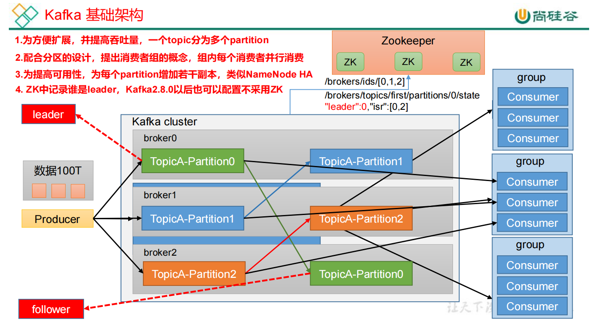


# 2. 入门


## 安装集群

1. 解压tar包
2. vim config/server.properties
    1. 修改broker.id=0  # 3个服务器的值为0,1,2
    2. 修改log.dirs=/opt/module/kafka/datas 
    3. 配置zookeeper:  zookeeper.connect=192.168.0.111:2181,192.168.0.112:2181,192.168.0.0.113:2181/kafka
    4. 配置advertised.listeners=PLAINTEXT://192.168.0.111:9092
3. 启动zookeeper
4. 启动kakfa: bin/kafka-server-start.sh -daemon config/server.properties
5. 关闭kafka:  bin/kafka-server-stop.sh


停止 Kafka 集群时，一定要等 Kafka 所有节点进程全部停止后再停止 Zookeeper集群。因为 Zookeeper 集群当中记录着 Kafka 集群相关信息，Zookeeper 集群一旦先停止，Kafka 集群就没有办法再获取停止进程的信息，只能手动杀死 Kafka 进程了。


 ## 命令

1. broker（topic）命令
2. producer命令
3. consumer命令


### broker

```shell
# 查看单个节点
kafka-topics.sh --bootstrap-server 192.168.0.111:9092 --list
# 查看多个节点用逗号隔开
kafka-topics.sh --bootstrap-server 192.168.0.111:9092,192.168.0.112:9092 --list

# 创建名为first的主题
kafka-topics.sh --bootstrap-server 192.168.0.111:9092 --create --partitions 1 --replication-factor 3 --topic first

# 查看主题详情
kafka-topics.sh --bootstrap-server 192.168.0.111:9092 --describe --topic first、

# 修改分区数，只能增加不能减少
kafka-topics.sh --bootstrap-server 192.168.0.111:9092 --alter --topic first --partitions 3

# 删除主题
kafka-topics.sh --bootstrap-server 192.168.0.111:9092 --delete --topic first
```


### producer

```shell
# 连接单个节点
kafka-console-producer.sh --bootstrap-server 192.168.0.111:9092 --topic first
# 连接多个节点
kafka-console-producer.sh --bootstrap-server 192.168.0.111:9092,192.168.0.112:9092 --topic first
```


### consumer

```shell
kafka-console-consumer.sh --bootstrap-server 192.168.0.111:9092 --topic first
```


# 3.生产者

## 发送原理

发送的过程中涉及两个线程，一个是main线程，一个是sender线程。 其中main线程中有一个双端队列RecordAccumulator. main线程不断的将消息发送给RecordAccumulator， Sender线程不断从RecordAccumulator中拉取消息发送到 Kafka Broker

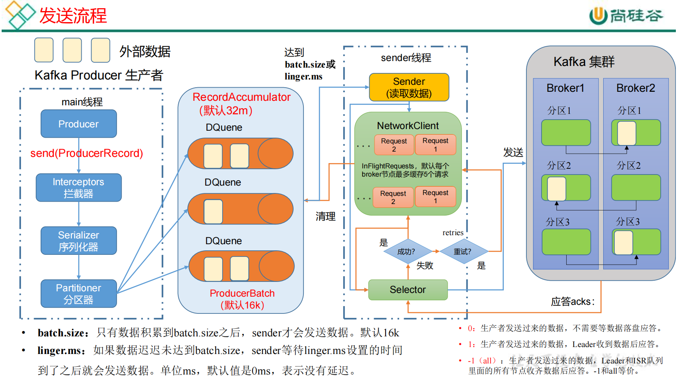

InFlightRequests 默认每个broker最多缓存5个请求


生产者结构

1. 主线程
    1. 拦截器
    2. 序列化器
    3. 分区器
    4. 记录积累器, 双端队列RecordAccumulator
2. sender线程
    1. selector发送和应答


## 异步发送API(java)


```
<dependencies>
 <dependency>
 <groupId>org.apache.kafka</groupId>
 <artifactId>kafka-clients</artifactId>
 <version>3.0.0</version>
 </dependency>
</dependencies>
```

看具体的demo代码


## 生产者分区

好处

1. 便于合理使用存储资源
    1.  每个partition在一个broker上存储，可以海量的数据切割成一块一块的数据存储在多台Broker上
        合理控制分区任务，可以实现负载均衡的效果， partition下面会再分segment
2. 提高并行度
    1. 生产者可以以分区为单位发送数据，消费者可以以分区为单位进行消费数据


分区策略

	1. 默认的分区器
	2. 自定义分区器
	  	1. 不同的业务数据存在不同的分区中


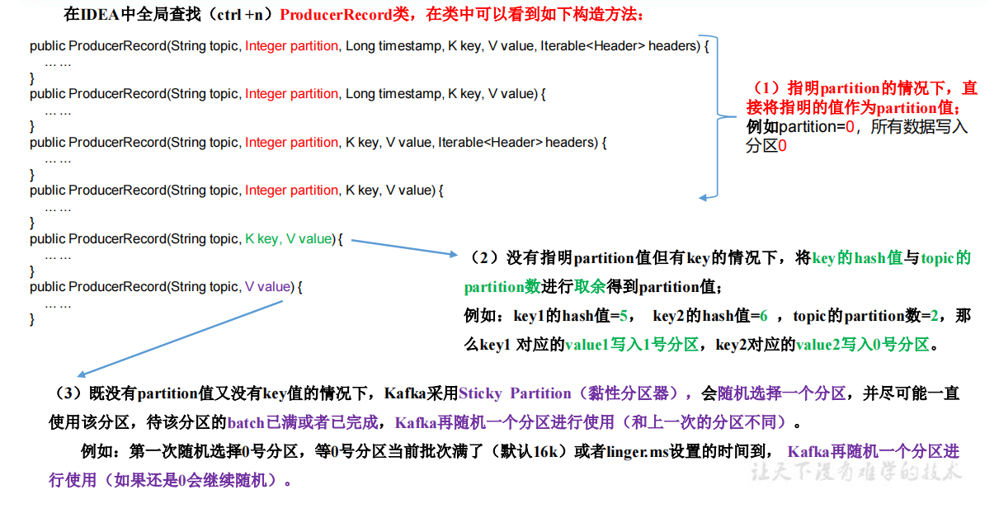

没key, 多分区是，无法保证消息的有序


## 生产者如何提高吞吐量

```
RecordAccumulator 默认是32M， 可以改成64M

batch.size 表示一次拉多少， 默认16k

linger.ms 表示多久拉一次，  默认0s，没有延迟 (可以改为5-100ms)

compression.type #默认是none， 可以配置gzip,snappy, lz4, zstd，通常情况用snappy
```


## 数据的可靠性

```
ack = 0 # 不应答，最不可靠
ack = 1 # 应答，但是只保证一个节点有数据，如果这个节点宕机了，就不可靠了
ack = -1(all) # 所有的节点都收到数据应答， 可靠

retries = 0 # 默认重试次数为0
```

**思考**：ack =-1 , Leader收到数据，所有Follower都开始同步数据，但有一个Follower，因为某种故障，迟迟不能与Leader进行同步，那这个问题怎么解决呢？

Leader维护了一个动态的in-sync replica set（**ISR**），意为和Leader保持同步的Follower+Leader集合(leader：0，isr:0,1,2)。

如果Follower长时间未向Leader发送通信请求或同步数据，则该Follower将被踢出ISR。该时间阈值由**replica.lag.time.max.ms**参数设定，默认30s。例如2超时，(leader:0, isr:0,1)。   isr 就是insync

这样就不用等长期联系不上或者已经故障的节点。


**数据可靠性分析：**

如果分区副本设置为1个，或 者ISR里应答的最小副本数量（ min.insync.replicas 默认为1）设置为1，和ack=1的效果是一
样的，仍然有丢数的风险（leader：0，isr:0）。

数据完全可靠条件 = ACK级别设置为-1 + 分区副本大于等于2 + ISR里应答的最小副本数量大于等于2


> 可靠性总结：

1. acks=0，生产者发送过来数据就不管了，可靠性差，效率高；
2. acks=1，生产者发送过来数据Leader应答，可靠性中等，效率中等；
3. acks=-1，生产者发送过来数据Leader和ISR队列里面所有Follwer应答，可靠性高，效率低；


在生产环境中，acks=0很少使用；acks=1，一般用于传输普通日志，允许丢个别数据；acks=-1，一般用于传输和钱相关的数据，
对可靠性要求比较高的场景。


## 数据去重

> 数据传递语义

1. 至少一次
2. 至多一次
3. 精确一次 （特别是涉及钱的） 引入了幂等性和事务


> 幂等性

**重复数据的判断标准**：具有<PID, Partition, SeqNumber>相同主键的消息提交时，Broker只会持久化一条。其中PID是Kafka每次重启都会分配一个新的；Partition 表示分区号；Sequence Number是单调自增的。所以幂等性只能保证的是在单分区单会话内不重复。

> 如何使用幂等性开启参数 

enable.idempotence 默认为 true，false 关闭


> 生成者事务

如果生产者挂了， 生产者PID会分配新的，那么重复数据就有可能产生，此时引入事务，事务依赖幂等性，开启事务必须开启幂等性


Producer 在使用事务功能前，必须先自定义一个唯一的 transactional.id。有了 transactional.id，即使客户端挂掉了，它重启后也能继续处理未完成的事务

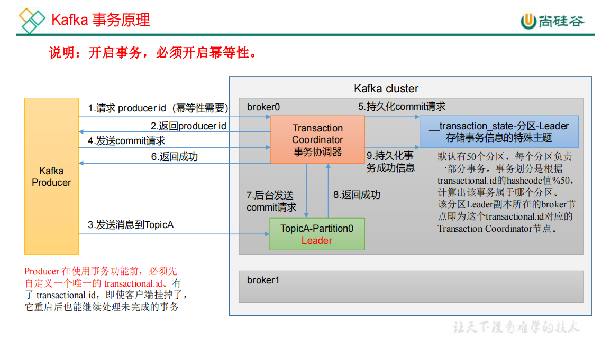

5个事务API

```java
// 1 初始化事务
void initTransactions();

// 2 开启事务
void beginTransaction() throws ProducerFencedException;

// 3 在事务内提交已经消费的偏移量（主要用于消费者）
void sendOffsetsToTransaction(Map<TopicPartition, OffsetAndMetadata> offsets, String consumerGroupId) throws ProducerFencedException;

// 4 提交事务
void commitTransaction() throws ProducerFencedException;

// 5 放弃事务（类似于回滚事务的操作）
void abortTransaction() throws ProducerFencedException;


// 特别注意，创建producer时，要设置事务 id（必须），事务 id 任意起名
 properties.put(ProducerConfig.TRANSACTIONAL_ID_CONFIG, "transaction_id_0");
```


## 数据有序问题

单分区内，有序（条件： max.in.flight.requests.per.connection=1 ，详见下节）

多分区，分区与分区之间无序 （消费者消费数据存起来再排序，性能很差，还不如单分区）


## 数据乱序问题

就算是单分区，数据发送失败，重发，会导致乱序

比如发1 2 3 4 ， 3因为超时发送失败，而其他数据已经到了broker，3重发后，数据就变成了1 2 4 3

默认broker缓存的请求是5个， 对应参数是 max.in.flight.requests.per.connection=5


单分区乱序解决办法：

- 未开启幂等性的情况下： 如果想要单分区不乱序，就要设置broker缓存的请求是1个，设置 max.in.flight.requests.per.connection=1

- 开启幂等新的情况下：  max.in.flight.requests.per.connection 小于等于 5 即可
    因为在kafka1.x以后，启用幂等后，kafka服务端会缓存producer发来的最近5个request的元数据，故无论如何，都可以保证最近5个request的数据都是有序的。


# 4.Broker

## zookeeper存储了哪些信息？

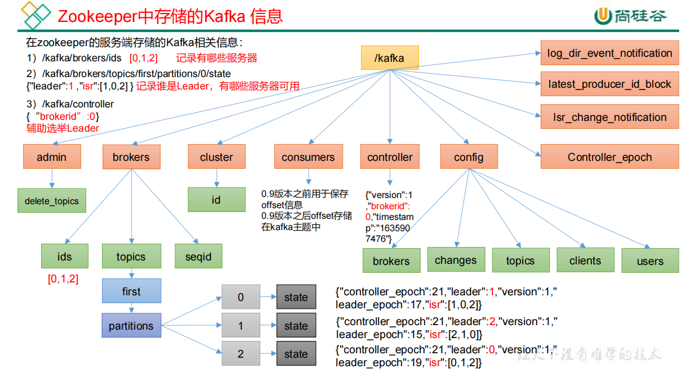


## broker总体工作流程


内容很乱， 日后整理

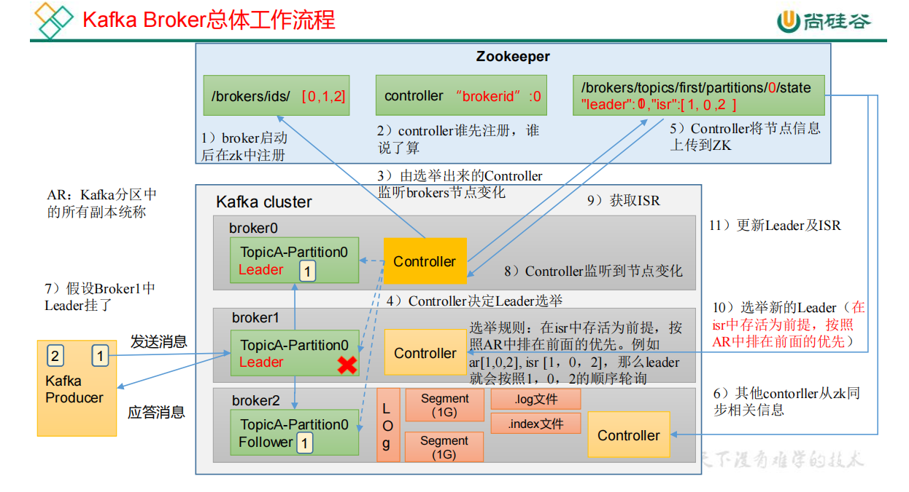

AR: kafka分区中的所有副本统称

ISR: inSync Replica


## 节点的服役和退役


> 服役

增加新节点要，分片数据想迁移到新节点怎么办？ 执行负载均衡

```shell
# 1. 创建一个要均衡的主题。
vim topics-to-move.json

# 2. 生成一个负载均衡的计划。
bin/kafka-reassign-partitions.sh --bootstrap-server hadoop102:9092 --topics-to-move-json-file topics-to-move.json --broker-list "0,1,2,3" --generate

# 3. 创建副本存储计划（所有副本存储在 broker0、broker1、broker2、broker3 中）。
vim increase-replication-factor.json

# 4. 执行副本存储计划。
bin/kafka-reassign-partitions.sh --bootstrap-server hadoop102:9092 --reassignment-json-file increase-replication-factor.json --execute

# 5. 验证副本存储计划。
bin/kafka-reassign-partitions.sh --bootstrap-server hadoop102:9092 --reassignment-json-file increase-replication-factor.json --verify
```


> 退役

数据导入到其他节点上，然后这个节点就可以退役了   (broker3退役)

```shell
# 1. 创建一个要均衡的主题。
vim topics-to-move.json

# 2. 生成一个负载均衡的计划。
bin/kafka-reassign-partitions.sh --bootstrap-server localhost111:9092 --topics-to-move-json-file topics-to-move.json --broker-list "0,1,2" --generate

# 3. 创建副本存储计划（所有副本存储在 broker0、broker1、broker2 中）。
vim increase-replication-factor.json

# 4. 执行副本存储计划。
bin/kafka-reassign-partitions.sh --bootstrap-server hadoop102:9092 --reassignment-json-file increase-replication-factor.json --execute

# 5. 验证副本存储计划。
bin/kafka-reassign-partitions.sh --bootstrap-server hadoop102:9092 --reassignment-json-file increase-replication-factor.json --verify
```


## 副本

1. 副本的作用： 提高数据的可靠性
2. 默认副本只有1个，生成缓存配置为2个； 太多副本会增加磁盘空间，增加网络上数据传输，降低效率
3. 副本分为： Leader和Follower。 Kafka生产者只会把数据发往Leader， 然后Follower找leader同步数据
4. Kafka分区中的所有副本统称为 AR(Assigned Replicas)


AR = ISR + OSR 

ISR （InSynReplicas) 表示和Leader保持同步的Follower集合，如果Follower长时间（默认30s，参数replica.lag.time.max.ms）没有向Leader发送通信请求或者同步数据， 则Follower将被提出ISR. Leader故障后，就会从ISR中选举新的Leader

OSR 就是延迟过多被剔除ISR的副本


### 选举流程

Kafka 集群中有一个 broker 的 Controller 会被选举为 Controller Leader，负责管理集群。broker 的上下线，所有 topic 的分区副本分配和 Leader 选举等工作。

Controller 的信息同步工作是依赖于 Zookeeper 的。 

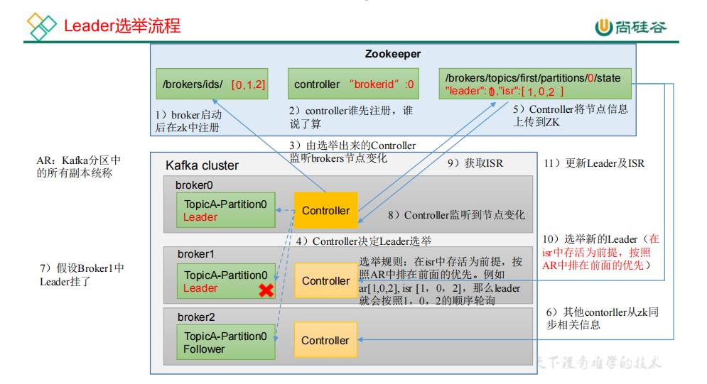

优先选举AR中的第一个节点，然后判断这个节点是否在ISR中，如果存在，则这个节点将成为新的Leader


### Leader和Follower故障处理细节

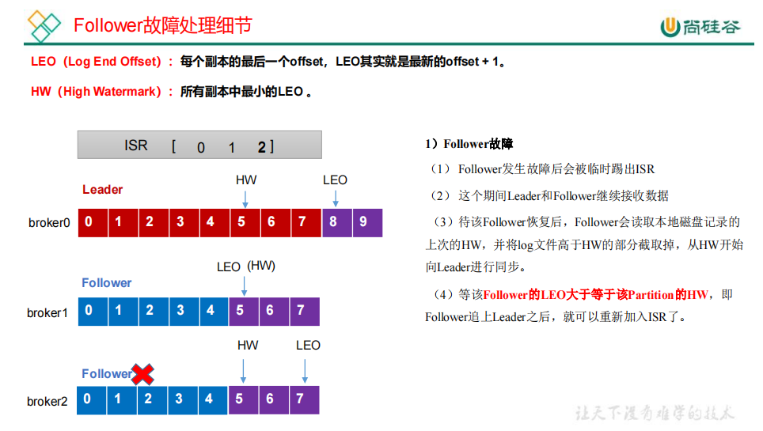

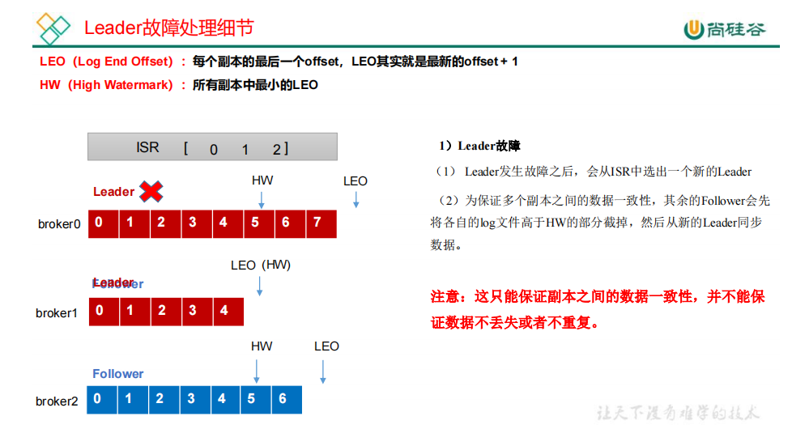


### 分区副本分配

会尽量均匀得分配副本到每个节点


### 生产经验：手动调整分区副本存储

创建执行机会。

略


### 生产经验：Leader Partition 负载平衡

每个broker尽可能的均匀持有相同多的Leader Partition


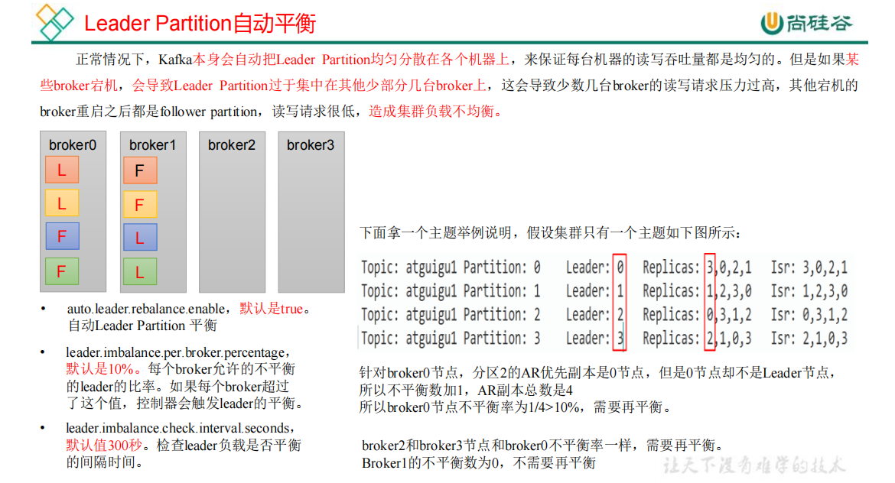


### 生产经验：增加副本因子

略


## Kafka的文件存储机制

### **Topic** 数据的存储机制

log文件也是逻辑上的概念

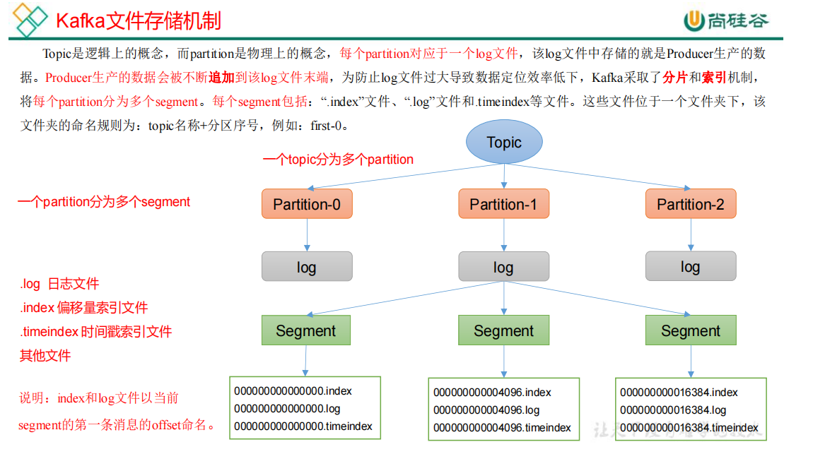

通过自带的工具查看 index 和 log 信息

```
kafka-run-class.sh kafka.tools.DumpLogSegments --files ./00000000000000000000.index
kafka-run-class.sh kafka.tools.DumpLogSegments --files ./00000000000000000000.log在·
```


### **index** **文件和** **log** **文件详解**

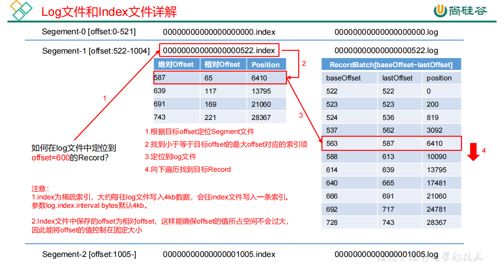


### 文件清理策略

Kafka 中默认的日志保存时间为 7 天，可以通过调整如下参数修改保存时间。

- log.retention.hours，最低优先级小时，默认 7 天。
- log.retention.minutes，分钟。
- log.retention.ms，最高优先级毫秒。
- log.retention.check.interval.ms，负责设置检查周期，默认 5 分钟。


Kafka 中提供的日志清理策略有 delete 和 compact 两种。


1. delete 日志删除：将过期数据删除   log.cleanup.policy = delete 所有数据启用删除策略
    1. 基于时间：默认打开。以 segment 中所有记录中的最大时间戳作为该文件时间戳
        也就是segment中的所有数据都过期了才删除
    2. 基于大小：默认关闭。超过设置的所有日志总大小，删除最早的 segment。
        1. log.retention.bytes，默认等于-1，表示无穷大。
2. compact 日志压缩  log.cleanup.policy = compact 所有数据启用压缩策略
    1. compact日志压缩：对于相同key的不同value值，只保留最后一个版本。


### 高效读写数据 （重点）

1. Kafka 本身是分布式集群，可以采用分区技术，并行度高  （写角度）
2. 读数据采用稀疏索引，可以快速定位要消费的数据 （读角度）
3. 顺序写磁盘 （写角度）
4. 页缓存 + 零拷贝技术 （读角度）


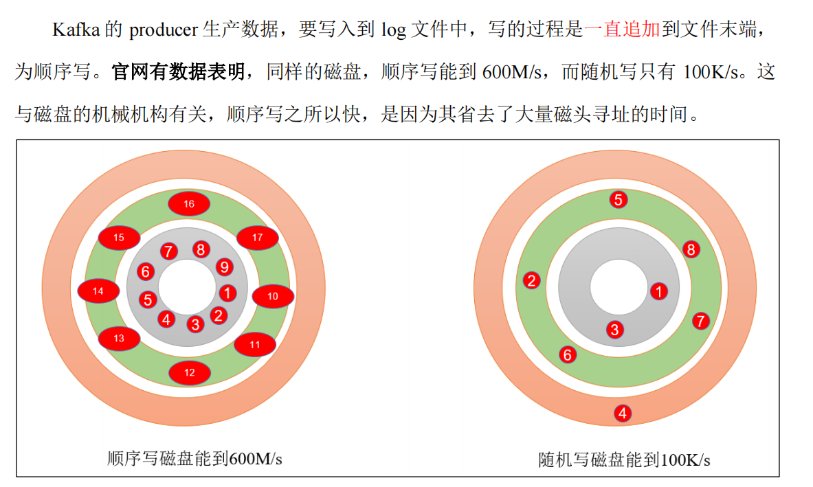


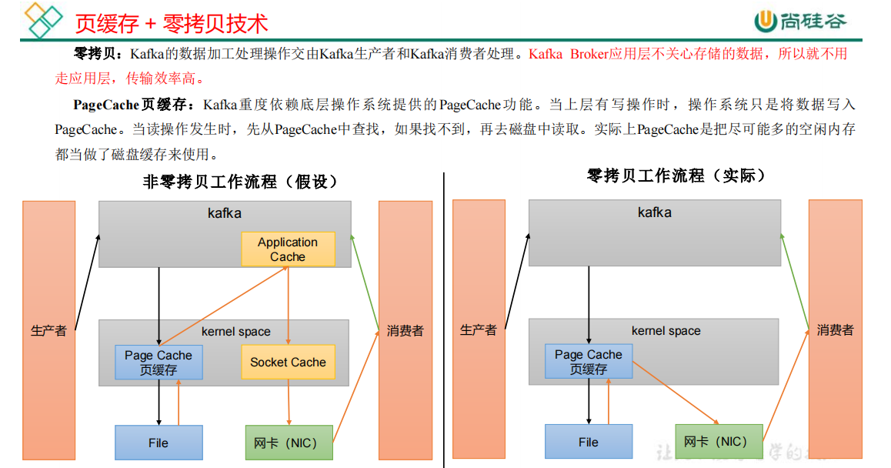


# 5.消费者

## 消费方式

消息队列有两种消费方式

1. pull 拉 模式
    1. kafka采用这种方式， 消费者主动 拉 数据消费， 因为broker的消息发送速率很难适应所有消费者的消费速率
    2. 缺点，如果kafka没有数据，那么消费者可能会陷入循环，一直返回空数据
2. push 推 模式


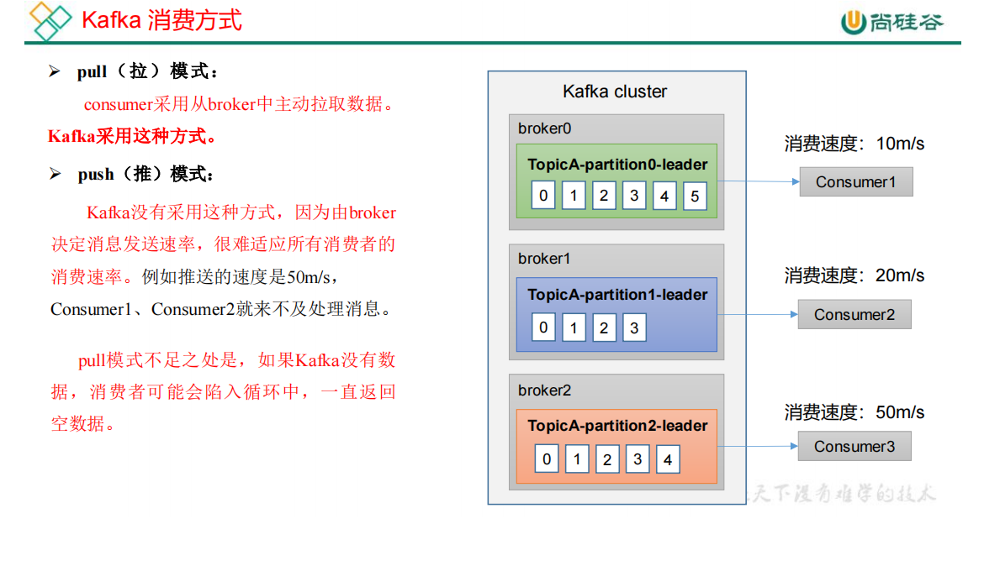


## 消费流程

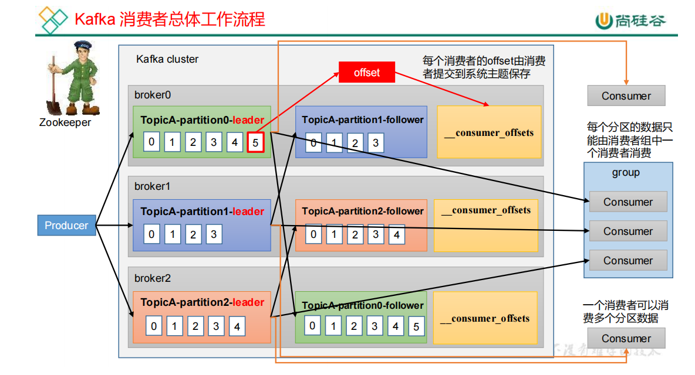

注意： 消费组中，一个分区只能有一个消费者


## 消费者组

Consumer Group（CG）：消费者组，由多个consumer组成。形成一个消费者组的条件，是所有消费者的groupid相同。

• 消费者组内每个消费者负责消费不同分区的数据，一个分区只能由一个组内消费者消费。

• 消费者组之间互不影响。所有的消费者都属于某个消费者组，即消费者组是逻辑上的一个订阅者。


消费组之前互不影响

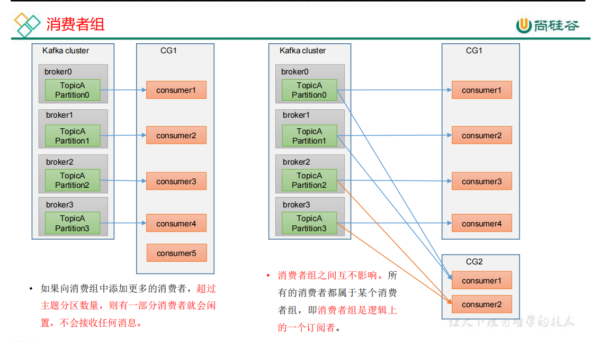


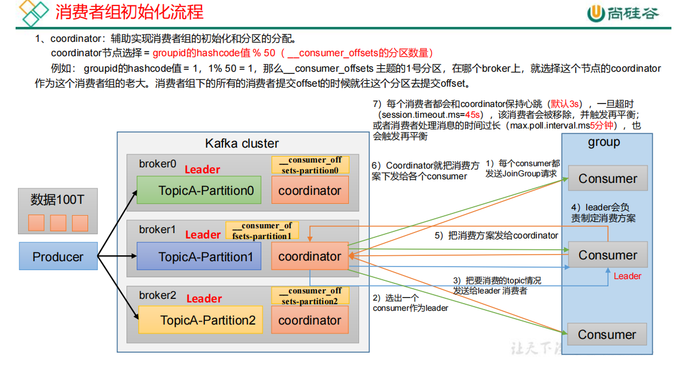


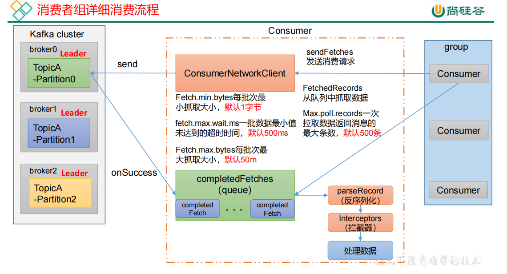

反序列化->拦截器


## 消费者API


**注意：**在消费者 API 代码中必须配置消费者组 id。

命令行启动消费者不填写消费者组id  是因为命令行会自动填写随机的消费者组 id。


## 生产经验：分区的分配以及再平衡


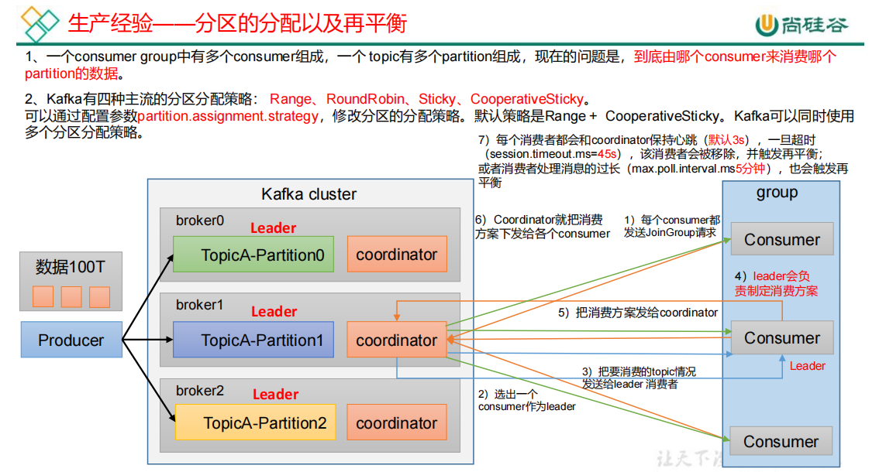

partition.assignment.strategy 


### Range

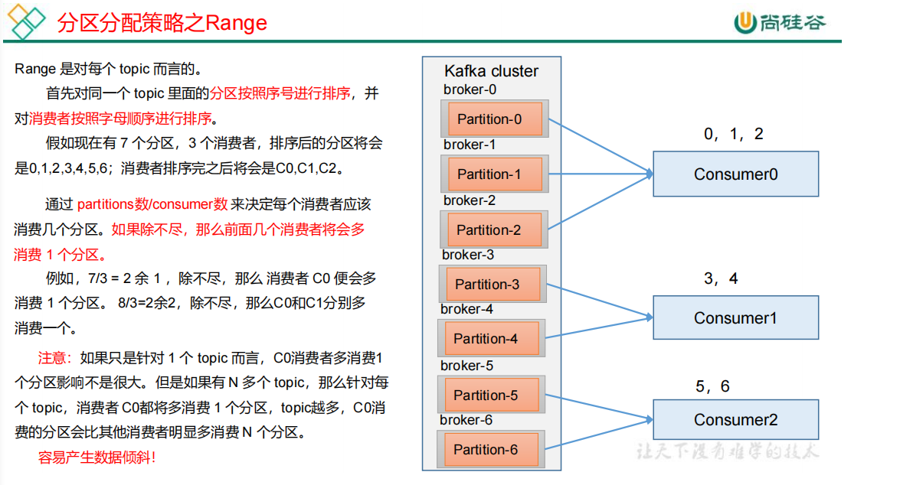


### RoundRobin

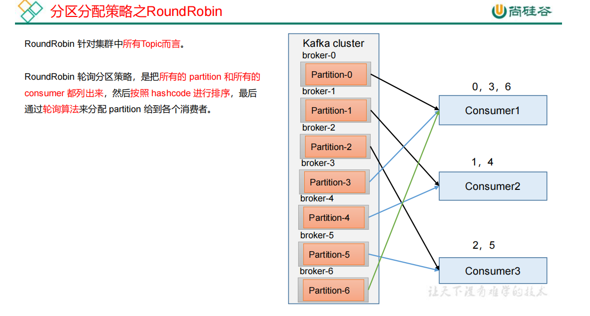


### Sticky

**粘性分区定义：**可以理解为分配的结果带有“粘性的”。即在执行一次新的分配之前，考虑上一次分配的结果，尽量少的调整分配的变动，可以节省大量的开销。


## offset位移
### offset的默认维护位置

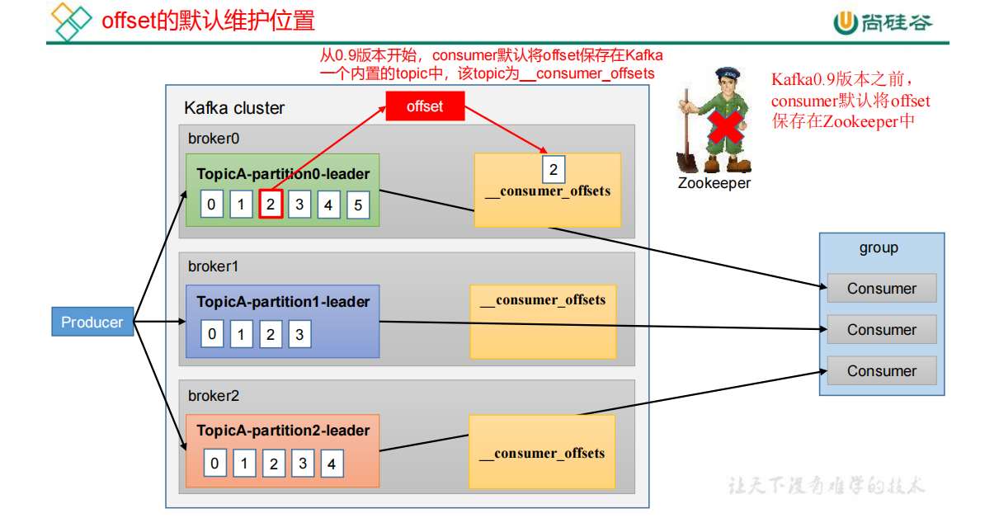

__consumer_offsets 主题里面采用 key 和 value 的方式存储数据。key 是 group.id+topic+分区号，value 就是当前 offset 的值。每隔一段时间，kafka 内部会对这个 topic 进行compact，也就是每个 group.id+topic+分区号就保留最新数据。


（0）思想：__consumer_offsets 为 Kafka 中的 topic，那就可以通过消费者进行消费。

（1）在配置文件 config/consumer.properties 中添加配置 exclude.internal.topics=false，

默认是 true，表示不能消费系统主题。为了查看该系统主题数据，所以该参数修改为 false。

（2）查看消费者消费主题__consumer_offsets。

```shell
bin/kafka-console-consumer.sh --topic __consumer_offsets --bootstrap-server hadoop102:9092 --
consumer.config config/consumer.properties --formatter "kafka.coordinator.group.GroupMetadataManager\$OffsetsMessageFormatter" --from-beginning
```


### **自动提交** **offset**


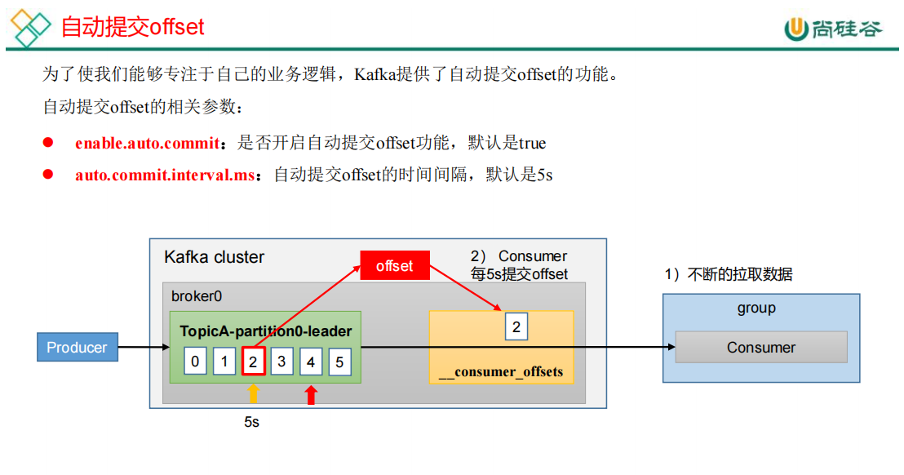

为了使我们能够专注于自己的业务逻辑，Kafka提供了自动提交offset的功能。
自动提交offset的相关参数：

- enable.auto.commit：是否开启自动提交offset功能，默认是true
- auto.commit.interval.ms：自动提交offset的时间间隔，默认是5s


### 手动提交offset

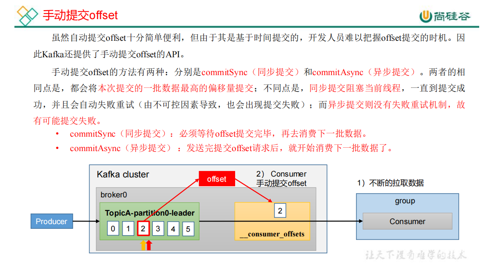


### **指定** **Offset** 消费

auto.offset.reset = earliest | latest | none 默认是 latest。

当 Kafka 中没有初始偏移量（消费者组第一次消费）或服务器上不再存在当前偏移量时（例如该数据已被删除），该怎么办？

（1）earliest：自动将偏移量重置为最早的偏移量，--from-beginning。

（2）latest（默认值）：自动将偏移量重置为最新偏移量。

（3）none：如果未找到消费者组的先前偏移量，则向消费者抛出异常。


```java
Set<TopicPartition> assignment= new HashSet<>();
while (assignment.size() == 0) {
    kafkaConsumer.poll(Duration.ofSeconds(1));
    // 获取消费者分区分配信息（有了分区分配信息才能开始消费）
    assignment = kafkaConsumer.assignment();
}
// 遍历所有分区，并指定 offset 从 1700 的位置开始消费
for (TopicPartition tp: assignment) {
    kafkaConsumer.seek(tp, 1700);
}
```


### 指定时间消费

```java
Set<TopicPartition> assignment = new HashSet<>();
while (assignment.size() == 0) {
    kafkaConsumer.poll(Duration.ofSeconds(1));
    // 获取消费者分区分配信息（有了分区分配信息才能开始消费）
    assignment = kafkaConsumer.assignment();
}
HashMap<TopicPartition, Long> timestampToSearch = new
    HashMap<>();
// 封装集合存储，每个分区对应一天前的数据
for (TopicPartition topicPartition : assignment) {
    timestampToSearch.put(topicPartition,
                          System.currentTimeMillis() - 1 * 24 * 3600 * 1000);
}
// 获取从 1 天前开始消费的每个分区的 offset
Map<TopicPartition, OffsetAndTimestamp> offsets =
    kafkaConsumer.offsetsForTimes(timestampToSearch);
// 遍历每个分区，对每个分区设置消费时间。
for (TopicPartition topicPartition : assignment) {
    OffsetAndTimestamp offsetAndTimestamp =
        offsets.get(topicPartition);
    // 根据时间指定开始消费的位置
    if (offsetAndTimestamp != null) {
        kafkaConsumer.seek(topicPartition,
                           offsetAndTimestamp.offset());
    }
}
```


### 漏消费和重复消费

重复消费：已经消费了数据，但是 offset 没提交。
漏消费：先提交 offset 后消费，有可能会造成数据的漏消费。

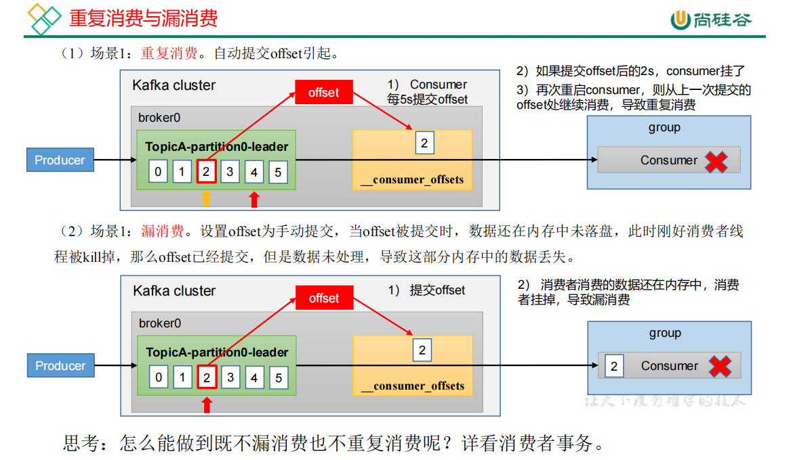


## 生产经验——消费者事务

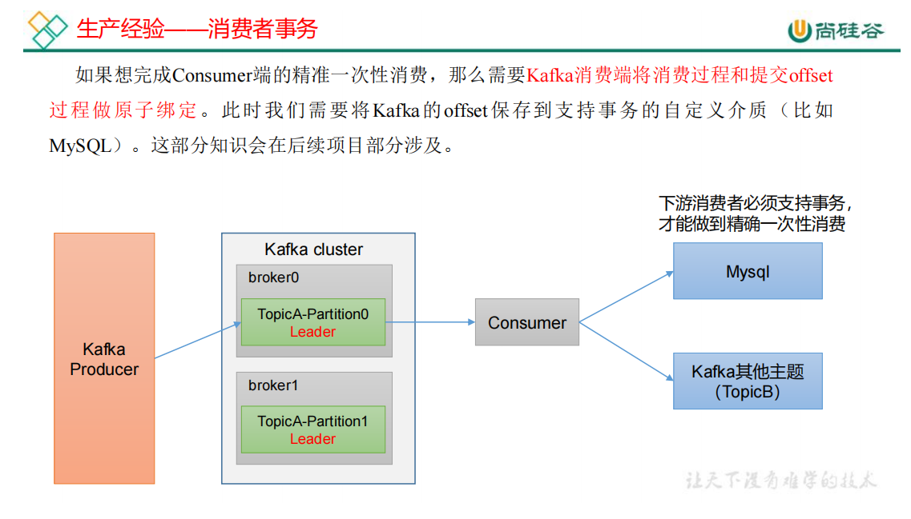


## 生产经验——数据积压（消费者如何提高吞吐量）


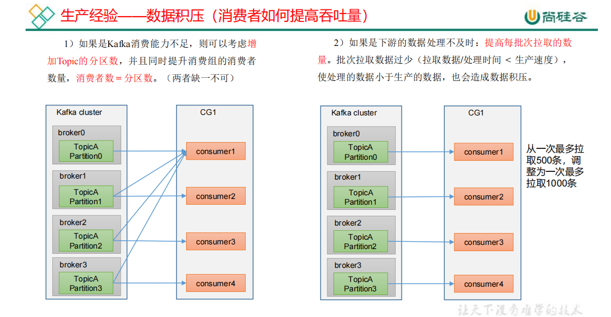

1. 分区分的多一点，然后一个分区对应一个消费线程
2. 提高每次拉取的数量


fetch.max.bytes 默认 Default: 52428800（50 m）。消费者获取服务器端一批消息最大的字节数。如果服务器端一批次的数据大于该值（50m）仍然可以拉取回来这批数据，因此，这不是一个绝对最大值。一批次的大小受 message.max.bytes （broker config）or max.message.bytes （topic config）影响。

max.poll.records 一次 poll 拉取数据返回消息的最大条数，默认是 500 条


# 6. 监控

Kafka-Eagle 框架可以监控 Kafka 集群的整体运行情况，在生产环境中经常使用。


# 7. Kafka-Kraft

2.8.0 之后就可以不用zookeeper了， 这样就可以解耦了， kafka修改不需要和zookeeper进行通信


使用Kafka-Kraft 架构， 这样做的好处有以下几个：

- Kafka 不再依赖外部框架，而是能够独立运行；
- controller 管理集群时，不再需要从 zookeeper 中先读取数据，集群性能上升；
- 由于不依赖 zookeeper，集群扩展时不再受到 zookeeper 读写能力限制；
- controller 不再动态选举，而是由配置文件规定。这样我们可以有针对性的加强
    controller 节点的配置，而不是像以前一样对随机 controller 节点的高负载束手无策。


# 生产调优总结


# 源码


