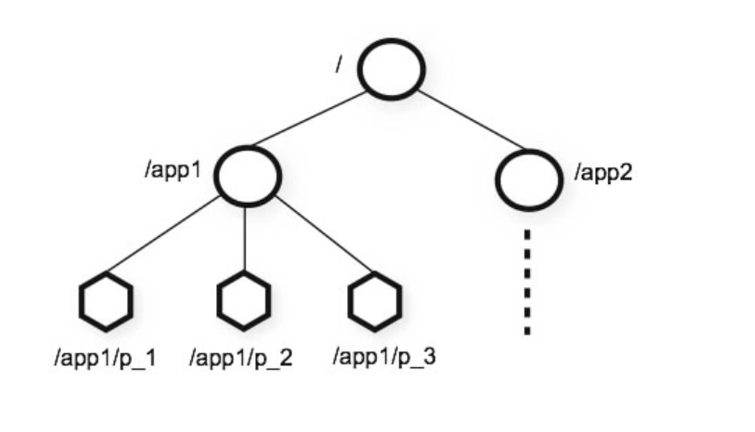
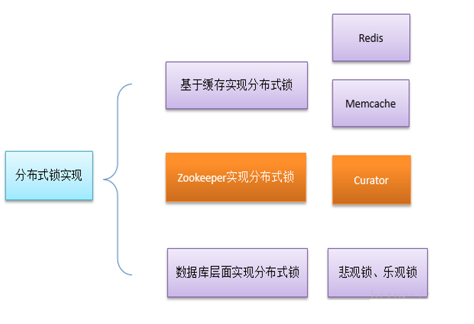
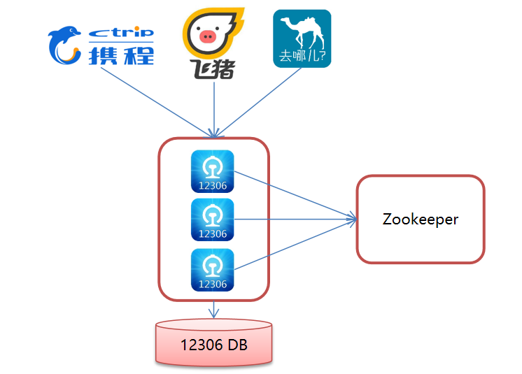
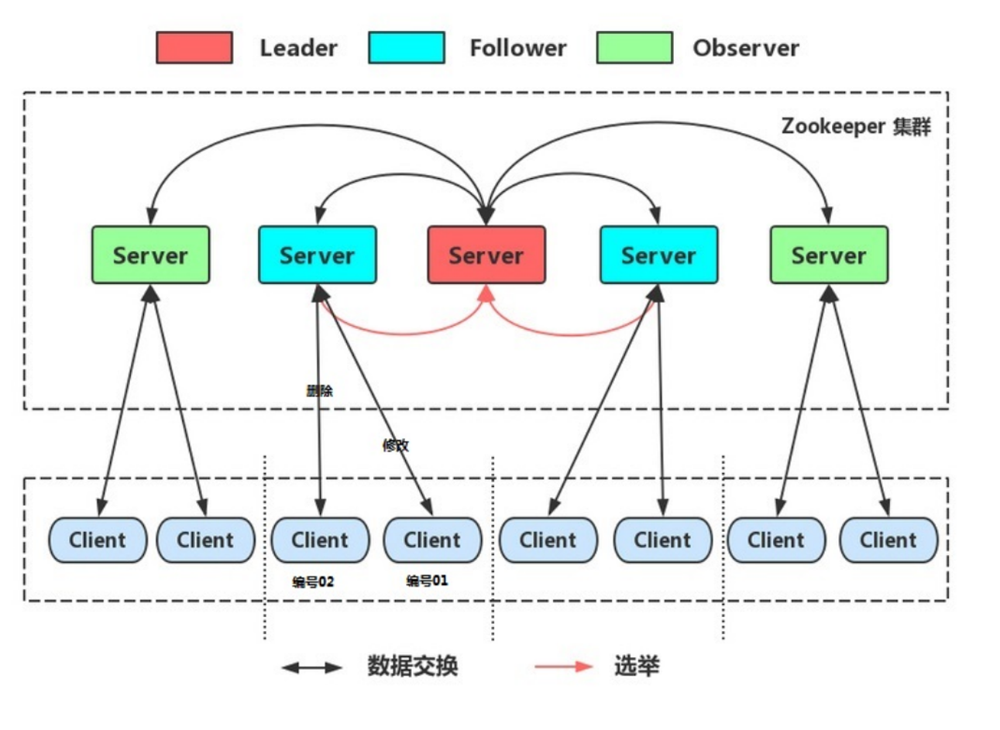

# 入门


## 概念

zookeeper 是apache hadoop项目下的一个子项目， 是一个树形目录服务

zookeeper 翻译就是动物园管理员，用来管理hadoop(大象) hive(密封) Pig(猪)的管理员， 简称zk

zookeeper 是一个分布式的， 开源的 分布式应用的 协调服务

zookeeper 主要提供3中功能：

	1. 配置管理（配置中心）
	2. 分布式锁
	3. 集群管理（注册中心）
	  	1. 存储地址
	  	2. 远程调用RPC





# 安装

略


# 命令操作

## 数据模型

ZooKeeper 是一个树形目录服务,其数据模型和Unix的文件系统目录树很类似，拥有一个层次化结构。
这里面的每一个节点都被称为： ZNode，每个节点上都会保存自己的数据和节点信息。 
节点可以拥有子节点，同时也允许少量（1MB）数据存储在该节点之下。
节点可以分为四大类：

- PERSISTENT 持久化节点 
- EPHEMERAL 临时节点 ：-e
- PERSISTENT_SEQUENTIAL 持久化顺序节点 ：-s  
- EPHEMERAL_SEQUENTIAL 临时顺序节点  ：-es


## 服务器命令

```
启动 ZooKeeper 服务: ./zkServer.sh start
查看 ZooKeeper 服务状态: ./zkServer.sh status
停止 ZooKeeper 服务: ./zkServer.sh stop 
重启 ZooKeeper 服务: ./zkServer.sh restart 
```


## 客户端命令

```
连接ZooKeeper服务端  /zkCli.sh -server ip:port

断开连接 quit

查看命令帮助 help

显示指定目录下节点  ls 目录

设置节点值  set /节点path value

删除单个节点  delete /节点path

删除带有子节点的节点deleteall/节点path

创建节点 create /节点path value

获取节点值 get /节点path

创建临时节点 create -e /节点path value
创建顺序节点 create -s /节点path value
查询节点详细信息 ls –s /节点path

czxid：节点被创建的事务ID 
ctime: 创建时间 
mzxid: 最后一次被更新的事务ID 
mtime: 修改时间 
pzxid：子节点列表最后一次被更新的事务ID
cversion：子节点的版本号 
dataversion：数据版本号 
aclversion：权限版本号 
ephemeralOwner：用于临时节点，代表临时节点的事务ID，如果为持久节点则为0 
dataLength：节点存储的数据的长度 
numChildren：当前节点的子节点个数 

```


# JavaAPI操作

## curator 介绍

curator是Apache ZooKeeper 是java客户端

常见的API有：

​	原生Java API

​	ZkClient

​	curator

curator目的是简化zookeeper客户端的使用


>  依赖性， curator 4.0 对 zookeeper 3.5.x有强依赖


## curator 常用API操作

常用操作

- 建立连接/添加/删除/修改/查询 节点 (CRUD)
- Watch事件监听
- 分布式锁的实现


### CRUD

```java
import org.apache.curator.RetryPolicy;
import org.apache.curator.framework.CuratorFramework;
import org.apache.curator.framework.CuratorFrameworkFactory;
import org.apache.curator.framework.api.BackgroundCallback;
import org.apache.curator.framework.api.CuratorEvent;
import org.apache.curator.retry.ExponentialBackoffRetry;
import org.apache.zookeeper.CreateMode;
import org.apache.zookeeper.data.Stat;
import org.junit.After;
import org.junit.Before;
import org.junit.Test;

import java.util.List;

/**
 * @author hewenji
 * @Date 2023/5/26 9:48
 */
public class CuratorTest {

    private CuratorFramework client;

    @Before
    public void testConnect() {
        // 创建。 第一种方式
        /**
         * Create a new client
         *
         * @param connectString       list of servers to connect to // 连接字符串， zk server的地址和端口， 多个用逗号隔开
         * @param sessionTimeoutMs    session timeout  // 会话超时时间。 单位ms
         * @param connectionTimeoutMs connection timeout  // 连接超时时间， 单位ms
         * @param retryPolicy         retry policy to use  // 尝试策略， 看源码
         * @return client
         */
        RetryPolicy retryPolicy = new ExponentialBackoffRetry(3 * 1000, 10); // 有间隔时间的重试次数
        CuratorFramework client1 = CuratorFrameworkFactory.newClient("192.168.0.111:2181", retryPolicy);
        client1.start();


        // 创建。 第二种方式
        client = CuratorFrameworkFactory.builder()
            .connectString("192.168.0.111:2181")
            .sessionTimeoutMs(60 * 1000)
            .connectionTimeoutMs(15 * 1000)
            .retryPolicy(retryPolicy)
            .namespace("hwj") // 名称空间， 这个是根目录， 默认加/hwj前缀
            .build();
        client.start();
    }

    @After
    public void tearClose() throws Exception {
        if (client != null) {
            client.close();
        }
    }

    /**
     * 创建节点，四种， 持久， 临时， 顺序， 不顺序
     * 1. 基本创建
     * 2. 创建节点， 带有数据
     * 3. 设置节点的类型
     * 4. 创建多级节点
     */
    @Test
    public void testCreate() throws Exception {

        // 1. 基本创建
        // 如果创建节点，没有指定数据，则默认将当前客户端的ip作为数据存储
        // String path = client.create().forPath("/app1");
        // System.out.println(path);

        // 2. 创建节点， 带有数据
        // String path = client.create().forPath("/app2", "haaha".getBytes());
        // System.out.println(path);


        // 3. 设置节点类型
        // 默认类型：持久化
        // String path = client.create().withMode(CreateMode.EPHEMERAL).forPath("/app3");  // 设置临时的，客户端会话结束就没了
        // System.out.println(path);

        // 4. 创建多级节点
        String path = client.create().creatingParentsIfNeeded().forPath("/app4/a1");
        System.out.println(path);
    }


    /**
     * 查询节点
     * 1. 查询数据 get
     * 2. 查询子节点 ls
     * 3. 查询子节点的状态信息 ls -s
     */
    @Test
    public void testQuery() throws Exception {
        // 1. 查询数据 get
        byte[] bytes = client.getData().forPath("/app1");
        System.out.println(new String(bytes));

        // 2. 查询子节点 ls
        List<String> list = client.getChildren().forPath("/app4");
        System.out.println(list);

        // 3. 查询子节点的状态信息 ls -s
        // 创建新的空的Stat对象
        Stat stat = new Stat();
        client.getData().storingStatIn(stat).forPath("/app1");
        System.out.println(stat);
    }

    /**
     * 修改数据
     * 1. 修改数据
     * 2. 根据版本去修改
     * @throws Exception
     */
    @Test
    public void testSet() throws Exception {
        // 1. 修改数据
        client.setData().forPath("/app1", "123".getBytes());

        // 2. 根据版本去修改
        Stat stat = new Stat();
        client.getData().storingStatIn(stat).forPath("/app1");
        int version = stat.getVersion();
        client.setData().withVersion(version).forPath("/app1", "it".getBytes()); // 如果版本不匹配会抛异常
    }


    /**
     * 删除节点
     * 1. 删除单个节点
     * 2. 删除带了子节点的节点
     * 3. 必须成功的删除 (保证删除) 主要防止网络问题
     * 4. 回调
     */
    @Test
    public void testDelete() throws Exception {
        // 1. 删除单个节点
        // client.delete().forPath("/app1");

        // 2. 删除带了子节点的节点
        // client.delete().deletingChildrenIfNeeded().forPath("/app4");

        // 3. 必须成功的删除 (保证删除) 主要防止网络问题, 本质就是重试
        // client.delete().guaranteed().forPath("/app2");

        // 4. 回调
        client.delete().guaranteed().inBackground(new BackgroundCallback() {
            @Override
            public void processResult(CuratorFramework client, CuratorEvent event) throws Exception {
                System.out.println("我被删除了~");
                System.out.println(event);
            }
        }).forPath("/app1");
    }

    @Test
    public void testWatch() {
        
    }
}

```


### Watch事件监听 


ZooKeeper 允许用户在指定节点上注册一些Watcher，并且在一些特定事件触发的时候，ZooKeeper 服务端会将事件通知到感兴趣的客户端上去，该机制是 ZooKeeper 实现**分布式协调服务**的重要特性。 (配置中心和注册中心都依赖这个)

ZooKeeper 中引入了Watcher机制来实现了**发布/订阅功能**，能够让多个订阅者同时监听某一个对象，当一个对象自身状态变化时，会通知所有订阅者。

ZooKeeper 原生支持通过注册Watcher来进行事件监听，但是其使用并不是特别方便需要开发人员自己反复注册Watcher，比较繁琐

Curator引入了 Cache 来实现对 ZooKeeper 服务端事件的监听。

ZooKeeper提供了三种Watcher：

- NodeCache : 只是监听某一个特定的节点
- PathChildrenCache : 监控一个节点的子节点. 
- TreeCache : 可以监控整个树上的所有节点，类似于PathChildrenCache和NodeCache的组合


```java
import org.apache.curator.RetryPolicy;
import org.apache.curator.framework.CuratorFramework;
import org.apache.curator.framework.CuratorFrameworkFactory;
import org.apache.curator.framework.recipes.cache.*;
import org.apache.curator.retry.ExponentialBackoffRetry;
import org.junit.After;
import org.junit.Before;
import org.junit.Test;

/**
 * @author hewenji
 * @Date 2023/5/26 11:38
 */
public class CuratorWatchTest {
    private CuratorFramework client;

    @Before
    public void testConnect() {
        RetryPolicy retryPolicy = new ExponentialBackoffRetry(3 * 1000, 10); // 有间隔时间的重试次数
        client = CuratorFrameworkFactory.builder()
            .connectString("192.168.0.111:2181")
            .sessionTimeoutMs(60 * 1000)
            .connectionTimeoutMs(15 * 1000)
            .retryPolicy(retryPolicy)
            .namespace("hwj") // 名称空间， 这个是根目录， 默认加/hwj前缀
            .build();
        client.start();
    }

    @After
    public void tearClose() throws Exception {
        if (client != null) {
            client.close();
        }
    }

    /**
     * 给NodeCache指定的一个节点注册监听器
     */
    @Test
    public void testNodeCache() throws Exception {
        // 1. 创建一个nodeCache对象
        NodeCache nodeCache = new NodeCache(client, "/app1", false);

        // 2. 注册监听
        nodeCache.getListenable().addListener(new NodeCacheListener() {
            @Override
            public void nodeChanged() throws Exception {
                System.out.println("节点变化了");
                // 获取修改节点后的数据
                byte[] data = nodeCache.getCurrentData().getData();
                System.out.println(new String(data));
            }
        });

        // 3. 开始监听, 如果buildInitial设置为true， 则开始监听时，加载节点的缓存数据
        nodeCache.start(true);

        // 测试用
        while (true) {

        }
    }

    /**
     * PathChildrenCache 监听某个节点的所有子节点们
     */
    @Test
    public void testPathChildrenCache() throws Exception {
        // 1.创建监听对象
        PathChildrenCache pathChildrenCache = new PathChildrenCache(client, "/app2", true);

        // 2.绑定监听器
        pathChildrenCache.getListenable().addListener(new PathChildrenCacheListener() {
            @Override
            public void childEvent(CuratorFramework curatorFramework, PathChildrenCacheEvent event) throws Exception {
                System.out.println("子节点变化了~");
                System.out.println(event);

                // 监听子节点的数据变更， 并且拿到变更后的数据
                PathChildrenCacheEvent.Type type = event.getType();
                if (type.equals(PathChildrenCacheEvent.Type.CHILD_UPDATED)) {
                    System.out.println("数据变了");
                    byte[] data = event.getData().getData();// 两层data
                    System.out.println(new String(data));
                }
            }
        });

        // 3. 开启
        pathChildrenCache.start();

        // 测试用
        while (true) {

        }
    }

    /**
     * 演示 TreeNodeCache: 监听某个节点自己和所有子节点们
     * @throws Exception
     */
    @Test
    public void testTreeCache() throws Exception {
        // 1. 创建监控对象
        TreeCache treeCache = new TreeCache(client, "/app2");
        // 2. 绑定监听器
        treeCache.getListenable().addListener(new TreeCacheListener() {
            @Override
            public void childEvent(CuratorFramework curatorFramework, TreeCacheEvent event) throws Exception {
                System.out.println("节点变化了");
                System.out.println(event);
            }
        });
        // 3. 开启
        treeCache.start();

        // 测试用
        while (true) {

        }
    }
}

```


## 分布式锁

在我们进行单机应用开发，涉及并发同步的时候，我们往往采用synchronized或者Lock的方式来解决多线程间的代码同步问题，这时多线程的运行都是在同一个JVM之下，没有任何问题。
但当我们的应用是分布式集群工作的情况下，属于多JVM下的工作环境，跨JVM之间已经无法通过多线程的锁解决同步问题。
那么就需要一种更加高级的锁机制，来处理种跨机器的进程之间的数据同步问题——这就是分布式锁。





数据库层面实现分布式锁其实和redis实现分布式锁差不多， 都是看Lock对象存不存在，不存在则认为没有锁


```java
import org.apache.curator.RetryPolicy;
import org.apache.curator.framework.CuratorFramework;
import org.apache.curator.framework.CuratorFrameworkFactory;
import org.apache.curator.framework.recipes.cache.*;
import org.apache.curator.retry.ExponentialBackoffRetry;
import org.junit.After;
import org.junit.Before;
import org.junit.Test;

public class LockTest {


    public static void main(String[] args) {
        Ticket12306 ticket12306 = new Ticket12306();

        //创建客户端
        Thread t1 = new Thread(ticket12306,"携程");
        Thread t2 = new Thread(ticket12306,"飞猪");

        t1.start();
        t2.start();
    }

}

```


```java
import org.apache.curator.RetryPolicy;
import org.apache.curator.framework.CuratorFramework;
import org.apache.curator.framework.CuratorFrameworkFactory;
import org.apache.curator.framework.recipes.locks.InterProcessMutex;
import org.apache.curator.retry.ExponentialBackoffRetry;

import java.util.concurrent.TimeUnit;

public class Ticket12306 implements Runnable{

    private int tickets = 10;//数据库的票数

    private InterProcessMutex lock ;


    public Ticket12306(){
        //重试策略
        RetryPolicy retryPolicy = new ExponentialBackoffRetry(3000, 10);
        //2.第二种方式
        //CuratorFrameworkFactory.builder();
        CuratorFramework client = CuratorFrameworkFactory.builder()
                .connectString("192.168.149.135:2181")
                .sessionTimeoutMs(60 * 1000)
                .connectionTimeoutMs(15 * 1000)
                .retryPolicy(retryPolicy)
                .build();

        //开启连接
        client.start();

        lock = new InterProcessMutex(client,"/lock");
    }

    @Override
    public void run() {

        while(true){
            //获取锁
            try {
                lock.acquire(3, TimeUnit.SECONDS);
                if(tickets > 0){

                    System.out.println(Thread.currentThread()+":"+tickets);
                    Thread.sleep(100);
                    tickets--;
                }
            } catch (Exception e) {
                e.printStackTrace();
            }finally {
                //释放锁
                try {
                    lock.release();
                } catch (Exception e) {
                    e.printStackTrace();
                }
            }
        }
    }
}
```


### zookeeper分布式锁原理 （重点）

核心思想： 同上， 当客户端要获取锁的时候，就创建节点，使用完锁就删除该节点

1. 客户端获取锁时，在lock节点下创建 **临时顺序** （create -es）节点lock(会自动编号)
    1. 临时是为了防止客户端突然宕机不释放锁的情况
    2. 顺序是为了让客户端知道自己是否获取到了节点是否最小
2. 然后获取lock下面的所有子节点，客户端获取到所有的子节点后，如果发现自己创建的子节点序号最小，那么则认为该客户端获取到了锁，使用完锁后，就将该节点删除。
3. 如果发现自己创建的节点并非lock所有子节点中最小的，说明自己没有获取到锁，此时客户端需要找比自己小的那个节点，同时对其注册时间监听器，监听删除事件。
4. 如果发现比自己小的那个节点被删除，则客户端的Watcher会收到相应通知，此时再次判断自己创建的节点是否是lock子节点中序号最小的，如果是则获取到了锁，如果不是则重复以上步骤继续获取到比自己小的一个节点并注册监听。


curator 实现分布式锁API, 5种方案

1. InterProcessSemaphoreMutex：分布式排它锁（非可重入锁）
2. InterProcessMutex：分布式可重入排它锁
3. InterProcessReadWriteLock：分布式读写锁
4. InterProcessMultiLock：将多个锁作为单个实体管理的容器
5. InterProcessSemaphoreV2：共享信号量


## 12306模拟售票案例





```java
import org.apache.curator.RetryPolicy;
import org.apache.curator.framework.CuratorFramework;
import org.apache.curator.framework.CuratorFrameworkFactory;
import org.apache.curator.framework.recipes.locks.InterProcessMutex;
import org.apache.curator.retry.ExponentialBackoffRetry;

import java.util.concurrent.TimeUnit;

public class Ticket12306 implements Runnable{

    private int tickets = 10;//数据库的票数

    private InterProcessMutex lock ;


    public Ticket12306(){
        //重试策略
        RetryPolicy retryPolicy = new ExponentialBackoffRetry(3000, 10);
        //2.第二种方式
        //CuratorFrameworkFactory.builder();
        CuratorFramework client = CuratorFrameworkFactory.builder()
                .connectString("192.168.149.135:2181")
                .sessionTimeoutMs(60 * 1000)
                .connectionTimeoutMs(15 * 1000)
                .retryPolicy(retryPolicy)
                .build();

        //开启连接
        client.start();

        lock = new InterProcessMutex(client,"/lock");
    }

    @Override
    public void run() {

        while(true){
            //获取锁
            try {
                lock.acquire(3, TimeUnit.SECONDS);
                if(tickets > 0){

                    System.out.println(Thread.currentThread()+":"+tickets);
                    Thread.sleep(100);
                    tickets--;
                }
            } catch (Exception e) {
                e.printStackTrace();
            }finally {
                //释放锁
                try {
                    lock.release();
                } catch (Exception e) {
                    e.printStackTrace();
                }
            }


        }

    }
}

```


```java
import org.apache.curator.RetryPolicy;
import org.apache.curator.framework.CuratorFramework;
import org.apache.curator.framework.CuratorFrameworkFactory;
import org.apache.curator.framework.recipes.cache.*;
import org.apache.curator.retry.ExponentialBackoffRetry;
import org.junit.After;
import org.junit.Before;
import org.junit.Test;

public class LockTest {


    public static void main(String[] args) {
        Ticket12306 ticket12306 = new Ticket12306();

        //创建客户端
        Thread t1 = new Thread(ticket12306,"携程");
        Thread t2 = new Thread(ticket12306,"飞猪");

        t1.start();
        t2.start();
    }

}
```


# 集群


## Leader选举

Serverid：服务器ID
  比如有三台服务器，编号分别是1,2,3。 编号越大在选择算法中的权重越大。

Zxid：数据ID
  服务器中存放的最大数据ID.值越大说明数据  越新，在选举算法中数据越新权重越大。

在Leader选举的过程中，如果某台ZooKeeper获得了超过半数的选票，则此ZooKeeper就可以成为Leader了。


## 集群角色


在ZooKeeper集群服中务中有三个角色：
Leader 领导者 ：          

1. 处理事务请求
2. 集群内部各服务器的调度者

Follower 跟随者 ：

1. 处理客户端非事务请求，转发事务请求给Leader服务器
2. 参与Leader选举投票

Observer 观察者：

1.  处理客户端非事务请求，转发事务请求给Leader服务器


