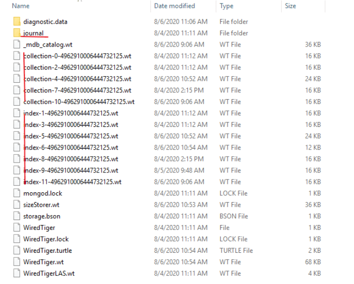

```shell
db.mycollection.find().limit(1).pretty()
db.mycollection.find({"123"}).pretty()
db.getCollection("mycollection").find().count()
db.getCollection("mycollection").find({"device.classify_id" : 70101}).count()
db.getCollection("mycollection").remove({ $and : [{"_id" : { $gte : 80000000 }}, {"_id" : { $lte : 90000000 }}] });
```


# 入门

MongoDB是面向文档的NoSQL数据库，用于大量数据存储。

可伸缩性– MongoDB环境具有很高的可伸缩性。

- ### 为什么使用MongoDB

    以下是一些为什么应该开始使用MongoDB的原因

    - **面向文档的**–由于MongoDB是NoSQL类型的数据库，它不是以关系类型的格式存储数据，而是将数据存储在文档中。这使得MongoDB非常灵活，可以适应实际的业务环境和需求。
    - **临时查询**-MongoDB支持按字段，范围查询和正则表达式搜索。可以查询返回文档中的特定字段。
    - **索引**-可以创建索引以提高MongoDB中的搜索性能。MongoDB文档中的任何字段都可以建立索引。
    - **复制**-MongoDB可以提供副本集的高可用性。副本集由两个或多个mongo数据库实例组成。每个副本集成员可以随时充当主副本或辅助副本的角色。主副本是与客户端交互并执行所有读/写操作的主服务器。辅助副本使用内置复制维护主数据的副本。当主副本发生故障时，副本集将自动切换到辅助副本，然后它将成为主服务器。
    - **负载平衡**-MongoDB使用分片的概念，通过在多个MongoDB实例之间拆分数据来水平扩展。MongoDB可以在多台服务器上运行，以平衡负载或复制数据，以便在硬件出现故障时保持系统正常运行。


### MongoDB常用术语

下面是MongoDB中使用的一些常用术语

- **_id** – 这是每个MongoDB文档中必填的字段。_id字段表示MongoDB文档中的唯一值。_id字段类似于文档的主键。如果创建的新文档中没有_id字段，MongoDB将自动创建该字段。
- **集合** – 这是MongoDB文档的分组。集合等效于在任何其他RDMS（例如Oracle或MS SQL）中创建的表。集合存在于单个数据库中。从介绍中可以看出，集合不强制执行任何结构。
- **游标** – 这是指向查询结果集的指针。客户可以遍历游标以检索结果。
- **数据库** – 这是像RDMS中那样的集合容器，其中是表的容器。每个数据库在文件系统上都有其自己的文件集。MongoDB服务器可以存储多个数据库。
- **文档** - MongoDB集合中的记录基本上称为文档。文档包含字段名称和值。
- **字段** - 文档中的名称/值对。一个文档具有零个或多个字段。字段类似于关系数据库中的列


### MongoDB Database Tools

[MongoDB Database Tools在新窗口打开](https://docs.mongodb.com/database-tools/)

- 二进制导入导出 
    - `mongodump` Creates a binary export of the contents of a mongod database.
    - `mongorestore` Restores data from a mongodump database dump into a mongod or mongos
    - `bsondump` Converts BSON dump files into JSON.
- 数据导入导出 
    - `mongoimport` Imports content from an Extended JSON, CSV, or TSV export file.
    - `mongoexport` Produces a JSON or CSV export of data stored in a mongod instance.
- 诊断工具 
    - `mongostat` Provides a quick overview of the status of a currently running mongod or mongos instance.
    - `mongotop` Provides an overview of the time a mongod instance spends reading and writing data.
- GridFS 工具 
    - `mongofiles` Supports manipulating files stored in your MongoDB instance in GridFS objects.


# CRUD

官方文档： https://www.mongodb.com/docs/v3.6/crud/

基本命令

```
show dbs;
use testdb;
```


## Insert

```shell
> db.inventory.insertOne(
...    { item: "canvas", qty: 100, tags: ["cotton"], size: { h: 28, w: 35.5, uom: "cm" } }
... )
{
        "acknowledged" : true,
        "insertedId" : ObjectId("5f1f8a9a099483199e74737c")
}
> db.inventory.insertMany([
...    { item: "journal", qty: 25, tags: ["blank", "red"], size: { h: 14, w: 21, uom: "cm" } },
...    { item: "mat", qty: 85, tags: ["gray"], size: { h: 27.9, w: 35.5, uom: "cm" } },
...    { item: "mousepad", qty: 25, tags: ["gel", "blue"], size: { h: 19, w: 22.85, uom: "cm" } }
... ])
{
        "acknowledged" : true,
        "insertedIds" : [
                ObjectId("5f1f8aa8099483199e74737d"),
                ObjectId("5f1f8aa8099483199e74737e"),
                ObjectId("5f1f8aa8099483199e74737f")
        ]
}
> db.inventory.find( {} )
{ "_id" : ObjectId("5f1f8a9a099483199e74737c"), "item" : "canvas", "qty" : 100, "tags" : [ "cotton" ], "size" : { "h" : 28, "w" : 35.5, "uom" : "cm" } }
{ "_id" : ObjectId("5f1f8aa8099483199e74737d"), "item" : "journal", "qty" : 25, "tags" : [ "blank", "red" ], "size" : { "h" : 14, "w" : 21, "uom" : "cm" } }
{ "_id" : ObjectId("5f1f8aa8099483199e74737e"), "item" : "mat", "qty" : 85, "tags" : [ "gray" ], "size" : { "h" : 27.9, "w" : 35.5, "uom" : "cm" } }
{ "_id" : ObjectId("5f1f8aa8099483199e74737f"), "item" : "mousepad", "qty" : 25, "tags" : [ "gel", "blue" ], "size" : { "h" : 19, "w" : 22.85, "uom" : "cm" } }
>
```


## Query

```shell
> db.inventory.find( {} )
{ "_id" : ObjectId("5f1f8a9a099483199e74737c"), "item" : "canvas", "qty" : 100, "tags" : [ "cotton" ], "size" : { "h" : 28, "w" : 35.5, "uom" : "cm" } }
{ "_id" : ObjectId("5f1f8aa8099483199e74737d"), "item" : "journal", "qty" : 25, "tags" : [ "blank", "red" ], "size" : { "h" : 14, "w" : 21, "uom" : "cm" } }
{ "_id" : ObjectId("5f1f8aa8099483199e74737e"), "item" : "mat", "qty" : 85, "tags" : [ "gray" ], "size" : { "h" : 27.9, "w" : 35.5, "uom" : "cm" } }
{ "_id" : ObjectId("5f1f8aa8099483199e74737f"), "item" : "mousepad", "qty" : 25, "tags" : [ "gel", "blue" ], "size" : { "h" : 19, "w" : 22.85, "uom" : "cm" } }
{ "_id" : ObjectId("5f1f94de4326f1d6a51d3a78"), "item" : "journal", "qty" : 25, "size" : { "h" : 14, "w" : 21, "uom" : "cm" }, "status" : "A" }
{ "_id" : ObjectId("5f1f94de4326f1d6a51d3a79"), "item" : "notebook", "qty" : 50, "size" : { "h" : 8.5, "w" : 11, "uom" : "in" }, "status" : "A" }
{ "_id" : ObjectId("5f1f94de4326f1d6a51d3a7a"), "item" : "paper", "qty" : 100, "size" : { "h" : 8.5, "w" : 11, "uom" : "in" }, "status" : "D" }
{ "_id" : ObjectId("5f1f94de4326f1d6a51d3a7b"), "item" : "planner", "qty" : 75, "size" : { "h" : 22.85, "w" : 30, "uom" : "cm" }, "status" : "D" }
{ "_id" : ObjectId("5f1f94de4326f1d6a51d3a7c"), "item" : "postcard", "qty" : 45, "size" : { "h" : 10, "w" : 15.25, "uom" : "cm" }, "status" : "A" }
> db.inventory.find( { status: "D" } )
{ "_id" : ObjectId("5f1f94de4326f1d6a51d3a7a"), "item" : "paper", "qty" : 100, "size" : { "h" : 8.5, "w" : 11, "uom" : "in" }, "status" : "D" }
{ "_id" : ObjectId("5f1f94de4326f1d6a51d3a7b"), "item" : "planner", "qty" : 75, "size" : { "h" : 22.85, "w" : 30, "uom" : "cm" }, "status" : "D" }
> db.inventory.find( { status: { $in: [ "A", "D" ] } } )
{ "_id" : ObjectId("5f1f94de4326f1d6a51d3a78"), "item" : "journal", "qty" : 25, "size" : { "h" : 14, "w" : 21, "uom" : "cm" }, "status" : "A" }
{ "_id" : ObjectId("5f1f94de4326f1d6a51d3a79"), "item" : "notebook", "qty" : 50, "size" : { "h" : 8.5, "w" : 11, "uom" : "in" }, "status" : "A" }
{ "_id" : ObjectId("5f1f94de4326f1d6a51d3a7a"), "item" : "paper", "qty" : 100, "size" : { "h" : 8.5, "w" : 11, "uom" : "in" }, "status" : "D" }
{ "_id" : ObjectId("5f1f94de4326f1d6a51d3a7b"), "item" : "planner", "qty" : 75, "size" : { "h" : 22.85, "w" : 30, "uom" : "cm" }, "status" : "D" }
{ "_id" : ObjectId("5f1f94de4326f1d6a51d3a7c"), "item" : "postcard", "qty" : 45, "size" : { "h" : 10, "w" : 15.25, "uom" : "cm" }, "status" : "A" }
> db.inventory.find( { status: "A", qty: { $lt: 30 } } )
{ "_id" : ObjectId("5f1f94de4326f1d6a51d3a78"), "item" : "journal", "qty" : 25, "size" : { "h" : 14, "w" : 21, "uom" : "cm" }, "status" : "A" }
> db.inventory.find( { $or: [ { status: "A" }, { qty: { $lt: 30 } } ] } )
{ "_id" : ObjectId("5f1f8aa8099483199e74737d"), "item" : "journal", "qty" : 25, "tags" : [ "blank", "red" ], "size" : { "h" : 14, "w" : 21, "uom" : "cm" } }
{ "_id" : ObjectId("5f1f8aa8099483199e74737f"), "item" : "mousepad", "qty" : 25, "tags" : [ "gel", "blue" ], "size" : { "h" : 19, "w" : 22.85, "uom" : "cm" } }
{ "_id" : ObjectId("5f1f94de4326f1d6a51d3a78"), "item" : "journal", "qty" : 25, "size" : { "h" : 14, "w" : 21, "uom" : "cm" }, "status" : "A" }
{ "_id" : ObjectId("5f1f94de4326f1d6a51d3a79"), "item" : "notebook", "qty" : 50, "size" : { "h" : 8.5, "w" : 11, "uom" : "in" }, "status" : "A" }
{ "_id" : ObjectId("5f1f94de4326f1d6a51d3a7c"), "item" : "postcard", "qty" : 45, "size" : { "h" : 10, "w" : 15.25, "uom" : "cm" }, "status" : "A" }
> db.inventory.find( {
...      status: "A",
...      $or: [ { qty: { $lt: 30 } }, { item: /^p/ } ]
... } )
{ "_id" : ObjectId("5f1f94de4326f1d6a51d3a78"), "item" : "journal", "qty" : 25, "size" : { "h" : 14, "w" : 21, "uom" : "cm" }, "status" : "A" }
{ "_id" : ObjectId("5f1f94de4326f1d6a51d3a7c"), "item" : "postcard", "qty" : 45, "size" : { "h" : 10, "w" : 15.25, "uom" : "cm" }, "status" : "A" }
>
```


## Update

```
db.inventory.insertMany( [
...    { item: "canvas", qty: 100, size: { h: 28, w: 35.5, uom: "cm" }, status: "A" },
...    { item: "journal", qty: 25, size: { h: 14, w: 21, uom: "cm" }, status: "A" },
...    { item: "mat", qty: 85, size: { h: 27.9, w: 35.5, uom: "cm" }, status: "A" },
...    { item: "mousepad", qty: 25, size: { h: 19, w: 22.85, uom: "cm" }, status: "P" },
...    { item: "notebook", qty: 50, size: { h: 8.5, w: 11, uom: "in" }, status: "P" },
...    { item: "paper", qty: 100, size: { h: 8.5, w: 11, uom: "in" }, status: "D" },
...    { item: "planner", qty: 75, size: { h: 22.85, w: 30, uom: "cm" }, status: "D" },
...    { item: "postcard", qty: 45, size: { h: 10, w: 15.25, uom: "cm" }, status: "A" },
...    { item: "sketchbook", qty: 80, size: { h: 14, w: 21, uom: "cm" }, status: "A" },
...    { item: "sketch pad", qty: 95, size: { h: 22.85, w: 30.5, uom: "cm" }, status: "A" }
... ] );
{
        "acknowledged" : true,
        "insertedIds" : [
                ObjectId("5f1f96cf4326f1d6a51d3a7d"),
                ObjectId("5f1f96cf4326f1d6a51d3a7e"),
                ObjectId("5f1f96cf4326f1d6a51d3a7f"),
                ObjectId("5f1f96cf4326f1d6a51d3a80"),
                ObjectId("5f1f96cf4326f1d6a51d3a81"),
                ObjectId("5f1f96cf4326f1d6a51d3a82"),
                ObjectId("5f1f96cf4326f1d6a51d3a83"),
                ObjectId("5f1f96cf4326f1d6a51d3a84"),
                ObjectId("5f1f96cf4326f1d6a51d3a85"),
                ObjectId("5f1f96cf4326f1d6a51d3a86")
        ]
}
> db.inventory.updateOne(
...    { item: "paper" },
...    {
...      $set: { "size.uom": "cm", status: "P" },
...      $currentDate: { lastModified: true }
...    }
... )
{ "acknowledged" : true, "matchedCount" : 1, "modifiedCount" : 1 }
> db.inventory.find( {} )
{ "_id" : ObjectId("5f1f96cf4326f1d6a51d3a7d"), "item" : "canvas", "qty" : 100, "size" : { "h" : 28, "w" : 35.5, "uom" : "cm" }, "status" : "A" }
{ "_id" : ObjectId("5f1f96cf4326f1d6a51d3a7e"), "item" : "journal", "qty" : 25, "size" : { "h" : 14, "w" : 21, "uom" : "cm" }, "status" : "A" }
{ "_id" : ObjectId("5f1f96cf4326f1d6a51d3a7f"), "item" : "mat", "qty" : 85, "size" : { "h" : 27.9, "w" : 35.5, "uom" : "cm" }, "status" : "A" }
{ "_id" : ObjectId("5f1f96cf4326f1d6a51d3a80"), "item" : "mousepad", "qty" : 25, "size" : { "h" : 19, "w" : 22.85, "uom" : "cm" }, "status" : "P" }
{ "_id" : ObjectId("5f1f96cf4326f1d6a51d3a81"), "item" : "notebook", "qty" : 50, "size" : { "h" : 8.5, "w" : 11, "uom" : "in" }, "status" : "P" }
{ "_id" : ObjectId("5f1f96cf4326f1d6a51d3a82"), "item" : "paper", "qty" : 100, "size" : { "h" : 8.5, "w" : 11, "uom" : "cm" }, "status" : "P", "lastModified" : ISODate("2020-07-28T03:09:17.014Z") }
{ "_id" : ObjectId("5f1f96cf4326f1d6a51d3a83"), "item" : "planner", "qty" : 75, "size" : { "h" : 22.85, "w" : 30, "uom" : "cm" }, "status" : "D" }
{ "_id" : ObjectId("5f1f96cf4326f1d6a51d3a84"), "item" : "postcard", "qty" : 45, "size" : { "h" : 10, "w" : 15.25, "uom" : "cm" }, "status" : "A" }
{ "_id" : ObjectId("5f1f96cf4326f1d6a51d3a85"), "item" : "sketchbook", "qty" : 80, "size" : { "h" : 14, "w" : 21, "uom" : "cm" }, "status" : "A" }
{ "_id" : ObjectId("5f1f96cf4326f1d6a51d3a86"), "item" : "sketch pad", "qty" : 95, "size" : { "h" : 22.85, "w" : 30.5, "uom" : "cm" }, "status" : "A" }

```

updateMany

```
> db.inventory.updateMany(
...    { "qty": { $lt: 50 } },
...    {
...      $set: { "size.uom": "in", status: "P" },
...      $currentDate: { lastModified: true }
...    }
... )
{ "acknowledged" : true, "matchedCount" : 3, "modifiedCount" : 3 }
> db.inventory.find( {} )
{ "_id" : ObjectId("5f1f96cf4326f1d6a51d3a7d"), "item" : "canvas", "qty" : 100, "size" : { "h" : 28, "w" : 35.5, "uom" : "cm" }, "status" : "A" }
{ "_id" : ObjectId("5f1f96cf4326f1d6a51d3a7e"), "item" : "journal", "qty" : 25, "size" : { "h" : 14, "w" : 21, "uom" : "in" }, "status" : "P", "lastModified" : ISODate("2020-07-28T04:33:50.391Z") }
{ "_id" : ObjectId("5f1f96cf4326f1d6a51d3a7f"), "item" : "mat", "qty" : 85, "size" : { "h" : 27.9, "w" : 35.5, "uom" : "cm" }, "status" : "A" }
{ "_id" : ObjectId("5f1f96cf4326f1d6a51d3a80"), "item" : "mousepad", "qty" : 25, "size" : { "h" : 19, "w" : 22.85, "uom" : "in" }, "status" : "P", "lastModified" : ISODate("2020-07-28T04:33:50.391Z") }
{ "_id" : ObjectId("5f1f96cf4326f1d6a51d3a81"), "item" : "notebook", "qty" : 50, "size" : { "h" : 8.5, "w" : 11, "uom" : "in" }, "status" : "P" }
{ "_id" : ObjectId("5f1f96cf4326f1d6a51d3a82"), "item" : "paper", "qty" : 100, "size" : { "h" : 8.5, "w" : 11, "uom" : "cm" }, "status" : "P", "lastModified" : ISODate("2020-07-28T03:09:17.014Z") }
{ "_id" : ObjectId("5f1f96cf4326f1d6a51d3a83"), "item" : "planner", "qty" : 75, "size" : { "h" : 22.85, "w" : 30, "uom" : "cm" }, "status" : "D" }
{ "_id" : ObjectId("5f1f96cf4326f1d6a51d3a84"), "item" : "postcard", "qty" : 45, "size" : { "h" : 10, "w" : 15.25, "uom" : "in" }, "status" : "P", "lastModified" : ISODate("2020-07-28T04:33:50.392Z") }
{ "_id" : ObjectId("5f1f96cf4326f1d6a51d3a85"), "item" : "sketchbook", "qty" : 80, "size" : { "h" : 14, "w" : 21, "uom" : "cm" }, "status" : "A" }
{ "_id" : ObjectId("5f1f96cf4326f1d6a51d3a86"), "item" : "sketch pad", "qty" : 95, "size" : { "h" : 22.85, "w" : 30.5, "uom" : "cm" }, "status" : "A" }
>
```

replace one

```
> db.inventory.replaceOne(
...    { item: "paper" },
...    { item: "paper", instock: [ { warehouse: "A", qty: 60 }, { warehouse: "B", qty: 40 } ] }
... )
{ "acknowledged" : true, "matchedCount" : 1, "modifiedCount" : 1 }
> db.inventory.find( {} )
{ "_id" : ObjectId("5f1f96cf4326f1d6a51d3a7d"), "item" : "canvas", "qty" : 100, "size" : { "h" : 28, "w" : 35.5, "uom" : "cm" }, "status" : "A" }
{ "_id" : ObjectId("5f1f96cf4326f1d6a51d3a7e"), "item" : "journal", "qty" : 25, "size" : { "h" : 14, "w" : 21, "uom" : "in" }, "status" : "P", "lastModified" : ISODate("2020-07-28T04:33:50.391Z") }
{ "_id" : ObjectId("5f1f96cf4326f1d6a51d3a7f"), "item" : "mat", "qty" : 85, "size" : { "h" : 27.9, "w" : 35.5, "uom" : "cm" }, "status" : "A" }
{ "_id" : ObjectId("5f1f96cf4326f1d6a51d3a80"), "item" : "mousepad", "qty" : 25, "size" : { "h" : 19, "w" : 22.85, "uom" : "in" }, "status" : "P", "lastModified" : ISODate("2020-07-28T04:33:50.391Z") }
{ "_id" : ObjectId("5f1f96cf4326f1d6a51d3a81"), "item" : "notebook", "qty" : 50, "size" : { "h" : 8.5, "w" : 11, "uom" : "in" }, "status" : "P" }
{ "_id" : ObjectId("5f1f96cf4326f1d6a51d3a82"), "item" : "paper", "instock" : [ { "warehouse" : "A", "qty" : 60 }, { "warehouse" : "B", "qty" : 40 } ] }
{ "_id" : ObjectId("5f1f96cf4326f1d6a51d3a83"), "item" : "planner", "qty" : 75, "size" : { "h" : 22.85, "w" : 30, "uom" : "cm" }, "status" : "D" }
{ "_id" : ObjectId("5f1f96cf4326f1d6a51d3a84"), "item" : "postcard", "qty" : 45, "size" : { "h" : 10, "w" : 15.25, "uom" : "in" }, "status" : "P", "lastModified" : ISODate("2020-07-28T04:33:50.392Z") }
{ "_id" : ObjectId("5f1f96cf4326f1d6a51d3a85"), "item" : "sketchbook", "qty" : 80, "size" : { "h" : 14, "w" : 21, "uom" : "cm" }, "status" : "A" }
{ "_id" : ObjectId("5f1f96cf4326f1d6a51d3a86"), "item" : "sketch pad", "qty" : 95, "size" : { "h" : 22.85, "w" : 30.5, "uom" : "cm" }, "status" : "A" }
>
```


## Delete

```
> db.inventory.deleteMany({ status : "A" })
{ "acknowledged" : true, "deletedCount" : 4 }
> db.inventory.find( {} )
{ "_id" : ObjectId("5f1f96cf4326f1d6a51d3a7e"), "item" : "journal", "qty" : 25, "size" : { "h" : 14, "w" : 21, "uom" : "in" }, "status" : "P", "lastModified" : ISODate("2020-07-28T04:33:50.391Z") }
{ "_id" : ObjectId("5f1f96cf4326f1d6a51d3a80"), "item" : "mousepad", "qty" : 25, "size" : { "h" : 19, "w" : 22.85, "uom" : "in" }, "status" : "P", "lastModified" : ISODate("2020-07-28T04:33:50.391Z") }
{ "_id" : ObjectId("5f1f96cf4326f1d6a51d3a81"), "item" : "notebook", "qty" : 50, "size" : { "h" : 8.5, "w" : 11, "uom" : "in" }, "status" : "P" }
{ "_id" : ObjectId("5f1f96cf4326f1d6a51d3a82"), "item" : "paper", "instock" : [ { "warehouse" : "A", "qty" : 60 }, { "warehouse" : "B", "qty" : 40 } ] }
{ "_id" : ObjectId("5f1f96cf4326f1d6a51d3a83"), "item" : "planner", "qty" : 75, "size" : { "h" : 22.85, "w" : 30, "uom" : "cm" }, "status" : "D" }
{ "_id" : ObjectId("5f1f96cf4326f1d6a51d3a84"), "item" : "postcard", "qty" : 45, "size" : { "h" : 10, "w" : 15.25, "uom" : "in" }, "status" : "P", "lastModified" : ISODate("2020-07-28T04:33:50.392Z") }
```


### BulkWrite

```
try {
   db.characters.bulkWrite(
      [
         { insertOne :
            {
               "document" :
               {
                  "_id" : 4, "char" : "Dithras", "class" : "barbarian", "lvl" : 4
               }
            }
         },
         { insertOne :
            {
               "document" :
               {
                  "_id" : 5, "char" : "Taeln", "class" : "fighter", "lvl" : 3
               }
            }
         },
         { updateOne :
            {
               "filter" : { "char" : "Eldon" },
               "update" : { $set : { "status" : "Critical Injury" } }
            }
         },
         { deleteOne :
            { "filter" : { "char" : "Brisbane"} }
         },
         { replaceOne :
            {
               "filter" : { "char" : "Meldane" },
               "replacement" : { "char" : "Tanys", "class" : "oracle", "lvl" : 4 }
            }
         }
      ]
   );
}
catch (e) {
   print(e);
}
```


# 聚合和索引

## 聚合

聚合使用很频繁， 参考文档 https://www.mongodb.com/docs/v3.6/reference/operator/aggregation-pipeline/


#### 常规使用

聚合类似于将SQL中的group by + order by + left join ... 等操作管道化

准备数据

```
> db.orders.insertMany( [
...     { _id: 1, cust_id: "abc1", ord_date: ISODate("2012-11-02T17:04:11.102Z"), status: "A", amount: 50 },
...     { _id: 2, cust_id: "xyz1", ord_date: ISODate("2013-10-01T17:04:11.102Z"), status: "A", amount: 100 },
...     { _id: 3, cust_id: "xyz1", ord_date: ISODate("2013-10-12T17:04:11.102Z"), status: "D", amount: 25 },
...     { _id: 4, cust_id: "xyz1", ord_date: ISODate("2013-10-11T17:04:11.102Z"), status: "D", amount: 125 },
...     { _id: 5, cust_id: "abc1", ord_date: ISODate("2013-11-12T17:04:11.102Z"), status: "A", amount: 25 }
... ] );
{ "acknowledged" : true, "insertedIds" : [ 1, 2, 3, 4, 5 ] }
> db.orders.find({})
{ "_id" : 1, "cust_id" : "abc1", "ord_date" : ISODate("2012-11-02T17:04:11.102Z"), "status" : "A", "amount" : 50 }
{ "_id" : 2, "cust_id" : "xyz1", "ord_date" : ISODate("2013-10-01T17:04:11.102Z"), "status" : "A", "amount" : 100 }
{ "_id" : 3, "cust_id" : "xyz1", "ord_date" : ISODate("2013-10-12T17:04:11.102Z"), "status" : "D", "amount" : 25 }
{ "_id" : 4, "cust_id" : "xyz1", "ord_date" : ISODate("2013-10-11T17:04:11.102Z"), "status" : "D", "amount" : 125 }
{ "_id" : 5, "cust_id" : "abc1", "ord_date" : ISODate("2013-11-12T17:04:11.102Z"), "status" : "A", "amount" : 25 }
>
```

聚合操作

```
> db.orders.aggregate([
...                      { $match: { status: "A" } },
...                      { $group: { _id: "$cust_id", total: { $sum: "$amount" } } },
...                      { $sort: { total: -1 } }
...                    ])
{ "_id" : "xyz1", "total" : 100 }
{ "_id" : "abc1", "total" : 75 }
```


#### Pipline操作


MongoDB的聚合管道（Pipline）将MongoDB文档在一个阶段（Stage）处理完毕后将结果传递给下一个阶段（Stage）处理。**阶段（Stage）操作是可以重复的**。

表达式：处理输入文档并输出。表达式是无状态的，只能用于计算当前聚合管道的文档，不能处理其它的文档。

这里我们介绍一下聚合框架中常用的几个Stages：

- `$project`：修改输入文档的结构。可以用来重命名、增加或删除域，也可以用于创建计算结果以及嵌套文档。
- `$match`：用于过滤数据，只输出符合条件的文档。$match使用MongoDB的标准查询操作。
- `$limit`：用来限制MongoDB聚合管道返回的文档数。
- `$skip`：在聚合管道中跳过指定数量的文档，并返回余下的文档。
- `$unwind`：将文档中的某一个数组类型字段拆分成多条，每条包含数组中的一个值。
- `$group`：将集合中的文档分组，可用于统计结果。
- `$sort`：将输入文档排序后输出。
- `$geoNear`：输出接近某一地理位置的有序文档。
- `$bucket`: 分组（分桶）计算。
- `$facet` : 多次分组计算。
- `$out`: 将结果集输出，必须是Pipline最后一个Stage


$project

```
> db.orders.aggregate(
...     { $project : {
...         _id : 0 , // 默认不显示_id
...         cust_id : 1 ,
...         status : 1
...     }});
{ "cust_id" : "abc1", "status" : "A" }
{ "cust_id" : "xyz1", "status" : "A" }
{ "cust_id" : "xyz1", "status" : "D" }
{ "cust_id" : "xyz1", "status" : "D" }
{ "cust_id" : "abc1", "status" : "A" }
>
```


$unwind

```
> db.inventory2.insertOne({ "_id" : 1, "item" : "ABC1", sizes: [ "S", "M", "L"] })
{ "acknowledged" : true, "insertedId" : 1 }
> db.inventory2.aggregate( [ { $unwind : "$sizes" } ] )
{ "_id" : 1, "item" : "ABC1", "sizes" : "S" }
{ "_id" : 1, "item" : "ABC1", "sizes" : "M" }
{ "_id" : 1, "item" : "ABC1", "sizes" : "L" }
```


#### $bucket

```
> db.artwork.insertMany([
... { "_id" : 1, "title" : "The Pillars of Society", "artist" : "Grosz", "year" : 1926,
...     "price" : NumberDecimal("199.99") },
... { "_id" : 2, "title" : "Melancholy III", "artist" : "Munch", "year" : 1902,
...     "price" : NumberDecimal("280.00") },
... { "_id" : 3, "title" : "Dancer", "artist" : "Miro", "year" : 1925,
...     "price" : NumberDecimal("76.04") },
... { "_id" : 4, "title" : "The Great Wave off Kanagawa", "artist" : "Hokusai",
...     "price" : NumberDecimal("167.30") },
... { "_id" : 5, "title" : "The Persistence of Memory", "artist" : "Dali", "year" : 1931,
...     "price" : NumberDecimal("483.00") },
... { "_id" : 6, "title" : "Composition VII", "artist" : "Kandinsky", "year" : 1913,
...     "price" : NumberDecimal("385.00") },
... { "_id" : 7, "title" : "The Scream", "artist" : "Munch", "year" : 1893 },
... { "_id" : 8, "title" : "Blue Flower", "artist" : "O'Keefe", "year" : 1918,
...     "price" : NumberDecimal("118.42") }
... ])
{
        "acknowledged" : true,
        "insertedIds" : [
                1,
                2,
                3,
                4,
                5,
                6,
                7,
                8
        ]
}
> db.artwork.find({})
{ "_id" : 1, "title" : "The Pillars of Society", "artist" : "Grosz", "year" : 1926, "price" : NumberDecimal("199.99") }
{ "_id" : 2, "title" : "Melancholy III", "artist" : "Munch", "year" : 1902, "price" : NumberDecimal("280.00") }
{ "_id" : 3, "title" : "Dancer", "artist" : "Miro", "year" : 1925, "price" : NumberDecimal("76.04") }
{ "_id" : 4, "title" : "The Great Wave off Kanagawa", "artist" : "Hokusai", "price" : NumberDecimal("167.30") }
{ "_id" : 5, "title" : "The Persistence of Memory", "artist" : "Dali", "year" : 1931, "price" : NumberDecimal("483.00") }
{ "_id" : 6, "title" : "Composition VII", "artist" : "Kandinsky", "year" : 1913, "price" : NumberDecimal("385.00") }
{ "_id" : 7, "title" : "The Scream", "artist" : "Munch", "year" : 1893 } // 注意这里没有price，聚合结果中为Others
{ "_id" : 8, "title" : "Blue Flower", "artist" : "O'Keefe", "year" : 1918, "price" : NumberDecimal("118.42") }
> db.artwork.aggregate( [
...   {
...     $bucket: {
...       groupBy: "$price",
...       boundaries: [ 0, 200, 400 ],
...       default: "Other",
...       output: {
...         "count": { $sum: 1 },
...         "titles" : { $push: "$title" }
...       }
...     }
...   }
... ] )
{ "_id" : 0, "count" : 4, "titles" : [ "The Pillars of Society", "Dancer", "The Great Wave off Kanagawa", "Blue Flower" ] }
{ "_id" : 200, "count" : 2, "titles" : [ "Melancholy III", "Composition VII" ] }
{ "_id" : "Other", "count" : 2, "titles" : [ "The Persistence of Memory", "The Scream" ] }
```


####  $bucket + $facet  非常有用！！！

略

 

#### MapReduce

略


## 索引


### 索引类型

1. 单一索引
2. 复合索引
3. 多键索引


### 索引操作

```shell
# 查看集合索引
db.col.getIndexes()

# 查看集合索引大小
db.col.totalIndexSize()

# 删除集合所有索引
db.col.dropIndexes()

# 删除集合指定索引
db.col.dropIndex("索引名称")
```


# 体系结构

MongoDB Database Tools

- 二进制导入导出 
    - `mongodump` Creates a binary export of the contents of a mongod database.
    - `mongorestore` Restores data from a mongodump database dump into a mongod or mongos
    - `bsondump` Converts BSON dump files into JSON.
- 数据导入导出 
    - `mongoimport` Imports content from an Extended JSON, CSV, or TSV export file.
    - `mongoexport` Produces a JSON or CSV export of data stored in a mongod instance.
- 诊断工具 
    - `mongostat` Provides a quick overview of the status of a currently running mongod or mongos instance.
    - `mongotop` Provides an overview of the time a mongod instance spends reading and writing data.
- GridFS 工具 
    - `mongofiles` Supports manipulating files stored in your MongoDB instance in GridFS objects.

除了上述没有列举到，还有：

- `mongoperf`: mongoDB自带工具，用于评估磁盘随机IO性能。


## WiredTiger为默认的存储引擎



`collection-*.wt` 存储collection的数据

`index-*.wt` 存储索引的数据

`WiredTiger` 存储基本配置信息

`WiredTiger.wt` 存储所有其它collection的元数据信息

`WiredTiger.lock` 存储进程ID，用于防止多个进程连接同一个Wiredtiger数据库

`WiredTiger.turtle` 存储WiredTiger.wt的元数据信息

`journal` 存储Write ahead log


# 原理和WiredTigger存储引擎

既支持BTree索引，也支持LSM Tree索引，支持行存储和列存储，实现ACID级别事务、支持大到4G的记录


## 存储引擎及常见数据结构

- **B-Tree**

像Oracle、SQL Server、DB2、MySQL (InnoDB)和PostgreSQL这些传统的关系数据库依赖的底层存储引擎是基于B-Tree开发的；

- **LSM Tree** （Log Structured Merge）

像Cassandra、Elasticsearch (Lucene)、Google Bigtable、Apache HBase、LevelDB和RocksDB这些当前比较流行的NoSQL数据库存储引擎是基于LSM开发的。

- **插件式兼容上述两种**

当然有些数据库采用了插件式的存储引擎架构，实现了Server层和存储引擎层的解耦，可以支持多种存储引擎，如MySQL既可以支持B-Tree结构的InnoDB存储引擎，还可以支持LSM结构的RocksDB存储引擎。


## WiredTiger数据文件在磁盘上的数据结构

对于WiredTiger存储引擎来说，集合所在的数据文件和相应的索引文件都是按B-Tree结构来组织的，**不同之处在于数据文件对应的B-Tree叶子结点上除了存储键名外（keys），还会存储真正的集合数据（values）**，所以数据文件的存储结构也可以认为是一种B+Tree，其整体结构如下图所示：


## WiredTiger内存上的基础数据结构

WiredTiger会按需将磁盘的数据**以page为单位加载到内存**，同时在内存会构造相应的B-Tree来存储这些数据。**为了高效的支撑CRUD等操作以及将内存里面发生变化的数据持久化到磁盘上**


## Page的生命周期

略


## checkpoint原理

Checkpoint主要有两个目的: 一是将内存里面发生修改的数据写到数据文件进行持久化保存，确保数据一致性；二是实现数据库在某个时刻意外发生故障，再次启动时，缩短数据库的恢复时间，WiredTiger存储引擎中的Checkpoint模块就是来实现这个功能的。


## 事务实现

略


## 缓存机制

略


# DB核心

## 索引实现

略


## 复制集

略


## 分片

**MongoDB的分片就是水平扩展的体现**。

略


## 备份和恢复


# 性能优化

## 查询聚合优化

## 慢查询分析


# 工具

## MongoDB Compass

## NoSQLBooster


## 二进制导入导出

mongodump

mongostore

bsondump


## 数据导入导出

mongoimport

mongoexport


## 诊断工具

mongostat


## GridFS工具

mongofiles


# 驱动

python: pymongo

java: mongo-java-driver-3.2.2.jar 

```
<dependency>
    <groupId>org.mongodb</groupId>
    <artifactId>mongo-java-driver</artifactId>
    <version>3.12.6</version>
</dependency>
```


