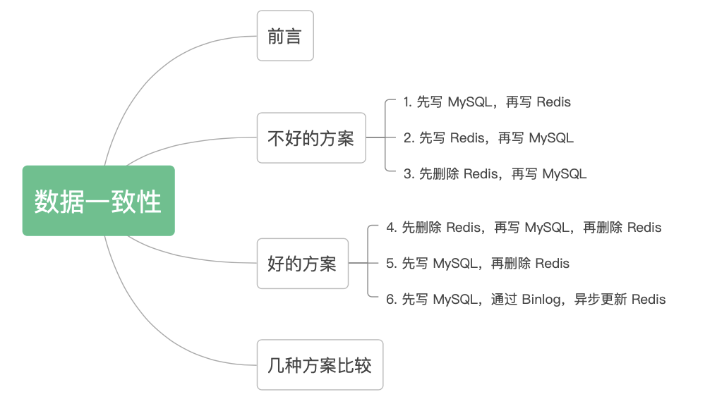

 

# MySQL体系结构

参考： https://www.bilibili.com/video/BV1BQ4y1q7yM/?spm_id_from=333.337.search-card.all.click&vd_source=6cd527c3a43bcb0943d3d64a7923b3bc


优化器会进行成本计算。会修改SQL语句


## 一条select的执行轨迹


# 索引


1. mysql的索引原理和数据结构能介绍下吗?
    1. 索引目录一样，有了索引就可以直接找到数据， 数据结构是B+树， B+树就是平衡的多路查找树，叶子节点都在同一层
2. B+树和B树的区别
    1. B+树只有在叶子节点存数据，B树所有节点都可以存数据
    2. B+树的叶子节点，从左往右有指针链接着。
    3. B+树M阶是，可以最多有M个关键字，而B树最多M-1个关键字
    4. B+树其实是B树的变种。
3. mysql的聚簇索引和非聚簇索引
    1. 和数据一起的所以是聚簇索引，一般是主键id
        1. 在InnoDB中，只存在一个聚集索引：
            - 若表存在主键，则主键索引就是聚集索引；
            - 若表不存在主键，则会把第一个非空的唯一索引作为聚集索引；
            - 否则，会隐式定义一个rowid作为聚集索引。
    2. 没有和数据放在一起的是非聚餐索引， 一般是普通索引。 叶子节点存放的是主键值
    3. innodb一定有聚簇索引，如果有其他普通索引，才会有非聚簇索引。
    4. myisam都是非聚簇索引，因为索引和数据一直都是分开放的。
4. 使用mysql索引有什么原则？
    1. 尽量少的回表
        1. 用非聚簇索引查询时，如果要查所有字段，还要再查一遍聚簇索引的B+树。这就是回表
    2. 索引覆盖
        1. 用非聚簇索引查询时， 如果只查非聚簇索引字段和主键, 就不用再查id所在的B+树，就不用回表，这叫索引覆盖
    3. 最左原则（类似写地址，从省开始写，写到区）
        1. 简述为在联合索引中，从最左边的字段开始匹配，若条件中字段在联合索引中符合从左到右的顺序则走索引，否则不走，可以简单理解为(a, b, c)的联合索引相当于创建了a索引、(a, b)索引和(a, b, c)索引）
        2. 举例：
            1. select * from table where name=? and age=?   符合最左
            2. select * from table where name=? 符合最左
            3. select * from table where age=? 不符合 
            4. select * from table where age=? and name=? 符合最左， 因为name和age调换顺序不影响，所以mysql优化器会优化
        3.  注意， 当表中的全部列都是索引列时，无论怎么查询都会用到索引，(原理是索引覆盖)，expain sql 语句，发现type是index! （走普通索引的叶子节点，走得更快！）
    4. 索引下推
        1. select * from table where name=? and age=?
            1. 在没有索引下推之前，执行的过程是，先根据name从存储引擎中拉取数据，然后根据age在server中过滤
            2. 有了索引下推之后，执行的过程是: 根据name.,age整体的从存储引擎中做数据检索，返回对应的记录，不再server层做任何操作
            3. 结果就是减少了回表的次数！
            4. 索引下推在**非主键索引**上的优化，可以有效减少回表的次数，大大提升了查询的效率。
        2. 参考文档： https://zhuanlan.zhihu.com/p/121084592
5. 不同的存储引擎是如果进行实际存储的？
    1. innodb存的是.idb文件， 此时idb是索引和数据存放在一起。
    2. myisam存的是.myd文件和.myi文件， myd是存数据，myi是存索引
6. mysql的组合索引的结构是什么样的？
    1. 也是B+树，他是非聚合索引，叶子节点只保存了组合索引列
7. mysql的索引如何进行优化？
    1. 减少回表
    2. 索引覆盖
    3. 最左原则


怎么知道自己有没有走索引？  用EXPLAIN关键字

```sql
-- 比如
EXPLAIN SELECT * FROM test WHERE b = 1;
```

慢查询日志？怎么看？


以下的参考文档： https://worktile.com/kb/p/24047

首先在mysql执行如下命令

```sql
CREATE TABLE `test` (  `a` int NOT NULL AUTO_INCREMENT,  `b` int DEFAULT NULL,  `c` int DEFAULT NULL,  `d` int DEFAULT NULL,  `e` int DEFAULT NULL,  PRIMARY KEY(`a`),  KEY `idx_abc` (`b`,`c`,`d`)) ENGINE=InnoDB DEFAULT CHARSET=utf8mb4 COLLATE=utf8mb4_0900_ai_ci;

INSERT INTO test(`a`, `b`, `c`, `d`, `e`) VALUES (1, 2, 3, 4, 5);
INSERT INTO test(`a`, `b`, `c`, `d`, `e`) VALUES (2, 2, 3, 4, 5);
INSERT INTO test(`a`, `b`, `c`, `d`, `e`) VALUES (3, 2, 3, 4, 5);
```

然后执行

```
EXPLAIN SELECT b, c, d FROM test WHERE d = 2;
```


为什么要使用联合索引？

- 减少开销。建一个联合索引(col1,col2,col3)，实际相当于建了(col1),(col1,col2),(col1,col2,col3)三个索引。每多一个索引，都会增加写操作的开销和磁盘空间的开销。对于大量数据的表，使用联合索引会大大的减少开销！

- 覆盖索引。对联合索引(col1,col2,col3)，如果有如下的sql: select col1,col2,col3 from test where col1=1 and col2=2。那么MySQL可以直接通过遍历索引取得数据，而无需回表，这减少了很多的随机io操作。减少io操作，特别的随机io其实是dba主要的优化策略。所以，在真正的实际应用中，覆盖索引是主要的提升性能的优化手段之一。

- 效率高。索引列越多，通过索引筛选出的数据越少。有1000W条数据的表，有如下sql:select from table where col1=1 and col2=2 and col3=3,假设假设每个条件可以筛选出10%的数据，如果只有单值索引，那么通过该索引能筛选出1000W10%=100w条数据，然后再回表从100w条数据中找到符合col2=2 and col3= 3的数据，然后再排序，再分页；如果是联合索引，通过索引筛选出1000w10% 10% *10%=1w，效率提升可想而知！


## 索引失效的情况

select * from t1 order by b,c,d --其中b,c,d是联合索引， 因为 select * ,所以每个索引都要回表，这个时候就不如直接全表扫描，然后排序 ， 所以这个时候索引就失效了

select b from t1 order by b,c,d --其中b,c,d是联合索引 ， 这种情况索引没有失效。


#  优化SQL

1. 根据慢日志来定位慢查询
2. 根据expalin等工具来分析sql， 
    - 看有没有走索引， 走的索引是不是最优
    - 减少字段的返回， 减少回表的操作
3. 修改sql或者尽量让sql走索引 


```SQL
set long_query_time=1;
set GLOBAL slow_query_log=ON;
show VARIABLES like '%query%';
```


## Explain

explain的列都是什么意思？

参考：https://www.bilibili.com/video/BV1EP411S7Uk/?spm_id_from=333.337.search-card.all.click&vd_source=6cd527c3a43bcb0943d3d64a7923b3bc

1. id列：
    1. id都相同时，从上往下扫描
    2. id都不同时，先扫描id大的
    3. id既有相同，也有不同时，比如有衍生表，先扫描id大的，然后相同的id从上往下执行
    4. id有为空的， 先扫描id大的，然后相同的id从上往下执行，最后执行union表（id为空）
2. table列:
    1. 表示用到了哪些表
3. select_type列：
    1. 表示查询语句执行的查询操作类型
    2. 值为：simple 表示简单的select， 不包含union和子查询
    3. 值为：primary 表示复杂查询中的最外层查询， 比如使用union和union all， id为1的记录select_type通常为primary
    4. 值为： subquery， select中出现的子查询（不在from语句中）
    5. 值为：dependent subquery select中出现的子查询, 而且依赖于外部表的字段
    6. 值为： derived , select中出现的子查询, 在from语句中 
        1. 需要关闭衍生表优化： set session optimizer_switch='derived_merge=off'
    7. 值为 union和 union all
4. type列
    1. 查询时所用的访问类型
    2. 效率从高到底分别为
        1. system
            1. system是const的特殊类型
        2. const
            1. 常量查询
        3. eq_ref
            1. 索引只有一条匹配记录 （唯一索引）
        4. ref 
            1. 索引可能有多条匹配记录（非唯一索引）
            2. 使用二级索引（普通索引） 也是ref
        5. fulltext
        6. ref_or_null
            1. 
        7. range
            1. .使用二级索引，并且范围查找，就会被标记为range 
        8. index
            1. index是覆盖索引
        9. ALL
5. possible_keys列
    1. 可能使用到某个索引或者多个索引。如果没有选择的索引，显示null
6. key列
    1. 表示查询中实际使用的索引, 如果没有使用索引，显示null
7. key_len列
    1. 索引的长度 
    2. id 是int类型4个字节，如果id可以为空则长度为5个字节
    3. varchar(n)类型，3\*n字节+2个可变字节, 比如varchar(50) 就是50*3+2=132， 如果可以为null，则再加1为133
    4. char(n) ： n个字节
    5. tinyint ；1个字节
    6. smallint： 2个字节
    7. bigint 8字节
    8. date 3字节
    9. timestamp 4字节
    10. datetime 8字节
    11. 字段为null是， 需要额外一个字节记录
8. ref列
    1. const 常量匹配
    2. 字段匹配
    3. func 函数匹配
9. rows列
    1. 全表扫描时，行数的估计量，值越小越好。
10. filtered列
    1. 表示符合查询条件的数据的百分比
11. extra列
    1. sql执行查询的一些额外信息
    2. Use Index 使用非主键索引就可以查询所需要的查询， 即覆盖索引
    3. use where 不使用索引查询数据
    4. use index condition 需要回表查询
    5. using temporary 使用临时表
    6. usring filesort 当前查询中包含order by操作，而且无法利用索引完成的排序操作，数据较少时从内存排序，数据较多时需要在磁盘中排序，需要优化成索引排序
    7. select table optimized away： 使用某些聚合函数（min,max）来访问某个索引值


## 实践经验

1. 应尽量避免在 where 子句中对字段进行 null 值判断，否则将导致引擎放弃使用索引而进行全表扫描，如：`select id from t where num is null`

2. 应尽量避免在 where 子句中使用 != 或 <> 操作符，否则将引擎放弃使用索引而进行全表扫描。

3. 应尽量避免在 where 子句中使用 or 来连接条件，如果一个字段有索引，一个字段没有索引，将导致引擎放弃使用索引而进行全表扫描，如`select id from t where num=10 or Name = 'admin'` ,可以改成 

    ```sql
    select id from t where num = 10
    union all
    select id from t where Name = 'admin'
    ```

4. in和not in也要慎用，否则会导致全表扫描，如`select id from t where num in(1,2,3)`
    对于连续的数值，能用 between 就不要用 in 了： select id from t where num between 1 and 3
    很多时候用 exists 代替 in 是一个好的选择：select num from a where num in(select num from b) 用select num from a where exists(select 1 from b where num=a.num) 替代

5. like 也将导致全表扫描

6. 应尽量避免在 where 子句中对字段进行表达式操作，这将导致引擎放弃使用索引而进行全表扫描。如：
    select id from t where num/2 = 100，应改为 select id from t where num = 100*2

7. 应尽量避免在where子句中对字段进行函数操作，这将导致引擎放弃使用索引而进行全表扫描。

    ```sql
    select id from t where substring(name,1,3) = ’abc’       -–name以abc开头的id
    select id from t where datediff(day,createdate,’2005-11-30′) = 0    -–‘2005-11-30’    --生成的id
    ```

8. 对于多张大数据量（这里几百条就算大了）的表JOIN，要先分页再JOIN，否则逻辑读会很高，性能很差。

9. .索引并不是越多越好，索引固然可以提高相应的 select 的效率，但同时也降低了 insert 及 update 的效率，因为 insert 或 update 时有可能会重建索引，所以怎样建索引需要慎重考虑，视具体情况而定。一个表的索引数最好不要超过6个，若太多则应考虑一些不常使用到的列上建的索引是否有 必要。

10. 尽量使用数字型字段，若只含数值信息的字段尽量不要设计为字符型，这会降低查询和连接的性能，并会增加存储开销。这是因为引擎在处理查询和连 接时会逐个比较字符串中每一个字符，而对于数字型而言只需要比较一次就够了。

11. 尽量避免使用游标，因为游标的效率较差，如果游标操作的数据超过1万行，那么就应该考虑改写。

12. 尽量避免大事务操作，提高系统并发能力。


# 事务和锁？

参考b站 20分钟彻底搞清MySQL的事务与锁

https://www.bilibili.com/video/BV1q7411e7t9/?spm_id_from=333.337.search-card.all.click&vd_source=6cd527c3a43bcb0943d3d64a7923b3bc

## 事务

什么是事务？ 事务就是具有ACID性质的一系列操作

ACID

原子性atomicity， 一系列的操作要成功一起成功， 要失败一起失败

一致性consitency， 操作前和操作后数据一致

隔离性isolation，事务之间不能互相干扰。

​	 隔离级别

1. 读未提交 read uncommitted
2. 读已提交 read committed
3. 可重复读 repeatable read， 默认的隔离级别，（innodb当前读可以避免幻读）
4. 序列化 Serializable 

持久性durability，事务提交了永久存储在磁盘上


事务靠什么保证？

参考：https://www.bilibili.com/video/BV1Ys4y1J7iY?p=17&vd_source=6cd527c3a43bcb0943d3d64a7923b3bc

A 有undolog保证

C 由其他3大性质保证

I 隔离性又MVCC保证

D 持久性由redolog保证，mysql更新时在内存和redolog记录操作，宕机恢复时从redolog恢复


数据库事务的隔离级别有4个，由低到高依次为Read uncommitted 、Read committed、Repeatable read 、Serializable ，这四个级别可以逐个解决脏读 、不可重复读 、幻读 这几类问题。

- 脏读： 读了其他事务未提交的数据导致的
- 不可重复读： 同一个事务（A）里的两次完全相同的select查询结果可能不一样，因为可能被另一个事务（B）修改了某些值，导致不可重复读
    - 利用MVCC机制来解决不可重复读的问题
- 幻读： 一次事务中前后**数据量**发生变化，用户产生不可预料的问题


不可重复度和幻读的区别：

- 指并发更新时，另一个事务前后查询相同的数据时数据不符合预期
- 幻读是指并发新增，删除这种会产生数量变化的操作时， 另一个事务前后查询相同数据时的不符合预期

```sql
begin; --开始事务
rollback; -- 回滚
commit; --提交

--有时候会自动提交，可以关闭自动提交
set autocommit = 0;

show variables like 'transction_isolation';

SET SESSION TRANSACTION ISOLATION LEVEL READ UNCOMMITTED; -- 设置读未提交
SET SESSION TRANSACTION ISOLATION LEVEL READ COMMITTED; -- 设置读已提交
SET SESSION TRANSACTION ISOLATION LEVEL REPEATABLE READ -- 设置重复度--默认
SET SESSION TRANSACTION ISOLATION LEVEL serializable ; -- 设序列化
```


悲观锁

```
-- 事务1
select count from book where id = 1 for update;
-- 事务2 ， 此时事务2会停住
 select count from book where id = 1 for update;
```

乐观锁

```
update book set count=96 where id = 1 and count = 97;  -- 加一个控制：  count = 97; 
```


## 锁

参考

https://www.bilibili.com/video/BV1zK4y1X7oG/?spm_id_from=333.337.search-card.all.click&vd_source=6cd527c3a43bcb0943d3d64a7923b3bc

按锁粒度分类

1. 行锁(InnoDB)
    1. 更新数据未使用索引时，行级锁会上升为表级锁
    2. 更新数据时使用索引，会使用行级锁
    3. seleft ... for update会使用行级锁
2. 表锁
3. 间隙锁
4. 页锁（BDB）


按操作上可以还可分为

1. 共享锁，也就是读锁，一个事务给某行数据加了读锁，其他事务也可以读，但是不能写
2. 排它锁， 也就是写锁， 一个事务给某行数据加了写锁，其他事务也不能读，也不是写


按实现上还可以分为

	1. 乐观锁： 并不会真正的去锁某行记录，而是通过一个版本号来实现的
	2. 悲观锁： 上面所有的行锁，表锁都是悲观锁


在事务的隔离级别实现中，就需要利用锁来解决幻读


乐观锁CAS（Compare And Swap）比较并替换，是线程并发运行时用到的一种技术


mysql layer层就是server层

元数据，换句话就是表结构。。


DDL和DML： 

- **DML**（data manipulation language）是对数据内容进行操作的语言，它的最小操作单位是行；
-  **DDL**（data definition language）是对数据对象和对象属性进行操作的语言，它的操作会改变表结构，表类型等等数据属性，但是不会改变数据内容。


其中，间隙锁，防止insert的操作


没用用索引加锁， 所有的行（记录）和间隙都会加锁，由于，InnoDB引擎的行锁机制是基于索引实现记录锁定的，所以，没有索引时会导致全表锁定


id是非唯一键， id=10的时候，首先弄好记录锁， 然后再加锁间隙


因为会把记录全锁了，间隙也全锁了，就变成了表锁


 


解决方案。用户A访问是同时锁住表A和表B，用完再同时释放


解决方案，使用乐观锁


# MVCC

参考

https://www.bilibili.com/video/BV1hL411479T/?spm_id_from=pageDriver&vd_source=6cd527c3a43bcb0943d3d64a7923b3bc


ReadView是一个数据结构，包含4个字段

1. m_ids:当前活跃的事务编号集合
2. min trxid:最小活跃事务编号
3. max trx id:预分配事务编号，当前最大事务编号+1
4. creator trx id:ReadView创建者的事务编号


生成快照读readview的时候，readview会记录活跃的事务id列表，并记录最小活跃事务id，和待分配的事务id

如果当前记录的事务id，在活跃id列表之外，且小于最小活跃的事务id， 则可以读该行数据。

如果当前记录的事务id，在活跃id列表之外，且大于待分配的事务id，则该行数据不可以读。

如果当前记录的事务id，在活跃id列表之内，则根据回滚指针去undolog找历史版本数据，如果历史版本的事务id小于read view里最小活跃事务id，则这条历史数据就是要读的数据。


读已提交级别，每次快照读都会生成readview， 而可重复读级别一直用第一次生成readview的数据

RR级别（可重复读级别） MVCC只能避免快照度的幻读，而当前读的幻读不能避免

连续多次快照读，ReadView会产生复用，没有幻读问题 特例:**当两次快照读之间存在当前读，ReadView会重新生成，导致产生幻读**

幻读案例：


参考 

https://www.bilibili.com/video/BV1f24y117Dw/?vd_source=6cd527c3a43bcb0943d3d64a7923b3bc

MVCC是多版本并发控制

什么是当前读，什么是快照读？

- MVCC机制实现了快照读，普通的select查询就是快照读，快照读的数据可能不是最新的数据，它主要是为了实现可重复度的隔离级别。
- 当前读读取最新的数据版本，当前读就是加了锁的增删改查语句， update,delete,insert,select ... lock in share mode select ... for update是当前读


MVCC有没有解决幻读的问题

1. 在快照读的情况下， InnoDB通过MVCC机制解决了幻读的问题

2. 在当前读的情况下，InnoDB无法通过MVCC解决幻读的现象，因为它每次读取的都是最新的数据


## 原理

参考：

https://www.bilibili.com/video/BV1864y1976i/?spm_id_from=333.999.top_right_bar_window_view_later.content.click&vd_source=6cd527c3a43bcb0943d3d64a7923b3bc

每行记录中有三个隐藏字段

- 隐藏的主键 DB_ROW_ID

- 事务id: DB_TRX_ID
- 回滚指针： DB_ROLL_PTR


undolog 存放着历史版本数据，具体快照读选什么数据？ 需要看读视图readView


read view 有三个全局属性

- trx_list: 用来维护read view生成时刻系统正活跃的事务id
- up_limit_id: 记录trx_list列表中事务id最小的id
- low_limit_id: read view生成时刻系统尚未分配的下一个事务id

read view可见性规则

​		Read View遵循的可见性算法主要是将要被修改的数据的最新记录中的DB_TRX_ID(当前事务id)取出来，与系统当前其他活跃事务的id去对比，如果DB_TRX_ID跟Read View的属性做了比较，不符合可见性，那么就通过DB_ROLL_PTR回滚指针去取出undolog中的DB_TRX D做比较，即遍历链表中的DB TRX ID，直到找到满足条件的DB_TRX_ID,这个DB TRX ID所在的旧记录就是当前事务能看到的最新老版本数据

具体的比较规则如下:
1、首先比较DB_TRX_ID < up_limit id,如果小于，则当前事务能看到DB_TRX_ID所在的记录，如果大于等于进入下一个判断
2、接下来判断DB_TRX_ID >= low_limit id,如果大于等于则代表DB_TRXID所在的记录在Read View生成后才出现的，那么对于当前事务肯定不可见，如果小于，则进入下一步判断
3、判断DB_TRX_ID是否在活跃事务中，如果在，则代表在Read View生成时刻，这个事务还是活跃状态，还没有commit，修改的数据，当前事务也是看不到，如果不在，则说明这个事务在Read View生成之前就已经开始commit，那么修改的结果是能够看见的。

​	

具体的比较规则如下:
1、首先比较DB_TRX_IDup_limit id,如果小于，则当前事务能看到DB_TRXID所在的记录，如果大于等于进入下一个判断
2、接下来判断DB_TRX_ID >= low_limit id,如果大于等于则代表DB_TRXID所在的记录在Read View生成后才出现的，那么对于当前事务肯定不可见，如果小于，则进入下一步判断
3、判断DB TRXID是否在活跃事务中，果在，则代表在Read View生成时刻，这个事务还是活跃状态，还没有commit，修改的数据，当前事务也是看不到，如果不在，则说明这个事务在Read View生成之前就已经开始commit，那么修改的结果是能够看见的。


RC、RR级别下的InnoDB快照读有什么不同？
因为Read View生成时机的不同，从而造成RC、RR级别下快照读的结果的不同
	1、在RR级别下的某个事务的对某条记录的第一次快照读会创建一个快照即Read View,将当前系统活跃的其他事务记录起来，此后在调用快照读的时候，还是使用的是同一个Read View,所以只要当前事务在其他事务提交更新之前使用过快照读，那么之后的快照读使用的都是同一个Read View,所以对之后的修改不可见
	2、在RR级别下，快照读生成Read View时，Read View会记录此时所有其他活动和事务的快照，这些事务的修改对于当前事务都是不可见的，而早于Read View创建的事务所做的修改均是可见
	3、在RC级别下，事务中，每次快照读都会新生成一个快照和Read View,这就是我们在R级别下的事务中可以看到别的事务提交的更新的原因。
**总结: 在RC隔离级别下，是每个快照读都会生成并获取最新的Read View,而在RR隔离级别下，则是同一个事务中的第一个快照读才会创建Read View，之后的快照读获取的都是同一个Read View.**


# 存储引擎

存储引擎就是与文件打交道的mysql的子系统

默认是Innodb

innodb ： 支持表锁， 支持行锁，支持事务，支持外键，支持崩溃后的安全恢复，不支持全文索引， 

myisam： 支持表锁，不支持行锁，不支持事务，不支持外键，支持全文索引，支持延迟更新索引，支持表压缩

还有NDB, MEMORY。 这里不做过多介绍


innodb 和myisam的数据存储结构不同

   innodb 在磁盘上有两个文件.frm表定义， .idb存储数据和索引， 需要的空间更多，综合性能更高

​	myisam  在磁盘上有三个文件.frm 表定义, .MYD存储数据, .MYI存储索引 ， 需要的空间更少


# 分表分库？

sql优化到了极限了。才考虑分库分表， 此时需要单表的数量特别大， 单库的数量特别大（500W）


分库：将原本存储于单个数据库上的数据拆分到多个数据库，
分表： 把原来存储在单张数据表的数据拆分到多张数据表中，实现数据切分，从而提升数据库操作性能。


分库分表的实现可以分为两种方式: 垂直切分和水平切分。

 

水平:将数据分散到多张表，涉及分区键

- 分库: 每个库结构一样，数据不一样，没有交集。库多了可以缓解io和cpu压力
- 分表:每个表结构一样，数据不一样，没有交集。表数量减少可以提高sql执行效率、减轻Cpu压力

垂直: 将字段拆分为多张表，需要一定的重构 （可能这个用的更多了）

- 分库: 每个库结构、数据都不一样，所有库的并集为全量数据
- 分表:每个表结构、数据不一样，至少有一列交集，用于关联数据，所有表的并集为全量数据


分表的id怎么确定唯一性。 

- 用分布式id算法， 比如雪花算法（**Twitter开源的由64位整数组成分布式ID** ） 参考： https://zhuanlan.zhihu.com/p/85837641
    - 用uuid性能很低，因为他是字符串，所以uuid不用
- 取模，比较low, 缺点就是以后再次分表分库会很麻烦
    - 也可以hash取模
- 按范围分片


## 分库分表需要解决哪些问题？

1. 主键唯一性
    1. 需要用分布式id
2. 分布式事务
    1. 怎么解决分布式事务问题？
3. sql路由
    1. sql分发到哪个节点执行？可以原封不动转发吗？
4. 结果归并
    1. 每个节点只包含一部分结果，如何归并？


## 什么时候分表分库


# MySQL的主从同步

主从复制是指将主数据库的DDL和 DML 操作通过二进制日志（binlog）传到从库服务器中，然后在从库上对这些日志重新执行(也叫重做》，从而使得从库和主库的数据保持同步。


#### MySQL主从复制？

主要涉及三个线程: binlog 线程、I/O 线程和 SQL 线程。

- **binlog 线程** : 负责将主服务器上的数据更改写入二进制日志中。
- **I/O 线程** : 负责从主服务器上读取二进制日志，并写入从服务器的中继日志中。
- **SQL 线程** : 负责读取中继日志并重放其中的 SQL 语句。

------

著作权归@pdai所有 原文链接：https://pdai.tech/md/interview/x-interview.html


# redolog undolog binlog

参考

https://juejin.cn/post/6987557227074846733

https://blog.csdn.net/lkforce/article/details/108540000


## 前言

我们知道一条 select 语句是如何执行的。如果是 update 语句呢，执行步骤和查询语句其实是一样的，在执行语句前要连接数据库，这是连接器的工作。如果查询缓存中存在这条 SQL 的结果集缓存，直接取出返回客户端，前面说过，表上有更新的时候，这个表相关的查询缓存都会失效，所以查询缓存不建议使用，在 MySQL 8.0 版本把查询缓存删除了。接下来，分析器、优化器、执行器分别做各自的工作，查询出结果集返回给客户端。

但 update 和 select 不一样的是，update还涉及两个重要的日志文件，就是 redo log 和 binlog

## redo log

反过来思考，如果不存在这两个日志，会出现什么问题？

update 操作其实是分为两步操作，先查询到对应的行记录，再根据条件进行更新操作。如果没有 redo log 的话，MySQL 每次的update操作都要更新磁盘文件，更新磁盘文件需要先在磁盘中找到对应的行记录，再更新，每一条 update 语句都要操作磁盘文件，整个过程的 I/O 成本，查找成本都很高。为了解决这个问题，InnoDB 引擎的设计者想到了一个办法，先将记录写到 redo log 中，并更新内存，这个时候更新就算完成了，操作内存比操作磁盘要快的多。同时，InnoDB 会在适当的时候，将 redo log 中的记录更新到磁盘文件中。这个更新往往是系统空闲时做。

每次更新操作都要往 redo log 中写入，如果 redo log 满了，空间不够用了怎么办？

InnoDB 的 redo log 文件是固定大小的，比如可以配置一组4个文件，每个文件大小是 1GB，那么 redo log 中可以记录 4GB 的操作，InnoDB 会从第一个文件开始写入，直到第四个文件写满了，又回到第一个文件开头循环写，如下图。


write pos是当前记录的位置，一边写一边后移，写到第3号文件末尾后就回到0号文件开头。checkpoint是当前要擦除的位置，也是往后推移并且循环的，擦除记录前要把记录更新到数据文件。

write pos和checkpoint之间的是 redo log上还空着的部分，可以用来记录新的操作。如果write pos追上checkpoint，表示 redo log 满了，这时候不能再执行新的更新，得停下来先擦掉一些记录，把checkpoint推进一下。

有了redo log，InnoDB就可以保证即使数据库发生异常重启，之前提交的记录都不会丢失，这个能力称为crash-safe。


redo log日志文件大小固定。

默认日志文件在mysql目录的data子目录下，ib_logfile1和ib_logfile2两个文件，大小相同，循环使用。

redo log是物理日志，记录数据页更新的内容。

redo log以块为单位存储，每块512字节，包括：

日志块头，12字节

日志块尾，8字节

日志主体，492字节

在redo log buffer和redo log文件中都是这样存储的。


redo log在内存中有一个缓存区Innodb_log_buffer，记录redo log时，先将日志写入内存的缓存区，再刷到磁盘中。

redo log不是随着事务提交才写入文件的，而是从事务开始就逐步写入文件了（即使事务还没提交）。


**宕机恢复用到了redo**


## binlog

刚刚说的 redo log 是执行引擎层的 log 文件，我们都知道，MySQL 整体来看，分为 Server 层和引擎层，而 binlog 是 Server 层面的 log 文件，也就是所有执行引擎都有 binlog

那为什么 InnoDB 有一份 log 文件，MySQL 有一份 log 文件呢？

因为以前的MySQL没有InnoDB引擎，MySQL5.5前使用的 MyISAM引擎，但是 MyISAM 没有 crash-safe 的能力，而 binlog 只能用于归档。InnoDB 是后来作为 MySQL 的引擎以插件形式引入的。既然只靠 binlog 无法实现 crash-safe 的能力，所以 InnoDB 使用另一套日志系统——redo log 来实现。

## update操作流程

```
update T set c=c+1 where ID=2;
```

1、执行器先通过引擎查询到 id = 2 这行数据，id 是主键，直接遍历主键索引树直接插到这行数据，如果这行数据所在的数据页在内存中，就直接返回结果给执行器，否则，需要先从磁盘读入内存，然后再返回。

2、执行器拿到引擎给的行数据，把 这个值+1，得到新的一行数据，再调用引擎接口写入这行数据。

3、引擎将这行数据更新到内存中，同时记录到 redo log 中，此时 redo log 处于 perpare 状态，此时就告知执行器已经更新完成了，随时可以提交事务。

4、执行器生成这个操作的binlog，并把binlog写入磁盘

5、执行器调用引擎的提交事务接口，引擎把刚刚写入的redo log改成提交（commit）状态，更新完成

如下图为 update 语句的执行流程，深色代表 MySQL 执行器中执行的，浅色代表 InnoDB 内部执行的。


## redo log 与 binlog

1. redo log 是InnoDB 引擎特有的；而 binlog 是MySQL Server 层实现的
2. redo log 是物理日志，记录的是“在某个数据页做了什么修改”；而 binlog 是逻辑日志，记录的是语句的原始逻辑。比如 `update T set c=c+1 where ID=2;`这条SQL，redo log 中记录的是 ：`xx页号，xx偏移量的数据修改为xxx；`binlog 中记录的是：`id = 2 这一行的 c 字段 +1`
3. redo log 是循环写的，固定空间会用完；binlog 可以追加写入，一个文件写满了会切换到下一个文件写，并不会覆盖之前的记录
4. 记录内容时间不同，redo log 记录事务发起后的 DML 和 DDL语句；binlog 记录commit 完成后的 DML 语句和 DDL 语句
5. 作用不同，redo log 作为异常宕机或者介质故障后的数据恢复使用；binlog 作为恢复数据使用，主从复制搭建。


## undo log

undo log 和 redo log 也是引擎层的 log 文件，undo log 提供了回滚和多个行版本控制（MVCC），在数据库修改操作时，不仅记录了 redo log，还记录了 undo log，如果因为某些原因导致事务执行失败回滚了，可以借助 undo log 进行回滚。

虽然 undo log 和 redo log 都是InnoDB 特有的，但 undo log 记录的是 逻辑日志，redo log 记录的是物理日志。对记录做变更操作时不仅会产生 redo 记录，也会产生 undo 记录（insert,update,delete），undo log 日志用于存放数据被修改前的值，比如 `update T set c=c+1 where ID=2;` 这条 SQL，undo log 中记录的是 c 在 +1 前的值，如果这个 update 出现异常需要回滚，可以使用 undo log 实现回滚，保证事务一致性。


## 总结

redo log 用来保证 crash-safe，binlog 用来保证可以将数据库状态恢复到任一时刻，undo log 是用来保证事务需要回滚时数据状态的回滚和 MVCC 时，记录各版本数据信息。


# Buffer Pool

参考 https://www.bilibili.com/video/BV1JW4y1179m/?spm_id_from=333.337.search-card.all.click&vd_source=6cd527c3a43bcb0943d3d64a7923b3bc

Buffer Pool 是 MySQL 的一个非常重要的组件，因为针对数据库的增删改操作都是在 Buffer Pool 中完成的

缓冲池处于计算机系统主存中的某个区域，用于lnnoDB访问时缓存表以及索引数据。缓冲池允许直接从内存访问常用数据，从而加快处理速度。在专用服务器上，通常多达80%的物理内存分配给缓冲池。

Mysql数据是以页的方式进行存储的。默认一页是16K数据（B+树的一个节点也是16K）


缓冲池使用的是类似LRU的算法（最近最少使用算法）， 分年轻page和老年page(被淘汰概率加大).


注意，mysqldump或者一个不带where的查询语句引起的全表扫描， 可能会充满缓冲池。 所以尽量不要出现全表扫描


buffer pool 默认128M

你可以缓冲池的各种方面来提高性能:

- 理想地，你可以根据实际情况将缓冲池的大小设置得尽可能大，从而留出足够多的内存给服务器上的其他进程运行，而不会出现过多的分页。缓冲池越大，InnoDB就越像一个内存数据库，从磁盘读取数据一次，后续的读取期间从内存访问数据。详情见配置InnoDB缓冲池大小。
- 在具有足够内存的64位系统上，您可以将缓冲池拆分成多个部分，以减少并发操作之间对内存结构的争用。详情见配置多个缓冲池实例。
- 你可以将经常访问的数据保留在内存中，而不管操作的活动突然激增，这些操作会将大量不常用的数据带入缓冲池。详情见使缓冲池扫描具有抵抗性
- 你可以控制如何以及何时执行预读取请求来将分页异步地预取到缓冲池中，以应对即将到来的需求。详情见配置InnoDB缓冲池预取(预读)
- 你可以控制后台何时刷新以及是否根据工作负载动态调整刷新速率。详情见配置缓冲池刷新


# 其他面试题


怎么保证mysql和redis的最终一致性

https://tobebetterjavaer.com/mysql/redis-shuju-yizhixing.html



不好的方案，不好在哪里？

1. 先写mysql，再写redis，如果是两次写，mysql先写1，再写2， redis可能会先写2，再写1
2. 先写redis, 再写mysql。 同上
3. 先删redis，再写mysql。 如果写mysql的时候，有读mysql，就会把旧的mysql数据回写到redis缓存，因为写操作比较耗时。


好的方案

1. 先删除 Redis，再写 MySQL，再删除 Redis （缓存双删）
    1. 第二次“删除缓存 ”必须在“回写缓存”后面（用消息队列实现串行执行，队列也有重试机制 ）
2. 先写mysql ，再删redis
    1. 在mysql写的时候，有读redis操作，返回的还是旧数据， 虽然不是强一致性，但是可以容忍
    2. 是实时性中最好的方案，在一些高并发场景中，推荐这种。
3. 先写 MySQL，通过 Binlog，异步更新 Redis
    1. **对于异地容灾、数据汇总等，建议会用这种方式**，比如 binlog + kafka，数据的一致性也可以达到秒级
    2. 纯粹的高并发场景，不建议用这种方案，比如抢购、秒杀等。


**个人结论：**

- **实时一致性方案**：采用“先写 MySQL，再删除 Redis”的策略，这种情况虽然也会存在两者不一致，但是需要满足的条件有点苛刻，**所以是满足实时性条件下，能尽量满足一致性的最优解。**
- **最终一致性方案**：采用“先写 MySQL，通过 Binlog，异步更新 Redis”，可以通过 Binlog，结合消息队列异步更新 Redis，**是最终一致性的最优解。**


其他一致性解決方案： 使用canal组件， canal就是模拟mysql的从节点，读取binlog日志

SpringBoot整合Canal实现缓存一致性(Redis同步MySQL)

其他资料： https://blog.csdn.net/qq_49059667/article/details/124076985


