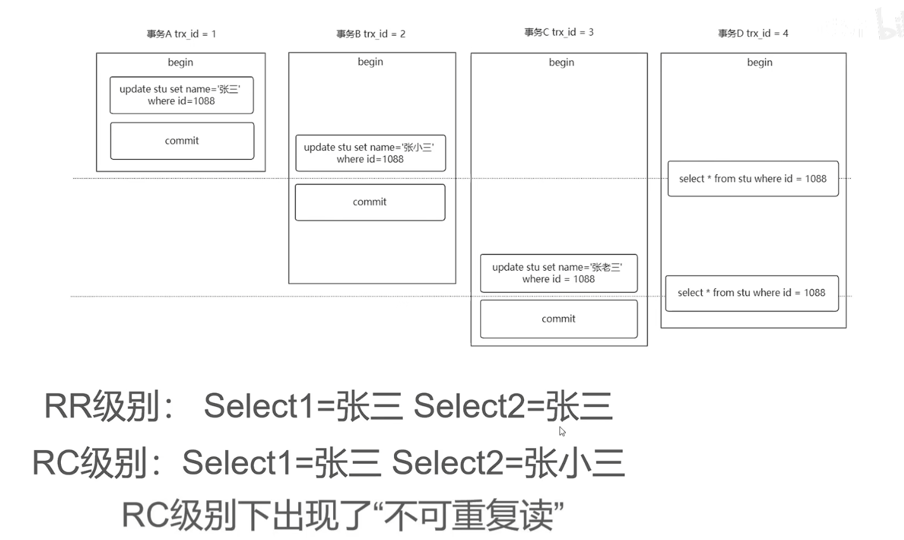

 

# MySQL体系结构

参考： https://www.bilibili.com/video/BV1BQ4y1q7yM/?spm_id_from=333.337.search-card.all.click&vd_source=6cd527c3a43bcb0943d3d64a7923b3bc


## 一条select的执行轨迹


# 索引


1. mysql的索引原理和数据结构能介绍下吗?
    1. 索引目录一样，有了索引就可以直接找到数据， 数据结构是B+树， B+树就是平衡的多路查找树，叶子节点都在同一层
2. B+树和B树的区别
    1. B+树只有在叶子节点存数据，B树所有节点都可以存数据
    2. B+树的叶子节点，从左往右有指针链接着。
    3. B+树M阶是，可以最多有M个关键字，而B树最多M-1个关键字
    4. B+树其实是B树的变种。
3. mysql的聚簇索引和非聚簇索引
    1. 和数据一起的所以是聚簇索引，一般是主键id
        1. 在InnoDB中，只存在一个聚集索引：
            - 若表存在主键，则主键索引就是聚集索引；
            - 若表不存在主键，则会把第一个非空的唯一索引作为聚集索引；
            - 否则，会隐式定义一个rowid作为聚集索引。
    2. 没有和数据放在一起的是非聚餐索引， 一般是普通索引。 叶子节点存放的是主键值
    3. innodb一定有聚簇索引，如果有其他普通索引，才会有非聚簇索引。
    4. myisam都是非聚簇索引，因为索引和数据一直都是分开放的。
4. 使用mysql索引有什么原则？
    1. 尽量少的回表
        1. 用非聚簇索引查询时，如果要查所有字段，还要再查一遍聚簇索引的B+树。这就是回表
    2. 索引覆盖
        1. 用非聚簇索引查询时， 如果只查非聚簇索引字段和主键, 就不用再查id所在的B+树，就不用回表，这叫索引覆盖
    3. 最左原则（类似写地址，从省开始写，写到区）
        1. 简述为在联合索引中，从最左边的字段开始匹配，若条件中字段在联合索引中符合从左到右的顺序则走索引，否则不走，可以简单理解为(a, b, c)的联合索引相当于创建了a索引、(a, b)索引和(a, b, c)索引）
        2. 举例：
            1. select * from table where name=? and age=?   符合最左
            2. select * from table where name=? 符合最左
            3. select * from table where age=? 不符合 
            4. select * from table where age=? and name=? 符合最左， 因为name和age调换顺序不影响，所以mysql优化器会优化
        3.  注意， 当表中的全部列都是索引列时，无论怎么查询都会用到索引，(原理是索引覆盖)，expain sql 语句，发现type是index! （走普通索引的叶子节点，走得更快！）
    4. 索引下推
        1. select * from table where name=? and age=?
            1. 在没有索引下推之前，执行的过程是，先根据name从存储引擎中拉取数据，然后根据age在server中过滤
            2. 有了索引下推之后，执行的过程是: 根据name.,age整体的从存储引擎中做数据检索，返回对应的记录，不再server层做任何操作
            3. 结果就是减少了回表的次数！
            4. 索引下推在**非主键索引**上的优化，可以有效减少回表的次数，大大提升了查询的效率。
        2. 参考文档： https://zhuanlan.zhihu.com/p/121084592
5. 不同的存储引擎是如果进行实际存储的？
    1. innodb存的是.idb文件， 此时idb是索引和数据存放在一起。
    2. myisam存的是.myd文件和.myi文件， myd是存数据，myi是存索引
6. mysql的组合索引的结构是什么样的？
    1. 也是B+树，他是非聚合索引，叶子节点只保存了组合索引列
7. mysql的索引如何进行优化？
    1. 减少回表
    2. 索引覆盖
    3. 最左原则


怎么知道自己有没有走索引？  用EXPLAIN关键字

```sql
-- 比如
EXPLAIN SELECT * FROM test WHERE b = 1;
```

慢查询日志？怎么看？


以下的参考文档： https://worktile.com/kb/p/24047

首先在mysql执行如下命令

```sql
CREATE TABLE `test` (  `a` int NOT NULL AUTO_INCREMENT,  `b` int DEFAULT NULL,  `c` int DEFAULT NULL,  `d` int DEFAULT NULL,  `e` int DEFAULT NULL,  PRIMARY KEY(`a`),  KEY `idx_abc` (`b`,`c`,`d`)) ENGINE=InnoDB DEFAULT CHARSET=utf8mb4 COLLATE=utf8mb4_0900_ai_ci;

INSERT INTO test(`a`, `b`, `c`, `d`, `e`) VALUES (1, 2, 3, 4, 5);
INSERT INTO test(`a`, `b`, `c`, `d`, `e`) VALUES (2, 2, 3, 4, 5);
INSERT INTO test(`a`, `b`, `c`, `d`, `e`) VALUES (3, 2, 3, 4, 5);
```

然后执行

```
EXPLAIN SELECT b, c, d FROM test WHERE d = 2;
```


为什么要使用联合索引？

减少开销。建一个联合索引(col1,col2,col3)，实际相当于建了(col1),(col1,col2),(col1,col2,col3)三个索引。每多一个索引，都会增加写操作的开销和磁盘空间的开销。对于大量数据的表，使用联合索引会大大的减少开销！

覆盖索引。对联合索引(col1,col2,col3)，如果有如下的sql: select col1,col2,col3 from test where col1=1 and col2=2。那么MySQL可以直接通过遍历索引取得数据，而无需回表，这减少了很多的随机io操作。减少io操作，特别的随机io其实是dba主要的优化策略。所以，在真正的实际应用中，覆盖索引是主要的提升性能的优化手段之一。

效率高。索引列越多，通过索引筛选出的数据越少。有1000W条数据的表，有如下sql:select from table where col1=1 and col2=2 and col3=3,假设假设每个条件可以筛选出10%的数据，如果只有单值索引，那么通过该索引能筛选出1000W10%=100w条数据，然后再回表从100w条数据中找到符合col2=2 and col3= 3的数据，然后再排序，再分页；如果是联合索引，通过索引筛选出1000w10% 10% *10%=1w，效率提升可想而知！


#  优化SQL

1. 根据慢日志来定位慢查询
2. 根据expalin等工具来分析sql
3. 修改sql或者尽量让sql走索引 


```SQL
set long_query_time=1;
set GLOBAL slow_query_log=ON;
show VARIABLES like '%query%';
```


# 事务和锁？

参考b站 20分钟彻底搞清MySQL的事务与锁

https://www.bilibili.com/video/BV1q7411e7t9/?spm_id_from=333.337.search-card.all.click&vd_source=6cd527c3a43bcb0943d3d64a7923b3bc

## 事务

什么是事务？ 事务就是具有ACID性质的一系列操作

ACID

原子性atomicity， 一系列的操作要成功一起成功， 要失败一起失败

一致性consitency， 操作前和操作后数据一致

隔离性isolation，事务之间不能互相干扰。

​	 隔离级别

1. 读未提交 read uncommitted
2. 读已提交 read committed
3. 可重复读 repeatable read， 默认的隔离级别，（innodb当前读可以避免幻读）
4. 序列化 Serializable 

持久性durability，事务提交了永久存储在磁盘上


数据库事务的隔离级别有4个，由低到高依次为Read uncommitted 、Read committed、Repeatable read 、Serializable ，这四个级别可以逐个解决脏读 、不可重复读 、幻读 这几类问题。

- 脏读： 读了其他事务未提交的数据导致的
- 不可重复读： 同一个事务（A）里的两次完全相同的select查询结果可能不一样，因为可能被另一个事务（B）修改了某些值，导致不可重复读
    - 利用MVCC机制来解决不可重复读的问题
- 幻读： 一次事务中前后**数据量**发生变化，用户产生不可预料的问题


不可重复度和幻读的区别：

- 指并发更新时，另一个事务前后查询相同的数据时数据不符合预期
- 幻读是指并发新增，删除这种会产生数量变化的操作时， 另一个事务前后查询相同数据时的不符合预期

```sql
begin; --开始事务
rollback; -- 回滚
commit; --提交

--有时候会自动提交，可以关闭自动提交
set autocommit = 0;

show variables like 'transction_isolation';

SET SESSION TRANSACTION ISOLATION LEVEL READ UNCOMMITTED; -- 设置读未提交
SET SESSION TRANSACTION ISOLATION LEVEL READ COMMITTED; -- 设置读已提交
SET SESSION TRANSACTION ISOLATION LEVEL REPEATABLE READ -- 设置重复度--默认
SET SESSION TRANSACTION ISOLATION LEVEL serializable ; -- 设序列化
```


悲观锁

```
-- 事务1
select count from book where id = 1 for update;
-- 事务2 ， 此时事务2会停住
 select count from book where id = 1 for update;
```

乐观锁

```
update book set count=96 where id = 1 and count = 97;  -- 加一个控制：  count = 97; 
```


## 锁

按锁粒度分类

1. 行锁
2. 表锁
3. 间隙锁


还可分为

1. 共享锁，也就是读锁，一个事务给某行数据加了读锁，其他事务也可以读，但是不能写
2. 排它锁， 也就是写锁， 一个事务给某行数据加了写锁，其他事务也不能读，也不是写


还可以分为

	1. 乐观锁： 并不会真正的去锁某行记录，而是通过一个版本号来实现的
	2. 悲观锁： 上面所有的行锁，表锁都是悲观锁


在事务的隔离级别实现中，就需要利用锁来解决幻读


# MVCC

参考

https://www.bilibili.com/video/BV1hL411479T/?spm_id_from=pageDriver&vd_source=6cd527c3a43bcb0943d3d64a7923b3bc




ReadView是一个数据结构，包含4个字段

1. m_ids:当前活跃的事务编号集合
2. min trxid:最小活跃事务编号
3. max trx id:预分配事务编号，当前最大事务编号+1
4. creator trx id:ReadView创建者的事务编号


生成快照读readview的时候，readview会记录活跃的事务id列表，并记录最小活跃事务id，和待分配的事务id

如果当前记录的事务id，在活跃id列表之外，且小于最小活跃的事务id， 则可以读该行数据。

如果当前记录的事务id，在活跃id列表之外，且大于待分配的事务id，则该行数据不可以读。

如果当前记录的事务id，在活跃id列表之内，则根据回滚指针去undolog找历史版本数据，如果历史版本的事务id小于read view里最小活跃事务id，则这条历史数据就是要读的数据。


读已提交级别，每次快照读都会生成readview， 而可重复读级别一直用第一次生成readview的数据

RR级别（可重复读级别） MVCC只能避免快照度的幻读，而当前读的幻读不能避免

连续多次快照读，ReadView会产生复用，没有幻读问题 特例:**当两次快照读之间存在当前读，ReadView会重新生成，导致产生幻读**

幻读案例：


参考 

https://www.bilibili.com/video/BV1f24y117Dw/?vd_source=6cd527c3a43bcb0943d3d64a7923b3bc

MVCC是多版本并发控制

什么是当前读，什么是快照读？

- MVCC机制实现了快照读，普通的select查询就是快照读，快照读的数据可能不是最新的数据，它主要是为了实现可重复度的隔离级别。
- 当前读读取最新的数据版本，当前读就是加了锁的增删改查语句， update,delete,insert,select ... lock in share mode select ... for update是当前读


MVCC有没有解决幻读的问题

1. 在快照读的情况下， InnoDB通过MVCC机制解决了幻读的问题

2. 在当前读的情况下，InnoDB无法通过MVCC解决幻读的现象，因为它每次读取的都是最新的数据


## 原理

参考：

https://www.bilibili.com/video/BV1864y1976i/?spm_id_from=333.999.top_right_bar_window_view_later.content.click&vd_source=6cd527c3a43bcb0943d3d64a7923b3bc

每行记录中有三个隐藏字段

- 隐藏的主键 DB_ROW_ID

- 事务id: DB_TRX_ID
- 回滚指针： DB_ROLL_PTR


undolog 存放着历史版本数据，具体快照读选什么数据？ 需要看读视图readView


read view 有三个全局属性

- trx_list: 用来维护read view生成时刻系统正活跃的事务id
- up_limit_id: 记录trx_list列表中事务id最小的id
- low_limit_id: read view生成时刻系统尚未分配的下一个事务id

read view可见性规则

​		Read View遵循的可见性算法主要是将要被修改的数据的最新记录中的DB_TRX_ID(当前事务id)取出来，与系统当前其他活跃事务的id去对比，如果DB_TRX_ID跟Read View的属性做了比较，不符合可见性，那么就通过DB_ROLL_PTR回滚指针去取出undolog中的DB_TRX D做比较，即遍历链表中的DB TRX ID，直到找到满足条件的DB_TRX_ID,这个DB TRX ID所在的旧记录就是当前事务能看到的最新老版本数据

具体的比较规则如下:
1、首先比较DB_TRX_ID < up_limit id,如果小于，则当前事务能看到DB_TRX_ID所在的记录，如果大于等于进入下一个判断
2、接下来判断DB_TRX_ID >= low_limit id,如果大于等于则代表DB_TRXID所在的记录在Read View生成后才出现的，那么对于当前事务肯定不可见，如果小于，则进入下一步判断
3、判断DB_TRX_ID是否在活跃事务中，如果在，则代表在Read View生成时刻，这个事务还是活跃状态，还没有commit，修改的数据，当前事务也是看不到，如果不在，则说明这个事务在Read View生成之前就已经开始commit，那么修改的结果是能够看见的。

​	

具体的比较规则如下:
1、首先比较DB_TRX_IDup_limit id,如果小于，则当前事务能看到DB_TRXID所在的记录，如果大于等于进入下一个判断
2、接下来判断DB_TRX_ID >= low_limit id,如果大于等于则代表DB_TRXID所在的记录在Read View生成后才出现的，那么对于当前事务肯定不可见，如果小于，则进入下一步判断
3、判断DB TRXID是否在活跃事务中，果在，则代表在Read View生成时刻，这个事务还是活跃状态，还没有commit，修改的数据，当前事务也是看不到，如果不在，则说明这个事务在Read View生成之前就已经开始commit，那么修改的结果是能够看见的。


RC、RR级别下的InnoDB快照读有什么不同？
因为Read View生成时机的不同，从而造成RC、RR级别下快照读的结果的不同
	1、在RR级别下的某个事务的对某条记录的第一次快照读会创建一个快照即Read View,将当前系统活跃的其他事务记录起来，此后在调用快照读的时候，还是使用的是同一个Read View,所以只要当前事务在其他事务提交更新之前使用过快照读，那么之后的快照读使用的都是同一个Read View,所以对之后的修改不可见
	2、在RR级别下，快照读生成Read View时，Read View会记录此时所有其他活动和事务的快照，这些事务的修改对于当前事务都是不可见的，而早于Read View创建的事务所做的修改均是可见
	3、在RC级别下，事务中，每次快照读都会新生成一个快照和Read View,这就是我们在R级别下的事务中可以看到别的事务提交的更新的原因。
**总结: 在RC隔离级别下，是每个快照读都会生成并获取最新的Read View,而在RR隔离级别下，则是同一个事务中的第一个快照读才会创建Read View，之后的快照读获取的都是同一个Read View.**


# 存储引擎

存储引擎就是与文件打交道的mysql的子系统

默认是Innodb

innodb ： 支持表锁， 支持行锁，支持事务，支持外键，支持崩溃后的安全恢复，不支持全文索引， 

myisam： 支持表锁，不支持行锁，不支持事务，不支持外键，支持全文索引，支持延迟更新索引，支持表压缩

还有NDB, MEMORY。 这里不做过多介绍


innodb 和myisam的数据存储结构不同

   innodb 在磁盘上有两个文件.frm表定义， .idb存储数据和索引， 需要的空间更多，综合性能更高

​	myisam  在磁盘上有三个文件.frm 表定义, .MYD存储数据, .MYI存储索引 ， 需要的空间更少


# 分表分库？

sql优化到了极限了。才考虑分库分表， 此时需要单表的数量特别大， 单库的数量特别大


分库：将原本存储于单个数据库上的数据拆分到多个数据库，
分表： 把原来存储在单张数据表的数据拆分到多张数据表中，实现数据切分，从而提升数据库操作性能。


分库分表的实现可以分为两种方式: 垂直切分和水平切分。

 

水平:将数据分散到多张表，涉及分区键

- 分库: 每个库结构一样，数据不一样，没有交集。库多了可以缓解io和cpu压力
- 分表:每个表结构一样，数据不一样，没有交集。表数量减少可以提高sql执行效率、减轻Cpu压力

垂直: 将字段拆分为多张表，需要一定的重构

- 分库: 每个库结构、数据都不一样，所有库的并集为全量数据
- 分表:每个表结构、数据不一样，至少有一列交集，用于关联数据，所有表的并集为全量数据


怎么避免分库分表？


这个没有实际经验


# MySQL的主从同步

略


# redolog undolog binlog

参考

https://juejin.cn/post/6987557227074846733

https://blog.csdn.net/lkforce/article/details/108540000


## 前言

我们知道一条 select 语句是如何执行的。如果是 update 语句呢，执行步骤和查询语句其实是一样的，在执行语句前要连接数据库，这是连接器的工作。如果查询缓存中存在这条 SQL 的结果集缓存，直接取出返回客户端，前面说过，表上有更新的时候，这个表相关的查询缓存都会失效，所以查询缓存不建议使用，在 MySQL 8.0 版本把查询缓存删除了。接下来，分析器、优化器、执行器分别做各自的工作，查询出结果集返回给客户端。

但 update 和 select 不一样的是，update还涉及两个重要的日志文件，就是 redo log 和 binlog

## redo log

反过来思考，如果不存在这两个日志，会出现什么问题？

update 操作其实是分为两步操作，先查询到对应的行记录，再根据条件进行更新操作。如果没有 redo log 的话，MySQL 每次的update操作都要更新磁盘文件，更新磁盘文件需要先在磁盘中找到对应的行记录，再更新，每一条 update 语句都要操作磁盘文件，整个过程的 I/O 成本，查找成本都很高。为了解决这个问题，InnoDB 引擎的设计者想到了一个办法，先将记录写到 redo log 中，并更新内存，这个时候更新就算完成了，操作内存比操作磁盘要快的多。同时，InnoDB 会在适当的时候，将 redo log 中的记录更新到磁盘文件中。这个更新往往是系统空闲时做。

每次更新操作都要往 redo log 中写入，如果 redo log 满了，空间不够用了怎么办？

InnoDB 的 redo log 文件是固定大小的，比如可以配置一组4个文件，每个文件大小是 1GB，那么 redo log 中可以记录 4GB 的操作，InnoDB 会从第一个文件开始写入，直到第四个文件写满了，又回到第一个文件开头循环写，如下图。


write pos是当前记录的位置，一边写一边后移，写到第3号文件末尾后就回到0号文件开头。checkpoint是当前要擦除的位置，也是往后推移并且循环的，擦除记录前要把记录更新到数据文件。

write pos和checkpoint之间的是 redo log上还空着的部分，可以用来记录新的操作。如果write pos追上checkpoint，表示 redo log 满了，这时候不能再执行新的更新，得停下来先擦掉一些记录，把checkpoint推进一下。

有了redo log，InnoDB就可以保证即使数据库发生异常重启，之前提交的记录都不会丢失，这个能力称为crash-safe。


redo log日志文件大小固定。

默认日志文件在mysql目录的data子目录下，ib_logfile1和ib_logfile2两个文件，大小相同，循环使用。

redo log是物理日志，记录数据页更新的内容。

redo log以块为单位存储，每块512字节，包括：

日志块头，12字节

日志块尾，8字节

日志主体，492字节

在redo log buffer和redo log文件中都是这样存储的。


redo log在内存中有一个缓存区Innodb_log_buffer，记录redo log时，先将日志写入内存的缓存区，再刷到磁盘中。

redo log不是随着事务提交才写入文件的，而是从事务开始就逐步写入文件了（即使事务还没提交）。


**宕机恢复用到了redo**


## binlog

刚刚说的 redo log 是执行引擎层的 log 文件，我们都知道，MySQL 整体来看，分为 Server 层和引擎层，而 binlog 是 Server 层面的 log 文件，也就是所有执行引擎都有 binlog

那为什么 InnoDB 有一份 log 文件，MySQL 有一份 log 文件呢？

因为以前的MySQL没有InnoDB引擎，MySQL5.5前使用的 MyISAM引擎，但是 MyISAM 没有 crash-safe 的能力，而 binlog 只能用于归档。InnoDB 是后来作为 MySQL 的引擎以插件形式引入的。既然只靠 binlog 无法实现 crash-safe 的能力，所以 InnoDB 使用另一套日志系统——redo log 来实现。

## update操作流程

```
update T set c=c+1 where ID=2;
```

1、执行器先通过引擎查询到 id = 2 这行数据，id 是主键，直接遍历主键索引树直接插到这行数据，如果这行数据所在的数据页在内存中，就直接返回结果给执行器，否则，需要先从磁盘读入内存，然后再返回。

2、执行器拿到引擎给的行数据，把 这个值+1，得到新的一行数据，再调用引擎接口写入这行数据。

3、引擎将这行数据更新到内存中，同时记录到 redo log 中，此时 redo log 处于 perpare 状态，此时就告知执行器已经更新完成了，随时可以提交事务。

4、执行器生成这个操作的binlog，并把binlog写入磁盘

5、执行器调用引擎的提交事务接口，引擎把刚刚写入的redo log改成提交（commit）状态，更新完成

如下图为 update 语句的执行流程，深色代表 MySQL 执行器中执行的，浅色代表 InnoDB 内部执行的。


## redo log 与 binlog

1. redo log 是InnoDB 引擎特有的；而 binlog 是MySQL Server 层实现的
2. redo log 是物理日志，记录的是“在某个数据页做了什么修改”；而 binlog 是逻辑日志，记录的是语句的原始逻辑。比如 `update T set c=c+1 where ID=2;`这条SQL，redo log 中记录的是 ：`xx页号，xx偏移量的数据修改为xxx；`binlog 中记录的是：`id = 2 这一行的 c 字段 +1`
3. redo log 是循环写的，固定空间会用完；binlog 可以追加写入，一个文件写满了会切换到下一个文件写，并不会覆盖之前的记录
4. 记录内容时间不同，redo log 记录事务发起后的 DML 和 DDL语句；binlog 记录commit 完成后的 DML 语句和 DDL 语句
5. 作用不同，redo log 作为异常宕机或者介质故障后的数据恢复使用；binlog 作为恢复数据使用，主从复制搭建。


## undo log

undo log 和 redo log 也是引擎层的 log 文件，undo log 提供了回滚和多个行版本控制（MVCC），在数据库修改操作时，不仅记录了 redo log，还记录了 undo log，如果因为某些原因导致事务执行失败回滚了，可以借助 undo log 进行回滚。

虽然 undo log 和 redo log 都是InnoDB 特有的，但 undo log 记录的是 逻辑日志，redo log 记录的是物理日志。对记录做变更操作时不仅会产生 redo 记录，也会产生 undo 记录（insert,update,delete），undo log 日志用于存放数据被修改前的值，比如 `update T set c=c+1 where ID=2;` 这条 SQL，undo log 中记录的是 c 在 +1 前的值，如果这个 update 出现异常需要回滚，可以使用 undo log 实现回滚，保证事务一致性。


## 总结

redo log 用来保证 crash-safe，binlog 用来保证可以将数据库状态恢复到任一时刻，undo log 是用来保证事务需要回滚时数据状态的回滚和 MVCC 时，记录各版本数据信息。