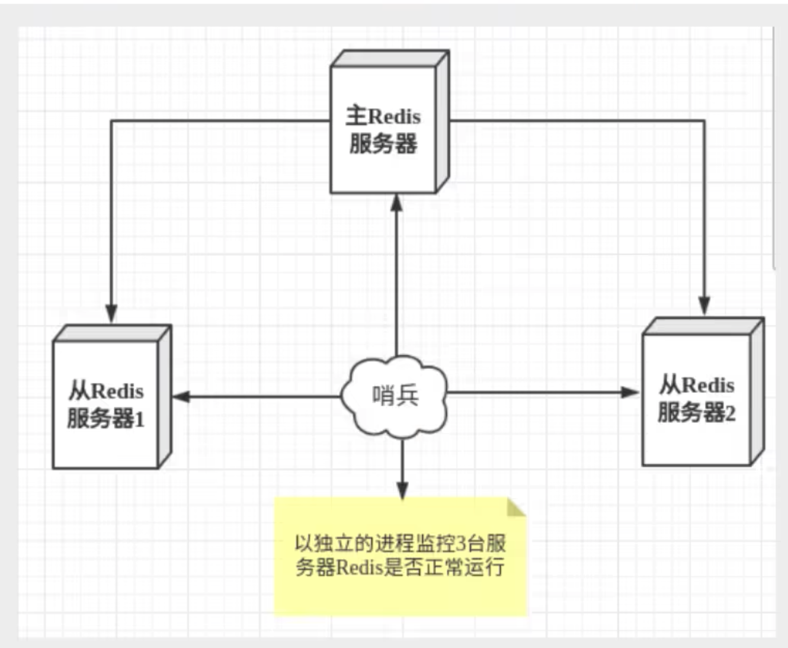
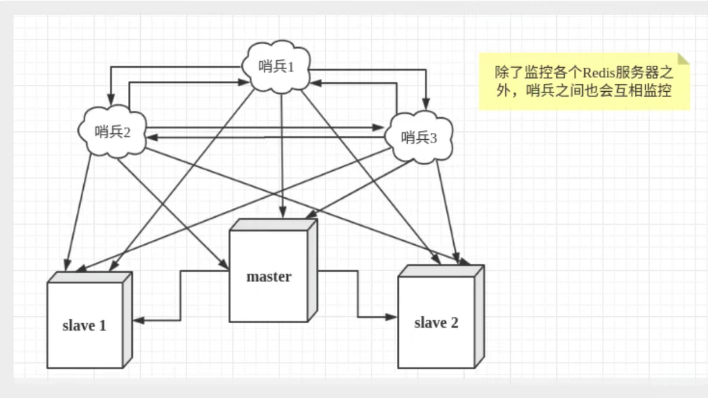
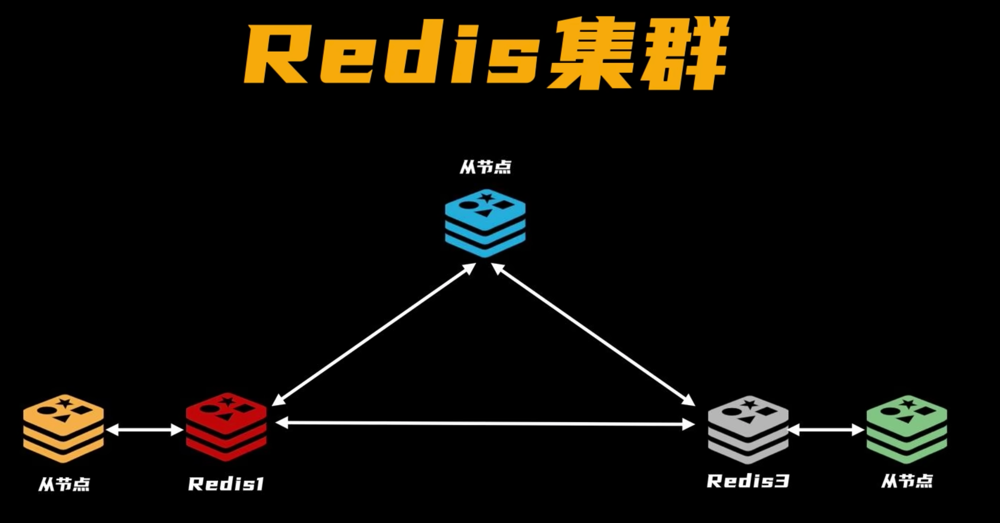
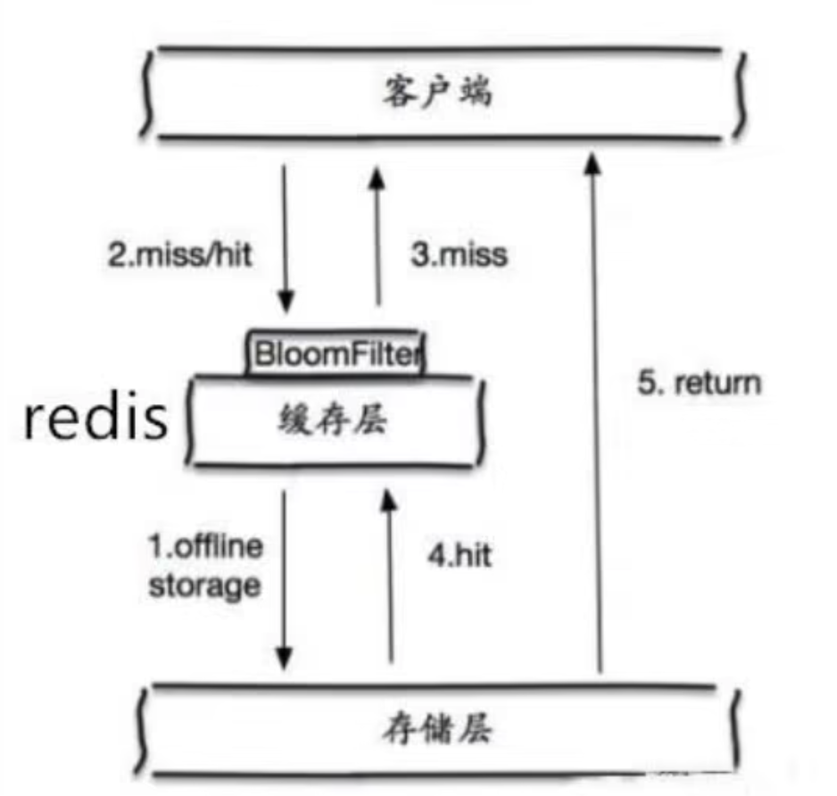
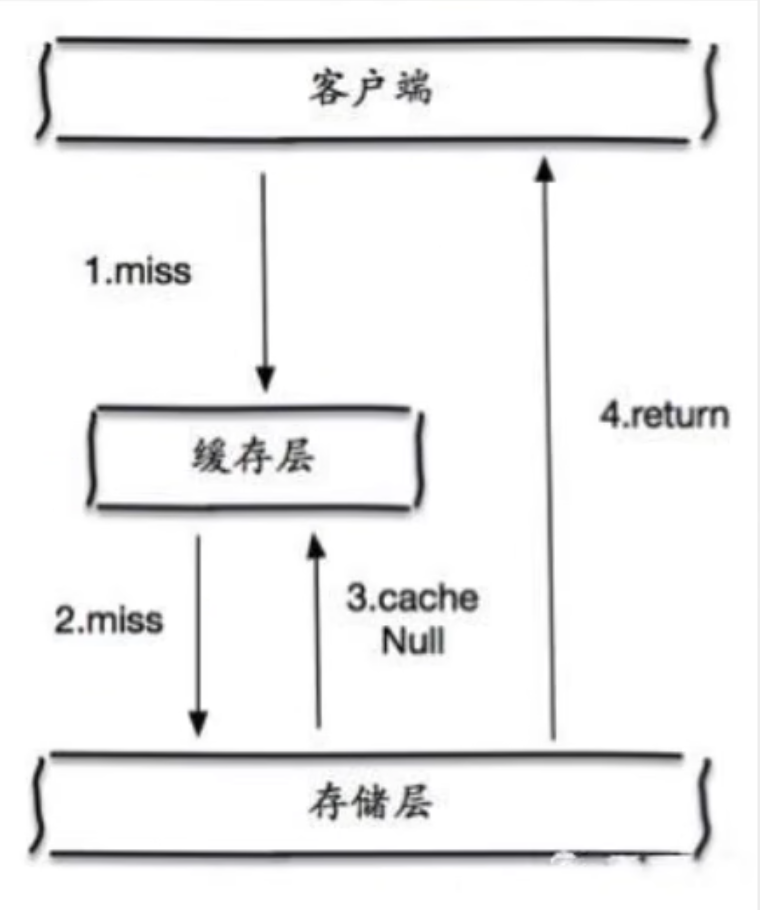
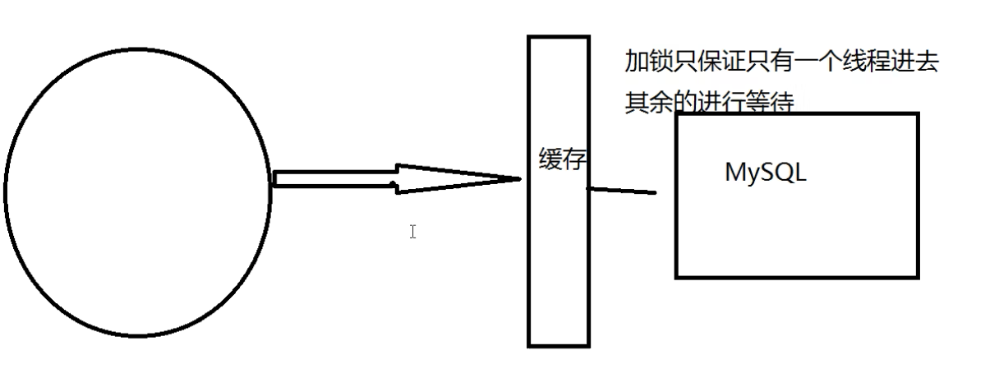
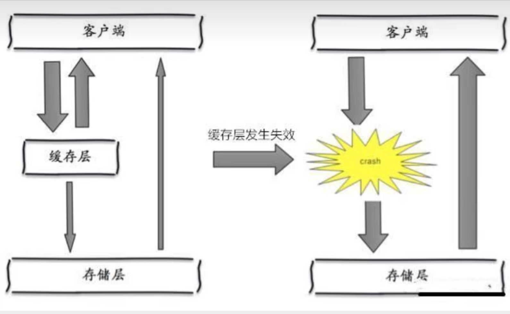

Redis 集群环境搭建（docker）

参考https://zhuanlan.zhihu.com/p/336520931


# redis概述

1. 高速缓存（rdb,aof持久化很重要）
2. 发布订阅系统
3. 地图信息分析
4. 计数器


需要学的

1. 事务
2. 集群
3. 持久化
4. 高可用
	1. 通过哨兵和自动分区（cluster）实现高可用


redis是单线程的？ 

1. **因为Redis是基于内存的操作，CPU不是Redis的瓶颈，Redis的瓶颈最有可能是机器内存的大小或者网络带宽**
2. redis使用IO多路复用技术（IO multiplexing, 解决对多个I/O监听时,一个I/O阻塞影响其他I/O的问题），可以处理并发的连接（非阻塞IO）。


Redis 中文文档网站

http://www.redis.cn/


基本类型

1. string
2. list
3. set
4. zset
5. Hash

三种数据类型

1. geo
2. hyperloglog
3. bitmap


# redis入门

基准测试

```shell
redis-benchmark -n 100000 # 10万条数据测试
```


## 基本命令

```s
Redis提供查看内存的指令为info memory。

select 0 # 选择0号数据库， redis.conf默认配置有16个数据库

dbsize #查看数据库大小

flushdb #清空当前数据库的数据

flushall #清空所有数据库

key * #查看所有键

exists key1  #是否存在key1

move key2 1 # 将key2移到数据库2

expire key1 10 #key1设置10秒后过期

ttl key1 # 查看key1的过期时间

type key1 # 查看key1类型
```

命令的详解可以去查 http://www.redis.cn/commands.html 


## string

```
append key1 "123" # 追加字符串
strlen key1 # 查看长度
incr key1 # 递增1
decr key1 # 递减1
incrby key1 10 # 递增10
decrby key1 10 # 递减10
getrange key1 0 1 # 相当于java的substring(0,1+1) # redis里面是左闭右闭的， 而java是左闭右开的
setrange key1 0 hwj # offer是0，从0开始设置字符
setex name 10 hwj # name=hwj的值只存在10秒 setex 是 set with expire的意思
setnx name hwj # 不存在则设置，存在不跳过 (可以用在分布式锁)
mset # 设置多个值
mget # 获取多个值
getset # 先获取再设置
```


redis string 最大容量是512M


### 限制时间的业务

手机验证码


### 分布式式锁

setnx lock 1 返回0表示没锁，你可以做你想要的操作， 返回1表示有锁，你不能继续干了

抢红包


### 计数器

redis由于incrby命令可以实现原子性的递增，所以可以运用于高并发的秒杀活动、分布式序列号的生成、具体业务还体现在比如限制一个手机号发多少条短信、一个接口一分钟限制多少请求、一个接口一天限制调用多少次等等。


## list

```shell
lpush list 0 # list左边推入0
lpush list 1 
lrange list 0 -1 # 获取全部元素
lindex list 0
llen list 
lrem list 2 hwj # 移除两个hwj元素
ltrim list 0 1 # start=0, end=1, # 其他元素全部移除
rpoplpush list1, list2 # list1的数据移到list2
lset list 0 hwj # 将下标0设置为hwj， 如果不存在则异常
linsert list before "world" "other" # 在world前面插入other
linsert list after "world" "other" # 在world后面插入other

# 同理右边
rpush
rpop
# 但是没有rrange
```


作用：

​	1.队列和栈， lpush , rpop 是队列， lpush ,lpop是栈


## set

```shell
sadd myset 1 2 3 # 添加1，2，3 到myset
smembers myset # 查看myset的所有值
sismember myset 3 # 查看3是不是myset的值, 是指返回1，否则返回0
scard myset # 查看集合的个数
srem myset 3 # 删除集合中的元素3
srandmember # 随机选一个元素
spop myset # 随机删除一个元素
smove myset myset2 5 # 将myset中的5移到myset2
sdiff myset myset2 # 差集
sinter myset myset2 # 交集
sunion myset myset2 # 并集
```

应用：

​	共同关注，共同爱好（六度分割原理： 你和任何一个陌生人之间所间隔的人不会超过六个）


## hash

hash和string没有什么区别

```shell
hset myhash field1 value1
hget myhash field1
hmset 
hmget
hgetall myhash # 获取所有键值对
hlen myhash
hexists myhash field1  # 判断键是否存在
hkeys myhash # 获取所有键
kvals myhash # 获取所有值
hincrby myhash count 1 #count 递增1
hsetnx myhash field1 value2 #如果不存在则设置
```


## zset

```
zadd myset 1 one 
zadd myset 2 two 3 three
zrange myset 0 -1 # 显示全部元素
zcard myset # 获取集合个数

# 排序如何实现？ 比如按工资排
zadd salary 500 hwj
zadd salary 2000 zhangsan
zadd salary 5000 lisi
zrangebyscore salary -inf +inf  # 按工资排名，从小到大
zrangebyscore salary -inf +inf withscores # 带上成绩

zrem salary zhangsan # 删除指定元素

zcount salary 1 2 # 获取指定区间的成员数量
```

应用： 取topN


## geospatial

城市的经度纬度查询： http://www.jsons.cn/lngcode/

官方文档 https://www.redis.net.cn/order/3685.html

朋友的定位，附近的人，打车距离计算

只有6个命令

```
geoadd # 添加位置
geodist # 查两个元素之间的距离
geohash # 返回一个位置或者多个位置的hash值
geopos # 查某个元素的位置
georedius # 以某个位置为中心，半径为redius的元素有哪些
georediusbymember  # 以某个元素为中心， 半径为redius的元素有哪些
```


一般地理位置可以一次性导入

```shell
# geoadd key longtitute latitue
geoadd shenzhen:partition 114.13116 22.54836 luohu
geoadd shenzhen:partition 114.05571 22.52245 futian
geoadd shenzhen:partition 113.93029 22.53291 nanshan
geoadd shenzhen:partition 113.88311 22.55371 baoan
geoadd shenzhen:partition 114.24771 22.71986 longgang
geoadd shenzhen:partition 114.23733 22.5578 yantian

# 获取深圳宝安区的位置
geopos shenzhen:partition baoan 

# 宝安和龙岗的距离
geodist shenzhen:partition baoan longgang
# 增加单位
geodist shenzhen:partition baoan longgang km

# 距离福田（114.05571 22.52245）15km的区有哪些?
georadius shenzhen:partition 114.05571 22.52245 15 km
georadiusbymember shenzhen:partition futian 15 km
# 列出到福田（114.05571 22.52245）15km的区的距离
georadius shenzhen:partition 114.05571 22.52245 15 km withdist
# 列出到福田（114.05571 22.52245）15km的区的坐标
 georadius shenzhen:partition 114.05571 22.52245 15 km withcoord
 
# 距离福田（114.05571 22.52245）15km的区有哪些? 限制个数2个
georadius shenzhen:partition 114.05571 22.52245 15 km count 2

# 福田的位置（经纬度）转换成hash值， 二维变一维（很少用）
geohash shenzhen:partition futian
```

geo的底层是zset，所以我们可以用zset的命令来操作geo

```shell
zrange shenzhen:partition 0 -1 # 查看深圳的所有区
zrem shenzhen:partition yantian # 移除深圳盐田区
```


## hyperloglog

什么是基数? 就是不重复的元素个数，可以接受误差

hyperloglog是基数统计的算法，优点是占用的内存是固定的，很小

​	统计2^64个不重复的元素，只需要12KB的内存。 如果要从内存角度比较的话，hyperloglog是首选


应用场景： 

用来统计每日网站的访问量

(网页UV)一个人访问网站多次，还是算一个人

​	传统的方式， 用set保存用户的id，然后就可以统计set中的元素数量。这种情况会保存大量的用户id，而我们的目的是为了计数

​	hyperloglog 只需要12KB， 但是有0.81的错误率


```shell
PFADD mykey a b c d e f g h i j # 存放10个元素
PFCOUNT mykey # 得到10个元素
PFADD mykey2 k l m n o p 
PFMERGE mykey3 mykey mykey2 # 合并两个mykey和mykey2到mykey3
```


## bitmaps

> 位存储

统计疫情感染人数

> 统计活跃的，不活跃的 ， 统计365天打卡的， 两个状态的

365天 = 365bit  => 365/8=45.6字节


```shell
# 设置7天的打卡
setbit sign 0 1  # 第0天打卡
setbit sign 1 0  # 第1天不打卡
setbit sign 2 0 
setbit sign 3 1 
setbit sign 4 1 
setbit sign 5 1 
setbit sign 6 0

# 查看第2天的打卡情况
getbit sign 4

# 统计7天的打卡情况
bitcount sign 
```


# redis事务

redis的单条命令是保证原子性的， 但事务不保证原子性

redis事务本质： 一组命令的集合！一个事务中的所有命令都会被序列化，在事务执行的过程中，会按照顺序执行！

一次性，顺序性，排他性 （不受其他事务干扰）

**redis事务没有隔离级别的概念**

所有的命令在事务中，并没有直接被执行， 只有发起执行命令（Exec）的时候才会执行！

```
-----队列 set  set  set  执行------
```

redis事务

1. 开始事务（）
2. 命令入队（）
3. 执行事务（）

> 正常执行事务

```shell
multi
set k1 v1
set k2 v2
get k1
set k3 v3
exec  # 这个时候才开始执行
```

> 放弃事务

```
multi
set k1 v1
set k2 v2
discard
```

> 编译型异常， 此时事务中的所有命令都不会被执行

```shell
multi
set k1 v1
set k2 v2
getset k2  # 这个是编译型异常
set k3 v4
exec  # 所有的命令都不会被执行
```

> 运行时异常， 事务中没有错误的命令是可以执行的，所以没有原子性和一致性的性质

```shell
multi 
set k1 v1
incr k1 # k1不是数字，会有运行时异常
set k2 v2
exec
```


## redis乐观锁

> redis测监测测试

```shell
127.0.0.1:6379> set money 100
OK
127.0.0.1:6379> set out 0
OK
127.0.0.1:6379> watch money  # 监视对象，事务执行成功时，监视自动释放
OK
127.0.0.1:6379> multi # 事务正常结束，数据期间没有发生变动，这个时候就正常执行成功
OK
127.0.0.1:6379(TX)> decrby money 20
QUEUED
127.0.0.1:6379(TX)> incrby out 20
QUEUED
127.0.0.1:6379(TX)> exec  # 事务执行成功时，监视自动释放
1) (integer) 80
2) (integer) 20
```


```shell
127.0.0.1:6379> watch money  # 实现乐观锁
OK
127.0.0.1:6379> 
127.0.0.1:6379> 
127.0.0.1:6379> multi
OK
127.0.0.1:6379(TX)> decrby money 10
QUEUED
127.0.0.1:6379(TX)> incrby money 10 
QUEUED
127.0.0.1:6379(TX)> exec  # 在事务开始之后，且在执行exec之前， 另外一个线程执行了set money 1000命令， 就会执行失败
(nil)

# 失败了就要放弃监视, 然后重新watch
unwatch 
```


# java项目使用

## jedis

## springboot配置redis

说明： springboot2.x之后，原来使用的jedis被替换成了lettuce

jedis： 采用的直连， 多个线程操作的话，是不安全的，如果想要避免不安全，使用jedis pool连接池，更像BIO模式

lettuce: 采用netty , 实例可以在多个线程中进行共享，不存在线程不安全的情况！ 可以减少线程数据了， 更像NIO模式


# redis配置

Redis默认是无限使用内存的，所以防止系统内存被耗尽，需要对Redis的内存上限进行设置，Redis使用maxmemory参数限制最大可用内存

## 网络

```
protected-mode yes #保护模式
bind 127.0.0.1 # 地址
port 6379 # 端口
```

## 通用

```
deamonize no # 以守护进程的方式运行，默认是no，我们需要自己开启为yes
pidfile /var/run/redis_6379.pid # 如果以后台方式运行，我们就需要指定pid文件
loglevel notice # 日志级别
logfile "" # 日志的文件位置名
database 16 # 数据库的数量
always-show-log yes # 是否显示logo
```

## 快照

持久化， 在规定的时间内，执行了多少次操作，则会持久化到文件.rdb .aof

```
dbfilename dump.rdb # 

# redis是内存数据库，断点即失
save 900 1  #  900秒修改1个key以上，就进行持久化操作， 下面以此类推
save 300 10
save 60 10000

stop-writes-on-bgsave-error yes # 持久化如果出错，redis是否需要继续工作
rdbcompression yes # 是否压缩rdb文件， 这个很耗费CPU资源
rdbchecksum yes #保存rdb文件的时候，是否检验rdb文件
dir ./  # rdb文件保存的目录
```

## 复制 replication 

```
replicaof 127.0.0.1 6379 # 配置主机的ip和端口
masterauth 123456  # 如果主机有密码， 则设置密码， 这里的123456指密码
```


## 安全

redis默认没有密码，可以设置密码

```
redis-cli命令： 
config get requirepass
config set requirepass "123456"
auth 123456
config get requirepass
config set requirepass "" # redis删除密码
```

## 限制

```shell
maxclients 10000  # 设置能连接上redis的最大客户端的数量
maxmemory <bytes> # 限制内存大小
maxmemory-policy noeviction # 内存达到上限是的处理策略， 8种 默认不进行淘汰， 内存满了报错退出
```

> 题外： redis key的过期删除策略

 	1. 定期删除
 		1. redis默认是每隔 100ms就随机抽取一些设置了过期时间的key
 	2. 惰性删除
 		1. 惰性策略就是在客户端访问这个key的时候，redis对key的过期时间进行检查，如果过期了就立即删除，不会给你返回任何东西。

>  题外： redis 内存满的时候的8种淘汰策略 

主要分为不进行数据淘汰和进行数据淘汰两大类

1. noeviction：当内存使用超过配置的时候会返回错误，不会驱逐任何键 （默认的）

2. allkeys-lru：加入键的时候，如果过限，首先通过LRU算法驱逐最久没有使用的键

3. volatile-lru：加入键的时候如果过限，首先从设置了过期时间的键集合中驱逐最久没有使用的键

4. allkeys-random：加入键的时候如果过限，从所有key随机删除

5. volatile-random：加入键的时候如果过限，从过期键的集合中随机驱逐

6. volatile-ttl：从配置了过期时间的键中驱逐马上就要过期的键 （ 这个用的比较多）

7. volatile-lfu：从所有配置了过期时间的键中驱逐使用频率最少的键

8. allkeys-lfu：从所有键中驱逐使用频率最少的键


lru就是删除最久最少被使用的， lfu是删除最少使用的

1. 不淘汰 （1种）
	1. noeviction（Redis3.0之后，默认的内存淘汰策略） ：它表示当运行内存超过最大设置内存时，不淘汰任何数据，而是不再提供服务，直接返回错误。

2. 在设置了过期时间的数据中进行淘汰：（4种）
	1. volatile-random：随机淘汰设置了过期时间的任意键值；
	2. volatile-ttl：优先淘汰更早过期的键值。
	3. volatile-lru（Redis3.0 之前，默认的内存淘汰策略）：淘汰所有设置了过期时间的键值中，最久未使用的键值；
	4. volatile-lfu（Redis 4.0 后新增的内存淘汰策略）：淘汰所有设置了过期时间的键值中，最少使用的键值；

3. 在所有数据范围内进行淘汰：（3种）
	1. allkeys-random：随机淘汰任意键值;	
	2. allkeys-lru：淘汰整个键值中最久未使用的键值；
	3. allkeys-lfu（Redis 4.0 后新增的内存淘汰策略）：淘汰整个键值中最少使用的键值。


## append only mode

```
appendonly no # 默认是不开启aof模式的， 默认使用rdb方式持久化，在大部分情况下rdb完全够用了
appendonlyfilename "appendonly.aof" # 持久化文件的名字 
# appendsync always # 每次修改都写入
appendsync everysec # 默认的， 每秒执行一次sync, 可能会丢失一秒的数据
# appendsync no # 不执行sync,这个时候操作系统同步数据，速度最快


no-appendfsync-on-rewrite no  # 是否开启重新写新文件，默认一直在一个文件里写。数据大的时候不好，导致文件会非常大！ 
auto-aof-rewrite-percentage 100  # 这个值的计算方式是，当前aof文件大小和上一次重写后aof文件大小的差值，再除以上一次重写后aof文件大小。也就是当前aof文件比上一次重写后aof文件的增量大小，和上一次重写后aof文件大小的比值。
auto-aof-rewrite-min-size 64mb # 表示运行AOF重写时文件的最小大小，默认为64MB。 达到64m是重新写新的aof文件
```


# redis持久化


## RDB

**Redis 默认开启RDB持久化方式**

rdb 就是 redis database 的意思

redis在指定的时间间隔内将内存中的数据集快照写入磁盘，换句话就是保存快照文件

一句话，定期的将内存的数据保存成快照文件。恢复时就是将快照文件读到内存里

redis会单独fork一个子进程来持久化，会将数据协议到一个**临时文件**中，待**持久化过程结束**了。再用临时文件替换上次持久化好的文件，整个过程，主进程是不进行任何IO操作的，这就保证了极高的性能，如果需要进行大规模的数据恢复，且数据完整性要求不搞，rdb方式会比aof更高效。 rdb的缺点就是最后一次持久化的数据可能会丢失。

配置文件redis.conf

```
dbfilename dump.rdb  #
save 60 2 # 表示60秒内有两个key修改，则触发持久化
```


> 触发机制

1. save规则满足的四回合
2. 执行flushall 会默认生成一个rdb文件
3. 正常退出redis的时候（redis-cli中执行shutdown命令），也会产生rdb文件


> 优点

	1. 适合大规模的数据恢复

> 缺点

	1. 会丢失最后一次修改的数据
	1. fork进程进行备份时候，需要消耗资源


>  题外

生成rdb文件的时候使用的是cow copy on write 写时复制。

写时复制的意思是多个访问者访问同一个资源的时候，如果访问者都是读，那这个资源就不需要复制，如果有一个访问者进行了写操作，那这个资源就进行复制一份作为备份，然后其他访问者都读这个备份


rdb在主从复制中， rdb文件就是备份


触发rdb持久化的方式有2种，分别是**手动触发**和**自动触发**。

- 手动触发
	- **save命令**：阻塞当前Redis服务器，直到RDB过程完成为止，对于内存 比较大的实例会造成长时间**阻塞**，线上环境不建议使用
	- **bgsave命令**：Redis进程执行fork操作创建子进程，RDB持久化过程由子 进程负责，完成后自动结束。阻塞只发生在fork阶段，一般时间很短

- 自动触发
	- redis.conf中配置`save m n`，即在m秒内有n次修改时，自动触发bgsave生成rdb文件；
	- 主从复制时，从节点要从主节点进行全量复制时也会触发bgsave操作，生成当时的快照发送到从节点；
	- 执行debug reload命令重新加载redis时也会触发bgsave操作；
	- 默认情况下执行shutdown命令时，如果没有开启aof持久化，那么也会触发bgsave操作；


RDB持久化的时间比较旧， 怎么保证磁盘的数据和内存的数据的一致性？

答： Copy-on-Write


如果频繁地执行全量快照会怎么样？ 

答： IO压力大，退变成基于磁盘的数据库了


## AOF

aof的意思是： append only file 

将我们的所有命令都记录下来， 恢复的是就把文件执行一遍

redis也是会fork子进程去


```
appendonly no # 默认是不开启aof模式的， 默认使用rdb方式持久化，在大部分情况下rdb完全够用了
appendonlyfilename "appendonly.aof" # 持久化文件的名字 
# appendsync always # 每次修改都写入，性能最差，但是数据最完整
appendsync everysec # 默认的， 每秒执行一次sync, 可能会丢失一秒的数据
# appendsync no # 不执行sync,这个时候由操作系统同步数据，速度最快，但丢失数据最多
```

默认我们就改appendonly就行了

append.aof 记录了所有写操作的命令

如果append.aof文件有错误，被人恶意修改了，此时redis是不能正常启动的。此时我们要修复aof文件

redis提供了redis-check-aof修复工具,具体命令

```
redis-check-aof --fix  appendonly.aof
```


> 优点

1. 每一次修改都会同步，完整度更高

> 缺点

1. 每秒同步一次， 性能会更差， 可能会丢失最后一秒的数据
2. 恢复的时候更慢，因为aof记录的是原始写命令， 文件更大更冗余


AOF文件和RDB文件同时存在是， 优先使用AOF文件，因为AOF文件更加完整


问： AOF是写前日志还是写后日志？

答： AOF日志采用写后日志，即**先写内存，后写日志**。


什么是AOF重写？

redis会创建一个新的aof文件，新旧文件数据相同，当时新的AOF没有冗余的命令


AOF重写会阻塞吗？

只有在fork子进程的时候会阻塞。


# redis 发布和订阅

一种MQ消息队列，由以下组成

1. 消息发送者
2. 频道
3. 消息订阅者


订阅者

```
subscribe gongzhonghao # 建立频道 "公众号"， 然后会进行等待， 等待推送的信息
unsubscribe # 退订
```

发布者

```
publish gongzonghao "hello hwj"
```


Redis是使用C实现的，通过分析 Redis源码里的pubsubc文件，了解发布和订阅机制的底层实现，籍此加深对 Redis的理解

Redis 通过 PUBLISH，SUBSCRIBE 和 PSUBSCRIBE等命令实现发布和订阅功能。

微信:
		通过SUBSCRIBE命令订阅某频道后，redis-server里维护了一个字典，字典的键就是一个个频道!，而字典的值则是一个链表链表中保存了所有订阅这个channel的客户端。SUBSCRIBE命令的关键，就是将客户端添加到给定channel的订阅链表中。
		通过PUBLISH 命令向订阅者发送消息，redis-server会使用给定的频道作为键，在它所维护的channe字典中查找记录了订阅这个频道的所有客户端的链表，遍历这个链表，将消息发布给所有订阅者。
		Pub/Sub从字面上理解就是发布(Publish)与订阅(Subscribe)，在Redis中，你可以设定对某一个key值进行消息发布及消息订阅，当一个kev值上进行了消息发布后，所有订阅它的客户端都会收到相应的消息，这一功能最明显的电法就是用作实时消息系统，比如普通的即时聊天，群聊等功能。


缺点： 发布订阅模式是无法持久化的，如果出现网络断开、Redis 宕机等，消息就会被丢弃；

而传统的List LPUSH+BRPOP虽然支持持久化， 但是不支持分组消费


# 主从复制

案例: 一个master，两个slave. master只写， slave只读

每个redis节点都有独立的一份配置文件


主从复制的作用

1. 数据冗余： 主从复制实现了数据的热备份
2. 故障恢复： 当主节点出现问题时，可以由从节点提供服务
3. 负载均衡。主写从读，多个从节点分担读负载，可以提高redis服务器的并发量
4. 高可用：主从复制还是哨兵和集群能够实施的基础。可以说主从复制是高可用的基础


```
# redis-cli
# 主从复制信息
info replication  # 可以查看当前节点信息， 比如角色是不是master, 连接了几台slave
```


操作步骤（临时配置）

1. 复制默认的redis.conf为redis6379.conf, redis6380.conf, redis6381.conf
2. 修改端口， pidfile，logfile， dbfilename(rbd文件名) 
3. 启动3个redis服务器，并redis-cli连接3个redis服务器
4. redis6380，redis6381的客户端执行slaveof 127.0.0.1 6379  （如果要脱离则执行slaveof no one）
5. info replication查看配置是否成功


永久配置主从复制

1. 复制默认的redis.conf为redis6379.conf, redis6380.conf, redis6381.conf

2. 修改端口， pidfile，logfile， dbfilename(rbd文件名) 

3. 修改从机的配置文件： 
	```
	replicaof 127.0.0.1 6379 # 配置主机的ip和端口
	masterauth 123456  # 如果主机有密码， 则设置密码， 这里的123456指密码
	```


>  复制原理

Slave 启动成功连接到master后会发送一个sync同步命令

Master接到命令，启动后台的存盘进程，同时收集接收到的用于修改数据集命令，在后台进程执行完毕之后，master将传送整个数据文件到slave，并完成一次完全同步。

全量复制:而slave服务在接收到数据库文件数据后 将其存盘并加载到内存中。 

增量复制:Master继续将新的所有收集到的修改命令令依次传给slave，完成同步。

但是只要是重新连接master，一次完全同步(全量复复制)将被自动执行


# 哨兵模式(重点)

哨兵模式，基于主从复制

哨兵模式是一种特殊的模式，首先Redis提供了哨兵的命令，哨兵是一个独立的进程，作为进程，它会独立运行。其原理是哨兵通过发送命令，等待Redis服务器响应，从而监控运行的多个Redis实例。



这里的哨兵有两个作用

1. 通过发送命令，让Redis服务器返回监控其运行状态，包括主服务器和从服务器
2. 当哨兵监测到master宕机，会自动将slave切换成master，然后通过发布订阅模式通知其他的从服务器，修改配置文件，让它们切换主机。


然而一个哨兵进程对Redis服务器进行监控，可能会出现问题，为此，我们可以使用多个哨兵进行监控。各个哨兵之间还会进行监控，这样就形成了多哨兵模式。

	

​		假设主服务器宕机，哨兵1先检测到这个结果，系统并不会马上进行failover过程，仅仅是哨兵1主观的认为主服务器不可用，这个现象成为**主观下线 （一个哨兵觉得）**。

​		当后面的哨兵也检测到主服务器不可用，并且数量达到一定值时，那么哨兵之间就会进行一次投票，投票的结果由一个哨兵发起，进行failover(故障转移)操作。切换成功后，就会通过发布订阅模式，让各个哨兵把自己监控的从服务器实现切换主机，这个过程称为**客观下线**（多个哨兵觉得）。


## 配置

1. 创建哨兵配置文件sentinel.conf  (核心基本配置)
	```
	sentinel monitor myredis 127.0.0.1 6379 1 # 最后的数字1表示master挂了之后，slave会投票，从而选新的master，  其中myredis是一个名字
	```

2. 启动哨兵
	```
	redis-sentinel sentinel.conf
	```


> 哨兵模式的全部配置

```shell
# Example sentinel.conf 

# 哨兵sentinel实例运行的端口 默认26379 
port 26379 

# 哨兵sentinel的工作目录 
dir /tmp 

# 哨兵sentinel监控的redis主节点的 ip port 
# master-name 可以自己命名的主节点名字 只能由字母A-z、数字0-9 、这三个字符".-_"组成。 
# quorum 配置多少个sentinel哨兵统一认为master主节点失联 那么这时客观上认为主节点失联了 
# sentinel monitor <master-name> <ip> <redis-port> <quorum> 
sentinel monitor mymaster 127.0.0.1 6379 2 

# 当在Redis实例中开启了requirepass foobared 授权密码 这样所有连接Redis实例的客户端都要提供 密码
# 设置哨兵sentinel 连接主从的密码 注意必须为主从设置一样的验证密码 
# sentinel auth-pass <master-name> <password> 
sentinel auth-pass mymaster MySUPER--secret-0123passw0rd 


# 指定多少毫秒之后 主节点没有应答哨兵sentinel 此时 哨兵主观上认为主节点下线 默认30秒 
# sentinel down-after-milliseconds <master-name> <milliseconds> 
sentinel down-after-milliseconds mymaster 30000


# 这个配置项指定了在发生failover主备切换时最多可以有多少个slave同时对新的master进行同步，这个数字越小，完成failover所需的时间就越长， 但是如果这个数字越大，就意味着越多的slave因为replication而不可用。 可以通过将这个值设为1 来保证每次只有一个slave 处于不能处理命令请求的状态。 
# sentinel parallel-syncs <master-name> <numslaves> 
sentinel parallel-syncs mymaster 1 


# 故障转移的超时时间 failover-timeout 可以用在以下这些方面： 
#1. 同一个sentinel对同一个master两次failover之间的间隔时间。 
#2. 当一个slave从一个错误的master那里同步数据开始计算时间。直到slave被纠正为向正确的master那 里同步数据时。 #3. 当想要取消一个正在进行的failover所需要的时间。 
#4. 当进行failover时，配置所有slaves指向新的master所需的最大时间。不过，即使过了这个超时，slaves依然会被正确配置为指向master，但是就不按parallel-syncs所配置的规则来了
# 默认三分钟
# sentinel failover-timeout <master-name> <milliseconds>
sentinel failover-timeout mymaster 180000 


# SCRIPTS EXECUTION 
# 配置当某一事件发生时所需要执行的脚本，可以通过脚本来通知管理员，例如当系统运行不正常时发邮件通知 相关人员。 
# 对于脚本的运行结果有以下规则： #若脚本执行后返回1，那么该脚本稍后将会被再次执行，重复次数目前默认为10 
# 若脚本执行后返回2，或者比2更高的一个返回值，脚本将不会重复执行。 
# 如果脚本在执行过程中由于收到系统中断信号被终止了，则同返回值为1时的行为相同。 
# 一个脚本的最大执行时间为60s，如果超过这个时间，脚本将会被一个SIGKILL信号终止，之后重新执行。 
# 通知型脚本:当sentinel有任何警告级别的事件发生时（比如说redis实例的主观失效和客观失效等等）， 将会去调用这个脚本，这时这个脚本应该通过邮件，SMS等方式去通知系统管理员关于系统不正常运行的信 息。调用该脚本时，将传给脚本两个参数，一个是事件的类型，一个是事件的描述。如果sentinel.conf配 置文件中配置了这个脚本路径，那么必须保证这个脚本存在于这个路径，并且是可执行的，否则sentinel无 法正常启动成功。 
# 通知脚本 
# shell编程 
# sentinel notification-script <master-name> <script-path> 
sentinel notification-script mymaster /var/redis/notify.sh 

# 客户端重新配置主节点参数脚本
# 当一个master由于failover而发生改变时，这个脚本将会被调用，通知相关的客户端关于master地址已 经发生改变的信息。
# 以下参数将会在调用脚本时传给脚本: 
# <master-name> <role> <state> <from-ip> <from-port> <to-ip> <to-port> 
# 目前<state>总是“failover”, 
# <role>是“leader”或者“observer”中的一个。 
# 参数 from-ip, from-port, to-ip, to-port是用来和旧的master和新的master(即旧的slave)通 信的
# 这个脚本应该是通用的，能被多次调用，不是针对性的。
# sentinel client-reconfig-script <master-name> <script-path>
sentinel client-reconfig-script mymaster /var/redis/reconfig.sh  # 一般都是由运维来配置！
```


# redis集群

参考： https://www.bilibili.com/video/BV1ge411L7Sh/?spm_id_from=333.337.search-card.all.click

主从复制和哨兵模式仅仅是解决高可用问题， 而解决扩容问题还需用redis集群

主从复制和哨兵模式下每个redis还是存的全量数据

为了不让每个redis节点都存全量数据， 就有了hash槽的概念

redis集群的每个节点，负责一部分的hash槽。

redis集群有16384个hash slot， 每个键通过CRC16校验后对16384取模来决定放置在哪个槽中




## 搭建redis集群

参考： https://juejin.cn/post/6844904083321536526

```
src/redis-cli --cluster create 192.168.1.1:6379 192.168.1.2:6379 192.168.1.3:6379 192.168.1.4:6379 192.168.1.5:6379 192.168.1.6:6379 --cluster-replicas 1 

# 查看集群命令 
src/redis-cli --cluster help 
src/redis-cli cluster nodes 
src/redis-cli cluster info


redis-cli -c -p 6379
```


# 缓存问题

Redis缓存的使用，极大的提升了应用程序的性能和效率，特别是数据查询方面。但同时，它也带来了一些问题。其中，最要害的问题，就是数据的一致性问题，从严格意义上讲，这个问题无解。如果对数据的一致性要求很高，那么就不能使用缓存。

另外的一些典型问题就是，缓存穿透、缓存雪崩和缓存击穿。目前，业界也都有比较流行的解决方案。


## 缓存穿透（缓存查不到）

什么是缓存穿透？

缓存穿透的概念很简单，用户想要查询一个数据，发现redis内存数据库没有，也就是缓存没有命中，于是向持久层数据库查询。发现也没有，于是本次查询失败。当用户很多的时候，缓存都没有命中（秒杀！），于是都去请求了持久层数据库。这会**给持久层数据库造成很大的压力**，这时候就相当于出现了缓存穿透。

解决方案

	1. 布隆过滤器
	1. 缓存空对象

**布隆过滤器**

布隆过滤器是一种数据结构，对所有可能查询的参数以hash形式存储，在控制层先进行校验，不符合则丢弃，从而避免了对底层存储系统的查询压力；



**缓存空对象**

但是这种方法会存在两个问题：

1、如果空值能够被缓存起来，这就意味着缓存需要更多的空间存储更多的键，因为这当中可能会有很多的空值的键；

2、即使对空值设置了过期时间，还是会存在缓存层和存储层的数据会有一段时间窗口的不一致，这对于需要保持一致性的业务会有影响。




## 缓存击穿（热点数据突然过期）

​		这里需要注意和缓存击穿的区别，缓存击穿，是指一个key非常热点，在不停的扛着大并发，大并发集中对这一个点进行访问，当这个key在失效的瞬间，持续的大并发就穿破缓存，直接请求数据库，就像在一个屏障上凿开了一个洞。

​		当某个key在过期的瞬间，有大量的请求并发访问，这类数据一般是热点数据，由于缓存过期，会同时访问数据库来查询最新数据，并且回写缓存，会导使数据库瞬间压力过大。  


解决方案

1. 设置热点数据永不过期
2. 加互斥锁


**设置热点数据永不过期**

从缓存层面来看，没有设置过期时间，所以不会出现热点 key 过期后产生的问题。

**加互斥锁**

分布式锁：使用分布式锁，保证对于每个key同时只有一个线程去查询后端服务，其他线程没有获得分布式锁的权限，因此只需要等待即可。这种方式将高并发的压力转移到了分布式锁，因此对分布式锁的考验很大。




## 缓存雪崩（缓存全失效）

缓存雪崩，是指在某一个时间段，缓存集中过期失效。Redis 宕机！

产生雪崩的原因之一，比如在写本文的时候，马上就要到双十二零点，很快就会迎来一波抢购，这波商品时间比较集中的放入了缓存，假设缓存一个小时。那么到了凌晨一点钟的时候，这批商品的缓存就都过期了。而对这批商品的访问查询，都落到了数据库上，对于数据库而言，就会产生周期性的压力波峰。于是所有的请求都会达到存储层，存储层的调用量会暴增，造成存储层也会挂掉的情况。



其实集中过期，倒不是非常致命，比较致命的缓存雪崩，是缓存服务器某个节点宕机或断网。因为自然形成的缓存雪崩，一定是在某个时间段集中创建缓存，这个时候，数据库也是可以顶住压力的。无非就是对数据库产生周期性的压力而已。而缓存服务节点的宕机，对数据库服务器造成的压力是不可预知的，很有可能瞬间就把数据库压垮。

解决方案

1. redis高可用， 这个思想的含义是，既然redis有可能挂掉，那我多增设几台redis，这样一台挂掉之后其他的还可以继续工作，其实就是搭建的集群。（异地多活！）
2. 限流降级，这个解决方案的思想是，在缓存失效后，通过**加锁或者队列**来控制读数据库写缓存的线程数量。比如对某个key只允许一个线程查询数据和写缓存，其他线程等待。
3. 数据预热， 数据加热的含义就是在正式部署之前，我先把可能的数据先预先访问一遍，这样部分可能大量访问的数据就会加载到缓存中。在即将发生大并发访问前手动触发加载缓存不同的key，设置不同的过期时间，让缓存失效的时间点尽量均匀。


# 其他面试问题

禁用命令

```shell
# 在redis中修改配置文件**redis.conf**找到 **`SECURITY`** 区域
rename-command KEYS     ""
rename-command FLUSHALL ""
rename-command FLUSHDB  ""
rename-command CONFIG   ""
```


关于redis key命名规范的设计： https://cloud.tencent.com/developer/article/1551803

关于key的规范问题，下面只列出主要的点

1. 禁止大key， 
	1. 假设1mb的string大key，每秒重复写入10次，就会导致写入网络IO达10MB;
	2. 读写大key会导致超时严重（慢查询），而且redis又是单线程， 网卡流量占满,甚至阻塞服务,更甚者导致宕机风险。
	3. 如果删除大key，（因为惰性删除）DEL命令可能阻塞Redis进程数十秒，使得其他请求阻塞，对应用程序和Redis集群可用性造成严重的影响。
	4. 每个key不要超过10Kb （尽量用高效的序列化工具存值，比如protostuff，kryo）
2. String类型控制在10KB以内，Hash、List、Set、ZSet元素个数不要超过5000。
3. 命名中只能出现小写字母、数字、英文点号(.)和英文半角冒号(:)；
4. keys命令，flushdb, flushall命令禁止使用， 可以在配置文件里面配置


> redis键的过期删除策略

1. 惰性删除（得到访问的时候才删除）
2. 定期删除（定期比如100ms随机挑一些过期的key进行删除）


> 内存淘汰策略

8种

不淘汰一种

对设置了过期的键淘汰， 有4种

1. lru
2. lru
3. ttl
4. 随机

对全部数据进行淘汰

1. 随机
2. lru
3. lfu


> Redis事务相关命令？

MULTI 、 EXEC 、 DISCARD 和 WATCH 是 Redis 事务相关的命令。

- MULTI ：开启事务，redis会将后续的命令逐个放入队列中，然后使用EXEC命令来原子化执行这个命令系列。
- EXEC：执行事务中的所有操作命令。
- DISCARD：取消事务，放弃执行事务块中的所有命令。
- WATCH：监视一个或多个key,如果事务在执行前，这个key(或多个key)被其他命令修改，则事务被中断，不会执行事务中的任何命令。
- UNWATCH：取消WATCH对所有key的监视。


> 为什么单线程的redis快？

因为redis的瓶颈在IO还不是CPU， 而且多线程切换CPU时更耗费资源，单线程是指命令的执行时由单线程执行的

持久化、异步删除、集群数据同步会fork子进程去做。


df ， free， tar， scp ，ps ，top  iotop， watch, lvm


