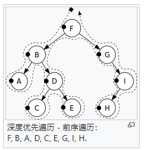
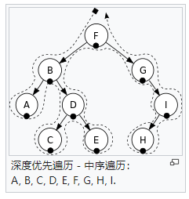
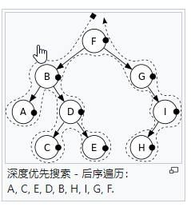
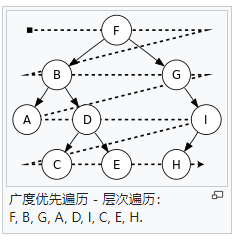

## 深度优先遍历

https://zh.wikipedia.org/wiki/%E6%A0%91%E7%9A%84%E9%81%8D%E5%8E%86#%E5%89%8D%E5%BA%8F%E9%81%8D%E5%8E%86(Pre-Order_Traversal)

#### 前序遍历(Pre-Order Traversal)

指先访问根，然后访问子树的遍历方式

#### 中序遍历(In-Order Traversal)

指先访问左（右）子树，然后访问根，最后访问右（左）子树的遍历方式

#### 后序遍历(Post-Order Traversal)

指先访问子树，然后访问根的遍历方式

## 广度优先遍历

和深度优先遍历不同，广度优先遍历会先访问离根节点最近的节点。二叉树的广度优先遍历又称按层次遍历。算法借助队列实现。

