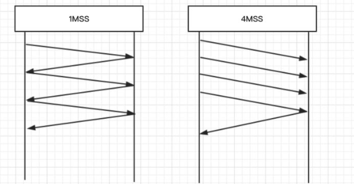

# TCP/IP协议族

四层协议：数据链路层，网络层，传输层，应用层

七层协议：物理层，数据链路层，网络层，传输层，会话层，表示层，应用层

# TCP协议

学习要求：

​	别人问你的时候，可以简单明了的说出TCP协议到底是怎么样的，有什么特点！

参考文档：

​	https://zhuanlan.zhihu.com/p/64155705

TCP协议是面向连接、可靠的、基于字节流的协议

可靠体现：

​	停止等待协议（“停止等待”就是每发完一个分组就停止发送，等待对方的确认。）
​	超时重传协议

> MSS 限制

* 链路层对一次能够发送的最大数据有限制，这个限制称之为 MTU（maximum transmission unit），不同的链路设备的 MTU 值也有所不同，例如
 * 以太网的 MTU 是 1500
 * FDDI（光纤分布式数据接口）的 MTU 是 4352
 * 本地回环地址的 MTU 是 65535 - 本地测试不走网卡
* MSS 是最大段长度（maximum segment size），它是 MTU 刨去 tcp 头和 ip 头后剩余能够作为数据传输的字节数
 * ipv4 tcp 头占用 20 bytes，ip 头占用 20 bytes，因此以太网 MSS 的值为 1500 - 40 = 1460
 * TCP 在传递大量数据时，会按照 MSS 大小将数据进行分割发送
 * MSS 的值在三次握手时通知对方自己 MSS 的值，然后在两者之间选择一个小值作为 MSS

> Nagle 算法

* 即使发送一个字节，也需要加入 tcp 头和 ip 头，也就是总字节数会使用 41 bytes，非常不经济。因此为了提高网络利用率，tcp 希望尽可能发送足够大的数据，这就是 Nagle 算法产生的缘由
* 该算法是指发送端即使还有应该发送的数据，但如果这部分数据很少的话，则进行延迟发送
    * 如果 SO_SNDBUF 的数据达到 MSS，则需要发送
    * 如果 SO_SNDBUF 中含有 FIN（表示需要连接关闭）这时将剩余数据发送，再关闭
    * 如果 TCP_NODELAY = true，则需要发送
    * 已发送的数据都收到 ack 时，则需要发送
    * 上述条件不满足，但发生超时（一般为 200ms）则需要发送
    * 除上述情况，延迟发送

## TCP的滑动窗口机制

如果每次传输数据都只能发送一个MSS，就需要等待接收方的ACK，这显然会极大的影响传输的速率。在发送数据的时候，最好的方式是一下将所有的数据全部发送出去，然后一起确认。（这样可以提高信道利用率，增加吞吐量）

但是现实中确实会存在一些限制：

- 接收方的缓存（接收窗口）可能已经满了，无法接收数据。
- 网络的带宽也不一定足够大，一口发太多会导致丢包事故。

发送方要知道接收方的接收窗口和网络这两个限制因素中哪一个更严格，然后在其限制范围内尽可能多发包。这个一口气能发送的数据量就是传说中的TCP发送窗口。

首先TCP在进行数据传输的时候都是先将数据放在数据缓冲区中的，TCP维护了两个缓冲区，发送方缓冲区和接收方缓冲区。

- **发送方缓冲区**：发送方缓冲区用于存储已经准备就绪数据和发送了但是没有被确认的数据。
- **接收方缓冲区**：接收方缓冲区用于存储已经被接收但是还没有被用户进程消费的数据。

滑动窗口机制是TCP的一种流量控制方法，该机制允许发送方在停止并等待确认前连续发送多个分组，而不必每发送一个分组就停下来等待确认，从而增加数据传输的速率提高应用的吞吐量。

TCP是全双工的，因为他有发送缓冲区和接收缓冲区，发送和接收是分开的。可以用两个线程分别负责发送和接收

窗口实际就起到一个缓冲区的作用，同时也能起到流量控制的作用（发送方可以根据接收方的速度进行发送）

简单的说就是连续发送一个窗口的数据，然后等待ack确认，确认完数据窗口才往后滑动

