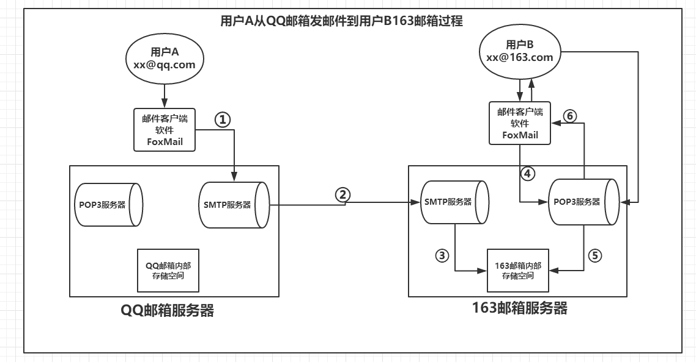

# 邮件实现详解（一）------邮件发送的基本过程与概念 

参考资料： https://www.cnblogs.com/ysocean/p/7652934.html

　电子邮件需要在邮件客户端和邮件服务器之间，以及两个邮件服务器之间进行邮件传递，那就必须要遵守一定的规则，这个规则就是邮件传输协议。下面我们分别简单介绍几种协议（后面会详细讲解）：

　　①、SMTP协议：全称为 Simple Mail Transfer Protocol，简单邮件传输协议。它定义了邮件客户端软件和SMTP邮件服务器之间，以及两台SMTP邮件服务器之间的通信规则。

　　②、POP3协议：全称为 Post Office Protocol，邮局协议。它定义了邮件客户端软件和POP3邮件服务器的通信规则。

　　③、IMAP协议：全称为 Internet Message Access Protocol,Internet消息访问协议，它是对POP3协议的一种扩展，也是定义了邮件客户端软件和IMAP邮件服务器的通信规则。

　　我们说所有的邮件服务器和邮件客户端软件程序都是基于上面的协议编写的。

# 理解邮件传输协议（SMTP、POP3、IMAP、MIME） 

参考资料： https://www.cnblogs.com/diegodu/p/4097202.html

电子邮件需要在邮件客户端和邮件服务器之间，以及两个邮件服务器之间进行传递，就必须遵循一定的规则，这些规则就是邮件传输协议。SMTP协议定了邮件客户端与SMTP服务之间，以及两台SMTP服务器之间发送邮件的通信规则；POP3/IMAP协议定义了邮件客户端与POP3服务器之间收发邮件的通信规则。

