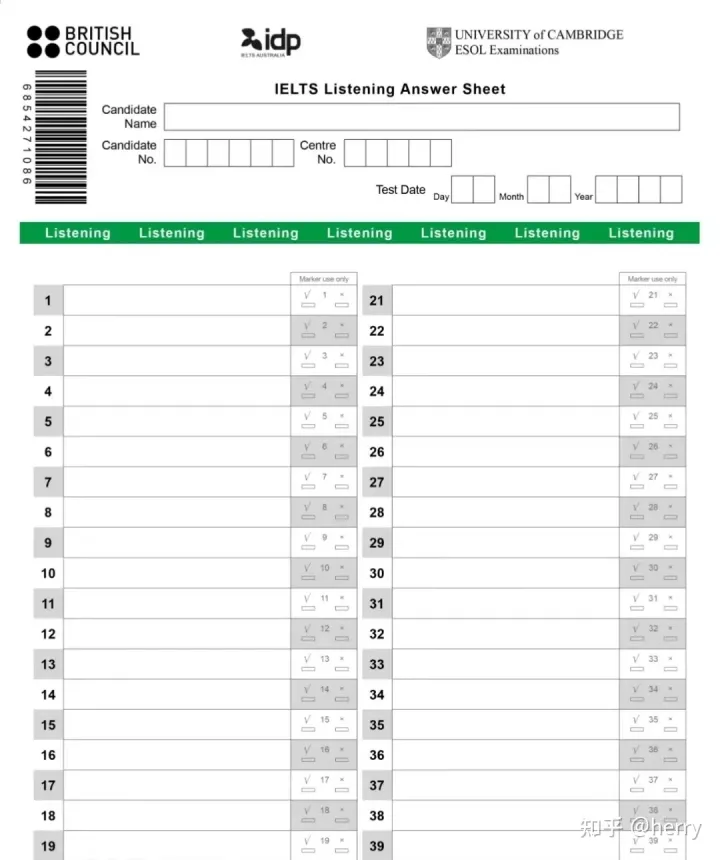

# 考试流程

参考： 

https://www.zhihu.com/question/402397829/answer/2494136196

https://www.zhihu.com/question/402397829/answer/2719207603

**雅思答题卡**

一：考试准备需要什么
二：答题卡怎么填写
三：考试流程时间
四：注意事项

## 一.考试准备需要什么

1身份证
2准考证：会有人不知道准考证去哪打印，可以在雅思报名的官网的个人主页进行打印
3口罩
4手环 ：考试前会先验证你的身份，验证完后，就发放给你一次性的手环
5铅笔和[橡皮](https://www.zhihu.com/search?q=橡皮&search_source=Entity&hybrid_search_source=Entity&hybrid_search_extra={"sourceType"%3A"answer"%2C"sourceId"%3A"2494136196"})：这两个你不需要带，考场会进行发放，请放心~

## **二.答题卡注意事项**

**1答题卡颜色：**大家在拿到答题卡时可以留意答题卡的颜色，听力的答题卡是绿色，阅读的答题卡是蓝色的  小作文是红色的答题卡  大作文是黑色的答题卡。听力和阅读的答题卡在同一张纸上，一定要注意，背面也有答题卡，有的人容易忽略，不知道背面也需要填写。

**2名字填写**：你的名字拼出来，但记住一定是大写！大写！

**[3A类](https://www.zhihu.com/search?q=3A类&search_source=Entity&hybrid_search_source=Entity&hybrid_search_extra={"sourceType"%3A"answer"%2C"sourceId"%3A"2494136196"})还是G类**：这个是单选，也是用铅笔在方框内进行涂黑，这跟我们上学时一样

**4centre number：**这个可能是很多学生陌生的，大家都知道要填写准考证号和姓名，除此之外还要填写centre number，这个一般考试当天会给到同学。一般是让你填写编号
这里的不同的城市编号不一样：

- CN001编号的城市：北京，天津，哈尔滨，长春，沈阳，大连，济南，青岛，西安，乌鲁木齐，郑州，武汉，太原。
- CN002编号的城市：广州，深圳，福州，厦门，海口，南宁
- CN172编号的城市：重庆，成都，昆明，贵阳
- CN004编号的城市：上海，南京，杭州，合肥

但答题卡的细节远不止于此，还有你在听力时填写单词是否大小写，以及写作文前应该先进行测试，看看自己写够单词数量时作文显示在哪个位置，这些都是答题时的细节。

## **三.收发试卷时间安排：**

**8：40—9：00** 可以检查耳机，进行试音，另一方面会发放听力和阅读的答题卡，这里注意一下，跟我们平时考试不一样的是，老师不会一下子把所有答题卡一次性都发放给你，所以没有看到写作答题卡也不要惊慌
**9:00-9：05** 发放[听力试卷](https://www.zhihu.com/search?q=听力试卷&search_source=Entity&hybrid_search_source=Entity&hybrid_search_extra={"sourceType"%3A"answer"%2C"sourceId"%3A"2494136196"})，此时记得在听力试卷填写信息
**9：05—9：35**进行听力播放
**9：35—9：45** 有十分钟填写听力答题卡
**9：45—9：50**监考老师会收听力试卷，注意是收走你的听力试卷不是听力答题卡，因为你还要翻过面进行阅读答题
**9：50—9：55**发放[阅读试卷](https://www.zhihu.com/search?q=阅读试卷&search_source=Entity&hybrid_search_source=Entity&hybrid_search_extra={"sourceType"%3A"answer"%2C"sourceId"%3A"2494136196"})，然后你可以填写信息
**10：00—11：00**阅读部分进行答题考试，这一个小时包含填写答题卡的时间
**11：00—11：10**收听力答题卡和[阅读答题卡](https://www.zhihu.com/search?q=阅读答题卡&search_source=Entity&hybrid_search_source=Entity&hybrid_search_extra={"sourceType"%3A"answer"%2C"sourceId"%3A"2494136196"})，此时还会收走你的阅读试卷，然后还会发放[写作试卷](https://www.zhihu.com/search?q=写作试卷&search_source=Entity&hybrid_search_source=Entity&hybrid_search_extra={"sourceType"%3A"answer"%2C"sourceId"%3A"2494136196"})和写作答题卡。
**11：10—12：10**写作答题，建议先写[大作文](https://www.zhihu.com/search?q=大作文&search_source=Entity&hybrid_search_source=Entity&hybrid_search_extra={"sourceType"%3A"answer"%2C"sourceId"%3A"2494136196"})后写小作文
**12：10—12：20** 收大小作文答题卡

## **四.注意事项：**

1因为雅思考试不断的更新，市面上有很多版本的答题卡，大多都是旧版的，大家在参加考试之前一定要熟悉填写，最好找最近版本的答题卡进行训练！

2如果填写答案时，在答题卡上填错位置时该怎么办》听我的，千万不要自作聪明，最好的方法就是找监考老师沟通！这一定是[最优解](https://www.zhihu.com/search?q=最优解&search_source=Entity&hybrid_search_source=Entity&hybrid_search_extra={"sourceType"%3A"answer"%2C"sourceId"%3A"2494136196"})！

# 选择机考和纸考

选择机考，因为可以一天考完， 上午听力，阅读，写作。 下午，口语

# 其他文章

## 想问一下普通水平雅思6.5大概能多久拿下？

**少则2-3个月，多则4-6个月。也有辛苦准备一年的**， **取决于高效的复习方法和行动力。**

https://www.zhihu.com/question/347829253/answer/2721921425

# 听力

# 口语

# 阅读

# 写作

